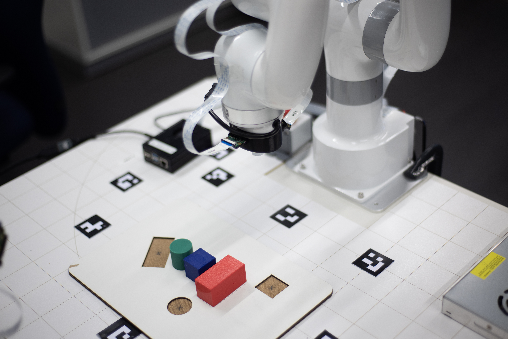
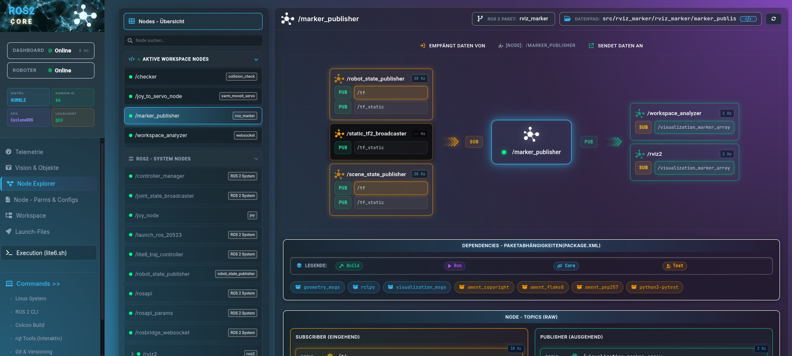
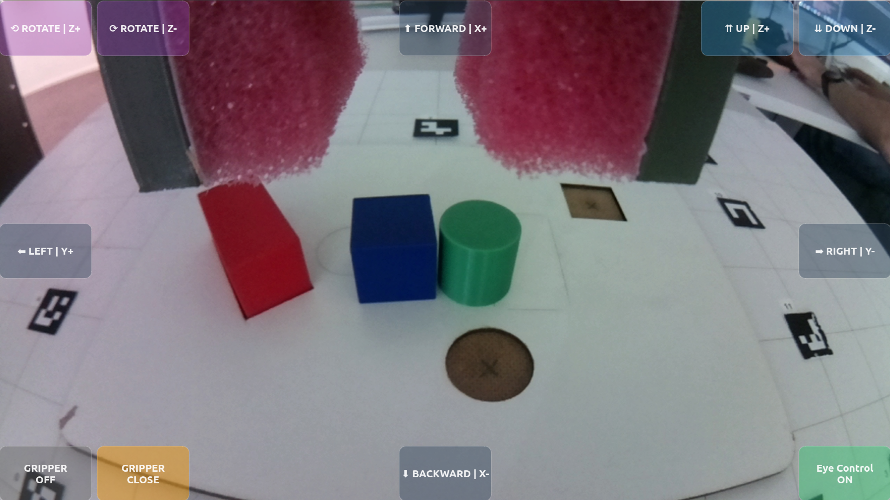
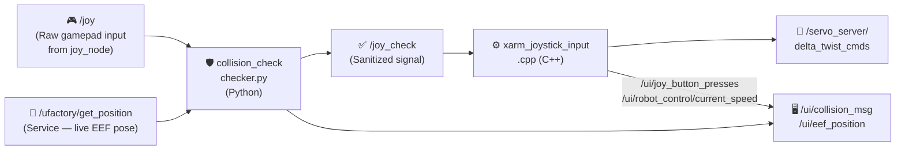
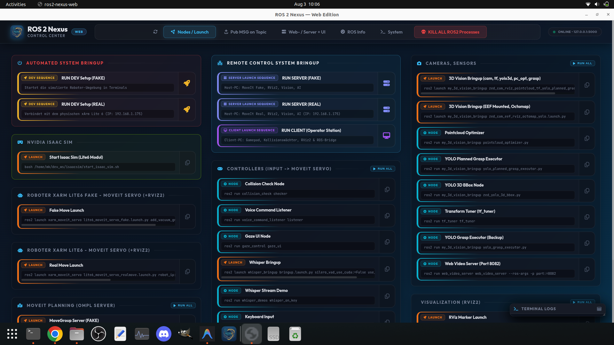

# xArm ROS 2 Extended Workspace (ROS2 Humble) **[IN DEV]**

This repository is a continuously evolving research and evaluation platform for multimodal teleoperation and Human-Computer Interaction (HCI). <br>
> [!IMPORTANT]
> **Core Prerequisite:** This repository is an *extension workspace*. It is built entirely on top of the official [xarm_ros2 repository (Branch: humble)](https://github.com/xArm-Developer/xarm_ros2/tree/humble) from UFactory. The official repository, its structure, and all of its system dependencies form the mandatory foundational baseline for this software!

<p align="center">
  
</p>

## Table of Contents
1. [📋 Project Overview](#chapter-1)
2. [🔬 Architecture & Guiding Principles](#chapter-2)
3. [📊 Monitoring: Dashboard & Workspace Analyzer](#chapter-3)
4. [🕹️ Multimodal Technologies & Interaction Concepts](#chapter-4)
5. [⚙️ Core Features & ROS 2 Nodes](#chapter-5)
6. [🎮 Gamepad Control — Deep Dive](#chapter-6)
7. [📦 Dependencies & Requirements](#chapter-7)
8. [🚀 Execution: How to Run the System](#chapter-8)
9. [🗂️ Repository Structure](#chapter-9)

---

## <a id="chapter-1"></a> 1. 📋 Project Overview

### Concept: An Integrated, Multimodal Teleoperation Platform
The primary goal of this project is the development and implementation of a modular control and interaction platform for the UFactory xArm Lite 6 robot arm. The system consolidates heterogeneous, multimodal input methods into a centralized software environment and places a consistent focus on maximized usability and intuitive operation. The system handles the calculation of complex robot movements in the background. This creates a simple interface that directly translates the user's intentions into robotic actions.

### Motivation: Assistance, Inclusion, and Participation in the Context of Industry 5.0
In practice, classical methods of teleoperation and robot control are highly error-prone and demand immense cognitive fine control and technical expertise from the operator. These high barriers exclude many people from direct usage. In the spirit of the Industry 5.0 guiding principles—which place the human, sustainability, and resilience at the center of industrial production—this project starts exactly here:

* **Lowering Technical Barriers:** Reducing entry thresholds by shifting from low-level joint coordination toward intuitive high-level commands.
* **Promoting Inclusion:** Creating technological conditions to enable productive and equal participation in the modern workplace, even for people with different physical or cognitive capabilities.
* **Human-Machine Synergy:** Establishing the robot as an assistive tool that relieves the human instead of replacing them.

### Operating Principle: Shared Control and the "Human-in-the-Loop" Paradigm
The technological foundation of the platform is based on a dynamic *shared control* approach, where human and machine interact cooperatively. The user remains permanently integrated into the control loop as a supervisor (*Human-in-the-Loop*), but controls the system through a tiered, complementary interaction pattern:

* **Intuitive High-Level Commands:** Initiating global actions or target specifications via natural modalities such as gaze control (eye tracking) or voice commands.
* **Precise Low-Level Corrections:** Seamless, low-latency switching to manual input devices (e.g., gamepad/MoveIt Servo) for sensitive adjustments in the workspace.
* **Context-Sensitive Assistance:** Autonomous path planning and collision-free trajectory calculation in the background to actively safeguard the operator during execution.

### Objective: A Valid, Cost-Effective Proof-of-Concept
The project presents itself as a fully functional, reproducible, and economically affordable Proof-of-Concept (PoC) for academic research landscapes and practice-oriented inclusion projects. The open architecture serves as a standardized evaluation platform on which novel assistive robotics systems can be developed, tested, and empirically validated under realistic conditions.

### Evaluation Logic & Guidelines: From Research to Industrial Practice
A key core and innovative character of the project lies in the scientific analysis of interaction quality. The system serves not only as a technical demonstrator, but as a tool to generate transferable knowledge:

* **Development of an Evaluation Logic:** Systematic capture and measurement of usability, cognitive load, and system performance for quantitative assessment of the human-robot interface.
* **Derivation of Action Recommendations:** Formulation of standardized guidelines that serve companies as a strategic guide during the introduction of modern robot systems.
* **Answering the Transformation Question:** Concrete practical assistance on the core question: *“How can processes and workplaces be structured to measurably meet the human-centered requirements of Industry 5.0?”*
* **Service Potential:** The resulting frameworks and guidelines have the potential to be provided as a validated, monetizable consulting and service offering for industry, accompanying digital and demographic changes in production.

## <a id="chapter-2"></a> 2. 🔬 Architecture & Guiding Principles

### 2.1 Operating Modes: FAKE vs. REAL (Hardware Interfaces)
The platform strictly distinguishes between two operating modes for the robot arm. This distinction refers **exclusively to the `ros2_control` hardware interface** and is independent of sensors (like the camera or YOLO, which can run live in both modes):

* **FAKE (Simulation Mode):** The robot runs via the `mock_components/GenericSystem` (or FakeSystem) hardware interface within `ros2_control`. There is no physical controller connection. Commands to the `/lite6_traj_controller` or `/servo_server` are purely virtually rendered in RViz2 by mirroring the joint states. Proprietary UFactory API calls (like Mode/State switches) intentionally lead nowhere in this mode or are bypassed in software.
* **REAL (Hardware Mode):** The `ros2_control` framework integrates the real `xarm_api` hardware interface, which communicates directly via TCP/IP with the physical controller of the xArm Lite 6. In this mode, hardware limits, physical safety stops, and the exclusive switching of proprietary xArm hardware modes (e.g., Mode 0 for pose control vs. Mode 1 for Servo/jogging) take effect via the UFactory API.

### 2.2 The System Concept: An Integrated Development, Evaluation, and Validation Platform
The core objective of the project is the realization of a modular, platform-based software architecture for multimodal teleoperation and AI-supported assistive robotics. The system acts as a central, software-side integration node (middleware level) that unifies heterogeneous subsystems into a consistent runtime environment. Through a distributed server-client network (multi-PC setup) and the software-side coupling to a real-time capable Digital Twin (NVIDIA Isaac Sim), the platform serves as both a flexible development environment and a standardized, replicable test environment. The project is explicitly designed as a closed loop of development and empirical validation:

* **Sensors & Perception:** Integration of depth cameras (e.g., object detection via YOLO, marker tracking) and tactile or physiological sensors for state estimation.
* **Multimodal Control:** Parallel integration of various input channels such as eye-tracking systems for gaze target acquisition, voice control (e.g., via OpenAI Whisper), and classic hardware controllers (gamepads, 3D mice).
* **Cognitive Robotics:** Integration of modern Vision-Language-Action (VLA) models to translate highly abstract textual and visual commands directly into robotic action sequences.
* **Integrated Data Acquisition:** Time-synchronized recording of technical performance parameters and human interaction data via a central logging infrastructure during system use.

### Human-Centered Automation
The system architecture places the human operator at the center of the interaction design. The system is designed to allow users to cognitively grasp the current state of automation throughout operation and to anticipate subsequent system actions. This transparency dismantles algorithmic black-box structures, bringing significant advantages for practical application:

* **Cognitive Transparency:** Consistent comprehensibility of system states, especially during the parallel processing of gaze patterns and sensory feedback.
* **Informed Intervention:** Empowering the operator to make safe and targeted interventions in critical or unforeseen interaction situations.
* **Calibrated Trust in Automation:** Creating a reliable technological basis for systematically building *trust in automation*, which is evaluated through user studies.

### Shared Control & Cognitive Relief
A key feature of the software architecture is the implementation of *shared control* paradigms for cooperative task execution. The platform enables a seamless, low-latency transfer of control authority between manual guidance, gaze-controlled interactions, and AI-assisted, semi-automated assistance functions. The context-dependent distribution of control shares targets the following core aspects:

* **Seamless Control Handover:** Low-latency switching between manual input (e.g., via MoveIt Servo / gamepad) and autonomous system actions (e.g., gaze-based grasping).
* **Minimizing Mental Workload:** Targeted reduction of the user's mental workload during complex or long-lasting manipulation tasks.
* **Autonomous Error Compensation:** Independent mitigation of error-prone low-level corrections by the system, thereby freeing up cognitive resources for high-level process monitoring.
* **Empirical Validation:** Ongoing verification of actual cognitive relief throughout the project using standardized psychometric methods.

### HCI & Usability Focus & Empirical Evaluation
The design of the central control interface (GUI) follows established principles of Human-Computer Interaction (HCI). Interaction patterns shift from the complex coordination of individual degrees of freedom or manually invoking distributed terminal processes toward intention-based task completion. An integral part of the project is conducting systematic user studies to evaluate these multimodal interfaces:

* **Intention-Based Control:** Translating abstract action intents (via voice, gaze target, or high-level controller) into precise kinematic trajectories.
* **Standardized Usability Metrics:** Collection of subjective usability via established questionnaires such as the *System Usability Scale* (SUS).
* **Objective Performance Parameters:** Measuring quantitative factors such as *task completion time*, error rates, and specific gaze paths.
* **Load Analysis:** Empirical verification of the participants' cognitive load using the *NASA-TLX* index for iterative system optimization.

### Reproducible & Open Source
To ensure scientific validity, the project is designed as an open-source architecture. Disclosing the complete codebase ensures the methodological transparency of all algorithms, configurations, and data flows. For the scientific community, this yields key added value:

* **Methodological Transparency:** Full visibility of all underlying algorithms, URDF models, and MoveIt configurations.
* **Exact Replication:** Enabling straightforward secondary investigations by independent research groups under identical conditions.
* **Statistical Verifiability:** Traceability and validation of complex, recorded sensor data streams and control inputs.
* **Standardized Benchmark:** Establishing the platform as a reliable baseline for comparative studies in the field of assistive and inclusive robotics.

### Cost-Effective Hardware
The system configuration is primarily based on economically affordable, commercially available off-the-shelf components (COTS), without compromising the required precision and functional reliability. This approach pursues clear strategic goals:

* **Democratizing Access:** Reducing investment and financial barriers when entering modern, multimodally controlled robotics technologies.
* **Target Audience Transfer:** Facilitating technology transfer into inclusive projects, educational institutions, and smaller research facilities (e.g., via the UFactory xArm Lite 6 and consumer controllers).
* **Validating Reliability:** Targeted scientific evaluation of the extent to which cost-effective hardware represents a valid research platform in direct comparison to high-priced industrial systems.

### Modular & Industry Standard
The software-side infrastructure is modularly encapsulated and fully integrated into the ROS 2 Humble middleware framework. The native use of standardized communication primitives ensures interoperability with industrial ecosystems. The consistent modular principle offers crucial architectural advantages:

* **Native ROS 2 Communication:** Full compatibility with established ecosystems (like MoveIt 2) and modern sensor SDKs via nodes, topics, services, and actions.
* **Isolated Subsystem Encapsulation:** Straightforward replacement or extension of individual modules—such as VLA pipelines for intent recognition or specific eye-tracking drivers.
* **Future-Proofing & Portability:** Low-maintenance software structure allowing easy migration to future ROS 2 LTS distributions without modifying the overall platform.

---

## <a id="chapter-3"></a> 3. 📊 Monitoring: Dashboard & Workspace Analyzer

Once the nodes are launched via ROS 2 Nexus, the live state of the system can be monitored using the **ROS2 Core Dashboard**. This is a web-based real-time UI, which fuses static source code analysis with live ROS 2 network telemetry into a unified monitoring interface.

### 3.1 Workspace Analyzer Backend (`workspace_analyzer.py`)
The Workspace Analyzer Backend is a ROS 2 node that performs execution-free, regex-based static code analysis. It has been highly modularized into three core files: `workspace_analyzer.py` (handles ROS Pub/Sub), `workspace_parser.py` (executes the regex analysis), and `system_utils.py` (parses environment variables). It extracts node names, publishers, subscribers, services, actions, and package dependencies. These structured JSON metadata are continuously published to `/dashboard/workspace_metadata` via a 10-second timer cycle. Additionally, it reads environment variables (ROS Distro, Domain ID, DDS middleware, Localhost mode) from `~/.bashrc` and provides them as live status badges.

> **Note on `workspace_analyzer.py`:** This is **not** a network server, but a standard ROS 2 node. The Dashboard accesses its published topics via the ROS Bridge (Port 9090).

### 3.2 Frontend (`dashboard_index.html`)
Connects to the ROS network via WebSocket (`rosbridge_server` on port 9090). The frontend logic has been strictly modularized into 8 specialized JavaScript files (e.g., `dashboard_script_nodes.js`, `dashboard_script_graph.js`, `dashboard_script_ros.js`) for maintainability. It visually matches statically analyzed nodes against the currently running nodes, displays real-time topic frequencies (Hz), and enables direct execution of system scripts from the browser in a clean, single-column reference view. The UI employs a modern Glassmorphism design aesthetic and performs recursive JSON parsing to cleanly format nested ROS message payloads. The sidebar provides at-a-glance status information including connection health, robot availability, and the active ROS 2 environment configuration.



### 3.3 Launch Commands for UI Components
*Launch these components via ROS 2 Nexus, or manually via terminal:*
* **Workspace Analyzer Backend:** `python3 src/websocket/workspace_analyzer.py`
* **Web Server:** `python3 -m http.server 8080 -d src/websocket`
* *(Dashboard accessible at: `http://localhost:8080/dashboard_index.html`)*

---

## <a id="chapter-4"></a> 4. 🕹️ Multimodal Technologies & Interaction Concepts

### 4.1 Robot Control Methods (Inputs)
**Gamepad Teleoperation:** <br> 
* Low-latency, continuous fine control using Xbox One Elite Series 2 Controller (incl. haptic feedback - vibration on collision risk).

**Voice Control:** <br> 
* Local speech processing (Whisper AI) for semantic, intention-based control via microphone.

**Eye-Tracking** (in progress...): <br> 
* Robot control and UI interaction (gaze tracking) via Tobii Pro Glasses 3.

**Gesture Control** (in progress...): <br> 
* Touchless, intuitive hand and finger recognition for direct spatial manipulation and gesture control using Leap Motion.

**VR Controller Control** (in progress...): <br>
* Immersive, spatial teleoperation through precise 6DoF tracking (Six Degrees of Freedom) and haptic feedback using Virtual Reality controllers.

### 4.2 Perception & Assistance
**Computer Vision:** <br> 
* **[DEPRECATED]** Spatial 2D object detection and localization using *YOLO* via PiCameras. The ZED Mini camera natively handles this in 3D.
**Stereo Vision:** <br>
* Integration of true 3D depth data via a *ZED Mini (Stereolabs)* camera.
**VLA & Video Action Models (Planned):** <br>
* AI-assisted action planning through *Vision-Language-Action* models.

### 4.3 Coordinate Transformation & Calibration
**ArUco Marker System [DEPRECATED]:** <br> 
* *[Deprecated]* Markers placed in the robot's operating area serve as reference for homography matrices.
* *[Deprecated]* Derivation of 3D world coordinates for objects on the work surface (Z = 90 mm).
* Precise projection of eye-tracking gaze coordinates onto the control **UI** to translate gaze into robot commands.

### 4.4 User Interfaces (UI/GUI)
For cognitively relieving teleoperation, the user is provided with a central, immersive user interface that consolidates all system states.

**Telemetry & Status:** <br> 
* Continuous display of real-time telemetry data from the robot arm.
  
**System Feedback & Intent Recognition:** <br>
* Direct visual and acoustic feedback for manual control inputs as well as successfully parsed voice commands.
  
**Preventive Collision Warnings:** <br> 
* Dynamic warnings when software-based collision protection measures are triggered (e.g., falling below the Z-limit).
  
**Visual Monitoring & Object Detection:** <br>
* Seamless integration of video livestreams with live overlays of detected target objects (YOLO bounding boxes) as well as a synchronized 3D visualization (Digital Twin) of the work environment.

**Implementation via OBS Studio:**<br>
* In *OBS Studio*, all components are consolidated and provided to the user as a central GUI for robot teleoperation.*


**Gaze Control User Interface**<br>



---

## <a id="chapter-5"></a> 5. ⚙️ Core Features & ROS 2 Nodes

To provide a clear understanding of the architecture, the software modules are categorized by their functional **Features (Use-Cases)**. Each module is explicitly labeled as a ROS 2 Node, Script, or Plugin.

### 🎮 5.1 Feature: Gamepad Teleoperation & Hard Collision Protection
*This node manages the manual jogging of the robot via the Xbox controller and actively prevents the robot from crashing into the table due to operator error.*

* **`xarm_joystick_input.cpp` [NODE]**
    * 🎯 **Purpose & Task:** Translates the sanitized gamepad signals (analog sticks & triggers) into Cartesian velocity commands (`TwistStamped`) for MoveIt Servo. Applies exponential smoothing and handles all button mappings.
    * 🟠 ↘️ **Subscribes:** `/joy_check` (`sensor_msgs/Joy`). Reads the sanitized controller inputs from the guardian node.
    * 🟢 ↗️ **Publishes:** `/servo_server/delta_twist_cmds` (`geometry_msgs/TwistStamped`). Sends motor currents/velocities to the Servo Server.
    * 🔄 **Services:** `/servo_server/start_servo`, `/servo_server/stop_servo`, `/servo_server/switch_command_type` (Clients).
* **`checker.py` (`collision_check`) [NODE]**
    * 🎯 **Purpose & Task:** Acts as a guardian *before* the movement translation. Predictively computes the Z-coordinate (0.1 sec into the future). If the robot were to touch the table, the controller's downward command is hard-overridden and blocked. Triggers gamepad rumble feedback (vibration).
    * 🟠 ↘️ **Subscribes:** `/joy` (`sensor_msgs/Joy`), `/servo_server/status` (`std_msgs/Int8`). Reads the raw controller input and status codes of the Servo Server (e.g., collision warnings from YOLO boxes).
    * 🟢 ↗️ **Publishes:** `/joy_check` (`sensor_msgs/Joy`), `/joy/set_feedback` (`sensor_msgs/JoyFeedbackArray`). Forwards the (potentially zero-corrected) command to the `joystick_input` and controls controller vibration.
    * 🔄 **TF2:** Listens to the current TCP height (`link_base` -> `link_tcp`).
    * ⚙️ **Parameters:**
        * `look_ahead_time = 0.1` – Prediction horizon (seconds) for the velocity look-ahead.
        * `table_z_threshold = 0.0` – The hard table barrier on the Z-axis (World-Frame).
* **`xarm_moveit_servo` [CONFIGURATION / NODE]**
    * 🎯 **Purpose & Task:** The real-time motion engine from MoveIt. Reacts to dynamic obstacles (YOLO boxes) via a `threshold_distance` parameter and halts the arm before it collides with objects.
    * 🟠 ↘️ **Subscribes:** `/servo_server/delta_twist_cmds` (`geometry_msgs/TwistStamped`), `/planning_scene` (`moveit_msgs/PlanningScene`).
    * 🟢 ↗️ **Publishes:** `/lite6_traj_controller/joint_trajectory` (`trajectory_msgs/JointTrajectory`). Sends the final joint angles to the robot.
    * ⚙️ **Parameters (`xarm_moveit_servo_config.yaml`):**
        * `collision_check_type: threshold_distance` – Hard-blocks the kinematics at the boundary, instead of slowly decelerating (`stop_distance`).
        * `collision_distance_safety_margin: 0.02` – Defines the 2 cm wide, invisible collision bubble around the robot.

### 🟢 5.2 Feature: Autonomous Grasping & 3D Object Detection (YOLO / ZED)
*This node is responsible for locating objects in 3D space, generating virtual obstacles, and navigating the robot precisely to the target.*

* **`zed_wrapper` [NODE]**
    * 🎯 **Purpose & Task:** The native hardware driver for the Stereolabs ZED Mini Camera. 
    * 🟢 ↗️ **Publishes:** `/zed/zed_node/rgb/image_rect_color` (`sensor_msgs/Image`), `/zed/zed_node/depth/depth_registered` (`sensor_msgs/Image`), `/zed/zed_node/point_cloud/cloud_registered` (`sensor_msgs/PointCloud2`). Provides the sensory foundation for the entire system.
    * ⚙️ **Parameters (`zed_camera.launch.py`):**
        * `depth_mode: ULTRA` – Forces the most dense 3D point cloud for clean edge calculation.
        * `auto_exposure: True` – Allows automatic brightness compensation for robust YOLO detection.
* **`zed_yolo_3d_bbox.py` [NODE]**
    * 🎯 **Purpose & Task:** Processes the RGB and Depth streams in parallel using GPU acceleration and the **YOLOv8 Large** model. Isolates objects, filters depth noise (percentiles & EMA smoothing), and computes millimeter-accurate 3D bounding boxes grounded to the table plane (including a grasp point marker).
    * 🟠 ↘️ **Subscribes:** `/zed/zed_node/rgb/image_rect_color` (`sensor_msgs/Image`), `/zed/zed_node/depth/depth_registered` (`sensor_msgs/Image`), `/zed/zed_node/rgb/camera_info` (`sensor_msgs/CameraInfo`).
    * 🟢 ↗️ **Publishes:** `/zed/bboxes_3d` (`visualization_msgs/MarkerArray`). Sends the finalized 3D boxes and markers to RViz for visualization and to downstream nodes.
    * ⚙️ **Parameters:**
        * `percentiles: [2, 98]` – Hard-clips extreme depth noise pixels ("flying pixels" at object edges).
        * `ema_alpha: 0.3` – Smoothing factor (Exponential Moving Average) to eliminate box jittering between frames.
* **`yolo_moveit_collision.py` [NODE]**
    * 🎯 **Purpose & Task:** Seamlessly converts the detected 3D boxes into dynamic MoveIt `CollisionObject` messages and injects them into the planning scene as solid obstacles.
    * 🟠 ↘️ **Subscribes:** `/zed/bboxes_3d` (`visualization_msgs/MarkerArray`). Reads the bounding boxes.
    * 🟢 ↗️ **Publishes:** `/planning_scene` (`moveit_msgs/PlanningScene`). Sends the `CollisionObjects` directly to the MoveIt Planning Scene to avoid collisions during grasping/driving.
* **`yolo_grasp_executor.py` [NODE]**
    * 🎯 **Purpose & Task:** The "brain" of the autonomous grasping pipeline. Reads the UI input field ("Grasp Object"), retrieves the box coordinates, and safely navigates the robot via an internal P-Controller to the target (first lifting to Z=300mm, then moving directly).
    * 🟠 ↘️ **Subscribes:** `/ui/grasp_object_cmd` (`std_msgs/String`), `/zed/bboxes_3d` (`visualization_msgs/MarkerArray`). Waits for the text command from RViz and scans the marker arrays for the corresponding object grasp point.
    * 🟢 ↗️ **Publishes:** `/ui/grasp_status` (`std_msgs/String`). Sends live feedback for the log window in the RViz Panel.
    * 🔄 **Services:** `/ui/execute_move_to_pose` (Client). Passes the final X/Y/Z coordinates to the movement node.
    * ⚙️ **Parameters:**
        * `safe_z_mm = 300` – Guarantees an absolute safety fly-over height before the grasping routine dives vertically down.
* **`zed_stand_publisher.py` [SCRIPT]**
    * 🎯 **Purpose & Task:** Mathematically generates the exact 3D mesh model of the camera tripod (aluminum profile) and publishes it statically in RViz.
    * 🟢 ↗️ **Publishes:** `/zed_stand_marker` (`visualization_msgs/Marker`).
* **`tf_tuner.py` [SCRIPT / UI]**
    * 🎯 **Purpose & Task:** A live tuner interface (PyQt5) to quickly adjust camera offsets without restarting nodes.
    * 🟢 ↗️ **Publishes:** Dynamically updates the TF broadcaster values (`tf2_msgs/TFMessage` on `/tf_static`).

### 🗣️ 5.3 Feature: Multimodal Interaction (Voice & Gaze Control)
*These experimental modules allow for "hands-free" control of the system.*

* **`ros2_whisper` [NODE]**
    * 🎯 **Purpose & Task:** Local Speech-to-Text AI. Runs Whisper AI continuously on the microphone stream and publishes spoken words as text.
    * 🟢 ↗️ **Publishes:** `/whisper/text` (`std_msgs/String`).
* **`voice_command_listener.py` [NODE]**
    * 🎯 **Purpose & Task:** Analyzes the raw text using regex patterns, filters out "spam" words, and extracts defined action intents (e.g., "move to red").
    * 🟠 ↘️ **Subscribes:** `/whisper/text` (`std_msgs/String`).
    * 🟢 ↗️ **Publishes:** `/voice_cmd` (`std_msgs/String`), `/ui/voice_feedback` (`std_msgs/String`). Forwards structured recognized commands and sends UI feedback to the dashboard.
* **`gaze_control.py` [SCRIPT / UI]**
    * 🎯 **Purpose & Task:** An isolated PyQt5 "God-Mode" user interface. Maps eye-tracking gaze points (via RTSP gaze data) to button clicks (e.g., at 0.5 sec fixation time) and sends movement commands.
    * 🟢 ↗️ **Publishes:** `/voice_cmd` (`std_msgs/String`). Translates gazes into text-based target commands.

### 🖥️ 5.4 Feature: Graphical Control & Visual Feedback
*Tools for the operator for manual positioning and visual monitoring in RViz and the Web.*

* **`rviz_robot_control_panel.cpp` [RVIZ PLUGIN]**
    * 🎯 **Purpose & Task:** The native 2D control panel written in C++ for RViz. Provides D-Pad buttons, the **"Grasp Object"** input field (including a live log terminal), and quick-access buttons ("Initial Pose", "Vision Scan"). It only sends service triggers and never freezes the UI.
    * 🟠 ↘️ **Subscribes:** `/ui/grasp_status` (`std_msgs/String`). Reads logs for the integrated text window.
    * 🟢 ↗️ **Publishes:** `/servo_server/delta_twist_cmds` (`geometry_msgs/TwistStamped`), `/ui/grasp_object_cmd` (`std_msgs/String`). Sends jogging velocities and the YOLO target string.
    * 🔄 **Services:** `/ui/execute_initial_pose`, `/ui/execute_move_to_pose`, `/ui/execute_scan_trajectory` (Clients).
* **`set_pose_moveit_node.py` [NODE]**
    * 🎯 **Purpose & Task:** Executes the commands from the Control Panel invisibly in the background. Features an intelligent startup trigger (automatically moves to the initial pose) and a robust Cartesian P-Controller for direct coordinate approaches (avoiding IK crashes).
    * 🟠 ↘️ **Subscribes:** `/ui/robot_control/current_speed` (`std_msgs/Float64`). Scales the velocity of the P-Controller synchronously with the UI.
    * 🟢 ↗️ **Publishes:** `/servo_server/delta_twist_cmds` (`geometry_msgs/TwistStamped`), `/lite6_traj_controller/joint_trajectory` (`trajectory_msgs/JointTrajectory`).
    * 🔄 **Services:** Provides `/ui/execute_initial_pose` and `/ui/execute_move_to_pose` as Server. Has a TF2 listener for real-time TCP coordinates.
    * ⚙️ **Parameters (P-Controller):**
        * `Kp_pos = 2.5` – Proportional gain for dynamic, yet stable approaches.
        * `max_vel_pos = 0.2` – Limits the TCP velocity to 0.2 m/s.
        * `position_tolerance = 0.002` – The controller stops exactly 2 mm before the absolute target.
* **`rviz_overlay.py` & `servo_status_overlay.py` [NODES]**
    * 🎯 **Purpose & Task:** Project colorful warning messages (e.g., "COLLISION!") and live axis coordinates directly onto the camera lens within the RViz viewport.
    * 🟠 ↘️ **Subscribes:** `/servo_server/status` (`std_msgs/Int8`), `/ui/collision_msg` (`std_msgs/String`), `/ui/robot_control/current_frame` (`std_msgs/String`). Listens for critical warning flags and frame updates.
    * 🟢 ↗️ **Publishes:** Uses `rviz_2d_overlay_msgs/OverlayText`.
* **`rviz_scene_objects_MarkerArray.py` [NODE]**
    * 🎯 **Purpose & Task:** Publishes ROS `MarkerArray` messages into the 3D scene of RViz2 (e.g., visual table edges).
    * 🟢 ↗️ **Publishes:** `/scene_markers_array` (`visualization_msgs/MarkerArray`).
* **`rosbridge_server` [NODE]**
    * 🎯 **Purpose & Task:** Standard WebSocket bridge on Port 9090, allowing the web-based dashboard to access the ROS network directly.

### 🤖 5.5 Feature: Complex Trajectories & Task Coordination
*Nodes that orchestrate specific, higher-level movement sequences.*

* **`scan_trajectory_node.py` [NODE]**
    * 🎯 **Purpose & Task:** Generates a continuous spiral path planning around an object (e.g., triggered by the "Vision Scan" button). Rapidly computes look-at quaternions to keep the camera center permanently focused on the object.
    * 🟢 ↗️ **Publishes:** `/servo_server/delta_twist_cmds` (`geometry_msgs/TwistStamped`).
    * 🔄 **Services:** Provides `/ui/execute_scan_trajectory` as Server. TF2 listener for real-time TCP coordinates.
    * ⚙️ **Parameters (Trajectory):**
        * `radius = 0.2` – Orbit radius of 20 cm around the target.
        * `z_start = 0.4` / `z_end = 0.15` – Start and end height for the downward spiral movement.
        * `velocity_hz = 50` – High frequency rate (50Hz) for smooth injection into MoveIt Servo.
* **`motion_sequence.py` [NODE]**
    * 🎯 **Purpose & Task:** State management between MoveIt Servo and Hardware. Pauses the fluid Servo jogging (gamepad), interrupts the xArm hardware controller, executes a static movement, and seamlessly reactivates Servo afterward.
    * 🔄 **Services:** `/execute_motion_to_pose` (Server). Also calls hardware-specific UFactory services (`set_mode`, `set_state`).
* **`move_to_coordinator.py` [NODE]**
    * 🎯 **Purpose & Task:** Orchestrates look-at commands (voice/gaze) and passes parameters to other motion nodes.
    * 🟠 ↘️ **Subscribes:** `/voice_cmd` (`std_msgs/String`), `/objects/.../world_poses` (`geometry_msgs/PoseArray`).

### ⚠️ 5.6 Deprecated Modules
*Historical modules that have been replaced by newer systems (e.g., ZED Mini).*

* **`yolo_object_detector` [SCRIPT / NODE]**
    * 🎯 **Purpose & Task:** *[Deprecated]* The old 2D-based object detection using Raspberry Pi cameras. Transformed YOLO bounding boxes via `cv2.findHomography` and flat ArUco markers into rigid 3D space (Z=90 mm). Fully replaced by the `my_zed_tf_bringup` (3D Vision System).
    * 🟢 ↗️ **Publishes:** `/objects/<color>_<shape>/world_poses` (`geometry_msgs/PoseArray`).

---

## <a id="chapter-6"></a> 6. 🎮 Gamepad Control — Deep Dive

This section provides a full technical reference for the two-node gamepad pipeline that enables real-time, collision-safe teleoperation of the xArm Lite 6 using an Xbox One Elite Series 2 Controller.

### 6.1 Pipeline Architecture

The gamepad signal is processed in two sequential stages before reaching the MoveIt Servo server. This two-node design cleanly separates **safety enforcement** (Python) from **motion translation** (C++):



---

### 6.2 `checker.py` — Collision Guard (Python Node)

**File:** `src/collision_check/collision_check/checker.py`

This node acts as a transparent **safety proxy** between the raw joystick driver and the motion controller. It is **100% hardware-agnostic** (works identically in REAL and FAKE modes). Every incoming `/joy` message triggers a synchronous `tf2_ros` lookup to read the real-time EEF position (`link_base` to `link_tcp`); only after retrieving the coordinates is the (potentially modified) signal forwarded. It also actively provides **haptic feedback** (gamepad vibration) whenever the robot approaches the table or encounters a dynamic YOLO bounding box obstacle via MoveIt Servo.

#### 6.2.1 Predictive Collision Algorithm

The node does not simply check the current Z position — it **predicts where the end-effector will be** within the next `LOOKAHEAD_TIME` seconds and blocks movement if that predicted position violates the safety limit:

```
trigger_intensity  = (1.0 - axes[RT]) / 2.0        # 0.0 (released) → 1.0 (full press)
target_z_velocity  = V_max × speed_factor × trigger_intensity
effective_velocity = target_z_velocity × α          # α = ACCELERATION_FACTOR = 0.9
predicted_z        = current_z − (effective_velocity × Δt)

if predicted_z < Z_LIMIT:
    axes[RT] = 1.0  # zero the downward command
```

| Parameter | Value | Description |
|---|---|---|
| `Z_LIMIT` | `96.5 mm` | Hard floor — downward motion is blocked at this height |
| `CAUTION_ZONE_START` | `110.0 mm` | Soft zone entry — speed clamped to 25% of current level |
| `CAUTION_ZONE_SPEED` | `0.25` | Max speed factor inside the caution zone |
| `MAX_LINEAR_VELOCITY_MM_S` | `75.0 mm/s` | Assumed max linear velocity for prediction |
| `LOOKAHEAD_TIME` | `0.1 s` | Prediction horizon |
| `ACCELERATION_FACTOR` (α) | `0.9` | Velocity damping factor applied to prediction |
| `DOWN_TRIGGER_AXIS` | `5` (RT) | Joy axis index for the downward trigger |

#### 6.2.2 Two-Tier Safety Model

```
Z > 110 mm   → Full speed, no restrictions
110 mm ≥ Z > 96.5 mm  → ⚠️  CAUTION ZONE: speed clamped to 25%
Z ≤ 96.5 mm  → 🛑  HARD STOP: downward axis zeroed, rumble triggered
```

#### 6.2.3 Haptic Feedback via Pygame

When a collision is detected, the node uses `pygame.joystick.rumble()` to trigger vibration on the physical controller — providing immediate tactile feedback without requiring the operator to watch the screen:

```python
if self.joystick: self.joystick.rumble(0.8, 0.8, 1000)  # intensity L/R, duration ms
```

The rumble is cleared as soon as the arm is moved to a safe height.

#### 6.2.4 Topics & Services Reference

| Type | Name | Message Type | Description |
|------|------|-------------|-------------|
| **Subscriber** | `/joy` | `sensor_msgs/Joy` | Raw gamepad input from the `joy_node` driver |
| **Publisher** | `/joy_check` | `sensor_msgs/Joy` | Sanitized, collision-checked output signal |
| **Publisher** | `/ui/eef_position` | `std_msgs/Float32MultiArray` | Live EEF position [x, y, z] for UI display |
| **Publisher** | `/ui/collision_msg` | `std_msgs/String` | Collision warning / cleared message for UI |
| **Subscriber** | `/ui/robot_control/current_speed` | `std_msgs/Float32` | Receives current speed factor from the C++ node |
| **Service Client** | `/ufactory/get_position` | `xarm_msgs/GetFloat32List` | Fetches real-time EEF pose from the hardware driver |

---

### 6.3 `xarm_joystick_input.cpp` — Motion Controller (C++ Node)

**File:** `src/xarm_ros2/xarm_moveit_servo/src/xarm_joystick_input.cpp`  
**Class:** `xarm_moveit_servo::JoyToServoPub`  
**Registered as:** ROS 2 Component (`RCLCPP_COMPONENTS_REGISTER_NODE`)

This node receives the already-sanitized `/joy_check` signal and translates it into `geometry_msgs/TwistStamped` messages for the MoveIt Servo server — enabling smooth, real-time Cartesian velocity control.

#### 6.3.1 Full Controller Button Mapping

| Input | Function | ROS Action | Technical Detail |
|-------|----------|-----------|-----------------|
| **Left Stick ↑↓** | Move X-axis (forward/back) | `TwistStamped.linear.x` | `axes[1] × speed_scale` |
| **Left Stick ←→** | Move Y-axis (left/right) | `TwistStamped.linear.y` | `axes[0] × speed_scale` |
| **LT (Left Trigger)** | Move Z **up** (Z+) | `TwistStamped.linear.z` | `clamp(LT−RT, -1,1) × −speed_scale` → LT pressed: negative zAchse × −scale = **positive Z** |
| **RT (Right Trigger)** | Move Z **down** (Z−) | `TwistStamped.linear.z` | `clamp(LT−RT, -1,1) × −speed_scale` → RT pressed: positive zAchse × −scale = **negative Z** |
| **LB (Left Bumper)** | Rotate wrist CCW (Z-) | `TwistStamped.angular.z` | `buttons[LB] - buttons[RB]` |
| **RB (Right Bumper)** | Rotate wrist CW (Z+) | `TwistStamped.angular.z` | `buttons[LB] - buttons[RB]` |
| **D-Pad ↑** | Speed level UP | Publishes to `/ui/robot_control/current_speed` | Cycles through 5 speed levels |
| **D-Pad ↓** | Speed level DOWN | Publishes to `/ui/robot_control/current_speed` | Cycles through 5 speed levels |
| **Back (⊞)** | Reference frame → `link_base` | Publishes to `/ui/joy_button_presses` | World coordinate mode |
| **Start (≡)** | Reference frame → `link_tcp` | Publishes to `/ui/joy_button_presses` | End-effector relative mode |
| **A (green)** | Gripper toggle (open ↔ close) | Service: `/ufactory/open_lite6_gripper` / `close_lite6_gripper` | State tracked in `vacuum_gripper_state_` |
| **B (red)** | Gripper stop / off | Service: `/ufactory/stop_lite6_gripper` | Emergency gripper cut-off |
| **X (blue)** | Whisper AI voice record | Action: `/whisper/inference` (max 5 sec) | Toggle: press once to start, again to stop |
| **Y (yellow)** | Move to home position | Service: `/ui/execute_initial_pose` | Calls the `set_pose_moveit_node` |

**Speed Levels (D-Pad):**

| Level | Factor | Description |
|-------|--------|-------------|
| 1 | `12.5%` | Ultra-precise — fine positioning |
| 2 | `25%` | Slow — near-target approach |
| 3 | `50%` | Normal — default start level |
| 4 | `75%` | Fast — long-range traversal |
| 5 | `100%` | Maximum — full servo speed |

#### 6.3.2 Signal Flow & Exponential Smoothing

All continuous axes are passed through an **exponential low-pass filter** to prevent jerky, discontinuous movements from stick input noise:

```
// Applied every callback cycle:
smoothed_value += (target_value - smoothed_value) × smoothing_factor

// Example for X-axis:
smoothed_twist_.linear.x += (target_twist.linear.x - smoothed_twist_.linear.x) × 0.5
```

The full signal chain from hardware to servo:

```
Hardware Input
    └─ /joy (raw axes & buttons)
        └─ checker.py (safety filter, async position check)
            └─ /joy_check (sanitized signal)
                └─ xarm_joystick_input.cpp
                    ├─ Deadzone filter:    |val| < 0.1  → 0.0
                    ├─ Speed scale:        val × speed_levels_[index]
                    ├─ Exponential smooth: smoothed += (target - smoothed) × 0.5
                    └─ /servo_server/delta_twist_cmds (TwistStamped)
```

#### 6.3.3 Whisper AI Integration (X Button)

The X button integrates **OpenAI Whisper** via a ROS 2 **Action Client** (`rclcpp_action`) — not a simple service. This enables non-blocking, cancellable, real-time speech recording:

```
Press X → async_send_goal (max_duration = 5s)
         ├─ Goal accepted → is_whisper_listening_ = true
         │                → wall_timer starts (5s auto-timeout)
         │                → UI: "✅ EIN - lauscht (5sek)"
         ├─ Press X again → async_cancel_goal()
         │                → UI: "❌ AUS"
         └─ Timeout fires → async_cancel_goal() automatically
                          → UI: "❌ AUS (Timeout)"
```

Status feedback is published to `/ui/joy_button_presses` after every state transition, allowing the dashboard to display real-time microphone status.

#### 6.3.4 Topics & Services Reference

| Type | Name | Message Type | Description |
|------|------|-------------|-------------|
| **Subscriber** | `/joy_check` | `sensor_msgs/Joy` | Sanitized joy signal from `checker.py` |
| **Publisher** | `/servo_server/delta_twist_cmds` | `geometry_msgs/TwistStamped` | Cartesian velocity command to MoveIt Servo |
| **Publisher** | `/servo_server/delta_joint_cmds` | `control_msgs/JointJog` | Joint-space command (initialization only) |
| **Publisher** | `/ui/robot_control/current_speed` | `std_msgs/Float32` | Current speed factor (latched QoS) |
| **Publisher** | `/ui/robot_control/current_frame` | `std_msgs/String` | Active reference frame (`link_base` or `link_tcp`) |
| **Publisher** | `/ui/joy_button_presses` | `std_msgs/String` | Human-readable button feedback for dashboard |
| **Service Client** | `/servo_server/start_servo` | `std_srvs/Trigger` | Activates MoveIt Servo on startup |
| **Service Client** | `/ufactory/open_lite6_gripper` | `xarm_msgs/Call` | Opens the vacuum gripper |
| **Service Client** | `/ufactory/close_lite6_gripper` | `xarm_msgs/Call` | Closes the vacuum gripper |
| **Service Client** | `/ufactory/stop_lite6_gripper` | `xarm_msgs/Call` | Stops / turns off gripper |
| **Service Client** | `/execute_motion_sequence_Y` | `std_srvs/Trigger` | Triggers home position sequence |
| **Action Client** | `/whisper/inference` | `whisper_idl/Inference` | Starts/cancels Whisper voice recording |

---

## <a id="chapter-7"></a> 7. 📦 Dependencies & Requirements

### System Requirements

| Component | Version / Details |
|-----------|-----------------|
| **OS** | Ubuntu 22.04.5 LTS (Jammy) |
| **ROS 2** | Humble Hawksbill (LTS) |
| **MoveIt 2** | v2.5.9 |
| **Python** | v3.10.12 |
| **OpenCV** | v4.9.0 |
| **YOLO / Ultralytics**| v8.4.61 |
| **ZED SDK** | v4.x (ZED M Firmware 1523) |
| **Pygame** | v2.6.1 |
| **Build System** | `colcon` |
| **Compiler** | GCC 11+ (C++17) |

### Base System (Core Prerequisite)

The absolute core prerequisite for this workspace is the official UFactory ROS 2 package. Because this repository acts as an extension, all dependencies of the main repository must be met:
* **Repository:** [UFactory xarm_ros2 (Humble)](https://github.com/xArm-Developer/xarm_ros2/tree/humble)
* All official UFactory installation steps and drivers (e.g., xArm-C++-API) must be fully functional in the background.

### Core ROS 2 Packages

```bash
# MoveIt 2 & Servo
sudo apt install ros-humble-moveit ros-humble-moveit-servo

# Joystick driver
sudo apt install ros-humble-joy ros-humble-teleop-twist-joy

# Web Dashboard bridge
sudo apt install ros-humble-rosbridge-server ros-humble-rosbridge-suite

# TF2 & visualization
sudo apt install ros-humble-tf2-ros ros-humble-rviz2

# RViz 2D Overlay Plugins
sudo apt install ros-humble-rviz-2d-overlay-plugins ros-humble-rviz-2d-overlay-msgs
```

### Python Dependencies

```bash
pip install pygame          # Haptic feedback (rumble) for collision_check
pip install openai-whisper  # Local speech recognition (ros2_whisper)
pip install flask           # ROS 2 Nexus Web Backend
pip install opencv-python   # Computer vision (yolo_object_detector, gaze_control)
pip install PyQt5           # Gaze control UI (gaze_control)
pip install ultralytics     # YOLO object detection
```

### Hardware

| Device | Role |
|--------|------|
| UFactory xArm Lite 6 | 6-DOF robot arm |
| Xbox One Elite Series 2 | Primary teleoperation controller |
| NVIDIA RTX A5000 | Primary GPU for Computer Vision / CUDA 12.1 |
| 12th Gen Intel Core i9-12900K | Primary Workstation CPU |
| Tobii Pro Glasses 3 | Eye-tracking input *(in progress)* |
| Stereolabs ZED Mini | Stereo depth camera |
| Raspberry Pi Camera (×2) | **[DEPRECATED]** 2D object detection via YOLO |
| Leap Motion Controller | Gesture input *(planned)* |

### ZED SDK & Camera Setup (ZED Mini)

The ZED Mini camera requires the official ZED SDK and a matching CUDA toolkit version. To ensure a clean installation on Ubuntu 22.04 with ROS 2 Humble without breaking existing NVIDIA drivers, follow this exact procedure:

1. **Install CUDA 12.1 Toolkit**: We strongly recommend CUDA 12.1, as it is native and highly stable with the ZED SDK. Install only the toolkit, not the full driver package.
2. **Install ZED SDK 4.1.2**: Download the ZED SDK 4.1.x for Ubuntu 22.04 (CUDA 12.1 variant) from Stereolabs and run the installer in silent mode.
   * *Important:* The installer sets up Python API packages as root. Fix the PIP permissions afterwards so `rosdep` can access them:
     ```bash
     sudo chmod -R a+rX /usr/local/lib/python3.10/dist-packages/
     ```
3. **ROS Dependencies**: Install the required point cloud transport package:
   ```bash
   sudo apt install ros-humble-point-cloud-transport
   ```
4. **ZED SDK Source Code [CRITICAL]**: The ROS 2 Wrapper source code must precisely match the installed SDK version to avoid compilation errors. This repository already includes the correct source code (`humble-v4.1.4`) permanently embedded. You do **not** need to clone or check out any ZED repositories manually.
5. **Build the Wrapper**: 
   ```bash
   cd ~/dev_ws
   rm -rf build/zed_* install/zed_*  # Clean old artifacts first!
   source /opt/ros/humble/setup.bash
   colcon build --packages-select zed_interfaces zed_components zed_wrapper my_zed_tf_bringup --symlink-install
   ```
6. **Execution Workflow & RViz Integration**:
   * First, launch the robot base (e.g., **Fake Arm** or **Real Arm**) via the ROS 2 Nexus WebApp. This automatically opens **RViz** with the pre-configured layout (`servo.rviz`).
   * Next, launch the **ZED M Bringup** via Nexus. This executes the `my_zed_tf_bringup` package, which simultaneously initializes the ZED wrapper, broadcasts the static TF (aligning the camera to the robot's `link_base`), and publishes the dynamically generated 3D tripod visualization.
   * The live Point Cloud (`PointCloud2`) and the camera axes will instantly and automatically appear in the already running RViz instance without any manual configuration.

### Setup & Build

```bash
# Clone and initialize
git clone <repo-url> ~/dev_ws
cd ~/dev_ws

# Install dependencies
# This installs all base dependencies of the official xarm_ros2 repo 
# as well as the dependencies of our own multimodal packages:
rosdep install --from-paths src --ignore-src -r -y

# Build the workspace
colcon build --symlink-install

# Source the workspace
source install/setup.bash
```

---

## <a id="chapter-8"></a> 8. 🚀 Execution: How to Run the System

This section describes the step-by-step process to launch both the hardware and the software components. **ROS 2 Nexus** serves as the central web-based GUI to launch all nodes, sensors, and algorithms with a single click.

### 8.1 Step 1: Hardware Preparation
1. **Turn on the Robot:** Power on the UFactory xArm Lite 6 and ensure the emergency stop is released.
2. **Connect the Controller:** Turn on the Xbox One Elite Series 2 Controller and ensure it is connected to the host PC via Bluetooth or USB.

### 8.2 Step 2: Launch the System (ROS 2 Nexus)
Normally in robotics, multiple terminals must be opened to execute a multitude of long `ros2 run` or `ros2 launch` commands in parallel to start the individual nodes. The **ROS 2 Nexus** WebApp was built precisely to solve this problem: Instead of memorizing complex CLI commands, all required nodes and launch files can be conveniently started with a single click directly from the browser.

**Launch via Terminal:**
```bash
cd ~/dev_ws
python3 ros2_nexus/ros2_nexus_web.py
# → Opens at http://localhost:5000 (accessible in LAN, e.g., http://192.168.x.x:5000)
```
*Note: All ROS 2 terminals launched via the Nexus Web App automatically spawn with an optimized, wide window geometry (`120x30`) to ensure complex logs and command outputs remain easily readable without manual resizing.*

**Quick Launch (auto-start Nexus Web Backend + open browser):**
```bash
./ros2_nexus/ros2_nexus_web_start.sh
```

> **Ubuntu App Integration:** ROS 2 Nexus can be registered as a native Ubuntu application. To make the app available in the Ubuntu Activities menu, copy the provided `.desktop` file to your applications directory:
> ```bash
> cp ~/dev_ws/ros2_nexus/ROS2_Nexus.desktop ~/.local/share/applications/
> update-desktop-database ~/.local/share/applications/
> ```
> Afterwards, you can launch the app directly by searching for **"ROS 2 Nexus"** in the menu.

### 8.3 Step 3: Start Nodes via GUI
Once the ROS 2 Nexus interface is open in the browser:
1. Navigate through the available tabs (e.g., `Nodes / Launch`, `Sensors`, `Hardware`, `Web`).
2. Click the corresponding buttons to launch the required modules (for instance, the ZED camera driver is located under the **Sensors** tab).
3. The terminal output of each launched node will stream directly back to the web interface in real-time.

<p align="center">
  
</p>

### 8.4 Network & Port Architecture

To run the complete system with both web interfaces (Nexus and Dashboard), three different servers operate on separate ports:

| Port | Service | Type | Description |
|------|---------|------|-------------|
| **`5000`** | **ROS 2 Nexus Web** | Nexus Web Backend | Provides the graphical Nexus UI. Receives button clicks from the browser, executes ROS shell commands as subprocesses using `gnome-terminal` on the host PC. |
| **`8080`** | **Dashboard Frontend** | HTTP Server | Hosts the static HTML/CSS/JS files for the ROS2 Core Dashboard. |
| **`9090`** | **ROS Bridge** | WebSocket | The bridge between ROS 2 and the browser. Allows the Dashboard (Port 8080) to connect directly to the ROS network via `roslib.js` to read real-time telemetry and call services. |

> **Why strict port separation?** Ports 8080 and 9090 serve fundamentally different purposes and protocols. Port 8080 (HTTP) acts as a standard web server to deliver the static UI files (HTML/CSS) to the browser. Port 9090 (WebSocket via `rosbridge`) is a highly specialized data broker that exclusively streams live ROS telemetry and lacks the capability to serve web pages. Port 5000 (Flask) provides Nexus Web Backend business logic independent of ROS.

### 8.5 DDS Multicast Storm Prevention (Critical)
> [!CAUTION]
> **Internet Disconnection Issue:** By default, ROS 2 DDS implementations use UDP Multicast, broadcasting all data to the entire local network. Launching the ZED camera (high-res images) and YOLO (dense 3D PointClouds) will flood the network with gigabits of UDP packets, which typically **crashes the local WiFi router or drops the PC's internet connection instantly.**
> 
> To prevent this and drastically improve system performance, you **must** restrict ROS 2 network traffic to the local machine:
> ```bash
> echo "export ROS_LOCALHOST_ONLY=1" >> ~/.bashrc
> source ~/.bashrc
> ```

### 8.5 Launcher Configuration (`launcher_config.json`)

The buttons, categories, and commands in the ROS 2 Nexus Web interface are highly customizable.

**Interactive Drag & Drop:** The Nexus interface features a highly responsive, persistent 3-column Drag & Drop system. You can freely reorder individual action buttons within their sections, or grab entire category sections (by their title) and arrange them across three flexible vertical columns. Any layout changes you make directly in the browser are instantly and permanently saved to the backend configuration.

**Manual Configuration:** The entire UI layout and commands are persistently stored in an external configuration file located at `ros2_nexus/launcher_config.json`. To manually add custom scripts, debugging tools, or ROS 2 nodes to the launcher UI, simply modify this JSON file. The web application dynamically fetches the configuration, so manual changes take effect upon the next page reload without requiring Nexus Web Backend restarts.

---

## <a id="chapter-9"></a> 9. 🗂️ Repository Structure

```
dev_ws/
├── ros2_nexus/                       # Launcher scripts & app integration
│   ├── launcher_config.json        # Configuration file for Nexus buttons
│   ├── ros2_nexus_web.py           # Nexus Web Backend — ROS 2 Nexus Web UI
│   ├── ros2_nexus_web.html         # Frontend HTML for Nexus
│   ├── ros2_nexus_web_start.sh     # Auto-start script (Nexus Web Backend + browser)
│   ├── ROS2_Nexus.desktop          # Ubuntu application shortcut
│   ├── lite6.sh                    # Hardware bringup script
│   └── start.sh                    # Full system launch script
├── _imgs/                          # Documentation images
│   ├── robotsystem.jpg
│   ├── ros2_nexus_web.png
│   ├── dashboard_nodes.png
│   ├── gaze_control_interface.png
│   └── gamepad_layout.png          # Xbox controller button mapping
├── src/
│   ├── collision_check/            # 🛡️ Python: Predictive collision guard
│   │   └── collision_check/checker.py
│   ├── rviz_pose_control/          # 🤖 Python: Sets Fake-Arm initial pose
│   ├── gaze_control/               # 👁️ Python: PyQt5 gaze control UI
│   ├── motion_sequence/            # 🦾 Python: Cartesian motion state machine
│   │   └── motion_sequence/motion_sequence.py
│   ├── move_to_coordinator/        # 🧠 Python: Shared control brain
│   │   └── move_to_coordinator/move_to_coordinator.py
│   ├── my_zed_tf_bringup/          # 🌟 [VISION SYSTEM] Camera Bringup, TF, 3D BBox & Perception
│   │   ├── launch/zed_camera.launch.py       # ZED driver & static TF launcher
│   │   └── scripts/
│   │       ├── pointcloud_optimizer.py       # 3D depth noise reduction & filtering
│   │       ├── yolo_moveit_collision.py      # MoveIt collision objects (on/off)
│   │       ├── zed_stand_publisher.py        # 3D camera stand/tripod mesh publisher
│   │       └── zed_yolo_3d_bbox.py           # 3D object detection & bounding boxes
│   ├── ros2_whisper/               # 🎙️ Whisper AI speech-to-text node
│   ├── rviz_overlay/               # 🖥️ Python: RViz2 2D Text Overlays
│   │   └── rviz_overlay/
│   │       ├── rviz_overlay.py           # TCP & Frame Overlay
│   │       └── servo_status_overlay.py   # Servo Warning Overlay
│   ├── rviz_robot_control_panel/   # 🖥️ C++: RViz2 2D Control Panel Plugin
│   │   └── src/rviz_robot_control_panel.cpp
│   ├── rviz_scene_objects_MarkerArray/                # 📍 Python: RViz2 marker publisher
│   ├── voice_command_listener/     # 🗣️ Python: Intent parser & filter
│   ├── websocket/                  # 📊 Python/JS: Workspace analyzer & Dashboard
│   │   ├── workspace_analyzer.py   # Main ROS 2 Node (Pub/Sub & Topology)
│   │   ├── workspace_parser.py     # Static code analysis (Regex)
│   │   ├── system_utils.py         # Environment parsing (bashrc cache)
│   │   ├── dashboard_index.html    # Main dashboard UI
│   │   ├── dashboard_script_*.js   # 8 modular frontend logic scripts
│   │   └── dashboard_style.css     # Dashboard UI styling
│   ├── xarm_ros2/                  # 🤖 Official xArm ROS 2 packages (submodule)
│   │   └── xarm_moveit_servo/
│   │       └── src/
│   │           └── xarm_joystick_input.cpp  # ⚙️ C++: Gamepad → Servo bridge
│   ├── yolo_object_detector/       # ⚠️ [DEPRECATED] Python: 2D YOLO + ArUco detection
│   ├── zed-ros2-wrapper/           # 📷 ZED camera driver (submodule)
│   └── zed-ros2-examples/          # 📷 ZED examples (submodule)
└── README.md / readme-de.md        # Documentation (EN / DE)
```

---

