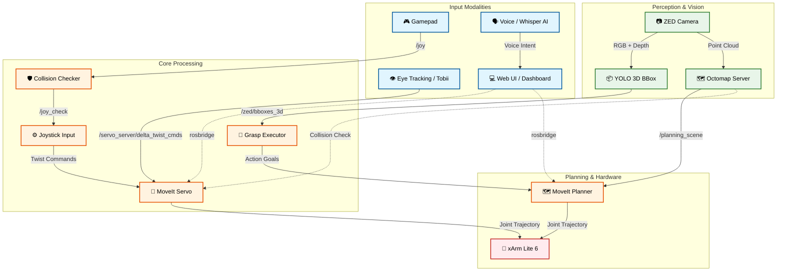
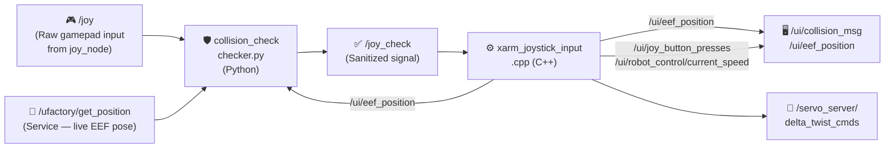

# xArm ROS 2 Extended Workspace (ROS2 Humble) **[MASTER VERSION]**

<p align="center">
  
  &nbsp;&nbsp;&nbsp;
  
  &nbsp;&nbsp;&nbsp;
  
  &nbsp;&nbsp;&nbsp;
  
</p>

<p align="center">
  <a href="readme-de.md">🇩🇪 <b>Auf Deutsch lesen / Read in German</b></a>
</p>

This repository is a continuously evolving research and evaluation platform for multimodal teleoperation and Human-Computer Interaction (HCI). The goal is to lower technical barriers in robot control through intuitive interfaces like eye-tracking, voice control, manual fine-control (e.g., via gamepads or the mouse-driven Web-UI), and assistive automation. A central aspect is also the provision of modern graphical user interfaces (GUIs) that make complex processes easily accessible. Based on the shared-control paradigm (human and machine interacting cooperatively), the project investigates how cognitive workloads can be reduced and how equal, inclusive participation in the modern workplace (Industry 5.0) can be technologically realized. <br>
<p align="center">
 
</p>

> [!IMPORTANT]
> **Core Prerequisite:** This repository is an *extension workspace*. It is built entirely on top of the official [xarm_ros2 repository (Branch: humble)](https://github.com/xArm-Developer/xarm_ros2/tree/humble) from UFactory. The official repository, its structure, and all of its system dependencies form the mandatory foundational baseline for this software!

<br>

## Table of Contents
1. [📋 Project Overview](#chapter-1)
2. [🔬 Architecture & Guiding Principles](#chapter-2)
   - [2.1 The System Concept: An Integrated Development, Evaluation, and Validation Platform](#subchapter-2-1)
3. [⚙️ Core Features & ROS 2 Nodes](#chapter-3)
   - [3.1 Operating Modes: FAKE vs. REAL (Hardware Interfaces)](#subchapter-3-1)
   - [🎮 3.2 Feature: Gamepad Teleoperation & Hard Collision Protection](#subchapter-3-2)
   - [🟢 3.3 Feature: Autonomous Grasping & 3D Object Detection (YOLO / ZED)](#subchapter-3-3)
   - [🗣️ 3.4 Feature: Multimodal Interaction (Voice & Gaze Control)](#subchapter-3-4)
   - [🖥️ 3.5 Feature: Graphical Control & Visual Feedback](#subchapter-3-5)
   - [🌌 3.6 Feature: Digital Twin & Simulation (NVIDIA Isaac Sim)](#subchapter-3-6)

4. [🎮 Gamepad Control — Deep Dive](#chapter-4)
   - [4.1 Pipeline Architecture](#subchapter-4-1)
   - [4.2 `checker.py` — Collision Guard (Python Node)](#subchapter-4-2)
   - [4.3 `xarm_joystick_input.cpp` — Motion Controller (C++ Node)](#subchapter-4-3)
5. [📦 Dependencies & Requirements](#chapter-5)
6. [🚀 Execution: How to Run the System](#chapter-6)
   - [6.1 Step 1: Hardware Preparation](#subchapter-6-1)
   - [6.2 Step 2: Launch the System (ROS 2 Nexus)](#subchapter-6-2)
   - [6.3 Step 3: Start Nodes via GUI](#subchapter-6-3)
   - [6.4 Network & Port Architecture](#subchapter-6-4)
   - [6.5 Distributed Control (Remote / Operator Station)](#subchapter-6-5)
   - [6.6 DDS Multicast Storm Prevention & Loopback Discovery (Critical)](#subchapter-6-6)
   - [6.7 Launcher Configuration (`launcher_config.json`)](#subchapter-6-7)
   - [6.8 CycloneDDS UDP Buffer Overflows (Point Cloud Lag)](#subchapter-6-8)
7. [📊 Monitoring: Dashboard & Workspace Analyzer](#chapter-7)
   - [7.1 Workspace Analyzer Backend (`workspace_analyzer.py`)](#subchapter-7-1)
   - [7.2 Frontend (`dashboard_index.html`)](#subchapter-7-2)
   - [7.3 Launch Commands for UI Components](#subchapter-7-3)
8. [🕹️ Multimodal Technologies & Interaction Concepts](#chapter-8)
   - [8.1 Robot Control Methods (Inputs)](#subchapter-8-1)
   - [8.2 Perception & Assistance](#subchapter-8-2)
   - [8.4 User Interfaces (UI/GUI)](#subchapter-8-4)
9. [🗂️ Repository Structure](#chapter-9)
10. [🗄️ Archive / Deprecated Concepts](#chapter-10)


---

<br>

## <a id="chapter-1"></a> 1. 📋 Project Overview

<br>

### 🎯 Concept: An Integrated, Multimodal Teleoperation Platform
The primary goal of this project is the development and implementation of a modular control and interaction platform for the UFactory xArm Lite 6 robot arm. The system consolidates heterogeneous, multimodal input methods into a centralized software environment and places a consistent focus on maximized usability and intuitive operation. The system handles the calculation of complex robot movements in the background. This creates a simple interface that directly translates the user's intentions into robotic actions.

<br>

### 💡 Motivation: Assistance, Inclusion, and Participation in the Context of Industry 5.0
In practice, classical methods of teleoperation and robot control are highly error-prone and demand immense cognitive fine control and technical expertise from the operator. These high barriers exclude many people from direct usage. In the spirit of the Industry 5.0 guiding principles—which place the human, sustainability, and resilience at the center of industrial production—this project starts exactly here:

- **Lowering Technical Barriers:** <br> Reducing entry thresholds by shifting from low-level joint coordination toward intuitive high-level commands.
- **Promoting Inclusion:** <br> Creating technological conditions to enable productive and equal participation in the modern workplace, even for people with different physical or cognitive capabilities.
- **Human-Machine Synergy:** <br> Establishing the robot as an assistive tool that relieves the human instead of replacing them.

<br>

### ⚙️ Operating Principle: Shared Control and the "Human-in-the-Loop" Paradigm
The technological foundation of the platform is based on a dynamic *shared control* approach, where human and machine interact cooperatively. The user remains permanently integrated into the control loop as a supervisor (*Human-in-the-Loop*), but controls the system through a tiered, complementary interaction pattern:

- **Intuitive High-Level Commands:** <br> Initiating global actions or target specifications via natural modalities such as gaze control (eye tracking) or voice commands.
- **Precise Low-Level Corrections:** <br> Seamless, low-latency switching to manual input devices (e.g., gamepad/MoveIt Servo) for sensitive adjustments in the workspace.
- **Context-Sensitive Assistance:** <br> Autonomous path planning and collision-free trajectory calculation in the background to actively safeguard the operator during execution.

<br>

### 🏆 Objective: A Valid, Cost-Effective Proof-of-Concept
The project presents itself as a fully functional, reproducible, and economically affordable Proof-of-Concept (PoC) for academic research landscapes and practice-oriented inclusion projects. The open architecture serves as a standardized evaluation platform on which novel assistive robotics systems can be developed, tested, and empirically validated under realistic conditions.

<br>

### 📊 Evaluation Logic & Guidelines: From Research to Industrial Practice
A key core and innovative character of the project lies in the scientific analysis of interaction quality. The system serves not only as a technical demonstrator, but as a tool to generate transferable knowledge:

- **Development of an Evaluation Logic:** <br> Systematic capture and measurement of usability, cognitive load, and system performance for quantitative assessment of the human-robot interface.
- **Derivation of Action Recommendations:** <br> Formulation of standardized guidelines that serve companies as a strategic guide during the introduction of modern robot systems.
- **Answering the Transformation Question:** <br> Concrete practical assistance on the core question: *“How can processes and workplaces be structured to measurably meet the human-centered requirements of Industry 5.0?”*
- **Service Potential:** <br> The resulting frameworks and guidelines have the potential to be provided as a validated, monetizable consulting and service offering for industry, accompanying digital and demographic changes in production.


---

<br>

## <a id="chapter-2"></a> 2. 🔬 Architecture & Guiding Principles

<br>

<br>

---

### 🗺️ System Architecture & Data Flow
The following diagram illustrates the modular design and the asynchronous data flow between sensory input, UI elements, and the control components:




---

---

2-1"></a> 2.1 The System Concept: An Integrated Development, Evaluation, and Validation Platform
The core objective of the project is the realization of a modular, platform-based software architecture for multimodal teleoperation and AI-supported assistive robotics. The system acts as a central, software-side integration node (middleware level) that unifies heterogeneous subsystems into a consistent runtime environment. Through a distributed server-client network (multi-PC setup) and the software-side coupling to a real-time capable Digital Twin (NVIDIA Isaac Sim), the platform serves as both a flexible development environment and a standardized, replicable test environment. The project is explicitly designed as a closed loop of development and empirical validation:

- **Sensors & Perception:** <br> Integration of depth cameras (e.g., object detection via YOLO, marker tracking) and tactile or physiological sensors for state estimation.
- **Multimodal Control:** <br> Parallel integration of various input channels such as eye-tracking systems for gaze target acquisition, voice control (e.g., via OpenAI Whisper), and classical hardware controllers (gamepads, 3D mice).
- **Cognitive Robotics:** <br> Integration of modern Vision-Language-Action (VLA) models to directly translate highly abstract, verbal and visual commands into robotic action sequences.
- **Integrated Data Acquisition:** <br> Time-synchronous recording of technical performance parameters and human interaction data via a central logging infrastructure during system usage.

<br>

### 🧑‍💻 Human-Centered Automation
The system architecture places the human operator at the center of the interaction design. The system is designed to allow users to cognitively grasp the current state of automation throughout operation and to anticipate subsequent system actions. This transparency dismantles algorithmic black-box structures, bringing significant advantages for practical application:

- **Cognitive Transparency:** Consistent comprehensibility of system states, especially during the parallel processing of gaze patterns and sensory feedback.
- **Informed Intervention:** Empowering the operator to make safe and targeted interventions in critical or unforeseen interaction situations.
- **Calibrated Trust in Automation:** Creating a reliable technological basis for systematically building *trust in automation*, which is evaluated through user studies.

<br>

### 🤝 Shared Control & Cognitive Relief
A key feature of the software architecture is the implementation of *shared control* paradigms for cooperative task execution. The platform enables a seamless, low-latency transfer of control authority between manual guidance, gaze-controlled interactions, and AI-assisted, semi-automated assistance functions. The context-dependent distribution of control shares targets the following core aspects:

- **Seamless Control Handover:** Low-latency switching between manual input (e.g., via MoveIt Servo / gamepad) and autonomous system actions (e.g., gaze-based grasping).
- **Minimizing Mental Workload:** Targeted reduction of the user's mental workload during complex or long-lasting manipulation tasks.
- **Autonomous Error Compensation:** Independent mitigation of error-prone low-level corrections by the system, thereby freeing up cognitive resources for high-level process monitoring.
- **Empirical Validation:** Ongoing verification of actual cognitive relief throughout the project using standardized psychometric methods.

<br>

### 📈 HCI & Usability Focus & Empirical Evaluation
The design of the central control interface (GUI) follows established principles of Human-Computer Interaction (HCI). Interaction patterns shift from the complex coordination of individual degrees of freedom or manually invoking distributed terminal processes toward intention-based task completion. An integral part of the project is conducting systematic user studies to evaluate these multimodal interfaces:

- **Intention-Based Control:** Translating abstract action intents (via voice, gaze target, or high-level controller) into precise kinematic trajectories.
- **Standardized Usability Metrics:** Collection of subjective usability via established questionnaires such as the *System Usability Scale* (SUS).
- **Objective Performance Parameters:** Measuring quantitative factors such as *task completion time*, error rates, and specific gaze paths.
- **Load Analysis:** Empirical verification of the participants' cognitive load using the *NASA-TLX* index for iterative system optimization.

<br>

### 🔓 Reproducible & Open Source
To ensure scientific validity, the project is designed as an open-source architecture. Disclosing the complete codebase ensures the methodological transparency of all algorithms, configurations, and data flows. For the scientific community, this yields key added value:

- **Methodological Transparency:** <br> Full visibility of all underlying algorithms, URDF models, and MoveIt configurations.
- **Exact Replication:** <br> Enabling straightforward secondary investigations by independent research groups under identical conditions.
- **Statistical Verifiability:** <br> Traceability and validation of complex, recorded sensor data streams and control inputs.
- **Standardized Benchmark:** <br> Establishing the platform as a reliable baseline for comparative studies in the field of assistive and inclusive robotics.

<br>

### Cost-Effective Hardware
The system configuration is primarily based on economically affordable, commercially available off-the-shelf components (COTS), without compromising the required precision and functional reliability. This approach pursues clear strategic goals:

- **Democratizing Access:** <br> Reducing investment and financial barriers when entering modern, multimodally controlled robotics technologies.
- **Target Audience Transfer:** <br> Facilitating technology transfer into inclusive projects, educational institutions, and smaller research facilities (e.g., via the UFactory xArm Lite 6 and consumer controllers).
- **Validating Reliability:** <br> Targeted scientific evaluation of the extent to which cost-effective hardware represents a valid research platform in direct comparison to high-priced industrial systems.

<br>

### Modular & Industry Standard
The software-side infrastructure is modularly encapsulated and fully integrated into the ROS 2 Humble middleware framework. The native use of standardized communication primitives ensures interoperability with industrial ecosystems. The consistent modular principle offers crucial architectural advantages:

- **Native ROS 2 Communication:** <br> Full compatibility with established ecosystems (like MoveIt 2) and modern sensor SDKs via nodes, topics, services, and actions.
- **Isolated Subsystem Encapsulation:** <br> Straightforward replacement or extension of individual modules—such as VLA pipelines for intent recognition or specific eye-tracking drivers.
- **Future-Proofing & Portability:** <br> Low-maintenance software structure allowing easy migration to future ROS 2 LTS distributions without modifying the overall platform.


---

<br>

## <a id="chapter-3"></a> 3. ⚙️ Core Features & ROS 2 Nodes

To provide a clear understanding of the architecture, the software modules are categorized by their functional **Features (Use-Cases)**. Each module is explicitly labeled as a ROS 2 Node, Script, or Plugin.

<br>

<br>

---

### 🔌 <a id="subchapter-3-1"></a> 3.1 Operating Modes: FAKE vs. REAL (Hardware Interfaces)
The platform strictly distinguishes between two operating modes for the robot arm. This distinction refers **exclusively to the `ros2_control` hardware interface** and is independent of sensors (like the camera or YOLO, which can run live in both modes):

-blue?style=for-the-badge)<br>
The robot runs via the `mock_components/GenericSystem` (or FakeSystem) hardware interface within `ros2_control`. There is no physical controller connection. Commands to the `/lite6_traj_controller` or `/servo_server` are purely virtually rendered in RViz2 by mirroring the joint states. Proprietary UFactory API calls (like Mode/State switches) intentionally lead nowhere in this mode or are bypassed in software.

-red?style=for-the-badge)<br>
The `ros2_control` framework integrates the real `xarm_api` hardware interface, which communicates directly via TCP/IP with the physical controller of the xArm Lite 6. In this mode, hardware limits, physical safety stops, and the exclusive switching of proprietary xArm hardware modes (e.g., Mode 0 for pose control vs. Mode 1 for Servo/jogging) take effect via the UFactory API.

<br>

<br>

---

### 🎮 <a id="subchapter-3-2"></a> 3.2 Feature: Gamepad Teleoperation & Hard Collision Protection
*This subsystem manages the manual jogging of the robot via the Xbox controller and actively prevents the robot from colliding with the workspace surface due to operator error.*

<br>

---

<br>

####  `xarm_joystick_input.cpp` &nbsp;&nbsp; <sub><i>[`/src/xarm_ros2/xarm_moveit_servo/src/xarm_joystick_input.cpp`](./src/xarm_ros2/xarm_moveit_servo/src/xarm_joystick_input.cpp)</i></sub>
>
> **Purpose & Task:**<br>
> Translates the sanitized gamepad signals (analog sticks & triggers) into Cartesian velocity commands (`TwistStamped`) for MoveIt Servo. Applies exponential smoothing and handles all button mappings.
>
> **🎮 Controller Mapping (Quick Reference):**
> | Input | Action | Details |
> | :--- | :--- | :--- |
> | **Left Stick** (↕️/↔️) | **Translate (X / Y)** | *Moves the robot forward/backward (X) and left/right (Y)* |
> | **LT / RT** (Triggers) | **Translate (Z)** | *Moves the robot arm up (LT) and down (RT)* |
> | **LB / RB** (Bumpers) | **Rotate (Yaw)** | *Rotates the end effector around its vertical axis* |
> | **D-Pad** (↕️) | **Speed Control** | *Cycles through 5 speed levels* |
> | **START / BACK** | **Reference Frame** | *Toggles between base (`link_base`) and tool coordinates (`link_tcp`)* |
> | **Button A** (🟢) | **Vacuum Gripper** | *Toggles the vacuum on / off* |
> | **Button B** (🔴) | **E-Stop (Gripper)** | *Stops the vacuum gripper immediately* |
> | **Button X** (🔵) | **Microphone (Voice)** | *Starts/Stops recording for Whisper AI* |
> | **Button Y** (🟡) | **Initial Pose** | *Moves the robot to the safe home position* |
>
>
> 
>
>   | Topic / Interface | Msg Type | Beschreibung |
>   |---|---|---|
>   | **`/joy_check`** | `sensor_msgs/Joy` |  |
>   | *-* | *-* | *Reads the sanitized controller inputs from the guardian node.* |
>
>
> 
>
>   | Topic / Interface | Msg Type | Beschreibung |
>   |---|---|---|
>   | **`/servo_server/delta_twist_cmds`** | `geometry_msgs/TwistStamped` | *Sends Cartesian velocity commands (motor currents) to the Servo Server.* |
>   | **`/ui/eef_position`** | `std_msgs/Float32MultiArray` | *Publishes the live end-effector pose (X, Y, Z) at 10 Hz for the Web UI.* |
>
>
> 
>
>   | Topic / Interface | Msg Type | Beschreibung |
>   |---|---|---|
>   | *-* | *-* | *Listens to the current TCP position (`link_base` -> `link_tcp`).* |
>
>
> 
>
>   | Topic / Interface | Msg Type | Beschreibung |
>   |---|---|---|
>   | **`/servo_server/start_servo`** | Client | *Starts the MoveIt Servo engine.* |
>   | **`/servo_server/stop_servo`** | Client | *Safely stops the MoveIt Servo engine.* |
>   | **`/servo_server/switch_command_type`** | Client | *Switches the input mode of the Servo Server (e.g., Twist to Joint Jog).* |
>
>

<br>

---

<br>

####  `checker.py` (`collision_check`) &nbsp;&nbsp; <sub><i>[`/src/collision_check/collision_check/checker.py`](./src/collision_check/collision_check/checker.py)</i></sub>
>
> **Purpose & Task:**<br>
> Acts as a guardian *before* the movement translation. Predictively computes the Z-coordinate (0.1 sec into the future). If the robot were to touch the table, the controller's downward command is hard-overridden and blocked. Triggers gamepad rumble feedback (vibration).
>
>
> 
>
>   | Topic / Interface | Msg Type | Beschreibung |
>   |---|---|---|
>   | **`/joy`** | `sensor_msgs/Joy` |  |
>   | **`/servo_server/status`** | `std_msgs/Int8` |  |
>   | **`/ui/eef_position`** | `std_msgs/Float32MultiArray` |  |
>   | *-* | *-* | *Reads the raw controller input, status codes of the Servo Server, and the current Z height for the collision check.* |
>
>
> 
>
>   | Topic / Interface | Msg Type | Beschreibung |
>   |---|---|---|
>   | **`/joy_check`** | `sensor_msgs/Joy` |  |
>   | **`/ui/collision_msg`** | `std_msgs/String` |  |
>   | *-* | *-* | *Forwards the (potentially zero-corrected) command to the `joystick_input` and reports hard stops to the UI. Gamepad rumble feedback is triggered directly via `pygame` (without a ROS topic).* |
>
>
> 
>
>  * `look_ahead_time = 0.1` – Prediction horizon (seconds) for the velocity look-ahead.
>  * `table_z_threshold = 0.0` – The hard table barrier on the Z-axis (World-Frame).
>
>

<br>

---

<br>

####  `xarm_moveit_servo` &nbsp;&nbsp; <sub><i>[`/src/xarm_ros2/xarm_moveit_servo`](./src/xarm_ros2/xarm_moveit_servo)</i></sub>
>
> **Purpose & Task:**<br>
> The real-time motion engine from MoveIt. Reacts to dynamic obstacles (YOLO boxes) via a `threshold_distance` parameter and halts the arm before it collides with objects.
>
>
> 
>
>   | Topic / Interface | Msg Type | Beschreibung |
>   |---|---|---|
>   | **`/servo_server/delta_twist_cmds`** | `geometry_msgs/TwistStamped` | *Reads incoming Cartesian velocity commands.* |
>   | **`/planning_scene`** | `moveit_msgs/PlanningScene` | *Reads the current 3D scene for obstacle avoidance.* |
>
>
> 
>
>   | Topic / Interface | Msg Type | Beschreibung |
>   |---|---|---|
>   | **`/lite6_traj_controller/joint_trajectory`** | `trajectory_msgs/JointTrajectory` | *Sends safe, collision-free joint trajectories to the arm.* |
>   | *-* | *-* | *Sends the final joint angles to the robot.* |
>
>
>  **(`xarm_moveit_servo_config.yaml`)**
>
>  * `collision_check_type: stop_distance` – Enables soft, velocity-dependent deceleration (pre-warning starts around 5cm) instead of a hard block at the boundary. A hard emergency stop engages at exactly 2cm (`min_allowable_collision_distance: 0.02`).
>  * `collision_distance_safety_margin: 0.02` – Defines the 2 cm wide, invisible collision bubble around the robot.
>
>

<br>

<br>

---

### 🟢 <a id="subchapter-3-3"></a> 3.3 Feature: Autonomous Grasping & 3D Object Detection (YOLO / ZED)
*This subsystem is responsible for locating objects in 3D space, generating virtual obstacles, and navigating the robot precisely to the target.*

<br>

---

<br>

####  `zed_wrapper` &nbsp;&nbsp; <sub><i>[`/src/zed-ros2-wrapper`](./src/zed-ros2-wrapper)</i></sub>
>
> **Purpose & Task:**<br>
> The native hardware driver for the Stereolabs ZED Mini Camera. 
>
>
> 
>
>   | Topic / Interface | Msg Type | Beschreibung |
>   |---|---|---|
>   | **`/zed/zed_node/rgb/image_rect_color`** | `sensor_msgs/Image` | *Publishes the color-corrected 2D RGB camera image.* |
>   | **`/zed/zed_node/depth/depth_registered`** | `sensor_msgs/Image` | *Publishes the registered depth map.* |
>   | **`/zed/zed_node/point_cloud/cloud_registered`** | `sensor_msgs/PointCloud2` | *Publishes the dense 3D point cloud.* |
>
>
>  **(`zed_cam_rviz_pointcloud_tf_yolo_planned_grasp.launch.py`)**
>
>  * `depth_mode: ULTRA` – Forces the most dense 3D point cloud for clean edge calculation.
>  * `auto_exposure: True` – Allows automatic brightness compensation for robust YOLO detection.
>
>

<br>

---

<br>

####  `zed_yolo_3d_bbox.py` &nbsp;&nbsp; <sub><i>[`/src/my_3d_vision_bringup/scripts/zed_yolo_3d_bbox.py`](./src/my_3d_vision_bringup/scripts/zed_yolo_3d_bbox.py)</i></sub>
>
> **Purpose & Task:**<br>
> Processes the RGB and Depth streams in parallel using GPU acceleration and the **YOLOv8 Large** model. Isolates objects, filters depth noise, and computes millimeter-accurate 3D bounding boxes grounded to the table plane (including a grasp point marker). Uses a **robust closest-surface projection** algorithm (filtering out the bottom 20% of points to avoid table noise) to perfectly center bounding boxes on the true physical volume of objects, regardless of camera angles. Features a **dictionary-based EMA tracking system** with persistent global IDs and a tight 10cm distance threshold to prevent ID-swapping and bounding box jitter. Multiple objects of the same class are permanently numbered for unambiguous targeting (e.g., `cup_1`, `cup_2`).
>
>
> 
>
>   | Topic / Interface | Msg Type | Beschreibung |
>   |---|---|---|
>   | **`/zed/zed_node/rgb/image_rect_color`** | `sensor_msgs/Image` | *Receives the RGB image for YOLO object detection.* |
>   | **`/zed/zed_node/depth/depth_registered`** | `sensor_msgs/Image` | *Uses depth values for 3D coordinate projection.* |
>   | **`/zed/zed_node/rgb/camera_info`** | `sensor_msgs/CameraInfo` | *Reads camera intrinsics to calculate exact spatial coordinates.* |
>
>
> 
>
>   | Topic / Interface | Msg Type | Beschreibung |
>   |---|---|---|
>   | **`/zed/bboxes_3d`** | `visualization_msgs/MarkerArray` |  |
>   | *-* | *-* | *Sends the finalized 3D boxes and markers to RViz for visualization and to downstream nodes.* |
>
>
> 
>
>  * `class_dimension_overrides` – Hardcodes expected metric dimensions (x,y,z) for specific objects to ensure the bounding box perfectly encloses the physical volume, not just the visible point cloud surface.
>  * `percentiles: [0.5, 99.5]` – Hard-clips extreme depth noise pixels ("flying pixels" at object edges) while preserving true boundaries.
>  * `ema_alpha: 0.2` – Smoothing factor (Exponential Moving Average) to safely eliminate box jittering between frames.
>
>

<br>

---

<br>

####  `pointcloud_optimizer.py` &nbsp;&nbsp; <sub><i>[`/src/my_3d_vision_bringup/scripts/pointcloud_optimizer.py`](./src/my_3d_vision_bringup/scripts/pointcloud_optimizer.py)</i></sub>
>
> **Purpose & Task:**<br>
> Actively runs in the background during the 3D Vision Bringup. It intercepts the raw ZED point cloud and transforms the coordinate system from the optical frame (`Z=forward`) to the standard ROS frame (`X=forward`) while preserving RGB data.
>
>

<br>

---

<br>

####  `yolo_moveit_collision.py` &nbsp;&nbsp; <sub><i>[`/src/my_3d_vision_bringup/scripts/yolo_moveit_collision.py`](./src/my_3d_vision_bringup/scripts/yolo_moveit_collision.py)</i></sub>
>
> **Purpose & Task:**<br>
> Seamlessly converts the detected 3D boxes into dynamic MoveIt `CollisionObject` messages. Instead of a solid block, it generates an **open-top cup shape** (5 ultra-thin 1mm walls). This allows the gripper to safely penetrate the bounding box from above for top-down grasps, while securely blocking lateral collisions.
>
>
> 
>
>   | Topic / Interface | Msg Type | Beschreibung |
>   |---|---|---|
>   | **`/zed/bboxes_3d`** | `visualization_msgs/MarkerArray` | *Reads the object coordinates as a target for the grasp path.* — *Reads the 3D bounding boxes detected by YOLO.* |
>
>
> 
>
>   | Topic / Interface | Msg Type | Beschreibung |
>   |---|---|---|
>   | **`/planning_scene`** | `moveit_msgs/PlanningScene` |  |
>   | *-* | *-* | *Sends the `CollisionObjects` directly to the MoveIt Planning Scene to avoid collisions during grasping/driving.* |
>

---

<br>

####  `octomap_server`
>
>
> **Purpose & Task:**<br>
> Dynamic 3D environment mapping. Generates a real-time voxel-based collision map (OctoMap) directly from the ZED point cloud, enabling MoveIt to avoid arbitrary, unrecognized obstacles (e.g., human hands, tools) during trajectory planning and servoing.
>  * 🛠️ **Activation:** In the base repository (`src/xarm_ros2/xarm_moveit_config/launch/_robot_moveit_common.launch.py`), the OctoMap is configured via the `sensor_manager_parameters` dictionary (setting parameters like `octomap_resolution: 0.03` and `ros.point_cloud_topic`) and injected directly into the `move_group_node`.
>
>
> 
>
>   | Topic / Interface | Msg Type | Beschreibung |
>   |---|---|---|
>   | **`/zed/zed_node/point_cloud/cloud_optimized`** | `sensor_msgs/PointCloud2` | *Reads the point cloud to generate a voxel-based map.* |
>
>
> 
>
>   | Topic / Interface | Msg Type | Beschreibung |
>   |---|---|---|
>   | *-* | *-* | *Integrated natively into the MoveIt `/planning_scene`.* |
>
>

<br>

---

<br>

####  `yolo_planned_grasp_executor.py` &nbsp;&nbsp; <sub><i>[`/src/my_3d_vision_bringup/scripts/yolo_planned_grasp_executor.py`](./src/my_3d_vision_bringup/scripts/yolo_planned_grasp_executor.py)</i></sub>
>
> **Purpose & Task:**<br>
> The central control logic of the autonomous grasping pipeline. Reads the UI input field ("Grasp Object"), retrieves the YOLO coordinates, and coordinates a robust **3-Phase Collision-Free Grasping Sequence**:
>   - **Phase 1 (Retract):** <br> Safely moves the arm strictly upwards from its current position to clear the table.
>   - **Phase 2 (Hover):** <br> Translates horizontally to a safe height (15cm) exactly above the target object. Forces a strict top-down orientation and uses tight IK tolerances (5mm positional, 0.001 rad tilt) to guarantee millimeter-accurate vertical alignment.
>   - **Phase 3 (Approach):** <br> Temporarily removes the target object from the MoveIt global collision scene via `/ui/ignore_collision_object` to allow the TCP to physically reach into the object's bounding box without triggering emergency stops, then moves down.
>
>
>  Features tunable `velocity_scaling` (default: 0.2) and `acceleration_scaling` (default: 0.1) for extremely smooth, slow, and predictable robotic interactions during the grasp sequence.
>
>
> 
>
>   | Topic / Interface | Msg Type | Beschreibung |
>   |---|---|---|
>   | **`/zed/bboxes_3d`** | `visualization_msgs/MarkerArray` | *Reads the object coordinates as a target for the grasp path.* |
>
>
> 
>
>   | Topic / Interface | Msg Type | Beschreibung |
>   |---|---|---|
>   | **`/ui/grasp_status`** | `std_msgs/String` | *for the RViz console* |
>   | **`/ui/ignore_collision_object`** | `std_msgs/String` |  |
>   | **`/planning_scene`** | `moveit_msgs/PlanningScene` |  |
>
>
> 
>
>   | Topic / Interface | Msg Type | Beschreibung |
>   |---|---|---|
>   | **`/ui/grasp_object`** | `my_3d_vision_msgs/action/GraspObject` | *Non-blocking action endpoint to initiate the grasp sequence.* |
>
>
> 
>
>   | Topic / Interface | Msg Type | Beschreibung |
>   |---|---|---|
>   | **`/compute_ik`** | `IK verification` |  |
>   | **`/move_action`** | `MoveIt OMPL Planner` |  |
>   | **`/ui/execute_move_to_pose`** | `Servo Fallback` |  |
>
>

<br>

---

<br>

####  `grasp_action_bridge.py` &nbsp;&nbsp; <sub><i>[`/src/my_3d_vision_bringup/scripts/grasp_action_bridge.py`](./src/my_3d_vision_bringup/scripts/grasp_action_bridge.py)</i></sub>
>
> **Purpose & Task:**<br>
> Acts as a translator node between the RViz Control Panel and the Action Server. Receives the simple target object string from the UI and converts it into a non-blocking ROS 2 Action Goal.
>
>
> 
>
>   | Topic / Interface | Msg Type | Beschreibung |
>   |---|---|---|
>   | **`/ui/grasp_object_cmd`** | `std_msgs/String` | *Receives the string command (e.g., "cup_1") from the UI.* |
>
>
> 
>
>   | Topic / Interface | Msg Type | Beschreibung |
>   |---|---|---|
>   | **`/ui/grasp_object`** | `my_3d_vision_msgs/action/GraspObject` | *Calls the Grasp Action Server.* |
>

---

<br>

####  `zed_stand_publisher.py`
>
>
> **Purpose & Task:**<br>
> Mathematically generates the exact 3D mesh model of the camera tripod (aluminum profile) and publishes it statically in RViz.
>
>
> 
>
>   | Topic / Interface | Msg Type | Beschreibung |
>   |---|---|---|
>   | **`/zed_stand_marker`** | `visualization_msgs/Marker` | *Publishes the static 3D model of the camera stand.* |
>
>

<br>

---

<br>

####   `tf_tuner` &nbsp;&nbsp; <sub><i>[`/src/tf_tuner`](./src/tf_tuner)</i></sub>
>
> **Purpose & Task:**<br>
> A dedicated ROS 2 package providing a live tuner interface (PyQt5) to dynamically adjust the camera offsets (Pointcloud) as well as interactively position 3D scene elements (Cube, Rectangle, Cylinder, White Plane) and an adjustable **Safety Zone** (with tunable radius) in RViz without restarting nodes.
>
>
> 
>
>   | Topic / Interface | Msg Type | Beschreibung |
>   |---|---|---|
>   | *-* | *-* | *Dynamically updates the TF broadcaster values (`tf2_msgs/TFMessage` on `/tf`) and publishes live safety parameters (`/ui/safety_zone_params`).* |
>
>

<br>

<br>

---

### 🗣️ <a id="subchapter-3-4"></a> 3.4 Feature: Multimodal Interaction (Voice & Gaze Control)
*These experimental modules allow for "hands-free" control of the system.*

<br>

---

<br>

####  `ros2_whisper` &nbsp;&nbsp; <sub><i>[`/src/ros2_whisper`](./src/ros2_whisper)</i></sub>
>
> **Purpose & Task:**<br>
> Local Speech-to-Text AI. Runs Whisper AI continuously on the microphone stream and publishes spoken words as text. 
> - **GPU Acceleration & Optimization:** The inference pipeline is natively optimized for **GPU Acceleration (CUDA)** utilizing the dedicated `base.en` model. This guarantees zero-latency "High-Performance" execution of voice commands and prevents runtime timeouts.
> - **Performance & Thread-Safety:** The underlying C++ Action Server (`TranscriptManager`) has been heavily fortified with a strict `std::mutex` locking mechanism to entirely eliminate parallel data-race crashes during high-frequency token generation. Additionally, the `Inference` node features a hardened buffer clearing strategy (`audio_ring_->clear()`) which physicaly purges stale audio residuals from the microphone Ring Buffer the exact millisecond the user activates the UI button, mathematically guaranteeing zero "ghost commands" from previous speech.
>
>
> 
>
>   | Topic / Interface | Msg Type | Beschreibung |
>   |---|---|---|
>   | **`/whisper/text`** | `std_msgs/String` | *Publishes the final, recognized speech transcript.* |
>
>

<br>

---

<br>

####  `audio_listener.py` &nbsp;&nbsp; <sub><i>[`/src/ros2_whisper/audio_listener/audio_listener/audio_listener.py`](./src/ros2_whisper/audio_listener/audio_listener/audio_listener.py)</i></sub>
>
> **Purpose & Task:**<br>
> Handles microphone input for the voice command system. Features an automatic, system-aware fallback logic that explicitly scans for and prioritizes the system-default `pulse` or `default` audio devices, guaranteeing reliable voice capture across different hardware environments.
>
>

<br>

---

<br>

####  `voice_command_listener.py` &nbsp;&nbsp; <sub><i>[`/src/voice_command_listener/voice_command_listener/voice_command_listener.py`](./src/voice_command_listener/voice_command_listener/voice_command_listener.py)</i></sub>
>
> **Purpose & Task:**<br>
> Analyzes discrete single-shot raw text using regex patterns to extract defined action intents (i.e., "Move to Absolute Pose", "Move to Initial Pose", "Faster", "Slower", "Scan Objects"). Features high tolerance for similar-sounding Whisper outputs (e.g. recognizing "pause" or "power" as "pose"). Implements a robust **3-layer deduplication state machine** to guarantee exactly-once command execution.
>
>
> 
>
>   | Topic / Interface | Msg Type | Beschreibung |
>   |---|---|---|
>   | **`/whisper/inference`** | `whisper_idl/Inference` |  |
>   | *-* | *-* | *Instead of waiting for the full 5-second recording to finish, it actively analyzes the continuous real-time `feedback` topic (250ms interval from the C++ Action Server).* |
>   | *-* | *-* | *⚡ **Early Cancellation:** If a valid voice command is identified within the intermediate feedback, the listener instantly triggers the action and sends an early cancel command to the Action Server (`cancel_goal_async()`). This enables near-instant, low-latency execution without waiting for the timeout.* |
>   | *-* | *-* | *🛡️ **3-Layer Deduplication:** **(1)** Feedback text dedup — ignores identical consecutive feedback packets. **(2)** Residual audio detection — remembers the last executed command and suppresses re-recognition of the same command within 5s across separate goals (prevents microphone buffer residue from triggering false re-fires). **(3)** Global cooldown (3s) — final safety net against any double-fire.* |
>   | *-* | *-* | *🔒 **Singleton Lock:** Uses an `fcntl` file lock (`/tmp/voice_command_listener.lock`) to prevent multiple node instances from running concurrently, which would cause duplicate command execution.* |
>
>
> 
>
>   | Topic / Interface | Msg Type | Beschreibung |
>   |---|---|---|
>   | **`/ui/voice_feedback`** | `std_msgs/String` |  |
>   | *-* | *-* | *Directly triggers coordinate movements ("MoveTo: pose", "MoveTo: initial"), triggers scanning paths ("Scan: objects"), or adjusts the robot jogging speed ("Speed: faster", "Speed: slower") via the dashboard UI feedback.* |
>
> The `whisper_server` is explicitly configured to use `language: "en"` along with a targeted `initial_prompt` inside `whisper.yaml` to guarantee high transcription accuracy for the English commands, rejecting non-english noise.
>
>

<br>

---

<br>

####   `gaze_ui_node_tobii_glasses.py` &nbsp;&nbsp; <sub><i>[`/src/gaze_control/gaze_control/gaze_ui_node_tobii_glasses.py`](./src/gaze_control/gaze_control/gaze_ui_node_tobii_glasses.py)</i></sub>
>
> **Purpose & Task:**<br>
> A master control user interface (PyQt5). Maps eye-tracking gaze points (via RTSP gaze data) to button clicks (e.g., at 1 sec fixation time) and sends direct movement and gripper commands.
> - **RTSP & Data Processing:** Connects to the Tobii glasses via the Real-Time Streaming Protocol (RTSP) at `rtsp://192.168.75.51:8554/live/all` to receive two streams simultaneously. The video stream is processed with OpenCV to detect the ArUco markers, while the data stream (JSON) provides the raw, normalized `gaze2d` coordinates in real-time. 
> - **Homography Mapping:** Detects 4 ArUco markers on the screen corners via the scene camera. Uses `cv2.findHomography` to precisely project the 3D gaze vector (`gaze2d`) from the RTSP stream onto the 2D UI screen absolute pixels.
> - **Subpixel Accuracy:** Applies `cv2.cornerSubPix` during ArUco marker detection to dramatically reduce camera jitter and stabilize the Homography matrix calculation.
> - **Soft-Landing Brake Zone (Z-Axis):** Implements a dedicated safety logic when moving down. A quadratic brake zone starts at `Z = 40.0 mm` to slow down the arm, and a hard stop is enforced at `Z = 33.0 mm` to prevent any table collisions.
> - **Visual Design & Livestreams:** The UI utilizes an immersive dark theme (`#333333`) and integrates **two independent camera livestreams** (Main View + Picture-in-Picture) via `QWebEngineView`.
> - **Intelligent Error Fallback:** If cameras are unreachable, the UI proactively catches white Chromium connection error pages. The main window becomes seamlessly transparent, while the PiP window is filled with a dynamically injected HTML placeholder (`setHtml()`) in matching dark gray (`#444444`) to preserve the interface layout.
> - **Robust Eye-Tracking:** Features a **Hitbox Architecture**: visual buttons remain small, but are backed by invisible "Hitbox Frames" that drastically increase gaze acquisition tolerance. Gaze targets are filtered using an Alpha-Smoothing algorithm (Alpha = 0.20) for stable cursor tracking. Successful gaze interactions are confirmed via precise **acoustic feedback** (`ui_mouse_click.mp3` via Pygame) and pulsing button animations.
> - **Control:** Includes directional controls (Forward, Left, Right, Back, UP, DOWN, Rotate), Gripper toggles, and a dedicated **HOME ⌂** button for instant initial pose execution.
>
>
> 
>
>   | Topic / Interface | Msg Type | Beschreibung |
>   |---|---|---|
>   | **`/servo_server/delta_twist_cmds`** | `geometry_msgs/TwistStamped` |  |
>   | *-* | *-* | *Directly controls the Cartesian velocity of the robot arm and uses UFactory services to operate the gripper.* |
>
>

<br>

<br>

---

### 🖥️ <a id="subchapter-3-5"></a> 3.5 Feature: Graphical Control & Visual Feedback
*Tools for the operator for manual positioning and visual monitoring in RViz and the Web.*

<br>

---

<br>

####   `rviz_robot_control_panel.cpp` &nbsp;&nbsp; <sub><i>[`/src/rviz_robot_control_panel/src/rviz_robot_control_panel.cpp`](./src/rviz_robot_control_panel/src/rviz_robot_control_panel.cpp)</i></sub>
>
> **Purpose & Task:**<br>
> The native 2D control panel written in C++ for RViz. It is structured into a modern dark-theme UI with 4 distinct GroupBoxes (Cartesian Jog, Cartesian Absolute, Joint Absolute, Utilities). Provides D-Pad buttons, **6-DoF Joint Control Sliders**, the **"Grasp Object"** input field, and a **Color-Coded Live Console Log**. Employs a thread-safe `Qt::QueuedConnection` Signal/Slot architecture to pipe asynchronous ROS 2 node status messages directly into the UI without freezing.
>
>
> 
>
>   | Topic / Interface | Msg Type | Beschreibung |
>   |---|---|---|
>   | **`/ui/grasp_status`** | `std_msgs/String` |  |
>   | **`/joint_states`** | `sensor_msgs/JointState` |  |
>   | **`/ui/robot_control/current_speed`** | `std_msgs/Float32` |  |
>
>
> 
>
>   | Topic / Interface | Msg Type | Beschreibung |
>   |---|---|---|
>   | **`/servo_server/delta_twist_cmds`** | `geometry_msgs/TwistStamped` | *Transmits manual jogging commands (D-Pad) to Servo.* |
>   | **`/ui/grasp_object_cmd`** | `std_msgs/String` | *Sends target object string for autonomous grasping.* |
>   | **`/ui/robot_control/current_frame`** | `std_msgs/String` | *Controls the active coordinate frame (World/TCP).* |
>   | **`/ui/robot_control/set_speed_index`** | `std_msgs/Int32` | *Adjusts the global speed scale factor.* |
>
>
> 
>
>   | Topic / Interface | Msg Type | Beschreibung |
>   |---|---|---|
>   | **`/ui/execute_initial_pose`** | Client | *Triggers the return to home position sequence.* |
>   | **`/ui/execute_move_to_pose`** | Client | *Commands the planner to reach a Cartesian absolute pose.* |
>   | **`/ui/execute_move_joint`** | Client | *Commands specific joint angles execution.* |
>
>

<br>

---

<br>

####  `robot_motion_handler_movegroup.py` &nbsp;&nbsp; <sub><i>[`/src/robot_motion_handler_movegroup/robot_motion_handler_movegroup/robot_motion_handler_movegroup.py`](./src/robot_motion_handler_movegroup/robot_motion_handler_movegroup/robot_motion_handler_movegroup.py)</i></sub>
>
> **Purpose & Task:**<br>
> Executes the commands from the Control Panel invisibly in the background. Features an intelligent startup trigger and safe joint execution (pauses Servo, moves via Trajectory Controller, and resumes Servo). Both "Move To: Absolute Pose" and "Move To: Initial Pose" movements (triggered via Web UI or RViz) now utilize a robust **IK-Solver (Inverse Kinematics)** to calculate target joint angles for absolute coordinates and execute them as safe, collision-free joint-space trajectories. This completely eliminates self-collision halts and singularities that occur with straight-line Cartesian motions across the workspace. The execution speed of all these joint movements, as well as the scan paths, is now centrally controlled by the UI's **Action Speed Radio Buttons** (Slow, Normal, Fast), scaling dynamically from butter-smooth slow movements to lightning-fast execution. **Object Cross Scan:** Handles the `/ui/start_object_scan` service which generates precise spherical dome paths (arcs) over the objects. The exact positions of the objects (Cube, Rectangle, Cylinder) are determined live via the TF tree. To maintain a constant camera distance, the TCP traces a pure hemisphere trajectory over the object while using an exact trigonometric focal-point look-at logic to remain perfectly aimed at the object's center. To elegantly prevent wrist singularities (Joint 4 spinning) when sweeping along the Y-axis, the TCP executes a seamless **90-degree Yaw Rotation** before the sweep. This perfectly aligns the robot's natural pitch joint (Joint 5) with the lateral movement. Furthermore, the IK execution loop features an active **Joint Unwrapping Algorithm** that intercepts consecutive joint angle calculations and mathematically eliminates any >180-degree IK solution jumps, physically guaranteeing zero cable wind-up or sudden 360-degree wrist flips. The planner also actively subscribes to the dynamic **Safety Zone**, halting the arm at the boundary while automatically tilting the camera to keep the target centered if an object is located too close to the base.
>
>
> 
>
>   | Topic / Interface | Msg Type | Beschreibung |
>   |---|---|---|
>   | **`/ui/robot_control/current_speed`** | `std_msgs/Float64` |  |
>   | *-* | *-* | *Scales the velocity of the Joint movements synchronously with the UI.* |
>
>
> 
>
>   | Topic / Interface | Msg Type | Beschreibung |
>   |---|---|---|
>   | **`/lite6_traj_controller/joint_trajectory`** | `trajectory_msgs/JointTrajectory` | *Sends safe, collision-free joint trajectories to the arm.* |
>
>
> 
>
>   | Topic / Interface | Msg Type | Beschreibung |
>   |---|---|---|
>   | *-* | *-* | *Provides `/ui/execute_initial_pose`, `/ui/execute_move_to_pose`, `/ui/start_object_scan`, and `/ui/execute_move_joint` as Server. Uses `/compute_ik` (MoveIt IK) as a Client to resolve Cartesian targets. Has a TF2 listener for real-time TCP coordinates.* |
>

---

<br>

#### `rviz_overlay.py` & `servo_status_overlay.py` <kbd>NODES</kbd>
>
> **Purpose & Task:**<br>
> Project color-coded warning messages (e.g., "COLLISION!") and live axis coordinates directly into the video stream of the RViz viewport.
>
>
> 
>
>   | Topic / Interface | Msg Type | Beschreibung |
>   |---|---|---|
>   | **`/servo_server/status`** | `std_msgs/Int8` | *Tints the screen border red/orange based on danger level.* |
>   | **`/ui/collision_msg`** | `std_msgs/String` | *Displays detailed collision warnings inside the video feed.* |
>   | **`/ui/robot_control/current_frame`** | `std_msgs/String` | *Overlays the active control frame (World/TCP).* |
>
>
> 
>
>   | Topic / Interface | Msg Type | Beschreibung |
>   |---|---|---|
>   | **`/rviz_2d_overlay_msgs/OverlayText`** |  | *Projects warning texts as overlay widgets in RViz.* |
>
> <br>

---

<br>

####  `rviz_marker_static_scene_objects.py` &nbsp;&nbsp; <sub><i>[`/src/rviz_marker_static_scene_objects/rviz_marker_static_scene_objects/rviz_marker_static_scene_objects.py`](./src/rviz_marker_static_scene_objects/rviz_marker_static_scene_objects/rviz_marker_static_scene_objects.py)</i></sub>
>
> **Purpose & Task:**<br>
> Publishes ROS `MarkerArray` messages into the 3D scene of RViz2 (e.g., visual table edges, interactive target boxes, and a dynamic transparent **Safety Zone**). Uses a `0` timestamp to prevent flickering caused by TF tree asynchronicity.
>
>
> 
>
>   | Topic / Interface | Msg Type | Beschreibung |
>   |---|---|---|
>   | **`/scene_markers_array`** | `visualization_msgs/MarkerArray` | *Renders virtual markers (safety-zone, tables) in RViz.* |
>
>

<br>

---

<br>

####  `rosbridge_server` &nbsp;&nbsp; <sub><i>[`/src/rosbridge_suite/rosbridge_server`](./src/rosbridge_suite/rosbridge_server)</i></sub>
>
> **Purpose & Task:**<br>
> Standard WebSocket bridge on Port 9090, allowing the web-based dashboard to access the ROS network directly.
>

---

<br>

####  `robot_control_web_ui`
>
>
> **Purpose & Task:**<br>
> A native-feeling, standalone Chrome Web App designed with a modern Glassmorphism aesthetic. It acts as a comprehensive multimodal dashboard directly replicating the RViz control panel features for remote operation. Operates on **Port 8081**.
> **Native Desktop Integration:** Both the *ROS 2 Nexus Web App* and the *Robot Control Web UI* now launch in dedicated, isolated Chrome `--app` profiles. They start perfectly maximized as standalone applications, completely detached from standard browser windows, and feature their own distinct taskbar icons for a seamless, native OS experience.
> - ✨ **Core Features:** 
>   - **Advanced Telemetry:** <br> Live system status pills for network ports (UI, WS, Nexus), active Gamepad connection (USB), and automatic Hardware Mode detection (Fake Arm vs. Real Arm IP, reliably sourced via global `rosapi` endpoints).
>   - **MoveIt Servo Monitoring:** <br> Dynamic UI indicators (Green/Orange/Red) with pulsing animations that mirror MoveIt collision/wait states in real-time.
>   - **Virtual Teleoperation:** <br> An integrated 2D virtual analog joystick for cartesian jogging, alongside a 6-DoF absolute joint state slider system and speed level adjustments. Movement speed and Cartesian jogging have been perfectly synchronized with the physical Gamepad controllers, utilizing a `0.1` to `0.5` m/s range and dynamic trajectory recalculations to ensure 100% stutter-free and fast robotic movement at any speed.
>   - **Interactive UI & Layout Optimization:** <br> The layout is intelligently structured (Cartesian Jogging top, Telemetry below) with zero wasted whitespace. Features dynamic, pulsing UI elements like the "Start Listening" Whisper AI button which now fully integrates with the backend, triggering a 5-second real-time speech recording via an Action Client upon activation. The final recognized transcription is published back to the ROS backend to be processed by the voice listener, replacing the need for standalone Whisper debug scripts.
>   - **YOLO Grasp Integration:** <br> Direct visualization of the 3D YOLO object list alongside an input field to trigger the grasp execution sequence remotely.
>   - **Color-Coded Console Log:** <br> A live, scrollable console log with detailed feedback for all motion commands — including coordinate display (`X`, `Y`, `Z`) for MoveTo commands and explicit success (✓) / failure (❌) status indicators with error codes.
>
>
> 
>
>   | Topic / Interface | Msg Type | Beschreibung |
>   |---|---|---|
>   | **`/joint_states`** | `sensor_msgs/JointState` | *Mirrors the physical joints synchronously in the browser UI.* |
>   | **`/ui/eef_position`** | `std_msgs/Float32MultiArray` | *Shows real-time XYZ coordinates in the web header.* |
>   | **`/servo_server/status`** | `std_msgs/Int8` | *Controls the green/red alert pulses in the Web UI.* |
>   | **`/zed/bboxes_3d`** | `visualization_msgs/MarkerArray` | *Populates the target dropdown menu with objects.* |
>   | **`/ui/voice_feedback`** | `std_msgs/String` | *Flashes voice-triggered actions directly in the Web Log.* |
>   | **`/ui/robot_control/current_speed`** | `std_msgs/Float32` | *Syncs UI speed sliders with the backend level.* |
>   | **`/ui/grasp_status`** | `std_msgs/String` | *Forwards grasp status strings to the web console.* |
>
>
> 
>
>   | Topic / Interface | Msg Type | Beschreibung |
>   |---|---|---|
>   | **`/servo_server/delta_twist_cmds`** | `geometry_msgs/TwistStamped` | *Forwards web gamepad stick signals to the backend.* |
>   | **`/servo_server/delta_joint_cmds`** | `control_msgs/JointJog` | *Commands precise joint jogs per click.* |
>   | **`/ui/robot_control/set_speed_index`** | `std_msgs/Int32` | *Saves the speed scale changed via web slider.* |
>   | **`/ui/grasp_object_cmd`** | `std_msgs/String` | *Triggers autonomy pipeline actions.* |
>   | **`/whisper/inference`** | `whisper_idl/Inference` | *Initiates audio recording when the mic icon is clicked.* |
>
>

<br>

<br>

---

### 🌌 <a id="subchapter-3-6"></a> 3.6 Feature: Digital Twin & Simulation (NVIDIA Isaac Sim)
*The physical and virtual workspaces are seamlessly synchronized using NVIDIA Isaac Sim as a passive, high-fidelity digital twin.*

---

<br>

####  `start_isaac_sim.sh`
>
>
> **Purpose & Task:**<br>
> Integrates a locally built NVIDIA Isaac Sim environment directly into the ROS 2 Nexus bringup sequence. Instead of actively computing physics or conflicting with hardware controllers, Isaac Sim runs in **Shadow Mode**. It subscribes to the `/joint_states` topic and maps the physical (or fake) robot movements onto an extremely high-fidelity USD asset in real-time.
> - **Workflow:** <br> 1. The user launches `RUN DEV Setup (FAKE)` or `(REAL)` via the Nexus Dashboard.
>   2. The user clicks `Start Isaac Sim (Lite6 Modul)` under the Isaac Sim category.
>   7. The custom script spawns the local `isaac-sim.sh` binary with `--allow-root` and automatically opens the pre-configured Action Graph scene (`lite6_isaac_ros2.usd`).
> - **OmniGraph Architecture:** <br> The scene uses a minimal footprint Action Graph consisting of an `On Playback Tick` node firing into a `ROS2 Subscribe Joint State` node (listening to `/joint_states`), which pipes directly into the `Articulation Controller` driving the robot asset.
> - **`COLCON_IGNORE` Integration:** <br> Because Isaac Sim contains thousands of non-ROS python scripts within its `_build` cache, a `.colconignore` (or `COLCON_IGNORE`) file is placed inside the `isaacsim` directory to prevent `colcon build` from fatally crashing the ROS 2 workspace compilation.
>


---

<br>

## <a id="chapter-4"></a> 4. 🎮 Gamepad Control — Deep Dive

This section provides a full technical reference for the two-node gamepad pipeline that enables real-time, collision-safe teleoperation of the xArm Lite 6 using an Xbox One Elite Series 2 Controller.

<br>

<br>

---

### <a id="subchapter-4-1"></a> 4.1 Pipeline Architecture

The gamepad signal is processed in two sequential stages before reaching the MoveIt Servo server. This two-node design cleanly separates **safety enforcement** (Python) from **motion translation** (C++):



<br>

<br>

---

### <a id="subchapter-4-2"></a> 4.2 `checker.py` — Collision Guard (Python Node)

**File:** `src/collision_check/collision_check/checker.py`

This node acts as a transparent **safety proxy** between the raw joystick driver and the motion controller. It is **100% hardware-agnostic** (works identically in REAL and FAKE modes). It continuously subscribes to the live Z height from `/ui/eef_position` and predictively checks with every incoming `/joy` message whether the robot approaches the table. If a limit is breached, the signal is blocked. It also actively provides **haptic feedback** (gamepad vibration) whenever the robot approaches the table or encounters a dynamic YOLO bounding box obstacle via MoveIt Servo.

#### 4.2.1 Predictive Collision Algorithm

The node does not simply check the current Z position — it **predicts where the end-effector will be** within the next `LOOKAHEAD_TIME` seconds and blocks movement if that predicted position violates the safety limit:

```
trigger_intensity = (1.0 - axes[RT]) / 2.0 # 0.0 (released) → 1.0 (full press)
target_z_velocity = V_max × speed_factor × trigger_intensity
effective_velocity = target_z_velocity × α # α = ACCELERATION_FACTOR = 0.9
predicted_z = current_z − (effective_velocity × Δt)

if predicted_z < Z_LIMIT:
 axes[RT] = 1.0 # set downward command to 0.0
```

| Parameter | Value | Description |
|---|---|---|
| `Z_LIMIT` | `96.5 mm` | *Absolute Z-limit — downward motion is blocked at this height* |
| `CAUTION_ZONE_START` | `110.0 mm` | *Tolerance zone entry — speed clamped to 25% of current level* |
| `CAUTION_ZONE_SPEED` | `0.25` | *Max speed factor inside the caution zone* |
| `MAX_LINEAR_VELOCITY_MM_S` | `75.0 mm/s` | *Assumed max linear velocity for prediction* |
| `LOOKAHEAD_TIME` | `0.1 s` | *Prediction horizon* |
| `ACCELERATION_FACTOR` (α) | `0.9` | *Velocity damping factor applied to prediction* |
| `DOWN_TRIGGER_AXIS` | `5` (RT) | *Joy axis index for the downward trigger* |

#

<br>

<br>

---

### 4.2.2 Two-Tier Safety Model

```
Z > 110 mm → Full speed, no restrictions
110 mm ≥ Z > 96.5 mm → ⚠️ CAUTION ZONE: speed clamped to 25%
Z ≤ 96.5 mm → 🛑 HARD STOP: downward axis zeroed, rumble triggered
```

#4-3"></a> 4.3 `xarm_joystick_input.cpp` — Motion Controller (C++ Node)

**File:** `src/xarm_ros2/xarm_moveit_servo/src/xarm_joystick_input.cpp` 
**Class:** `xarm_moveit_servo::JoyToServoPub` 
**Registered as:** ROS 2 Component (`RCLCPP_COMPONENTS_REGISTER_NODE`)

This node receives the already-sanitized `/joy_check` signal and translates it into `geometry_msgs/TwistStamped` messages for the MoveIt Servo server — enabling smooth, real-time Cartesian velocity control.

#### 4.3.1 Full Controller Button Mapping

| Input | Function | ROS Action | Technical Detail |
|-------|----------|-----------|-----------------|
| **Left Stick ↑↓** | Move X-axis (forward/back) | `TwistStamped.linear.x` | *`axes[1] × speed_scale`* |
| **Left Stick ←→** | Move Y-axis (left/right) | `TwistStamped.linear.y` | *`axes[0] × speed_scale`* |
| **LT (Left Trigger)** | Move Z **up** (Z+) | `TwistStamped.linear.z` | *`clamp(LT−RT, -1,1) × −speed_scale` → LT pressed: negative zAchse × −scale = **positive Z*** |
| **RT (Right Trigger)** | Move Z **down** (Z−) | `TwistStamped.linear.z` | *`clamp(LT−RT, -1,1) × −speed_scale` → RT pressed: positive zAchse × −scale = **negative Z*** |
| **LB (Left Bumper)** | Rotate wrist CCW (Z-) | `TwistStamped.angular.z` | *`buttons[LB] - buttons[RB]`* |
| **RB (Right Bumper)** | Rotate wrist CW (Z+) | `TwistStamped.angular.z` | *`buttons[LB] - buttons[RB]`* |
| **D-Pad ↑** | Speed level UP | Publishes to `/ui/robot_control/current_speed` | *Cycles through 5 speed levels* |
| **D-Pad ↓** | Speed level DOWN | Publishes to `/ui/robot_control/current_speed` | *Cycles through 5 speed levels* |
| **Back (⊞)** | Reference frame → `link_base` | Publishes to `/ui/joy_button_presses` | *World coordinate mode* |
| **Start (≡)** | Reference frame → `link_tcp` | Publishes to `/ui/joy_button_presses` | *End-effector relative mode* |
| **A (green)** | Gripper toggle (open ↔ close) | Service: `/ufactory/open_lite6_gripper` / `close_lite6_gripper` | *State tracked in `vacuum_gripper_state_`* |
| **B (red)** | Gripper stop / off | Service: `/ufactory/stop_lite6_gripper` | *Emergency gripper cut-off* |
| **X (blue)** | Whisper AI voice record | Action: `/whisper/inference` (max 5 sec) | *Toggle: press once to start, again to stop* |
| **Y (yellow)** | Move to home position | Service: `/ui/execute_initial_pose` | *Calls the `robot_motion_handler_movegroup`* |

**Speed Levels (D-Pad):**

| Level | Factor | Description |
|-------|--------|-------------|
| 1 | `12.5%` | *Ultra-precise — fine positioning* |
| 2 | `25%` | *Slow — near-target approach* |
| 3 | `50%` | *Normal — default start level* |
| 4 | `75%` | *Fast — long-range traversal* |
| 5 | `100%` | *Maximum — full servo speed* |

#### 4.3.2 Signal Flow & Exponential Smoothing

All continuous axes are passed through an **exponential low-pass filter** to prevent jerky, discontinuous movements from stick input noise:

```
// Applied every callback cycle:
smoothed_value += (target_value - smoothed_value) × smoothing_factor

// Example for X-axis:
smoothed_twist_.linear.x += (target_twist.linear.x - smoothed_twist_.linear.x) × 0.5
```

The full signal chain from hardware to servo:

```
Hardware Input
 └─ /joy (raw axes & buttons)
 └─ checker.py (safety filter, async position check)
 └─ /joy_check (sanitized signal)
 └─ xarm_joystick_input.cpp
 ├─ Deadzone filter: |val| < 0.1 → 0.0
 ├─ Speed scale: val × speed_levels_[index]
 ├─ Exponential smooth: smoothed += (target - smoothed) × 0.5
 └─ /servo_server/delta_twist_cmds (TwistStamped)
```

#### 4.3.3 Whisper AI Integration (X Button)

The X button integrates **OpenAI Whisper** via a ROS 2 **Action Client** (`rclcpp_action`) — not a simple service. This enables non-blocking, cancellable, real-time speech recording:

```
Press X → async_send_goal (max_duration = 5s)
 ├─ Goal accepted → is_whisper_listening_ = true
 │ → wall_timer starts (5s auto-timeout)
 │ → UI: "✅ EIN - lauscht (5sek)"
 ├─ Press X again → async_cancel_goal()
 │ → UI: "❌ AUS"
 └─ Timeout fires → async_cancel_goal() automatically
 → UI: "❌ AUS (Timeout)"
```

Status feedback is published to `/ui/joy_button_presses` after every state transition, allowing the dashboard to display real-time microphone status.

#### 4.3.4 Topics & Services Reference

| Type | Name | Message Type | Description |
|------|------|-------------|-------------|
| **Subscriber** | `/joy_check` | `sensor_msgs/Joy` | *Sanitized joy signal from `checker.py`* |
| **Publisher** | `/ui/eef_position` | `std_msgs/Float32MultiArray` | *10 Hz live pose (x,y,z,r,p,y) for telemetry* |
| **Publisher** | `/servo_server/delta_twist_cmds` | `geometry_msgs/TwistStamped` | *Cartesian velocity command to MoveIt Servo* |
| **Publisher** | `/servo_server/delta_joint_cmds` | `control_msgs/JointJog` | *Joint-space command (initialization only)* |
| **Publisher** | `/ui/robot_control/current_speed` | `std_msgs/Float32` | *Current speed factor (latched QoS)* |
| **Publisher** | `/ui/robot_control/current_frame` | `std_msgs/String` | *Active reference frame (`link_base` or `link_tcp`)* |
| **Publisher** | `/ui/joy_button_presses` | `std_msgs/String` | *Human-readable button feedback for dashboard* |
| **Service Client** | `/servo_server/start_servo` | `std_srvs/Trigger` | *Activates MoveIt Servo on startup* |
| **Service Client** | `/ufactory/open_lite6_gripper` | `xarm_msgs/Call` | *Opens the vacuum gripper* |
| **Service Client** | `/ufactory/close_lite6_gripper` | `xarm_msgs/Call` | *Closes the vacuum gripper* |
| **Service Client** | `/ufactory/stop_lite6_gripper` | `xarm_msgs/Call` | *Stops / turns off gripper* |
| **Service Client** | `/execute_motion_sequence_Y` | `std_srvs/Trigger` | *Triggers home position sequence* |
| **Action Client** | `/whisper/inference` | `whisper_idl/Inference` | *Starts/cancels Whisper voice recording* |


---

<br>

## <a id="chapter-5"></a> 5. 📦 Dependencies & Requirements

<br>

### System Requirements

| Component | Version / Details |
|-----------|-----------------|
| **OS** | *Ubuntu 22.04.5 LTS (Jammy)* |
| **ROS 2** | *Humble Hawksbill (LTS)* |
| **MoveIt 2** | *v2.3.9* |
| **Python** | *v3.10.12* |
| **OpenCV** | *v4.9.0* |
| **YOLO / Ultralytics** | *v8.8.61* |
| **ZED SDK** | *v4.x (ZED M Firmware 1523)* |
| **Pygame** | *v2.4.1* |
| **Build System** | *`colcon`* |
| **Compiler** | *GCC 11+ (C++17)* |

<br>

### ⚠️ Critical System Configurations (Troubleshooting)

> [!WARNING]
> **1. `.bashrc` Configuration (CUDA & ROS 2 Nexus Compatibility)**
> When launching the ZED camera (which requires CUDA) via the ROS 2 Nexus WebApp, the backend spawns terminals as a *non-interactive shell*. As a result, Ubuntu aborts the loading of your `~/.bashrc` very early. To prevent the ZED SDK from falling back to CPU rendering (which causes massive stuttering!), you **must** place all CUDA and ROS environment variables at the **very top** of your `~/.bashrc` (before the `case $- in *i*) ;; *) return;; esac` block!). Example of a correct `.bashrc` header:
> ```bash
> source /opt/ros/humble/setup.bash
> source ~/dev_ws/install/setup.bash
> export RMW_IMPLEMENTATION=rmw_cyclonedds_cpp
> export PATH=/usr/local/cuda/bin${PATH:+:${PATH}}
> export LD_LIBRARY_PATH=/usr/local/cuda/lib64${LD_LIBRARY_PATH:+:${LD_LIBRARY_PATH}}
> export ROS_LOCALHOST_ONLY=0 # Set to 0 for distributed network, 1 for local only
> ```
>
> **2. Display Server: X11 vs. Wayland (RViz2 Performance)**
> Ubuntu 22.04 defaults to the Wayland display server. In combination with NVIDIA GPUs and RViz2 (Ogre3D engine), this often leads to catastrophic framerates and heavily stuttering 3D point clouds. 
> Check your system in the terminal: `echo $XDG_SESSION_TYPE`
> If the output is `wayland`, log out of your Ubuntu session, click the gear icon in the bottom right corner, and select **Ubuntu on Xorg (X11)** before logging back in.
> **To make this permanent:** Edit `sudo nano /etc/gdm3/custom.conf` and uncomment `WaylandEnable=false` under the `[daemon]` section, then reboot.

<br>

### Base System (Core Prerequisite)

The absolute core prerequisite for this workspace is the official UFactory ROS 2 package. Because this repository acts as an extension, all dependencies of the main repository must be met:
- **Repository:** <br> [UFactory xarm_ros2 (Humble)](https://github.com/xArm-Developer/xarm_ros2/tree/humble)
- All official UFactory installation steps and drivers (e.g., xArm-C++-API) must be fully functional in the background.

<br>

### Core ROS 2 Packages
<details>
<summary><b>🛠️ Core ROS 2 Packages anzeigen</b></summary>

```bash
# Build Tools & Audio (Required for PyAudio & Whisper microphone)
sudo apt update && sudo apt install -y python3-pip python3-pyaudio portaudio19-dev

# Whisper Base.en Model Download (Required for voice commands)
mkdir -p ~/.cache/whisper.cpp && wget --show-progress -O ~/.cache/whisper.cpp/ggml-base.en.bin https://huggingface.co/ggerganov/whisper.cpp/resolve/main/ggml-base.en.bin

# MoveIt 2 & Servo
sudo apt install ros-humble-moveit ros-humble-moveit-servo

# Joystick driver
sudo apt install ros-humble-joy ros-humble-teleop-twist-joy

# Web Dashboard bridge & CV
sudo apt install ros-humble-rosbridge-server ros-humble-rosbridge-suite ros-humble-cv-bridge

# TF2 & visualization
sudo apt install ros-humble-tf2-ros ros-humble-rviz2

# RViz 2D Overlay Plugins
sudo apt install ros-humble-rviz-2d-overlay-plugins ros-humble-rviz-2d-overlay-msgs

# Web UI & Gaze Control Dependencies
sudo apt install python3-pyqt5.qtwebengine python3-opencv python3-av
```
</details>

<br>

### Python Dependencies
<details>
<summary><b>🛠️ Python Dependencies anzeigen</b></summary>

```bash
# Critical Core Dependencies
pip install "numpy==1.24.4" # CRITICAL: Must be < 2.0 to avoid breaking ROS 2 cv_bridge and tf2
pip install scipy==1.6.0 # Math and rotations

# Hardware & Audio Interfaces
pip install pygame==2.1.2 # Haptic feedback (controller vibration)
pip install PyAudio==0.2.14 # Microphone stream for Whisper
pip install pynput==1.6.1 # Keyboard/Mouse listener

# Web Backend & UI
pip install Flask==7.1.3 # ROS 2 Nexus Web Backend
pip install Flask-SocketIO==3.4.1 # WebSockets for Nexus Backend
pip install PyQt5==3.15.6 # Python UI (Gaze-Control & Pointcloud Tuner)

# Vision & Perception
pip install opencv-python==8.9.0.80 # Computer Vision
pip install ultralytics==6.7.171 # YOLO 3D Object detection
```
</details>

<br>

### Hardware

| Device | Role |
|--------|------|
| UFactory xArm Lite 6 | 6-DOF robot arm |
| Xbox One Elite Series 2 | Primary teleoperation controller |
| NVIDIA RTX A5000 | Primary GPU for Computer Vision / CUDA 13.3 |
| 12th Gen Intel Core i9-12900K | Primary Workstation CPU |
| Tobii Pro Glasses 3 | Eye-tracking input  |

| Stereolabs ZED Mini | Stereo depth camera |
| Raspberry Pi Camera (×2) |  2D object detection via YOLO |
| Leap Motion Controller | Gesture input  |

<br>

### Tobii Pro Glasses 3 Setup & Calibration

To correctly calibrate the Tobii Pro Glasses 3 setup (using the glasses, the calibration card, and the 4 ArUco markers on the UI), two separate steps must be performed:

1. **Glasses Calibration (using the Calibration Card):** This step ensures that the cameras inside the glasses accurately map the wearer's pupils to 3D space.
   - **Put on Glasses:** <br> Put on the glasses and connect them to the recording unit. Ensure the Tobii Pro Controller software is running.
   - **Position the Card:** <br> Hold the small Tobii calibration card (with the distinctive pattern) in front of you at a natural distance (about 50 to 80 cm).
   - **Fixate Gaze:** <br> Focus strictly on the **dot/hole in the center** of the card. Keep the card and your head as still as possible.
   - **Start Calibration:** <br> Click "Calibrate" in the Tobii software and keep your gaze fixated until the software reports a success.
   - *Tip:* If the glasses shift or you take them off, you should repeat this step.

2. **Display Mapping (using 4 ArUco Markers):** Now that the glasses know where you are looking in space, the system needs to understand where your monitor is located.
   - **Show Markers:** <br> Start the Gaze UI (`gaze_ui_node_tobii_glasses.py`). The 4 ArUco markers will be prominently displayed in the corners of the UI window.
   - **Look at Monitor:** <br> Sit in front of the monitor. Ensure that the front camera (scene camera) of the glasses has **all 4 ArUco markers simultaneously** in its field of view.
   - **Tracking:** <br> Once the scene camera sees all 4 markers, the system automatically computes a perspective transformation (homography). It then translates your 3D gaze vector from the glasses into exact 2D mouse coordinates on the screen. If you get too close to the screen and the scene camera loses sight of the markers, tracking will pause.

<br>

### ZED SDK & Camera Setup (ZED Mini)

The ZED Mini camera requires the official ZED SDK and a matching CUDA toolkit version. To ensure a clean installation on Ubuntu 22.04 with ROS 2 Humble without breaking existing NVIDIA drivers, follow this exact procedure:

1. **Install CUDA 13 Toolkit**: We strongly recommend CUDA 13 (or 13.3), as it is required natively for the new ZED SDK. Install only the toolkit, not the full driver package.
2. **Install ZED SDK**: Download the latest ZED SDK 4.x for Ubuntu 22.04 from Stereolabs and run the installer in silent mode.
 * *Important:* The installer sets up Python API packages as root. Fix the PIP permissions afterwards so `rosdep` can access them:
 ```bash
 sudo chmod -R a+rX /usr/local/lib/python3.10/dist-packages/
 ```
7. **ROS Dependencies**: Install the required point cloud transport package:
 ```bash
 sudo apt install ros-humble-point-cloud-transport
 sudo apt install ros-humble-octomap-server
 ```
8. **ZED SDK Source Code [CRITICAL]**: The ROS 2 Wrapper source code must precisely match the installed SDK version to avoid compilation errors. This repository already includes the correct source code (`humble-v4.1.4`) permanently embedded. You do **not** need to clone or check out any ZED repositories manually.
3. **Build the Wrapper**: 
 ```bash
 cd ~/dev_ws
 rm -rf build/zed_* install/zed_* # Clean old artifacts first!
 source /opt/ros/humble/setup.bash
 colcon build --packages-select zed_interfaces zed_components zed_wrapper my_3d_vision_bringup --symlink-install
 ```
4. **Execution Workflow & RViz Integration**:
 * First, launch the robot base (e.g., **Fake Arm** or **Real Arm**) via the ROS 2 Nexus WebApp. This automatically opens **RViz** with the pre-configured layout (`servo.rviz`).
 * Next, launch the **3D Vision Bringup (cam, tf, yolo3d, pc_opt, grasp)** via Nexus. This executes the `my_3d_vision_bringup` package, which simultaneously initializes the ZED wrapper, broadcasts the static TF (aligning the camera to the robot's `link_base`), and publishes the dynamically generated 3D tripod visualization.
 * The live Point Cloud (`PointCloud2`) and the camera axes will instantly and automatically appear in the already running RViz instance without any manual configuration.

<br>

### Setup & Build
<details>
<summary><b>🛠️ Setup & Build anzeigen</b></summary>

```bash
# Clone and initialize
git clone <repo-url> ~/dev_ws
cd ~/dev_ws

# Install dependencies
# This installs all base dependencies of the official xarm_ros2 repo 
# as well as the dependencies of our own multimodal packages:
rosdep install --from-paths src --ignore-src -r -y

# Build the workspace
colcon build --symlink-install

# Source the workspace
source install/setup.bash
```
</details>


---

<br>

## <a id="chapter-6"></a> 6. 🚀 Execution: How to Run the System

This section describes the step-by-step process to launch both the hardware and the software components. **ROS 2 Nexus** serves as the central web-based GUI to launch all nodes, sensors, and algorithms with a single click.

<br>

<br>

---

### <a id="subchapter-6-1"></a> 6.1 Step 1: Hardware Preparation
1. **Turn on the Robot:** Power on the UFactory xArm Lite 6 and ensure the emergency stop is released.
2. **Connect the Controller:** Turn on the Xbox One Elite Series 2 Controller and ensure it is connected to the host PC via Bluetooth or USB.

<br>

<br>

---

### <a id="subchapter-6-2"></a> 6.2 Step 2: Launch the System (ROS 2 Nexus)
Normally in robotics, multiple terminals must be opened to execute a multitude of long `ros2 run` or `ros2 launch` commands in parallel to start the individual nodes. The **ROS 2 Nexus** WebApp was built precisely to solve this problem: Instead of memorizing complex CLI commands, all required nodes and launch files can be conveniently started with a single click directly from the browser. The UI is clearly divided into two main sections: **Automated System Bringup** (for local single-PC development) and **Remote Control System Bringup** (for distributed execution across a Server and Client PC). The background startup sequences have been highly optimized: Base nodes and MoveIt Servo boot with a 1-second interval, while the ROS Bridge and Web UI boot last. This structured startup order strictly prevents WebSocket crashes and startup race conditions.

**Launch via Terminal:**
```bash
cd ~/dev_ws
python3 ros2_nexus/ros2_nexus_web.py
# → Opens at http://localhost:5000 (accessible in LAN, e.g., http://192.168.x.x:5000)
```
*Note: The Nexus Web App features an integrated, expandable Live Console Overlay. It tracks all launched nodes and their PIDs reliably in real-time. If the backend terminal is closed, the browser tab will automatically shut itself down.*

**Kill All ROS 2 Processes:** The Nexus WebApp Navbar includes a dedicated "KILL ALL ROS2 Processes" button. It triggers an isolated bash script (`kill_ros2.sh`) to instantly and cleanly terminate all active ROS 2 nodes, launch files, RViz instances, and their associated terminal wrappers, regardless of the UI's state.

**Quick Launch (auto-start Nexus Web Backend + open browser):**
```bash
./ros2_nexus/ros2_nexus_web_start.sh
```

**Ubuntu App Integration:** ROS 2 Nexus can be registered as a native Ubuntu application. To make the app available in the Ubuntu Activities menu, copy the provided `.desktop` file to your applications directory:
```bash
cp ~/dev_ws/ros2_nexus/ROS2_Nexus.desktop ~/.local/share/applications/
update-desktop-database ~/.local/share/applications/
```
Afterwards, you can launch the app directly by searching for **"ROS 2 Nexus"** in the menu.

<br>

<br>

---

### <a id="subchapter-6-3"></a> 6.3 Step 3: Start Nodes via GUI
Once the ROS 2 Nexus interface is open in the browser:
1. Navigate through the available tabs (e.g., `Nodes / Launch`, `Sensors`, `Hardware`, `Web`).
2. Click the corresponding buttons to launch the required modules (for instance, the ZED camera driver is located under the **Sensors** tab).
7. The terminal output of each launched node will stream directly back to the web interface in real-time.
8. **Dynamic Tooltips:** Hover over any action button to instantly view an exhaustive, auto-generated list of all underlying source files (e.g., `.cpp`, `.py`, `.launch.py`) and ROS 2 arguments executed by that button. Nodes spawned by parent launch files are visually indented to reflect the true execution hierarchy. This provides immediate architectural introspection for complex launch sequences.

<p align="center">
 
</p>

<br>

<br>

---

### <a id="subchapter-6-4"></a> 6.4 Network & Port Architecture

To run the complete system with both web interfaces (Nexus and Dashboard), three different servers operate on separate ports:

| Port | Service | Type | Description |
|------|---------|------|-------------|
| **`5000`** | **ROS 2 Nexus Web** | Nexus Web Backend | *Provides the graphical Nexus UI. Receives button clicks from the browser, executes ROS shell commands as subprocesses using `gnome-terminal` on the host PC.* |
| **`8080`** | **Dashboard Frontend** | HTTP Server | *Hosts the static HTML/CSS/JS files for the ROS2 Core Dashboard.* |
| **`8081`** | **Robot Control Web UI** | HTTP Server | *Hosts the standalone Chrome Web App for remote robot control (Glassmorphism dashboard with joystick, joint sliders, YOLO grasp, and console log).* |
| **`8082`** | **Web Video Server** | HTTP Server | *Serves ROS image topics (like the ZED camera stream) to web browsers via HTTP.* |
| **`9090`** | **ROS Bridge** | WebSocket | *The bridge between ROS 2 and the browser. Allows the Dashboard (Port 8080) and the Robot Control Web UI (Port 8081) to connect directly to the ROS network via `roslib.js` to read real-time telemetry and call services.* |

**Why strict port separation?** Ports 8080 and 9090 serve fundamentally different purposes and protocols. Port 8080 (HTTP) acts as a standard web server to deliver the static UI files (HTML/CSS) to the browser. Port 9090 (WebSocket via `rosbridge`) is a highly specialized data broker that exclusively streams live ROS telemetry and lacks the capability to serve web pages. Port 5000 (Flask) provides Nexus Web Backend business logic independent of ROS.

<br>

<br>

---

### <a id="subchapter-6-5"></a> 6.5 Distributed Control (Remote / Operator Station)

If you intend to control the system over the network from an operator station (e.g., a remote machine with a gamepad), you can seamlessly distribute the ROS 2 architecture via DDS. This distributes the CPU load and minimizes network latency during collision checks.

#

<br>

<br>

---

### Preparation (On BOTH Machines)
The ROS 2 DDS traffic must be explicitly allowed to broadcast across the local network. If `ROS_LOCALHOST_ONLY=1` is set in your `~/.bashrc`, the host and the client will **never** discover each other.
Execute the following in **every** terminal before launching nodes:
```bash
export ROS_DOMAIN_ID=66
export RMW_IMPLEMENTATION=rmw_cyclonedds_cpp
export ROS_LOCALHOST_ONLY=0
source ~/dev_ws/install/setup.bash
```

#6-6"></a> 6.6 DDS Multicast Storm Prevention & Loopback Discovery (Critical)
> [!CAUTION]
> **Internet Disconnects & Network Overload:** By default, ROS 2 DDS implementations use "UDP Multicast", which broadcasts all data to the entire local network (LAN/WLAN). When the ZED camera and YOLO are started, this floods the network with gigabits of UDP packets. **This usually causes the router to crash or the PC's internet connection to disconnect immediately.**
>
> To prevent this and boost system performance (provided you are **not** using the remote control from 6.5!), the ROS 2 traffic **must** be strictly restricted to your own PC (Localhost):
> ```bash
> echo "export ROS_LOCALHOST_ONLY=1" >> ~/.bashrc
> source ~/.bashrc
> ```
>
> **Loopback Discovery Error:** Setting `ROS_LOCALHOST_ONLY=1` forces traffic onto the internal loopback interface (`lo`). **However, Ubuntu disables multicast on this interface by default after every reboot**. This causes CycloneDDS to crash with `Failed to find a free participant index` because nodes cannot discover each other internally.

To fix this permanently, set up a systemd service that automatically enables multicast on the `lo` interface on every boot:

```bash
# 1. Create the file cleanly
sudo bash -c 'cat > /etc/systemd/system/lo-multicast.service <<EOF
[Unit]
Description=Enable Multicast on Loopback interface for ROS 2
After=network.target

[Service]
Type=oneshot
ExecStart=/sbin/ip link set lo multicast on

[Install]
WantedBy=multi-user.target
EOF'

# 2. Reload systemd, enable the service, and start it immediately
sudo systemctl daemon-reload
sudo systemctl enable lo-multicast.service
sudo systemctl start lo-multicast.service
```

<br>

<br>

---

### <a id="subchapter-6-7"></a> 6.7 Launcher Configuration (`launcher_config.json`)

The buttons, categories, and commands in the ROS 2 Nexus web interface are fully customizable.

**Interactive Drag & Drop:** The Nexus interface features a highly responsive, persistent 3-column drag & drop system. Individual action buttons can be freely arranged within their sections. Entire category sections can be seamlessly distributed across three vertical columns. Layout changes are immediately saved in the backend.

**Manual Configuration:** The entire UI layout is stored persistently in `ros2_nexus/launcher_config.json`. To manually add custom scripts or nodes, edit this JSON file. The WebApp loads the configuration dynamically – reloading the browser page is enough.

<br>

<br>

---

### <a id="subchapter-6-8"></a> 6.8 CycloneDDS UDP Buffer Overflows (Point Cloud Lag)
**Stuttering Pointclouds in RViz:** ROS 2 (especially CycloneDDS) transmits large payloads like Pointclouds (ZED Camera) by fragmenting them into many small UDP packets. The default Linux kernel network buffer size (~200 KB) is vastly insufficient for this. When the buffer overflows, the OS drops packets ("Receive Buffer Errors"), resulting in severe lag in RViz.

To resolve this issue and guarantee a smooth data stream, the system's UDP buffer sizes must be permanently increased to the maximum (2 GB):

```bash
# Temporary increase (takes effect immediately, resets on reboot):
sudo sysctl -w net.core.rmem_max=2147483647
sudo sysctl -w net.core.rmem_default=2147483647
sudo sysctl -w net.core.wmem_max=2147483647
sudo sysctl -w net.core.wmem_default=2147483647

# Permanent configuration (survives reboots):
echo -e "net.core.rmem_max=2147483647\nnet.core.rmem_default=2147483647\nnet.core.wmem_max=2147483647\nnet.core.wmem_default=2147483647" | sudo tee /etc/sysctl.d/60-cyclonedds.conf
sudo sysctl -p /etc/sysctl.d/60-cyclonedds.conf
```


---

<br>

## <a id="chapter-7"></a> 7. 📊 Monitoring: Dashboard & Workspace Analyzer

Once the nodes are launched via ROS 2 Nexus, the live state of the system can be monitored using the **ROS2 Core Dashboard**. This is a web-based real-time UI, which fuses static source code analysis with live ROS 2 network telemetry into a unified monitoring interface.

<br>

<br>

---

### <a id="subchapter-7-1"></a> 7.1 Workspace Analyzer Backend (`workspace_analyzer.py`)
The Workspace Analyzer Backend is a ROS 2 node that performs execution-free, regex-based static code analysis. It has been highly modularized into three core files: `workspace_analyzer.py` (handles ROS Pub/Sub), `workspace_parser.py` (executes the regex analysis), and `system_utils.py` (parses environment variables). It extracts node names, publishers, subscribers, services, actions, and package dependencies. These structured JSON metadata are continuously published to `/dashboard/workspace_metadata` via a 10-second timer cycle. It also publishes file contents via `/dashboard/file_content` and ROS topic activity via `/dashboard/topic_activity`. Additionally, it reads environment variables (ROS Distro, Domain ID, DDS middleware, Localhost mode) from `~/.bashrc` and provides them as live status badges.

**Note on `workspace_analyzer.py`:** This is **not** a network server, but a standard ROS 2 node. The Dashboard accesses its published topics via the ROS Bridge (Port 9090).

<br>

<br>

---

### <a id="subchapter-7-2"></a> 7.2 Frontend (`dashboard_index.html`)
Connects to the ROS network via WebSocket (`rosbridge_server` on port 9090). The frontend logic has been strictly modularized into 8 specialized JavaScript files (e.g., `dashboard_script_nodes.js`, `dashboard_script_graph.js`, `dashboard_script_ros.js`) for maintainability. It visually matches statically analyzed nodes against the currently running nodes, displays real-time topic frequencies (Hz), and enables direct execution of system scripts from the browser in a clean, single-column reference view. The UI employs a modern Glassmorphism design aesthetic and performs recursive JSON parsing to cleanly format nested ROS message payloads. The sidebar provides at-a-glance status information including connection health, robot availability, and the active ROS 2 environment configuration.


<br>

<br>

---

### <a id="subchapter-7-3"></a> 7.3 Launch Commands for UI Components
*Launch these components via ROS 2 Nexus, or manually via terminal:*
- **Workspace Analyzer Backend:** <br> `python3 src/dashboard_monitoring/workspace_analyzer.py`
- **Web Server:** <br> `python3 -m http.server 8080 -d src/dashboard_monitoring`
* *(Dashboard accessible at: `http://localhost:8080/dashboard_index.html`)*


---

<br>

## <a id="chapter-8"></a> 8. 🕹️ Multimodal Technologies & Interaction Concepts

<br>

<br>

---

### <a id="subchapter-8-1"></a> 8.1 Robot Control Methods (Inputs)
#

<br>

<br>

---

### Gamepad Teleoperation
> Low-latency, continuous fine control using Xbox One Elite Series 2 Controller (incl. haptic feedback - vibration on collision risk).

#8-2"></a> 8.2 Perception & Assistance
#### Computer Vision
>  Spatial 2D object detection and localization using *YOLO* via PiCameras. The ZED Mini camera natively handles this in 3D.
#### Stereo Vision
> Integration of true 3D depth data using a *ZED Mini (Stereolabs)* camera.
- The camera can be mounted either **stationary** (on a tripod) or **on the end-effector (EEF)**.
- **Object Cross Scan:** <br> The robot can execute precise, individual cross-pattern flights directly over objects (using dynamic Just-in-Time live position lookups via TF) to capture detailed point clouds from multiple angles.
#

<br>

<br>

---

### VLA & Video Action Models (Planned)
> AI-assisted action planning through *Vision-Language-Action* models.


---

8-4"></a> 8.4 User Interfaces (UI/GUI)
For cognitively relieving teleoperation, the user is provided with a central, immersive user interface that consolidates all system states.

#### Telemetry & Status
Continuous display of real-time telemetry data from the robot arm.
 
#### System Feedback & Intent Recognition
Direct visual and acoustic feedback for manual control inputs as well as successfully parsed voice commands.
 
#### Preventive Collision Warnings
Dynamic warnings when software-based collision protection measures are triggered (e.g., falling below the Z-limit).
 
#### Visual Monitoring & Object Detection
Seamless integration of video livestreams with live overlays of detected target objects (YOLO bounding boxes) as well as a synchronized 3D visualization (Digital Twin) of the work environment.

#### Implementation via OBS Studio:
In *OBS Studio*, all components are consolidated and provided to the user as a central GUI for robot teleoperation.*

**Gaze Control User Interface**<br>
- **Safety Boundary:** <br> Includes a soft-landing brake zone starting at 40.0mm that quadratically reduces downward velocity (Z < 0), and a hard stop that completely blocks downward movement at Z=33.0mm, protecting the workspace from collision.
- **Speed & Ergonomics:** <br> Fine-tuned translation speed (0.10 m/s) and rotation speed (0.5 rad/s) for precise gaze-based Cartesian jogging. The UI buttons feature an optimized hitbox architecture with increased widths and perfect bottom-edge screen alignment to maximize eye-tracking reliability.
- **Vacuum Gripper Integration:** <br> Full support for toggling the xArm Lite 6 vacuum gripper via the UI, using the `VacuumGripperCtrl` service.


---

<br>

## <a id="chapter-9"></a> 9. 🗂️ Repository Structure

```
dev_ws/
├── ros2_nexus/                                                            # Launcher scripts & app integration
│ ├── launcher_config.json                                                 # Configuration file for Nexus buttons
│ ├── ros2_nexus_web.py                                                    # Nexus Web Backend — ROS 2 Nexus Web UI
│ ├── ros2_nexus_web.html                                                  # Frontend HTML for Nexus
│ ├── ros2_nexus_styles.css                                                # Frontend CSS for Nexus
│ ├── ros2_nexus_script.js                                                 # Frontend Logic for Nexus
│ ├── ros2_nexus_web_start.sh                                              # Auto-start script (Nexus Web Backend + browser)
│ ├── kill_ros2.sh                                                         # Robust termination script for all ROS 2 processes
│ ├── ROS2_Nexus.desktop                                                   # Ubuntu application shortcut
│ ├── lite6.sh                                                             # Hardware bringup script
│ └── start.sh                                                             # Full system launch script
├── _imgs/                                                                 # Documentation images
│ ├── robotsystem.jpg
│ ├── ros2_nexus_web.png
│ ├── dashboard_nodes.png
│ ├── gaze_control_interface.png
│ └── gamepad_layout.png                                                   # Xbox controller button mapping
├── src/
│ ├── collision_check/                                                     # 🛡️ Python: Predictive collision guard
│ │ └── collision_check/checker.py
│ ├── robot_motion_handler_movegroup/                                      # 🤖 Python: Sets Fake-Arm initial pose
│ ├── gaze_control/                                                        # 👁️ Python: PyQt5 gaze control UI
│ ├── motion_sequence/                                                     # 🦾 Python: Cartesian motion state machine
│ │ └── motion_sequence/motion_sequence.py
│ ├── my_3d_vision_bringup/                                                # 🌟 [VISION SYSTEM] Camera Bringup, TF, 3D BBox & Perception
│ │ ├── launch/zed_cam_rviz_pointcloud_tf_yolo_planned_grasp.launch.py     # Central All-In-One Launcher (ZED, TF, YOLO, Grasp-Executor)
│ │ └── scripts/
│ │ ├── pointcloud_optimizer.py                                            # 3D depth noise reduction & filtering
│ │ ├── yolo_moveit_collision.py                                           # MoveIt collision objects & dynamic ignoring
│ │ ├── zed_stand_publisher.py                                             # 3D camera stand/tripod mesh publisher
│ │ ├── zed_yolo_3d_bbox.py                                                # 3D object detection & bounding boxes
│ │ ├── yolo_planned_grasp_executor.py                                     # 3-Phase grasping logic & planner fallback
│ │ └── grasp_action_bridge.py                                             # Translator for RViz Grasp Action
│ ├── ros2_whisper/                                                        # 🎙️ Whisper AI speech-to-text node
│ ├── rviz_servo_status_overlay/                                           # 🖥️ Python: RViz2 2D Text Overlays
│ │ └── rviz_servo_status_overlay/
│ │ ├── rviz_servo_status_overlay.py                                       # TCP & Frame Overlay
│ │ └── servo_status_overlay.py                                            # Servo Warning Overlay
│ ├── rviz_robot_control_panel/                                            # 🖥️ C++: RViz2 2D Control Panel Plugin
│ │ └── src/rviz_robot_control_panel.cpp
│ ├── rviz_marker_static_scene_objects/                                    # 📍 Python: RViz2 marker publisher
│ ├── voice_command_listener/                                              # 🗣️ Python: Intent parser & filter
│ ├── dashboard_monitoring/                                                # 📊 Python/JS: Workspace analyzer & Dashboard
│ │ ├── workspace_analyzer.py                                              # Main ROS 2 Node (Pub/Sub & Topology)
│ │ ├── workspace_parser.py                                                # Static code analysis (Regex)
│ │ ├── system_utils.py                                                    # Environment parsing (bashrc cache)
│ │ ├── dashboard_index.html                                               # Main dashboard UI
│ │ ├── dashboard_script_*.js                                              # 8 modular frontend logic scripts
│ │ └── dashboard_style.css                                                # Dashboard UI styling
│ ├── xarm_ros2/                                                           # 🤖 Official xArm ROS 2 packages (submodule)
│ │ └── xarm_moveit_servo/
│ │ └── src/
│ │ └── xarm_joystick_input.cpp                                            # ⚙️ C++: Gamepad → Servo bridge
│ ├── zed-ros2-wrapper/                                                    # 📷 ZED camera driver (submodule)
│ └── zed-ros2-examples/                                                   # 📷 ZED examples (submodule)
└── README.md / readme-de.md                                               # Documentation (EN / DE)


---

<br>

## <a id="chapter-10"></a> 10. 🗄️ Archive / Deprecated Concepts

<br>

### ArUco Marker System [DEPRECATED]
> *[Deprecated]* Markers placed in the robot's workspace serve as references for homography matrices.
* *[Deprecated]* Derivation of 3D world coordinates for objects on the workspace surface (Z = 90 mm).
- Precise projection of eye-tracking gaze coordinates onto the control **UI** to translate gaze into robot commands.
