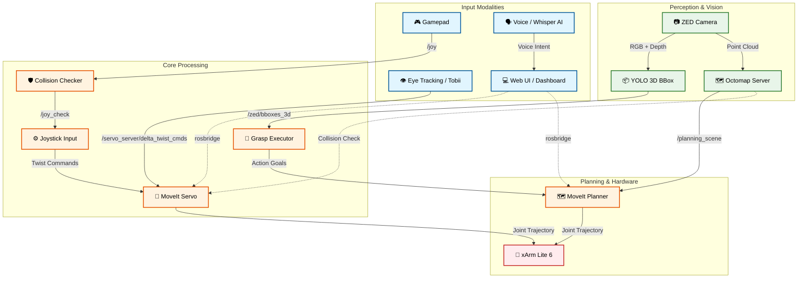
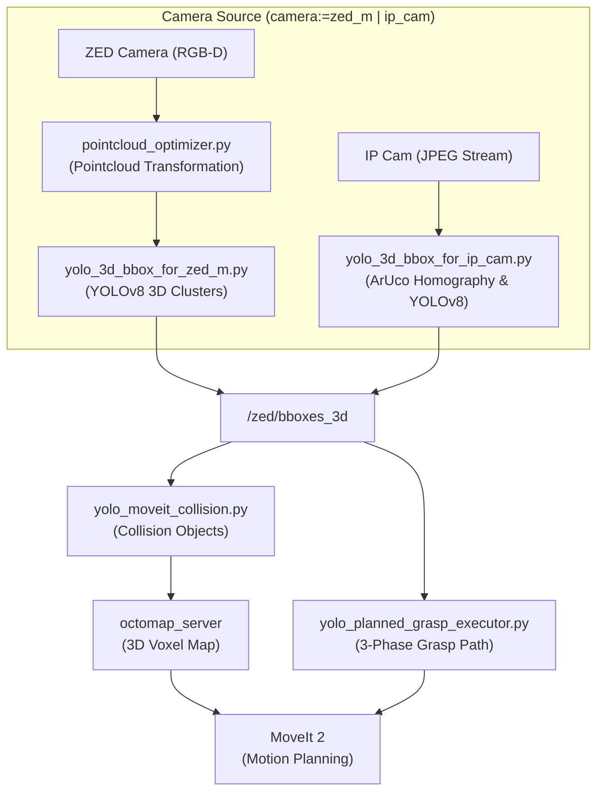
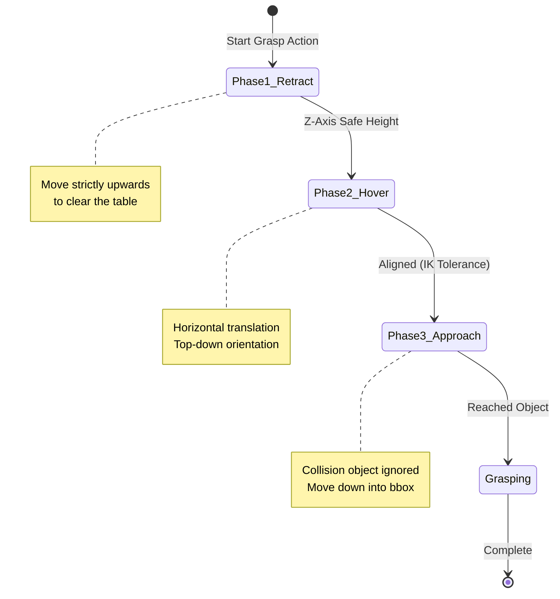
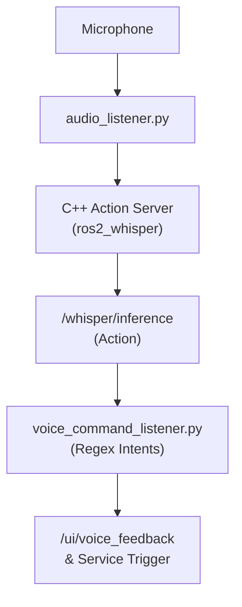
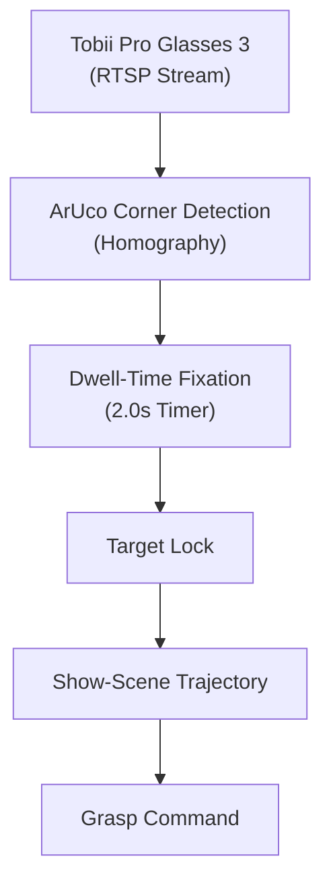
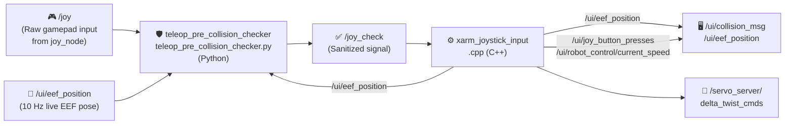
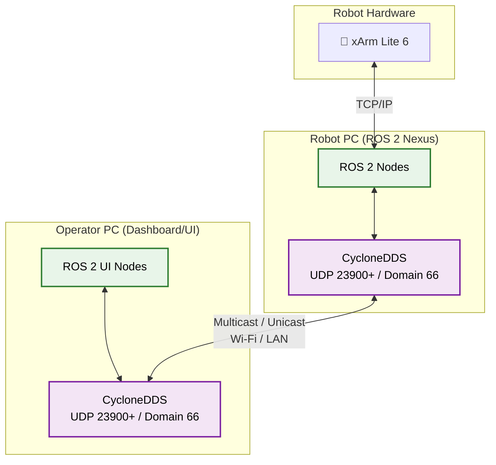
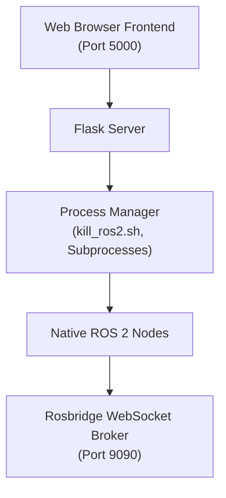
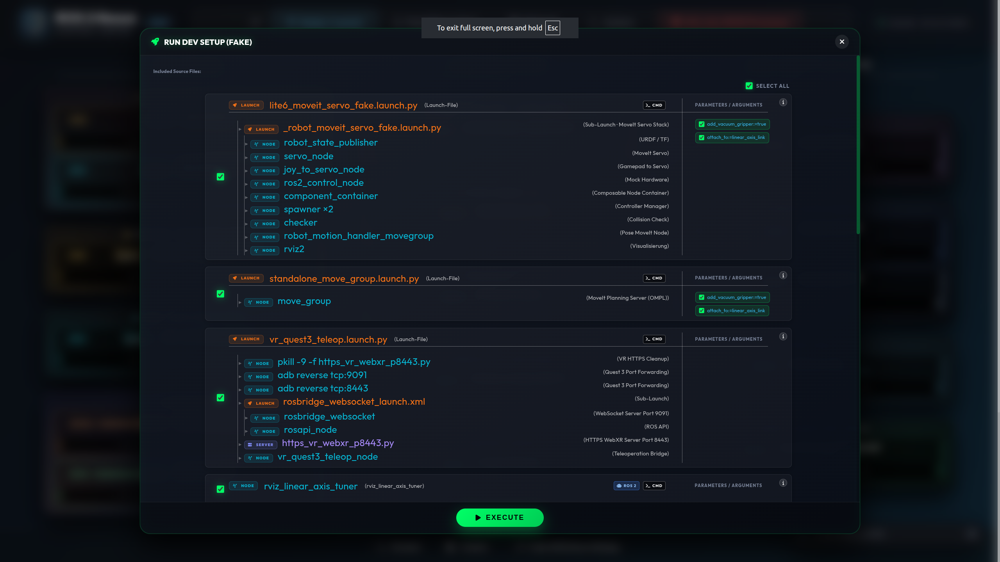

# xArm ROS 2 Extended Workspace (ROS2 Humble) **[MASTER VERSION]**

<p align="center">
  
  &nbsp;&nbsp;&nbsp;
  
  &nbsp;&nbsp;&nbsp;
  
  &nbsp;&nbsp;&nbsp;
  
</p>

<p align="center">
  <a href="readme-de.md">🇩🇪 <b>Auf Deutsch lesen / Read in German</b></a>
</p>

This repository is a continuously evolving research and evaluation platform for multimodal teleoperation and Human-Computer Interaction (HCI). The goal is to lower technical barriers in robot control through intuitive interfaces like eye-tracking, voice control, manual fine-control (e.g., via gamepads or the mouse-driven Web-UI), and assistive automation. A central aspect is also the provision of modern graphical user interfaces (GUIs) that make complex processes easily accessible. Based on the shared-control paradigm (human and machine interacting cooperatively), the project investigates how cognitive workloads can be reduced and how equal, inclusive participation in the modern workplace (Industry 5.0) can be technologically realized. <br>
<p align="center">
 
</p>

> [!IMPORTANT]
> **Core Prerequisite:** This repository is an *extension workspace*. It is built entirely on top of the official [xarm_ros2 repository (Branch: humble)](https://github.com/xArm-Developer/xarm_ros2/tree/humble) from UFactory. The official repository, its structure, and all of its system dependencies form the mandatory foundational baseline for this software!

<br>

## Table of Contents
1. [📋 Project Overview](#1--project-overview)
   - [1.1 ⚡ 5-Minute Quickstart (Pure Simulation)](#11--5-minute-quickstart-pure-simulation)
2. [🔬 Architecture & Guiding Principles](#2--architecture--guiding-principles)
   - [2.1 The System Concept: An Integrated Development, Evaluation, and Validation Platform](#21-the-system-concept-an-integrated-development-evaluation-and-validation-platform)
3. [⚙️ Core Features & ROS 2 Nodes](#3--core-features--ros-2-nodes)
   - [3.1 Operating Modes: FAKE vs. REAL (Hardware Interfaces)](#31-operating-modes-fake-vs-real-hardware-interfaces)
     - [3.1.1 Simulation (FAKE) vs. Real Hardware (REAL) Matrix](#311--simulation-fake-vs-real-hardware-real-matrix)
   - [3.2 Feature: Gamepad Teleoperation & Hard Collision Protection](#32-feature-gamepad-teleoperation--hard-collision-protection)
   - [3.3 Feature: Autonomous Grasping & 3D Object Detection (YOLO / ZED)](#33-feature-autonomous-grasping--3d-object-detection-yolo--zed)
   - [3.4 Feature: Multimodal Interaction (Voice & Gaze Control)](#34-feature-multimodal-interaction-voice--gaze-control)
   - [3.5 Feature: VR Quest 3 Teleoperation](#35-feature-vr-quest-3-teleoperation)
   - [3.6 Feature: GUI - Graphical Robot Control & Visual Feedback](#36-feature-gui---graphical-robot-control--visual-feedback)
   - [3.7 Feature: Digital Twin & Simulation (NVIDIA Isaac Sim)](#37-feature-digital-twin--simulation-nvidia-isaac-sim)

4. [🕹️ Multimodal Technologies & Interaction Concepts](#4--multimodal-technologies--interaction-concepts)
   - [4.1 Robot Control Methods (Inputs)](#41-robot-control-methods-inputs)
   - [4.2 Perception & Assistance](#42-perception--assistance)
   - [4.3 VLA & Video Action Models (Planned)](#43-vla--video-action-models-planned)
   - [4.4 User Interfaces (UI/GUI)](#44-user-interfaces-uigui)
5. [🎮 Gamepad Control — Deep Dive](#5--gamepad-control--deep-dive)
   - [5.1 Pipeline Architecture](#51-pipeline-architecture)
   - [5.2 `teleop_pre_collision_checker.py` — Collision Guard (Python Node)](#52-teleop_pre_collision_checkerpy--collision-guard-python-node)
   - [5.3 `xarm_joystick_input.cpp` — Motion Controller (C++ Node)](#53-xarm_joystick_inputcpp--motion-controller-c-node)
6. [📦 Dependencies & Requirements](#6--dependencies--requirements)
   - [6.1 Hardware Bill of Materials (BOM) & Physical Wiring](#61--hardware-bill-of-materials-bom--physical-wiring)
7. [🚀 Execution: How to Run the System](#7--execution-how-to-run-the-system)
   - [7.1 Step 1: Hardware Preparation](#71-step-1-hardware-preparation)
   - [7.2 Step 2: Launch the System (Nexus Webapp)](#72-step-2-launch-the-system-nexus-webapp)
   - [7.3 Step 3: Start Nodes via GUI](#73-step-3-start-nodes-via-gui)
   - [7.4 Network & Port Architecture](#74-network--port-architecture)
     - [7.4.1 Nexus Web Backend Architecture](#741-nexus-web-backend-architecture)
     - [7.4.2 Dashboard & Control Web UI Architecture](#742-dashboard--control-web-ui-architecture)
   - [7.5 Remote Control (Server-/Client Communication)](#75-remote-control-server-client-communication)
   - [7.6 DDS Multicast Storm Prevention & Loopback Discovery (Critical)](#76-dds-multicast-storm-prevention--loopback-discovery-critical)
   - [7.7 Launcher Configuration (`launcher_config.json`)](#77-launcher-configuration-launcher_configjson)
   - [7.8 CycloneDDS UDP Buffer Overflows (Point Cloud Lag)](#78-cyclonedds-udp-buffer-overflows-point-cloud-lag)
   - [7.9 Troubleshooting & Frequently Asked Questions (FAQ)](#79--troubleshooting--frequently-asked-questions-faq)
8. [📊 Monitoring: Dashboard & Workspace Analyzer](#8--monitoring-dashboard--workspace-analyzer)
   - [8.1 Workspace Analyzer Backend (`workspace_analyzer.py`)](#81-workspace-analyzer-backend-workspace_analyzerpy)
   - [8.2 Frontend (`dashboard_index.html`)](#82-frontend-dashboard_indexhtml)
   - [8.3 Launch Commands for UI Components](#83-launch-commands-for-ui-components)
9. [🗂️ Repository Structure](#9--repository-structure)
10. [🗄️ Archive / Architectural Decisions & Deprecated Concepts](#10--archive--architectural-decisions--deprecated-concepts)


---
<br>

## 1. 📋 Project Overview

<br>

### 🎯 Concept: An Integrated, Multimodal Teleoperation Platform
The primary goal of this project is the development and implementation of a modular control and interaction platform for the UFactory xArm Lite 6 robot arm. The system consolidates heterogeneous, multimodal input methods into a centralized software environment and places a consistent focus on maximized usability and intuitive operation. The system handles the calculation of complex robot movements in the background. This creates a simple interface that directly translates the user's intentions into robotic actions.

<br>

### 💡 Motivation: Assistance, Inclusion, and Participation in the Context of Industry 5.0
In practice, classical methods of teleoperation and robot control are highly error-prone and demand immense cognitive fine control and technical expertise from the operator. These high barriers exclude many people from direct usage. In the spirit of the Industry 5.0 guiding principles—which place the human, sustainability, and resilience at the center of industrial production—this project starts exactly here:

- **Lowering Technical Barriers:** Reducing entry thresholds by shifting from low-level joint coordination toward intuitive high-level commands.
- **Promoting Inclusion:** Creating technological conditions to enable productive and equal participation in the modern workplace, even for people with different physical or cognitive capabilities.
- **Human-Machine Synergy:** Establishing the robot as an assistive tool that relieves the human instead of replacing them.

<br>

### ⚙️ Operating Principle: Shared Control and the "Human-in-the-Loop" Paradigm
The technological foundation of the platform is based on a dynamic *shared control* approach, where human and machine interact cooperatively. The user remains permanently integrated into the control loop as a supervisor (*Human-in-the-Loop*), but controls the system through a tiered, complementary interaction pattern:

- **Intuitive High-Level Commands:** Initiating global actions or target specifications via natural modalities such as gaze control (eye tracking) or voice commands.
- **Precise Low-Level Corrections:** Seamless, low-latency switching to manual input devices (e.g., gamepad/MoveIt Servo) for sensitive adjustments in the workspace.
- **Context-Sensitive Assistance:** Autonomous path planning and collision-free trajectory calculation in the background to actively safeguard the operator during execution.

<br>

### 🏆 Objective: A Valid, Cost-Effective Proof-of-Concept
The project presents itself as a fully functional, reproducible, and economically affordable Proof-of-Concept (PoC) for academic research landscapes and practice-oriented inclusion projects. The open architecture serves as a standardized evaluation platform on which novel assistive robotics systems can be developed, tested, and empirically validated under realistic conditions.

<br>

### 📊 Evaluation Logic & Guidelines: From Research to Industrial Practice
A key core and innovative character of the project lies in the scientific analysis of interaction quality. The system serves not only as a technical demonstrator, but as a tool to generate transferable knowledge:

- **Development of an Evaluation Logic:** Systematic capture and measurement of usability, cognitive load, and system performance for quantitative assessment of the human-robot interface.
- **Derivation of Action Recommendations:** Formulation of standardized guidelines that serve companies as a strategic guide during the introduction of modern robot systems.
- **Answering the Transformation Question:** Concrete practical assistance on the core question: *“How can processes and workplaces be structured to measurably meet the human-centered requirements of Industry 5.0?”*
- **Service Potential:** The resulting frameworks and guidelines have the potential to be provided as a validated, monetizable consulting and service offering for industry, accompanying digital and demographic changes in production.

<br>

### 1.1 ⚡ 5-Minute Quickstart (Pure Simulation)

> [!TIP]
> **No physical robot or hardware required!** You can build, launch, and test the entire software stack (digital twin simulation, RViz2, Robot Control UI and Dashboard Monitoring UI) immediately on your local PC.

#### 1. Build & Source Workspace
```bash
cd ~/dev_ws
colcon build --symlink-install
source install/setup.bash
```

#### 2. Launch the Central Process Cockpit (Nexus Webapp)
```bash
./ros2_nexus/ros2_nexus_web_start.sh
```
*This starts the local process manager daemon and automatically opens the Nexus Webapp in your default browser at `http://localhost:5000`.*

#### 3. Run Simulation & Explore the Web UIs
1. Inside the **Nexus Webapp**, click the green button **`RUN DEV SETUP (FAKE)`**.
   * Opens the DEV SETUP popup; **EXECUTE** starts the simulated xArm Lite 6 `ros2_control` hardware interface, MoveIt 2 Servo + MoveGroup, RViz2, the virtual linear axis and the Robot Control UI incl. WebSocket ROS Bridge (`ws://localhost:9090`) and video server (8082). Vision, speech control, eye tracking and VR are further cards in the same popup and can be unticked.
2. Open the **Robot Control UI** (`http://localhost:8081`):
   * Test Cartesian XYZ jog controls, drive the joint sliders, or command the initial home pose. *(The gripper buttons drive the gripper directly — see 3.6.)*
3. Open the **Dashboard Monitoring UI** (`http://localhost:8080/dashboard_index.html`). It is **not** part of the DEV SETUP: first start **Dashboard Monitoring (Port 8080)** and **Workspace Analyzer** in the Nexus section `Workspace Analyzer Backend`.
   * Inspect real-time topic communication rates (Hz), visualize node topology graphs, and inspect live parameters.

[⬆️ Back to Top](#table-of-contents)

---
<br>

## 2. 🔬 Architecture & Guiding Principles

---
<br>

### 🗺️ System Architecture & Data Flow
The following diagram illustrates the modular design and the asynchronous data flow between sensory input, UI elements, and the control components:




---


### 2.1 The System Concept: An Integrated Development, Evaluation, and Validation Platform
The core objective of the project is the realization of a modular, platform-based software architecture for multimodal teleoperation and AI-supported assistive robotics. The system acts as a central, software-side integration node (middleware level) that unifies heterogeneous subsystems into a consistent runtime environment. Through a distributed server-client network (multi-PC setup) and the software-side coupling to a real-time capable Digital Twin (NVIDIA Isaac Sim), the platform serves as both a flexible development environment and a standardized, replicable test environment. The project is explicitly designed as a closed loop of development and empirical validation:

- **Sensors & Perception:** Integration of depth cameras (e.g., object detection via YOLO, marker tracking) and tactile or physiological sensors for state estimation.
- **Multimodal Control:** Parallel integration of various input channels such as eye-tracking systems for gaze target acquisition, voice control (e.g., via OpenAI Whisper), and classical hardware controllers (gamepads, 3D mice).
- **Cognitive Robotics:** Integration of modern Vision-Language-Action (VLA) models to directly translate highly abstract, verbal and visual commands into robotic action sequences.
- **Integrated Data Acquisition:** Time-synchronous recording of technical performance parameters and human interaction data via a central logging infrastructure during system usage.

<br>

### 🧑‍💻 Human-Centered Automation
The system architecture places the human operator at the center of the interaction design. The system is designed to allow users to cognitively grasp the current state of automation throughout operation and to anticipate subsequent system actions. This transparency dismantles algorithmic black-box structures, bringing significant advantages for practical application:

- **Cognitive Transparency:** Consistent comprehensibility of system states, especially during the parallel processing of gaze patterns and sensory feedback.
- **Informed Intervention:** Empowering the operator to make safe and targeted interventions in critical or unforeseen interaction situations.
- **Calibrated Trust in Automation:** Creating a reliable technological basis for systematically building *trust in automation*, which is evaluated through user studies.

<br>

### 🤝 Shared Control & Cognitive Relief
A key feature of the software architecture is the implementation of *shared control* paradigms for cooperative task execution. The platform enables a seamless, low-latency transfer of control authority between manual guidance, gaze-controlled interactions, and AI-assisted, semi-automated assistance functions. The context-dependent distribution of control shares targets the following core aspects:

- **Seamless Control Handover:** Low-latency switching between manual input (e.g., via MoveIt Servo / gamepad) and autonomous system actions (e.g., gaze-based grasping).
- **Minimizing Mental Workload:** Targeted reduction of the user's mental workload during complex or long-lasting manipulation tasks.
- **Autonomous Error Compensation:** Independent mitigation of error-prone low-level corrections by the system, thereby freeing up cognitive resources for high-level process monitoring.
- **Empirical Validation:** Ongoing verification of actual cognitive relief throughout the project using standardized psychometric methods.

<br>

### 📈 HCI & Usability Focus & Empirical Evaluation
The design of the central control interface (GUI) follows established principles of Human-Computer Interaction (HCI). Interaction patterns shift from the complex coordination of individual degrees of freedom or manually invoking distributed terminal processes toward intention-based task completion. An integral part of the project is conducting systematic user studies to evaluate these multimodal interfaces:

- **Intention-Based Control:** Translating abstract action intents (via voice, gaze target, or high-level controller) into precise kinematic trajectories.
- **Standardized Usability Metrics:** Collection of subjective usability via established questionnaires such as the *System Usability Scale* (SUS).
- **Objective Performance Parameters:** Measuring quantitative factors such as *task completion time*, error rates, and specific gaze paths.
- **Load Analysis:** Empirical verification of the participants' cognitive load using the *NASA-TLX* index for iterative system optimization.

<br>

### 🔓 Reproducible & Open Source
To ensure scientific validity, the project is designed as an open-source architecture. Disclosing the complete codebase ensures the methodological transparency of all algorithms, configurations, and data flows. For the scientific community, this yields key added value:

- **Methodological Transparency:** Full visibility of all underlying algorithms, URDF models, and MoveIt configurations.
- **Exact Replication:** Enabling straightforward secondary investigations by independent research groups under identical conditions.
- **Statistical Verifiability:** Traceability and validation of complex, recorded sensor data streams and control inputs.
- **Standardized Benchmark:** Establishing the platform as a reliable baseline for comparative studies in the field of assistive and inclusive robotics.

<br>

### Cost-Effective Hardware
The system configuration is primarily based on economically affordable, commercially available off-the-shelf components (COTS), without compromising the required precision and functional reliability. This approach pursues clear strategic goals:

- **Democratizing Access:** Reducing investment and financial barriers when entering modern, multimodally controlled robotics technologies.
- **Target Audience Transfer:** Facilitating technology transfer into inclusive projects, educational institutions, and smaller research facilities (e.g., via the UFactory xArm Lite 6 and consumer controllers).
- **Validating Reliability:** Targeted scientific evaluation of the extent to which cost-effective hardware represents a valid research platform in direct comparison to high-priced industrial systems.

<br>

### Modular & Industry Standard
The software-side infrastructure is modularly encapsulated and fully integrated into the ROS 2 Humble middleware framework. The native use of standardized communication primitives ensures interoperability with industrial ecosystems. The consistent modular principle offers crucial architectural advantages:

- **Native ROS 2 Communication:** Full compatibility with established ecosystems (like MoveIt 2) and modern sensor SDKs via nodes, topics, services, and actions.
- **Isolated Subsystem Encapsulation:** Straightforward replacement or extension of individual modules—such as VLA pipelines for intent recognition or specific eye-tracking drivers.
- **Future-Proofing & Portability:** Low-maintenance software structure allowing easy migration to future ROS 2 LTS distributions without modifying the overall platform.


[⬆️ Back to Top](#table-of-contents)

---
<br>

## 3. ⚙️ Core Features & ROS 2 Nodes

To provide a clear understanding of the architecture, the software modules are categorized by their functional **Features (Use-Cases)**. Each module is explicitly labeled as a ROS 2 Node, Script, or Plugin.

---
<br>


### 3.1 Operating Modes: FAKE vs. REAL (Hardware Interfaces)
The platform strictly distinguishes between two operating modes for the robot arm. This distinction refers **exclusively to the `ros2_control` hardware interface** and is independent of sensors (like the camera or YOLO, which can run live in both modes):

-blue?style=for-the-badge)<br>
The robot runs via the `mock_components/GenericSystem` (or FakeSystem) hardware interface within `ros2_control`. There is no physical controller connection. Commands to the `/lite6_traj_controller` or `/servo_server` are purely virtually rendered in RViz2 by mirroring the joint states. Proprietary UFactory API calls (like Mode/State switches) intentionally lead nowhere in this mode or are bypassed in software.

-red?style=for-the-badge)<br>
The `ros2_control` framework integrates the real `xarm_api` hardware interface, which communicates directly via TCP/IP with the physical controller of the xArm Lite 6. In this mode, hardware limits, physical safety stops, and the exclusive switching of proprietary xArm hardware modes (e.g., Mode 0 for pose control vs. Mode 1 for Servo/jogging) take effect via the UFactory API.

> [!NOTE]
> **Virtual Linear Axis (Simulation Only):** In FAKE mode, it is possible to mount the robot on a virtual linear axis without affecting the MoveIt planning group (`lite6`).
> - **Activation:** With `attach_to:=linear_axis_link` the FAKE launch (`lite6_moveit_servo_fake.launch.py`) starts the `fake_linear_axis` node by itself. **RUN DEV SETUP (FAKE)** passes this argument; when starting manually, append it to the launch command.
> - **Control:** The GUI slider in the Web UI (Port 8081) or gamepad D-Pad (Left/Right) controls the horizontal translation by publishing `/linear_axis_cmd`. The headless node `fake_linear_axis` (`ros2 run fake_linear_axis fake_linear_axis`) translates this into the dynamic TF and visual rail markers.
> - **MoveIt Architecture:** The axis is shifted purely via dynamic TF (`world` -> `linear_axis_link`), completely decoupled from the URDF joints. This ensures MoveIt automatically recognizes the new base pose for planning/collision detection without needing a 7-DoF IK solver.
> - **URDF Modification:** To prevent parsing errors with dynamic `attach_to` arguments, `xarm_description/urdf/xarm_device_macro.xacro` was modified. The `create_attach_link` condition now generates a root link for *any* custom `attach_to` string, rather than being hardcoded to only `"world"`.

<br>

#### 3.1.1 📊 Simulation (FAKE) vs. Real Hardware (REAL) Matrix
The table below illustrates which project modules can be evaluated in pure software simulation on a standard PC versus which features require physical hardware devices:

| Feature / Subsystem | Pure Simulation (FAKE) | Real Hardware (REAL) | Required Hardware / Peripheral |
|---|:---:|:---:|---|
| **Robot Control UI (Port 8081)** | ✅ Functional (RViz Mirror) | ✅ Functional (Hardware Motion) | Host PC & Web Browser |
| **Dashboard Monitoring UI (Port 8080)** | ✅ Functional | ✅ Functional | Host PC & Web Browser |
| **MoveIt 2 Cartesian Path Planning & IK** | ✅ Functional | ✅ Functional | Host PC |
| **Virtual Linear Rail Axis** | ✅ Functional | ➖ Simulation Only | Host PC |
| **Gamepad Teleoperation (MoveIt Servo)** | ✅ Functional | ✅ Functional | Xbox One / Series Controller |
| **Predictive Hard Collision Guard** | ✅ Functional | ✅ Functional | Host PC |
| **Acoustic Speech Interaction (Whisper AI)** | ✅ Functional | ✅ Functional | Standard USB / Laptop Microphone |
| **3D YOLO Object Detection & Clustering** | ❌ *(or via Rosbag replay)* | ✅ Functional | Stereolabs ZED Mini (USB 3.0) |
| **Dynamic MoveIt Collision Objects** | ❌ *(or via Rosbag replay)* | ✅ Functional | Stereolabs ZED Mini (USB 3.0) |
| **Autonomous 3D Grasp Routine** | ❌ *(Needs 3D Camera)* | ✅ Functional | xArm Lite 6 & ZED Mini |
| **Tobii Eye-Tracking Interaction** | ❌ *(Needs Glasses)* | ✅ Functional | Tobii Pro Glasses 3 (Wi-Fi / LAN) |
| **Meta Quest 3 WebXR Teleoperation** | ❌ *(Needs VR Headset)* | ✅ Functional | Meta Quest 3 (Wi-Fi, Port 8443) |

---
<br>


### 3.2 Feature: Gamepad Teleoperation & Hard Collision Protection
*This subsystem manages the manual jogging of the robot via the Xbox controller and actively prevents the robot from colliding with the workspace surface due to operator error.*

---

<br>

####  `xarm_joystick_input.cpp` &nbsp;&nbsp; <sub><i>[`/src/xarm_ros2/xarm_moveit_servo/src/xarm_joystick_input.cpp`](./src/xarm_ros2/xarm_moveit_servo/src/xarm_joystick_input.cpp)</i></sub>
> [!NOTE]
> 💻 **Run Command:**
> ```bash
> # Real Hardware MoveIt Servo (with vacuum gripper & 3D scene objects):
> ros2 launch xarm_moveit_servo lite6_moveit_servo_realmove.launch.py robot_ip:=192.168.1.175 add_vacuum_gripper:=true report_type:=dev static_objects:=true
>
> # Simulation / Fake Hardware (with virtual linear axis & 3D scene objects):
> ros2 launch xarm_moveit_servo lite6_moveit_servo_fake.launch.py add_vacuum_gripper:=true attach_to:=linear_axis_link static_objects:=true
> ```
> *`rviz:=false` starts MoveIt Servo without the RViz window (default `true`; in the Nexus Webapp as the `rviz:=true` checkbox on the servo action card).*
> *Further arguments of both launch files: `joystick_and_checker:=false` starts neither `joy_node` nor `teleop_pre_collision_checker` (used by the server sequences, where the gamepad sits on the client PC); `floor_collision:=false` skips `moveit_floor_collision`. Both launches also include `standalone_move_group.launch.py`.*
> *(Loaded natively as Component inside the MoveIt Servo bringup)*
>
> **Purpose & Task:** Translates the sanitized gamepad signals (analog sticks & triggers) into Cartesian velocity commands (`TwistStamped`) for MoveIt Servo. Applies exponential smoothing and handles all button mappings.
>
> **🎮 Controller Mapping (Quick Reference):**
>> | Input | Action | Details |
>> | :--- | :--- | :--- |
>> | **Left Stick** (↕️/↔️) | **Translate (X / Y)** | *Moves the robot forward/backward (X) and left/right (Y)* |
>> | **LT / RT** (Triggers) | **Translate (Z)** | *Moves the robot arm up (LT) and down (RT)* |
>> | **LB / RB** (Bumpers) | **Rotate (Yaw)** | *Rotates the end effector around its vertical axis* |
>> | **D-Pad** (↕️) | **Speed Control** | *Cycles through 5 speed levels* |
>> | **D-Pad** (↔️) | **Linear Axis** | *Moves the robot along the rail (Base Y-Shift)* |
>> | **START / BACK** | **Reference Frame** | *Toggles between base (`link_base`) and tool coordinates (`link_tcp`)* |
>> | **Button A** (🟢) | **Gripper Open / Close or Vacuum On / Off** | *Depends on the launch argument: `add_gripper:=true` toggles the Lite 6 gripper open/closed, `add_vacuum_gripper:=true` toggles the vacuum on/off. Without either (`gripper_type: none`) the button does nothing.* |
>> | **Button B** (🔴) | **Gripper Off** | *Lite 6 gripper: stops immediately and releases the holding force. Vacuum: switches off.* |
>> | **Button X** (🔵) | **Microphone (Voice)** | *Starts/Stops recording for Whisper AI* |
>> | **Button Y** (🟡) | **Initial Pose** | *Moves the robot to the safe home position* |
>
>
> 
>
>> | Topic / Interface | Msg Type | Description |
>> |---|---|---|
>> | **`/joy_check`** | `sensor_msgs/Joy` | *Reads the sanitized controller inputs from the guardian node.* |
>> | **`/ui/robot_control/set_speed_index`** | `std_msgs/Int32` | *Receives speed setting adjustments from UI or gamepad.* |
>> | **`/ui/gripper_cmd`** | `std_msgs/String` | *Gripper command from the Robot Control UI (`open` / `close` / `off` / `toggle`) - runs through the same logic as buttons A/B.* |
>
>
> 
>
>> | Topic / Interface | Msg Type | Description |
>> |---|---|---|
>> | **`/servo_server/delta_twist_cmds`** | `geometry_msgs/TwistStamped` | *Sends Cartesian velocity commands to the Servo Server.* |
>> | **`/ui/eef_position`** | `std_msgs/Float32MultiArray` | *Publishes the live end-effector pose (X, Y, Z, R, P, Y) at 10 Hz for the Web UI.* |
>> | **`/ui/robot_control/current_speed`** | `std_msgs/Float32` | *Publishes the current speed factor for the UI.* |
>> | **`/ui/joy_button_presses`** | `std_msgs/String` | *Publishes human-readable UI button events from gamepad.* |
>> | **`/ui/gripper_state`** | `std_msgs/String` (latched) | *Gripper state (`open` / `closed` / `off`) - keeps the gamepad toggle and the UI buttons in sync.* |
>> | **`/ui/gripper_type`** | `std_msgs/String` (latched) | *Configured gripper (`vacuum` / `gripper` / `none`) from the launch argument.* |
>> | **`/ui/robot_control/current_frame`** | `std_msgs/String` | *Publishes the current reference frame (e.g. World, TCP).* |
>> | **`/linear_axis_cmd`** | `std_msgs/Float64` | *Publishes the command to move the linear axis.* |
>
>
> 
>
>> | Frame / Transformation | Description |
>> |---|---|
>> | **`link_base` ➔ `link_tcp`** | *Listens to the current TCP position for live telemetry computation.* |
>
>
> 
>
>> | Topic / Interface | Msg Type | Description |
>> |---|---|---|
>> | **`/servo_server/start_servo`** | `std_srvs/srv/Trigger` (Client) | *Starts the MoveIt Servo engine on bringup.* |
>> | **`/servo_server/stop_servo`** | `std_srvs/srv/Trigger` (Client) | *Safely stops the MoveIt Servo engine.* |
>> | **`/ufactory/set_vacuum_gripper`** | `xarm_msgs/srv/VacuumGripperCtrl` (Client) | *Vacuum on/off (Button A, Button B = off) with `add_vacuum_gripper:=true`.* |
>> | **`/ufactory/open_lite6_gripper`** | `xarm_msgs/srv/Call` (Client) | *Opens the Lite 6 gripper (Button A, with `add_gripper:=true`).* |
>> | **`/ufactory/close_lite6_gripper`** | `xarm_msgs/srv/Call` (Client) | *Closes the Lite 6 gripper (Button A, with `add_gripper:=true`).* |
>> | **`/ufactory/stop_lite6_gripper`** | `xarm_msgs/srv/Call` (Client) | *Stops the Lite 6 gripper immediately, releasing the holding force (Button B, with `add_gripper:=true`).* |
>> | **`/ufactory/get_position`** | `xarm_msgs/srv/GetFloat32List` (Client) | *Queries the current Cartesian controller position from the xArm driver.* |
>> | **`/ui/execute_initial_pose`** | `std_srvs/srv/Trigger` (Client) | *Triggers initial/home pose sequence via central motion handler (Button Y).* |
>
>
> 
>
>> | Topic / Interface | Msg Type | Description |
>> |---|---|---|
>> | **`/whisper/inference`** | `whisper_idl/action/Inference` | *Starts/cancels Whisper AI speech recognition on button press (Button X).* |
>

---

<br>

####  `teleop_pre_collision_checker.py` (`teleop_pre_collision_checker`) &nbsp;&nbsp; <sub><i>[`/src/teleop_pre_collision_checker/teleop_pre_collision_checker/teleop_pre_collision_checker.py`](./src/teleop_pre_collision_checker/teleop_pre_collision_checker/teleop_pre_collision_checker.py)</i></sub>
> [!NOTE]
> 💻 **Run Command:**
> ```bash
> ros2 run teleop_pre_collision_checker teleop_pre_collision_checker
> ```
>
> **Purpose & Task:** Acts as a transparent guardian *before* movement execution. Predictively computes the future Z-coordinate (0.1 sec lookahead). If the robot would violate the safety barrier ($Z \le 91.0\text{ mm}$), the downward command is hard-overridden and zeroed out. Triggers gamepad rumble feedback (vibration via `pygame`) on collision risk.
>
>
> 
>
>> | Topic / Interface | Msg Type | Description |
>> |---|---|---|
>> | **`/joy`** | `sensor_msgs/Joy` | *Raw gamepad inputs from `joy_node`.* |
>> | **`/servo_server/status`** | `std_msgs/Int8` | *MoveIt Servo warning codes (approaching/halt collision/singularity).* |
>> | **`/ui/eef_position`** | `std_msgs/Float32MultiArray` | *Live end-effector pose for real-time Z-height checking.* |
>> | **`/ui/robot_control/current_speed`** | `std_msgs/Float32` | *Current velocity scaling factor for accurate lookahead prediction.* |
>> | **`/ui/moveit_collision_ground_enabled`** | `std_msgs/Bool` (latched) | *Follows the ground collision switch of the Robot Control UI: when it is OFF, downward motion is no longer blocked. Without a message (node not running) the block stays active.* |
>
>
> 
>
>> | Topic / Interface | Msg Type | Description |
>> |---|---|---|
>> | **`/joy_check`** | `sensor_msgs/Joy` | *Sanitized gamepad signal forwarded to `xarm_joystick_input`.* |
>> | **`/ui/collision_msg`** | `std_msgs/String` | *Publishes collision warnings to RViz overlay and Web UI.* |
>
>
> 
>
>  * `Z_LIMIT = 91.0` – Hard table barrier on the Z-axis (World-Frame) in millimeters.
>  * `CAUTION_ZONE_START = 110.0` – Z-height (mm) where velocity starts being restricted.
>  * `CAUTION_ZONE_SPEED = 0.25` – Maximum allowed speed factor within the caution zone.
>  * `LOOKAHEAD_TIME = 0.1` – Prediction horizon (seconds) for velocity lookahead.
>  * `MAX_LINEAR_VELOCITY_MM_S = 75.0` – Baseline linear velocity in mm/s.
>  * `ACCELERATION_FACTOR = 0.9` – Damping factor applied during lookahead calculation.
>  * `DOWN_TRIGGER_AXIS = 5` – Joy axis index of the right trigger (RT, downward).
>  * `EEF_TIMEOUT = 1.0` – Seconds without a new `/ui/eef_position` after which the position counts as unknown and downward motion is blocked.
>

---

<br>

####  `laser_pointer_node.py` (`tcp_laser_pointer`) &nbsp;&nbsp; <sub><i>[`/src/tcp_laser_pointer/tcp_laser_pointer/laser_pointer_node.py`](./src/tcp_laser_pointer/tcp_laser_pointer/laser_pointer_node.py)</i></sub>
> [!NOTE]
> 💻 **Run Command:**
> ```bash
> ros2 run tcp_laser_pointer laser_pointer_node
> ```
>
> **Purpose & Task:** Continuously monitors the real Cartesian Z-height of the Tool Center Point (`link_tcp`) relative to the robot base (`link_base`) via TF2 at 10 Hz. Whenever the TCP reaches a height of $50\text{ mm}$ ($0.05\text{ m}$) or below, it automatically turns ON the hardware laser pointer mounted on the gripper via the digital tool output (TGPIO Digital Out 0). Once the height exceeds this threshold, the node immediately switches the laser pointer OFF.
>
>
> 
>
>> | Frame / Transformation | Description |
>> |---|---|
>> | **`link_base` ➔ `link_tcp`** | *Monitors the live Cartesian TCP position at 10 Hz.* |
>
>
> 
>
>> | Topic / Interface | Msg Type | Description |
>> |---|---|---|
>> | **`/xarm/set_tgpio_digital`** | `xarm_msgs/srv/SetDigitalIO` (Client) | *Controls Tool Digital Output 0 (TGPIO) on the gripper to switch the laser pointer ON (1) or OFF (0).* |
>

<br>

####  `xarm_moveit_servo` &nbsp;&nbsp; <sub><i>[`/src/xarm_ros2/xarm_moveit_servo`](./src/xarm_ros2/xarm_moveit_servo)</i></sub>
> [!NOTE]
> **Purpose & Task:** The real-time motion engine from MoveIt. Checks every command against the planning scene (YOLO collision objects, floor) and slows down / halts the arm before it collides with objects.
>
>
> 
>
>> | Topic / Interface | Msg Type | Description |
>> |---|---|---|
>> | **`/servo_server/delta_twist_cmds`** | `geometry_msgs/TwistStamped` | *Reads incoming Cartesian velocity commands.* |
>> | **`/planning_scene`** | `moveit_msgs/PlanningScene` | *Reads the current 3D scene for obstacle avoidance.* |
>
>
> 
>
>> | Topic / Interface | Msg Type | Description |
>> |---|---|---|
>> | **`/lite6_traj_controller/joint_trajectory`** | `trajectory_msgs/JointTrajectory` | *Sends safe, collision-free joint trajectories to the arm.* |
>> | *-* | *-* | *Sends the final joint angles to the robot.* |
>
>
>  **(`xarm_moveit_servo_config.yaml`)**
>
>  * `check_collisions: true`, `collision_check_rate: 10.0` – Collision checking of the whole robot body at 10 Hz.
>  * `self_collision_proximity_threshold: 0.01` / `scene_collision_proximity_threshold: 0.01` – Below these distances (1 cm) Servo slows down exponentially in all directions.
>  * `collision_check_type: stop_distance`, `collision_distance_safety_factor: 0.5`, `min_allowable_collision_distance: 0.02` – Settings of the stop-distance mode (slow down from ~5 cm, halt at 2 cm). According to the comment in the config, MoveIt Servo in Humble only evaluates the threshold mode, so the proximity thresholds above decide in practice.
>
>

---
<br>


### 3.3 Feature: Autonomous Grasping & 3D Object Detection (YOLO / ZED)
*This subsystem is responsible for locating objects in 3D space, generating virtual obstacles, and navigating the robot precisely to the target.*



---

<br>

####  `robot_vision_cameras_bringup.launch.py` &nbsp;&nbsp; <sub><i>[`/src/robot_vision_cameras_bringup/launch/robot_vision_cameras_bringup.launch.py`](./src/robot_vision_cameras_bringup/launch/robot_vision_cameras_bringup.launch.py)</i></sub>
> [!NOTE]
> 💻 **Run Command:**
> ```bash
> # Default: ZED Mini 3D Depth Pipeline
> ros2 launch robot_vision_cameras_bringup robot_vision_cameras_bringup.launch.py camera:=zed_m
>
> # Alternative: IP Camera Homography Pipeline
> ros2 launch robot_vision_cameras_bringup robot_vision_cameras_bringup.launch.py camera:=ip_cam
> ```
>
> **Purpose & Task:** The central orchestrator for the entire 3D vision, object detection, and autonomous grasping pipeline. Depending on the `camera` argument, it dynamically launches either the ZED Mini hardware driver (`zed_wrapper`) alongside `pointcloud_optimizer.py` and `yolo_3d_bbox_for_zed_m.py`, or the network-based `yolo_3d_bbox_for_ip_cam.py` together with `ip_cam_aruco_6pose_tf_coord.py` (ArUco 6-Pose TF coordinates). It simultaneously starts the MoveIt collision generator (`yolo_moveit_collision.py`), the trajectory grasp server (`yolo_planned_grasp_executor.py`), the UI bridge (`grasp_action_bridge.py`), the RViz distance visualizer (`rviz_object_distance_visualizer.py`), and the MoveIt Servo warnings status overlay (`rviz_servo_status.py`).
>
>
> 
>
>> | Launch Argument | Default | Description |
>> |---|---|---|
>> | `camera` | `zed_m` | *Camera pipeline selection: `zed_m` (ZED Mini depth camera) or `ip_cam` (IP webcam homography).* |
>> | `camera_model` | `zedm` | *ZED camera model (Stereolabs ZED Mini, used when `camera:=zed_m`).* |
>> | `tf_x` | `0.473` | *Calibrated camera X position relative to `link_base` [m] (Tripod setup).* |
>> | `tf_y` | `0.0` | *Calibrated camera Y position relative to `link_base` [m] (Tripod setup).* |
>> | `tf_z` | `0.368` | *Calibrated camera Z height relative to `link_base` [m] (Tripod setup).* |
>> | `tf_roll` | `0.0` | *Camera roll angle [rad] (0.0°, Tripod calibration).* |
>> | `tf_pitch` | `1.00356` | *Camera pitch angle [rad] (+57.5°, tilted downward toward workspace).* |
>> | `tf_yaw` | `3.14159` | *Camera yaw angle [rad] (180.0°, facing the robot).* |
>> | `yolo_model` | `yolov8l.pt` | *YOLO neural network weights file (default: high-accuracy YOLOv8 Large).* |
>> | `confidence_threshold` | `0.35` | *YOLO confidence threshold (default from `perception_params.yaml`).* |
>> | `ema_alpha` | `0.4` | *EMA smoothing of the 3D boxes (default from `perception_params.yaml`).* |
>> | `safe_z_hover_height` | `0.15` | *Hover height above the object [m] (default from `grasping_params.yaml`).* |
>> | `grasp_z_offset` | `0.02` | *Z offset on the object top when grasping [m] (default from `grasping_params.yaml`).* |
>> | `velocity_scaling` / `acceleration_scaling` | `0.2` / `0.1` | *MoveIt scaling of the grasp motion (defaults from `grasping_params.yaml`).* |
>
> *The YAML files stay the source of the defaults; the launch arguments only override them at start (e.g. from the Nexus Webapp).*
>

---

<br>

####  `zed_wrapper` &nbsp;&nbsp; <sub><i>[`/src/zed-ros2-wrapper`](./src/zed-ros2-wrapper)</i></sub>
> [!NOTE]
> 💻 **Run Command:**
> ```bash
> ros2 launch zed_wrapper zed_camera.launch.py camera_model:=zedm
> ```
>
> **Purpose & Task:** The native hardware driver for the Stereolabs ZED Mini Camera (automatically included by `robot_vision_cameras_bringup.launch.py` when `camera:=zed_m`). 
>
>
> 
>
>> | Topic / Interface | Msg Type | Description |
>> |---|---|---|
>> | **`/zed/zed_node/rgb/image_rect_color`** | `sensor_msgs/Image` | *Publishes the color-corrected 2D RGB camera image.* |
>> | **`/zed/zed_node/depth/depth_registered`** | `sensor_msgs/Image` | *Publishes the registered depth map.* |
>> | **`/zed/zed_node/point_cloud/cloud_registered`** | `sensor_msgs/PointCloud2` | *Publishes the dense 3D point cloud.* |
>
>
>  **(`config/zed_override.yaml` Parameter Overrides)**
>
>> | Parameter | Value | Description |
>> |---|---|---|
>> | `depth_mode` | `NEURAL` | *AI-powered neural depth estimation via TensorRT for maximum precision.* |
>> | `grab_resolution` | `HD720` | *Capture resolution 1280 × 720.* |
>> | `pub_resolution` | `NATIVE` | *Publishes at the capture resolution without downsampling (HD720: ~921,600 points/frame).* |
>> | `depth_confidence` | `100` | *100% confidence retention; prevents dropping valid depth pixels.* |
>> | `depth_texture_conf` | `100` | *Preserves textureless flat surfaces (tabletops, ground plane).* |
>> | `remove_saturated_areas` | `false` | *Prevents point cloud holes caused by specular floor/table reflections.* |
>> | `min_depth` / `max_depth` | `0.1` / `10.0` | *Broad 10-meter operational range ensuring full table and floor coverage.* |
>
>

---

<br>

####  `yolo_3d_bbox_for_zed_m.py` &nbsp;&nbsp; <sub><i>[`/src/robot_vision_cameras_bringup/scripts/yolo_3d_bbox_for_zed_m.py`](./src/robot_vision_cameras_bringup/scripts/yolo_3d_bbox_for_zed_m.py)</i></sub>
> [!NOTE]
> 💻 **Run Command:**
> ```bash
> ros2 run robot_vision_cameras_bringup yolo_3d_bbox_for_zed_m.py
> ```
>
> **Purpose & Task:** Processes the RGB and Depth streams in parallel using GPU acceleration and the **YOLOv8 Large (`yolov8l.pt`)** model. Isolates objects, filters depth noise, and dynamically calculates millimeter-accurate 3D bounding boxes grounded to the table plane based on real 3D point cloud clusters.
>
> **Key Capabilities:**
> - **Dynamic Object Height Estimation:** Rather than relying on rigid, pre-defined box heights, the node computes the real physical height ($z_{\text{top}} - z_{\text{bottom}}$) directly from the segmented 3D points of each detected object.
> - **Dynamic Top Grasp Point (`top_z`):** Places a small red grasp sphere marker precisely at the center top of each object ($x_{\text{center}}, y_{\text{center}}, z_{\text{top}}$), automatically scaling with the object's height for safe, collision-free top-down vacuum grasps.
> - **Robust Surface Projection & Centering:** Filters out ground/table edge artifacts to center bounding boxes squarely on the physical volume of the item.
> - **EMA Tracking & Multi-Object Disambiguation:** Maintains stable, persistent global IDs using Exponential Moving Average smoothing with a 10 cm proximity threshold, preventing ID swapping or box jitter. Objects of the same class are sequentially numbered (e.g., `apple_1`, `apple_2`).
>
>
> 
>
>> | Topic / Interface | Msg Type | Description |
>> |---|---|---|
>> | **`/zed/zed_node/rgb/image_rect_color`** | `sensor_msgs/Image` | *Receives the RGB image for YOLO object detection.* |
>> | **`/zed/zed_node/depth/depth_registered`** | `sensor_msgs/Image` | *Uses depth values for 3D coordinate projection.* |
>> | **`/zed/zed_node/rgb/camera_info`** | `sensor_msgs/CameraInfo` | *Reads camera intrinsics to calculate exact spatial coordinates.* |
>
>
> 
>
>> | Topic / Interface | Msg Type | Description |
>> |---|---|---|
>> | **`/zed/bboxes_3d`** | `visualization_msgs/MarkerArray` | *Sends finalized 3D bounding boxes, text labels, and dynamic grasp point markers (`top_z`) to RViz and downstream nodes.* |
>
>
> 
>
>> | Parameter | Default | Description |
>> |---|---|---|
>> | `model_path` | `yolov8l.pt` | *Neural network weights file. Set from the launch argument `yolo_model` or via the Nexus Webapp parameter chip.* |
>> | `confidence_threshold` | `0.35` | *Minimum YOLOv8 detection confidence; anything below is discarded.* |
>> | `ema_alpha` | `0.4` | *Smoothing factor (Exponential Moving Average) against box jittering between frames. Lower is smoother but slower to follow.* |
>> | `class_dimension_overrides` | `[]` | *Optional fixed metric dimensions (x,y,z) for known calibration targets. Empty by default, so every object is measured from the 3D point cloud.* |
>
> *The percentile cut-offs against depth noise ("flying pixels" at object edges) are applied inside the node and are not exposed as parameters. Defaults live in [`config/perception_params.yaml`](./src/robot_vision_cameras_bringup/config/perception_params.yaml).*
>
>

---

<br>

####  `yolo_3d_bbox_for_ip_cam.py` &nbsp;&nbsp; <sub><i>[`/src/robot_vision_cameras_bringup/scripts/yolo_3d_bbox_for_ip_cam.py`](./src/robot_vision_cameras_bringup/scripts/yolo_3d_bbox_for_ip_cam.py)</i></sub>
> [!NOTE]
> 💻 **Run Command:**
> ```bash
> ros2 run robot_vision_cameras_bringup yolo_3d_bbox_for_ip_cam.py
> ```
>
> **Purpose & Task:** A lightweight alternative to `yolo_3d_bbox_for_zed_m.py` for setups without a ZED depth camera. Fetches an HTTP JPEG stream (`.123` IP Camera), detects ArUco markers on the table to dynamically compute a **Homography Matrix**, and runs **YOLOv8** to detect objects. Projects the 2D YOLO bounding boxes into the 3D robot base frame (`link_base`) using the homography matrix. Generates and publishes the exact same 3D `MarkerArray` format to `/zed/bboxes_3d`, making it 100% plug-and-play with the existing UI and grasp executor without requiring actual depth hardware.
>
> **Key Capabilities:**
> - **ArUco Ground Plane Homography:** Continuously solves perspective distortion between 2D pixel coordinates and the real tabletop coordinate plane ($Z \approx 0$).
> - **Dynamic 3D Bounding Boxes & Red Grasp Point (`top_z`):** Generates full 3D bounding cubes and places the red grasp sphere marker (`yolo_object_grasp_center_point`) at the top center of each detected object.
> - **Seamless Downstream Integration:** Feeds directly into `yolo_moveit_collision.py` (generating MoveIt collision boxes) and `yolo_planned_grasp_executor.py` (executing autonomous pick-and-place trajectories).
>
>
> 
>
>> | Topic / Interface | Msg Type | Description |
>> |---|---|---|
>> | *-* | *-* | *Fetches the HTTP JPEG stream directly (`http://192.168.0.123/...`).* |
>
>
> 
>
>> | Topic / Interface | Msg Type | Description |
>> |---|---|---|
>> | **`/zed/bboxes_3d`** | `visualization_msgs/MarkerArray` | *Publishes 3D bounding boxes, labels, and grasp point markers identical to the ZED camera output format.* |
>
>

---

<br>

####  `pointcloud_optimizer.py` &nbsp;&nbsp; <sub><i>[`/src/robot_vision_cameras_bringup/scripts/pointcloud_optimizer.py`](./src/robot_vision_cameras_bringup/scripts/pointcloud_optimizer.py)</i></sub>
> [!NOTE]
> 💻 **Run Command:**
> ```bash
> ros2 run robot_vision_cameras_bringup pointcloud_optimizer.py
> ```
>
> **Purpose & Task:** Runs in the background during the 3D Vision Bringup and prepares the ZED point cloud for two consumers. The ZED already publishes the cloud in ROS convention (`X=forward`, `Z=up`) in `zed_left_camera_frame`, so nothing is rotated here - TF resolves the rest. Parsing uses the structured numpy arrays of `sensor_msgs_py` (Humble), ~13 ms per HD720 cloud; without any consumer the node does no work at all.
> - **MoveIt OctoMap (`cloud_optimized`):** NaN points removed, frame unchanged. **Off by default** (`publish_moveit_cloud: false`): once enabled, MoveIt treats the whole camera cloud - including the objects to be grasped - as obstacles. No cropping: MoveIt uses points beyond `ros.max_range` to clear the OctoMap along those rays.
> - **Web Digital Twin (`/zed/pointcloud_web`):** thinned to `web_max_points`, transformed to `world` via TF, at most `web_rate_hz`, and only while a client is subscribed (point cloud toggle in the SCENE panel of the Robot Control UI).
>
>
> 
>
>> | Topic / Interface | Msg Type | Description |
>> |---|---|---|
>> | **`/zed/zed_node/point_cloud/cloud_registered`** | `sensor_msgs/PointCloud2` | *Raw ZED point cloud (sensor-data QoS).* |
>
>
> 
>
>> | Topic / Interface | Msg Type | Description |
>> |---|---|---|
>> | **`/zed/zed_node/point_cloud/cloud_optimized`** | `sensor_msgs/PointCloud2` | *Dense cloud without NaN points for the MoveIt OctoMap - only with `publish_moveit_cloud:=true`.* |
>> | **`/zed/pointcloud_web`** | `sensor_msgs/PointCloud2` | *Downsampled cloud in `world` for the digital twin of the Robot Control UI.* |
>
>
> 
>
>> | Parameter | Default | Description |
>> |---|---|---|
>> | `publish_moveit_cloud` | `false` | *Publish the cloud for the MoveIt OctoMap.* |
>> | `web_max_points` | `12000` | *Maximum number of points in the web cloud.* |
>> | `web_rate_hz` | `4.0` | *Maximum publish rate of the web cloud.* |
>> | `web_frame` | `world` | *Target frame of the web cloud.* |
>
>

---

<br>

####  `yolo_moveit_collision.py` &nbsp;&nbsp; <sub><i>[`/src/robot_vision_cameras_bringup/scripts/yolo_moveit_collision.py`](./src/robot_vision_cameras_bringup/scripts/yolo_moveit_collision.py)</i></sub>
> [!NOTE]
> 💻 **Run Command:**
> ```bash
> ros2 run robot_vision_cameras_bringup yolo_moveit_collision.py
> ```
>
> **Purpose & Task:** Seamlessly converts the detected 3D boxes into dynamic MoveIt `CollisionObject` messages. Instead of a solid block, it generates an **open-top cup shape** (5 ultra-thin 1mm walls). This allows the gripper to safely penetrate the bounding box from above for top-down grasps, while securely blocking lateral collisions. The side walls end `top_clearance` (parameter, default 0.01 m) below the object top, so they protect almost the full object height. This is less than MoveIt Servo's 2 cm stop distance: when jogging straight down over an object, Servo may stop a little earlier; "Approach from above" plans through MoveIt and is not affected.
>
>
> 
>
>> | Topic / Interface | Msg Type | Description |
>> |---|---|---|
>> | **`/zed/bboxes_3d`** | `visualization_msgs/MarkerArray` | *Reads the 3D bounding boxes detected by YOLO.* |
>> | **`/ui/ignore_collision_object`** | `std_msgs/String` | *Receives names of objects to temporarily ignore.* |
>> | **`/ui/set_object_collision`** | `std_msgs/String` (JSON) | *`{"name": "cup_3", "enabled": false}` - permanently disables / re-enables one object's collision.* |
>
>
> 
>
>> | Topic / Interface | Msg Type | Description |
>> |---|---|---|
>> | **`/collision_object`** | `moveit_msgs/CollisionObject` | *Sends the cup-shaped `CollisionObjects` directly to MoveIt.* |
>> | **`/ui/moveit_collision_objects_enabled`** | `std_msgs/Bool` (latched) | *Whether MoveIt currently considers the detected objects.* |
>> | **`/ui/yolo_collision_toggle`**, **`/zed/yolo_collision_markers`** | `visualization_msgs/MarkerArray` | *The collision walls (floor + 4 sides, open top) as a red transparent `TRIANGLE_LIST` - only while object collision is enabled. The frame from `/zed/bboxes_3d` always stays visible.* |
>> | **`/ui/disabled_collision_objects`** | `std_msgs/String` (JSON, latched) | *Objects whose collision was switched off via the context menu.* |
>> | **`/ui/grasp_status`** | `std_msgs/String` | *Publishes collision timeout and tracking statuses.* |
>
>
> 
>
>> | Topic / Interface | Msg Type | Description |
>> |---|---|---|
>> | **`/ui/set_moveit_collision_objects`** | `std_srvs/srv/SetBool` (Server) | *Enables/disables the objects as MoveIt obstacles (RViz markers stay visible). Defaults to ON after a restart.* |
>

---

<br>

####  `octomap_server`
> [!NOTE]
> 💻 **Run Command:** *(Natively injected into MoveIt move_group_node via sensor_manager_parameters)*
>
> **Purpose & Task:** Dynamic 3D environment mapping. Generates a real-time voxel-based collision map (OctoMap) directly from the ZED point cloud, enabling MoveIt to avoid arbitrary, unrecognized obstacles (e.g., human hands, tools) during trajectory planning and servoing.
>  * ⚠️ **Input disabled by default:** `pointcloud_optimizer.py` only publishes `cloud_optimized` with `publish_moveit_cloud:=true`. Until then MoveIt plans without the camera cloud.
>  * 🛠️ **Activation:** In the base repository (`src/xarm_ros2/xarm_moveit_config/launch/_robot_moveit_common.launch.py`), the OctoMap is configured via the `sensor_manager_parameters` dictionary (setting parameters like `octomap_resolution: 0.03` and `ros.point_cloud_topic`) and injected directly into the `move_group_node`.
>
>
> 
>
>> | Topic / Interface | Msg Type | Description |
>> |---|---|---|
>> | **`/zed/zed_node/point_cloud/cloud_optimized`** | `sensor_msgs/PointCloud2` | *Reads the point cloud to generate a voxel-based map.* |
>
>
> 
>
>> | Topic / Interface | Msg Type | Description |
>> |---|---|---|
>> | *-* | *-* | *Integrated natively into the MoveIt `/planning_scene`.* |
>
> 
>


---

<br>

####  `yolo_planned_grasp_executor.py` &nbsp;&nbsp; <sub><i>[`/src/robot_vision_cameras_bringup/scripts/yolo_planned_grasp_executor.py`](./src/robot_vision_cameras_bringup/scripts/yolo_planned_grasp_executor.py)</i></sub>
> [!NOTE]
> 💻 **Run Command:**
> ```bash
> ros2 run robot_vision_cameras_bringup yolo_planned_grasp_executor.py
> ```
>
> **Purpose & Task:** The central control logic of the autonomous grasping pipeline. Reads the UI input field ("Grasp Object"), retrieves the YOLO coordinates, and coordinates a robust **3-Phase Collision-Free Grasping Sequence**:
>   - **Phase 1 (Retract):** Safely moves the arm strictly upwards from its current position to clear the table.
>   - **Phase 2 (Hover):** Translates horizontally to a safe height (15cm) exactly above the target object. Forces a strict top-down orientation and uses tight IK tolerances (5mm positional, 0.001 rad tilt) to guarantee millimeter-accurate vertical alignment.
>   - **Phase 3 (Approach):** Temporarily removes the target object from the MoveIt global collision scene via `/ui/ignore_collision_object` to allow the TCP to physically reach into the object's bounding box without triggering emergency stops, then moves down.
>
>



> 
>
>> | Parameter | Default | Description |
>> |---|---|---|
>> | `safe_z_hover_height` | `0.15` | *Z height [m] the gripper hovers at before descending onto the object.* |
>> | `grasp_z_offset` | `0.02` | *Extra Z offset [m] added on top of the object's measured top surface.* |
>> | `target_roll` | `3.14159` | *Target roll [rad] of the grasp orientation — 180°, i.e. straight down.* |
>> | `target_pitch` | `0.0` | *Target pitch [rad] of the grasp orientation.* |
>> | `target_yaw` | `0.0` | *Target yaw [rad] of the grasp orientation.* |
>> | `ik_tolerance_position` | `0.005` | *Positional IK tolerance [m] — radius of the sphere MoveIt may solve within.* |
>> | `ik_tolerance_orientation` | `0.001` | *Orientation IK tolerance [rad].* |
>> | `velocity_scaling` | `0.2` | *Velocity scaling for extremely smooth, slow and predictable motion during the grasp.* |
>> | `acceleration_scaling` | `0.1` | *Acceleration scaling for extremely smooth, slow and predictable motion during the grasp.* |
>
> *Defaults live in [`config/grasping_params.yaml`](./src/robot_vision_cameras_bringup/config/grasping_params.yaml).*
>
>
> 
>
>> | Topic / Interface | Msg Type | Description |
>> |---|---|---|
>> | **`/zed/bboxes_3d`** | `visualization_msgs/MarkerArray` | *Reads the object coordinates as a target for the grasp path.* |
>> | **`/ui/sound_enabled`** | `std_msgs/Bool` | *Mutes the spoken grasp announcements together with the Web UI sound toggle.* |
>
>
> 
>
>> | Topic / Interface | Msg Type | Description |
>> |---|---|---|
>> | **`/lite6_traj_controller/joint_trajectory`** | `trajectory_msgs/JointTrajectory` | *Publishes joint trajectories to execute the motion.* |
>> | **`/planning_scene`** | `moveit_msgs/PlanningScene` | *Disables temporary object collisions in the MoveIt scene.* |
>> | **`/ui/ignore_collision_object`** | `std_msgs/String` | *Temporarily turns off object collision states.* |
>> | **`/ui/grasp_status`** | `std_msgs/String` | *Sends progress messages to the RViz Control Panel.* |
>
>
> 
>
>> | Topic / Interface | Msg Type | Description |
>> |---|---|---|
>> | **`/ui/grasp_object`** | `robot_vision_cameras_bringup/action/GraspObject` | *Non-blocking action endpoint to initiate the grasp sequence.* |
>
>
> 
>
>> | Topic / Interface | Msg Type | Description |
>> |---|---|---|
>> | **`/move_action`** | `moveit_msgs/action/MoveGroup` | *Plans and executes the motion via MoveIt (OMPL).* |
>
>
> 
>
>> | Topic / Interface | Msg Type | Description |
>> |---|---|---|
>> | **`/compute_ik`** | Client | *Checks via MoveIt if the target pose is reachable.* |
>> | **`/ui/execute_move_to_pose`** | Client | *Uses MoveIt Servo / motion handler as fallback movement.* |
>> | **`/servo_server/stop_servo`** | Client | *Temporarily stops the servo server during trajectory execution.* |
>> | **`/servo_server/start_servo`** | Client | *Restarts the servo server after execution.* |
>

---

<br>

####  `grasp_action_bridge.py` &nbsp;&nbsp; <sub><i>[`/src/robot_vision_cameras_bringup/scripts/grasp_action_bridge.py`](./src/robot_vision_cameras_bringup/scripts/grasp_action_bridge.py)</i></sub>
> [!NOTE]
> 💻 **Run Command:**
> ```bash
> ros2 run robot_vision_cameras_bringup grasp_action_bridge.py
> ```
>
> **Purpose & Task:** Acts as a translator node between the RViz Control Panel / Web UI and the Action Server. Receives the simple target object string from the UI and converts it into a non-blocking ROS 2 Action Goal (`robot_vision_cameras_bringup/action/GraspObject`).
>
>
> 
>
>> | Topic / Interface | Msg Type | Description |
>> |---|---|---|
>> | **`/ui/grasp_object_cmd`** | `std_msgs/String` | *Receives the string command (e.g., "cup_1") from the UI.* |
>
>
> 
>
>> | Topic / Interface | Msg Type | Description |
>> |---|---|---|
>> | **`/ui/grasp_object`** | `robot_vision_cameras_bringup/action/GraspObject` | *Calls the Grasp Action Server.* |

---

<br>

####  `yolo_grasp_executor.py` &nbsp;&nbsp; <sub><i>[`/src/robot_vision_cameras_bringup/scripts/yolo_grasp_executor.py`](./src/robot_vision_cameras_bringup/scripts/yolo_grasp_executor.py)</i></sub>
> [!NOTE]
> 💻 **Run Command:**
> ```bash
> ros2 run robot_vision_cameras_bringup yolo_grasp_executor.py
> ```
>
> **Purpose & Task:** Direct Cartesian grasping fallback executor. Listens for target object names on `/ui/grasp_object_cmd`, retrieves the latest 3D coordinates from `/zed/bboxes_3d`, and drives the arm directly to the calculated grasp pose by calling the `/ui/execute_move_to_pose` Cartesian service provided by `robot_motion_handler_movegroup`.
>
>
> 
>
>> | Topic / Interface | Msg Type | Description |
>> |---|---|---|
>> | **`/ui/grasp_object_cmd`** | `std_msgs/String` | *Receives the target object identifier string from the UI.* |
>> | **`/zed/bboxes_3d`** | `visualization_msgs/MarkerArray` | *Reads live 3D bounding box coordinates.* |
>
>
> 
>
>> | Topic / Interface | Msg Type | Description |
>> |---|---|---|
>> | **`/ui/execute_move_to_pose`** | `xarm_msgs/srv/MoveCartesian` (Client) | *Dispatches Cartesian move commands to the central motion handler.* |

---

<br>

####  `zed_cam_eef_rviz_octomap_yolo.launch.py` &nbsp;&nbsp; <sub><i>[`/src/robot_vision_cameras_bringup/launch/zed_cam_eef_rviz_octomap_yolo.launch.py`](./src/robot_vision_cameras_bringup/launch/zed_cam_eef_rviz_octomap_yolo.launch.py)</i></sub>
> [!NOTE]
> 💻 **Run Command:**
> ```bash
> ros2 launch robot_vision_cameras_bringup zed_cam_eef_rviz_octomap_yolo.launch.py
> ```
>
> **Purpose & Task:** Dedicated bringup launch file for setups where the Stereolabs ZED Mini camera is mounted directly on the robot's end effector (EEF / `link_tcp`). Broadcasts static TF relative to `link_tcp`, runs pointcloud filtering, builds real-time 3D OctoMaps, and starts YOLOv8 detection tailored for eye-in-hand visual inspection.

---

<br>

####  `ip_cam_aruco_6pose_tf_coord.py` (`ip_cam_aruco_6pose_tf_coord`) &nbsp;&nbsp; <sub><i>[`/src/ip_cam_aruco_6pose_tf_coord/ip_cam_aruco_6pose_tf_coord/ip_cam_aruco_6pose_tf_coord.py`](./src/ip_cam_aruco_6pose_tf_coord/ip_cam_aruco_6pose_tf_coord/ip_cam_aruco_6pose_tf_coord.py)</i></sub>
> [!NOTE]
> 💻 **Run Command:**
> ```bash
> ros2 run ip_cam_aruco_6pose_tf_coord ip_cam_aruco_6pose_tf_coord
> ```
> *(Launched via the Nexus Webapp: section `Vision (Cameras + CV)`)*
>
> **Purpose & Task:** Lightweight computer vision node using standard USB webcams (`/dev/video0` or `/dev/video2`, MJPEG format, buffer size 1 for minimum latency). Detects ArUco markers (`DICT_4X4_50`, 3 cm), estimates full 6-DoF spatial pose via OpenCV `solvePnP` (`SOLVEPNP_IPPE_SQUARE`), and calculates the relative Cartesian offset ($x, y, z$ in cm) of all detected markers relative to Marker 0 (origin). Features live onscreen 3D coordinate axes and centered text HUD overlays.

---

<br>

####   `tf_control_tuner` &nbsp;&nbsp; <sub><i>[`/src/tf_control_tuner`](./src/tf_control_tuner)</i></sub>
> [!NOTE]
> 💻 **Run Command:**
> ```bash
> ros2 run tf_control_tuner tf_control_tuner
> ```
>
> **Purpose & Task:** A dedicated ROS 2 package providing a live PyQt5 GUI tuner to interactively calibrate camera TF offsets (Pointcloud) and position 3D scene elements (Cube, Rectangle, Cylinder, Table Plane) alongside an adjustable cylindrical **Safety Zone** (tunable radius and XY center) in RViz without restarting nodes.
>
>
> 
>
>> | Topic / Interface | Msg Type | Description |
>> |---|---|---|
>> | **`/tf`** | `tf2_msgs/TFMessage` | *Broadcasts live spatial coordinate transforms for calibrated camera and scene frames.* |
>> | **`/ui/safety_zone_params`** | `std_msgs/Float32MultiArray` | *Publishes dynamic safety zone parameters `[x, y, radius]` to the motion handler.* |
>
>
>  **(Calibrated Camera & Scene Defaults)**
>
>> | Element | Frame ID | X [m] | Y [m] | Z [m] | Roll | Pitch | Yaw |
>> |---|---|---|---|---|---|---|---|
>> | **Zed M Camera** | `zed_camera_link` | `0.473` | `0.000` | `0.368` | `0.0°` | `57.5°` | `180.0°` |
>> | **Blue Cube** | `target_blue_cube` | `0.300` | `0.085` | `0.000` | `0.0°` | `0.0°` | `0.0°` |
>> | **Red Rectangle** | `target_red_rectangle` | `0.305` | `-0.080` | `0.000` | `0.0°` | `0.0°` | `45.0°` |
>> | **Green Cylinder** | `target_green_cylinder` | `0.350` | `0.025` | `0.000` | `0.0°` | `0.0°` | `0.0°` |
>> | **White Plane** | `target_white_plane` | `0.305` | `0.000` | `-0.003` | `0.0°` | `0.0°` | `0.0°` |
>> | **Safety Zone** | `target_safety_zone` | `0.000` | `0.000` | `0.000` | `0.0°` | `0.0°` | `0.0°` |
>
> *Safety Zone radius default: 200 mm (sent together with X/Y on `/ui/safety_zone_params`).*
>

---

<br>

####  `fake_linear_axis_node.py` (`fake_linear_axis`) &nbsp;&nbsp; <sub><i>[`/src/fake_linear_axis/fake_linear_axis/fake_linear_axis_node.py`](./src/fake_linear_axis/fake_linear_axis/fake_linear_axis_node.py)</i></sub>
> [!NOTE]
> 💻 **Run Command:**
> ```bash
> ros2 run fake_linear_axis fake_linear_axis
> ```
> *(Automatically started in FAKE mode bringup)*
>
> **Purpose & Task:** Headless ROS 2 node driving the virtual 7th degree of freedom (Linear Rail) in simulation. Subscribes to the translation command `/linear_axis_cmd` (from Web UI slider or Gamepad D-Pad), dynamically broadcasts the TF frame `world` -> `linear_axis_link`, and renders realistic 3D RViz visualization markers (main rail, guide rails, and carriage plate) on `/visualization_marker_array`.
>
>
> 
>
>> | Topic / Interface | Msg Type | Description |
>> |---|---|---|
>> | **`/linear_axis_cmd`** | `std_msgs/Float64` | *Target linear rail displacement in meters.* |
>
>
> 
>
>> | Topic / Interface | Msg Type | Description |
>> |---|---|---|
>> | **`/visualization_marker_array`** | `visualization_msgs/MarkerArray` | *Publishes 3D RViz markers for physical linear rail and carriage elements.* |
>
>
> 
>
>> | Frame / Transformation | Description |
>> |---|---|
>> | **`world` ➔ `linear_axis_link`** | *Dynamically broadcasts robot base translation on the Y-axis.* |

---
<br>


### 3.4 Feature: Multimodal Interaction (Voice & Gaze Control)
*These experimental modules allow for "hands-free" control of the system.*

#### Whisper AI Voice Control Pipeline


#### Tobii Eye-Tracking Pipeline


---

<br>

####  `ros2_whisper` &nbsp;&nbsp; <sub><i>[`/src/ros2_whisper`](./src/ros2_whisper)</i></sub>
> [!NOTE]
> 💻 **Run Command:**
> ```bash
> # GPU Acceleration (CUDA - Default):
> ros2 launch whisper_bringup bringup.launch.py use_gpu:=true
> 
> # CPU Fallback:
> ros2 launch whisper_bringup bringup.launch.py use_gpu:=false
> ```
>
> **Purpose & Task:** Local Speech-to-Text AI. Transcribes the microphone stream with Whisper and publishes the spoken words as text.
> - **Listen Window Instead of Continuous Operation:** Inference only runs for `listen_window_ms` (default 7000 ms) after a `listen` trigger on `/ui/voice_listen_trigger` (the listener's recording lasts 5 s). Before, Whisper transcribed the full buffer every 250 ms even in silence (constant GPU load, log flood). `listen_window_ms: 0` restores continuous mode.
> - **Model & Decoding (`whisper_server/config/whisper.yaml`):** Multilingual `small` model (EN/DE, noticeably cleaner than `base`, ~50-120 ms per pass on the RTX A5000; downloaded to `~/.cache/whisper.cpp` on first start), `language: "auto"`, greedy decoding (`beam_size: 1`), `temperature: 0.0`, `no_context: true`. `initial_prompt` stays empty on purpose: with a command prompt Whisper hallucinated text in silence and ran slower (tested). The bundled whisper.cpp version has no VAD - the old `silero_vad_use_cuda` argument has no effect.
> - **GPU / CPU:** `use_gpu:=true|false`. In the Nexus Webapp the Speech Control card has a **Whisper CPU | GPU** toggle in the launch popup. With `use_gpu:=false` the launch file additionally loads the **CPU profile** `whisper_cpu.yaml`: `small` needs ~11 s per pass on the CPU - longer than the listener's 5 s recording - so the CPU profile uses `base`, 12 threads and `audio_ctx: 320` (encoder over 6.4 s instead of 30 s): ~0.35-0.75 s per pass, commands recognized after ~3 s (measured on the i9-12900K). The `ggml_cuda_init … found 1 CUDA devices` lines also appear in CPU mode (the library is built with CUDA); what matters is `use gpu = 0` and the `Decoding: … CPU` log line.
> - **Launch arguments (`bringup.launch.py`):** `use_gpu` (default `true`), `active` (default `true`, start with the whisper node active), `device_index` (PyAudio device, `-1` = default), `model_name` and `language` (empty = value from `whisper.yaml` or the CPU profile; applied after the CPU profile).
> - **Performance & Thread-Safety:** The underlying C++ Action Server (`TranscriptManager`) has been heavily fortified with a strict `std::mutex` locking mechanism to entirely eliminate parallel data-race crashes during high-frequency token generation. Additionally, the `Inference` node features a hardened buffer clearing strategy (`audio_ring_->clear()`) which physicaly purges stale audio residuals from the microphone Ring Buffer the exact millisecond the user activates the UI button, mathematically guaranteeing zero "ghost commands" from previous speech.
>
>
> 
>
>> | Topic / Interface | Msg Type | Description |
>> |---|---|---|
>> | **`/whisper/inference`** | `whisper_idl/action/Inference` | *Action Server providing real-time text transcriptions.* |
>
>

---

<br>

####  `audio_listener.py` &nbsp;&nbsp; <sub><i>[`/src/ros2_whisper/audio_listener/audio_listener/audio_listener.py`](./src/ros2_whisper/audio_listener/audio_listener/audio_listener.py)</i></sub>
> [!NOTE]
> 💻 **Run Command:**
> ```bash
> ros2 launch whisper_bringup bringup.launch.py use_gpu:=true
> ```
>
> **Purpose & Task:** Handles microphone input for the voice command system. Features an automatic, system-aware fallback logic that explicitly scans for and prioritizes the system-default `pulse` or `default` audio devices, guaranteeing reliable voice capture across different hardware environments.
>
>
> 
>
>> | Topic / Interface | Msg Type | Description |
>> |---|---|---|
>> | **`~/audio`** | `std_msgs/Int16MultiArray` | *Publishes the raw audio stream from the microphone.* |
>
>

---

<br>

####  `voice_command_listener.py` &nbsp;&nbsp; <sub><i>[`/src/voice_command_listener/voice_command_listener/voice_command_listener.py`](./src/voice_command_listener/voice_command_listener/voice_command_listener.py)</i></sub>
> [!NOTE]
> 💻 **Run Command:**
> ```bash
> # Whisper + listener together (Nexus Webapp card "Speech Control"):
> ros2 launch voice_command_listener voice_listener.launch.py use_gpu:=true
>
> # Listener only (Whisper already running):
> ros2 run voice_command_listener voice_command_listener
> ```
>
> **Purpose & Task:** Analyzes discrete single-shot raw text using regex patterns to extract defined action intents (i.e., "Move to Absolute Pose", "Move to Initial Pose", "Faster", "Slower", "Scan Objects"). Features high tolerance for similar-sounding Whisper outputs (e.g. recognizing "pause" or "power" as "pose"). Implements a robust **3-layer deduplication state machine** to guarantee exactly-once command execution. Whisper noise tags such as `[BLANK_AUDIO]`, `(sighs)` or `*music*` are stripped before matching. The node plays **no sound of its own**: the "robot moves to ..." announcement comes from `robot_motion_handler_movegroup` only once the motion really starts.
>
>
> 
>
>> | Topic / Interface | Msg Type | Description |
>> |---|---|---|
>> | **`/ui/voice_listen_trigger`** | `std_msgs/String` | *Trigger from Web UI or Gamepad to begin voice listening.* |
>
>
> 
>
>> | Topic / Interface | Msg Type | Description |
>> |---|---|---|
>> | **`/ui/voice_feedback`** | `std_msgs/String` | *Directly triggers UI actions based on voice commands.* |
>> | **`/ui/voice_status`** | `std_msgs/String` | *Publishes current listening / recognition status to the UI.* |
>
>
> 
>
>> | Topic / Interface | Msg Type | Description |
>> |---|---|---|
>> | **`/whisper/inference`** | `whisper_idl/action/Inference` | *Calls Whisper AI speech recognition Action Server.* |
>> | *-* | *-* | *⚡ **Early Cancellation:** If a valid voice command is identified within the intermediate feedback, the listener instantly triggers the action and sends an early cancel command (`cancel_goal_async()`).* |
>> | *-* | *-* | *🛡️ **3-Layer Deduplication:** **(1)** Feedback text dedup, **(2)** Residual audio detection, **(3)** Global cooldown (parameter `cooldown_sec`, default 3 s).* |
>> | *-* | *-* | *🔒 **Singleton Lock:** Uses `/tmp/voice_command_listener.lock` to prevent duplicate instances.* |
>
>
> 
>
>> | Topic / Interface | Msg Type | Description |
>> |---|---|---|
>> | **`/voice_cmd/last`** | `std_srvs/srv/Trigger` (Server) | *Returns the last successfully recognized voice command.* |
>
> The `whisper_server` runs the multilingual `small` model with `language: "auto"` for English and German commands (see `whisper.yaml`; no `initial_prompt`, it causes hallucinations in silence).
>
>

---

<br>

####   `gaze_control_ui_tobii_glasses` &nbsp;&nbsp; <sub><i>[`/src/gaze_control_ui_tobii_glasses/...`](./src/gaze_control_ui_tobii_glasses/gaze_control_ui_tobii_glasses)</i></sub>
> [!NOTE]
> 💻 **Run Command:**
> ```bash
> # Legacy (Raspberry Pi Camera):
> ros2 run gaze_control_ui_tobii_glasses gaze_ui
> 
> # ZED Mini Camera:
> ros2 run gaze_control_ui_tobii_glasses gaze_ui_zedm
> ```
>
> **Purpose & Task:** A master control user interface (PyQt5). Maps eye-tracking gaze points (via RTSP gaze data) to button clicks (e.g., at 1 sec fixation time) and sends direct movement and gripper commands. Two variants of the script exist for different camera setups:
> - **`gaze_ui_node_tobii_glasses.py` (Raspberry Pi):** The classic variant. Utilizes a full-screen Chromium web browser (`QWebEngineView`) in the background to display the HTTP livestream (MJPEG) of the Raspberry Pi camera.
> - **`gaze_ui_node_tobii_glasses_zedm.py` (ZED M):** The modern variant for the 3D Vision setup. Drops the memory-intensive web browser for the main stream. Instead, the node directly subscribes to the ZED camera's ROS topic (`/zed/zed_node/rgb/image_rect_color`), thread-safely converts the ROS image messages (`bgra8`) into native `QImage`/`QPixmap` objects, and renders them as a resource-efficient background label (`bg_label`). The Picture-in-Picture (PiP) view still uses a small web browser for the Pi stream and hides disruptive RPi Cam Control UI elements via JavaScript injection (DOM manipulation).
> 
> **Shared Core Features:**
> - **RTSP & Data Processing:** Connects to the Tobii glasses via the Real-Time Streaming Protocol (RTSP) at `rtsp://192.168.75.51:8554/live/all` (Wi-Fi IP of the glasses, fixed in the code as `self.g3_ip`; connected via Ethernet the glasses have `192.168.100.2`) to receive two streams simultaneously. The video stream is processed with OpenCV to detect the ArUco markers, while the data stream (JSON) provides the raw, normalized `gaze2d` coordinates in real-time. 
> - **Homography Mapping:** Detects 4 ArUco markers on the screen corners via the scene camera. Uses `cv2.findHomography` to precisely project the 3D gaze vector (`gaze2d`) from the RTSP stream onto the 2D UI screen absolute pixels.
> - **Subpixel Accuracy:** Applies `cv2.cornerSubPix` during ArUco marker detection to dramatically reduce camera jitter and stabilize the Homography matrix calculation.
> - **Soft-Landing Brake Zone (Z-Axis):** Implements a dedicated safety logic when moving down. A quadratic brake zone starts at `Z = 40.0 mm` to slow down the arm, and a hard stop is enforced at `Z = 33.0 mm` to prevent any table collisions.
> - **Robust Eye-Tracking:** Features a **Hitbox Architecture**: visual buttons remain small, but are backed by invisible "Hitbox Frames" that drastically increase gaze acquisition tolerance. Gaze targets are filtered using an Alpha-Smoothing algorithm (Alpha = 0.20) for stable cursor tracking. Successful gaze interactions are confirmed via precise **acoustic feedback** (`ui_mouse_click.mp3` via Pygame) and pulsing button animations.
> - **Control:** Includes directional controls (Forward, Left, Right, Back, UP, DOWN, Rotate), Gripper toggles, and a dedicated **HOME ⌂** button for instant initial pose execution.
>
>
> 
>
>> | Topic / Interface | Msg Type | Description |
>> |---|---|---|
>> | **`/ui/eef_position`** | `std_msgs/Float32MultiArray` | *Receives the current end-effector position for the Z-axis brake logic.* |
>> | **`/zed/zed_node/rgb/image_rect_color`** | `sensor_msgs/Image` | *(ZED M variant only) Receives the camera feed.* |
>
>
> 
>
>> | Topic / Interface | Msg Type | Description |
>> |---|---|---|
>> | **`/servo_server/delta_twist_cmds`** | `geometry_msgs/TwistStamped` | *Directly controls the Cartesian velocity of the robot arm.* |
>
>
> 
>
>> | Topic / Interface | Msg Type | Description |
>> |---|---|---|
>> | **`/ufactory/set_vacuum_gripper`** | `xarm_msgs/srv/VacuumGripperCtrl` (Client) | *Toggles the vacuum gripper state.* |
>> | **`/ui/execute_initial_pose`** | `std_srvs/srv/Trigger` (Client) | *Triggers the robot to move to its home pose.* |
>

---

<br>

####  `gaze_grasp_routine_tobii_glasses` &nbsp;&nbsp; <sub><i>[`/src/gaze_grasp_routine_tobii_glasses`](./src/gaze_grasp_routine_tobii_glasses)</i></sub>
> [!NOTE]
> 💻 **Run Command:**
> ```bash
> # Part of RUN DEV SETUP (FAKE and REAL) in the Nexus Webapp:
> # card "Eyetracker - Gaze Control", mode Real World (mode UI Gaze starts gaze_ui instead)
> ros2 run gaze_grasp_routine_tobii_glasses gaze_grasp_routine_tobii_glasses --ros-args -p tobii_ip:=192.168.100.2 -p dwell_threshold:=2.0
> ```
>
> **Purpose & Task:** Enables "telepathic" hands-free object selection and grasping via Tobii Glasses 3. 
> - **Dwell-Time Selection:** Connects to the Tobii glasses RTSP stream. A background process runs YOLOv8 object detection on the live video stream. If the user's eye-gaze fixates on a recognized object's bounding box for **2.0 seconds** (Dwell-Time, parameter `dwell_threshold`), the system automatically locks onto the target and triggers the grasp sequence.
> - **Homography-based Precision Localization:** After selection, the robot moves to a central "Show Scene" position. The End-Effector (EEF) camera scans the table for 12 known ArUco markers to compute a highly precise `cv2.findHomography` transformation matrix. It then finds the selected object again using YOLO and maps its exact pixel coordinates perfectly into the robot's 3D base reference frame (`cv2.perspectiveTransform`), moving the EEF to hover exactly above the target.
> - **Robust ArUco Tracking:** Detects the markers twice - in the normal and in the horizontally mirrored image - so a calibration board that was accidentally printed mirrored still works. Detection deliberately runs on the raw grayscale image (CLAHE amplified noise inside the markers).
> - **Safety Verification Delay:** Waits 3 seconds after calculating the target coordinates before moving (timer in the hover state). This allows the operator to visually confirm the computed grasping point in the EEF camera before the robot commits to the movement.
> - **Visual Feedback:** Displays two live OpenCV windows: One showing the Tobii stream (with YOLO boxes, gaze point, and dwell-time progress) and a second continuous live-feed ("EEF Debug View") streaming the robot's end-effector camera instantly upon startup via a dedicated background thread.
>
> > [!CAUTION]
> > **Critical Hardware Setup: ArUco Marker Grid**
> > For the homography transformation to work and prevent dangerous collisions, exactly 12 ArUco markers (Size: 3x3 cm, Dictionary: DICT_4X4_50) must be permanently fixed flat on the table (Z=0). The center of each marker must be placed exactly at these coordinates in the robot's base frame:
> > - **ID 0:** X=150mm, Y=150mm  |  **ID 1:** X=150mm, Y=0mm
> > - **ID 2:** X=150mm, Y=-150mm |  **ID 3:** X=150mm, Y=-250mm
> > - **ID 4:** X=250mm, Y=200mm  |  **ID 5:** X=400mm, Y=200mm
> > - **ID 6:** X=425mm, Y=100mm  |  **ID 7:** X=425mm, Y=0mm
> > - **ID 8:** X=425mm, Y=-100mm |  **ID 9:** X=425mm, Y=-200mm
> > - **ID 10:** X=350mm, Y=-200mm|  **ID 11:** X=250mm, Y=-200mm
>
>
> 
>
>> | Topic / Interface | Msg Type | Description |
>> |---|---|---|
>> | **`/ui/execute_move_to_pose`** | `xarm_msgs/srv/MoveCartesian` (Client) | *Commands the robot to execute scan poses and hover over detected targets.* |
>
>
> 
>
>> | Topic / Interface | Msg Type | Description |
>> |---|---|---|
>> | **`/ui/sound_enabled`** | `std_msgs/Bool` | *Mutes the acoustic feedback together with the Web UI sound toggle.* |
>
> 
>
>> | Parameter | Default | Description |
>> |---|---|---|
>> | `tobii_ip` | `192.168.100.2` | *IP of the Tobii Glasses 3: `192.168.100.2` when connected via Ethernet (LAN), `192.168.75.51` via Wi-Fi.* |
>> | `dwell_threshold` | `2.0` | *Fixation time [s] on an object before it is selected.* |
>
> *The gaze data does not arrive over a ROS topic — it is read straight from the Tobii Glasses 3 RTSP stream (`rtsp://<tobii-ip>:8554/live/all`, JSON field `gaze2d`). Object detection runs node-internally via YOLOv8 on that same stream.*
>

---

<br>

### 3.5 Feature: VR Quest 3 Teleoperation
*Immersive 6DoF Cartesian teleoperation utilizing Meta Quest 3 VR controllers and WebXR.*

---

<br>

####  `vr_quest3_teleop_node.py` &nbsp;&nbsp; <sub><i>[`/src/vr_quest3_teleop/vr_quest3_teleop/vr_quest3_teleop_node.py`](./src/vr_quest3_teleop)</i></sub>
> [!NOTE]
> 💻 **Run Command:**
> ```bash
> ros2 launch vr_quest3_teleop vr_quest3_teleop.launch.py
> ```
>
> **Purpose & Task:** Provides immersive 6DoF Cartesian teleoperation using the Meta Quest 3 VR headset. Translates the VR controller's spatial movements via WebXR into smooth `TwistStamped` velocity commands for MoveIt Servo.
> - Uses a web-based local UI served via **HTTPS** on port `8443` (from `https_vr_webxr_p8443/` inside the `vr_quest3_teleop` package).
> - The launch file **automatically starts a secure ROSbridge instance (WSS)** on port `9091` using SSL certificates (`~/dev_ws/certs/cert.pem`). This is strictly required since WebXR (for spatial 6DoF tracking) mandates a Secure Context (HTTPS/WSS).
> - The WSS bridge runs as its own node `rosbridge_websocket_ssl_9091` with service threads and a 10 s timeout (like the 9090 bridge). It does **not** start its own `/rosapi`: two `/rosapi` nodes (Robot Control UI + VR) made `/rosapi/nodes` hang, which blocked the whole bridge (no joint states in the twin, buttons without effect). `rosapi_guard` starts one only if none is running and stops it again once a second one appears.
> - `vr_quest3_teleop_node` calls `start_servo` on every new grip (servo may have been stopped by a MoveIt path, scan or E-stop in the meantime) and ignores grip, trigger and linear axis while `/ui/emergency_stop_active` is latched.
> - Over HTTPS the UI's ROS-offline dialog shows a link **"Zertifikat für Port 9091 freigeben"** – the Quest has to accept every newly generated certificate once for 8443 **and** 9091.
> - Features an integrated WebGL rendering engine (`XRWebGLLayer`) to bypass the native Quest 3 "loading screen" (flying stars) and unlock the controller data streams.
> - **Grip Trigger (middle finger):** Acts as a "clutch". Holding it maps the controller's exact positional delta directly to the robot's end effector (dynamically tracks whichever controller pressed the button).
> - **Index Trigger (index finger):** Toggles the gripper. The node fires both end effectors in one go — the vacuum gripper via `/ufactory/set_vacuum_gripper` and the Lite 6 gripper via `open`/`close_lite6_gripper` — so the same trigger works whichever one is mounted.
> - **Watchdog:** If controller data stops arriving for more than 0.3 s while grip is held (tracking lost, browser stalled, Wi-Fi drop), the node immediately sends a zero twist.
>
> 🥽 **VR viewport (Robot Control UI in the headset):** The `8443` server also serves the complete **Robot Control UI** over HTTPS (`https://<PC-IP>:8443/`), where it connects to the WSS rosbridge on `9091`. The viewport header then shows 🥽 **Enter VR** and 👓 **Passthrough (AR, prepared)**. The headset renders the same Digital Twin (`js/twin/xr.js`): live robot, objects, collision objects, ghost and MoveIt plan.
> - **HUD (`js/twin/xr_hud.js`):** the viewport overlays sit at the edge of the view in the same arrangement as on the desktop: toolbar on top (grid, edges, gizmo, sync, ghost, panels, sound · SERVO/PLAN · **VR / Passthrough** · wrist panel · exit), below it the MODE badge (active mode SERVO or PLAN, filled in its colour), MOTION on the left, SCENE on the right, and at the bottom the MoveIt popup (confirm path, warnings; only while active) right above the E-stop, plus TELEMETRY · POSE · SPEED. Collapsed tabs match the desktop; clicking a header toggles both. Every surface can be moved: hold the right trigger on its header, grip (⋮⋮) or an empty spot and drag – if it would touch another one, it snaps to the nearest free spot on release. The layout is saved, `HUD-Layout zurücksetzen` in the VR tab restores the default. +/− buttons (speed, rig alignment, tilt) repeat faster and faster while the trigger is held. SERVO and PLAN are two buttons, the active one filled in its group colour. The HUD stays put while you glance at a side panel and follows smoothly once you turn further. **Y** (left) hides/shows it, **A** (right) brings it in front of you.
> - **VR ⇄ Passthrough inside the session:** if the headset supports `immersive-ar`, every session runs as AR; the VR view covers the camera completely with an opaque backdrop. Switching stops servo/ghost drag first (the rig jumps: VR and passthrough keep separate placements).
> - **Colour groups (`GROUP` in `js/twin/xr_ui.js`):** related functions share one colour on every surface (wrist panel tab, section header, accent bar on the button, HUD card, controller badge): **blue** robot (SERVO, poses, speed, linear axis), **violet** planning (PLAN, ghost, TCP gizmo, execute/discard), **amber** grasping (gripper, objects, trigger in SERVO), **teal** scene (overlays, MoveIt collision, sound), **pink** VR (view, rig, HUD, panel, walking), **red** E-stop.
> - **Wrist panel (left controller, hidden by default):** six tabs `ROBOTER · PLANEN · OBJEKTE · SZENE · VR · TASTEN`, each function exactly once (no more duplicates between VIEW and MOVEIT), every tab split into labelled sections with short German names. Switches show their state as an **AN / AUS / INAKTIV** pill instead of the desktop's dimmed icon – a switched-off entry (point cloud, sound, path preview …) stays clickable; only buttons that are locked on the desktop too (`disabled`, motion lock) are locked here. Entries mirror the real DOM buttons (state and click). Operated with the right controller's laser + trigger; **X** shows/hides it.
>   - `ROBOTER`: control mode SERVO/PLAN, poses (initial, scan position, OctoMap, go to pose), speed stepper, gripper.
>   - `PLANEN`: MoveIt phase/target/steps, execute/discard (only when shown on the desktop), TCP gizmo, ghost preview, auto-move, gizmo mode, reset gizmo to TCP.
>   - `OBJEKTE`: selected grasp sphere, approach, collision on/off, list of detected objects.
>   - `SZENE`: overlays (scene objects, A4 template, safety zone, ZED stand, YOLO, point cloud, distance line, grid, CAD edges), MoveIt collision (objects/ground), sound, test warnings.
>   - `VR`: `ANSICHT` (VR / Passthrough / Kamera Nozzle), `ROBOTER AUSRICHTEN` (X/Y/Z/Yaw steppers, Basis = Controller, Reset, Speichern) and, pinned at the bottom, `HUD & SESSION`.
> - **Button map (`js/twin/xr_controls.js`):** look at a controller and a card appears next to it (outside, facing you) with its current mapping: badges like on the controller (**X/Y/A/B** round, **TRIGGER/GRIP/STICK** as pills, E-stop red) plus action and a short explanation. The rows follow the state (SERVO/PLAN, VR/Passthrough/Kamera Nozzle, laser on UI or a grasp sphere, E-stop latched): anything unavailable right now is dimmed with the reason, each button's badge and accent bar carry the colour of its function group (legend in tab `TASTEN`), pressed buttons light up in that colour; the card frame keeps the controller's colour. The card stays while you read it, fades when you look away, never covers the laser point, and the left one is hidden while the wrist panel is open. Tab `TASTEN` in the wrist panel shows both controllers side by side, both modes (click a card to switch) and the on/off switch (also in the VR tab, saved per headset).
> - **Kamera Nozzle (`js/twin/xr_nozzle_cam.js`):** button in the VR tab. The view sits in the camera on the end effector (on the flange `link_eef`, 7.5 cm behind the nozzle axis, tilted towards +X) and follows the robot while the button is active: the nozzle at the top of the image, the area below the gripper underneath. The tilt (default 30° to the nozzle axis) can be adjusted in the headset and is saved; **A** or “Zentrieren” aligns the camera view with the current gaze direction. Walking/flying are off in this view; servo and ghost drag use the rig from the start of the grip so the moving view cannot drag the robot further. Choosing VR or Passthrough ends the view.
> - **Modes (B, right):** `SERVO` – grip drives MoveIt Servo, trigger toggles the gripper, right stick X **with grip held** moves the linear axis. `PLAN` – grip drags the ghost (TCP gizmo, 1:1 to the hand, orientation too in rotate mode); release plans, execute/discard in the PLANEN tab or the HUD.
> - **Select objects:** point the laser at the red grasp sphere + trigger → Target Object; the OBJEKT tab offers Approach / collision toggle.
> - **E-stop:** red panel button **or** both grips + both triggers at once. Session end, hidden session (Quest menu) or tracking loss stop servo immediately.
> - **Placement:** left stick = walk (VR only). Right stick **without grip** = fly around the robot (VR only): X orbits around the robot base with the view following, Y raises/lowers. VR tab: nudge robot X/Y/Z/Yaw, “Basis = Controller” puts the robot base at the right controller, saved per headset (`localStorage`). Passthrough calibration against the real robot is prepared but not yet tested on hardware.
> - Not in the headset: camera/RViz streams (MJPEG over HTTP is blocked as mixed content on an HTTPS page).
> - **VR mirror on the PC (`vr_mirror.html`, `js/vr_mirror.js`):** the VR mirror button (`fa-display`) in the viewport header of the Robot Control UI opens a window showing what the Quest 3 currently sees. The headset only sends its head pose, controllers, UI panels and twin state (`js/twin/xr_mirror_send.js`, topics `/vr_teleop/mirror_pose`, `/vr_teleop/mirror_state`, `/vr_teleop/mirror_ui`); the PC renders the same digital twin from that position itself. Detections, point cloud and path preview come straight from ROS. The window is passive: it moves nothing and only publishes a heartbeat / resend request on `/vr_teleop/mirror_request`; the headset sends only while a mirror window is open. Mouse wheel = zoom, double-click or `0` = reset zoom, `F` = full screen.
>
>
> 
>
>> | Topic / Interface | Msg Type | Description |
>> |---|---|---|
>> | **`/vr_teleop/controller_data`** | `std_msgs/String` | *Receives JSON-encoded 6DoF controller poses, buttons, and joystick states from WebXR.* |
>
>
> 
>
>> | Topic / Interface | Msg Type | Description |
>> |---|---|---|
>> | **`/servo_server/delta_twist_cmds`** | `geometry_msgs/TwistStamped` | *Sends real-time Cartesian velocity commands directly to MoveIt Servo.* |
>> | **`/linear_axis_cmd`** | `std_msgs/Float64` | *Commands linear axis displacement from VR controller thumbsticks.* |
>
>
> 
>
>> | Topic / Interface | Msg Type | Description |
>> |---|---|---|
>> | **`/servo_server/start_servo`** | `std_srvs/srv/Trigger` (Client) | *Ensures MoveIt Servo is active before motion.* |
>> | **`/ufactory/set_vacuum_gripper`** | `xarm_msgs/srv/VacuumGripperCtrl` (Client) | *Toggles the vacuum gripper via index trigger.* |
>> | **`/ufactory/open_lite6_gripper`** | `xarm_msgs/srv/Call` (Client) | *Fallback gripper open command.* |
>> | **`/ufactory/close_lite6_gripper`** | `xarm_msgs/srv/Call` (Client) | *Fallback gripper close command.* |
>
> 🛠️ **System Setup & Usage:**
> 1. **Network & Firewall:** The PC and Quest 3 must be on the same Wi-Fi/Network. If your Ubuntu uses a firewall (UFW), you MUST open the ports for the headset, otherwise the web interface and WebSocket connections will be blocked:
>    ```bash
>    sudo ufw allow 8443/tcp
>    sudo ufw allow 9091/tcp
>    ```
>    *(Alternatively, the headset can be connected via USB-C; ADB port-forwarding bypasses the firewall automatically).*
> 2. **Generate Certificates:** Ensure `cert.pem` and `key.pem` are located in the `~/dev_ws/certs/` folder, otherwise the secure ROSbridge will fail to start.
> 3. **Launch Node:** Start via the **"VR Quest 3 Teleop"** button in the Nexus Webapp or via the launch command above.
> 4. **Accept SSL Certificates in VR (Critical!):** Because self-signed certificates are used, the Meta Quest Browser blocks the connection by default. You MUST manually open and accept **two addresses** sequentially in the headset's browser:
>    - Navigate to `https://<PC-IP>:9091` -> Click "Advanced" -> "Proceed (unsafe)". (You will see a blank page or an error after, this is normal! The WebSocket certificate is now accepted).
>    - Navigate to `https://<PC-IP>:8443/controller_reader.html` -> Click "Advanced" -> "Proceed (unsafe)".
> 5. **Connect VR:** Wait until the webpage displays **"ROS Connected! ✅"** (Port 9091), then click **"Enter VR"**.
> 6. **Control:** Inside the dark VR environment, hold the Grip trigger and move your hand — the robot will follow your movements in real-time with zero latency.
>
> ⚠️ **Troubleshooting:**
> - **Stuck seeing flying stars in VR?** → You might be in the wrong room or started the VR session too early. Reload the page (`https://<PC-IP>:8443/controller_reader.html`).
> - **Webpage says "ROS Connection Closed"?** → You forgot Step 4. You must manually accept the SSL certificate for the WebSocket port `9091` in the browser!
> - **"Input Sources: 0" / No movement?** → Controllers are asleep. Press any button to wake them up.
> - **ADB Error in the terminal?** → If you are using Wi-Fi, you can safely ignore the `adb reverse` error in the terminal. It only appears when no USB cable is connected.

---

<br>

### 3.6 Feature: GUI - Graphical Robot Control & Visual Feedback
*Tools for the operator for manual positioning and visual monitoring in RViz and the Web.*


---

<br>

####  `standalone_move_group.launch.py` &nbsp;&nbsp; <sub><i>[`/src/robot_motion_handler_movegroup/launch/standalone_move_group.launch.py`](./src/robot_motion_handler_movegroup/launch/standalone_move_group.launch.py)</i></sub>
> [!NOTE]
> 💻 **Run Command:** *(Automatically launched by `RUN DEV SETUP (FAKE)` and `RUN DEV SETUP (REAL)`)*
>
> **Purpose & Task:** Serves as the "headless" backend for the Web UI. Starts MoveIt 2's `move_group` node without resource-intensive graphical interfaces like RViz. It provides all planning and execution services (Inverse Kinematics, Collision Avoidance, Action Servers) required by the Nexus Webapp or other remote controllers to perform motion planning and execute complex trajectories. Decoupling this from RViz prevents synchronization errors (e.g., MotionPlanning load failures) during startup.
>
>
>  / 
>
>> | Topic / Interface | Msg Type | Description |
>> |---|---|---|
>> | **`/move_action`** | Action Server | *Provides trajectory planning and execution.* |
>> | **`/planning_scene`** | `moveit_msgs/PlanningScene` | *Maintains the collision environment and robot state.* |
>
>

---

<br>

####   `rviz_tab_robot_control_panel.cpp` &nbsp;&nbsp; <sub><i>[`/src/rviz_tab_robot_control_panel/src/rviz_tab_robot_control_panel.cpp`](./src/rviz_tab_robot_control_panel/src/rviz_tab_robot_control_panel.cpp)</i></sub>
> [!NOTE]
> 💻 **Run Command:** *(Loaded automatically as C++ Plugin inside RViz2)*
>
> **Purpose & Task:** The native 2D control panel written in C++ for RViz. It is structured into a modern dark-theme UI with 4 distinct GroupBoxes (Cartesian Jog, Cartesian Absolute, Joint Absolute, Utilities). Provides D-Pad buttons, **6-DoF Joint Control Sliders**, the **"Grasp Object"** input field, and a **Color-Coded Live Console Log**. Employs a thread-safe `Qt::QueuedConnection` Signal/Slot architecture to pipe asynchronous ROS 2 node status messages directly into the UI without freezing.
>
>
> 
>
>> | Topic / Interface | Msg Type | Description |
>> |---|---|---|
>> | **`/ui/grasp_status`** | `std_msgs/String` | *Receives live status messages from the autonomy pipeline for the console log.* |
>> | **`/joint_states`** | `sensor_msgs/JointState` | *Reads current joint angles to display in the UI sliders.* |
>> | **`/ui/robot_control/current_speed`** | `std_msgs/Float32` | *Displays the active speed scale index.* |
>
>
> 
>
>> | Topic / Interface | Msg Type | Description |
>> |---|---|---|
>> | **`/servo_server/delta_twist_cmds`** | `geometry_msgs/TwistStamped` | *Transmits manual jogging commands (D-Pad) to Servo.* |
>> | **`/ui/grasp_object_cmd`** | `std_msgs/String` | *Sends target object string for autonomous grasping.* |
>> | **`/ui/robot_control/current_frame`** | `std_msgs/String` | *Controls the active coordinate frame (World/TCP).* |
>> | **`/ui/robot_control/set_speed_index`** | `std_msgs/Int32` | *Adjusts the global speed scale factor.* |
>
>
> 
>
>> | Topic / Interface | Msg Type | Description |
>> |---|---|---|
>> | **`/ui/execute_initial_pose`** | Client | *Triggers the return to home position sequence.* |
>> | **`/ui/execute_scan_trajectory`** | Client | *Triggers the vision scan trajectory.* |
>> | **`/ui/execute_move_to_pose`** | Client | *Commands the planner to reach a Cartesian absolute pose.* |
>> | **`/ui/execute_move_joint`** | Client | *Commands specific joint angles execution.* |
>
>

---

<br>

####  `robot_motion_handler_movegroup.py` &nbsp;&nbsp; <sub><i>[`/src/robot_motion_handler_movegroup/robot_motion_handler_movegroup/robot_motion_handler_movegroup.py`](./src/robot_motion_handler_movegroup/robot_motion_handler_movegroup/robot_motion_handler_movegroup.py)</i></sub>
> [!NOTE]
> 💻 **Run Command:**
> ```bash
> ros2 run robot_motion_handler_movegroup robot_motion_handler_movegroup
> ```
>
> **Purpose & Task:**
> - **Central Command Hub:** Acts as the bridge between all user interfaces (UIs/Scripts) and the low-level robot hardware/MoveIt 2. Other scripts do not need to calculate complex kinematics; they simply call the services provided by this script.
> - **Service Provider:** Exposes essential ROS 2 services such as `/ui/execute_initial_pose`, `/ui/execute_move_to_pose`, `/ui/approach_from_above`, `/ui/execute_move_joint`, `/ui/start_octomap_scan`, and `/ui/start_object_scan`.
> - **Resource Management:** Automatically pauses manual teleoperation (`MoveIt Servo` / Gamepad) before executing an automated trajectory, and reactivates it upon completion.
> - **Trajectory Planning & Scans:** Generates smooth spline movements and complex paths (e.g., wavy OctoMap scans or hemispherical domes over objects) with gentle acceleration/deceleration, controlled globally via Action Speed Ratios (Slow/Normal/Fast). During object scans, the arm utilizes a trigonometric look-at (focal point) to keep the target perfectly centered in the camera frame. A precise 90-degree yaw rotation elegantly prevents wrist singularities (Joint 4 spinning). The object scan circles the **red grasp spheres of the object detection** (`/zed/bboxes_3d`, snapshot at start, transformed to `link_base`, visited as a nearest-neighbour tour from the TCP): approach 200 mm and cross arcs 140 mm above each sphere, then back to the initial pose. Without detected objects the scan is rejected ("No detected objects (red grasp spheres) - nothing to scan.").
> - **Collision-Aware MoveTo:** `/ui/execute_move_to_pose` first resolves a collision-free goal via `/compute_ik` (`avoid_collisions`), then lets `move_group` (`/move_action`, OMPL) plan and execute a path that avoids all collision objects (detected YOLO objects, ground). If no collision-free path exists, the arm does not move. There is deliberately no unchecked fallback when `move_group` is unavailable. Speed follows the Slow/Normal/Fast level (`moveto_velocity_scaling`, `moveto_acceleration_scaling`); an emergency stop also cancels the running `move_group` goal.
> - **No Fixed Keep-Out Zone Around the Axis:** MoveTo does not reject targets by a fixed zone; only the IK with collision checking (self-collision) and the planning decide; a truly impossible target fails with "IK calculation failed … out of reach or in collision".
> - **Path Preview (optional):** When enabled via `/ui/set_moveto_preview` (parameter `moveto_preview`, default off), MoveTo only plans (`plan_only`), publishes the path latched on `/ui/moveto_preview_path` (the Robot Control UI shows it as a ghost robot) and waits for `/ui/confirm_moveto_preview`. Confirmed, the arm executes exactly this path via `/execute_trajectory`; discarded, or without an answer after `moveto_preview_timeout` (15 s), it does not move. MoveIt Servo stays paused while waiting, and the emergency stop aborts here too.
> - **IK Closest to the Current Pose & Full Joint Ranges:** The Lite 6 launches now default to `limited:=false`, i.e. the real hardware ranges (J1/J4/J6 ±360°). With `limited:=true` the URDF capped J1 at ±178.2°, so targets directly behind the robot (e.g. X = −300, Y = 0) had no IK solution. Since J1/J4/J6 are ambiguous as a result, MoveTo tries several IK seeds (one with J1 already turned towards the target), shifts J1/J4/J6 by ±2π onto the shortest way and picks the solution with the smallest joint motion - no needless full wrist turns.
> - **Inverse Kinematics (IK) & Unwrapping:** Converts target coordinates (X, Y, Z) into corresponding joint angles for all 6 axes (`/compute_ik`). An active *Joint Unwrapping Algorithm* intercepts >180° IK solution jumps, mathematically guaranteeing zero cable wind-up or sudden 360-degree wrist flips.
> - **Dynamic Safety Zone:** Subscribes to the live safety boundary and automatically halts the arm at the limit, while actively tilting the camera downwards to keep the object in view if it lies too close to the base.
> - **Emergency Stop:** Handles the emergency stop (`/ui/emergency_stop`). Immediately halts the hardware and forces all joints to zero-velocity.
> - **Audio Feedback:** Plays status sounds (like Initial Pose or Absolute Pose) when specific poses are targeted.
>
> **Which scripts use this (Clients of the `/ui/...` Services)?**
> - **`gaze_grasp_routine_tobii_glasses.py`**: Calls the Move-To-Pose service for scanning modes and exact hovering over targets.
> - **`http_robot_control_ui_p8081/js/`** (mainly `motion.js`, `safety.js`): The browser frontend (roslibjs, ES modules) of the Robot Control UI commands Initial Pose, Scans, absolute XYZ movements, and Emergency Stops through this node.
> - **`yolo_grasp_executor.py`** & **`yolo_planned_grasp_executor.py`**: Utilize the Move-To-Pose service as a fallback when custom motion planning fails.
> - **`gaze_ui_node_tobii_glasses.py`** & **`..._zedm.py`**: Use it to trigger the Initial Pose reset.
> - **`rviz_tab_robot_control_panel.cpp`**: The C++ RViz Plugin sends button clicks for XYZ coordinates, joint angles, and Initial Pose directly to this script.
> - **`xarm_joystick_input.cpp`**: The Gamepad script uses it to return to the Initial Pose on button press (Y-Button).
>
>
> 
>
>> | Parameter | Default | Description |
>> |---|---|---|
>> | `moveto_planning_time` | `5.0` | *Planning time per MoveTo [s].* |
>> | `moveto_planning_attempts` | `10` | *Planning attempts per MoveTo.* |
>> | `moveto_timeout` | `120.0` | *Maximum time for planning + execution [s].* |
>> | `moveto_velocity_scaling` / `moveto_acceleration_scaling` | `[0.15, 0.3, 0.6]` | *Scaling per speed level Slow / Normal / Fast.* |
>> | `moveto_preview` | `false` | *Path preview active at start.* |
>> | `moveto_preview_timeout` | `15.0` | *Seconds until an unconfirmed preview is discarded.* |
>> | `approach_pre_height` | `0.07` | *Height of the pre-position above the target [m] ("Approach from above").* |
>> | `approach_descent_scaling` | `0.15` | *Speed of the vertical descent.* |
>> | `approach_object_match_radius` | `0.03` | *Max. XY distance [m] between target and grasp sphere to identify the object.* |
>> | `moveit_controller_status_topic` | `/lite6_traj_controller/follow_joint_trajectory/_action/status` | *Status topic used to detect the start of execution.* |
>> | `auto_initial_pose` | `true` | *Move to the initial pose at startup; `false` keeps the arm still.* |
>
>
> 
>
>> | Topic / Interface | Msg Type | Description |
>> |---|---|---|
>> | **`/ui/robot_control/current_speed`** | `std_msgs/Float32` | *Scales the velocity of the Joint movements synchronously with the UI.* |
>> | **`/ui/scan_speed`** | `std_msgs/Int32` | *Scales the velocity of scan trajectories (0: Slow, 1: Normal, 2: Fast).* |
>> | **`/ui/emergency_stop_topic`** | `std_msgs/Empty` | *Listens for immediate stop triggers (non-blocking emergency bypass).* |
>> | **`/joint_states`** | `sensor_msgs/JointState` | *Reads current joint angles.* |
>> | **`/ui/safety_zone_params`** | `std_msgs/Float32MultiArray` | *Receives live dynamic safety zone parameters `[x, y, radius]` to enforce boundaries.* |
>> | **`/zed/bboxes_3d`** | `visualization_msgs/MarkerArray` | *Red grasp spheres (`yolo_object_grasp_center_point`) and class labels - centre points of the object scan.* |
>> | **`/display_planned_path`** | `moveit_msgs/DisplayTrajectory` | *Candidate MoveTo paths from `move_group` (waypoints, estimated duration, rejected candidates).* |
>> | **`/lite6_traj_controller/follow_joint_trajectory/_action/status`** | `action_msgs/GoalStatusArray` | *Detects the moment `move_group` actually starts executing a MoveTo path (parameter `moveit_controller_status_topic`).* |
>
>
> 
>
>> | Topic / Interface | Msg Type | Description |
>> |---|---|---|
>> | **`/servo_server/delta_twist_cmds`** | `geometry_msgs/TwistStamped` | *Sends zero-velocity commands to halt the servo node.* |
>> | **`/lite6_traj_controller/joint_trajectory`** | `trajectory_msgs/JointTrajectory` | *Direct joint trajectories for Initial Pose, MoveJoint and scan paths (not collision-checked by MoveIt), plus the emergency-stop hold. MoveTo runs through `move_group` instead.* |
>> | **`/ui/motion_status`** | `std_msgs/String` | *Publishes UI status messages for the logger.* |
>> | **`/ui/moveit_motion_state`** | `std_msgs/String` (JSON) | *Live MoveTo progress (IK → planning → execution, timings, candidate paths, result) for the MoveIt popup.* |
>> | **`/ui/moveto_preview_enabled`** | `std_msgs/Bool` (latched) | *Whether the path preview is active.* |
>> | **`/ui/moveto_preview_path`** | `std_msgs/String` (JSON, latched) | *Planned path (joint names, waypoints, times) or `{"clear": true}`.* |
>> | **`/ui/emergency_stop_active`** | `std_msgs/Bool` (latched) | *Emergency stop latched or not.* |
>> | **`/ui/ignore_collision_object`** | `std_msgs/String` | *Takes the target object out of the collision world for the descent of "Approach from above".* |
>
>
> 
>
>> | Topic / Interface | Msg Type | Description |
>> |---|---|---|
>> | **`/ui/execute_initial_pose`** | `std_srvs/srv/Trigger` (Server) | *Returns the arm to the home pose. With path preview on it is planned through `move_group` and shown as a ghost first (confirm/discard like MoveTo).* |
>> | **`/ui/execute_move_to_pose`** | `xarm_msgs/srv/MoveCartesian` (Server) | *Moves to an absolute Cartesian pose on a collision-free path planned by `move_group`.* |
>> | **`/ui/execute_move_to_pose_silent`** | `xarm_msgs/srv/MoveCartesian` (Server) | *Same as above without the "robot moves to absolute pose" voice (used by the viewport TCP gizmo).* |
>> | **`/ui/approach_from_above`** | `xarm_msgs/srv/MoveCartesian` (Server) | *"Approach from above": collision-free to `approach_pre_height` above the target, then straight down.* |
>> | **`/ui/execute_move_joint`** | `xarm_msgs/srv/MoveJoint` (Server) | *Executes joint angle motions.* |
>> | **`/ui/start_octomap_scan`** | `std_srvs/srv/Trigger` (Server) | *Executes a basic scan sweep (Alias: `/ui/execute_scan_trajectory`).* |
>> | **`/ui/start_object_scan`** | `std_srvs/srv/Trigger` (Server) | *Cross scan around every detected grasp sphere. With path preview on, the whole scan path is shown as one ghost path first and runs after confirmation.* |
>> | **`/ui/set_moveto_preview`** | `std_srvs/srv/SetBool` (Server) | *Path preview on/off.* |
>> | **`/ui/confirm_moveto_preview`** | `std_srvs/srv/SetBool` (Server) | *`true` = execute the waiting path, `false` = discard it.* |
>> | **`/ui/emergency_stop`** | `std_srvs/srv/Trigger` (Server) | *Immediately halts the current trajectory (Alias: `/ui/stop_motion`).* |
>> | **`/ui/reset_emergency_stop`** | `std_srvs/srv/Trigger` (Server) | *Acknowledges the latched emergency stop.* |
>> | **`/compute_ik`** | `moveit_msgs/srv/GetPositionIK` (Client) | *Uses MoveIt IK to resolve Cartesian targets.* |
>> | **`/compute_fk`** / **`/compute_cartesian_path`** | `moveit_msgs/srv/GetPositionFK` / `GetCartesianPath` (Client) | *Forward kinematics and Cartesian path computation.* |
>> | **`/move_action`** | `moveit_msgs/action/MoveGroup` (Action Client) | *Plans and executes the collision-free MoveTo path.* |
>> | **`/execute_trajectory`** | `moveit_msgs/action/ExecuteTrajectory` (Action Client) | *Executes a confirmed path preview.* |
>> | **`/servo_server/stop_servo`** | `std_srvs/srv/Trigger` (Client) | *Pauses MoveIt Servo during trajectory execution.* |
>> | **`/servo_server/start_servo`** | `std_srvs/srv/Trigger` (Client) | *Resumes MoveIt Servo after trajectory execution.* |
>> | **`/ufactory/set_state`** | `xarm_msgs/srv/SetInt16` (Client) | *Sets hardware state on real controller.* |
>> | **`/xarm/set_state`** | `xarm_msgs/srv/SetInt16` (Client) | *Sets hardware state on xArm controller.* |
>


####  `moveit_floor_collision.py` &nbsp;&nbsp; <sub><i>[`/src/robot_motion_handler_movegroup/robot_motion_handler_movegroup/moveit_floor_collision.py`](./src/robot_motion_handler_movegroup/robot_motion_handler_movegroup/moveit_floor_collision.py)</i></sub>
> [!NOTE]
> 💻 **Run Command:**
> ```bash
> ros2 run robot_motion_handler_movegroup moveit_floor_collision
> ```
> *Started automatically by the `xarm_moveit_servo` launch files (`_robot_moveit_servo_fake/realmove.launch.py`).*
>
> **Purpose & Task:** Adds the table surface as a flat collision box (2 × 2 m) to the MoveIt planning scene. Its height follows the adjustable **Z Collision Level** (TCP height in mm, default 10, set live via `/ui/set_ground_collision_level`): the box lies `servo_margin` below it, but at most at `floor_z` (1 mm below `link_base`) - higher would intersect `link_base` and abort every planning with `START_STATE_IN_COLLISION`. The box is sent as a `/planning_scene` diff, which both `move_group` and `servo_server` receive. It blocks MoveIt Servo while jogging (`HALT_FOR_COLLISION`), `/compute_ik` with `avoid_collisions` and all `move_group` planning (MoveTo, grasp sequence). It is republished every 2 s so a restarted `move_group`/`servo_server` gets it again. The Robot Control UI can switch it off and on via `/ui/set_moveit_collision_ground`. After a node restart it is always ON again.
>
>
> 
>
>> | Parameter | Default | Description |
>> |---|---|---|
>> | `floor_z` | `-0.001` | *Top of the box relative to `frame_id` (m).* |
>> | `frame_id` | `link_base` | *Reference frame of the box.* |
>> | `size_xy` | `2.0` | *Edge length of the box (m).* |
>> | `thickness` | `0.02` | *Box thickness (m).* |
>> | `object_id` | `floor` | *Collision object ID in the planning scene.* |
>> | `publish_period` | `2.0` | *Republish period (s).* |
>> | `ground_level_mm` | `10.0` | *Z Collision Level at start (TCP height, mm).* |
>> | `ground_level_min_mm` / `ground_level_max_mm` | `0.0` / `200.0` | *Allowed range of the Z Collision Level (mm).* |
>> | `servo_margin` | `0.011` | *Distance of the box below the Z Collision Level (m), since Servo slows down ~1 cm before collision geometry.* |
>
>
> 
>
>> | Topic / Interface | Msg Type | Description |
>> |---|---|---|
>> | **`/ui/set_ground_collision_level`** | `std_msgs/Float64` | *New Z Collision Level in mm (from the ground collision popup of the Robot Control UI).* |
>
>
> 
>
>> | Topic / Interface | Msg Type | Description |
>> |---|---|---|
>> | **`/planning_scene`** | `moveit_msgs/PlanningScene` | *Adds (or removes) the floor collision box as a scene diff.* |
>> | **`/ui/moveit_collision_ground_enabled`** | `std_msgs/Bool` (latched) | *Whether MoveIt currently considers the ground.* |
>> | **`/ui/ground_collision_level`** | `std_msgs/Float64` (latched) | *Valid Z Collision Level in mm.* |
>
>
> 
>
>> | Topic / Interface | Msg Type | Description |
>> |---|---|---|
>> | **`/ui/set_moveit_collision_ground`** | `std_srvs/srv/SetBool` (Server) | *Enables/disables the ground as a MoveIt obstacle.* |
>

---

<br>

####  `rviz_servo_status.py` (`rviz_overlay_servo_status`) &nbsp;&nbsp; <sub><i>[`/src/rviz_overlay_servo_status/rviz_overlay_servo_status/rviz_servo_status.py`](./src/rviz_overlay_servo_status/rviz_overlay_servo_status/rviz_servo_status.py)</i></sub>
> [!NOTE]
> 💻 **Run Command:**
> ```bash
> ros2 run rviz_overlay_servo_status rviz_servo_status
> ```
> *(Also automatically started via `robot_vision_cameras_bringup.launch.py`)*
>
> **Purpose & Task:** Displays a clean, elegant 2D HUD status overlay in the top-right corner of the RViz viewport monitoring live Singularity and Collision warnings (`On` / `Off`), as well as a prominent central warning pop-up banner (`/ui/rviz_overlay_warning_banner`) for immediate visual alerts during singularities or collisions.
>
>
> 
>
>> | Topic / Interface | Msg Type | Description |
>> |---|---|---|
>> | **`/servo_server/status`** | `std_msgs/Int8` | *Translates status integers (singularity, collision, joint bound) into warnings.* |
>> | **`/ui/collision_msg`** | `std_msgs/String` | *Receives table collision alerts from `teleop_pre_collision_checker`.* |
>
>
> 
>
>> | Topic / Interface | Msg Type | Description |
>> |---|---|---|
>> | **`/ui/rviz_overlay_warning`** | `rviz_2d_overlay_msgs/OverlayText` | *Publishes formatted 2D HUD warnings status overlay (Singularity & Collision On/Off) in top-right corner of RViz2.* |
>> | **`/ui/rviz_overlay_warning_banner`** | `rviz_2d_overlay_msgs/OverlayText` | *Publishes large, centered warning banner popup in RViz2 with 2.0s auto-hide during collision/singularity events.* |

---

<br>

####  `rviz_object_distance_visualizer.py` (`rviz_object_distance_visualizer`) &nbsp;&nbsp; <sub><i>[`/src/rviz_object_distance_visualizer/scripts/rviz_object_distance_visualizer.py`](./src/rviz_object_distance_visualizer/scripts/rviz_object_distance_visualizer.py)</i></sub>
> [!NOTE]
> 💻 **Run Command:**
> ```bash
> ros2 run rviz_object_distance_visualizer rviz_object_distance_visualizer.py
> ```
> *(Automatically started via `robot_vision_cameras_bringup.launch.py`)*
>
> **Purpose & Task:** Computes the live distance from the robot Tool Center Point (`link_tcp`) to the nearest detected YOLO object (`/zed/bboxes_3d`). Dynamically renders a thin, semi-transparent dashed 3D green marker line in RViz connecting `link_tcp` to the object grasp center, while simultaneously displaying a formatted 2D HUD text overlay in the top-left corner of the RViz viewport with millimeter precision (X, Y, Z, D) and color-coded coordinates, with the detected object label displayed in purple.
>
>
> 
>
>> | Topic / Interface | Msg Type | Description |
>> |---|---|---|
>> | **`/zed/bboxes_3d`** | `visualization_msgs/MarkerArray` | *Receives 3D bounding boxes and centroids of detected objects from YOLO.* |
>
>
> 
>
>> | Frame / Transformation | Description |
>> |---|---|
>> | **`world` ➔ `link_tcp`** | *Resolves current TCP position at runtime for distance computation.* |
>
>
> 
>
>> | Topic / Interface | Msg Type | Description |
>> |---|---|---|
>> | **`/rviz/gripper_object_distance`** | `visualization_msgs/MarkerArray` | *Publishes the thin dashed green 3D marker line between TCP and nearest object.* |
>> | **`/rviz/gripper_object_distance_overlay`** | `rviz_2d_overlay_msgs/OverlayText` | *Publishes the 2D HUD overlay displaying object name and aligned millimeter coordinates.* |

---

<br>

####  `window_capture_node.py` (`window_x11_streamer`) &nbsp;&nbsp; <sub><i>[`/src/window_x11_streamer/window_x11_streamer/window_capture_node.py`](./src/window_x11_streamer/window_x11_streamer/window_capture_node.py)</i></sub>
> [!NOTE]
> 💻 **Run Command:**
> ```bash
> ros2 run window_x11_streamer window_capture_node
> ```
> *(Started automatically by `web_video_server.launch.py`, which `http_robot_control_ui.launch.py` includes)*
>
> **Purpose & Task:** Captures a native running X11 window (default: RViz2, selectable via the `window_name` parameter) in real-time via `xwininfo` and `mss`, converts screen buffers into standard BGR8 ROS Image messages, and publishes them at 15 FPS to `/window_capture/image_raw`. This allows the full 3D RViz scene to be streamed seamlessly into the Web UI via `web_video_server` (Port 8082) without requiring heavy client-side 3D WebGL rendering.
>
>
> 
>
>> | Topic / Interface | Msg Type | Description |
>> |---|---|---|
>> | **`/window_capture/image_raw`** | `sensor_msgs/Image` | *Publishes the live screen capture stream of the RViz2 window.* |

<br>

####  `rviz_marker_3d_scene_objects.py` &nbsp;&nbsp; <sub><i>[`/src/rviz_marker_3d_scene_objects/rviz_marker_3d_scene_objects/rviz_marker_3d_scene_objects.py`](./src/rviz_marker_3d_scene_objects/rviz_marker_3d_scene_objects/rviz_marker_3d_scene_objects.py)</i></sub>
> [!NOTE]
> 💻 **Run Command:**
> ```bash
> ros2 launch rviz_marker_3d_scene_objects rviz_marker_3d_scene_objects.launch.py
> ```
>
> **Purpose & Task:** Publishes ROS `MarkerArray` messages into the 3D scene of RViz2 (e.g., workspace reach boundary circle with radius $r = 420\text{ mm}$ and thickness $3\text{ mm}$ at TCP $Z = 0$, and interactive hollow-body target boxes). Uses a `0` timestamp to prevent flickering caused by TF tree asynchronicity.
>
>
> 
>
>> | Topic / Interface | Msg Type | Description |
>> |---|---|---|
>> | **`visualization_marker_array`** | `visualization_msgs/MarkerArray` | *Renders virtual markers (workspace circle, interactive target boxes) in RViz.* |
>
>

---

<br>

####  `rviz_marker_3d_scene_plane.py` &nbsp;&nbsp; <sub><i>[`/src/rviz_marker_3d_scene_objects/rviz_marker_3d_scene_objects/rviz_marker_3d_scene_plane.py`](./src/rviz_marker_3d_scene_objects/rviz_marker_3d_scene_objects/rviz_marker_3d_scene_plane.py)</i></sub>
> [!NOTE]
> 💻 **Run Command:**
> ```bash
> ros2 run rviz_marker_3d_scene_objects rviz_marker_3d_scene_plane
> ```
> *(Automatically started via `rviz_marker_3d_scene_objects.launch.py`)*
>
> **Purpose & Task:** Publishes a flat white DIN A4 plane marker (0.21 × 0.30 × 0.001 m) at the `target_white_plane` TF frame into the RViz2 3D scene. Serves as a visual template/stencil for pick-and-place operations.
>
>
> 
>
>> | Topic / Interface | Msg Type | Description |
>> |---|---|---|
>> | **`visualization_marker_array`** | `visualization_msgs/MarkerArray` | *Renders the white plane template marker in RViz.* |
>
>

---

<br>

####  `rviz_marker_3d_scene_safety_zone.py` &nbsp;&nbsp; <sub><i>[`/src/rviz_marker_3d_scene_objects/rviz_marker_3d_scene_objects/rviz_marker_3d_scene_safety_zone.py`](./src/rviz_marker_3d_scene_objects/rviz_marker_3d_scene_objects/rviz_marker_3d_scene_safety_zone.py)</i></sub>
> [!NOTE]
> 💻 **Run Command:**
> ```bash
> ros2 run rviz_marker_3d_scene_objects rviz_marker_3d_scene_safety_zone
> ```
> *(Automatically started via `rviz_marker_3d_scene_objects.launch.py`)*
>
> **Purpose & Task:** Publishes into the RViz2 scene (namespace `safety_zone`) the **unreachable zone around the robot axis** as a red body of revolution with contour rings, and the **scan path clearance** (safety zone radius, default 138 mm) as a flat orange disc. The red shape was measured with MoveIt (`/compute_ik` with collision checking, gripper facing down): unreachable up to radius 100 mm at z = 0–60 mm, 80 mm at 80–240 mm, 60 mm at 260 mm, 30 mm at 280 mm, free from 300 mm - there the arm would have to pass through its base or lower arm. The Robot Control UI uses the same profile (`UNREACHABLE_PROFILE` in `js/robot_limits.js`). Subscribes to `/ui/safety_zone_params` to receive position and radius of the path clearance; the red zone is fixed.
>
>
> 
>
>> | Topic / Interface | Msg Type | Description |
>> |---|---|---|
>> | **`/ui/safety_zone_params`** | `std_msgs/Float32MultiArray` | *Receives safety zone boundary data (x, y, radius).* |
>
>
> 
>
>> | Topic / Interface | Msg Type | Description |
>> |---|---|---|
>> | **`visualization_marker_array`** | `visualization_msgs/MarkerArray` | *Namespace `safety_zone`: path clearance as a disc (`CYLINDER`) + ring, unreachable zone as a body of revolution (`TRIANGLE_LIST`) + contour rings (`LINE_LIST`).* |
>
>

---

<br>

####  `rviz_marker_3d_scene_zedm_stand.py` &nbsp;&nbsp; <sub><i>[`/src/rviz_marker_3d_scene_objects/rviz_marker_3d_scene_objects/rviz_marker_3d_scene_zedm_stand.py`](./src/rviz_marker_3d_scene_objects/rviz_marker_3d_scene_objects/rviz_marker_3d_scene_zedm_stand.py)</i></sub>
> [!NOTE]
> 💻 **Run Command:**
> ```bash
> ros2 run rviz_marker_3d_scene_objects rviz_marker_3d_scene_zedm_stand
> ```
> *(Automatically started via `rviz_marker_3d_scene_objects.launch.py`)*
>
> **Purpose & Task:** Mathematically generates the exact 3D model of the camera tripod (aluminum profile) alongside the 3D mesh (STL) of the Stereolabs ZED M camera and publishes them statically in RViz.
>
>
> 
>
>> | Topic / Interface | Msg Type | Description |
>> |---|---|---|
>> | **`/zed_visual_markers`** | `visualization_msgs/MarkerArray` | *Publishes the static 3D models of the camera stand and the ZED camera mesh.* |
>
>

---

<br>

####  `rosbridge_server` &nbsp;&nbsp; <sub><i>[`/opt/ros/humble/share/rosbridge_server`](https://github.com/RobotWebTools/rosbridge_suite)</i></sub>
> [!NOTE]
> 💻 **Run Command:**
> ```bash
> ros2 launch rosbridge_server rosbridge_websocket_launch.xml
> ```
>
> **Purpose & Task:** Standard WebSocket bridge on Port 9090, allowing the web UIs (Robot Control UI, Dashboard Monitoring UI) to access the ROS network directly. The Robot Control UI launch starts it with `call_services_in_new_thread:=true` and `default_call_service_timeout:=10.0`: otherwise every service call runs in the bridge main thread, and a slow call (e.g. `/rosapi/nodes`) delayed MoveTo by 0.3-5 s before planning started (measured; with threads a constant ~0.3 s).
>

---

<br>

####  `http_robot_control_ui_p8081`
> [!NOTE]
> 💻 **Run Command:**
> ```bash
> # Complete: rosbridge 9090 + web server 8081 + Chrome app window + web_video_server 8082 (incl. window_x11_streamer):
> ros2 launch http_robot_control_ui_p8081 http_robot_control_ui.launch.py
>
> # Web server only:
> python3 src/http_robot_control_ui_p8081/http_robot_control_ui_p8081/server.py 8081 src/http_robot_control_ui_p8081
> ```
> *Launch arguments: `start_video_server` (default `true`), `video_server_port` (default `8082`).*
>
> **Purpose & Task:** A native-feeling, standalone Chrome Web App designed with a modern Glassmorphism aesthetic. It acts as a comprehensive multimodal dashboard directly replicating the RViz control panel features for remote operation. Operates on **Port 8081**.
> **Native Desktop Integration:** Both the *ROS 2 Nexus Webapp* and the *Robot Control UI* now launch in dedicated, isolated Chrome `--app` profiles. They start perfectly maximized as standalone applications, completely detached from standard browser windows, and feature their own distinct taskbar icons for a seamless, native OS experience.
> - ✨ **Core Features:** 
>   - **Standardized Status Bar & Quick Reload:** Unified navbar with a live refresh button (`fa-arrows-rotate`) on the far left, followed by standardized port badges in `Name: PORT` format (`ROS 2 Bridge: 9090`, `Robot Control UI: 8081`, `Nexus Webapp: 5000`, `Dashboard: 8080`, `Video Streams: 8082`, `VR Teleop: 9091`), USB gamepad connection detection, live ROS environment parameters (`ROS_DOMAIN_ID: 66`, `RMW: rmw_cyclonedds_cpp`, `Localhost Only: On/Off`), and real-time hardware mode pills.
>   - **Global Speed (SPEED Tab):** A single slider at the bottom right of the viewport (5 levels, shown e.g. as `3/5 (60%)` in the tab header) controls everything: MoveIt Servo/jogging and the gamepad via `/ui/robot_control/set_speed_index` (factors 0.1–0.5) and at the same time MoveTo, initial pose and scans via `/ui/scan_speed` (levels 1–2 = Slow, 3 = Normal, 4–5 = Fast).
>   - **Structured Joint Telemetry Grid:** Joints J1–J6 are arranged in an ergonomic 2-column grid with dedicated header labels (`#38bdf8`) and bold monospace angles, paired with a visually separated card for Linear Axis shift commands.
>   - **Advanced Telemetry:** Live status pills for network ports (UI, WS, Nexus), gamepad connection (USB) and automatic hardware mode detection: if a `ufactory_driver` node is running, the badge shows "Real Arm" with its `robot_ip` (via `/rosapi/get_param`, format `<node>:robot_ip`), otherwise "Fake Arm". Includes a dedicated **EEF Telemetry Live** display for precise Cartesian tracking of the end effector.
>   - **Camera Livestreams with Stream Details:** Three sections: *Live Stream* and *Live Stream 2* (Raspberry Pi cameras 192.168.0.124 / .123, single JPEG frames from `cam_pic.php` polled one after another) and *ZED M Live Stream* (MJPEG via `web_video_server`, mode selectable in a dropdown). Next to each heading a small detail line shows: for the Pi cameras `resolution · JPEG · measured fps · host` or `offline · host`, for the ZED stream `resolution · MJPEG · source format (BGRA8 / MONO8 / 32FC1) · Cam <grab_resolution> @ <grab_frame_rate> fps` (camera parameters of the ZED node via `/rosapi/get_param`, every 15 s). The resolution is always the one actually received; a tooltip shows all details including the topic. If a stream delivers no frame, **all three panels** retry with a growing delay (3, 6, 12, 24 s) and give up after five attempts instead of reconnecting forever: the overlay then reads **No camera** and offers a **Try again** button. The log only records an actual mode change and the one give-up line, no longer every single attempt. For the ZED panel the 15 s `rosapi` topic scan re-arms the stream by itself once the topic reappears, so a camera plugged in later is picked up without a reload. All texts in the Robot Control UI are English; only the voice command reference stays bilingual, since those entries are the phrases actually spoken.
>   - **MoveIt Servo Monitoring & Gripper Glow:** Dynamic UI indicators (Green/Orange/Red) with pulsing animations that mirror MoveIt collision/wait states in real-time, plus persistent glowing active state highlights for the gripper controls (`Open`, `Close`, `Off`).
>   - **Virtual Teleoperation & Ergonomic 1080p Fit:** An integrated 2D analog joystick and arrow buttons for Cartesian jogging, Z and rotation buttons, base/TCP frame, and joint jogging by dragging horizontally on the J1–J6 joint bars. The whole interface fits on standard 1080p monitors without vertical scrolling.
>   - **Interactive UI & Drag-and-Drop Layout:** The sections (camera streams, YOLO 3D, 3D viewport, Cartesian jogging, EEF telemetry, Whisper AI, TF Control Tuner, log) can be moved between the three columns with SortableJS and resized at their corner. Includes the Whisper AI "Start Listening" button with an interactive info popover (`i` icon) listing all available voice commands line-by-line with a DE/EN/All language switcher and bilingual auto-detection indicator, as well as color-coded axis markers (X red, Y green, Z blue) on the coordinate fields.
>   - **Resizable & Collapsible Outer Columns:** A narrow divider sits between the left/right column and the middle (`js/columns.js`). Dragging changes the width of the outer column (min. 300 px, max. 42 % of the width, the middle keeps at least 480 px), a double-click restores the default layout, and the arrow button on the divider collapses the column completely and expands it again. The middle column with the 3D viewport always gets the freed space; widths and collapsed state are stored in the browser.
>   - **Responsive Section Layout:** Sections adapt to their own width via container queries (not to the window), since depending on column and column width they can be 300 px or 700 px wide. Cartesian jogging wraps into rows (joystick + Z, rotation/frame, gripper buttons side by side), EEF telemetry shrinks, the viewport icon bar wraps within itself, and speech control, grasp target input, ZED mode bar and TF tuner dropdown adapt. When the viewport gets narrower than 780 px, the POSE panel gets its own row; on screens below 800 px height the viewport keeps at least 560 px height (the page scrolls, header and E-stop stay on top).
>   - **YOLO Grasp Integration:** Direct visualization of the 3D YOLO object list alongside an input field to trigger the grasp execution sequence remotely.
>   - **3D Centerpiece (WebGL Digital Twin) & Clean White Typography:** Central, offline-capable 3D digital twin (three.js & urdf-loader) with live `/joint_states` and linear axis mirroring, orbit camera, navigation gizmo at the top left (click an axis ball = align view, drag = orbit), reset, top view, grid and CAD edges. In the **SCENE** panel, icons toggle the markers of each `rviz_marker_3d_scene_objects` node individually (`fa-cubes` objects, `fa-square` reference plane, `fa-shield-halved` safety zone - red the measured unreachable zone around the robot axis as a 3D body, orange flat the scan path clearance, and the semi-transparent white 420 mm radius [3 mm thick] workspace ground circle at TCP $Z=0$, `fa-video` ZED-M stand), plus the YOLO overlay (with clean centered 2-line class and coordinate labels), the **ZED point cloud** (`fa-braille`, off by default: subscribes to `/zed/pointcloud_web` only while switched on, drawn in `world` as colored points), distance line and the MoveIt collision toggles. All section headers across panels, the 3D twin, and the TF tuner feature clean, uniform pure white typography and icons (`#ffffff`).
>   - **Dynamic Viewport Section Header:** The 3D viewport centerpiece features a clean, responsive header showing `Digital Twin - Viewport | xArm Lite 6 (FAKE)` or `...(REAL)` directly next to the cube icon, dynamically reflecting whether physical robot hardware (`ufactory_driver`) is active. Includes stacked collapse icons (`.centerpiece-collapse-stack`) to collapse all HUD panels (`fa-window-minimize`) or collapse the entire viewport (`fa-chevron-up`).
>   - **Collapsible Viewport HUD Panels:** The viewport carries five independently collapsible glass panels — **SCENE**, **MOTION**, **TELEMETRY**, **POSE** and **SPEED**. Each panel header collapses its content, one button in the viewport tab bar (`fa-window-minimize`) collapses or expands all of them; the state is stored per browser. A separate toggle (`fa-ruler-horizontal`) shows or hides the dashed distance line from the TCP to the nearest object. The TCP gizmo target coordinates live in the MoveIt popup (see below).
>   - **Acoustic Feedback & System-Wide Mute:** Every button click plays a short UI sound (`sounds/ui_mouse_click.mp3`), and motion commands are accompanied by pre-rendered German voice announcements (e.g. `_voice_robot_moves_to_scan_pos.mp3`). Dedicated voice cues alert the operator when a target is out of reach: `_voice_object_out_of_reach.mp3` when approaching an object (red grasp sphere or entry of the detected object list), `_voice_pose_out_of_reach.mp3` for TCP gizmo and MoveTo pose targets (IK failure, collision/singularity during planning, invalid workspace bounds, rejected paths). MoveIt failures are taken from the structured `/ui/moveit_motion_state` (`phase: failed`), not from the wording of log lines; E-stop (`aborted`) and discarded plans stay silent. A further cue confirms execution when approaching a target (`_voice_robot_moves_to_selected_object.mp3`, strictly debounced to 1x per sequence). A single speaker button (`fa-volume-high` / `fa-volume-xmark`) in the status bar mutes the whole system: the state is stored per browser and published every 2 seconds on **`/ui/sound_enabled`** (`std_msgs/Bool`), which `robot_motion_handler_movegroup`, `yolo_planned_grasp_executor` and `gaze_grasp_routine_tobii_glasses` subscribe to (the periodic publish lets nodes started later pick up the state). Muting the Web UI therefore silences the robot-side voice output as well. If playback is blocked (e.g. by the browser autoplay policy), the failure is reported explicitly in the console log instead of failing silently. Toggling the MoveIt collision icons announces "collision detection enabled/disabled", and an error sound (`sounds/error_sound.mp3`) plays when the moving robot actually runs into a collision - singularities stay silent (live telemetry, not MoveIt planning; 2.5 s cooldown). Moves via the viewport TCP gizmo skip the "robot moves to absolute pose" announcement.
>   - **Gripper Controls (Vacuum & Lite 6 Gripper):** The three buttons now actually drive the gripper. The command goes via `/ui/gripper_cmd` to `joy_to_servo_node`, which also handles gamepad buttons A/B and is therefore the single owner of the gripper state (`/ui/gripper_state`, latched) - gamepad toggle and UI stay in sync. Which gripper is attached comes from the launch argument (`add_vacuum_gripper:=true` → vacuum via `/ufactory/set_vacuum_gripper`, buttons *Release / Suction / Off*; `add_gripper:=true` → Lite 6 gripper via `open/close/stop_lite6_gripper`, buttons *Open / Close / Off*). Without either, the buttons are locked.
>   - **E-Stop in the Viewport + Space Bar:** The emergency stop sits at the bottom centre of the viewport, in its own grid row above the TELEMETRY / POSE / SPEED panels. It is hidden by default and fades in as soon as the robot moves (joint states), fading out 1.5 s after it stops. Once pressed and latched it stays visible, the viewport gets a pulsing red frame (like a collision) and the orange *Reset* button appears next to it to acknowledge the stop. The **space bar** triggers the emergency stop at any time, also while the button is hidden (except in text fields). While latched, the motion buttons (Initial Pose, Scan Position, Object Scan, Go) are greyed out and disabled - clicking them plays neither the click sound nor a voice - and `motionAllowed()` blocks every motion, including voice commands and the gizmo. The header can be collapsed with the arrow on its right (only reload stays visible); the hardware mode badge sits right-aligned next to it.
>   - **Path Preview (Ghost Robot):** The ghost icon (`fa-ghost`) on the right of the viewport tab bar toggles the preview (`/ui/set_moveto_preview`). On: every MoveTo (Go, gizmo, scan position, "Approach from above") is only planned, a translucent cyan clone drives the path in the twin in real time on a loop, and a line shows the TCP path. The MoveIt popup offers *Execute path* / *Discard* with a countdown to automatic discard.
>   - **Ghost Mode Plans Immediately:** With the preview on, releasing the gizmo or clicking a MOTION button plans at once and shows the ghost path; the Execute button (Play) then moves the robot. The *Auto-Move* checkbox is hidden in ghost mode - the ghost itself is the confirmation step.
>   - **MOTION Buttons with Confirmation:** Without ghost mode and with *Auto-Move* off, Initial Pose, Scan Position and Object Scan in the MOTION tab and *Go* in the POSE panel (shows the target X/Y/Z; invalid input is reported right away) behave like the viewport gizmo: the click opens the confirm popup ("INITIAL POSE" / "SCAN POSITION" / "OBJECT SCAN"), the robot only moves after *Execute* (X discards). With *Auto-Move* on they move immediately. In ghost mode all three show a ghost path first (Initial Pose then runs through MoveIt instead of the direct joint trajectory). The emergency stop and voice commands always act immediately.
>   - **No Announcement at the Target:** "robot moves to initial pose / scan position" is skipped if the arm already stands there (joints within 0.02 rad of the initial pose, TCP within 3 mm of 300/0/400 mm) and while the click only plans a preview.
>   - **Adaptive Viewport Icons:** The icon bar above the viewport (54 px, 45 px when narrower, 36 px) and the SCENE/MOTION icons (57/60 px) grow when there is room. The level is measured, not guessed: if MOTION would be clipped, the next smaller level is used (also after collapsing/expanding a panel).
>   - **Deadman Principle for Jogging:** Jog commands only run while something is actually held. Releasing anywhere on the page, losing focus, switching tabs, a context menu, closing the page or losing the connection stops every motion immediately (log entry `Deadman: jog stopped (...)`). MoveIt Servo additionally halts after 0.2 s without a command.
>   - **Collision Walls & Servo Stop Distance:** The collision walls of detected objects appear red transparent in the twin (only while object collision is enabled, otherwise just the frame). When the TCP gets closer than 2 cm to a wall - MoveIt Servo's stop distance - that object's walls glow amber and pulse.
>   - **Object Context Menu & Viewport Grasp Spheres:** Clicking the red grasp sphere directly in the 3D viewport or selecting an entry from the detected object list opens the unified context menu: *Approach from above* (collision-free trajectory to 70 mm above grasp point, followed by straight descending to 10 mm above target), *Grasp* (in-progress placeholder with UI notification), and *Disable / Enable collision for this object* (`/ui/set_object_collision`). The header shows the grasp point coordinates in the axis colors (X red, Y green, Z blue, each with its `mm` unit).
>   - **Connection Loss:** Without rosbridge an overlay covers the entire control surface (the header stays free) and every motion function is locked - showing offline duration, reconnect attempts and a reload button.
>   - **Architecture (ES Modules, three.js r186):** The former `app.js` is split into ES modules under `js/` (`ros`, `jog`, `safety`, `motion`, `gizmo`, `grasp`, `audio`, `layout`, `log`, `status`, `tf_tuner`, `voice`, `streams`, `persist`, `columns`, `pointcloud`, `ground_popup`, `panel_snap`, `robot_limits`, `uievents`, `util`, `vr_mirror`), the digital twin and the VR modules (`xr.js`, `xr_hud.js`, `xr_controls.js`, `xr_ui.js`, `xr_nozzle_cam.js`, `xr_mirror_send.js`, `xr_mirror_worker.js`) live in `js/twin/`. Instead of global `window.*` functions, elements carry `data-action` attributes dispatched by `js/main.js`. All topic and service names are centralised in `js/config.js`. three.js r186 and urdf-loader 0.13 are vendored under `lib/` (import map, offline-capable); the twin only renders on changes or running animations. The log is capped at 500 lines, polling intervals pause while the tab is hidden.
>   - **Web Server without Manual Cache Busting:** `server.py` replaces `python3 -m http.server`: HTML/JS/CSS are served with `Cache-Control: no-cache` (unchanged → 304), and `index.html` automatically gets `?v=<mtime>` on every script and stylesheet URL.
>   - **Last UI State Is Kept:** Besides column layout, collapsed sections/HUD tabs, sound and overlays, `js/persist.js` also stores grid, CAD edges, TCP gizmo (on/off, mode), camera view, Auto-Move, base/TCP frame, SCENE toggles, all TF tuner values incl. the selected element, and section sizes changed by dragging (`localStorage`). Robot values (pose inputs, speed, linear axis) are intentionally not stored.
>   - **Ground Collision Off = Z Collision Level Off:** When the MoveIt ground collision is switched off in the SCENE panel, the UI (jog, MoveTo, gizmo, warning banner) and `teleop_pre_collision_checker` (gamepad) no longer block downward motion either. If `moveit_floor_collision` is not running, the block stays active as a fallback.
>   - **Interactive Ground Collision Popup & HUD:** Live ground collision monitoring and threshold configuration popup (`ground_popup.js`) accessible directly from the viewport SCENE toggles.
>   - **TCP Gizmo in its Familiar Look:** The gizmo keeps using the TransformControls from three.js r128 (`lib/three/addons/controls/TransformControls_r128.js`, as an ES module); the rest of the twin runs on r186.
>   - **Zone Around the Robot Axis = Warning Only:** If the gizmo target lies in the measured unreachable zone, coordinates and Δ turn red and the log warns - nothing is blocked anymore (neither Auto-Move nor *Execute path*), MoveIt decides. Up to 20 mm outside the zone there is an orange pre-warning; the REACH display drops to 0 % at the zone boundary. The former live message "SELF-COLLISION / INNER CYLINDER" is gone; singularities and collisions during operation are reported by MoveIt Servo.
>   - **Bidirectional Section Snapping & Responsive Auto-Fit:** When a section is resized smaller via the bottom-right or left-side resize grip and then pulled back towards the column boundary or viewport (to the right in the middle/left column, or to the left/right in the right column), it automatically snaps flush to the maximum column width (100% responsive, clearing rigid pixel widths). A double-click on the section header or resize grip immediately snaps/resets the section to full width.
>   - **Central Sounds Directory (`sounds/`):** All acoustic notification and voice feedback files reside cleanly in the workspace root directory `~/dev_ws/sounds/`. The web server (`server.py`) maps `/sounds/...` directly to this central folder without requiring duplicate files or symlinks inside the package.
>   - **MoveIt Popup (Progress, Gizmo Target, Confirmation & Target Object Badge):** The popup sits at the bottom center of the viewport above the POSE HUD tab with generous spacing and a sleek, translucent glassmorphism background widened to 740 px (`min(740px, 100%)`) with 88 px action buttons. It integrates live TCP Gizmo target coordinates (`TARGET X/Y/Z`, distance Δ to real TCP) with the **Auto-Move** checkbox, and during a MoveTo displays the steps IK → PLAN → EXECUTE with live timers, progress bar, rejected candidate paths and the result or error. When an object is selected or approached, its name is prominently shown in the popup header (e.g. `📦 SPORTS BALL`). With Auto-Move off, the popup appears after releasing the gizmo as "GIZMO TARGET" and moves on *Execute path*; with path preview active, the same button confirms the planned path. It auto-hides after motion (5 s on success, 12 s on failure). Fed by `/ui/moveit_motion_state`; steps also appear as `[MoveIt]` lines in the log.
>   - **MoveIt Collision Toggles:** Two icons at the bottom of the **SCENE** panel switch the MoveIt collision of the detected objects (`/ui/set_moveit_collision_objects`) and of the ground (`/ui/set_moveit_collision_ground`) on and off. Green = ON, red outline = OFF, grey = node not running. The objects stay visible in the viewport either way.
>   - **Color-Coded Console Log:** Live, scrollable log with syntax highlighting (axes, numbers, topics, units) where source tags (`[...]`) dynamically match the exact color tone of their message type (success, warning, error, action, info) for instant visual scanning. It only auto-scrolls while you are at the bottom and keeps the last 500 entries.
>
>
> 
>
>> | Topic / Interface | Msg Type | Description |
>> |---|---|---|
>> | **`/joint_states`** | `sensor_msgs/JointState` | *Mirrors the physical joints synchronously in the browser UI.* |
>> | **`/ui/eef_position`** | `std_msgs/Float32MultiArray` | *TCP position and orientation for EEF telemetry, the Z collision level and the safety evaluation.* |
>> | **`/servo_server/status`** | `std_msgs/Int8` | *Controls the green/red alert pulses in the Web UI.* |
>> | **`/zed/bboxes_3d`** | `visualization_msgs/MarkerArray` | *Fills the object list and draws frames, grasp spheres and labels in the digital twin.* |
>> | **`/zed/pointcloud_web`** | `sensor_msgs/PointCloud2` | *ZED point cloud (in `world`) for the digital twin - only subscribed while the SCENE toggle is on.* |
>> | **`/ui/voice_feedback`** | `std_msgs/String` | *Flashes voice-triggered actions directly in the Web Log.* |
>> | **`/ui/voice_status`** | `std_msgs/String` | *Displays real-time Whisper listening status and transcriptions.* |
>> | **`/ui/robot_control/current_speed`** | `std_msgs/Float32` | *Syncs UI speed sliders with the backend level.* |
>> | **`/ui/collision_msg`** | `std_msgs/String` | *Displays collision warnings in the Web Log.* |
>> | **`/ui/grasp_status`** | `std_msgs/String` | *Forwards grasp status strings to the web console.* |
>> | **`/ui/motion_status`** | `std_msgs/String` | *Status messages from `robot_motion_handler_movegroup` (prefix INFO/WARN/ERR/SUCCESS/ACTION) for the log.* |
>> | **`/joy`** | `sensor_msgs/Joy` | *Mirrors the physical gamepad state into the browser UI.* |
>> | **`/visualization_marker_array`** | `visualization_msgs/MarkerArray` | *Renders the `rviz_marker_3d_scene_objects` markers inside the Digital Twin.* |
>> | **`/zed_visual_markers`** | `visualization_msgs/MarkerArray` | *Renders the ZED-M camera stand and scene meshes in the Digital Twin.* |
>> | **`/dashboard/workspace_metadata`** | `std_msgs/String` (JSON) | *ROS_DOMAIN_ID, RMW and ROS_LOCALHOST_ONLY for the status bar.* |
>> | **`/ui/moveit_motion_state`** | `std_msgs/String` (JSON) | *Drives the MoveIt progress popup in the viewport.* |
>> | **`/ui/moveit_collision_objects_enabled`** | `std_msgs/Bool` | *State of the "collision objects" toggle icon.* |
>> | **`/ui/moveit_collision_ground_enabled`** | `std_msgs/Bool` | *State of the "collision ground" toggle icon.* |
>> | **`/zed/yolo_collision_markers`** | `visualization_msgs/MarkerArray` | *Collision walls of the detected objects (red transparent in the twin).* |
>> | **`/ui/disabled_collision_objects`** | `std_msgs/String` (JSON) | *Objects with collision switched off (context menu).* |
>> | **`/ui/moveto_preview_enabled`** / **`/ui/moveto_preview_path`** | `std_msgs/Bool` / `std_msgs/String` (JSON) | *State of the ghost icon and the path awaiting confirmation.* |
>> | **`/ui/gripper_state`** / **`/ui/gripper_type`** | `std_msgs/String` | *Gripper state and configured gripper.* |
>> | **`/ui/joy_button_presses`** | `std_msgs/String` | *Gripper feedback from the gamepad node in the log.* |
>> | **`/ui/emergency_stop_active`** | `std_msgs/Bool` | *Latched emergency stop (reset button next to the E-stop).* |
>> | **`/ui/ground_collision_level`** | `std_msgs/Float64` | *Current Z Collision Level (mm) for jog/MoveTo blocking and the ground popup.* |
>
>
> 
>
>> | Topic / Interface | Msg Type | Description |
>> |---|---|---|
>> | **`/servo_server/delta_twist_cmds`** | `geometry_msgs/TwistStamped` | *Forwards web gamepad stick signals to the backend.* |
>> | **`/servo_server/delta_joint_cmds`** | `control_msgs/JointJog` | *Commands precise joint jogs per click.* |
>> | **`/ui/robot_control/set_speed_index`** | `std_msgs/Int32` | *Saves the speed scale changed via web slider.* |
>> | **`/ui/scan_speed`** | `std_msgs/Int32` | *Level derived from the SPEED slider for MoveTo/scans (0: Slow, 1: Normal, 2: Fast).* |
>> | **`/ui/emergency_stop_topic`** | `std_msgs/Empty` | *Publishes immediate non-blocking software emergency stop.* |
>> | **`/linear_axis_cmd`** | `std_msgs/Float64` | *Publishes the command to move the linear axis.* |
>> | **`/ui/grasp_object_cmd`** | `std_msgs/String` | *Triggers autonomy pipeline actions.* |
>> | **`/ui/voice_listen_trigger`** | `std_msgs/String` | *Signals voice listener node to begin speech recording.* |
>> | **`/ui/safety_zone_params`** | `std_msgs/Float32MultiArray` | *Publishes updated dynamic safety zone parameters `[x, y, radius]`.* |
>> | **`/tf`** | `tf2_msgs/TFMessage` | *TF Control Tuner: publishes the configured transforms (10 Hz, only while "Live TF" is on).* |
>> | **`/ui/sound_enabled`** | `std_msgs/Bool` | *Publishes the acoustic feedback mute state so other nodes stay in sync.* |
>> | **`/ui/gripper_cmd`** | `std_msgs/String` | *Gripper command (`open` / `close` / `off`).* |
>> | **`/ui/set_object_collision`** | `std_msgs/String` (JSON) | *Disables / re-enables one object's collision (context menu).* |
>> | **`/ui/set_ground_collision_level`** | `std_msgs/Float64` | *Z Collision Level (mm) from the ground collision popup.* |
>
>
> 
>
>> | Topic / Interface | Msg Type | Description |
>> |---|---|---|
>> | **`/ui/execute_initial_pose`** | `std_srvs/srv/Trigger` (Client) | *Commands robot to return to home/initial position.* |
>> | **`/ui/execute_move_to_pose`** | `xarm_msgs/srv/MoveCartesian` (Client) | *Sends absolute XYZ Cartesian coordinates to motion handler.* |
>> | **`/ui/execute_move_to_pose_silent`** | `xarm_msgs/srv/MoveCartesian` (Client) | *Same MoveTo without voice announcement - used by the viewport TCP gizmo.* |
>> | **`/ui/set_moveit_collision_objects`** | `std_srvs/srv/SetBool` (Client) | *"Collision objects" toggle icon in the SCENE panel.* |
>> | **`/ui/set_moveit_collision_ground`** | `std_srvs/srv/SetBool` (Client) | *"Collision ground" toggle icon in the SCENE panel.* |
>> | **`/ui/set_moveto_preview`** / **`/ui/confirm_moveto_preview`** | `std_srvs/srv/SetBool` (Client) | *Ghost icon and "Execute path / Discard" in the MoveIt popup.* |
>> | **`/ui/reset_emergency_stop`** | `std_srvs/srv/Trigger` (Client) | *Reset button next to the emergency stop.* |
>> | **`/ui/start_object_scan`** | `std_srvs/srv/Trigger` (Client) | *Starts the cross scan around the detected objects (red grasp spheres).* |
>> | **`/ui/approach_from_above`** | `xarm_msgs/srv/MoveCartesian` (Client) | *"Approach from above" in the object context menu.* |
>> | **`/rosapi/nodes`** | `rosapi/Nodes` (Client) | *Detects the running hardware mode (Fake Arm vs. Real Arm) from the node list.* |
>> | **`/rosapi/get_param`** | `rosapi/GetParam` (Client) | *`robot_ip` of the driver ("Real Arm" badge) and `grab_resolution` / `grab_frame_rate` of the ZED node (stream details).* |
>> | **`/rosapi/topics_for_type`** | `rosapi/TopicsForType` (Client) | *Finds the ZED image topics that actually exist for the mode dropdown.* |
>
> *The emergency stop is dispatched over the non-blocking topic `/ui/emergency_stop_topic`, not over the `/ui/emergency_stop` service. The services `/ui/execute_move_joint` and `/ui/emergency_stop` are provided by `robot_motion_handler_movegroup` and are used by the RViz control panel, not by this Web UI.*
>


---
<br>


### 3.7 Feature: Digital Twin & Simulation (NVIDIA Isaac Sim)
*The physical and virtual workspaces are seamlessly synchronized using NVIDIA Isaac Sim as a passive, high-fidelity digital twin.*

---

<br>

####  `start_isaac_sim.sh`
> [!NOTE]
> **Purpose & Task:** Integrates a locally built NVIDIA Isaac Sim environment into the Nexus Webapp (section `NVIDIA Isaac Sim`). Instead of actively computing physics or conflicting with hardware controllers, Isaac Sim runs in **Shadow Mode**. It subscribes to the `/joint_states` topic and maps the physical (or fake) robot movements onto an extremely high-fidelity USD asset in real-time.
> - **Workflow:** 1. The user launches `RUN DEV SETUP (FAKE)` or `(REAL)` via the Nexus Webapp.
>   2. The user clicks `Start Isaac Sim (Lite6 Modul)` under the Isaac Sim category.
>   3. The custom script spawns the local `isaac-sim.sh` binary with `--allow-root` and automatically opens the pre-configured Action Graph scene (`lite6_isaac_ros2.usd`).
> - **OmniGraph Architecture:** The scene uses a minimal footprint Action Graph consisting of an `On Playback Tick` node firing into a `ROS2 Subscribe Joint State` node (listening to `/joint_states`), which pipes directly into the `Articulation Controller` driving the robot asset.
> - **`COLCON_IGNORE` Integration:** Because Isaac Sim contains thousands of non-ROS python scripts within its `_build` cache, a `COLCON_IGNORE` file is placed inside the `isaacsim` directory to prevent `colcon build` from fatally crashing the ROS 2 workspace compilation.
>


[⬆️ Back to Top](#table-of-contents)

---
<br>


## 4. 🕹️ Multimodal Technologies & Interaction Concepts

---
<br>


### 4.1 Robot Control Methods (Inputs)

---
<br>

### Gamepad Teleoperation
> Low-latency, continuous fine control using Xbox One Elite Series 2 Controller (incl. haptic feedback - vibration on collision risk).

### VR Quest 3 Teleoperation
> Immersive, spatial 6DoF Cartesian control utilizing Meta Quest 3 controllers via WebXR and ADB tunneling.


### 4.2 Perception & Assistance
#### Computer Vision
> 2D object detection and localization using *YOLO* on the Raspberry Pi IP camera with ArUco homography (`camera:=ip_cam`, `yolo_3d_bbox_for_ip_cam.py`) - the lightweight alternative without a ZED. The ZED Mini (default) handles detection natively in 3D.
#### Stereo Vision
> Integration of true 3D depth data using a *ZED Mini (Stereolabs)* camera.
- The camera can be mounted either **stationary** (on a tripod) or **on the end-effector (EEF)**.
- **Object Cross Scan:** The robot executes precise, individual cross-pattern flights over every object the object detection currently marks with a red grasp sphere, keeping the camera aimed at the sphere, to capture detailed point clouds from multiple angles.

---
<br>

### 4.3 VLA & Video Action Models (Planned)
> AI-assisted action planning through *Vision-Language-Action* models.


---


### 4.4 User Interfaces (UI/GUI)
For cognitively relieving teleoperation, the user is provided with a central, immersive user interface that consolidates all system states.

#### Telemetry & Status
Continuous display of real-time telemetry data from the robot arm.
 
#### System Feedback & Intent Recognition
Direct visual and acoustic feedback for manual control inputs as well as successfully parsed voice commands.
 
#### Preventive Collision Warnings
Dynamic warnings when software-based collision protection measures are triggered (e.g., falling below the Z-limit).
 
#### Visual Monitoring & Object Detection
Seamless integration of video livestreams with live overlays of detected target objects (YOLO bounding boxes) as well as a synchronized 3D visualization (Digital Twin) of the work environment.

#### Implementation via OBS Studio:
In *OBS Studio*, all components are consolidated and provided to the user as a central GUI for robot teleoperation.*

**Gaze Control User Interface**<br>

- **Safety Boundary:** Includes a soft-landing brake zone starting at 40.0mm that quadratically reduces downward velocity (Z < 0), and a hard stop that completely blocks downward movement at Z=33.0mm, protecting the workspace from collision.
- **Speed & Ergonomics:** Fine-tuned translation speed (0.10 m/s) and rotation speed (0.5 rad/s) for precise gaze-based Cartesian jogging. The UI buttons feature an optimized hitbox architecture with increased widths and perfect bottom-edge screen alignment to maximize eye-tracking reliability.
- **Vacuum Gripper Integration:** Full support for toggling the xArm Lite 6 vacuum gripper via the UI, using the `VacuumGripperCtrl` service.


[⬆️ Back to Top](#table-of-contents)

---
<br>

## 5. 🎮 Gamepad Control — Deep Dive

This section provides a full technical reference for the two-node gamepad pipeline that enables real-time, collision-safe teleoperation of the xArm Lite 6 using an Xbox One Elite Series 2 Controller.

---
<br>


### 5.1 Pipeline Architecture

The gamepad signal is processed in two sequential stages before reaching the MoveIt Servo server. This two-node design cleanly separates **safety enforcement** (Python) from **motion translation** (C++):



---
<br>


### 5.2 `teleop_pre_collision_checker.py` — Collision Guard (Python Node)

**File:** `src/teleop_pre_collision_checker/teleop_pre_collision_checker/teleop_pre_collision_checker.py`

This node acts as a transparent **safety proxy** between the raw joystick driver and the motion controller. It is **100% hardware-agnostic** (works identically in REAL and FAKE modes). It continuously subscribes to the live Z height from `/ui/eef_position` and predictively checks with every incoming `/joy` message whether the robot approaches the table. If a limit is breached, the signal is blocked. It also actively provides **haptic feedback** (gamepad vibration) whenever the robot approaches the table or encounters a dynamic YOLO bounding box obstacle via MoveIt Servo.


#### 5.2.1 Predictive Collision Algorithm

The node does not simply check the current Z position — it **predicts where the end-effector will be** within the next `LOOKAHEAD_TIME` seconds and blocks movement if that predicted position violates the safety limit:

```
trigger_intensity = (1.0 - axes[RT]) / 2.0 # 0.0 (released) → 1.0 (full press)
target_z_velocity = V_max × speed_factor × trigger_intensity
effective_velocity = target_z_velocity × α # α = ACCELERATION_FACTOR = 0.9
predicted_z = current_z − (effective_velocity × Δt)

if predicted_z < Z_LIMIT:
 axes[RT] = 1.0 # set downward command to 0.0
```

| Parameter | Value | Description |
|---|---|---|
| `Z_LIMIT` | `91.0 mm` | *Absolute Z-limit — downward motion is blocked at this height* |
| `CAUTION_ZONE_START` | `110.0 mm` | *Tolerance zone entry — speed clamped to 25% of current level* |
| `CAUTION_ZONE_SPEED` | `0.25` | *Max speed factor inside the caution zone* |
| `MAX_LINEAR_VELOCITY_MM_S` | `75.0 mm/s` | *Assumed max linear velocity for prediction* |
| `LOOKAHEAD_TIME` | `0.1 s` | *Prediction horizon* |
| `ACCELERATION_FACTOR` (α) | `0.9` | *Velocity damping factor applied to prediction* |
| `DOWN_TRIGGER_AXIS` | `5` (RT) | *Joy axis index for the downward trigger* |


---
<br>


### 5.2.2 Two-Tier Safety Model

```
Z > 110 mm → Full speed, no restrictions
110 mm ≥ Z > 91.0 mm → ⚠️ CAUTION ZONE: speed clamped to 25%
Z ≤ 91.0 mm → 🛑 HARD STOP: downward axis zeroed, rumble triggered
```


### 5.3 `xarm_joystick_input.cpp` — Motion Controller (C++ Node)

**File:** `src/xarm_ros2/xarm_moveit_servo/src/xarm_joystick_input.cpp` 
**Class:** `xarm_moveit_servo::JoyToServoPub` 
**Registered as:** ROS 2 Component (`RCLCPP_COMPONENTS_REGISTER_NODE`)

This node receives the already-sanitized `/joy_check` signal and translates it into `geometry_msgs/TwistStamped` messages for the MoveIt Servo server — enabling smooth, real-time Cartesian velocity control.


#### 5.3.1 Full Controller Button Mapping

| Input | Function | ROS Action | Technical Detail |
|-------|----------|-----------|-----------------|
| **Left Stick ↑↓** | Move X-axis (forward/back) | `TwistStamped.linear.x` | *`axes[1] × speed_scale`* |
| **Left Stick ←→** | Move Y-axis (left/right) | `TwistStamped.linear.y` | *`axes[0] × speed_scale`* |
| **LT (Left Trigger)** | Move Z **up** (Z+) | `TwistStamped.linear.z` | *`clamp(LT−RT, -1,1) × −speed_scale` → LT pressed: negative z value × −scale = **positive Z*** |
| **RT (Right Trigger)** | Move Z **down** (Z−) | `TwistStamped.linear.z` | *`clamp(LT−RT, -1,1) × −speed_scale` → RT pressed: positive z value × −scale = **negative Z*** |
| **LB (Left Bumper)** | Rotate wrist CCW (Z-) | `TwistStamped.angular.z` | *`buttons[LB] - buttons[RB]`* |
| **RB (Right Bumper)** | Rotate wrist CW (Z+) | `TwistStamped.angular.z` | *`buttons[LB] - buttons[RB]`* |
| **D-Pad ↑** | Speed level UP | Publishes to `/ui/robot_control/current_speed` | *Cycles through 5 speed levels* |
| **D-Pad ↓** | Speed level DOWN | Publishes to `/ui/robot_control/current_speed` | *Cycles through 5 speed levels* |
| **D-Pad ←** | Linear Axis Left | Publishes to `/linear_axis_cmd` | *Moves the robot along the rail* |
| **D-Pad →** | Linear Axis Right | Publishes to `/linear_axis_cmd` | *Moves the robot along the rail* |
| **Back (⊞)** | Reference frame → `link_base` | Publishes to `/ui/joy_button_presses` + `/ui/robot_control/current_frame` | *World coordinate mode* |
| **Start (≡)** | Reference frame → `link_tcp` | Publishes to `/ui/joy_button_presses` + `/ui/robot_control/current_frame` | *End-effector relative mode* |
| **A (green)** | Gripper toggle / vacuum on-off | Service: `open/close_lite6_gripper` or `set_vacuum_gripper` | *Depends on `gripper_type` (from `add_gripper` / `add_vacuum_gripper`)* |
| **B (red)** | Gripper off | Service: `/ufactory/stop_lite6_gripper` or `set_vacuum_gripper(on=false)` | *Release holding force / vacuum off* |
| **X (blue)** | Whisper AI voice record | Action: `/whisper/inference` (max 5 sec) | *Toggle: press once to start, again to stop* |
| **Y (yellow)** | Move to home position | Service: `/ui/execute_initial_pose` | *Calls the `robot_motion_handler_movegroup`* |

**Speed Levels (D-Pad):**

| Level | Factor (`speed_levels_`) | UI display | Description |
|-------|--------|--------|-------------|
| 1 | `0.1` | 20 % | *Ultra-precise — fine positioning* |
| 2 | `0.2` | 40 % | *Slow — near-target approach* |
| 3 | `0.3` | 60 % | *Normal — default start level* |
| 4 | `0.4` | 80 % | *Fast — long-range traversal* |
| 5 | `0.5` | 100 % | *Maximum* |


#### 5.3.2 Signal Flow & Exponential Smoothing

All continuous axes are passed through an **exponential low-pass filter** to prevent jerky, discontinuous movements from stick input noise:

```
// Applied every callback cycle:
smoothed_value += (target_value - smoothed_value) × smoothing_factor

// Example for X-axis:
smoothed_twist_.linear.x += (target_twist.linear.x - smoothed_twist_.linear.x) × 0.5
```

The full signal chain from hardware to servo:

```
Hardware Input
 └─ /joy (raw axes & buttons)
 └─ teleop_pre_collision_checker.py (safety filter, async position check)
 └─ /joy_check (sanitized signal)
 └─ xarm_joystick_input.cpp
 ├─ Deadzone filter: |val| < 0.1 → 0.0
 ├─ Speed scale: val × speed_levels_[index]
 ├─ Exponential smooth: smoothed += (target - smoothed) × 0.5
 └─ /servo_server/delta_twist_cmds (TwistStamped)
```


#### 5.3.3 Whisper AI Integration (X Button)

The X button integrates **OpenAI Whisper** via a ROS 2 **Action Client** (`rclcpp_action`) — not a simple service. This enables non-blocking, cancellable, real-time speech recording:

```
Press X → async_send_goal (max_duration = 5s)
 ├─ Goal accepted → is_whisper_listening_ = true
 │ → wall_timer starts (5s auto-timeout)
 │ → UI: "✅ EIN - lauscht (5sek)"
 ├─ Press X again → async_cancel_goal()
 │ → UI: "❌ AUS"
 └─ Timeout fires → async_cancel_goal() automatically
 → UI: "❌ AUS (Timeout)"
```

Status feedback is published to `/ui/joy_button_presses` after every state transition, allowing the dashboard to display real-time microphone status.


#### 5.3.4 Topics & Services Reference

| Type | Name | Message Type | Description |
|------|------|-------------|-------------|
| **Subscriber** | `/joy_check` | `sensor_msgs/Joy` | *Sanitized joy signal from `teleop_pre_collision_checker.py`* |
| **Subscriber** | `/ui/robot_control/set_speed_index` | `std_msgs/Int32` | *Speed level from the Robot Control UI / RViz panel* |
| **Publisher** | `/ui/eef_position` | `std_msgs/Float32MultiArray` | *10 Hz live pose (x,y,z,r,p,y) for telemetry* |
| **Publisher** | `/servo_server/delta_twist_cmds` | `geometry_msgs/TwistStamped` | *Cartesian velocity command to MoveIt Servo* |
| **Publisher** | `/servo_server/delta_joint_cmds` | `control_msgs/JointJog` | *Joint-space command (initialization only)* |
| **Publisher** | `/ui/robot_control/current_speed` | `std_msgs/Float32` | *Current speed factor (latched QoS)* |
| **Publisher** | `/ui/robot_control/current_frame` | `std_msgs/String` | *Active reference frame (`link_base` or `link_tcp`)* |
| **Publisher** | `/linear_axis_cmd` | `std_msgs/Float64` | *Linear axis position (D-Pad ←/→)* |
| **Publisher** | `/ui/joy_button_presses` | `std_msgs/String` | *Human-readable button feedback for dashboard* |
| **Service Client** | `/servo_server/start_servo` | `std_srvs/srv/Trigger` | *Activates MoveIt Servo on startup* |
| **Service Client** | `/servo_server/stop_servo` | `std_srvs/srv/Trigger` | *Stops MoveIt Servo* |
| **Service Client** | `/ufactory/get_position` | `xarm_msgs/srv/GetFloat32List` | *Current Cartesian position from the xArm driver* |
| **Service Client** | `/ufactory/open_lite6_gripper` | `xarm_msgs/srv/Call` | *Opens the Lite 6 gripper* |
| **Service Client** | `/ufactory/close_lite6_gripper` | `xarm_msgs/srv/Call` | *Closes the Lite 6 gripper* |
| **Service Client** | `/ufactory/stop_lite6_gripper` | `xarm_msgs/srv/Call` | *Stops the Lite 6 gripper and releases the holding force* |
| **Service Client** | `/ufactory/set_vacuum_gripper` | `xarm_msgs/srv/VacuumGripperCtrl` | *Vacuum on/off* |
| **Subscriber** | `/ui/gripper_cmd` | `std_msgs/String` | *Gripper commands from the Robot Control UI* |
| **Publisher** | `/ui/gripper_state` / `/ui/gripper_type` | `std_msgs/String` (latched) | *Gripper state and type for the UI* |
| **Service Client** | `/ui/execute_initial_pose` | `std_srvs/srv/Trigger` | *Triggers home position sequence via motion handler* |
| **Action Client** | `/whisper/inference` | `whisper_idl/action/Inference` | *Starts/cancels Whisper voice recording* |


[⬆️ Back to Top](#table-of-contents)

---
<br>

## 6. 📦 Dependencies & Requirements

<br>

### System Requirements

| Component | Version / Details |
|-----------|-----------------|
| **OS** | *Ubuntu 22.04.5 LTS (Jammy)* |
| **ROS 2** | *Humble Hawksbill (LTS)* |
| **MoveIt 2** | *v2.5.9* |
| **Python** | *v3.10.12* |
| **OpenCV** | *v4.9.0* |
| **YOLO / Ultralytics** | *v8.4.61* |
| **ZED SDK** | *v4.1.2 (ZED M Firmware 1523)* |
| **CUDA** | *12.1 (toolkit only, see `_sh/install_zed.sh`)* |
| **Pygame** | *v2.6.1* |
| **Build System** | *`colcon`* |
| **Compiler** | *GCC 11+ (C++17)* |

<br>

### ⚠️ Critical System Configurations (Troubleshooting)

> [!WARNING]
> **1. `.bashrc` Configuration (CUDA & Nexus Webapp Compatibility)**
> When launching the ZED camera (which requires CUDA) via the ROS 2 Nexus Webapp, the backend spawns terminals as a *non-interactive shell*. As a result, Ubuntu aborts the loading of your `~/.bashrc` very early. To prevent the ZED SDK from falling back to CPU rendering (which causes massive stuttering!), you **must** place all CUDA and ROS environment variables at the **very top** of your `~/.bashrc` (before the `case $- in *i*) ;; *) return;; esac` block!). Example of a correct `.bashrc` header:
> ```bash
> source /opt/ros/humble/setup.bash
> source ~/dev_ws/install/setup.bash
> export RMW_IMPLEMENTATION=rmw_cyclonedds_cpp
> export PATH=/usr/local/cuda/bin${PATH:+:${PATH}}
> export LD_LIBRARY_PATH=/usr/local/cuda/lib64${LD_LIBRARY_PATH:+:${LD_LIBRARY_PATH}}
> export ROS_LOCALHOST_ONLY=0 # Set to 0 for distributed network, 1 for local only
> ```
>
> **2. Display Server: X11 vs. Wayland (RViz2 Performance)**
> Ubuntu 22.04 defaults to the Wayland display server. In combination with NVIDIA GPUs and RViz2 (Ogre3D engine), this often leads to catastrophic framerates and heavily stuttering 3D point clouds. 
> Check your system in the terminal: `echo $XDG_SESSION_TYPE`
> If the output is `wayland`, log out of your Ubuntu session, click the gear icon in the bottom right corner, and select **Ubuntu on Xorg (X11)** before logging back in.
> **To make this permanent:** Edit `sudo nano /etc/gdm3/custom.conf` and uncomment `WaylandEnable=false` under the `[daemon]` section, then reboot.

<br>

### Base System (Core Prerequisite)

The absolute core prerequisite for this workspace is the official UFactory ROS 2 package. Because this repository acts as an extension, all dependencies of the main repository must be met:
- **Repository:** [UFactory xarm_ros2 (Humble)](https://github.com/xArm-Developer/xarm_ros2/tree/humble)
- All official UFactory installation steps and drivers (e.g., xArm-C++-API) must be fully functional in the background.

<br>

### Core ROS 2 Packages
<details>
<summary><b>🛠️ Show Core ROS 2 Packages</b></summary>

```bash
# Build Tools & Audio (Required for PyAudio & Whisper microphone)
sudo apt update && sudo apt install -y python3-pip python3-pyaudio portaudio19-dev

# Whisper "small" model download (multilingual EN/DE, required for voice commands;
# otherwise downloaded automatically on the first start)
mkdir -p ~/.cache/whisper.cpp && wget --show-progress -O ~/.cache/whisper.cpp/ggml-small.bin https://huggingface.co/ggerganov/whisper.cpp/resolve/main/ggml-small.bin

# MoveIt 2 & Servo
sudo apt install ros-humble-moveit ros-humble-moveit-servo

# Joystick driver
sudo apt install ros-humble-joy ros-humble-teleop-twist-joy

# rosbridge (Web UIs) & CV
sudo apt install ros-humble-rosbridge-server ros-humble-rosbridge-suite ros-humble-cv-bridge

# TF2 & visualization
sudo apt install ros-humble-tf2-ros ros-humble-rviz2

# RViz 2D Overlay Plugins
sudo apt install ros-humble-rviz-2d-overlay-plugins ros-humble-rviz-2d-overlay-msgs

# Web UI & Gaze Control Dependencies
sudo apt install python3-pyqt5.qtwebengine python3-opencv python3-av
```
</details>

<br>

### Python Dependencies
<details>
<summary><b>🛠️ Show Python Dependencies</b></summary>

```bash
# Critical Core Dependencies
pip install "numpy<2" # CRITICAL: Must be < 2.0 (tested: 1.26.4) to avoid breaking ROS 2 cv_bridge and tf2
pip install "scipy>=1.8.0" # Math and rotations

# Hardware & Audio Interfaces
pip install pygame==2.6.1 # Haptic feedback (controller vibration)
pip install PyAudio==0.2.14 # Microphone stream for Whisper

# Web Backend & UI
pip install "Flask>=2.2.0" # Nexus Webapp backend
pip install "PyQt5>=5.15.6" # Python UI (Gaze-Control & Pointcloud Tuner)
pip install mss==10.2.0 # Screen recording for Window Capture

# Vision & Perception
pip install "opencv-python>=4.9.0" # Computer Vision
pip install "ultralytics>=8.0.0" # YOLO 3D Object detection
```
</details>

<br>

### 6.1 🛠️ Hardware Bill of Materials (BOM) & Physical Wiring

#### Bill of Materials (BOM)
| Component | Model / Specification | Interface / Protocol | Primary Role |
|---|---|---|---|
| **Robot Manipulator** | UFactory xArm Lite 6 | Ethernet (Modbus TCP) | 6-DOF lightweight collaborative robotic arm |
| **End-Effector** | xArm Lite 6 Vacuum Gripper | Tool Digital I/O (TGPIO) | Vacuum suction gripper for object pick-and-place |
| **Laser Guidance** | 5V Red Line/Dot Laser Diode | TGPIO Pin 0 | Automatic optical targeting aid under 50 mm Z-height |
| **Stereo Depth Sensor** | Stereolabs ZED Mini | USB 3.0 (Type-C) | High-resolution stereoscopic depth & 3D point cloud capture |
| **Eye-Tracking System** | Tobii Pro Glasses 3 | RTSP (Wi-Fi / Ethernet) | 50/100 Hz binocular eye tracking for intention detection |
| **Gamepad Controller** | Xbox One Elite Series 2 | USB / Bluetooth | Low-latency manual Cartesian jogging & velocity scaling |
| **VR Headset** | Meta Quest 3 | HTTPS / WebXR (Wi-Fi) | Immersive 6-DoF stereoscopic remote teleoperation |
| **Host Workstation** | Intel i9-12900K, RTX A5000 | Ubuntu 22.04 / CUDA | Real-time MoveIt Servo, YOLO inferencing, & ROS 2 Core |
| **Network Switch** | Unmanaged Gigabit Switch | RJ45 Ethernet | Low-latency local network backplane for controller & PC |

#### Physical Wiring & Network Topology
```mermaid
graph TD
    subgraph Workstation["Workstation Host PC (Ubuntu 22.04 LTS)"]
        CORE["ROS 2 Core (Humble) & MoveIt 2"]
        NEXUS["Nexus Webapp Backend (:5000)"]
        WS["ROSBridge WebSocket Server (:9090)"]
        YOLO["YOLO 3D Bounding Box Node"]
    end

    subgraph Network["Local Control Subnet (192.168.1.0/24)"]
        SWITCH["Gigabit Ethernet Switch"]
        ROBOT["xArm Lite 6 Controller Box<br/>Static IP: 192.168.1.175"]
    end

    subgraph Peripherals["Physical Input & Sensory Peripherals"]
        ZED["Stereolabs ZED Mini Camera"]
        XBOX["Xbox One Wireless Controller"]
        TOBII["Tobii Glasses 3 Hub<br/>RTSP :8554<br/>Wi-Fi 192.168.75.51 / LAN 192.168.100.2"]
        QUEST["Meta Quest 3 (WebXR Browser)"]
    end

    SWITCH <-->|Ethernet Cat6 (Static: 192.168.1.50)| Workstation
    SWITCH <-->|Ethernet Cat6| ROBOT
    ROBOT ---|Tool Cable| LASER["TCP Laser Pointer"]
    ROBOT ---|Pneumatic Cable| VACUUM["Vacuum Gripper"]

    ZED -->|USB 3.0 High-Speed Cable| Workstation
    XBOX -->|USB / Bluetooth Low-Latency| Workstation
    TOBII -.->|Wi-Fi or Ethernet / RTSP Stream :8554| Workstation
    QUEST -.->|Wi-Fi / HTTPS WSS :8443 / :9091| Workstation
```

<br>

### Tobii Pro Glasses 3 Setup & Calibration

**Network:** Depending on how the glasses are connected they have a different IP: **Ethernet (LAN) `192.168.100.2`**, **Wi-Fi `192.168.75.51`**. `gaze_grasp_routine_tobii_glasses` takes the IP from the parameter `tobii_ip` (default: Ethernet); the Gaze UI (`gaze_ui`, `gaze_ui_zedm`) uses the Wi-Fi IP fixed in the code (`self.g3_ip`).

To correctly calibrate the Tobii Pro Glasses 3 setup (using the glasses, the calibration card, and the 4 ArUco markers on the UI), two separate steps must be performed:

1. **Glasses Calibration (using the Calibration Card):** This step ensures that the cameras inside the glasses accurately map the wearer's pupils to 3D space.
   - **Put on Glasses:** Put on the glasses and connect them to the recording unit. Ensure the Tobii Pro Controller software is running.
   - **Position the Card:** Hold the small Tobii calibration card (with the distinctive pattern) in front of you at a natural distance (about 50 to 80 cm).
   - **Fixate Gaze:** Focus strictly on the **dot/hole in the center** of the card. Keep the card and your head as still as possible.
   - **Start Calibration:** Click "Calibrate" in the Tobii software and keep your gaze fixated until the software reports a success.
   - *Tip:* If the glasses shift or you take them off, you should repeat this step.

2. **Display Mapping (using 4 ArUco Markers):** Now that the glasses know where you are looking in space, the system needs to understand where your monitor is located.
   - **Show Markers:** Start the Gaze UI (`gaze_ui_node_tobii_glasses.py`). The 4 ArUco markers will be prominently displayed in the corners of the UI window.
   - **Look at Monitor:** Sit in front of the monitor. Ensure that the front camera (scene camera) of the glasses has **all 4 ArUco markers simultaneously** in its field of view.
   - **Tracking:** Once the scene camera sees all 4 markers, the system automatically computes a perspective transformation (homography). It then translates your 3D gaze vector from the glasses into exact 2D mouse coordinates on the screen. If you get too close to the screen and the scene camera loses sight of the markers, tracking will pause.

<br>

### ZED SDK & Camera Setup (ZED Mini)

The ZED Mini camera requires the official ZED SDK and a matching CUDA toolkit version. To ensure a clean installation on Ubuntu 22.04 with ROS 2 Humble without breaking existing NVIDIA drivers, follow this exact procedure:

1. **Install CUDA 12.1 Toolkit**: The ZED SDK build used here (4.1.2) is built for CUDA 12.1. Install only the toolkit, not the full driver package. The helper script `_sh/install_zed.sh` performs steps 1, 2 and 5 (CUDA 12.1 toolkit via `cuda-keyring` incl. PATH entries in `~/.bashrc`, ZED SDK 4.1.2 in silent mode, workspace build).
2. **Install ZED SDK**: ZED SDK **4.1.2** for Ubuntu 22.04 / CUDA 12.1 (`ZED_SDK_Ubuntu22_cuda12.1_v4.1.2.zstd.run`), installer in silent mode. Newer SDK versions do not match the embedded ROS 2 wrapper (4.1.0).
 * *Important:* The installer sets up Python API packages as root. Fix the PIP permissions afterwards so `rosdep` can access them:
 ```bash
 sudo chmod -R a+rX /usr/local/lib/python3.10/dist-packages/
 ```
3. **ROS Dependencies**: Install the required point cloud transport package:
 ```bash
 sudo apt install ros-humble-point-cloud-transport
 sudo apt install ros-humble-octomap-server
 ```
4. **ZED SDK Source Code [CRITICAL]**: The ROS 2 Wrapper source code must precisely match the installed SDK version to avoid compilation errors. This repository already includes the matching source code permanently embedded: `zed-ros2-wrapper` and `zed-ros2-interfaces` both declare version `4.1.0` in their `package.xml` and target ZED SDK `4.1.x`. You do **not** need to clone or check out any ZED repositories manually.
5. **Build the Wrapper**: 
 ```bash
 cd ~/dev_ws
 rm -rf build/zed_* install/zed_* # Clean old artifacts first!
 source /opt/ros/humble/setup.bash
 colcon build --packages-select zed_interfaces zed_components zed_wrapper robot_vision_cameras_bringup --symlink-install
 ```
6. **Execution Workflow & RViz Integration**:
 * First, launch the robot base (e.g., **Fake Arm** or **Real Arm**) via the ROS 2 Nexus Webapp. This automatically opens **RViz** with the pre-configured layout (`servo.rviz`).
 * Next, launch **Robot Vision Cameras Bringup (cam, tf, yolo3d, pc_opt, grasp, status/warn)** (card in the DEV SETUP popup) or **Robot Vision Bringup (ZED M / IP Cam, YOLO3D, Collision, Grasp)** in the section `Vision (Cameras + CV)`. This executes the `robot_vision_cameras_bringup` package, which simultaneously initializes the ZED wrapper, broadcasts the static TF (aligning the camera to the robot's `link_base`), and publishes the dynamically generated 3D tripod visualization.
 * The live Point Cloud (`PointCloud2`) and the camera axes will instantly and automatically appear in the already running RViz instance without any manual configuration.

<br>

### Setup & Build
<details>
<summary><b>🛠️ Show Setup & Build</b></summary>

```bash
# Clone and initialize
git clone <repo-url> ~/dev_ws
cd ~/dev_ws

# Install dependencies
# This installs all base dependencies of the official xarm_ros2 repo 
# as well as the dependencies of our own multimodal packages:
rosdep install --from-paths src --ignore-src -r -y

# Build the workspace
colcon build --symlink-install

# Source the workspace
source install/setup.bash
```
</details>


[⬆️ Back to Top](#table-of-contents)

---
<br>

## 7. 🚀 Execution: How to Run the System

This section describes the step-by-step process to launch both the hardware and the software components. The **Nexus Webapp** serves as the central web-based GUI to launch all nodes, sensors, and algorithms with a single click.

### ⚡ Quickstart Decision Tree ("What should I launch?")

| Use-Case / Scenario | Required Hardware | Recommended Launch Sequence in Nexus | Reachable Web Tools |
| :--- | :--- | :--- | :--- |
| **Pure Simulation / GUI Test** | Only PC (No Robot HW) | 1. `RUN DEV SETUP (FAKE)` (untick vision, eye tracking, VR if not needed)<br>2. optional: `Dashboard Monitoring (Port 8080)` + `Workspace Analyzer` | Robot Control UI (8081), Dashboard Monitoring UI (8080) |
| **Gamepad Teleoperation** | xArm Lite 6 + Xbox Controller | 1. Power on Robot<br>2. `RUN DEV SETUP (REAL)` | RViz2, Robot Control UI (8081) |
| **3D Object Detection & Grasping** | xArm Lite 6 + ZED Mini | 1. `RUN DEV SETUP (REAL)` with the card `Robot Vision Cameras Bringup` ticked | RViz2, Robot Control UI (8081), Web-Video (8082) |
| **Eye-Tracking Teleoperation** | Tobii Glasses 3 + ArUco Setup | 1. `RUN DEV SETUP (REAL)` with the card `Eyetracker - Gaze Control` (Real World or UI Gaze)<br>or `EXTRAS EXECS` → `RUN DEV + Gaze UI (ZED M) - Exocentric` / `(Rpi Cam) - Egocentric` | Gaze Window, Live Feedback |
| **Meta Quest 3 VR Teleop** | Meta Quest 3 + PC on same Wi-Fi | 1. `RUN DEV SETUP (REAL)` with the card `VR Quest 3 Teleop` ticked | WebXR (`https://<IP>:8443`) |

---
<br>


### 7.1 Step 1: Hardware Preparation
1. **Turn on the Robot:** Power on the UFactory xArm Lite 6 and ensure the emergency stop is released.
2. **Connect the Controller:** Turn on the Xbox One Elite Series 2 Controller and ensure it is connected to the host PC via Bluetooth or USB.

---
<br>


### 7.2 Step 2: Launch the System (Nexus Webapp)
Normally in robotics, multiple terminals must be opened to execute a multitude of long `ros2 run` or `ros2 launch` commands in parallel to start the individual nodes. The **Nexus Webapp** was built precisely to solve this problem: Instead of memorizing complex CLI commands, all required nodes and launch files can be conveniently started with a single click directly from the browser. The bringup sections: **AUTOMATED SYSTEM BRINGUP** (`RUN DEV SETUP (FAKE)` / `(REAL)`, local single-PC development), **EXTRAS EXECS** (DEV + Gaze UI, Egocentric / Exocentric), **Start Multimodal Setup** (the actions of DEV SETUP FAKE / REAL as individual cards) and **Client / Server Control Bringup** (distributed execution across an operator PC and a robot PC). The background startup sequences have been highly optimized: Base nodes and MoveIt Servo boot with a 1-second interval, while the ROS Bridge and Web UI boot last. This structured startup order strictly prevents WebSocket crashes and startup race conditions.

**Launch via Terminal:**
```bash
cd ~/dev_ws
python3 ros2_nexus/ros2_nexus_web.py
# → Opens at http://localhost:5000 (accessible in LAN, e.g., http://192.168.x.x:5000)
```
*Note: The Nexus Webapp features an integrated, expandable Live Console Overlay. It tracks all launched nodes and their PIDs reliably in real-time. If the backend terminal is closed, the browser tab will automatically shut itself down.*

**Kill All ROS 2 Processes:** The Nexus Webapp Navbar includes a dedicated "KILL ALL ROS2 Processes" button. It triggers an isolated bash script (`kill_ros2.sh`) to instantly and cleanly terminate all active ROS 2 nodes, launch files, RViz instances, and their associated terminal wrappers, regardless of the UI's state. Afterwards the page reloads by itself on the current tab.

**START Button:** The `START` button at the left of the tab bar opens the DEV SETUP popup in the last used mode (FAKE or REAL); the popup also opens when the app starts.

**Quick Launch (auto-start Nexus Web Backend + open browser):**
```bash
./ros2_nexus/ros2_nexus_web_start.sh
```

**Ubuntu App Integration (One-Click Installer):** Both the **Nexus Webapp** and the **Robot Control UI** can be registered as native Ubuntu applications with custom high-resolution icons and dedicated Chrome `--app` profiles. Simply run the automated installer script:
```bash
cd ~/dev_ws/ros2_nexus && bash install_app.sh
```
This automatically configures the paths, copies desktop shortcuts to `~/.local/share/applications/`, and updates the desktop database. Afterwards, you can launch the Nexus Webapp (menu entry **"ROS 2 Nexus"**) and **"Robot Control UI"** directly from the Ubuntu Activities application menu or pin them to the Ubuntu dock.

---
<br>


### 7.3 Step 3: Start Nodes via GUI
Once the Nexus Webapp is open in the browser:
1. Navigate through the tab bar: `START` (opens RUN DEV SETUP), `Nodes / Launch` (all node and launch buttons), `Pub MSG on Topic` (publish messages to a topic by hand), `ROS Info` (live environment and network information) and `System` (terminal and system commands).
2. Inside the `Nodes / Launch` tab the buttons are grouped into collapsible sections — `AUTOMATED SYSTEM BRINGUP`, `EXTRAS EXECS`, `Lite6 Fake / Lite6 - Moveit Servo (+Rviz2)`, `Start Multimodal Setup`, `Controllers (Input -> Moveit Servo)`, `Visualization (Rviz2)`, `Vision (Cameras + CV)`, `Workspace Analyzer Backend`, `Frontend & Browser`, `Client / Server Control Bringup`, `NVIDIA Isaac Sim` and `MoveIt Planning (OMPL Server)`. The ZED camera driver, for instance, lives in **`Vision (Cameras + CV)`**.
3. The terminal output of each launched node will stream directly back to the web interface in real-time.
4. **Dynamic Tooltips:** Hover over any action button to instantly view an exhaustive, auto-generated list of all underlying source files (e.g., `.cpp`, `.py`, `.launch.py`) and ROS 2 arguments executed by that button. Nodes spawned by parent launch files are visually indented to reflect the true execution hierarchy. This provides immediate architectural introspection for complex launch sequences.
5. **Interactive Launch Modals (Glassmorphism):** When clicking an action button, a centered, stylized modal appears over a darkened background. This modal cleanly visualizes the exact command structure before execution. It intelligently parses ROS 2 parameters (`key:=value`) into individual, toggleable checkboxes. It automatically preserves bash operators (like `&`, `&&`, `;`) in the background, ensuring complex piped commands or delayed executions (e.g., `sleep 5`) remain structurally intact and functionally robust, even when parameters are interactively modified by the user.

<p align="center">
 
</p>

---
<br>


### 7.4 Network & Port Architecture




To run the complete system with both web interfaces (Nexus and Dashboard), multiple services operate on separate ports:

| Port | Protocol | Service / Component | Description |
| :--- | :--- | :--- | :--- |
| **`5000`** | HTTP (Flask) | **Nexus Webapp** (backend) | *Central process manager & web console.* |
| **`8080`** | HTTP | **Dashboard Monitoring UI** | *System monitoring, Hz tracking, topology visualization.* |
| **`8081`** | HTTP | **Robot Control UI** | *Standalone web app for remote robot control (jogging, telemetry, YOLO grasp).* |
| **`8082`** | HTTP / MJPEG | **Web Video Server** | *Video streaming of camera and RViz window feeds to the web.* |
| **`8443`** | HTTPS | **WebXR VR Server** | *Meta Quest 3 3D browser interface.* |
| **`8554`** | RTSP | **Tobii Glasses 3 Stream** | *Video & JSON gaze data (Wi-Fi `192.168.75.51`, Ethernet `192.168.100.2`).* |
| **`9090`** | WS (WebSocket) | **ROSBridge Server** | *Telemetry & service bridge for Web UIs.* |
| **`9091`** | WSS (Secure WS)| **ROSBridge Secure** | *Encrypted WebSocket connection for WebXR.* |
| **`502 / 7000`** | TCP/IP | **xArm Lite 6 Controller** | *Modbus TCP & hardware control interface.* |
| **`23900+`** | UDP | **CycloneDDS Discovery** | *Discovery & data exchange in the local subnet. Derived from the domain: `7400 + 250 x ROS_DOMAIN_ID`, so `ROS_DOMAIN_ID=66` yields 23900 (discovery) and 23910+ (unicast).* |

**Why strict port separation?** Ports 8080 and 9090 serve fundamentally different purposes and protocols. Port 8080 (HTTP) acts as a standard web server to deliver the static UI files (HTML/CSS) to the browser. Port 9090 (WebSocket via `rosbridge`) is a highly specialized data broker that exclusively streams live ROS telemetry and lacks the capability to serve web pages. Port 5000 (Flask) provides Nexus Web Backend business logic independent of ROS.

#### 7.4.1 Nexus Web Backend Architecture



The Nexus Webapp (Port 5000) acts as the central command orchestrator. It is built on a Flask (Python) backend and operates completely independently of the ROS 2 network. Its primary function is to interpret button clicks from the web interface and spawn native OS subprocesses (such as `gnome-terminal -- ros2 launch ...`). Because it directly interacts with the host operating system to manage terminal instances and process IDs, it must run natively on the host machine.

#### 7.4.2 Dashboard & Control Web UI Architecture

**Native ROS 2 Server vs. Static Python Web Server:**
- **Native ROS 2 Server (`ros2 run web_video_server ...`):** This is a native C++ ROS 2 node. It must hook directly into the ROS network (subscribing to topics via `image_transport`) to receive raw camera images, compress them in real-time (e.g., as an MJPEG stream), and then serve them via HTTP. Because it directly processes ROS data in the backend, it must run natively as a ROS 2 node.
- **Static Python File Server (`server.py` for 8081, `python3 -m http.server` for 8080):** In contrast, the UIs (`http_robot_control_ui_p8081` and `http_dashboard_monitoring_p8080`) are pure frontend web applications (HTML, CSS, JS). The Python backend serving these files does *not* speak ROS; it is a lightweight, standard "dumb" file server that merely hosts the directory so the browser can access it. All actual ROS communication happens exclusively *in the browser of the client* (using JavaScript and `roslibjs`) via the WebSocket on Port 9090. This separation ensures the backend remains simple, without requiring complex ROS dependencies for UI hosting.

---
<br>


### 7.5 Remote Control (Server-/Client Communication)

If you intend to control the system over the network from an operator station (e.g., a remote machine with a gamepad), you can seamlessly distribute the ROS 2 architecture via DDS. This distributes the CPU load and minimizes network latency during collision checks.


---
<br>

### Preparation (On BOTH Machines)
The ROS 2 DDS traffic must be explicitly allowed to broadcast across the local network. If `ROS_LOCALHOST_ONLY=1` is set in your `~/.bashrc`, the host and the client will **never** discover each other.
Execute the following in **every** terminal before launching nodes:
```bash
export ROS_DOMAIN_ID=66
export RMW_IMPLEMENTATION=rmw_cyclonedds_cpp
export ROS_LOCALHOST_ONLY=0
source ~/dev_ws/install/setup.bash
```


### 7.6 DDS Multicast Storm Prevention & Loopback Discovery (Critical)
> [!CAUTION]
> **Internet Disconnects & Network Overload:** By default, ROS 2 DDS implementations use "UDP Multicast", which broadcasts all data to the entire local network (LAN/WLAN). When the ZED camera and YOLO are started, this floods the network with gigabits of UDP packets. **This usually causes the router to crash or the PC's internet connection to disconnect immediately.**
>
> To prevent this and boost system performance (provided you are **not** using the remote control from 7.5!), the ROS 2 traffic **must** be strictly restricted to your own PC (Localhost):
> ```bash
> echo "export ROS_LOCALHOST_ONLY=1" >> ~/.bashrc
> source ~/.bashrc
> ```
>
> **Loopback Discovery Error:** Setting `ROS_LOCALHOST_ONLY=1` forces traffic onto the internal loopback interface (`lo`). **However, Ubuntu disables multicast on this interface by default after every reboot**. This causes CycloneDDS to crash with `Failed to find a free participant index` because nodes cannot discover each other internally.

To fix this permanently, set up a systemd service that automatically enables multicast on the `lo` interface on every boot:

```bash
# 1. Create the file cleanly
sudo bash -c 'cat > /etc/systemd/system/lo-multicast.service <<EOF
[Unit]
Description=Enable Multicast on Loopback interface for ROS 2
After=network.target

[Service]
Type=oneshot
ExecStart=/sbin/ip link set lo multicast on

[Install]
WantedBy=multi-user.target
EOF'

# 2. Reload systemd, enable the service, and start it immediately
sudo systemctl daemon-reload
sudo systemctl enable lo-multicast.service
sudo systemctl start lo-multicast.service
```

**Alternative without `sudo` (`ros2_nexus/cyclonedds.xml`):** Where you cannot enable multicast on `lo`, the participant limit itself can be lifted instead. Without multicast CycloneDDS falls back to unicast discovery, where `MaxAutoParticipantIndex` (default 9) caps a domain at roughly eight participants - the xArm servo launch alone brings twelve nodes, so everything started afterwards dies. `ros2_nexus/cyclonedds.xml` raises that cap, and the Nexus Webapp exports `CYCLONEDDS_URI` for it automatically (the generated scripts do source `~/.bashrc`, but that returns early in non-interactive shells, so the variable would never arrive). For plain terminals, add this to your `~/.bashrc` - ideally at the very top, next to the other ROS variables:

```bash
[ -f "$HOME/dev_ws/ros2_nexus/cyclonedds.xml" ] && \
    export CYCLONEDDS_URI="file://$HOME/dev_ws/ros2_nexus/cyclonedds.xml"
```

> Note that this only raises a limit - it does not restore multicast. The systemd service above remains the better fix; use the config where you have no root access.

---
<br>


### 7.7 Launcher Configuration (`launcher_config.json`)

The buttons, categories, and commands in the Nexus Webapp are fully customizable.

**Interactive Drag & Drop:** The Nexus interface features a highly responsive, persistent 3-column drag & drop system. Individual action buttons can be freely arranged within their sections. Entire category sections can be seamlessly distributed across three vertical columns. Layout changes are immediately saved in the backend.

**Hierarchical Launch Inspection:** Every action button in the Nexus Webapp features an interactive [CMD] indicator. Clicking the button opens a detailed modal that visually breaks down the exact hierarchical structure of the target launch file. This accurately mirrors deeply nested sub-launches and individual nodes (e.g., `ros2_control_node`, `spawner`, `robot_state_publisher`). A global 'Select All' checkbox enables quick toggling of all main components within the sequence. Dynamic launch arguments are displayed as interactive checkboxes right next to the corresponding launch files, allowing for intuitive, real-time parameterization before execution. **Furthermore, the action cards within these popups support persistent drag-and-drop sorting, allowing users to customize their execution order. By default, all actions are enabled (`active: true`). Any user checkbox selections and parameter chip adjustments (such as YOLO model selection or hardware toggles) are automatically and persistently saved per card in both `localStorage` and `launcher_config.json`, and restored every time the popup card is opened or the page is refreshed.** Launch arguments whose default is `true` are appended explicitly as `:=false` when unchecked (`rviz:=true`), otherwise the launch default would still apply. The **Speech Control** card shows a **Whisper CPU | GPU** slide switch instead of parameter chips: clicking the track toggles it, clicking either side label selects that side directly, and arrow keys, Space or Enter operate it from the keyboard. The start always appends `use_gpu:=true` or `use_gpu:=false` (the CPU-mode card starts on CPU, each card remembers its own choice). The ineffective `silero_vad_use_cuda` argument is no longer offered.

**Sequence Popups (RUN DEV / SERVER / CLIENT SETUP):**
- **FAKE | REAL switch** in the popup header switches between the FAKE and REAL sequence (DEV and SERVER).
- **Eyetracker card:** mode `Real World` (`gaze_grasp_routine_tobii_glasses`) or `UI Gaze` (`gaze_control_ui_tobii_glasses gaze_ui`) - one card, exactly one mode.
- **Value parameters:** launch arguments and node parameters with values (IPs, numbers, choices) appear as input rows with a source badge `CONFIG` (YAML), `ARG` (launch argument) or `PARAM` (node parameter). Only values that differ from the default are appended to the command, node parameters as `--ros-args -p`. The backend parses the launch arguments incl. included launches (`/api/launch_details`).
- **Config Files pane:** per card the YAML files the launch loads, with the important values and units, loaded / not loaded for the current arguments, overridden values struck through, status `Live` / `Copy` / `Build needed` / `Not built` (`install/` symlink vs. copy), all keys and a copy-path button.
- **Search & filter** over title, file, category or port, **Dark / Light** theme switch, and a **Localhost only** switch in the DDS bar (`ROS_LOCALHOST_ONLY=1` for this sequence).



**Manual Configuration:** The entire UI layout is stored persistently in `ros2_nexus/launcher_config.json`. To manually add custom scripts or nodes, edit this JSON file. The WebApp loads the configuration dynamically – reloading the browser page is enough.

---
<br>


### 7.8 CycloneDDS UDP Buffer Overflows (Point Cloud Lag)
**Stuttering Pointclouds in RViz:** ROS 2 (especially CycloneDDS) transmits large payloads like Pointclouds (ZED Camera) by fragmenting them into many small UDP packets. The default Linux kernel network buffer size (~200 KB) is vastly insufficient for this. When the buffer overflows, the OS drops packets ("Receive Buffer Errors"), resulting in severe lag in RViz.

To resolve this issue and guarantee a smooth data stream, the system's UDP buffer sizes must be permanently increased to the maximum (2 GB):

```bash
# Temporary increase (takes effect immediately, resets on reboot):
sudo sysctl -w net.core.rmem_max=2147483647
sudo sysctl -w net.core.rmem_default=2147483647
sudo sysctl -w net.core.wmem_max=2147483647
sudo sysctl -w net.core.wmem_default=2147483647

# Permanent configuration (survives reboots):
echo -e "net.core.rmem_max=2147483647\nnet.core.rmem_default=2147483647\nnet.core.wmem_max=2147483647\nnet.core.wmem_default=2147483647" | sudo tee /etc/sysctl.d/60-cyclonedds.conf
sudo sysctl -p /etc/sysctl.d/60-cyclonedds.conf
```

<br>

### 7.9 🔧 Troubleshooting & Frequently Asked Questions (FAQ)

| Symptom / Error | Likely Root Cause | Recommended Diagnostic & Solution |
|---|---|---|
| **Robot does not respond (`Connection refused` / timeout)** | Subnet mismatch or physical controller box powered off. | Verify the xArm controller is switched on. Ensure your workstation network interface is configured with a static IPv4 address in the same subnet (e.g., `192.168.1.50`, netmask `255.255.255.0`). Verify connectivity using `ping 192.168.1.175`. |
| **Web UI displays "DISCONNECTED" (Red status indicator)** | `rosbridge_server` (Port 9090) is offline or blocked. | Check if the WebSocket bridge is active (`ros2 run rosbridge_server rosbridge_websocket`). Inspect the browser developer console (F12) for WebSocket connection refusals. Ensure no local firewall blocks port 9090. |
| **Gamepad input does not move the robot arm** | Joy node assigned wrong joystick device or wrong mode. | Check whether the Xbox controller is recognized by Linux (`ls -l /dev/input/js*`). Test stick inputs using `jstest /dev/input/js0`. Verify MoveIt Servo is active (check `/servo_server/status`). |
| **Point cloud lags or freezes in RViz2** | Linux kernel UDP socket buffer overflow under high DDS throughput. | Execute the kernel buffer expansion commands detailed in [Section 7.8](#78-cyclonedds-udp-buffer-overflows-point-cloud-lag) (`sudo sysctl -w net.core.rmem_max=2147483647`). |
| **Robot motion stops abruptly / Servo refuses jogging** | Hard table barrier or Singularity collision guard engaged. | Check `/ui/collision_msg` for active boundary alerts. Inspect `/servo_server/status` codes (`0` = no warning, `1` = approaching singularity, `2` = halt: singularity, `3` = approaching collision, `4` = halt: collision, `5` = halt: joint bound). Drive the arm upwards using the LT trigger to clear the caution zone. |
| **Stereolabs ZED Mini camera fails to initialize** | Camera connected to USB 2.0 port or insufficient USB bandwidth. | Plug the ZED Mini strictly into a blue **USB 3.0 / 3.1** port directly on the PC motherboard (avoid unpowered USB extension hubs). Check detection via `lsusb` and `ZED_Diagnostic`. |
| **Voice command listener fails with missing IDL** | Custom ROS 2 IDL package not sourced in environment. | Execute `source install/setup.bash` in the terminal to expose the `whisper_idl/action/Inference` interface definition. |

[⬆️ Back to Top](#table-of-contents)

---
<br>

## 8. 📊 Monitoring: Dashboard & Workspace Analyzer

Once the nodes are launched via the Nexus Webapp, the live state of the system can be monitored using the **Dashboard Monitoring UI**. This is a web-based real-time UI, which fuses static source code analysis with live ROS 2 network telemetry into a unified monitoring interface.

---
<br>


### 8.1 Workspace Analyzer Backend (`workspace_analyzer.py`)
The Workspace Analyzer Backend is a ROS 2 node that performs execution-free, regex-based static code analysis. It has been highly modularized into three core files: `workspace_analyzer.py` (handles ROS Pub/Sub), `workspace_parser.py` (executes the regex analysis), and `system_utils.py` (parses environment variables). It extracts node names, publishers, subscribers, services, actions, and package dependencies. These structured JSON metadata are continuously published to `/dashboard/workspace_metadata` via a 10-second timer cycle. It also publishes file contents via `/dashboard/file_content` and ROS topic activity via `/dashboard/topic_activity`. Additionally, it reads environment variables (ROS Distro, Domain ID, DDS middleware, Localhost mode) from `~/.bashrc` and provides them as live status badges.

**Note on `workspace_analyzer.py`:** This is **not** a network server, but a standard ROS 2 node. The Dashboard accesses its published topics via the ROS Bridge (Port 9090).

---
<br>


### 8.2 Frontend (`dashboard_index.html`)
Connects to the ROS network via WebSocket (`rosbridge_server` on port 9090). The frontend logic has been strictly modularized into 8 specialized JavaScript files (e.g., `dashboard_script_nodes.js`, `dashboard_script_graph.js`, `dashboard_script_ros.js`) for maintainability. It visually matches statically analyzed nodes against the currently running nodes, displays real-time topic frequencies (Hz), and enables direct execution of system scripts from the browser in a clean, single-column reference view. The UI employs a modern Glassmorphism design aesthetic and performs recursive JSON parsing to cleanly format nested ROS message payloads. The sidebar provides at-a-glance status information including connection health, robot availability, and the active ROS 2 environment configuration.


---
<br>


### 8.3 Launch Commands for UI Components
*Launch these components via the Nexus Webapp (section `Workspace Analyzer Backend`), or manually via terminal:*
- **Workspace Analyzer Backend:** `python3 src/http_dashboard_monitoring_p8080/workspace_analyzer.py`
- **Web Server:** `python3 -m http.server 8080 -d src/http_dashboard_monitoring_p8080`
* *(Dashboard accessible at: `http://localhost:8080/dashboard_index.html`)*


[⬆️ Back to Top](#table-of-contents)

---
<br>

## 9. 🗂️ Repository Structure

```
dev_ws/
├── _imgs/                                                                 # System screenshots, architecture diagrams & assets
│   ├── robotsystem.jpg                                                    # Full system hardware setup overview
│   ├── ros2_nexus_web.png                                                 # Nexus Webapp preview
│   ├── ros2_nexus_web_popup.png                                           # Nexus script terminal output pop-up preview
│   ├── robot_control_ui.png                                               # Robot Control UI (Port 8081) preview
│   ├── dashboard_nodes.png                                                # System Dashboard (Port 8080) topology preview
│   ├── gaze_control_interface.png                                         # Tobii Gaze Eye-Tracking GUI preview
│   ├── SS4_pointcloud object det collision off.png                        # Perception/collision visualization
│   └── SS4_pointcloud object det collision on.png                         # Perception/collision visualization
├── _sh/
│   └── install_zed.sh                                                     # ZED SDK & CUDA installation helper
├── certs/                                                                 # SSL/TLS certificates for WebXR HTTPS servers
│   ├── cert.pem                                                           # HTTPS public certificate
│   └── key.pem                                                            # HTTPS private key
├── isaacsim/                                                              # NVIDIA Isaac Sim source checkout (COLCON_IGNORE) + Lite 6 assets
│   ├── lite6_isaac_ros2.usd                                               # USD scene for xArm Lite 6 in Isaac Sim
│   ├── lite6_with_gripper.urdf                                            # Standalone URDF model with Lite 6 gripper
│   └── start_isaac_sim.sh                                                 # Isaac Sim ROS 2 launch script
├── ros2_nexus/                                                            # Central web launcher & desktop app integration
│   ├── ROS2_Nexus.desktop                                                 # Ubuntu application shortcut (.desktop entry)
│   ├── install_app.sh                                                     # Setup script installing the .desktop shortcut & icon
│   ├── kill_ros2.sh                                                       # Cleanup script stopping ros2 run/launch, rviz2 & terminal wrappers
│   ├── cyclonedds.xml                                                     # Raises the CycloneDDS participant limit (unicast discovery)
│   ├── launcher_config.json                                               # Master process & button configuration for Nexus
│   ├── ros2_nexus_web_start.sh                                            # Nexus background daemon & browser launcher
│   ├── ros2_nexus_web.py                                                  # Flask backend (port 5000): launches, config, /api/launch_details
│   ├── ros2_nexus_web.html                                                # Nexus Webapp frontend UI
│   ├── ros2_nexus_styles.css                                              # Nexus responsive stylesheet
│   ├── ros2_nexus_script.js                                               # Core frontend process manager & log viewer
│   └── ros2_nexus_ui.js                                                   # UI interaction, modal dialogs & tab handling
├── sounds/                                                                # Acoustic notification & TTS feedback audio files
│   ├── _voice_blue_cube.mp3 / _voice_green_cylinder.mp3 ...              # Pre-rendered voice feedback for objects
│   └── ui_mouse_click.mp3                                                 # UI click sound effect
├── src/
│   ├── gaze_control_ui_tobii_glasses/                                     # 👁️ Python: PyQt5 gaze selection & calibration UI
│   ├── gaze_grasp_routine_tobii_glasses/                                  # 👁️ Python: Tobii eye-tracking gaze-to-3D grasp routine
│   ├── http_dashboard_monitoring_p8080/                                   # 📊 Python/JS: ROS 2 node monitor & topology dashboard
│   │   ├── workspace_analyzer.py                                          # ROS 2 node tracking nodes, topics, actions & graph
│   │   ├── workspace_parser.py                                            # Static code & package AST parser
│   │   ├── system_utils.py                                                # System, environment & colcon metadata utilities
│   │   └── dashboard_index.html                                           # Dashboard Monitoring UI (Port 8080)
│   ├── http_robot_control_ui_p8081/                                       # 🎮 HTML/JS: Standalone Robot Control & Jogging Web UI
│   │   ├── index.html                                                     # Robot control interface (Port 8081)
│   │   ├── vr_mirror.html                                                 # PC window mirroring the Quest 3 view
│   │   ├── install_desktop_icon.sh                                        # Installs the Robot Control UI icon & .desktop entry
│   │   ├── js/                                                            # ES modules (main.js, ros.js, jog.js, safety.js, motion.js, grasp.js, config.js …)
│   │   │   └── twin/                                                      # digital_twin.js (three.js twin), xr*.js (VR viewport, HUD, mirror)
│   │   ├── lib/                                                           # three.js r186 & urdf-loader (vendored, offline-capable)
│   │   ├── http_robot_control_ui_p8081/server.py                          # Web server port 8081 (no-cache + automatic ?v=)
│   │   └── roslib.min.js                                                  # ROS 2 web bridge client library
│   ├── web_video_server/                                                  # 📹 ROS 2 HTTP/MJPEG streaming bridge (Port 8082)
│   │   ├── CMakeLists.txt
│   │   ├── package.xml
│   │   └── launch/web_video_server.launch.py                              # Launches web_video_server & window_x11_streamer
│   ├── robot_vision_cameras_bringup/                                      # 🌟 Vision pipeline, TF calibration & grasp execution
│   │   ├── action/
│   │   │   └── GraspObject.action                                         # ROS 2 action definition for autonomous grasping
│   │   ├── config/
│   │   │   ├── grasping_params.yaml                                       # Hover height, Z offset, orientation, IK tolerances, speed scaling
│   │   │   ├── perception_params.yaml                                     # YOLO model, confidence threshold, EMA smoothing, class overrides
│   │   │   └── zed_override.yaml                                          # ZED camera overrides (HD720, NEURAL depth, 10 m range)
│   │   ├── launch/
│   │   │   ├── robot_vision_cameras_bringup.launch.py                     # Primary all-in-one vision & grasping launcher (ZED-M / IP Cam)
│   │   │   └── zed_cam_eef_rviz_octomap_yolo.launch.py                    # Hand-eye end-effector camera & OctoMap launcher
│   │   └── scripts/
│   │       ├── pointcloud_optimizer.py                                    # NaN-free cloud for OctoMap + thinned web cloud for the twin
│   │       ├── yolo_3d_bbox_for_zed_m.py                                  # YOLO 2D detections projected to 3D pointcloud clusters
│   │       ├── yolo_3d_bbox_for_ip_cam.py                                 # IP webcam homography 3D object localization
│   │       ├── yolo_moveit_collision.py                                   # Dynamic MoveIt collision object publisher
│   │       ├── yolo_planned_grasp_executor.py                             # 3-phase grasp sequence (GraspObject action server)
│   │       ├── yolo_grasp_executor.py                                     # Fallback: direct Cartesian grasp via /ui/execute_move_to_pose
│   │       └── grasp_action_bridge.py                                     # Bridge /ui/grasp_object_cmd (topic) → GraspObject action
│   ├── robot_motion_handler_movegroup/                                    # 🤖 Python: Central MoveGroup Cartesian & Joint planner
│   │   └── robot_motion_handler_movegroup/
│   │       ├── robot_motion_handler_movegroup.py                          # UI motion services, collision-aware MoveTo, MoveIt progress
│   │       └── moveit_floor_collision.py                                  # Table surface as MoveIt collision object (toggleable)
│   ├── ros2_whisper/                                                      # 🎙️ Whisper AI voice-to-text inference node
│   ├── fake_linear_axis/                                            # 🎚️ Python: Headless TF publisher & interactive marker
│   │   └── fake_linear_axis/fake_linear_axis_node.py
│   ├── rviz_marker_3d_scene_objects/                                      # 📍 Python: RViz2 markers for safe zones & workspace bounds
│   │   ├── launch/rviz_marker_3d_scene_objects.launch.py
│   │   └── rviz_marker_3d_scene_objects/
│   │       ├── rviz_marker_3d_scene_objects.py                            # Publishes table boundary & exclusion zone markers
│   │       ├── rviz_marker_3d_scene_plane.py                              # Publishes white DIN A4 plane template marker
│   │       ├── rviz_marker_3d_scene_safety_zone.py                        # Publishes unreachable zone (3D) + scan path clearance
│   │       └── rviz_marker_3d_scene_zedm_stand.py                         # Publishes physical camera stand & ZED M mesh
│   ├── rviz_object_distance_visualizer/                                   # 📏 Python: Dynamic gripper-to-object distance line & 2D HUD
│   │   ├── CMakeLists.txt
│   │   ├── package.xml
│   │   └── scripts/
│   │       └── rviz_object_distance_visualizer.py
│   ├── rviz_overlay_servo_status/                                         # 🖥️ Python: RViz2 2D text overlay HUDs
│   │   └── rviz_overlay_servo_status/
│   │       └── rviz_servo_status.py                                       # MoveIt Servo status & warning HUD overlay
│   ├── rviz_tab_robot_control_panel/                                      # 🖥️ C++: Custom RViz2 control panel plugin (rviz_common)
│   ├── window_x11_streamer/                                                # 📹 Python/mss: X11 window capture (default: RViz2) → /window_capture/image_raw
│   │   └── window_x11_streamer/window_capture_node.py
│   ├── tcp_laser_pointer/                                                 # 🔴 Python: Automated end-effector laser diode controller
│   │   └── tcp_laser_pointer/laser_pointer_node.py
│   ├── teleop_pre_collision_checker/                                      # 🛡️ Python: Predictive collision guard & velocity scalar
│   │   └── teleop_pre_collision_checker/teleop_pre_collision_checker.py
│   ├── tf_control_tuner/                                                  # 📐 Python: Interactive TF transform calibration utility
│   │   └── tf_control_tuner/tf_control_tuner.py
│   ├── voice_command_listener/                                            # 🗣️ Python: Natural language intent parser & action trigger
│   ├── vr_quest3_teleop/                                                  # 🥽 Meta Quest 3 WebXR Teleoperation bridge
│   │   ├── https_vr_webxr_p8443/                                          # Secure WebXR browser interface & 3D controllers
│   │   └── vr_quest3_teleop/vr_quest3_teleop_node.py                      # VR 6-DoF controller pose to MoveIt Servo bridge
│   ├── ip_cam_aruco_6pose_tf_coord/                                       # 🏷️ Python: 6-DoF ArUco marker detection & TF publisher
│   ├── xarm_ros2/                                                         # 🤖 Official xArm ROS 2 stack (submodule/extended)
│   │   └── xarm_moveit_servo/src/xarm_joystick_input.cpp                  # Gamepad input node with collision brake integration
│   ├── zed-ros2-interfaces/                                               # 📷 Custom ROS 2 interfaces for Stereolabs ZED cameras
│   └── zed-ros2-wrapper/                                                  # 📷 Stereolabs ZED ROS 2 camera driver
├── yolov8l.pt / yolov8s.pt / my_yolo_model.pt                             # YOLO weights (selectable via yolo_model:=...)
├── AGENTS.md                                                              # Naming & UI guidelines for AI agents
├── README.md                                                              # Comprehensive English documentation
└── readme-de.md                                                           # Vollständige deutsche Dokumentation
```


[⬆️ Back to Top](#table-of-contents)

---
<br>

## 10. 🗄️ Archive / Architectural Decisions & Deprecated Concepts

This section documents legacy components and the architectural reasoning behind their deprecation. Understanding *why* certain concepts were replaced provides context for the current system design.

### 10.1 `motion_sequence` (Cartesian State Machine) [DEPRECATED]
Initially, the robot's grasping logic was handled by a node called `motion_sequence`, which manually interpolated Cartesian waypoints (Pre-Grasp, Grasp, Post-Grasp).
- **Why it was replaced:** This approach lacked dynamic collision awareness. The arm would blindly follow straight lines, potentially crashing into obstacles. It was replaced by `robot_motion_handler_movegroup` and MoveIt 2, which provide dynamic safety zones, obstacle avoidance via OctoMaps, and smooth spline interpolation.

### 10.2 2D Raspberry Pi Cameras vs. 3D Stereo Vision [DEPRECATED]
Early iterations relied on standard 2D webcams or Raspberry Pi cameras combined with 2D homography (ArUco markers) to estimate object positions on a flat table.
- **Status:** The 2D path is still available as a lightweight alternative (`camera:=ip_cam`, Pi streams in the Robot Control UI, `RUN DEV + Gaze UI (Rpi Cam) - Egocentric`); the ZED Mini is the default.
- **Why it was replaced:** 2D vision cannot perceive depth or object volumes. The system was upgraded to the ZED Mini 3D Stereo Camera. Dense point clouds combined with YOLOv8 3D bounding boxes allow for true spatial awareness, enabling the robot to grasp objects of varying heights and avoid complex obstacles that a 2D camera wouldn't see.

### 10.3 Manual Multi-Terminal Shell Scripts (`lite6.sh`) [DEPRECATED]
In the past, starting the system required launching multiple `.sh` scripts (`lite6.sh`, `start.sh`) in different terminal windows manually.
- **Why it was replaced:** This was error-prone, hard to debug, and unintuitive for new users. It was entirely replaced by the **Nexus Webapp**, a web-based orchestrator that securely manages process lifecycles, aggregates logs, and allows one-click bringup from any device.

### 10.4 ArUco Marker System [DEPRECATED]
> *[Deprecated]* Markers placed in the robot's workspace served as references for homography matrices to derive 3D world coordinates for objects on the workspace surface (Z = 90 mm). This is now mostly replaced by native 3D TF frames from the ZED camera, but remains partially in use for mapping the Tobii Eye-Tracker gaze coordinates to the 2D plane.
