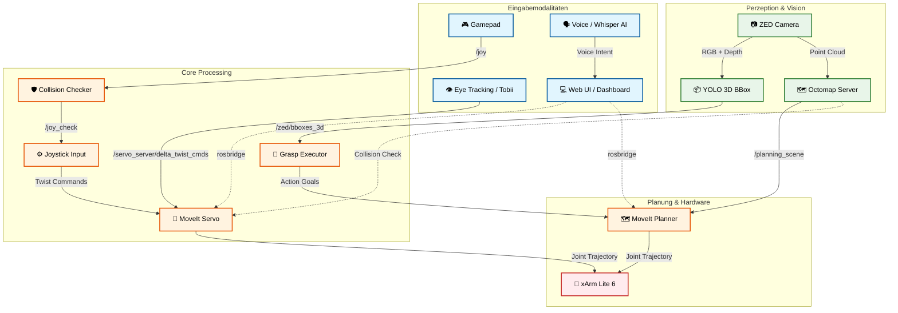
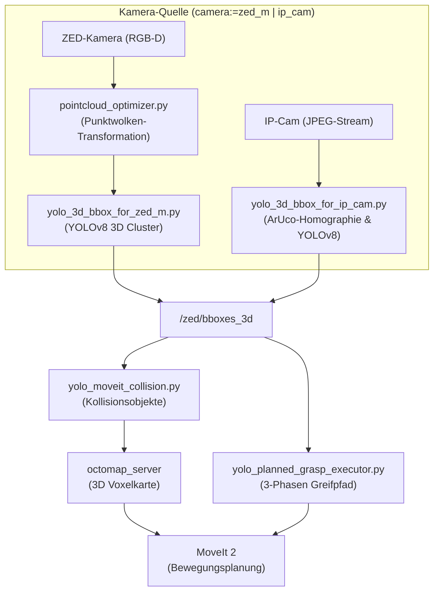
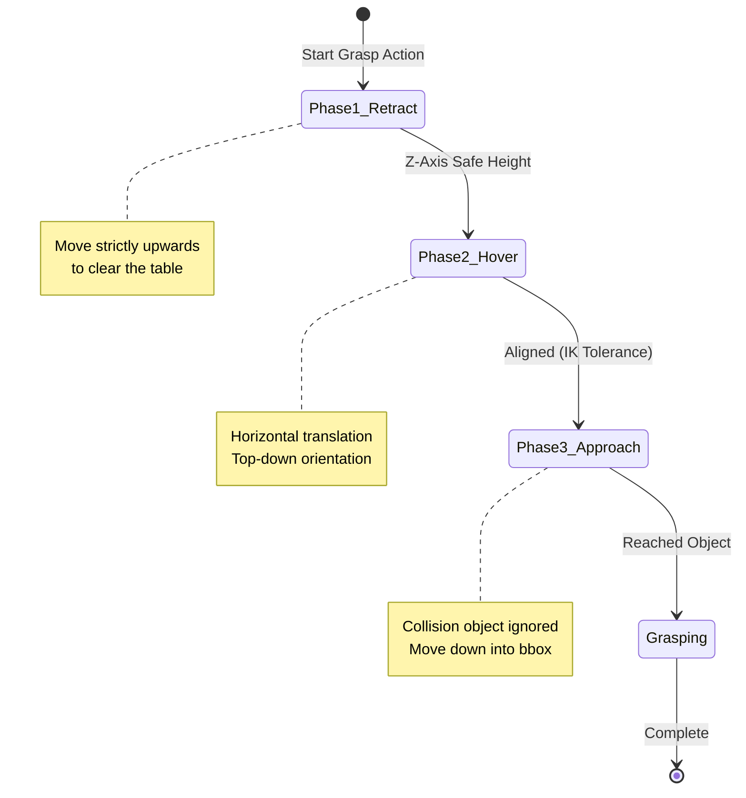
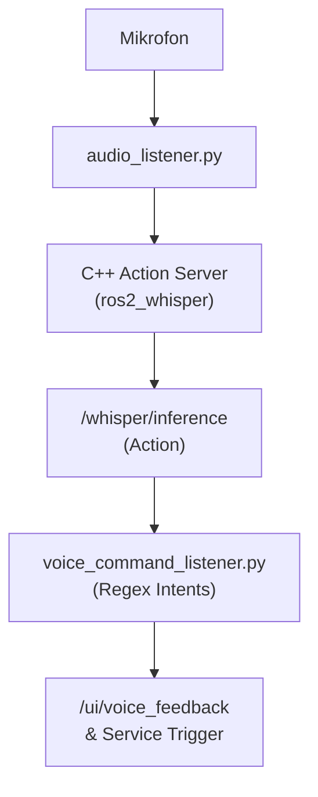
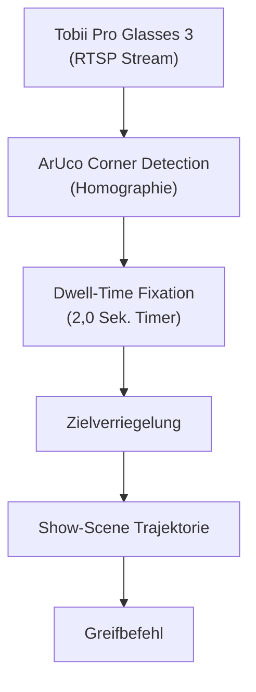
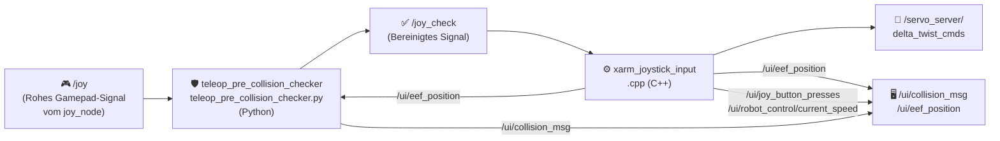
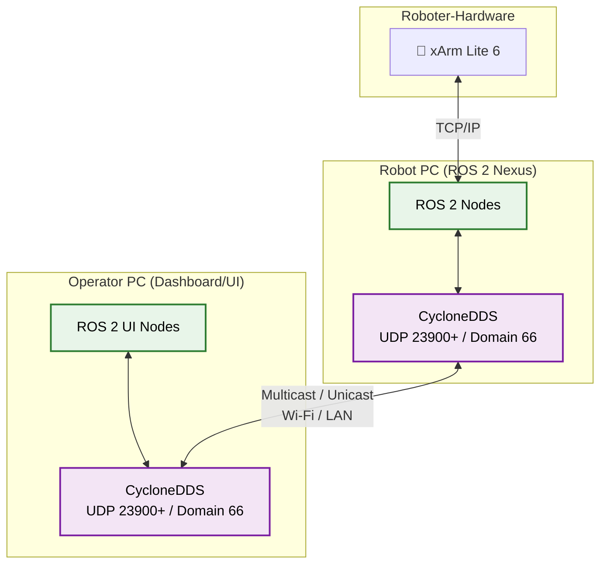
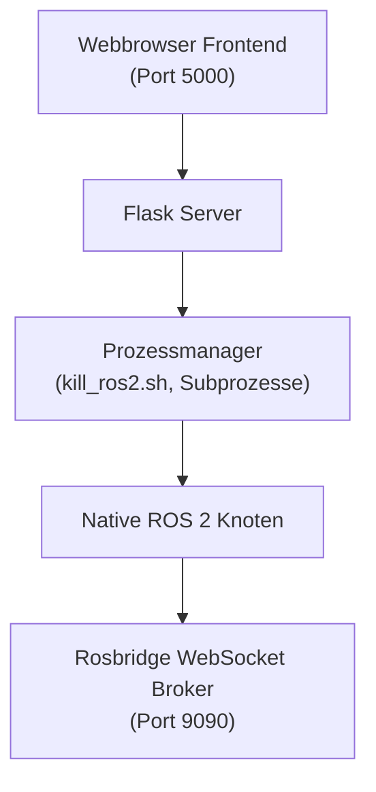

# xArm ROS 2 Extended Workspace (ROS2 Humble) **[MASTER VERSION]**

<p align="center">
  
  &nbsp;&nbsp;&nbsp;
  
  &nbsp;&nbsp;&nbsp;
  
  &nbsp;&nbsp;&nbsp;
  
</p>

<p align="center">
  <a href="README.md">🇬🇧 <b>Read in English / Auf Englisch lesen</b></a>
</p>

Dieses Repository ist eine sich kontinuierlich weiterentwickelnde Forschungs- und Evaluationsplattform für multimodale Teleoperation und Mensch-Computer-Interaktion (HCI). Ziel ist der Abbau technischer Barrieren in der Robotersteuerung durch intuitive Schnittstellen wie Eye-Tracking, Sprachsteuerung, manuelle Feinsteuerung (z. B. über Gamepads oder per Maus in der Web-UI) und assistierende Automatisierung. Ein zentraler Aspekt ist zudem die Bereitstellung moderner grafischer Benutzeroberflächen (GUIs), die komplexe Prozesse zugänglich machen. Basierend auf dem Shared-Control-Paradigma (Mensch und Maschine agieren kooperativ) wird untersucht, wie kognitive Belastungen reduziert und eine gleichberechtigte, inklusive Teilhabe am modernen Arbeitsplatz (Industrie 5.0) technologisch realisiert werden können. <br>
<p align="center">
 
</p>

> [!IMPORTANT]
> **Grundvoraussetzung:** Dieses Repository ist ein *Erweiterungs-Workspace*. Es baut vollständig auf dem offiziellen [xarm_ros2 Repository (Branch: humble)](https://github.com/xArm-Developer/xarm_ros2/tree/humble) von UFactory auf. Das offizielle Repository, dessen Struktur und all seine Systemabhängigkeiten bilden das zwingende Basis-Fundament für diese Software!

<br>

## Inhaltsverzeichnis
1. [📋 Projektübersicht](#1--projektübersicht)
   - [1.1 ⚡ 5-Minuten Quickstart (Reine Simulation)](#11--5-minuten-quickstart-reine-simulation)
2. [🔬 Architektur & Leitprinzipien](#2--architektur--leitprinzipien)
   - [2.1 Die Systemidee: Eine integrierte Entwicklungs-, Evaluierungs- und Validierungsplattform](#21-die-systemidee-eine-integrierte-entwicklungs--evaluierungs--und-validierungsplattform)
3. [⚙️ Core Features & ROS 2 Nodes](#3--core-features--ros-2-nodes)
   - [3.1 Betriebsmodi: FAKE vs. REAL (Hardware Interfaces)](#31-betriebsmodi-fake-vs-real-hardware-interfaces)
     - [3.1.1 Simulation (FAKE) vs. Real-Hardware (REAL) Matrix](#311--simulation-fake-vs-real-hardware-real-matrix)
   - [3.2 Funktion: Gamepad Teleoperation & Harter Kollisionsschutz](#32-funktion-gamepad-teleoperation--harter-kollisionsschutz)
   - [3.3 Funktion: Autonomes Greifen & 3D Objekterkennung (YOLO / ZED)](#33-funktion-autonomes-greifen--3d-objekterkennung-yolo--zed)
   - [3.4 Funktion: Multimodale Interaktion (Sprache & Blicksteuerung)](#34-funktion-multimodale-interaktion-sprache--blicksteuerung)
   - [3.5 Funktion: VR Quest 3 Teleoperation](#35-funktion-vr-quest-3-teleoperation)
   - [3.6 Funktion: GUI - Grafische Robotersteuerung & Visuelles Feedback](#36-funktion-gui---grafische-robotersteuerung--visuelles-feedback)
   - [3.7 Funktion: Digital Twin & Simulation (NVIDIA Isaac Sim)](#37-funktion-digital-twin--simulation-nvidia-isaac-sim)

4. [🕹️ Multimodale Technologien & Interaktionskonzepte](#4--multimodale-technologien--interaktionskonzepte)
   - [4.1 Roboter-Steuerungsarten (Inputs)](#41-roboter-steuerungsarten-inputs)
   - [4.2 Sensorik & Assistenz (Perception)](#42-sensorik--assistenz-perception)
   - [4.3 VLA & Video Action Models (Geplant)](#43-vla--video-action-models-geplant)
   - [4.4 User Interfaces (UI/GUI)](#44-user-interfaces-uigui)
5. [🎮 Gamepad-Steuerung — Technische Tiefenanalyse](#5--gamepad-steuerung--technische-tiefenanalyse)
   - [5.1 Pipeline-Architektur](#51-pipeline-architektur)
   - [5.2 `teleop_pre_collision_checker.py` — Kollisionswächter (Python Node)](#52-teleop_pre_collision_checkerpy--kollisionswächter-python-node)
   - [5.3 `xarm_joystick_input.cpp` — Motion Controller (C++ Node)](#53-xarm_joystick_inputcpp--motion-controller-c-node)
6. [📦 Abhängigkeiten & Voraussetzungen](#6--abhängigkeiten--voraussetzungen)
   - [6.1 Hardware-Stückliste (BOM) & Physischer Verkabelungsplan](#61--hardware-stückliste-bom--physischer-verkabelungsplan)
7. [🚀 Ausführung: Systemstart](#7--ausführung-systemstart)
   - [7.1 Schritt 1: Hardware vorbereiten](#71-schritt-1-hardware-vorbereiten)
   - [7.2 Schritt 2: System starten (Nexus Webapp)](#72-schritt-2-system-starten-nexus-webapp)
   - [7.3 Schritt 3: Module über die GUI aktivieren](#73-schritt-3-module-über-die-gui-aktivieren)
   - [7.4 Netzwerk- & Port-Architektur](#74-netzwerk---port-architektur)
     - [7.4.1 Nexus Web Backend Architektur](#741-nexus-web-backend-architektur)
     - [7.4.2 Dashboard & Control Web UI Architektur](#742-dashboard--control-web-ui-architektur)
   - [7.5 Remote Control (Server-/Client Kommunikation)](#75-remote-control-server-client-kommunikation)
   - [7.6 DDS Multicast Storm Prevention & Loopback Discovery (Kritisch)](#76-dds-multicast-storm-prevention--loopback-discovery-kritisch)
   - [7.7 Launcher-Konfiguration (`launcher_config.json`)](#77-launcher-konfiguration-launcher_configjson)
   - [7.8 CycloneDDS UDP Buffer Overflows (Point Cloud Lag)](#78-cyclonedds-udp-buffer-overflows-point-cloud-lag)
   - [7.9 Fehlerbehebung & Häufige Fragen (FAQ)](#79--fehlerbehebung--häufige-fragen-faq)
8. [📊 Monitoring: Dashboard & Workspace Analyzer](#8--monitoring-dashboard--workspace-analyzer)
   - [8.1 Workspace Analyzer Backend (`workspace_analyzer.py`)](#81-workspace-analyzer-backend-workspace_analyzerpy)
   - [8.2 Frontend (`dashboard_index.html`)](#82-frontend-dashboard_indexhtml)
   - [8.3 Startbefehle der UI-Komponenten](#83-startbefehle-der-ui-komponenten)
9. [🗂️ Repository-Struktur](#9--repository-struktur)
10. [🗄️ Archiv / Architektur-Entscheidungen & Veraltete Konzepte](#10--archiv--architektur-entscheidungen--veraltete-konzepte)


---

<br>

## 1. 📋 Projektübersicht

<br>

### 🎯 Konzept: Eine integrierte, multimodale Teleoperationsplattform
Das primäre Ziel dieses Projekts ist die Entwicklung und Implementierung einer modularen Steuerungs- und Interaktionsplattform für den Roboterarm UFactory xArm Lite 6. Das System bündelt heterogene, multimodale Eingabemethoden in einer zentralisierten Softwareumgebung und legt den Fokus konsequent auf eine maximierte Usability und intuitive Bedienbarkeit. Das System übernimmt die Berechnung der komplizierten Roboterbewegungen im Hintergrund. Dadurch entsteht eine einfache Schnittstelle, die die Wünsche des Nutzers direkt in Aktionen des Roboters übersetzt.

<br>

### 💡 Motivation: Assistenz, Inklusion und Teilhabe im Kontext der Industrie 5.0
Klassische Methoden der Teleoperation und Robotersteuerung sind in der Praxis hochgradig fehleranfällig und fordern vom Operator eine immense kognitive Feinsteuerung sowie technisches Fachwissen. Diese hohen Barrieren schließen viele Menschen von der direkten Nutzung aus. Im Sinne des Leitbildes der Industrie 5.0 – welche den Menschen, die Nachhaltigkeit und die Resilienz in den Mittelpunkt der industriellen Produktion stellt – setzt dieses Projekt genau hier an:

- **Abbau technischer Barrieren:** Reduktion der Einstiegshürden durch die Verlagerung von Low-Level-Gelenkkoordination hin zu intuitiven High-Level-Befehlen.
- **Förderung der Inklusion:** Schaffung technologischer Voraussetzungen, um auch Menschen mit unterschiedlichen physischen oder kognitiven Voraussetzungen eine produktive und gleichberechtigte Teilhabe am modernen Arbeitsplatz zu ermöglichen.
- **Mensch-Maschine-Synergie:** Etablierung des Roboters als assistierendes Werkzeug, das den Menschen entlastet, anstatt ihn zu ersetzen.

<br>

### ⚙️ Funktionsprinzip: Shared Control und das „Human-in-the-Loop“-Paradigma
Das technologische Fundament der Plattform basiert auf einem dynamischen *Shared-Control*-Ansatz, bei dem Mensch und Maschine kooperativ interagieren. Der Nutzer bleibt als Supervisor permanent in den Kontrollkreislauf eingebunden (*Human-in-the-Loop*), steuert das System jedoch über ein abgestuftes, komplementäres Interaktionsmuster:

- **Intuitive High-Level-Befehle:** Initiierung von globalen Aktionen oder Zielvorgaben über natürliche Modalitäten wie Blicksteuerung (Eye-Tracking) oder Sprachbefehle.
- **Präzise Low-Level-Korrekturen:** Nahtloser, latenzfreier Wechsel auf manuelle Eingabegeräte (z. B. Gamepad/MoveIt Servo) für feinfühlige Justierungen im Arbeitsraum.
- **Kontextsensitive Assistenz:** Autonome Pfadplanung und kollisionsfreie Trajektorienberechnung im Hintergrund, um den Operator während der Ausführung aktiv abzusichern.

<br>

### 🏆 Zielsetzung: Ein valider, kosteneffizienter Proof-of-Concept
Das Vorhaben versteht sich als voll funktionsfähiger, reproduzierbarer und ökonomisch erschwinglicher Proof-of-Concept (PoC) für akademische Forschungslandschaften sowie praxisorientierte Inklusionsprojekte. Die offene Architektur dient als standardisierte Evaluierungsplattform, auf deren Basis neuartige assistive Robotiksysteme unter realitätsnahen Bedingungen entwickelt, getestet und empirisch validiert werden können.

<br>

### 📊 Evaluationslogik & Guidelines: Von der Forschung in die industrielle Praxis
Ein wesentlicher Kern und Innovationscharakter des Projekts liegt in der wissenschaftlichen Aufarbeitung der Interaktionsqualität. Das System dient nicht nur als technischer Demonstrator, sondern als Werkzeug zur Generierung übertragbaren Wissens:

- **Entwicklung einer Evaluationslogik:** Systematische Erfassung und Messung von Usability, kognitiver Belastung und Systemperformance zur quantitativen Bewertung der Mensch-Roboter-Schnittstelle.
- **Ableitung von Handlungsempfehlungen:** Formulierung standardisierter Guidelines, die Unternehmen als strategischer Leitfaden bei der Einführung moderner Robotersysteme dienen.
- **Beantwortung der Transformationsfrage:** Konkrete Hilfestellungen für die Praxis auf die Kernfrage: *„Wie können Prozesse und Arbeitsplätze strukturiert werden, um den menschzentrierten Anforderungen der Industrie 5.0 messbar gerecht zu werden?“*
- **Dienstleistungspotenzial:** Die resultierenden Frameworks und Guidelines besitzen das Potenzial, als validierte, monetarisierbare Consulting- und Dienstleistung für die Industrie bereitgestellt zu werden, um den digitalen und demografischen Wandel in der Produktion zu begleiten.

<br>

### 1.1 ⚡ 5-Minuten Quickstart (Reine Simulation)

> [!TIP]
> **Kein physischer Roboter oder Hardware erforderlich!** Du kannst den gesamten Software-Stack (Digitaler Zwilling in der Simulation, RViz2, Robot Control UI und Dashboard Monitoring UI) sofort auf deinem lokalen PC bauen, starten und testen.

#### 1. Workspace bauen & sourcen
```bash
cd ~/dev_ws
colcon build --symlink-install
source install/setup.bash
```

#### 2. Zentrales Prozess-Cockpit starten (Nexus Webapp)
```bash
./ros2_nexus/ros2_nexus_web_start.sh
```
*Dies startet den lokalen Prozess-Manager-Daemon und öffnet die Nexus Webapp automatisch im Standardbrowser unter `http://localhost:5000`.*

#### 3. Simulation starten & Web-UIs erkunden
1. Klicke in der **Nexus Webapp** auf den grünen Button **`RUN DEV SETUP (FAKE)`**.
   * Öffnet das DEV-SETUP-Popup; **EXECUTE** startet das simulierte xArm Lite 6 `ros2_control` Hardware-Interface, MoveIt 2 Servo + MoveGroup, RViz2, die virtuelle Linearachse und die Robot Control UI inkl. WebSocket ROS Bridge (`ws://localhost:9090`) und Videoserver (8082). Vision, Sprachsteuerung, Eyetracking und VR sind weitere Karten im selben Popup und lassen sich abwählen.
2. Öffne die **Robot Control UI** (`http://localhost:8081`):
   * Teste kartesische XYZ-Jog-Steuerung, bewege die Joint-Slider oder fahre die Home-Initialpose an. *(Die Greifer-Buttons steuern den Greifer direkt — siehe 3.6.)*
3. Öffne das **Dashboard Monitoring UI** (`http://localhost:8080/dashboard_index.html`). Es ist **nicht** Teil des DEV SETUP: vorher **Dashboard Monitoring (Port 8080)** und **Workspace Analyzer** in der Nexus-Sektion `Workspace Analyzer Backend` starten.
   * Überwache Echtzeit-Topic-Frequenzen (Hz), visualisiere Node-Topologiegraphen und inspiziere Live-Parameter.

[⬆️ Zurück zum Inhaltsverzeichnis](#inhaltsverzeichnis)

---
<br>

## 2. 🔬 Architektur & Leitprinzipien

---
<br>

### 🗺️ Systemarchitektur & Datenfluss
Das folgende Diagramm veranschaulicht den modularen Aufbau und den asynchronen Datenfluss zwischen Sensorik, UI-Eingaben und den Steuerungskomponenten:




---


### 2.1 Die Systemidee: Eine integrierte Entwicklungs-, Evaluierungs- und Validierungsplattform
Das Kernziel des Projekts ist die Realisierung einer modularen, plattformbasierten Softwarearchitektur für die multimodale Teleoperation und KI-gestützte Assistenzrobotik. Das System fungiert als zentraler, softwareseitiger Integrationsknoten (Middleware-Ebene), der heterogene Teilsysteme in einer einheitlichen Laufzeitumgebung zusammenführt. Durch ein verteiltes Server-Client-Netzwerk (Multi-PC-Setup) und die softwareseitige Kopplung an einen echtzeitfähigen Digitalen Zwilling (NVIDIA Isaac Sim) dient die Plattform sowohl als flexible Entwicklungsumgebung als auch als standardisierte und replizierbare Testumgebung. Das Projekt ist explizit als geschlossener Kreislauf aus Entwicklung und empirischer Validierung konzipiert:

- **Sensorik & Perzeption:** Integration von Tiefenkameras (z. B. Objekterkennung via YOLO, Marker-Tracking) sowie taktilen oder physiologischen Sensoren zur Zustandserfassung.
- **Multimodale Steuerung:** Parallele Einbindung diverser Eingabekanäle wie Eye-Tracking-Systeme zur Blickzielerfassung, Sprachsteuerung (z. B. via OpenAI Whisper) sowie klassische Hardware-Controller (Gamepads, 3D-Mäuse).
- **Kognitive Robotik:** Einbindung moderner Vision-Language-Action-Modelle (VLA), um hochgradig abstrakte, sprachliche und visuelle Befehle direkt in robotische Handlungssequenzen zu übersetzen.
- **Integrierte Datenakquisition:** Zeitsynchrone Aufzeichnung technischer Leistungsparameter und menschlicher Interaktionsdaten über eine zentrale Logging-Infrastruktur während der Systemnutzung.

<br>

### Human-Centered Automation
Die Systemarchitektur stellt den menschlichen Operator ins Zentrum des Interaktionsdesigns. Das System wird so konzipiert, dass Nutzer den aktuellen Automatisierungszustand durchgängig kognitiv erfassen und nachfolgende Systemaktionen antizipieren können. Diese Transparenz bricht algorithmische Black-Box-Strukturen auf, was für den praktischen Einsatz wesentliche Vorteile bringt:

- **Kognitive Transparenz:** Durchgängige Nachvollziehbarkeit der Systemzustände, insbesondere bei der parallelen Verarbeitung von Blickbewegungen und sensorischen Rückmeldungen.
- **Fundierte Intervention:** Befähigung des Operators zu sicheren und gezielten Eingriffen in kritischen oder unvorhergesehenen Interaktionssituationen.
- **Kalibriertes Systemvertrauen:** Schaffung einer verlässlichen technologischen Basis für den systematischen Aufbau von *Trust in Automation*, welcher im Rahmen von Nutzerstudien evaluiert wird.

<br>

### 🤝 Shared Control & Kognitive Entlastung
Ein Kernmerkmal der Softwarearchitektur ist die Implementierung von *Shared-Control*-Paradigmen zur kooperativen Aufgabenbewältigung. Die Plattform ermöglicht einen nahtlosen, latenzarmen Wechsel der Kontrollhoheit zwischen manueller Führung, blickgesteuerten Interaktionen und KI-gestützten, teilautomatisierten Assistenzfunktionen. Die kontextabhängige Aufteilung der Kontrollanteile zielt auf folgende Kernaspekte:

- **Nahtlose Kontrollübergabe:** Latenzarmer Wechsel zwischen manueller Eingabe (z. B. via MoveIt Servo / Gamepad) und autonomen Systemaktionen (z. B. blickbasiertes Greifen).
- **Minimierung des Mental Workload:** Gezielte Reduktion der mentalen Arbeitsbelastung des Nutzers während komplexer oder langandauernder Manipulationsaufgaben.
- **Autonome Fehlerkompensation:** Selbstständiges Abfangen fehleranfälliger Low-Level-Korrekturen durch das System, wodurch kognitive Ressourcen für die übergeordnete Prozessüberwachung freigesetzt werden.
- **Empirische Validierung:** Laufende Überprüfung der tatsächlichen kognitiven Entlastung im Projektverlauf über standardisierte psychometrische Verfahren.

<br>

### 📈 HCI & Usability Fokus & Empirische Evaluation
Die Gestaltung der zentralen Steuerungsschnittstelle (GUI) folgt etablierten Prinzipien der Mensch-Computer-Interaktion (HCI). Die Interaktionsmuster verschieben sich von der komplexen Koordination einzelner Freiheitsgrade oder dem manuellen Aufrufen verteilter Terminal-Prozesse hin zu einer intentionsbasierten Aufgabenbewältigung. Ein integraler Bestandteil des Projekts ist die Durchführung systematischer Benutzerstudien zur Evaluierung dieser multimodalen Schnittstellen:

- **Intentionsbasierte Steuerung:** Übersetzung abstrakter Handlungsabsichten (per Sprache, Blickziel oder High-Level-Controller) in präzise kinematische Trajektorien.
- **Standardisierte Usability-Metriken:** Erhebung der subjektiven Gebrauchstauglichkeit über etablierte Fragebögen wie die *System Usability Scale* (SUS).
- **Objektive Leistungsparameter:** Messung von quantitativen Faktoren wie *Task Completion Time*, Fehlerraten und spezifischen Blickbewegungspfaden.
- **Beanspruchungsanalyse:** Empirische Absicherung der kognitiven Belastung der Probanden unter Verwendung des *NASA-TLX*-Index zur iterativen Systemoptimierung.

<br>

### 🔓 Reproduzierbar & Open Source
Zur Gewährleistung wissenschaftlicher Validität ist das Projekt als Open-Source-Architektur angelegt. Die Offenlegung der vollständigen Codebasis sichert die methodische Transparenz aller Algorithmen, Konfigurationen und Datenflüsse. Für die wissenschaftliche Gemeinschaft ergeben sich daraus zentrale Mehrwerte:

- **Methodische Transparenz:** Vollständige Einsehbarkeit aller zugrundeliegenden Algorithmen, URDF-Modelle und MoveIt-Konfigurationen.
- **Exakte Replikation:** Ermöglichung unkomplizierter Zweituntersuchungen durch unabhängige Forschungsgruppen unter identischen Bedingungen.
- **Statistische Verifizierbarkeit:** Nachvollziehbarkeit und Validierung komplexer, aufgezeichneter Sensordatenströme und Steuerungseingaben.
- **Standardisierte Benchmark:** Etablierung der Plattform als verlässliche Vergleichsbasis für komparative Studien im Bereich der Assistenz- und Inklusionsrobotik.

<br>

### Kosteneffiziente Hardware
Die Systemkonfiguration basiert primär auf ökonomisch erschwinglichen, kommerziell verfügbaren Komponenten (COTS), ohne die erforderliche Präzision und funktionale Zuverlässigkeit zu kompromittieren. Dieser Ansatz verfolgt klare strategische Ziele:

- **Demokratisierung des Zugangs:** Reduktion investiver und finanzieller Barrieren beim Einstieg in moderne, multimodal gesteuerte Robotiktechnologien.
- **Zielgruppen-Transfer:** Erleichterter Technologietransfer in inklusive Projekte, Bildungseinrichtungen und kleinere Forschungseinrichtungen (z. B. über den UFactory xArm Lite 6 und Consumer-Controller).
- **Validierung der Verlässlichkeit:** Gezielte wissenschaftliche Evaluierung, inwieweit kosteneffiziente Hardware im direkten Vergleich zu hochpreisigen Industriesystemen eine valide Forschungsplattform darstellt.

<br>

### Modular & Industrie-Standard
Die softwareseitige Infrastruktur ist modular gekapselt und vollständig in das Middleware-Framework ROS 2 Humble integriert. Die native Nutzung standardisierter Kommunikationsprimitive sichert die Interoperabilität mit industriellen Ökosystemen. Das konsequente Baukastenprinzip bietet entscheidende architektonische Vorteile:

- **Native ROS 2-Kommunikation:** Volle Kompatibilität mit etablierten Ökosystemen (wie MoveIt 2) und modernen Sensor-SDKs über Nodes, Topics, Services und Actions.
- **Isolierte Subsystem-Kapselung:** Unkomplizierter Austausch oder Erweiterung einzelner Module – wie z.B. VLA-Pipelines zur Intentionserkennung oder spezifischer Eye-Tracking-Treiber.
- **Zukunftssicherheit & Portierbarkeit:** Wartungsfreundliche Softwarestruktur, die eine einfache Migration auf zukünftige ROS 2 LTS-Distributionen ohne Modifikation der Gesamtplattform erlaubt.


[⬆️ Zurück zum Inhaltsverzeichnis](#inhaltsverzeichnis)

---

<br>

## 3. ⚙️ Core Features & ROS 2 Nodes

Um ein klares Verständnis für die Architektur zu schaffen, sind die Software-Module nach ihren funktionalen **Features (Use-Cases)** gegliedert. Jedes Modul ist dabei explizit als ROS 2 Node, Skript oder Plugin gekennzeichnet.


---
<br>


### 3.1 Betriebsmodi: FAKE vs. REAL (Hardware Interfaces)
Die Plattform unterscheidet strikt zwischen zwei Betriebsmodi für den Roboterarm. Diese Unterscheidung bezieht sich **ausschließlich auf das `ros2_control` Hardware Interface** und ist unabhängig von der Sensorik (wie Kamera oder YOLO, welche in beiden Modi live laufen können):

-blue?style=for-the-badge)<br>
Der Roboter läuft über das `mock_components/GenericSystem` (bzw. FakeSystem) Hardware Interface innerhalb von `ros2_control`. Es gibt keine physische Controller-Verbindung. Befehle an den `/lite6_traj_controller` oder `/servo_server` werden rein virtuell in RViz2 gerendert, indem die Joint States gespiegelt werden. Proprietäre UFactory API-Calls (wie Mode/State-Switches) laufen in diesem Modus absichtlich ins Leere oder werden softwareseitig ge-bypassed.

-red?style=for-the-badge)<br>
Das `ros2_control` Framework bindet das echte `xarm_api` Hardware Interface ein, welches via TCP/IP direkt mit dem physischen Controller des xArm Lite 6 kommuniziert. In diesem Modus greifen Hardware-Limits, physische Sicherheits-Stopps und die exklusive Umschaltung der proprietären xArm Hardware-Modi (z. B. Mode 0 für Pose-Steuerung vs. Mode 1 für Servo/Jogging) über die UFactory API.

> [!NOTE]
> **Virtuelle Linearachse (Nur Simulation):** Im FAKE-Modus kann der Roboter auf einer simulierten Linearachse bewegt werden, ohne die MoveIt-Planungsgruppe (`lite6`) zu beeinflussen.
> - **Aktivierung:** Mit `attach_to:=linear_axis_link` startet der FAKE-Launch (`lite6_moveit_servo_fake.launch.py`) den Node `fake_linear_axis` selbst. **RUN DEV SETUP (FAKE)** übergibt dieses Argument; bei manuellem Start muss es an den Launch-Befehl angehängt werden.
> - **Steuerung:** Der GUI-Schieberegler im Web UI (Port 8081) oder das Gamepad-D-Pad (Links/Rechts) steuert die horizontale Verschiebung durch Publizieren auf `/linear_axis_cmd`. Der Headless-Node `fake_linear_axis` (`ros2 run fake_linear_axis fake_linear_axis`) wandelt dies in dynamisches TF und visuelle Schienen-Marker um.
> - **MoveIt-Architektur:** Die Achse wird rein über dynamisches TF (`world` -> `linear_axis_link`) verschoben und nicht als URDF-Joint in die Kinematik aufgenommen. Dadurch weiß MoveIt (dank TF) automatisch, wo der Roboter steht, ohne dass ein 7-DoF IK-Solver benötigt wird.
> - **URDF Modifikation:** Um Fehler beim Parsen von dynamischen `attach_to`-Argumenten zu vermeiden, wurde `xarm_description/urdf/xarm_device_macro.xacro` angepasst. Die Bedingung für `create_attach_link` generiert nun einen Root-Link für *jeden* übergebenen String und nicht mehr exklusiv nur für `"world"`.

<br>

#### 3.1.1 📊 Simulation (FAKE) vs. Real-Hardware (REAL) Matrix
Die folgende Übersicht zeigt auf einen Blick, welche Projektmodule in reiner Software-Simulation auf einem Standard-PC evaluiert werden können und welche Funktionen physische Hardware-Geräte voraussetzen:

| Feature / Subsystem | Reine Simulation (FAKE) | Echte Hardware (REAL) | Benötigte Hardware / Peripherie |
|---|:---:|:---:|---|
| **Robot Control UI (Port 8081)** | ✅ Funktionsfähig (RViz-Spiegelung) | ✅ Funktionsfähig (Hardware-Bewegung) | Host-PC & Webbrowser |
| **Dashboard Monitoring UI (Port 8080)** | ✅ Funktionsfähig | ✅ Funktionsfähig | Host-PC & Webbrowser |
| **MoveIt 2 Kartesische Pfadplanung & IK** | ✅ Funktionsfähig | ✅ Funktionsfähig | Host-PC |
| **Virtuelle Linearachse (Schiene)** | ✅ Funktionsfähig | ➖ Nur Simulation | Host-PC |
| **Gamepad-Teleoperation (MoveIt Servo)** | ✅ Funktionsfähig | ✅ Funktionsfähig | Xbox One / Series Controller |
| **Prädiktiver harter Kollisionsschutz** | ✅ Funktionsfähig | ✅ Funktionsfähig | Host-PC |
| **Akustische Sprachinteraktion (Whisper AI)** | ✅ Funktionsfähig | ✅ Funktionsfähig | Standard USB- / Laptop-Mikrofon |
| **3D YOLO Objekterkennung & Clustering** | ❌ *(oder per Rosbag-Replay)* | ✅ Funktionsfähig | Stereolabs ZED Mini (USB 3.0) |
| **Dynamische MoveIt-Kollisionsobjekte** | ❌ *(oder per Rosbag-Replay)* | ✅ Funktionsfähig | Stereolabs ZED Mini (USB 3.0) |
| **Autonome 3D-Greifroutine** | ❌ *(Benötigt 3D-Kamera)* | ✅ Funktionsfähig | xArm Lite 6 & ZED Mini |
| **Tobii Eye-Tracking Interaktion** | ❌ *(Benötigt Brille)* | ✅ Funktionsfähig | Tobii Pro Glasses 3 (WLAN / LAN) |
| **Meta Quest 3 WebXR Teleoperation** | ❌ *(Benötigt VR-Headset)* | ✅ Funktionsfähig | Meta Quest 3 (WLAN, Port 8443) |

---
<br>


### 3.2 Funktion: Gamepad Teleoperation & Harter Kollisionsschutz
*Dieses Subsystem steuert das manuelle Jogging des Roboters per Xbox-Controller und verhindert aktiv, dass der Roboter durch Bedienfehler mit der Arbeitsfläche kollidiert.*


---

<br>

####  `xarm_joystick_input.cpp` &nbsp;&nbsp; <sub><i>[`/src/xarm_ros2/xarm_moveit_servo/src/xarm_joystick_input.cpp`](./src/xarm_ros2/xarm_moveit_servo/src/xarm_joystick_input.cpp)</i></sub>
> [!NOTE]
> 💻 **Run Command:**
> ```bash
> # Echte Hardware (REAL) MoveIt Servo (mit Vakuumgreifer & 3D-Szenenobjekten):
> ros2 launch xarm_moveit_servo lite6_moveit_servo_realmove.launch.py robot_ip:=192.168.1.175 add_vacuum_gripper:=true report_type:=dev static_objects:=true
>
> # Simulation (FAKE) (mit virtueller Linearachse & 3D-Szenenobjekten):
> ros2 launch xarm_moveit_servo lite6_moveit_servo_fake.launch.py add_vacuum_gripper:=true attach_to:=linear_axis_link static_objects:=true
> ```
> *`rviz:=false` startet MoveIt Servo ohne RViz-Fenster (Standard `true`; in der Nexus Webapp als Checkbox `rviz:=true` in der Servo-Action-Card).*
> *Weitere Argumente beider Launch-Files: `joystick_and_checker:=false` startet weder `joy_node` noch `teleop_pre_collision_checker` (genutzt von den Server-Sequenzen, dort hängt das Gamepad am Client-PC); `floor_collision:=false` lässt `moveit_floor_collision` weg. Beide Launches binden außerdem `standalone_move_group.launch.py` ein.*
> *(Nativ als Component im MoveIt Servo Bringup geladen)*
>
> **Zweck & Aufgabe:** Übersetzt die bereinigten Gamepad-Signale (Analog-Sticks & Trigger) in kartesische Geschwindigkeitsbefehle (`TwistStamped`) für MoveIt Servo. Wendet exponentielles Smoothing an und steuert alle Button-Mappings.
>
> **🎮 Controller-Belegung (Quick Reference):**
>> | Eingabe | Aktion | Details |
>> | :--- | :--- | :--- |
>> | **Linker Stick** (↕️/↔️) | **Verfahren (X / Y)** | *Bewegt den Roboter vor/zurück (X) und links/rechts (Y)* |
>> | **LT / RT** (Trigger) | **Heben/Senken (Z)** | *Bewegt den Roboterarm auf/ab* |
>> | **LB / RB** (Bumper) | **Rotieren (Yaw)** | *Dreht den Endeffektor um die eigene Achse* |
>> | **D-Pad** (↕️) | **Speed Control** | *Schaltet 5 Geschwindigkeitsstufen durch* |
>> | **D-Pad** (↔️) | **Linearachse** | *Bewegt den Roboter auf der Schiene (Base Y-Shift)* |
>> | **START / BACK** | **Referenzrahmen** | *Wechselt zwischen Basis- (`link_base`) und Werkzeug-Koordinaten (`link_tcp`)* |
>> | **A-Taste** (🟢) | **Greifer auf / zu bzw. Vakuum an / aus** | *Hängt vom Launch-Argument ab: `add_gripper:=true` schaltet den Lite 6 Greifer auf/zu, `add_vacuum_gripper:=true` das Vakuum an/aus. Ohne beides (`gripper_type: none`) keine Funktion.* |
>> | **B-Taste** (🔴) | **Greifer aus** | *Lite 6 Greifer: stoppt sofort und löst die Haltekraft. Vakuum: schaltet ab.* |
>> | **X-Taste** (🔵) | **Mikrofon (Voice)** | *Startet/Stoppt die Aufnahme für Whisper AI* |
>> | **Y-Taste** (🟡) | **Initialpose** | *Fährt den Roboter in die sichere Startposition* |
>
>
> 
>
>> | Topic / Interface | Msg Type | Beschreibung |
>> |---|---|---|
>> | **`/joy_check`** | `sensor_msgs/Joy` | *Liest die vom Wächter-Node bereinigten Controller-Inputs.* |
>> | **`/ui/robot_control/set_speed_index`** | `std_msgs/Int32` | *Empfängt Anpassungen der Geschwindigkeitsstufe.* |
>> | **`/ui/gripper_cmd`** | `std_msgs/String` | *Greiferbefehl der Robot Control UI (`open` / `close` / `off` / `toggle`) - läuft durch dieselbe Logik wie die A/B-Tasten.* |
>
>
> 
>
>> | Topic / Interface | Msg Type | Beschreibung |
>> |---|---|---|
>> | **`/servo_server/delta_twist_cmds`** | `geometry_msgs/TwistStamped` | *Sendet berechnete kartesische Geschwindigkeiten an den Servo Server.* |
>> | **`/ui/eef_position`** | `std_msgs/Float32MultiArray` | *Publiziert mit 10 Hz die Live-Pose (X, Y, Z) für das Web-UI.* |
>> | **`/ui/robot_control/current_speed`** | `std_msgs/Float32` | *Publiziert den aktuellen Geschwindigkeitsfaktor für das UI.* |
>> | **`/ui/joy_button_presses`** | `std_msgs/String` | *Publiziert Controller-Tastendrücke für das UI.* |
>> | **`/ui/gripper_state`** | `std_msgs/String` (latched) | *Greiferzustand (`open` / `closed` / `off`) - hält Gamepad-Toggle und UI-Buttons synchron.* |
>> | **`/ui/gripper_type`** | `std_msgs/String` (latched) | *Konfigurierter Greifer (`vacuum` / `gripper` / `none`) aus dem Launch-Argument.* |
>> | **`/ui/robot_control/current_frame`** | `std_msgs/String` | *Publiziert den aktuellen Referenzrahmen (z. B. World, TCP).* |
>> | **`/linear_axis_cmd`** | `std_msgs/Float64` | *Publiziert Befehle zur Steuerung der Linearachse.* |
>
>
> 
>
>> | Topic / Interface | Msg Type | Beschreibung |
>> |---|---|---|
>> | *-* | *-* | *Hört auf die aktuelle TCP-Position (`link_base` -> `link_tcp`).* |
>
>
> 
>
>> | Topic / Interface | Msg Type | Beschreibung |
>> |---|---|---|
>> | **`/servo_server/start_servo`** | Client | *Startet die MoveIt Servo-Engine.* |
>> | **`/servo_server/stop_servo`** | Client | *Stoppt die MoveIt Servo-Engine sicher.* |
>> | **`/ufactory/set_vacuum_gripper`** | Client (`xarm_msgs/srv/VacuumGripperCtrl`) | *Vakuum an/aus (A-Taste, B-Taste = aus) bei `add_vacuum_gripper:=true`.* |
>> | **`/ufactory/open_lite6_gripper`** | Client (`xarm_msgs/srv/Call`) | *Öffnet den Lite 6 Greifer (A-Taste, bei `add_gripper:=true`).* |
>> | **`/ufactory/close_lite6_gripper`** | Client (`xarm_msgs/srv/Call`) | *Schließt den Lite 6 Greifer (A-Taste, bei `add_gripper:=true`).* |
>> | **`/ufactory/stop_lite6_gripper`** | Client (`xarm_msgs/srv/Call`) | *Stoppt den Lite 6 Greifer sofort und löst die Haltekraft (B-Taste, bei `add_gripper:=true`).* |
>> | **`/ufactory/get_position`** | Client (`xarm_msgs/srv/GetFloat32List`) | *Fragt die aktuelle kartesische Controller-Position beim xArm-Treiber ab.* |
>> | **`/ui/execute_initial_pose`** | Client (`std_srvs/srv/Trigger`) | *Fährt den Roboter in die definierte Home-/Initialpose (Y-Taste).* |
>
>

---

<br>

####  `teleop_pre_collision_checker.py` (`teleop_pre_collision_checker`) &nbsp;&nbsp; <sub><i>[`/src/teleop_pre_collision_checker/teleop_pre_collision_checker/teleop_pre_collision_checker.py`](./src/teleop_pre_collision_checker/teleop_pre_collision_checker/teleop_pre_collision_checker.py)</i></sub>
> [!NOTE]
> 💻 **Run Command:**
> ```bash
> ros2 run teleop_pre_collision_checker teleop_pre_collision_checker
> ```
>
> **Zweck & Aufgabe:** Sitzt als Wächter *vor* der Bewegungsübersetzung. Berechnet prädiktiv (0,1 Sek. in die Zukunft) die Z-Koordinate. Würde der Roboter den Tisch berühren, wird der Abwärtsbefehl des Controllers hart überschrieben und blockiert. Löst das Rumble-Feedback (Vibration) des Gamepads aus.
>
>
> 
>
>> | Topic / Interface | Msg Type | Beschreibung |
>> |---|---|---|
>> | **`/joy`** | `sensor_msgs/Joy` | *Liest den rohen, unbearbeiteten Gamepad-Input.* |
>> | **`/servo_server/status`** | `std_msgs/Int8` | *Überwacht Status-Codes des Servo-Servers.* |
>> | **`/ui/eef_position`** | `std_msgs/Float32MultiArray` | *Bezieht die aktuelle Z-Höhe für den prädiktiven Kollisions-Check.* |
>> | **`/ui/robot_control/current_speed`** | `std_msgs/Float32` | *Liest den aktuellen Geschwindigkeitsfaktor zur dynamischen Dämpfungsberechnung.* |
>> | **`/ui/moveit_collision_ground_enabled`** | `std_msgs/Bool` (latched) | *Folgt dem Boden-Kollisionsschalter der Robot Control UI: Ist er AUS, wird die Abwärtsbewegung nicht mehr gesperrt. Ohne Nachricht (Node läuft nicht) bleibt die Sperre aktiv.* |
>
>
> 
>
>> | Topic / Interface | Msg Type | Beschreibung |
>> |---|---|---|
>> | **`/joy_check`** | `sensor_msgs/Joy` | *Leitet den auf Kollisionen geprüften Controller-Befehl weiter.* |
>> | **`/ui/collision_msg`** | `std_msgs/String` | *Meldet harte Stopps an das UI-Log.* |
>
> *Das haptische Rumble-Feedback des Xbox-Controllers wird nicht über ROS verschickt, sondern direkt über `pygame` am Joystick-Gerät ausgelöst (`joystick.rumble(...)`).*
>
>
> 
>
>> | Parameter | Standardwert | Beschreibung |
>> |---|---|---|
>> | `LOOKAHEAD_TIME` | `0.1` | *Prädiktionshorizont (Sekunden) für die Geschwindigkeits-Vorausschau.* |
>> | `Z_LIMIT` | `91.0` | *Die harte Tischbarriere auf der Z-Achse (World-Frame) in Millimetern.* |
>> | `CAUTION_ZONE_START` | `110.0` | *Z-Höhe (mm), ab der die Geschwindigkeit zur Sicherheit begrenzt wird.* |
>> | `CAUTION_ZONE_SPEED` | `0.25` | *Maximal erlaubter Geschwindigkeitsfaktor innerhalb der Caution Zone.* |
>> | `MAX_LINEAR_VELOCITY_MM_S` | `75.0` | *Angenommene Lineargeschwindigkeit (mm/s) als Basis der Vorausschau.* |
>> | `ACCELERATION_FACTOR` | `0.9` | *Dämpfungsfaktor für die vorausberechnete Geschwindigkeit.* |
>> | `DOWN_TRIGGER_AXIS` | `5` | *Joy-Achsen-Index des rechten Triggers (RT, abwärts).* |
>> | `EEF_TIMEOUT` | `1.0` | *Sekunden ohne neue `/ui/eef_position`, nach denen die Position als unbekannt gilt und abwärts gesperrt wird.* |
>
>

---

<br>

####  `laser_pointer_node.py` (`tcp_laser_pointer`) &nbsp;&nbsp; <sub><i>[`/src/tcp_laser_pointer/tcp_laser_pointer/laser_pointer_node.py`](./src/tcp_laser_pointer/tcp_laser_pointer/laser_pointer_node.py)</i></sub>
> [!NOTE]
> 💻 **Run Command:**
> ```bash
> ros2 run tcp_laser_pointer laser_pointer_node
> ```
>
> **Zweck & Aufgabe:** Überwacht kontinuierlich via TF2 mit 10 Hz die reale kartesische Z-Höhe des Tool Center Points (`link_tcp`) relativ zur Roboterbasis (`link_base`). Sobald der TCP eine Höhe von $50\text{ mm}$ ($0.05\text{ m}$) oder weniger erreicht, schaltet der Node den am Greifer montierten Laserpointer über den digitalen Tool-Ausgang (TGPIO Digital Out 0) automatisch EIN. Übersteigt die Höhe die Schwelle, schaltet er den Laserpointer sofort wieder AUS.
>
>
> 
>
>> | Frame / Transformation | Beschreibung |
>> |---|---|
>> | **`link_base` ➔ `link_tcp`** | *Überwacht die Live-TCP-Position bei 10 Hz.* |
>
>
> 
>
>> | Topic / Interface | Msg Type | Beschreibung |
>> |---|---|---|
>> | **`/xarm/set_tgpio_digital`** | `xarm_msgs/srv/SetDigitalIO` (Client) | *Schaltet Tool Digital Output 0 (TGPIO) am Greifer EIN (1) bzw. AUS (0).* |
>
<br>

---

<br>

####  `xarm_moveit_servo` &nbsp;&nbsp; <sub><i>[`/src/xarm_ros2/xarm_moveit_servo`](./src/xarm_ros2/xarm_moveit_servo)</i></sub>
> [!NOTE]
> **Zweck & Aufgabe:** Die Echtzeit-Bewegungs-Engine von MoveIt. Prüft jeden Befehl gegen die Planungsszene (YOLO-Kollisionsobjekte, Boden) und bremst bzw. stoppt den Arm, bevor er mit Objekten kollidiert.
>
>
> 
>
>> | Topic / Interface | Msg Type | Beschreibung |
>> |---|---|---|
>> | **`/servo_server/delta_twist_cmds`** | `geometry_msgs/TwistStamped` | *Liest die kartesischen Geschwindigkeitsbefehle.* |
>> | **`/planning_scene`** | `moveit_msgs/PlanningScene` | *Liest die aktuelle 3D-Kollisionsszene zur Hindernisvermeidung ein.* |
>
>
> 
>
>> | Topic / Interface | Msg Type | Beschreibung |
>> |---|---|---|
>> | **`/lite6_traj_controller/joint_trajectory`** | `trajectory_msgs/JointTrajectory` | *Sendet validierte Gelenktrajektorien an den Roboter.* |
>
>
>  **(`xarm_moveit_servo_config.yaml`)**
>
>> | Parameter | Standardwert | Beschreibung |
>> |---|---|---|
>> | `check_collisions` / `collision_check_rate` | `true` / `10.0` | *Kollisionsprüfung des ganzen Roboterkörpers mit 10 Hz.* |
>> | `self_collision_proximity_threshold` / `scene_collision_proximity_threshold` | `0.01` | *Unterhalb dieser Abstände (1 cm) bremst Servo exponentiell in alle Richtungen ab.* |
>> | `collision_check_type` | `stop_distance` | *Einstellung des Stop-Distance-Modus (Abbremsen ab ca. 5 cm, Halt bei 2 cm über `min_allowable_collision_distance: 0.02`). Laut Kommentar in der Config wertet MoveIt Servo in Humble nur den Threshold-Modus aus, praktisch entscheiden also die Proximity-Schwellen oben.* |
>> | `collision_distance_safety_factor` | `0.5` | *Sicherheitsfaktor des Stop-Distance-Modus.* |
>
>


---


### 3.3 Funktion: Autonomes Greifen & 3D Objekterkennung (YOLO / ZED)
*Dieses Subsystem ist dafür verantwortlich, Objekte im 3D-Raum zu lokalisieren, virtuelle Hindernisse zu generieren und den Roboter gezielt an das Objekt heranzuführen.*




---

<br>

####  `robot_vision_cameras_bringup.launch.py` &nbsp;&nbsp; <sub><i>[`/src/robot_vision_cameras_bringup/launch/robot_vision_cameras_bringup.launch.py`](./src/robot_vision_cameras_bringup/launch/robot_vision_cameras_bringup.launch.py)</i></sub>
> [!NOTE]
> 💻 **Run Command:**
> ```bash
> # Standard: ZED Mini 3D Tiefenkamera-Pipeline
> ros2 launch robot_vision_cameras_bringup robot_vision_cameras_bringup.launch.py camera:=zed_m
>
> # Alternative: IP-Kamera Homographie-Pipeline
> ros2 launch robot_vision_cameras_bringup robot_vision_cameras_bringup.launch.py camera:=ip_cam
> ```
>
> **Zweck & Aufgabe:** Der zentrale Orchestrator für die gesamte 3D-Vision-, Objekterkennungs- und autonome Greif-Pipeline. Abhängig vom Parameter `camera` startet das Launch-Skript entweder dynamisch den ZED Mini Hardware-Treiber (`zed_wrapper`) zusammen mit `pointcloud_optimizer.py` und `yolo_3d_bbox_for_zed_m.py` oder die netzwerkbasierte `yolo_3d_bbox_for_ip_cam.py` zusammen mit `ip_cam_aruco_6pose_tf_coord.py` (ArUco 6-Pose TF-Koordinaten). Parallel dazu werden stets der MoveIt-Kollisionsgenerator (`yolo_moveit_collision.py`), der Trajektorien-Grasp-Server (`yolo_planned_grasp_executor.py`), die UI-Bridge (`grasp_action_bridge.py`), der RViz-Distanz-Visualisierer (`rviz_object_distance_visualizer.py`) sowie das MoveIt Servo-Warnungs-Status-Overlay (`rviz_servo_status.py`) hochgefahren.
>
>
> 
>
>> | Launch-Argument | Standardwert | Beschreibung |
>> |---|---|---|
>> | `camera` | `zed_m` | *Kamera-Pipeline-Auswahl: `zed_m` (ZED Mini Tiefenkamera) oder `ip_cam` (IP-Webcam Homographie).* |
>> | `camera_model` | `zedm` | *ZED-Kameramodell (Stereolabs ZED Mini, aktiv bei `camera:=zed_m`).* |
>> | `tf_x` | `0.473` | *Kalibrierte Kamera-X-Position relativ zu `link_base` [m] (Stativ-Setup).* |
>> | `tf_y` | `0.0` | *Kalibrierte Kamera-Y-Position relativ zu `link_base` [m] (Stativ-Setup).* |
>> | `tf_z` | `0.368` | *Kalibrierte Kamera-Z-Höhe relativ zu `link_base` [m] (Stativ-Setup).* |
>> | `tf_roll` | `0.0` | *Kamera-Roll-Winkel [rad] (0,0°, Stativ-Kalibrierung).* |
>> | `tf_pitch` | `1.00356` | *Kamera-Pitch-Winkel [rad] (+57,5°, nach unten in den Arbeitsbereich geneigt).* |
>> | `tf_yaw` | `3.14159` | *Kamera-Yaw-Winkel [rad] (180,0°, blickt zum Roboter).* |
>> | `yolo_model` | `yolov8l.pt` | *YOLO-Neuronales-Netzwerk-Gewichtsdatei (Standard: hochpräzises YOLOv8 Large).* |
>> | `confidence_threshold` | `0.35` | *YOLO-Konfidenzschwelle (Standard aus `perception_params.yaml`).* |
>> | `ema_alpha` | `0.4` | *EMA-Glättung der 3D-Boxen (Standard aus `perception_params.yaml`).* |
>> | `safe_z_hover_height` | `0.15` | *Hover-Höhe über dem Objekt [m] (Standard aus `grasping_params.yaml`).* |
>> | `grasp_z_offset` | `0.02` | *Z-Offset auf die Objekt-Oberkante beim Greifen [m] (Standard aus `grasping_params.yaml`).* |
>> | `velocity_scaling` / `acceleration_scaling` | `0.2` / `0.1` | *MoveIt-Skalierung der Greifbewegung (Standard aus `grasping_params.yaml`).* |
>
> *Die YAML-Dateien bleiben die Quelle der Standardwerte; die Launch-Argumente überschreiben sie nur beim Start (z. B. aus der Nexus Webapp).*
>

---

<br>

####  `zed_wrapper` &nbsp;&nbsp; <sub><i>[`/src/zed-ros2-wrapper`](./src/zed-ros2-wrapper)</i></sub>
> [!NOTE]
> 💻 **Run Command:**
> ```bash
> ros2 launch zed_wrapper zed_camera.launch.py camera_model:=zedm
> ```
>
> **Zweck & Aufgabe:** Der native Hardware-Treiber der Stereolabs ZED Mini Kamera (wird von `robot_vision_cameras_bringup.launch.py` automatisch eingebunden, wenn `camera:=zed_m`). 
>
>
> 
>
>> | Topic / Interface | Msg Type | Beschreibung |
>> |---|---|---|
>> | **`/zed/zed_node/rgb/image_rect_color`** | `sensor_msgs/Image` | *Publiziert das 2D-RGB-Kamerabild.* |
>> | **`/zed/zed_node/depth/depth_registered`** | `sensor_msgs/Image` | *Publiziert die registrierte Tiefenkarte (Depth-Map).* |
>> | **`/zed/zed_node/point_cloud/cloud_registered`** | `sensor_msgs/PointCloud2` | *Publiziert die dichte 3D-Punktwolke.* |
>
>
>  **(`config/zed_override.yaml` Parameter-Overrides)**
>
>> | Parameter | Wert | Beschreibung |
>> |---|---|---|
>> | `depth_mode` | `NEURAL` | *KI-gestützte neuronale Tiefenschätzung via TensorRT für maximale Präzision.* |
>> | `grab_resolution` | `HD720` | *Aufnahmeauflösung 1280 × 720.* |
>> | `pub_resolution` | `NATIVE` | *Veröffentlicht in Aufnahmeauflösung ohne Downsampling (HD720: ~921.600 Punkte/Frame).* |
>> | `depth_confidence` | `100` | *100% Konfidenzerhalt; verwirft keine berechneten Tiefenpixel.* |
>> | `depth_texture_conf` | `100` | *Erhält texturlose ebene Flächen (Tischoberflächen, Hallenboden).* |
>> | `remove_saturated_areas` | `false` | *Verhindert Löcher in der Punktwolke durch glänzende Boden-/Tischreflexionen.* |
>> | `min_depth` / `max_depth` | `0.1` / `10.0` | *Großer 10-Meter-Erfassungsbereich für vollständige Tisch- und Bodenerfassung.* |
>
>

---

<br>

####  `yolo_3d_bbox_for_zed_m.py` &nbsp;&nbsp; <sub><i>[`/src/robot_vision_cameras_bringup/scripts/yolo_3d_bbox_for_zed_m.py`](./src/robot_vision_cameras_bringup/scripts/yolo_3d_bbox_for_zed_m.py)</i></sub>
> [!NOTE]
> 💻 **Run Command:**
> ```bash
> ros2 run robot_vision_cameras_bringup yolo_3d_bbox_for_zed_m.py
> ```
>
> **Zweck & Aufgabe:** Verarbeitet parallel den RGB- und Depth-Stream mit GPU-Beschleunigung und dem **YOLOv8 Large (`yolov8l.pt`)** Modell. Isoliert Objekte, filtert Tiefenrauschen und berechnet millimetergenaue, dynamisch an das reale Objekt angepasste 3D-Bounding-Boxen und Greifpunkte.
>
> **Zentrale Kernfunktionen:**
> - **Dynamische Objekthöhenberechnung:** Statt starrer, fixer Box-Höhen berechnet die Node anhand der segmentierten 3D-Punkte der Punktwolke die reale Objekthöhe ($z_{\text{top}} - z_{\text{bottom}}$) direkt aus der realen Punktwolke jedes erkannten Objekts.
> - **Dynamischer roter Greifpunkt (`top_z`):** Platziert einen kleinen roten Kugel-Marker zentriert exakt auf der Oberkante des Objekts ($x_{\text{center}}, y_{\text{center}}, z_{\text{top}}$), der sich automatisch an die echte Höhe jedes Objekts anpasst (essenziell für kollisionsfreies Vakuum-Greifen von oben).
> - **Robuste Oberflächen-Projektion & Zentrierung:** Filtert Tisch- und Bodenrauschen heraus, um die Bounding-Boxen exakt auf das tatsächliche physikalische Volumen der Objekte zu zentrieren, unabhängig vom Blickwinkel der Kamera.
> - **EMA-Tracking & Mehrfachobjekt-Nummerierung:** Nutzt ein Dictionary-basiertes EMA-Tracking-System mit persistenten globalen IDs und einem 10cm-Threshold, um ID-Swapping und Boxen-Jittering sicher zu verhindern. Mehrere Objekte derselben Klasse werden dauerhaft durchnummeriert (z.B. `cup_1`, `cup_2`).
>
>
> 
>
>> | Topic / Interface | Msg Type | Beschreibung |
>> |---|---|---|
>> | **`/zed/zed_node/rgb/image_rect_color`** | `sensor_msgs/Image` | *Bezieht das RGB-Bild für die YOLO-Erkennung.* |
>> | **`/zed/zed_node/depth/depth_registered`** | `sensor_msgs/Image` | *Nutzt die Tiefenwerte für die 3D-Projektion.* |
>> | **`/zed/zed_node/rgb/camera_info`** | `sensor_msgs/CameraInfo` | *Liest Kamera-Intrinsics zur exakten Koordinatenberechnung.* |
>
>
> 
>
>> | Topic / Interface | Msg Type | Beschreibung |
>> |---|---|---|
>> | **`/zed/bboxes_3d`** | `visualization_msgs/MarkerArray` | *Sendet die fertigen 3D-Boxen, Text-Labels und dynamischen Greifpunkt-Marker (`top_z`) zur Visualisierung an RViz und nachgelagerte Nodes.* |
>
>
> 
>
>> | Parameter | Standardwert | Beschreibung |
>> |---|---|---|
>> | `model_path` | `yolov8l.pt` | *Gewichtsdatei des neuronalen Netzes. Wird über das Launch-Argument `yolo_model` oder den Parameter-Chip der Nexus Webapp gesetzt.* |
>> | `confidence_threshold` | `0.35` | *Mindest-Konfidenz einer YOLOv8-Erkennung; alles darunter wird verworfen.* |
>> | `ema_alpha` | `0.4` | *Glättungsfaktor (Exponential Moving Average) gegen Boxen-Jittering zwischen Frames. Kleiner heißt ruhiger, folgt aber träger.* |
>> | `class_dimension_overrides` | `[]` | *Optional feste metrische Dimensionen (x,y,z) für bekannte Kalibrierziele. Standardmäßig leer, dann wird jedes Objekt aus der 3D-Punktwolke vermessen.* |
>
> *Die Perzentil-Grenzen gegen Tiefenrauschen ("Flying Pixels" an Objektkanten) stecken fest im Node und sind keine Parameter. Die Standardwerte liegen in [`config/perception_params.yaml`](./src/robot_vision_cameras_bringup/config/perception_params.yaml).*
>
>


---

<br>

####  `yolo_3d_bbox_for_ip_cam.py` &nbsp;&nbsp; <sub><i>[`/src/robot_vision_cameras_bringup/scripts/yolo_3d_bbox_for_ip_cam.py`](./src/robot_vision_cameras_bringup/scripts/yolo_3d_bbox_for_ip_cam.py)</i></sub>
> [!NOTE]
> 💻 **Run Command:**
> ```bash
> ros2 run robot_vision_cameras_bringup yolo_3d_bbox_for_ip_cam.py
> ```
>
> **Zweck & Aufgabe:** Eine leichtgewichtige Alternative zu `yolo_3d_bbox_for_zed_m.py` für Setups ohne ZED-Tiefenkamera. Zieht sich einen HTTP-JPEG-Stream (IP-Kamera `.123`), erkennt ArUco-Marker auf dem Tisch, um dynamisch eine **Homografie-Matrix** zu berechnen, und führt **YOLOv8** zur Objekterkennung aus. Projiziert die 2D-YOLO-Bounding-Boxen mithilfe der Homografie-Matrix in den 3D-Roboter-Basisrahmen (`link_base`). Generiert und veröffentlicht exakt dasselbe 3D `MarkerArray`-Format auf `/zed/bboxes_3d`, wodurch es zu 100% Plug-and-Play mit dem bestehenden UI und Grasp-Executor ist, ohne echte Tiefen-Hardware zu benötigen.
>
> **Zentrale Kernfunktionen:**
> - **ArUco-Tischebenen-Homografie:** Berechnet kontinuierlich die perspektivische Entzerrung zwischen 2D-Pixelkoordinaten und der realen Tisch-Koordinatenebene ($Z \approx 0$).
> - **Dynamische 3D-Bounding-Boxen & roter Greifpunkt (`top_z`):** Erzeugt vollständige 3D-Begrenzungswürfel und platziert den roten Greifkugel-Marker (`yolo_object_grasp_center_point`) zentriert oben auf jedem erkannten Objekt.
> - **Nahtlose Pipeline-Integration:** Leitet die Daten direkt an `yolo_moveit_collision.py` (zur Erzeugung von MoveIt-Kollisionsboxen) und `yolo_planned_grasp_executor.py` (zur Ausführung autonomer Pick-and-Place-Trajektorien) weiter.
>
>
> 
>
>> | Topic / Interface | Msg Type | Beschreibung |
>> |---|---|---|
>> | *-* | *-* | *Ruft den HTTP JPEG Stream direkt ab (`http://192.168.0.123/...`).* |
>
>
> 
>
>> | Topic / Interface | Msg Type | Beschreibung |
>> |---|---|---|
>> | **`/zed/bboxes_3d`** | `visualization_msgs/MarkerArray` | *Publiziert 3D-Bounding-Boxen, Text-Labels und Greifpunkt-Marker identisch zum ZED-Kamera-Ausgabeformat.* |
>
>

---

<br>

####  `pointcloud_optimizer.py` &nbsp;&nbsp; <sub><i>[`/src/robot_vision_cameras_bringup/scripts/pointcloud_optimizer.py`](./src/robot_vision_cameras_bringup/scripts/pointcloud_optimizer.py)</i></sub>
> [!NOTE]
> 💻 **Run Command:**
> ```bash
> ros2 run robot_vision_cameras_bringup pointcloud_optimizer.py
> ```
>
> **Zweck & Aufgabe:** Läuft im Hintergrund des 3D Vision Bringups und bereitet die ZED-Punktwolke für zwei Abnehmer auf. Die ZED liefert die Wolke bereits in ROS-Konvention (`X=vorwärts`, `Z=oben`) im Frame `zed_left_camera_frame` - hier wird nichts gedreht, den Rest übernimmt TF. Das Einlesen nutzt die strukturierten numpy-Arrays von `sensor_msgs_py` (Humble), ca. 13 ms pro HD720-Wolke; ohne Abnehmer rechnet der Node gar nicht.
> - **MoveIt-OctoMap (`cloud_optimized`):** NaN-Punkte entfernt, Frame unverändert. **Standardmäßig aus** (`publish_moveit_cloud: false`): Eingeschaltet übernimmt MoveIt die gesamte Kamerawolke - inklusive der zu greifenden Objekte - als Hindernis. Kein Zuschnitt: MoveIt nutzt Punkte jenseits von `ros.max_range`, um die OctoMap entlang dieser Strahlen freizuräumen.
> - **Web Digital Twin (`/zed/pointcloud_web`):** auf `web_max_points` ausgedünnt, per TF nach `world` transformiert, höchstens `web_rate_hz` - und nur, solange ein Client abonniert hat (Pointcloud-Schalter im SCENE-Panel der Robot Control UI).
>
>
> 
>
>> | Topic / Interface | Msg Type | Beschreibung |
>> |---|---|---|
>> | **`/zed/zed_node/point_cloud/cloud_registered`** | `sensor_msgs/PointCloud2` | *Rohe ZED-Punktwolke (Sensor-Data-QoS).* |
>
>
> 
>
>> | Topic / Interface | Msg Type | Beschreibung |
>> |---|---|---|
>> | **`/zed/zed_node/point_cloud/cloud_optimized`** | `sensor_msgs/PointCloud2` | *Dichte Wolke ohne NaN-Punkte für die MoveIt-OctoMap - nur mit `publish_moveit_cloud:=true`.* |
>> | **`/zed/pointcloud_web`** | `sensor_msgs/PointCloud2` | *Ausgedünnte Wolke in `world` für den Digital Twin der Robot Control UI.* |
>
>
> 
>
>> | Parameter | Standard | Beschreibung |
>> |---|---|---|
>> | `publish_moveit_cloud` | `false` | *Wolke für die MoveIt-OctoMap veröffentlichen.* |
>> | `web_max_points` | `12000` | *Maximale Punktzahl der Web-Wolke.* |
>> | `web_rate_hz` | `4.0` | *Maximale Senderate der Web-Wolke.* |
>> | `web_frame` | `world` | *Ziel-Frame der Web-Wolke.* |
>
>


---

<br>

####  `yolo_moveit_collision.py` &nbsp;&nbsp; <sub><i>[`/src/robot_vision_cameras_bringup/scripts/yolo_moveit_collision.py`](./src/robot_vision_cameras_bringup/scripts/yolo_moveit_collision.py)</i></sub>
> [!NOTE]
> 💻 **Run Command:**
> ```bash
> ros2 run robot_vision_cameras_bringup yolo_moveit_collision.py
> ```
>
> **Zweck & Aufgabe:** Wandelt die erkannten 3D-Boxen nahtlos in dynamische MoveIt `CollisionObject`-Nachrichten um. Statt eines massiven Blocks wird eine **nach oben offene Becher-Form** (5 hauchdünne Wände à 1 mm) in den Planungsraum eingefügt. Dies erlaubt dem Greifer ein ungehindertes Eintauchen von oben (für Top-Down-Grasps), blockiert aber seitliche Kollisionen sicher. Die Seitenwände enden `top_clearance` (Parameter, Standard 0,01 m) unter der Objektoberkante und schützen damit fast die ganze Objekthöhe. Das ist weniger als der Servo-Haltabstand von 2 cm: Beim Herunterjoggen direkt über einem Objekt kann Servo etwas früher stoppen; „Approach from above“ plant über MoveIt und ist nicht betroffen.
>
>
> 
>
>> | Topic / Interface | Msg Type | Beschreibung |
>> |---|---|---|
>> | **`/zed/bboxes_3d`** | `visualization_msgs/MarkerArray` | *Liest die erkannten 3D-Bounding-Boxen von YOLO aus.* |
>> | **`/ui/ignore_collision_object`** | `std_msgs/String` | *Empfängt Namen von Objekten, die temporär ignoriert werden sollen.* |
>> | **`/ui/set_object_collision`** | `std_msgs/String` (JSON) | *`{"name": "cup_3", "enabled": false}` - Kollision eines Objekts dauerhaft aus bzw. wieder an.* |
>
>
> 
>
>> | Topic / Interface | Msg Type | Beschreibung |
>> |---|---|---|
>> | **`/collision_object`** | `moveit_msgs/CollisionObject` | *Sendet die Becher-Formen als `CollisionObjects` direkt an MoveIt.* |
>> | **`/ui/moveit_collision_objects_enabled`** | `std_msgs/Bool` (latched) | *Ob MoveIt die erkannten Objekte gerade berücksichtigt.* |
>> | **`/ui/yolo_collision_toggle`**, **`/zed/yolo_collision_markers`** | `visualization_msgs/MarkerArray` | *Die Kollisionswände (Boden + 4 Seiten, oben offen) als rot transparente `TRIANGLE_LIST` - nur solange die Objektkollision aktiv ist. Der Rahmen aus `/zed/bboxes_3d` bleibt immer sichtbar.* |
>> | **`/ui/disabled_collision_objects`** | `std_msgs/String` (JSON, latched) | *Liste der Objekte, deren Kollision per Kontextmenü abgeschaltet ist.* |
>> | **`/ui/grasp_status`** | `std_msgs/String` | *Publiziert Statusmeldungen zu Kollisions-Timeouts.* |
>
>
> 
>
>> | Topic / Interface | Msg Type | Beschreibung |
>> |---|---|---|
>> | **`/ui/set_moveit_collision_objects`** | `std_srvs/srv/SetBool` (Server) | *Schaltet die Objekte als MoveIt-Hindernis an/aus (RViz-Marker bleiben sichtbar). Nach einem Neustart immer AN.* |
>

---

<br>

####  `octomap_server`
> [!NOTE]
> 💻 **Run Command:** *(Natively injected into MoveIt move_group_node via sensor_manager_parameters)*
>
> **Zweck & Aufgabe:** Dynamische 3D-Umgebungskartierung. Generiert in Echtzeit eine voxelbasierte Kollisionskarte (OctoMap) direkt aus der ZED-Punktwolke. Dadurch kann MoveIt arbiträre, nicht von YOLO erkannte Hindernisse (z. B. menschliche Hände, Werkzeuge) bei der Bahnplanung und im Servo-Betrieb sicher umfahren.
>  * ⚠️ **Eingang standardmäßig aus:** `pointcloud_optimizer.py` veröffentlicht `cloud_optimized` nur mit `publish_moveit_cloud:=true`. Bis dahin plant MoveIt ohne Kamerawolke.
>  * 🛠️ **Aktivierung:** Im Basis-Repository (`src/xarm_ros2/xarm_moveit_config/launch/_robot_moveit_common.launch.py`) wird die OctoMap über das Dictionary `sensor_manager_parameters` (mit Parametern wie `octomap_resolution: 0.03` und `ros.point_cloud_topic`) konfiguriert und dem `move_group_node` übergeben.
>
>
> 
>
>> | Topic / Interface | Msg Type | Beschreibung |
>> |---|---|---|
>> | **`/zed/zed_node/point_cloud/cloud_optimized`** | `sensor_msgs/PointCloud2` | *Liest die Punktwolke zur Voxel-Generierung ein.* |
>
>
> 
>
>> | Topic / Interface | Msg Type | Beschreibung |
>> |---|---|---|
>> | **`/planning_scene`** | `moveit_msgs/PlanningScene` | *Integriert die generierte OctoMap nativ in die Kollisionswelt.* |
>
> 
>


---

<br>

####  `yolo_planned_grasp_executor.py` &nbsp;&nbsp; <sub><i>[`/src/robot_vision_cameras_bringup/scripts/yolo_planned_grasp_executor.py`](./src/robot_vision_cameras_bringup/scripts/yolo_planned_grasp_executor.py)</i></sub>
> [!NOTE]
> 💻 **Run Command:**
> ```bash
> ros2 run robot_vision_cameras_bringup yolo_planned_grasp_executor.py
> ```
>
> **Zweck & Aufgabe:** Die zentrale Steuerungslogik der autonomen Greif-Pipeline. Liest das UI-Feld ("Grasp Object") aus, holt sich die YOLO-Koordinaten und orchestriert eine robuste **Kollisionsfreie 3-Phasen Greif-Sequenz**:
>   - **Phase 1 (Retract):** Fährt den Arm von seiner aktuellen Position exakt nach oben, um eine sichere Überflughöhe zu erreichen.
>   - **Phase 2 (Hover):** Bewegt sich horizontal auf der sicheren Z-Höhe (15cm) exakt über das Zielobjekt. Erzwingt dabei eine strikte Top-Down Orientierung (gerade nach unten) und nutzt sehr enge IK-Toleranzen (5mm Position, 0.001 rad Neigung) für millimetergenaue Ausrichtung.
>   - **Phase 3 (Approach):** Schaltet das anvisierte Objekt kurzzeitig über `/ui/ignore_collision_object` in der globalen MoveIt Kollisionsszene ab, damit der Greifer physisch in die Bounding Box eindringen kann, ohne einen Not-Aus auszulösen, und fährt dann nach unten.
>
>



> 
>
>> | Parameter | Standardwert | Beschreibung |
>> |---|---|---|
>> | `safe_z_hover_height` | `0.15` | *Z-Höhe [m], auf der der Greifer schwebt, bevor er auf das Objekt absinkt.* |
>> | `grasp_z_offset` | `0.02` | *Zusätzlicher Z-Versatz [m] oberhalb der gemessenen Objektoberkante.* |
>> | `target_roll` | `3.14159` | *Ziel-Roll [rad] der Greif-Orientierung — 180°, also senkrecht von oben.* |
>> | `target_pitch` | `0.0` | *Ziel-Pitch [rad] der Greif-Orientierung.* |
>> | `target_yaw` | `0.0` | *Ziel-Yaw [rad] der Greif-Orientierung.* |
>> | `ik_tolerance_position` | `0.005` | *Positions-Toleranz der IK [m] — Radius der Kugel, in der MoveIt lösen darf.* |
>> | `ik_tolerance_orientation` | `0.001` | *Orientierungs-Toleranz der IK [rad].* |
>> | `velocity_scaling` | `0.2` | *Skaliert die Geschwindigkeit für extrem weiche und vorhersehbare Roboterbewegungen während der Greifsequenz.* |
>> | `acceleration_scaling` | `0.1` | *Skaliert die Beschleunigung für extrem weiche und vorhersehbare Roboterbewegungen während der Greifsequenz.* |
>
> *Die Standardwerte liegen in [`config/grasping_params.yaml`](./src/robot_vision_cameras_bringup/config/grasping_params.yaml).*
>
>
> 
>
>> | Topic / Interface | Msg Type | Beschreibung |
>> |---|---|---|
>> | **`/zed/bboxes_3d`** | `visualization_msgs/MarkerArray` | *Liest die Objektkoordinaten als Ziel für den Greifpfad.* |
>> | **`/ui/sound_enabled`** | `std_msgs/Bool` | *Schaltet die gesprochenen Greif-Ansagen gemeinsam mit dem Sound-Toggle der Web-UI stumm.* |
>
>
> 
>
>> | Topic / Interface | Msg Type | Beschreibung |
>> |---|---|---|
>> | **`/lite6_traj_controller/joint_trajectory`** | `trajectory_msgs/JointTrajectory` | *Publiziert Gelenktrajektorien zur Ausführung.* |
>> | **`/planning_scene`** | `moveit_msgs/PlanningScene` | *Deaktiviert temporär Objekte in der MoveIt-Szene.* |
>> | **`/ui/ignore_collision_object`** | `std_msgs/String` | *Schaltet Objekte temporär kollisionsfrei.* |
>> | **`/ui/grasp_status`** | `std_msgs/String` | *Sendet Fortschrittsmeldungen an das RViz Control Panel.* |
>
>
> 
>
>> | Topic / Interface | Msg Type | Beschreibung |
>> |---|---|---|
>> | **`/ui/grasp_object`** | `robot_vision_cameras_bringup/action/GraspObject` | *Action-Endpunkt zum Starten des Greif-Ablaufs.* |
>
>
> 
>
>> | Topic / Interface | Msg Type | Beschreibung |
>> |---|---|---|
>> | **`/move_action`** | `moveit_msgs/action/MoveGroup` | *Plant und führt die Bewegung über MoveIt (OMPL) aus.* |
>
>
> 
>
>> | Topic / Interface | Msg Type | Beschreibung |
>> |---|---|---|
>> | **`/compute_ik`** | Client | *Prüft via MoveIt, ob die Zielpose mathematisch erreichbar ist.* |
>> | **`/ui/execute_move_to_pose`** | Client | *Nutzt MoveIt Servo als Fallback-Bewegung.* |
>> | **`/servo_server/stop_servo`** | Client | *Stoppt den Servo Server temporär während der Trajektorienfahrt.* |
>> | **`/servo_server/start_servo`** | Client | *Startet den Servo Server nach Abschluss der Fahrt wieder.* |
>
>

---

<br>

####  `grasp_action_bridge.py` &nbsp;&nbsp; <sub><i>[`/src/robot_vision_cameras_bringup/scripts/grasp_action_bridge.py`](./src/robot_vision_cameras_bringup/scripts/grasp_action_bridge.py)</i></sub>
> [!NOTE]
> 💻 **Run Command:**
> ```bash
> ros2 run robot_vision_cameras_bringup grasp_action_bridge.py
> ```
>
> **Zweck & Aufgabe:** Übersetzer-Node zwischen dem RViz Control Panel / Web UI und dem Action Server. Nimmt den simplen String des Zielobjekts aus dem UI entgegen und wandelt ihn in ein blockierungsfreies ROS 2 Action Goal (`robot_vision_cameras_bringup/action/GraspObject`) um.
>
>
> 
>
>> | Topic / Interface | Msg Type | Beschreibung |
>> |---|---|---|
>> | **`/ui/grasp_object_cmd`** | `std_msgs/String` | *Empfängt den String-Befehl (z. B. "cup_1") aus dem UI.* |
>
>
> 
>
>> | Topic / Interface | Msg Type | Beschreibung |
>> |---|---|---|
>> | **`/ui/grasp_object`** | `robot_vision_cameras_bringup/action/GraspObject` | *Ruft den Grasp Action Server auf.* |

---

<br>

####  `yolo_grasp_executor.py` &nbsp;&nbsp; <sub><i>[`/src/robot_vision_cameras_bringup/scripts/yolo_grasp_executor.py`](./src/robot_vision_cameras_bringup/scripts/yolo_grasp_executor.py)</i></sub>
> [!NOTE]
> 💻 **Run Command:**
> ```bash
> ros2 run robot_vision_cameras_bringup yolo_grasp_executor.py
> ```
>
> **Zweck & Aufgabe:** Direkter kartesischer Greif-Executor als Fallback. Hört auf Zielobjekt-Identifikatoren auf `/ui/grasp_object_cmd`, ruft die aktuellen 3D-Koordinaten aus `/zed/bboxes_3d` ab und verfährt den Arm direkt an die berechnete Greifpose durch Aufruf des kartesischen `/ui/execute_move_to_pose` Services von `robot_motion_handler_movegroup`.
>
>
> 
>
>> | Topic / Interface | Msg Type | Beschreibung |
>> |---|---|---|
>> | **`/ui/grasp_object_cmd`** | `std_msgs/String` | *Empfängt den Zielobjekt-String aus dem UI.* |
>> | **`/zed/bboxes_3d`** | `visualization_msgs/MarkerArray` | *Liest Live-3D-Bounding-Box-Koordinaten ein.* |
>
>
> 
>
>> | Topic / Interface | Msg Type | Beschreibung |
>> |---|---|---|
>> | **`/ui/execute_move_to_pose`** | `xarm_msgs/srv/MoveCartesian` (Client) | *Sendet kartesische Bewegungsbefehle an den zentralen Motion Handler.* |

---

<br>

####  `zed_cam_eef_rviz_octomap_yolo.launch.py` &nbsp;&nbsp; <sub><i>[`/src/robot_vision_cameras_bringup/launch/zed_cam_eef_rviz_octomap_yolo.launch.py`](./src/robot_vision_cameras_bringup/launch/zed_cam_eef_rviz_octomap_yolo.launch.py)</i></sub>
> [!NOTE]
> 💻 **Run Command:**
> ```bash
> ros2 launch robot_vision_cameras_bringup zed_cam_eef_rviz_octomap_yolo.launch.py
> ```
>
> **Zweck & Aufgabe:** Dedizierte Bringup-Launch-Datei für Setups, bei denen die Stereolabs ZED Mini Kamera direkt am Endeffektor des Roboters (`link_tcp` / Eye-in-Hand) montiert ist. Publiziert statisches TF relativ zu `link_tcp`, führt Punktwolken-Filterung aus, baut 3D-OctoMaps in Echtzeit auf und startet die YOLOv8-Erkennung zur visuellen Inspektion aus Roboter-Hand-Perspektive.

---

<br>

####  `ip_cam_aruco_6pose_tf_coord.py` (`ip_cam_aruco_6pose_tf_coord`) &nbsp;&nbsp; <sub><i>[`/src/ip_cam_aruco_6pose_tf_coord/ip_cam_aruco_6pose_tf_coord/ip_cam_aruco_6pose_tf_coord.py`](./src/ip_cam_aruco_6pose_tf_coord/ip_cam_aruco_6pose_tf_coord/ip_cam_aruco_6pose_tf_coord.py)</i></sub>
> [!NOTE]
> 💻 **Run Command:**
> ```bash
> ros2 run ip_cam_aruco_6pose_tf_coord ip_cam_aruco_6pose_tf_coord
> ```
> *(Startbar über die Nexus Webapp: Sektion `Vision (Cameras + CV)`)*
>
> **Zweck & Aufgabe:** Leichtgewichtiger Computer-Vision-Node für Standard-USB-Webcams (`/dev/video0` oder `/dev/video2`, MJPEG-Format, Buffer-Size 1 für minimale Latenz). Erkennt ArUco-Marker (`DICT_4X4_50`, 3 cm), schätzt die volle räumliche 6-DoF-Pose via OpenCV `solvePnP` (`SOLVEPNP_IPPE_SQUARE`) und berechnet den relativen kartesischen Offset ($x, y, z$ in cm) aller erkannten Marker relativ zu Marker 0 (Ursprung). Bietet Live-3D-Koordinatenachsen und zentrierte HUD-Texteinblendungen im Bild.

---

<br>

####   `tf_control_tuner` &nbsp;&nbsp; <sub><i>[`/src/tf_control_tuner`](./src/tf_control_tuner)</i></sub>
> [!NOTE]
> 💻 **Run Command:**
> ```bash
> ros2 run tf_control_tuner tf_control_tuner
> ```
>
> **Zweck & Aufgabe:** Ein dediziertes ROS 2 Paket, das ein Live-Tuner-Interface (PyQt5) bereitstellt, um dynamisch Kamera-Offsets (Punktwolke) sowie die Positionierung interaktiver 3D-Szenenelemente (Würfel, Rechteck, Zylinder, Weiße Plane) und einer anpassbaren zylindrischen **Safety Zone** (mit einstellbarem Radius und XY-Zentrum) in RViz ohne Neustart zu justieren.
>
>
> 
>
>> | Topic / Interface | Msg Type | Beschreibung |
>> |---|---|---|
>> | **`/tf`** | `tf2_msgs/TFMessage` | *Aktualisiert dynamisch räumliche Koordinatentransformationen für kalibrierte Kamera- und Szenen-Frames.* |
>> | **`/ui/safety_zone_params`** | `std_msgs/Float32MultiArray` | *Publiziert dynamische Safety-Zone-Parameter `[x, y, radius]` an den Motion Handler.* |
>
>
>  **(Kalibrierte Kamera- & Szenen-Standardwerte)**
>
>> | Element | Frame-ID | X [m] | Y [m] | Z [m] | Roll | Pitch | Yaw |
>> |---|---|---|---|---|---|---|---|
>> | **Zed M Camera** | `zed_camera_link` | `0.473` | `0.000` | `0.368` | `0,0°` | `57,5°` | `180,0°` |
>> | **Blue Cube** | `target_blue_cube` | `0.300` | `0.085` | `0.000` | `0,0°` | `0,0°` | `0,0°` |
>> | **Red Rectangle** | `target_red_rectangle` | `0.305` | `-0.080` | `0.000` | `0,0°` | `0,0°` | `45,0°` |
>> | **Green Cylinder** | `target_green_cylinder` | `0.350` | `0.025` | `0.000` | `0,0°` | `0,0°` | `0,0°` |
>> | **White Plane** | `target_white_plane` | `0.305` | `0.000` | `-0,003` | `0,0°` | `0,0°` | `0,0°` |
>> | **Safety Zone** | `target_safety_zone` | `0.000` | `0.000` | `0.000` | `0,0°` | `0,0°` | `0,0°` |
>
> *Standardradius der Safety Zone: 200 mm (geht zusammen mit X/Y über `/ui/safety_zone_params`).*
>

---

<br>

####  `fake_linear_axis_node.py` (`fake_linear_axis`) &nbsp;&nbsp; <sub><i>[`/src/fake_linear_axis/fake_linear_axis/fake_linear_axis_node.py`](./src/fake_linear_axis/fake_linear_axis/fake_linear_axis_node.py)</i></sub>
> [!NOTE]
> 💻 **Run Command:**
> ```bash
> ros2 run fake_linear_axis fake_linear_axis
> ```
> *(Wird im FAKE-Modus-Bringup automatisch mitgestartet)*
>
> **Zweck & Aufgabe:** Headless ROS 2 Node zur Steuerung des virtuellen 7. Freiheitsgrades (Linearschiene) in der Simulation. Abonniert den Verschiebungsbefehl `/linear_axis_cmd` (vom Web-UI-Schieberegler oder Gamepad-D-Pad), broadcastet dynamisch den TF-Frame `world` ➔ `linear_axis_link` und rendert realistische 3D-RViz-Visualisierungsmarker (Hauptschiene, Führungsschienen und Schlittenplatte) auf `/visualization_marker_array`.
>
>
> 
>
>> | Topic / Interface | Msg Type | Beschreibung |
>> |---|---|---|
>> | **`/linear_axis_cmd`** | `std_msgs/Float64` | *Ziel-Verschiebung der Linearschiene in Metern.* |
>
>
> 
>
>> | Topic / Interface | Msg Type | Beschreibung |
>> |---|---|---|
>> | **`/visualization_marker_array`** | `visualization_msgs/MarkerArray` | *Publiziert 3D-RViz-Marker für die physische Linearschiene und Schlittenelemente.* |
>
>
> 
>
>> | Frame / Transformation | Beschreibung |
>> |---|---|
>> | **`world` ➔ `linear_axis_link`** | *Broadcastet dynamisch die Translation der Roboterbasis entlang der Y-Achse.* |


---
<br>


### 3.4 Funktion: Multimodale Interaktion (Sprache & Blicksteuerung)
*Diese experimentellen Module erlauben die "Hands-Free"-Steuerung des Systems.*

#### Whisper AI Sprachsteuerungs-Pipeline


#### Tobii Eye-Tracking Pipeline


---

<br>

####  `ros2_whisper` &nbsp;&nbsp; <sub><i>[`/src/ros2_whisper`](./src/ros2_whisper)</i></sub>
> [!NOTE]
> 💻 **Run Command:**
> ```bash
> # GPU-Beschleunigung (CUDA - Standard):
> ros2 launch whisper_bringup bringup.launch.py use_gpu:=true
> 
> # CPU-Fallback:
> ros2 launch whisper_bringup bringup.launch.py use_gpu:=false
> ```
>
> **Zweck & Aufgabe:** Lokale Speech-to-Text KI. Transkribiert den Mikrofon-Stream mit Whisper und publiziert die gesprochenen Wörter als Text.
> - **Hörfenster statt Dauerbetrieb:** Die Inferenz läuft nur `listen_window_ms` (Standard 7000 ms) nach einem `listen`-Trigger auf `/ui/voice_listen_trigger` (die Aufnahme des Listeners dauert 5 s). Vorher transkribierte Whisper alle 250 ms den kompletten Puffer, auch bei Stille (Dauer-GPU-Last, Log-Flut). `listen_window_ms: 0` schaltet zurück auf Dauerbetrieb.
> - **Modell & Dekodierung (`whisper_server/config/whisper.yaml`):** Multilinguales Modell `small` (EN/DE, deutlich sauberer als `base`, ca. 50-120 ms pro Durchlauf auf der RTX A5000; wird beim ersten Start nach `~/.cache/whisper.cpp` geladen), `language: "auto"`, Greedy-Dekodierung (`beam_size: 1`), `temperature: 0.0`, `no_context: true`. `initial_prompt` bleibt bewusst leer: Mit Befehls-Prompt halluzinierte Whisper bei Stille Text und rechnete langsamer (getestet). Die eingebundene whisper.cpp-Version hat keinen VAD - das alte Argument `silero_vad_use_cuda` ist wirkungslos.
> - **GPU / CPU:** `use_gpu:=true|false`. In der Nexus Webapp hat die Speech-Control-Karte im Launch-Popup einen Umschalter **Whisper CPU | GPU**. Bei `use_gpu:=false` lädt die Launch-Datei zusätzlich das **CPU-Profil** `whisper_cpu.yaml`: `small` braucht auf der CPU ~11 s pro Durchlauf - länger als die 5-s-Aufnahme des Listeners -, daher nutzt das CPU-Profil `base`, 12 Threads und `audio_ctx: 320` (Encoder über 6,4 s statt 30 s): ~0,35-0,75 s pro Durchlauf, Befehle nach ~3 s erkannt (gemessen auf dem i9-12900K). Die Zeilen `ggml_cuda_init … found 1 CUDA devices` erscheinen auch im CPU-Modus (die Bibliothek ist mit CUDA gebaut); entscheidend sind `use gpu = 0` und die Log-Zeile `Decoding: … CPU`.
> - **Launch-Argumente (`bringup.launch.py`):** `use_gpu` (Standard `true`), `active` (Standard `true`, Whisper-Node startet aktiv), `device_index` (PyAudio-Gerät, `-1` = Standard), `model_name` und `language` (leer = Wert aus `whisper.yaml` bzw. dem CPU-Profil; wird nach dem CPU-Profil angewendet).
> - **Performance & Thread-Sicherheit:** Der zugrundeliegende C++ Action Server (`TranscriptManager`) wurde mit einem strikten `std::mutex`-Locking Mechanismus abgesichert, um parallele Data-Race-Abstürze bei hochfrequenter Token-Generierung vollständig zu eliminieren. Zudem verfügt die `Inference`-Node über eine gehärtete Puffer-Löschstrategie (`audio_ring_->clear()`), die alte Audio-Reste exakt in der Millisekunde aus dem Ring-Puffer physisch entfernt, in der der Nutzer den UI-Button drückt. Dies garantiert mathematisch, dass keine "Geisterkommandos" aus vorherigen Sprachaufnahmen versehentlich ausgeführt werden.
>
>
> 
>
>> | Topic / Interface | Msg Type | Beschreibung |
>> |---|---|---|
>> | **`/whisper/inference`** | `whisper_idl/action/Inference` | *Action-Server für Echtzeit-Spracherkennung und Transkription.* |
>
>

---

<br>

####  `audio_listener.py` &nbsp;&nbsp; <sub><i>[`/src/ros2_whisper/audio_listener/audio_listener/audio_listener.py`](./src/ros2_whisper/audio_listener/audio_listener/audio_listener.py)</i></sub>
> [!NOTE]
> 💻 **Run Command:**
> ```bash
> ros2 launch whisper_bringup bringup.launch.py use_gpu:=true
> ```
>
> **Zweck & Aufgabe:** Verarbeitet Mikrofoneingaben für das Sprachsteuerungssystem. Beinhaltet eine automatische, systembewusste Fallback-Logik, die explizit nach den System-Standard-Audiogeräten `pulse` oder `default` sucht und diese priorisiert, um eine zuverlässige Sprachaufzeichnung über verschiedene Hardware-Umgebungen hinweg zu garantieren.
>
>
> 
>
>> | Topic / Interface | Msg Type | Beschreibung |
>> |---|---|---|
>> | **`~/audio`** | `std_msgs/Int16MultiArray` | *Publiziert den rohen Audiostream vom Mikrofon.* |

---

<br>

####  `voice_command_listener.py` &nbsp;&nbsp; <sub><i>[`/src/voice_command_listener/voice_command_listener/voice_command_listener.py`](./src/voice_command_listener/voice_command_listener/voice_command_listener.py)</i></sub>
> [!NOTE]
> 💻 **Run Command:**
> ```bash
> # Whisper + Listener zusammen (Karte "Speech Control" in der Nexus Webapp):
> ros2 launch voice_command_listener voice_listener.launch.py use_gpu:=true
>
> # Nur der Listener (Whisper läuft bereits):
> ros2 run voice_command_listener voice_command_listener
> ```
>
> **Zweck & Aufgabe:** Analysiert den diskreten, einzeln getriggerten Rohtext über exakte Regex-Muster und extrahiert die vom Nutzer definierten Handlungs-Intents (d.h. "Move to Absolute Pose", "Move to Initial Pose", "Faster", "Slower", "Scan Objects"). Enthält eine hohe Toleranz für ähnlich klingende Whisper-Erkennungen (z.B. "pause" oder "power" als "pose"). Implementiert eine robuste **3-Stufen-Deduplikations-Zustandsmaschine**, die eine exakt einmalige Befehlsausführung garantiert. Whisper-Geräuschmarkierungen wie `[BLANK_AUDIO]`, `(sighs)` oder `*music*` werden vor der Auswertung entfernt. Der Node spielt **keinen eigenen Sound**: Die Ansage „robot moves to ...“ kommt von `robot_motion_handler_movegroup`, und zwar erst, wenn die Fahrt wirklich startet (vorher lief sie doppelt - und fälschlich, wenn die Fahrt abgelehnt wurde).
>
>
> 
>
>> | Topic / Interface | Msg Type | Beschreibung |
>> |---|---|---|
>> | **`/whisper/inference`** | `whisper_idl/action/Inference` | *Action-Client mit intelligenter Early-Cancellation und 3-Stufen-Deduplikation.* |
>> | *-* | *-* | *⚡ **Early Cancellation:** Wird schon im Zwischen-Feedback ein gültiger Befehl erkannt, löst der Listener ihn sofort aus und bricht das Goal vorzeitig ab (`cancel_goal_async()`).* |
>> | *-* | *-* | *🛡️ **3-Stufen-Deduplikation:** **(1)** Feedback-Text, **(2)** Rest-Audio, **(3)** globaler Cooldown (Parameter `cooldown_sec`, Standard 3 s).* |
>> | *-* | *-* | *🔒 **Singleton-Lock:** `/tmp/voice_command_listener.lock` verhindert doppelte Instanzen.* |
>
>
> 
>
>> | Topic / Interface | Msg Type | Beschreibung |
>> |---|---|---|
>> | **`/ui/voice_listen_trigger`** | `std_msgs/String` | *Abonniert den Trigger zum Starten/Stoppen der Sprachsteuerung vom Web-UI.* |
>
>
> 
>
>> | Topic / Interface | Msg Type | Beschreibung |
>> |---|---|---|
>> | **`/ui/voice_feedback`** | `std_msgs/String` | *Sendet erkannte Sprachkommandos und Intent-Events an UI-Logs.* |
>> | **`/ui/voice_status`** | `std_msgs/String` | *Publiziert den aktuellen Zuhör-Status für das UI (Listening / Idle).* |
>
>
> 
>
>> | Topic / Interface | Msg Type | Beschreibung |
>> |---|---|---|
>> | **`/voice_cmd/last`** | `std_srvs/srv/Trigger` (Server) | *Stellt den zuletzt erkannten Sprachbefehl zur Verfügung.* |
>
> Der `whisper_server` nutzt das multilinguale Modell `small` mit `language: "auto"` für englische und deutsche Befehle (siehe `whisper.yaml`; kein `initial_prompt`, der führt bei Stille zu Halluzinationen).
>
>

---

<br>

####   `gaze_control_ui_tobii_glasses` &nbsp;&nbsp; <sub><i>[`/src/gaze_control_ui_tobii_glasses/...`](./src/gaze_control_ui_tobii_glasses/gaze_control_ui_tobii_glasses)</i></sub>
> [!NOTE]
> 💻 **Run Command:**
> ```bash
> # Legacy (Raspberry Pi Camera):
> ros2 run gaze_control_ui_tobii_glasses gaze_ui
> 
> # ZED Mini Camera:
> ros2 run gaze_control_ui_tobii_glasses gaze_ui_zedm
> ```
>
> **Zweck & Aufgabe:** Eine übergeordnete Master-Control-UI (PyQt5). Setzt Eye-Tracking-Blickpunkte (über RTSP Gaze-Daten) in Button-Klicks um (z.B. bei 1 Sek. Fixationsdauer) und sendet direkte Bewegungs- und Greiferbefehle. Es existieren zwei Varianten des Skripts für unterschiedliche Kamera-Setups:
> - **`gaze_ui_node_tobii_glasses.py` (Raspberry Pi):** Die klassische Variante. Nutzt einen vollflächigen Chromium Web-Browser (`QWebEngineView`) im Hintergrund, um den HTTP-Livestream (MJPEG) der Raspberry Pi Kamera anzuzeigen.
> - **`gaze_ui_node_tobii_glasses_zedm.py` (ZED M):** Die moderne Variante für das 3D Vision Setup. Verzichtet auf den speicherintensiven Web-Browser für den Hauptstream. Stattdessen abonniert der Node direkt das ROS-Topic der ZED-Kamera (`/zed/zed_node/rgb/image_rect_color`), konvertiert die ROS Image-Messages (`bgra8`) thread-sicher in native `QImage`/`QPixmap` Objekte und rendert diese als ressourcenschonendes Hintergrund-Label (`bg_label`). Die Picture-in-Picture (PiP) Ansicht nutzt weiterhin einen kleinen Web-Browser für den Pi-Stream und blendet über eine JavaScript-Injection störende RPi-Cam-Control-UI-Elemente aus (DOM Manipulation).
> 
> **Gemeinsame Kernfunktionen beider Nodes:**
> - **RTSP & Datenverarbeitung:** Verbindet sich per RTSP (Real-Time Streaming Protocol) mit der Brille (`rtsp://192.168.75.51:8554/live/all`; WLAN-IP der Brille, im Code fest als `self.g3_ip` hinterlegt – per Ethernet verbunden hat die Brille `192.168.100.2`), um parallel zwei Datenströme zu empfangen. Der Video-Stream liefert das Kamerabild für die Marker-Erkennung, während der Daten-Stream (JSON) in Echtzeit die rohen `gaze2d`-Blickkoordinaten überträgt.
> - **Homographie-Mapping:** Erkennt 4 ArUco-Marker in den Bildschirmecken über die Szenenkamera der Brille. Nutzt `cv2.findHomography`, um den 3D-Blickvektor (`gaze2d`) aus dem RTSP-Stream passgenau auf den 2D-Bildschirm in echte Pixelkoordinaten zu projizieren.
> - **Subpixel-Genauigkeit:** Wendet `cv2.cornerSubPix` bei der Marker-Erkennung an, um Kamerazittern drastisch zu reduzieren und die Berechnung der Homographie-Matrix zu stabilisieren.
> - **Soft-Landing Bremszone (Z-Achse):** Implementiert eine dedizierte Sicherheitslogik für Abwärtsbewegungen. Ab `Z = 40.0 mm` greift eine quadratische Bremskurve, und bei `Z = 33.0 mm` wird ein harter Not-Stopp ("Hard Stop") ausgelöst, um Tischkollisionen sicher zu verhindern.
> - **Robustes Eye-Tracking:** Beinhaltet eine **Hitbox-Architektur**: Die visuellen Buttons bleiben unverändert, sind jedoch mit unsiktbaren "Hitbox-Rahmen" hinterlegt, die die Gaze-Toleranz extrem vergrößern. Die Blickpunkte werden zudem durch einen Alpha-Glättungsalgorithmus (Alpha = 0,20) gefiltert, um einen stabilen Cursor zu gewährleisten. Erfolgreiche Gaze-Klicks werden durch präzises **akustisches Feedback** (`ui_mouse_click.mp3` via Pygame) und pulsierende Button-Animationen bestätigt.
> - **Steuerung:** Beinhaltet Richtungssteuerungen (Vor, Zurück, Links, Rechts, Hoch, Runter, Drehen), Greifer-Befehle und einen dedizierten **HOME ⌂** Button für das Anfahren der Initialpose.
>
>
> 
>
>> | Topic / Interface | Msg Type | Beschreibung |
>> |---|---|---|
>> | **`/ui/eef_position`** | `std_msgs/Float32MultiArray` | *Empfängt die aktuelle Endeffektor-Position für die Z-Achsen-Bremslogik.* |
>> | **`/zed/zed_node/rgb/image_rect_color`** | `sensor_msgs/Image` | *(Nur ZED M Variante) Empfängt den Kamera-Feed.* |
>
>
> 
>
>> | Topic / Interface | Msg Type | Beschreibung |
>> |---|---|---|
>> | **`/servo_server/delta_twist_cmds`** | `geometry_msgs/TwistStamped` | *Steuert die kartesische Geschwindigkeit des Roboterarms via Eyetracking.* |
>
>
> 
>
>> | Topic / Interface | Msg Type | Beschreibung |
>> |---|---|---|
>> | **`/ufactory/set_vacuum_gripper`** | `xarm_msgs/srv/VacuumGripperCtrl` (Client) | *Schaltet den Lite 6 Vakuumgreifer per Blickbefehl.* |
>> | **`/ui/execute_initial_pose`** | `std_srvs/srv/Trigger` (Client) | *Fährt den Roboter in die Home-Pose.* |
>
>

---

<br>

####  `gaze_grasp_routine_tobii_glasses` &nbsp;&nbsp; <sub><i>[`/src/gaze_grasp_routine_tobii_glasses`](./src/gaze_grasp_routine_tobii_glasses)</i></sub>
> [!NOTE]
> 💻 **Run Command:**
> ```bash
> # Teil von RUN DEV SETUP (FAKE und REAL) in der Nexus Webapp:
> # Karte "Eyetracker - Gaze Control", Modus Real World (Modus UI Gaze startet stattdessen gaze_ui)
> ros2 run gaze_grasp_routine_tobii_glasses gaze_grasp_routine_tobii_glasses --ros-args -p tobii_ip:=192.168.100.2 -p dwell_threshold:=2.0
> ```
>
> **Zweck & Aufgabe:** Ermöglicht "telepathische", freihändige Objektauswahl und Greifvorgänge via Tobii Glasses 3.
> - **Dwell-Time Auswahl:** Verbindet sich mit dem Tobii RTSP-Stream. Ein Hintergrundprozess führt YOLOv8 auf dem Live-Stream aus. Fixiert der Nutzer mit dem Gaze-Punkt ein erkanntes Objekt für **2,0 Sekunden** (Dwell-Time, Parameter `dwell_threshold`), loggt sich das System auf dieses Ziel ein und startet den Greifablauf.
> - **Präzise Lokalisierung per Homographie:** Nach der Auswahl fährt der Arm in eine zentrale "Show Scene"-Pose. Die Endeffektor-Kamera sucht nach 12 bekannten ArUco-Markern auf dem Tisch, um eine hochpräzise `cv2.findHomography`-Matrix zu berechnen. Anschließend findet sie das ausgewählte Objekt erneut per YOLO und rechnet dessen Pixel-Koordinaten perfekt in den 3D-Referenzrahmen des Roboters um (`cv2.perspectiveTransform`). Der Arm schwebt danach exakt über dem Objekt.
> - **Robustes ArUco-Tracking:** Erkennt die Marker zweimal – im normalen und im horizontal gespiegelten Bild –, sodass auch eine versehentlich gespiegelt gedruckte Kalibriertafel funktioniert. Die Erkennung läuft bewusst auf dem rohen Graubild (CLAHE verstärkte das Rauschen in den Markern).
> - **Sicherheits-Verzögerung:** Wartet nach der Berechnung der Zielkoordinaten 3 Sekunden, bevor der Arm fährt (Timer im Hover-Zustand). So kann der Bediener den berechneten Greifpunkt in der EEF-Kamera prüfen.
> - **Visuelles Feedback:** Zwei Live-OpenCV-Fenster: der Tobii-Stream (YOLO-Boxen, Gaze-Punkt, Ladebalken der Fixation) und die „EEF Debug View“ mit der Endeffektor-Kamera.
>
> > [!CAUTION]
> > **Kritisches Hardware-Setup: ArUco Marker Grid**
> > Damit die Homographie-Transformation funktioniert und gefährliche Kollisionen vermieden werden, müssen exakt 12 ArUco-Marker (Größe: 3x3 cm, Dictionary: DICT_4X4_50) dauerhaft flach auf dem Tisch (Z=0) befestigt werden. Die Mitte jedes Markers muss exakt an diesen Koordinaten im Base-Frame des Roboters liegen:
> > - **ID 0:** X=150mm, Y=150mm  |  **ID 1:** X=150mm, Y=0mm
> > - **ID 2:** X=150mm, Y=-150mm |  **ID 3:** X=150mm, Y=-250mm
> > - **ID 4:** X=250mm, Y=200mm  |  **ID 5:** X=400mm, Y=200mm
> > - **ID 6:** X=425mm, Y=100mm  |  **ID 7:** X=425mm, Y=0mm
> > - **ID 8:** X=425mm, Y=-100mm |  **ID 9:** X=425mm, Y=-200mm
> > - **ID 10:** X=350mm, Y=-200mm|  **ID 11:** X=250mm, Y=-200mm
>
>
> 
>
>> | Topic / Interface | Msg Type | Beschreibung |
>> |---|---|---|
>> | **`/ui/sound_enabled`** | `std_msgs/Bool` | *Schaltet die akustische Rückmeldung gemeinsam mit dem Sound-Toggle der Web-UI stumm.* |
>
> 
>
>> | Parameter | Standardwert | Beschreibung |
>> |---|---|---|
>> | `tobii_ip` | `192.168.100.2` | *IP der Tobii Glasses 3: `192.168.100.2` bei Verbindung per Ethernet (LAN), `192.168.75.51` per WLAN.* |
>> | `dwell_threshold` | `2.0` | *Fixationsdauer [s] auf einem Objekt bis zur Auswahl.* |
>
> *Die Blickpunktdaten kommen nicht über ein ROS-Topic, sondern direkt aus dem RTSP-Stream der Tobii Glasses 3 (`rtsp://<tobii-ip>:8554/live/all`, JSON-Feld `gaze2d`). Die Objekterkennung läuft node-intern über YOLOv8 auf demselben Stream.*
>
>
> 
>
>> | Topic / Interface | Msg Type | Beschreibung |
>> |---|---|---|
>> | **`/ui/grasp_object_cmd`** | `std_msgs/String` | *Sendet den Namen des anvisierten Zielobjekts an den Grasp-Executor.* |
>> | **`/ui/grasp_status`** | `std_msgs/String` | *Publiziert Fixations- und Greifstatus an das Dashboard.* |
>
>
> 
>
>> | Topic / Interface | Msg Type | Beschreibung |
>> |---|---|---|
>> | **`/ui/grasp_object`** | `robot_vision_cameras_bringup/action/GraspObject` | *Action-Schnittstelle zur Einleitung der autonomen Greifsequenz.* |
>
>
> 
>
>> | Topic / Interface | Msg Type | Beschreibung |
>> |---|---|---|
>> | **`/ui/execute_move_to_pose`** | `xarm_msgs/srv/MoveCartesian` (Client) | *Fährt Ziel- und Scan-Posen kartesisch an.* |
>> | **`/ufactory/open_lite6_gripper`** | `xarm_msgs/srv/Call` (Client) | *Öffnet den Lite 6 Greifer.* |
>> | **`/ufactory/close_lite6_gripper`** | `xarm_msgs/srv/Call` (Client) | *Schließt den Lite 6 Greifer zur Aufnahme.* |
>

---

<br>

### 3.5 Funktion: VR Quest 3 Teleoperation
*Immersive 6DoF kartesische Teleoperation über Meta Quest 3 VR Controller und WebXR.*

---

<br>

####  `vr_quest3_teleop_node.py` &nbsp;&nbsp; <sub><i>[`/src/vr_quest3_teleop/vr_quest3_teleop/vr_quest3_teleop_node.py`](./src/vr_quest3_teleop)</i></sub>
> [!NOTE]
> 💻 **Run Command:**
> ```bash
> ros2 launch vr_quest3_teleop vr_quest3_teleop.launch.py
> ```
>
> **Zweck & Aufgabe:** Bietet eine immersive kartesische 6DoF-Teleoperation mithilfe der Meta Quest 3 VR-Brille. Übersetzt die räumlichen Bewegungen des VR-Controllers über WebXR in weiche `TwistStamped` Geschwindigkeitsbefehle für MoveIt Servo.
> - Nutzt ein webbasiertes lokales UI, das per **HTTPS** auf Port `8443` bereitgestellt wird (aus `https_vr_webxr_p8443/` im Paket `vr_quest3_teleop`).
> - Das Launch-File **startet automatisch eine gesicherte ROSbridge-Instanz (WSS)** auf Port `9091` unter Verwendung von SSL-Zertifikaten (`~/dev_ws/certs/cert.pem`). Dies ist zwingend erforderlich, da WebXR (für 6DoF-Tracking) strikt einen Secure Context (HTTPS/WSS) vorschreibt.
> - Die WSS-Bridge läuft als eigener Node `rosbridge_websocket_ssl_9091` mit Service-Threads und 10 s Timeout (wie die Bridge auf 9090). Sie startet **keinen eigenen** `/rosapi`: Zwei `/rosapi`-Nodes (Robot Control UI + VR) ließen `/rosapi/nodes` hängen, und das blockierte die ganze Bridge (keine Gelenkwinkel im Twin, Buttons ohne Wirkung). `rosapi_guard` startet nur dann einen, wenn keiner läuft, und beendet ihn wieder, sobald ein zweiter auftaucht.
> - `vr_quest3_teleop_node` ruft bei jedem neuen Griff `start_servo` auf (Servo kann inzwischen durch eine MoveIt-Bahn, einen Scan oder den Not-Aus gestoppt worden sein) und ignoriert Grip, Trigger und Linearachse, solange `/ui/emergency_stop_active` verriegelt ist.
> - Über HTTPS zeigt das ROS-Offline-Fenster der UI einen Link **„Zertifikat für Port 9091 freigeben“** – jedes neu erzeugte Zertifikat muss die Quest für 8443 **und** 9091 einmal akzeptieren.
> - Enthält eine integrierte WebGL-Rendering-Engine (`XRWebGLLayer`), um den nativen "Ladebildschirm" (die fliegenden Sterne) der Quest 3 zu beenden und die Controller-Datenströme freizuschalten.
> - **Grip Trigger (Mittelfinger):** Wirkt als "Kupplung". Solange er gedrückt ist, wird das exakte räumliche Delta des Controllers direkt auf den Endeffektor des Roboters übertragen (es wird automatisch der Controller getrackt, dessen Taste gedrückt wird).
> - **Index Trigger (Zeigefinger):** Schaltet den Greifer. Der Node bedient beide Endeffektoren gleichzeitig — den Vakuumgreifer über `/ufactory/set_vacuum_gripper` und den Lite 6 Greifer über `open`/`close_lite6_gripper` — damit derselbe Trigger unabhängig vom montierten Greifer funktioniert.
> - **Watchdog:** Bleiben die Controller-Daten bei gedrücktem Grip länger als 0,3 s aus (Tracking weg, Browser hängt, WLAN weg), sendet der Node sofort einen Null-Twist.
>
> 🥽 **VR-Viewport (Robot Control UI in der Brille):** Der Server auf `8443` liefert zusätzlich die komplette **Robot Control UI** über HTTPS aus (`https://<PC-IP>:8443/`). Die UI verbindet sich dort automatisch mit der WSS-rosbridge auf `9091`. Im Viewport-Header erscheinen dann zwei Icons: 🥽 **Enter VR** und 👓 **Passthrough (AR, vorbereitet)**. Zusammen mit dem VR-Spiegel-Button bilden sie rechts in der Toolbar die VR-Gruppe, violett hinterlegt zwischen zwei Trennlinien. Die Brille zeigt denselben Digital Twin (`js/twin/xr.js`) mit Live-Roboter, Objekten, Kollisionsobjekten, Ghost und MoveIt-Plan. Im Quest-Browser startet die Seite vergrößert – bei 100 % Browser-Zoom sieht sie so aus wie sonst bei 150 % (CSS-Zoom, Erkennung über den User-Agent; `?uizoom=1` schaltet aus, `?uizoom=auto` wieder an).
> - **HUD (`js/twin/xr_hud.js`):** Die Overlays des Viewports liegen am Sichtrand, in derselben Anordnung wie am Desktop: oben die Toolbar (Grid, Kanten, Gizmo, Sync, Ghost, Panels, Sound · SERVO/PLAN · **VR / Passthrough** · Handpanel · Beenden), darunter mittig die MODE-Badge (aktiver Modus SERVO bzw. PLAN, voll in seiner Farbe), links MOTION, rechts SCENE, unten direkt über dem Not-Aus das MoveIt-Popup – gezeichnet genau wie am Desktop (`js/twin/xr_moveit.js`: MOVEIT, Phase, TARGET/Objekt-Badge, Timer, X/Y/Z in Achsenfarben, Δ, Schalter Ghost / Distanzlinie / Auto-Move, Schritte IK · PLAN · EXECUTE, Balken, Hinweistext, ▶ / ✕ mit demselben Pulsieren; jeder Schalter per Laser klickbar; Warnungen darüber; nur solange aktiv) sowie TELEMETRY · POSE · SPEED. Eingeklappte Tabs sind wie am Desktop eingeklappt; ein Klick auf die Kopfzeile klappt beide um. Jede Fläche lässt sich verschieben: Trigger rechts auf Kopfzeile, Griff (⋮⋮) oder einer freien Stelle halten und ziehen – würde sie eine andere berühren, rückt sie beim Loslassen auf den nächsten freien Platz. Die Anordnung bleibt gespeichert, `HUD-Layout zurücksetzen` im VR-Tab stellt die Standardanordnung her. +/−-Buttons (Speed, Ausrichten, Neigung) laufen bei gehaltenem Trigger immer schneller weiter. SERVO und PLAN sind zwei Buttons, der aktive voll in seiner Gruppenfarbe. Das HUD bleibt stehen, solange man nur zu einem Seitenpanel schaut, und zieht weich nach, wenn man sich weiter dreht; kippt es dabei mit dem Blick (z. B. nach unten zum Roboter), bleibt jede Fläche waagerecht und dem Kopf zugewandt, statt seitlich zu rollen. **Y** (links) blendet es aus und ein, **A** (rechts) holt es vor den Blick.
> - **VR ⇄ Passthrough in der laufenden Session:** Kann die Brille `immersive-ar`, läuft jede Session als AR. Die VR-Ansicht deckt die Kamera dann mit einem blickdichten Hintergrund vollständig ab. Beim Umschalten werden Servo und Ghost-Drag zuerst gestoppt, weil das Rig springt (VR und Passthrough haben je einen eigenen Standort).
> - **Farbgruppen (`GROUP` in `js/twin/xr_ui.js`):** Zusammengehörige Funktionen tragen auf jeder Fläche dieselbe Farbe (Tab im Handgelenk-Panel, Sektionskopf, Akzentleiste am Button, HUD-Karte, Tasten-Badge): **Blau** Roboter (SERVO, Posen, Speed, Linearachse), **Violett** Planen (PLAN, Ghost, TCP-Gizmo, Ausführen/Verwerfen), **Amber** Greifen (Greifer, Objekte, Trigger im SERVO), **Türkis** Szene (Einblendungen, MoveIt-Kollision, Sound), **Pink** VR (Ansicht, Standort, HUD, Panel, Gehen), **Rot** Not-Aus.
> - **Handgelenk-Panel (linker Controller, standardmäßig aus):** sechs Tabs `ROBOTER · PLANEN · OBJEKTE · SZENE · VR · TASTEN`, jede Funktion genau einmal (keine Doppelungen mehr zwischen VIEW und MOVEIT), jeder Tab in beschriftete Sektionen mit kurzen deutschen Namen gegliedert. Schalter zeigen ihren Zustand als Pille **AN / AUS / INAKTIV** statt über das abgeblendete Desktop-Icon – ein ausgeschalteter Eintrag (Punktwolke, Sound, Pfad-Vorschau …) bleibt klickbar; gesperrt ist nur, was auch am Desktop gesperrt ist (`disabled`, Bewegungssperre). Die Einträge spiegeln die echten Buttons (Zustand und Klick). Bedient wird es mit dem Laser des rechten Controllers und dem Trigger. **X** blendet das Panel ein und aus.
>   - `ROBOTER`: Steuermodus SERVO/PLAN, Posen (Grundstellung, Scan-Position, OctoMap, Pose anfahren), Speed-Stepper, Greifer.
>   - `PLANEN`: MoveIt-Phase/Ziel/Schritte, Ausführen/Verwerfen (nur wenn am Desktop sichtbar), TCP-Gizmo, Ghost-Vorschau, Auto-Move, Gizmo-Modus, Gizmo auf TCP zurücksetzen.
>   - `OBJEKTE`: gewählte Greifkugel, Anfahren, Kollision an/aus, Liste der erkannten Objekte.
>   - `SZENE`: Einblendungen (Szenen-Objekte, A4-Vorlage, Safety-Zone, ZED-Stativ, YOLO, Punktwolke, Distanzlinie, Bodenraster, CAD-Kanten), MoveIt-Kollision (Objekte/Boden), Sound, Warnungen testen.
>   - `VR`: `ANSICHT` (VR / Passthrough / Kamera Nozzle), `ROBOTER AUSRICHTEN` (X/Y/Z/Yaw-Stepper, Basis = Controller, Reset, Speichern) und unten fest `HUD & SESSION`.
> - **Tastenhilfe (`js/twin/xr_controls.js`):** Schaut man auf einen Controller, erscheint daneben (außen, zum Kopf gedreht) eine Karte mit seiner aktuellen Belegung: Badges wie auf dem Controller (**X/Y/A/B** rund, **TRIGGER/GRIP/STICK** als Pille, Not-Aus rot) plus Aktion und kurzer Erklärung. Die Zeilen folgen dem Zustand (SERVO/PLAN, VR/Passthrough/Kamera Nozzle, Laser auf UI oder Greifkugel, Not-Aus verriegelt): Was gerade nicht geht, ist abgeblendet und nennt den Grund, Badge und Akzentleiste jeder Taste tragen die Farbe ihrer Funktionsgruppe (Legende im Tab `TASTEN`), gedrückte Tasten leuchten in dieser Farbe; der Kartenrahmen behält die Farbe des Controllers. Die Karte bleibt, solange man sie liest, blendet beim Wegschauen aus, verdeckt nie den Laserpunkt, und die linke entfällt, solange das Handgelenk-Panel offen ist. Der Tab `TASTEN` im Handgelenk-Panel zeigt beide Controller nebeneinander, beide Modi (Karte klicken = Modus wählen) und den An/Aus-Schalter (auch im Tab VR, pro Brille gespeichert).
> - **Kamera Nozzle (`js/twin/xr_nozzle_cam.js`):** Button im Tab VR. Die Sicht sitzt in der Kamera am Endeffektor (am Flansch `link_eef`, 7,5 cm hinter der Düsenachse, schräg in +X geneigt) und folgt dem Roboter, solange der Button aktiv ist: oben im Bild die Düse, darunter der Bereich unter dem Greifer. Die Neigung (Standard 30° zur Düsenachse) lässt sich in der Brille einstellen und wird gespeichert; **A** bzw. „Zentrieren“ richtet die Kamerasicht auf die aktuelle Blickrichtung aus. Gehen und Fliegen sind in dieser Ansicht aus; Servo und Ghost-Drag rechnen im Rig vom Beginn des Griffs, damit die mitfahrende Sicht den Roboter nicht weiterzieht. VR oder Passthrough wählen beendet die Ansicht.
> - **Modi (Taste B rechts):** `SERVO` – Grip steuert MoveIt Servo, Trigger schaltet den Greifer, rechter Stick X **bei gedrücktem Grip** bewegt die Linearachse. `PLAN` – der rechte Laser bedient das TCP-Gizmo wie die Maus am Desktop: auf Pfeil, Ebene oder Ring zielen (leuchtet auf), Trigger halten und ziehen; Loslassen löst denselben Ablauf aus wie am Desktop (Auto-Move, planen + *Execute*, Ghost). Zusätzlich zieht der Grip den Ghost frei (1:1 zur Hand, im Rotationsmodus auch die Orientierung). Ausführen und Verwerfen im MoveIt-Popup des HUD oder im Tab PLANEN. Jeder Wechsel wird angesagt („Servo“ / „Planning Path“) – in der Brille und in jeder offenen Desktop-UI (Topic `/ui/vr_ctrl_mode`).
> - **Objekt wählen:** Laser auf die rote Greifkugel und Trigger drücken. Das Objekt wird zum Target Object, und der Tab OBJEKT bietet Approach und das Umschalten der Kollision.
> - **Not-Aus:** roter Button im Panel **oder** beide Grips und beide Trigger gleichzeitig. Das Ende der Session, eine verdeckte Session (Quest-Menü) oder Tracking-Verlust stoppen Servo sofort.
> - **Standort:** linker Stick = gehen (nur VR). Rechter Stick **ohne Grip** = um den Roboter fliegen (nur VR): X kreist um die Roboterbasis, der Blick dreht mit, Y hebt und senkt. Im Tab VR lassen sich Robot X/Y/Z/Yaw verschieben, „Basis = Controller“ setzt die Roboterbasis auf den rechten Controller, und alles wird pro Brille gespeichert (`localStorage`). Die Passthrough-Kalibrierung auf den echten Roboter ist vorbereitet, aber noch nicht am echten Roboter getestet.
> - Nicht in der Brille: Kamera- und RViz-Streams (MJPEG über HTTP werden auf einer HTTPS-Seite als Mixed Content blockiert).
> - **VR-Spiegel am PC (`vr_mirror.html`, `js/vr_mirror.js`):** Der VR-Mirror-Button (`fa-display`) im Viewport-Header der Robot Control UI öffnet ein Fenster, das zeigt, was die Quest 3 gerade sieht. Die Brille schickt nur Kopf-Pose, Controller, UI-Flächen und Twin-Zustand (`js/twin/xr_mirror_send.js`, Topics `/vr_teleop/mirror_pose`, `/vr_teleop/mirror_state`, `/vr_teleop/mirror_ui`); der PC rendert denselben Digital Twin aus dieser Position selbst. Erkennungen, Punktwolke und Pfad-Vorschau kommen direkt aus ROS. Das Fenster ist passiv: Es bewegt nichts und publiziert nur Heartbeat bzw. Nachsende-Bitte auf `/vr_teleop/mirror_request`; die Brille sendet nur, solange ein Spiegelfenster offen ist. Mausrad = Zoom, Doppelklick oder `0` = Zoom zurücksetzen, `F` = Vollbild.
>
> 🛠️ **System Setup & Nutzung:**
> 1. **Netzwerk & Firewall:** PC und Quest 3 müssen sich im selben WLAN/Netzwerk befinden. Wenn dein Ubuntu eine Firewall (UFW) nutzt, musst du zwingend die Ports für die Brille öffnen, da das Web-Interface und die WebSocket-Verbindung sonst blockiert werden:
>    ```bash
>    sudo ufw allow 8443/tcp
>    sudo ufw allow 9091/tcp
>    ```
>    *(Alternativ kann die Brille auch per USB-C verbunden werden; die ADB Port-Weiterleitung umgeht die Firewall automatisch).*
> 2. **Zertifikate generieren:** Stelle sicher, dass `cert.pem` und `key.pem` im Ordner `~/dev_ws/certs/` liegen, sonst scheitert der Start der gesicherten rosbridge.
> 3. **Node Starten:** Über den Button **"VR Quest 3 Teleop"** in der Nexus Web-App oder den obigen Launch-Befehl.
> 4. **SSL-Zertifikate in der Brille akzeptieren (Kritisch!):** Da selbstsignierte Zertifikate genutzt werden, blockiert der Meta Quest Browser die Verbindung standardmäßig. Du musst **zwei Adressen** nacheinander im Browser der Brille öffnen und freigeben:
>    - Gehe zu `https://<PC-IP>:9091` -> Klicke auf "Erweitert" -> "Weiter zur Webseite (unsicher)". (Du siehst danach eine leere Seite oder Fehlermeldung, das ist normal! Das Zertifikat ist nun für WebSockets akzeptiert).
>    - Gehe zu `https://<PC-IP>:8443/controller_reader.html` -> Klicke auf "Erweitert" -> "Weiter zur Webseite (unsicher)".
> 5. **VR Verbinden:** Warten bis auf der Webseite **"ROS Connected! ✅"** (Port 9091) erscheint, dann **"Enter VR"** klicken.
> 6. **Steuerung:** In der dunklen VR-Umgebung den Grip-Trigger gedrückt halten und die Hand bewegen — der Roboter folgt latenzfrei in Echtzeit.
>
> ⚠️ **Troubleshooting:**
> - **Nur fliegende Sterne in VR?** → Du befindest dich im falschen Raum oder hast die VR-Session zu früh gestartet. Lade die Seite neu (`https://<PC-IP>:8443/controller_reader.html`).
> - **Webseite meldet "ROS Connection Closed"?** → Du hast Schritt 4 vergessen. Du musst das Zertifikat für den WebSocket-Port `9091` manuell im Browser akzeptieren!
> - **"Input Sources: 0" / Keine Bewegung?** → Controller schlafen. Beliebige Taste drücken, um sie aufzuwecken.
> - **ADB Error im Terminal?** → Wenn du WLAN nutzt, kannst du den `adb reverse` Fehler im Terminal ignorieren. Er tritt nur auf, wenn kein USB-Kabel steckt.
>
>
> 
>
>> | Topic / Interface | Msg Type | Beschreibung |
>> |---|---|---|
>> | **`/vr_teleop/controller_data`** | `std_msgs/String` | *Empfängt 6-DoF-Controller-Posen, Buttons und Joystick-Zustände als JSON aus der WebXR-Oberfläche.* |
>
>
> 
>
>> | Topic / Interface | Msg Type | Beschreibung |
>> |---|---|---|
>> | **`/servo_server/delta_twist_cmds`** | `geometry_msgs/TwistStamped` | *Streamt kartesische Geschwindigkeits-Deltas an MoveIt Servo.* |
>> | **`/linear_axis_cmd`** | `std_msgs/Float64` | *Verfährt die Linearachse über die Daumensticks der VR-Controller.* |
>
>
> 
>
>> | Topic / Interface | Msg Type | Beschreibung |
>> |---|---|---|
>> | **`/servo_server/start_servo`** | `std_srvs/srv/Trigger` (Client) | *Stellt sicher, dass MoveIt Servo vor der ersten Bewegung aktiv ist.* |
>> | **`/ufactory/set_vacuum_gripper`** | `xarm_msgs/srv/VacuumGripperCtrl` (Client) | *Schaltet den Vakuumgreifer über den Zeigefinger-Trigger.* |
>> | **`/ufactory/open_lite6_gripper`** | `xarm_msgs/srv/Call` (Client) | *Öffnet zusätzlich den Lite 6 Greifer, falls dieser montiert ist.* |
>> | **`/ufactory/close_lite6_gripper`** | `xarm_msgs/srv/Call` (Client) | *Schließt zusätzlich den Lite 6 Greifer, falls dieser montiert ist.* |

---

<br>

### 3.6 Funktion: GUI - Grafische Robotersteuerung & Visuelles Feedback
*Werkzeuge für den Operator zur manuellen Positionierung und für visuelles Monitoring in RViz und Web.*


---

<br>

####  `standalone_move_group.launch.py` &nbsp;&nbsp; <sub><i>[`/src/robot_motion_handler_movegroup/launch/standalone_move_group.launch.py`](./src/robot_motion_handler_movegroup/launch/standalone_move_group.launch.py)</i></sub>
> [!NOTE]
> 💻 **Startbefehl:** *(Wird von `RUN DEV SETUP (FAKE)` und `RUN DEV SETUP (REAL)` automatisch mitgestartet)*
>
> **Zweck & Aufgabe:** Dient als "headless" Backend für die Web-UI. Startet den `move_group` Node von MoveIt 2 ohne ressourcenhungrige grafische Oberflächen wie RViz. Er stellt alle Planungs- und Ausführungsdienste bereit (Inverse Kinematik, Kollisionsvermeidung, Action Server), die die Nexus Webapp oder andere Remote-Steuerungen für Bahnplanung und komplexe Trajektorien benötigen. Die Entkopplung von RViz verhindert Synchronisationsfehler beim Start (z.B. fehlschlagendes Laden von MotionPlanning).
>
>
>  / 
>
>> | Topic / Interface | Msg Type | Beschreibung |
>> |---|---|---|
>> | **`/move_action`** | Action Server | *Stellt Bahnplanung und Ausführung bereit.* |
>> | **`/planning_scene`** | `moveit_msgs/PlanningScene` | *Pflegt die Kollisionsumgebung und den Roboterzustand.* |
>
>

---

<br>

####   `rviz_tab_robot_control_panel.cpp` &nbsp;&nbsp; <sub><i>[`/src/rviz_tab_robot_control_panel/src/rviz_tab_robot_control_panel.cpp`](./src/rviz_tab_robot_control_panel/src/rviz_tab_robot_control_panel.cpp)</i></sub>
> [!NOTE]
> 💻 **Run Command:** *(Loaded automatically as C++ Plugin inside RViz2)*
>
> **Zweck & Aufgabe:** Das in C++ geschriebene, native 2D-Steuerungs-Panel für RViz. Es ist modern in einem Dark-Theme gestaltet und in 4 GroupBoxes unterteilt (Cartesian Jog, Cartesian Absolute, Joint Absolute, Utilities). Bietet D-Pad Tasten, **6-DoF Joint Control Slider**, das **"Grasp Object"** Eingabefeld und ein **farbkodiertes Live-Konsolen-Log**. Nutzt eine threadsichere `Qt::QueuedConnection` Signal/Slot Architektur, um asynchrone ROS 2 Statusmeldungen direkt in das UI zu streamen, ohne die Oberfläche einzufrieren.
>
>
> 
>
>> | Topic / Interface | Msg Type | Beschreibung |
>> |---|---|---|
>> | **`/ui/grasp_status`** | `std_msgs/String` | *Empfängt Live-Statusmeldungen der Autonomie-Pipeline für das Konsolen-Log.* |
>> | **`/joint_states`** | `sensor_msgs/JointState` | *Liest die aktuellen Gelenkwinkel zur Darstellung in den UI-Slidern.* |
>> | **`/ui/robot_control/current_speed`** | `std_msgs/Float32` | *Zeigt die aktive Speed-Index-Stufe an.* |
>> | **`/ui/safety_zone_params`** | `std_msgs/Float32MultiArray` | *Liest die Safety-Zone zur visuellen Darstellung aus.* |
>
>
> 
>
>> | Topic / Interface | Msg Type | Beschreibung |
>> |---|---|---|
>> | **`/servo_server/delta_twist_cmds`** | `geometry_msgs/TwistStamped` | *Übermittelt Jogging-Befehle (Analogstick/D-Pad) an Servo.* |
>> | **`/ui/grasp_object_cmd`** | `std_msgs/String` | *Sendet den Namen des Zielobjekts zum Greifen an die Bridge.* |
>> | **`/ui/robot_control/current_frame`** | `std_msgs/String` | *Steuert das aktive Koordinatensystem (World/TCP).* |
>> | **`/ui/robot_control/set_speed_index`** | `std_msgs/Int32` | *Passt die globale Geschwindigkeitsstufe an.* |
>
>
> 
>
>> | Topic / Interface | Msg Type | Beschreibung |
>> |---|---|---|
>> | **`/ui/execute_initial_pose`** | Client | *Löst die Rückkehr in die Home-Position aus.* |
>> | **`/ui/execute_scan_trajectory`** | Client | *Startet die 3D-Scan-Trajektorie.* |
>> | **`/ui/execute_move_to_pose`** | Client | *Befiehlt das Anfahren einer kartesischen Absolutpose.* |
>> | **`/ui/execute_move_joint`** | Client | *Bewegt Gelenke auf Zielwinkel.* |
>
>

---

<br>

####  `robot_motion_handler_movegroup.py` &nbsp;&nbsp; <sub><i>[`/src/robot_motion_handler_movegroup/robot_motion_handler_movegroup/robot_motion_handler_movegroup.py`](./src/robot_motion_handler_movegroup/robot_motion_handler_movegroup/robot_motion_handler_movegroup.py)</i></sub>
> [!NOTE]
> 💻 **Run Command:**
> ```bash
> ros2 run robot_motion_handler_movegroup robot_motion_handler_movegroup
> ```
>
> **Zweck & Aufgabe:**
> - **Zentrale Schaltzentrale:** Dient als Brücke zwischen allen Benutzeroberflächen (UIs/Scripts) und der eigentlichen Roboter-Hardware/MoveIt 2. Andere Skripte müssen keine komplexe Kinematik berechnen, sondern rufen einfach die Services dieses Skripts auf.
> - **Service-Bereitstellung:** Öffnet wichtige ROS2-Services wie `/ui/execute_initial_pose`, `/ui/execute_move_to_pose`, `/ui/approach_from_above`, `/ui/execute_move_joint`, `/ui/start_octomap_scan` und `/ui/start_object_scan`.
> - **Ressourcen-Management:** Stoppt automatisch die manuelle Teleop-Steuerung (`MoveIt Servo` / Gamepad), bevor eine automatische Trajektorie gefahren wird, und reaktiviert sie danach.
> - **Trajektorien-Planung & Scans:** Generiert flüssige Spline-Bewegungen und komplexe Pfade (z.B. wellenförmige Octomap-Scans oder Halbkugel-Fahrten über Objekten) inkl. sanftem Beschleunigen/Abbremsen, gesteuert über globale Action-Speed-Ratios (Slow/Normal/Fast). Bei Objekt-Scans nutzt der Arm einen trigonometrischen Look-At (Fokus-Punkt), um das Ziel dauerhaft im Zentrum der Kamera zu halten. Ein präziser 90-Grad-Yaw-Ausgleich vermeidet dabei Singularitäten des Handgelenks (Joint 4). Der Objekt-Scan umkreist die **roten Greifkugeln der Object Detection** (`/zed/bboxes_3d`, Momentaufnahme beim Start, nach `link_base` umgerechnet, als kürzester Rundweg ab dem TCP): Anfahrt 200 mm und Kreuzbögen 140 mm über der jeweiligen Kugel, danach zurück in die Initialpose. Ohne erkannte Objekte wird der Scan abgelehnt („No detected objects (red grasp spheres) - nothing to scan.“).
> - **Kollisionsbewusstes MoveTo:** `/ui/execute_move_to_pose` bestimmt zuerst per `/compute_ik` (`avoid_collisions`) ein kollisionsfreies Ziel und lässt dann `move_group` (`/move_action`, OMPL) eine Bahn planen und abfahren, die allen Kollisionsobjekten (erkannte YOLO-Objekte, Boden) ausweicht. Gibt es keinen kollisionsfreien Weg, fährt der Arm nicht los. Ist `move_group` nicht erreichbar, gibt es bewusst keinen ungeprüften Fallback. Die Geschwindigkeit folgt der Stufe Slow/Normal/Fast (`moveto_velocity_scaling`, `moveto_acceleration_scaling`); ein Not-Aus bricht auch das laufende `move_group`-Ziel ab.
> - **Keine feste Sperrzone um die Achse:** MoveTo lehnt Ziele nicht über eine feste Zone ab; es entscheiden allein die IK mit Kollisionsprüfung (Eigenkollision) und die Planung. Ein wirklich unmögliches Ziel scheitert mit „IK calculation failed … out of reach or in collision“.
> - **Pfad-Vorschau (optional):** Ist sie über `/ui/set_moveto_preview` eingeschaltet (Parameter `moveto_preview`, Standard aus), plant MoveTo nur (`plan_only`), schickt den Pfad latched auf `/ui/moveto_preview_path` (die Robot Control UI zeigt ihn als Geisterroboter) und wartet auf `/ui/confirm_moveto_preview`. Bestätigt fährt der Arm genau diesen Pfad über `/execute_trajectory`; verworfen oder nach `moveto_preview_timeout` (15 s) ohne Antwort bleibt er stehen. MoveIt Servo bleibt während der Wartezeit pausiert, der Not-Aus bricht auch hier ab. Denselben Bestätigungsschritt gibt es auch ohne Geist: `/ui/plan_move_to_pose_confirm` und `/ui/approach_from_above_confirm` (Gizmo bzw. *Approach from above* bei ausgeschaltetem Auto-Move) planen sofort und warten auf `/ui/confirm_moveto_preview`, ohne einen Geist-Pfad zu senden (bei *Approach from above* gilt die Bestätigung der Vorposition, das gerade Absenken folgt ohne zweite Rückfrage). Kommt ein neues MoveTo oder Approach, während ein Pfad wartet, wird dieser verworfen und das neue Ziel geplant, statt „Already executing“ zu melden.
> - **IK nächst zur aktuellen Stellung & volle Gelenkbereiche:** Die Lite-6-Launches starten jetzt standardmäßig mit `limited:=false`, also mit den echten Hardware-Bereichen (J1/J4/J6 ±360°). Mit `limited:=true` begrenzte das URDF J1 auf ±178,2°, und Ziele direkt hinter dem Roboter (z. B. X = −300, Y = 0) waren per IK unerreichbar. Weil J1/J4/J6 damit mehrdeutig sind, probiert MoveTo mehrere IK-Seeds (einen davon mit J1 schon in Zielrichtung), verschiebt J1/J4/J6 um ±2π auf den kürzesten Weg und nimmt die Lösung mit der kleinsten Gelenkbewegung - ohne unnötige volle Handgelenkdrehungen.
> - **Inverse Kinematik (IK) & Unwrapping:** Rechnet Ziel-Koordinaten (X, Y, Z) in entsprechende Gelenkwinkel für alle 6 Achsen um (`/compute_ik`). Ein aktiver *Joint Unwrapping Algorithmus* fängt >180° Sprünge ab, was das Aufwickeln von Kabeln und 360-Grad-Flips physisch ausschließt.
> - **Dynamische Safety Zone:** Abonniert die Live-Sicherheitsgrenzen und stoppt den Arm automatisch davor, während die Kamera nachkorrigiert, um das Objekt weiterhin im Blick zu behalten.
> - **Emergency Stop:** Behandelt den Not-Halt (`/ui/emergency_stop`). Stoppt sofort die Hardware und zwingt die Gelenke auf 0-Geschwindigkeit.
> - **Audio-Feedback:** Spielt Status-Sounds (wie Initial Pose oder Absolute Pose) ab, wenn bestimmte Posen angefahren werden.
>
> **Welche Skripte nutzen das (Clients der `/ui/...` Services)?**
> - **`gaze_grasp_routine_tobii_glasses.py`**: Ruft den Move-To-Pose Service für den Scan-Modus und das exakte Hovern über dem Objekt auf.
> - **`http_robot_control_ui_p8081/js/`** (v. a. `motion.js`, `safety.js`): Das Browser-Frontend (roslibjs, ES-Module) der Robot Control UI steuert hierüber Initial Pose, Scans, absolute XYZ-Fahrten und den Not-Aus.
> - **`yolo_grasp_executor.py`** & **`yolo_planned_grasp_executor.py`**: Nutzen den Move-To-Pose Service als Fallback, wenn die eigene Bewegungsplanung nicht greift.
> - **`gaze_ui_node_tobii_glasses.py`** & **`..._zedm.py`**: Steuern hierüber den Initial-Pose-Reset.
> - **`rviz_tab_robot_control_panel.cpp`**: Das C++ RViz-Plugin sendet Button-Klicks für XYZ-Koordinaten, Gelenk-Winkel und Initial Pose an dieses Skript.
> - **`xarm_joystick_input.cpp`**: Das Gamepad-Skript nutzt es, um auf Knopfdruck (Y-Taste) in die Initial Pose zu fahren.
>
>
> 
>
>> | Parameter | Standardwert | Beschreibung |
>> |---|---|---|
>> | `moveto_planning_time` | `5.0` | *Planungszeit pro MoveTo [s].* |
>> | `moveto_planning_attempts` | `10` | *Planungsversuche pro MoveTo.* |
>> | `moveto_timeout` | `120.0` | *Maximale Zeit für Planung + Ausführung [s].* |
>> | `moveto_velocity_scaling` / `moveto_acceleration_scaling` | `[0.15, 0.3, 0.6]` | *Skalierung je Geschwindigkeitsstufe Slow / Normal / Fast.* |
>> | `moveto_preview` | `false` | *Pfad-Vorschau beim Start aktiv.* |
>> | `moveto_preview_timeout` | `15.0` | *Sekunden bis zum automatischen Verwerfen einer unbestätigten Vorschau.* |
>> | `approach_pre_height` | `0.07` | *Höhe der Vorposition über dem Ziel [m] („Approach from above“).* |
>> | `approach_descent_scaling` | `0.15` | *Tempo des senkrechten Absenkens.* |
>> | `approach_object_match_radius` | `0.03` | *Max. XY-Abstand [m] zwischen Ziel und Greifkugel, um das Objekt zuzuordnen.* |
>> | `moveit_controller_status_topic` | `/lite6_traj_controller/follow_joint_trajectory/_action/status` | *Status-Topic, an dem der Start der Ausführung erkannt wird.* |
>> | `auto_initial_pose` | `true` | *Beim Start in die Initialpose fahren; `false` lässt den Arm stehen.* |
>
>
> 
>
>> | Topic / Interface | Msg Type | Beschreibung |
>> |---|---|---|
>> | **`/ui/robot_control/current_speed`** | `std_msgs/Float32` | *Skaliert die Geschwindigkeit von Gelenkbewegungen synchron zur UI.* |
>> | **`/ui/scan_speed`** | `std_msgs/Int32` | *Skaliert die Geschwindigkeit von Scan-Trajektorien (0: Langsam, 1: Normal, 2: Schnell).* |
>> | **`/ui/emergency_stop_topic`** | `std_msgs/Empty` | *Hört auf sofortige Software-Not-Aus-Befehle (blockierungsfreier Bypass).* |
>> | **`/joint_states`** | `sensor_msgs/JointState` | *Liest aktuelle Gelenkwinkel aus.* |
>> | **`/ui/safety_zone_params`** | `std_msgs/Float32MultiArray` | *Empfängt dynamische Safety-Zone Parameter `[x, y, radius]` zur Bewegungsbegrenzung.* |
>> | **`/zed/bboxes_3d`** | `visualization_msgs/MarkerArray` | *Rote Greifkugeln (`yolo_object_grasp_center_point`) und Klassen-Labels - Mittelpunkte des Objekt-Scans.* |
>> | **`/display_planned_path`** | `moveit_msgs/DisplayTrajectory` | *Kandidatenpfade von `move_group` für MoveTo (Wegpunkte, geschätzte Dauer, verworfene Kandidaten).* |
>> | **`/lite6_traj_controller/follow_joint_trajectory/_action/status`** | `action_msgs/GoalStatusArray` | *Erkennt, wann `move_group` eine MoveTo-Bahn tatsächlich abzufahren beginnt (Parameter `moveit_controller_status_topic`).* |
>
>
> 
>
>> | Topic / Interface | Msg Type | Beschreibung |
>> |---|---|---|
>> | **`/servo_server/delta_twist_cmds`** | `geometry_msgs/TwistStamped` | *Sendet Null-Geschwindigkeitsbefehle zum Anhalten von Servo.* |
>> | **`/lite6_traj_controller/joint_trajectory`** | `trajectory_msgs/JointTrajectory` | *Direkte Gelenktrajektorien für Initial Pose, MoveJoint und Scan-Fahrten (ohne MoveIt-Kollisionsprüfung) sowie das Halten beim Not-Aus. MoveTo läuft stattdessen über `move_group`.* |
>> | **`/ui/motion_status`** | `std_msgs/String` | *Publiziert UI-Statusmeldungen für den Logger.* |
>> | **`/ui/moveit_motion_state`** | `std_msgs/String` (JSON) | *Live-Fortschritt von MoveTo (IK → Planung → Ausführung, Zeiten, Kandidatenpfade, Ergebnis) für das MoveIt-Popup.* |
>> | **`/ui/moveto_preview_enabled`** | `std_msgs/Bool` (latched) | *Ob die Pfad-Vorschau aktiv ist.* |
>> | **`/ui/moveto_preview_path`** | `std_msgs/String` (JSON, latched) | *Geplanter Pfad (Gelenknamen, Wegpunkte, Zeiten) bzw. `{"clear": true}`.* |
>> | **`/ui/emergency_stop_active`** | `std_msgs/Bool` (latched) | *Not-Aus verriegelt oder nicht.* |
>> | **`/ui/ignore_collision_object`** | `std_msgs/String` | *Nimmt das Zielobjekt für das Absenken bei „Approach from above“ aus der Kollisionswelt.* |
>
>
> 
>
>> | Topic / Interface | Msg Type | Beschreibung |
>> |---|---|---|
>> | **`/ui/execute_initial_pose`** | `std_srvs/srv/Trigger` (Server) | *Fährt den Arm in die Home-Pose. Mit Pfad-Vorschau wird sie über `move_group` geplant und zuerst als Geist gezeigt (Bestätigen/Verwerfen wie bei MoveTo).* |
>> | **`/ui/execute_move_to_pose`** | `xarm_msgs/srv/MoveCartesian` (Server) | *Fährt eine absolute kartesische Pose auf einer von `move_group` geplanten, kollisionsfreien Bahn an.* |
>> | **`/ui/execute_move_to_pose_silent`** | `xarm_msgs/srv/MoveCartesian` (Server) | *Wie oben, aber ohne die Ansage „robot moves to absolute pose“ (genutzt vom TCP-Gizmo im Viewport).* |
>> | **`/ui/approach_from_above`** | `xarm_msgs/srv/MoveCartesian` (Server) | *„Approach from above“: kollisionsfrei auf `approach_pre_height` über das Ziel, dann senkrecht nach unten.* |
>> | **`/ui/plan_move_to_pose_confirm`** | `xarm_msgs/srv/MoveCartesian` (Server) | *MoveTo, das sofort plant und auf `/ui/confirm_moveto_preview` wartet (ohne Geist-Pfad) - TCP-Gizmo bei Auto-Move aus.* |
>> | **`/ui/approach_from_above_confirm`** | `xarm_msgs/srv/MoveCartesian` (Server) | *„Approach from above“, das vor dem Losfahren auf `/ui/confirm_moveto_preview` wartet (Auto-Move aus).* |
>> | **`/ui/execute_move_joint`** | `xarm_msgs/srv/MoveJoint` (Server) | *Setzt Gelenkziele um.* |
>> | **`/ui/start_octomap_scan`** | `std_srvs/srv/Trigger` (Server) | *Startet eine 3D-Scan-Trajektorie (Alias: `/ui/execute_scan_trajectory`).* |
>> | **`/ui/start_object_scan`** | `std_srvs/srv/Trigger` (Server) | *Kreuz-Scan um jede erkannte Greifkugel. Mit Pfad-Vorschau erscheint zuerst die ganze Scan-Bahn als ein Geist-Pfad und läuft erst nach Bestätigung.* |
>> | **`/ui/set_moveto_preview`** | `std_srvs/srv/SetBool` (Server) | *Pfad-Vorschau an/aus.* |
>> | **`/ui/confirm_moveto_preview`** | `std_srvs/srv/SetBool` (Server) | *`true` = wartenden Pfad ausführen, `false` = verwerfen.* |
>> | **`/ui/emergency_stop`** | `std_srvs/srv/Trigger` (Server) | *Bricht die aktuelle Trajektorie sofort ab (Alias: `/ui/stop_motion`).* |
>> | **`/ui/reset_emergency_stop`** | `std_srvs/srv/Trigger` (Server) | *Quittiert den verriegelten Not-Aus.* |
>> | **`/compute_ik`** | `moveit_msgs/srv/GetPositionIK` (Client) | *Nutzt MoveIt zur kinematischen Vorwärts-/Rückwärtsrechnung.* |
>> | **`/compute_fk`** / **`/compute_cartesian_path`** | `moveit_msgs/srv/GetPositionFK` / `GetCartesianPath` (Client) | *Vorwärtskinematik und kartesische Bahnberechnung.* |
>> | **`/move_action`** | `moveit_msgs/action/MoveGroup` (Action Client) | *Plant und fährt die kollisionsfreie MoveTo-Bahn.* |
>> | **`/execute_trajectory`** | `moveit_msgs/action/ExecuteTrajectory` (Action Client) | *Führt eine bestätigte Pfad-Vorschau aus.* |
>> | **`/servo_server/stop_servo`** | `std_srvs/srv/Trigger` (Client) | *Pausiert MoveIt Servo während der Trajektorienfahrt.* |
>> | **`/servo_server/start_servo`** | `std_srvs/srv/Trigger` (Client) | *Setzt MoveIt Servo nach Abschluss der Fahrt fort.* |
>> | **`/ufactory/set_state`** | `xarm_msgs/srv/SetInt16` (Client) | *Setzt Hardware-Zustände auf dem physischen Controller.* |
>> | **`/xarm/set_state`** | `xarm_msgs/srv/SetInt16` (Client) | *Setzt Hardware-Zustände auf dem xArm-Controller.* |
>


####  `moveit_floor_collision.py` &nbsp;&nbsp; <sub><i>[`/src/robot_motion_handler_movegroup/robot_motion_handler_movegroup/moveit_floor_collision.py`](./src/robot_motion_handler_movegroup/robot_motion_handler_movegroup/moveit_floor_collision.py)</i></sub>
> [!NOTE]
> 💻 **Startbefehl:**
> ```bash
> ros2 run robot_motion_handler_movegroup moveit_floor_collision
> ```
> *Wird automatisch von den `xarm_moveit_servo`-Launch-Dateien gestartet (`_robot_moveit_servo_fake/realmove.launch.py`).*
>
> **Zweck & Aufgabe:** Legt die Tischplatte als flache Kollisionsbox (2 × 2 m) in die MoveIt-Planungsszene. Ihre Höhe folgt dem einstellbaren **Z Collision Level** (TCP-Höhe in mm, Standard 10, live über `/ui/set_ground_collision_level`): Die Box liegt `servo_margin` darunter, höchstens aber bei `floor_z` (1 mm unter `link_base`) – höher würde sie `link_base` schneiden und jede Planung mit `START_STATE_IN_COLLISION` abbrechen. Die Box geht als `/planning_scene`-Diff raus, den sowohl `move_group` als auch `servo_server` empfangen. Sie blockiert MoveIt Servo beim Jogging (`HALT_FOR_COLLISION`), `/compute_ik` mit `avoid_collisions` und jede `move_group`-Planung (MoveTo, Greifablauf). Alle 2 s wird sie erneut gesendet, damit ein neu gestarteter `move_group`/`servo_server` sie wieder bekommt. Die Robot Control UI kann sie über `/ui/set_moveit_collision_ground` aus- und einschalten. Nach einem Neustart des Nodes ist sie immer wieder AN.
>
>
> 
>
>> | Parameter | Default | Beschreibung |
>> |---|---|---|
>> | `floor_z` | `-0.001` | *Oberkante der Box relativ zu `frame_id` (m).* |
>> | `frame_id` | `link_base` | *Bezugsframe der Box.* |
>> | `size_xy` | `2.0` | *Kantenlänge der Box (m).* |
>> | `thickness` | `0.02` | *Dicke der Box (m).* |
>> | `object_id` | `floor` | *ID des Kollisionsobjekts in der Planungsszene.* |
>> | `publish_period` | `2.0` | *Sendeintervall (s).* |
>> | `ground_level_mm` | `10.0` | *Z Collision Level beim Start (TCP-Höhe, mm).* |
>> | `ground_level_min_mm` / `ground_level_max_mm` | `0.0` / `200.0` | *Erlaubter Bereich des Z Collision Level (mm).* |
>> | `servo_margin` | `0.011` | *Abstand der Box unter dem Z Collision Level (m), da Servo ca. 1 cm vor Kollisionsgeometrie bremst.* |
>
>
> 
>
>> | Topic / Interface | Msg Type | Beschreibung |
>> |---|---|---|
>> | **`/ui/set_ground_collision_level`** | `std_msgs/Float64` | *Neues Z Collision Level in mm (aus dem Boden-Kollisions-Popup der Robot Control UI).* |
>
>
> 
>
>> | Topic / Interface | Msg Type | Beschreibung |
>> |---|---|---|
>> | **`/planning_scene`** | `moveit_msgs/PlanningScene` | *Fügt die Boden-Kollisionsbox als Szenen-Diff hinzu (bzw. entfernt sie).* |
>> | **`/ui/moveit_collision_ground_enabled`** | `std_msgs/Bool` (latched) | *Ob MoveIt den Boden gerade berücksichtigt.* |
>> | **`/ui/ground_collision_level`** | `std_msgs/Float64` (latched) | *Gültiges Z Collision Level in mm.* |
>
>
> 
>
>> | Topic / Interface | Msg Type | Beschreibung |
>> |---|---|---|
>> | **`/ui/set_moveit_collision_ground`** | `std_srvs/srv/SetBool` (Server) | *Schaltet den Boden als MoveIt-Hindernis an/aus.* |
>

---

<br>

####  `rviz_servo_status.py` (`rviz_overlay_servo_status`) &nbsp;&nbsp; <sub><i>[`/src/rviz_overlay_servo_status/rviz_overlay_servo_status/rviz_servo_status.py`](./src/rviz_overlay_servo_status/rviz_overlay_servo_status/rviz_servo_status.py)</i></sub>
> [!NOTE]
> 💻 **Run Command:**
> ```bash
> ros2 run rviz_overlay_servo_status rviz_servo_status
> ```
> *(Wird auch automatisch über `robot_vision_cameras_bringup.launch.py` gestartet)*
>
> **Zweck & Aufgabe:** Zeigt ein minimalistisches 2D-HUD-Status-Overlay oben rechts im RViz-Viewport an, das live den Status von Singularity- und Kollisions-Warnungen (`On` / `Off`) überwacht, sowie ein markantes zentrales Pop-up-Warnbanner (`/ui/rviz_overlay_warning_banner`) für sofortige visuelle Warnmeldungen bei Singularitäten oder Kollisionen.
>
>
> 
>
>> | Topic / Interface | Msg Type | Beschreibung |
>> |---|---|---|
>> | **`/servo_server/status`** | `std_msgs/Int8` | *Übersetzt Status-Codes (Singularität, Kollision, Gelenkgrenze) in Warnstufen.* |
>> | **`/ui/collision_msg`** | `std_msgs/String` | *Empfängt Tischkollisionswarnungen von `teleop_pre_collision_checker`.* |
>
>
> 
>
>> | Topic / Interface | Msg Type | Beschreibung |
>> |---|---|---|
>> | **`/ui/rviz_overlay_warning`** | `rviz_2d_overlay_msgs/OverlayText` | *Publiziert formatiertes 2D-HUD-Status-Overlay (Singularity & Collision On/Off) oben rechts in RViz2.* |
>> | **`/ui/rviz_overlay_warning_banner`** | `rviz_2d_overlay_msgs/OverlayText` | *Publiziert großes zentrales Pop-up-Warnbanner in RViz2 mit 2,0s Auto-Hide bei Kollisions- oder Singularitäts-Events.* |

---

<br>

####  `rviz_object_distance_visualizer.py` (`rviz_object_distance_visualizer`) &nbsp;&nbsp; <sub><i>[`/src/rviz_object_distance_visualizer/scripts/rviz_object_distance_visualizer.py`](./src/rviz_object_distance_visualizer/scripts/rviz_object_distance_visualizer.py)</i></sub>
> [!NOTE]
> 💻 **Run Command:**
> ```bash
> ros2 run rviz_object_distance_visualizer rviz_object_distance_visualizer.py
> ```
> *(Wird automatisch über `robot_vision_cameras_bringup.launch.py` gestartet)*
>
> **Zweck & Aufgabe:** Berechnet die Live-Distanz vom Tool Center Point (`link_tcp`) des Roboters zum nächstgelegenen erkannten YOLO-Objekt (`/zed/bboxes_3d`). Rendert dynamisch eine dünne, leicht transparente, gestrichelte grüne 3D-Linie in RViz zwischen Greifer und Objekt-Zentrum und projiziert simultan ein sauberes 2D-HUD-Textoverlay oben links ins RViz-Sichtfeld mit millimetergenauen Werten (X, Y, Z, D), farbkodierten Achsen und hervorgehobenem Objektnamen in Lila.
>
>
> 
>
>> | Topic / Interface | Msg Type | Beschreibung |
>> |---|---|---|
>> | **`/zed/bboxes_3d`** | `visualization_msgs/MarkerArray` | *Empfängt 3D-Bounding-Boxes und Mittelpunkte der erkannten YOLO-Objekte.* |
>
>
> 
>
>> | Frame / Transformation | Beschreibung |
>> |---|---|
>> | **`world` ➔ `link_tcp`** | *Liest die aktuelle TCP-Position zur Laufzeit für die Distanzberechnung aus.* |
>
>
> 
>
>> | Topic / Interface | Msg Type | Beschreibung |
>> |---|---|---|
>> | **`/rviz/gripper_object_distance`** | `visualization_msgs/MarkerArray` | *Publiziert die gestrichelte grüne 3D-Distanzlinie zwischen TCP und Objekt.* |
>> | **`/rviz/gripper_object_distance_overlay`** | `rviz_2d_overlay_msgs/OverlayText` | *Publiziert das 2D-HUD-Overlay mit Objektnamen und tabellarischen Millimeterwerten.* |

---

<br>

####  `window_capture_node.py` (`window_x11_streamer`) &nbsp;&nbsp; <sub><i>[`/src/window_x11_streamer/window_x11_streamer/window_capture_node.py`](./src/window_x11_streamer/window_x11_streamer/window_capture_node.py)</i></sub>
> [!NOTE]
> 💻 **Run Command:**
> ```bash
> ros2 run window_x11_streamer window_capture_node
> ```
> *(Wird automatisch von `web_video_server.launch.py` gestartet, das `http_robot_control_ui.launch.py` einbindet)*
>
> **Zweck & Aufgabe:** Erfasst in Echtzeit ein natives laufendes X11-Fenster (Default: RViz2, wählbar über den Parameter `window_name`) via `xwininfo` und `mss`, konvertiert die Screen-Buffer in standardisierte BGR8-ROS-Image-Messages und publiziert diese mit 15 FPS auf `/window_capture/image_raw`. Dadurch kann die vollständige 3D-RViz-Szene via `web_video_server` (Port 8082) direkt und ohne aufwendiges clientseitiges 3D-WebGL-Rendering in das Web-UI gestreamt werden.
>
>
> 
>
>> | Topic / Interface | Msg Type | Beschreibung |
>> |---|---|---|
>> | **`/window_capture/image_raw`** | `sensor_msgs/Image` | *Publiziert den Live-Bildschirm-Stream des RViz2-Fensters.* |

<br>

<br>

####  `rviz_marker_3d_scene_objects.py` &nbsp;&nbsp; <sub><i>[`/src/rviz_marker_3d_scene_objects/rviz_marker_3d_scene_objects/rviz_marker_3d_scene_objects.py`](./src/rviz_marker_3d_scene_objects/rviz_marker_3d_scene_objects/rviz_marker_3d_scene_objects.py)</i></sub>
> [!NOTE]
> 💻 **Run Command:**
> ```bash
> ros2 launch rviz_marker_3d_scene_objects rviz_marker_3d_scene_objects.launch.py
> ```
>
> **Zweck & Aufgabe:** Publiziert ROS `MarkerArray`-Nachrichten in die 3D-Szene von RViz2 (z. B. den Arbeitsbereichs-Grenzreis mit Radius $r = 420\text{ mm}$ und $3\text{ mm}$ Dicke bei TCP $Z = 0$ sowie interaktive Hohlkörper-Zielboxen). Verwendet den Zeitstempel `0`, um ein Flackern ("Flickering") aufgrund von asynchronen TF-Bäumen zu verhindern.
>
>
> 
>
>> | Topic / Interface | Msg Type | Beschreibung |
>> |---|---|---|
>> | **`visualization_marker_array`** | `visualization_msgs/MarkerArray` | *Rendert virtuelle Marker (Arbeitsbereich-Kreis, interaktive Zielboxen) in RViz.* |
>
>

---

<br>

####  `rviz_marker_3d_scene_plane.py` &nbsp;&nbsp; <sub><i>[`/src/rviz_marker_3d_scene_objects/rviz_marker_3d_scene_objects/rviz_marker_3d_scene_plane.py`](./src/rviz_marker_3d_scene_objects/rviz_marker_3d_scene_objects/rviz_marker_3d_scene_plane.py)</i></sub>
> [!NOTE]
> 💻 **Start-Befehl:**
> ```bash
> ros2 run rviz_marker_3d_scene_objects rviz_marker_3d_scene_plane
> ```
> *(Wird automatisch gestartet über `rviz_marker_3d_scene_objects.launch.py`)*
>
> **Zweck & Aufgabe:** Publiziert einen flachen, weißen DIN-A4-Ebenen-Marker (0,21 × 0,30 × 0,001 m) am `target_white_plane`-TF-Frame in die RViz2-3D-Szene. Dient als visuelle Schablone für Pick-and-Place-Operationen.
>
>
> 
>
>> | Topic / Interface | Msg Type | Beschreibung |
>> |---|---|---|
>> | **`visualization_marker_array`** | `visualization_msgs/MarkerArray` | *Rendert den weißen Ebenen-Schablonen-Marker in RViz.* |
>
>

---

<br>

####  `rviz_marker_3d_scene_safety_zone.py` &nbsp;&nbsp; <sub><i>[`/src/rviz_marker_3d_scene_objects/rviz_marker_3d_scene_objects/rviz_marker_3d_scene_safety_zone.py`](./src/rviz_marker_3d_scene_objects/rviz_marker_3d_scene_objects/rviz_marker_3d_scene_safety_zone.py)</i></sub>
> [!NOTE]
> 💻 **Start-Befehl:**
> ```bash
> ros2 run rviz_marker_3d_scene_objects rviz_marker_3d_scene_safety_zone
> ```
> *(Wird automatisch gestartet über `rviz_marker_3d_scene_objects.launch.py`)*
>
> **Zweck & Aufgabe:** Publiziert in die RViz2-Szene (Namespace `safety_zone`) die **unerreichbare Zone um die Roboterachse** als roten Drehkörper samt Konturringen und den **Bahnabstand der Scans** (Safety-Zone-Radius, Standard 138 mm) als flache orange Scheibe. Die rote Form ist mit MoveIt vermessen (`/compute_ik` mit Kollisionsprüfung, Greifer nach unten): unerreichbar bis Radius 100 mm bei z = 0–60 mm, 80 mm bei 80–240 mm, 60 mm bei 260 mm, 30 mm bei 280 mm, ab 300 mm frei - dort müsste der Arm durch Sockel oder Unterarm. Dasselbe Profil nutzt die Robot Control UI (`UNREACHABLE_PROFILE` in `js/robot_limits.js`). Abonniert `/ui/safety_zone_params`, um Position und Radius des Bahnabstands zu empfangen; die rote Zone ist fest.
>
>
> 
>
>> | Topic / Interface | Msg Type | Beschreibung |
>> |---|---|---|
>> | **`/ui/safety_zone_params`** | `std_msgs/Float32MultiArray` | *Empfängt die Safety-Zone-Grenzdaten (x, y, Radius).* |
>
>
> 
>
>> | Topic / Interface | Msg Type | Beschreibung |
>> |---|---|---|
>> | **`visualization_marker_array`** | `visualization_msgs/MarkerArray` | *Namespace `safety_zone`: Bahnabstand als Scheibe (`CYLINDER`) + Ring, unerreichbare Zone als Drehkörper (`TRIANGLE_LIST`) + Konturringe (`LINE_LIST`).* |
>
>

---

<br>

####  `rviz_marker_3d_scene_zedm_stand.py` &nbsp;&nbsp; <sub><i>[`/src/rviz_marker_3d_scene_objects/rviz_marker_3d_scene_objects/rviz_marker_3d_scene_zedm_stand.py`](./src/rviz_marker_3d_scene_objects/rviz_marker_3d_scene_objects/rviz_marker_3d_scene_zedm_stand.py)</i></sub>
> [!NOTE]
> 💻 **Start-Befehl:**
> ```bash
> ros2 run rviz_marker_3d_scene_objects rviz_marker_3d_scene_zedm_stand
> ```
> *(Wird automatisch gestartet über `rviz_marker_3d_scene_objects.launch.py`)*
>
> **Zweck & Aufgabe:** Generiert mathematisch exakt das 3D-Modell des Kamerastativs (Aluminiumprofil) zusammen mit dem 3D-Mesh (STL) der Stereolabs ZED M Kamera und publiziert diese statisch in RViz.
>
>
> 
>
>> | Topic / Interface | Msg Type | Beschreibung |
>> |---|---|---|
>> | **`/zed_visual_markers`** | `visualization_msgs/MarkerArray` | *Publiziert die statischen 3D-Modelle des Kamerastativs und des ZED-Kamera-Meshes.* |
>
>

---

<br>

####  `rosbridge_server` &nbsp;&nbsp; <sub><i>[`/opt/ros/humble/share/rosbridge_server`](https://github.com/RobotWebTools/rosbridge_suite)</i></sub>
> [!NOTE]
> 💻 **Run Command:**
> ```bash
> ros2 launch rosbridge_server rosbridge_websocket_launch.xml
> ```
>
> **Zweck & Aufgabe:** Standard-WebSocket-Brücke auf Port 9090, die den Web-UIs (Robot Control UI, Dashboard Monitoring UI) erlaubt, direkt auf das ROS-Netzwerk zuzugreifen. Der Launch der Robot Control UI startet sie mit `call_services_in_new_thread:=true` und `default_call_service_timeout:=10.0`: Sonst läuft jeder Service-Aufruf im Hauptthread der Bridge, und ein langsamer Aufruf (z. B. `/rosapi/nodes`) verzögerte den Start der MoveTo-Planung um 0,3-5 s (gemessen; mit Threads konstant ~0,3 s).
>

---

<br>

####  `http_robot_control_ui_p8081`
> [!NOTE]
> 💻 **Run Command:**
> ```bash
> # Komplett: rosbridge 9090 + Webserver 8081 + Chrome-App-Fenster + web_video_server 8082 (inkl. window_x11_streamer):
> # Launch-Argumente: start_video_server (Standard true), video_server_port (Standard 8082)
> ros2 launch http_robot_control_ui_p8081 http_robot_control_ui.launch.py
>
> # Nur der Webserver:
> python3 src/http_robot_control_ui_p8081/http_robot_control_ui_p8081/server.py 8081 src/http_robot_control_ui_p8081
> ```
>
> **Zweck & Aufgabe:** Eine sich nativ anfühlende, eigenständige Chrome Web App in moderner Glassmorphism-Designsprache. Fungiert als multimodales Dashboard und spiegelt das RViz Control Panel für die Remote-Bedienung. Läuft auf **Port 8081**.
> **Native Desktop Integration:** Sowohl die *ROS 2 Nexus Webapp* als auch die *Robot Control UI* starten nun in dedizierten, isolierten Chrome `--app` Profilen. Sie öffnen sich automatisch maximiert als eigenständige Anwendungen, völlig losgelöst von Standard-Browserfenstern, und verfügen über eigene, unverwechselbare Taskleisten-Icons für ein perfektes, natives Desktop-Erlebnis.
> - ✨ **Core Features:** 
>   - **Standardisierte Statusleiste & Schnell-Reload:** Vereinheitlichte Navbar mit Live-Refresh-Button (`fa-arrows-rotate`) ganz links, gefolgt von standardisierten Port-Badges im Format `Name: PORT` (`ROS 2 Bridge: 9090`, `Robot Control UI: 8081`, `Nexus Webapp: 5000`, `Dashboard: 8080`, `Video Streams: 8082`, `VR Teleop: 9091`), Geräte-Badges, Live-ROS-Umgebungsparametern (`ROS_DOMAIN_ID: 66`, `RMW: rmw_cyclonedds_cpp`, `Localhost Only: On/Off`) und Echtzeit-Hardware-Modus-Badges. Alle Badges kommen von `/api/header_status` des UI-Webservers (`server.py`, auf 8081 und 8443 gleich - Same-Origin, klappt also auch im Quest-Browser): Ports werden auf dem PC geprüft; **Quest 3** ist online per USB (sysfs), WLAN (Ping auf die einmal per `adb` gelesene IP, gemerkt in `~/.cache/robot_control_ui/quest_ip`, `QUEST_IP` überschreibt) oder laufender WebXR-Session und zeigt z. B. `VR · USB+WLAN`; **Xbox** per USB/Bluetooth, `/joy` oder Gamepad-API; **Tobii** über den RTSP-Port 8554 (`TOBII_IP`, Standard `192.168.75.51`); Domain/RMW/Localhost aus der Umgebung des Servers.
>   - **Globale Geschwindigkeit (SPEED-Tab):** Ein einziger Slider unten rechts im Viewport (5 Stufen, Anzeige z. B. `3/5 (60%)` im Tab-Kopf) regelt alles: MoveIt Servo/Jogging und Gamepad über `/ui/robot_control/set_speed_index` (Faktoren 0,1–0,5) und zugleich MoveTo, Initialpose und Scans über `/ui/scan_speed` (Stufe 1–2 = Slow, 3 = Normal, 4–5 = Fast).
>   - **Strukturiertes Joint-Telemetrie-Grid:** Die Gelenke J1–J6 sind in einem ergonomischen 2-Spalten-Grid mit klaren Headern (`#38bdf8`) und fetten Monospace-Werten angeordnet, ergänzt durch eine optisch separierte Karte für die Verfahrwege der virtuellen Linearachse.
>   - **Erweiterte Telemetrie:** Live-Status-Badges für Netzwerkports (UI, WS, Nexus), Gamepad-Verbindung (USB) und automatische Hardware-Modus-Erkennung: läuft ein `ufactory_driver`-Node, zeigt das Badge „Real Arm“ samt `robot_ip` (per `/rosapi/get_param`, Format `<node>:robot_ip`), sonst „Fake Arm“. Beinhaltet eine dedizierte **EEF Telemetry Live** Datenanzeige zur präzisen kartesischen Verfolgung des Endeffektors.
>   - **Kamera-Livestreams mit Stream-Details:** Drei Sections: *Live Stream* und *Live Stream 2* (Raspberry-Pi-Kameras 192.168.0.124 / .123, Einzel-JPEGs von `cam_pic.php`, die nacheinander abgefragt werden) sowie *ZED M Live Stream* (MJPEG über `web_video_server`, Modus per Dropdown). Neben jeder Überschrift steht klein eine Detailzeile: bei den Pi-Kameras `Auflösung · JPEG · gemessene fps · Host` bzw. `offline · Host`, beim ZED-Stream `Auflösung · MJPEG · Quellformat (BGRA8 / MONO8 / 32FC1) · Cam <grab_resolution> @ <grab_frame_rate> fps` (Kameraparameter des ZED-Nodes per `/rosapi/get_param`, alle 15 s). Die Auflösung ist immer die tatsächlich empfangene; ein Tooltip zeigt alle Details inklusive Topic. Liefert ein Stream kein Bild, versuchen es **alle drei Panels** mit wachsendem Abstand (3, 6, 12, 24 s) und geben nach fünf Versuchen auf, statt endlos weiter zu verbinden: Das Overlay zeigt dann **No camera** und einen Button **Try again**. Ins Log geht nur noch ein echter Moduswechsel und die eine Aufgabe-Zeile, nicht mehr jeder einzelne Versuch. Beim ZED-Panel schaltet der 15-s-Topic-Abgleich über `rosapi` den Stream selbsttätig wieder scharf, sobald das Topic zurück ist - eine später angesteckte Kamera wird also ohne Reload erkannt. Alle Texte der Robot Control UI sind englisch; zweisprachig bleibt nur die Sprachbefehl-Übersicht, weil deren Einträge die tatsächlich gesprochenen Kommandos sind.
>   - **MoveIt Servo Monitoring & Greifer-Glow:** Dynamische UI-Indikatoren (Grün/Orange/Rot) mit Puls-Animationen, die MoveIt-Kollisions- und Wait-States in Echtzeit spiegeln, sowie persistentes Leucht-Feedback für die Greifer-Zustände (`Open`, `Close`, `Off`).
>   - **Virtuelle Teleoperation & Ergonomischer 1080p-Fit:** Integrierter 2D-Analogstick und Pfeiltasten für kartesisches Jogging, Z- und Rotations-Buttons, Base/TCP-Frame sowie Gelenk-Jog durch horizontales Ziehen an den Gelenkbalken J1–J6. Das gesamte Interface ist so ausgelegt, dass alle Steuerelemente auf Standard-1080p-Monitoren ohne vertikales Scrollen Platz finden.
>   - **Interaktives UI & Drag-and-Drop-Layout:** Die Sections (Kamera-Streams, YOLO 3D, 3D-Viewport, Cartesian Jogging, EEF-Telemetrie, Whisper AI, TF Control Tuner, Log) lassen sich per SortableJS zwischen den drei Spalten verschieben und an der Ecke in der Größe ändern. Beinhaltet den Whisper AI „Start Listening“-Button samt interaktivem Info-Popover (`i`-Icon) zur zeilenweisen Anzeige aller verfügbaren Sprachbefehle mit DE/ENG/Alle-Umschalter und zweisprachiger Auto-Erkennungsanzeige sowie farbcodierte Achsenmarkierungen (X Rot, Y Grün, Z Blau) an den Koordinatenfeldern.
>   - **Verstellbare & einklappbare Außenspalten:** Zwischen linker/rechter Spalte und der Mitte sitzt je eine schmale Trennleiste (`js/columns.js`). Ziehen ändert die Breite der Außenspalte (min. 300 px, max. 42 % der Breite, die Mitte behält mindestens 480 px), Doppelklick stellt das Standardlayout her, der Pfeil-Button auf der Leiste klappt die Spalte ganz ein und wieder aus. Die mittlere Spalte mit dem 3D-Viewport bekommt jeweils den frei werdenden Platz; Breiten und Einklapp-Zustand werden im Browser gespeichert.
>   - **Responsives Layout der Sections:** Die Sections richten sich per Container Queries nach ihrer eigenen Breite (nicht nach dem Fenster), weil sie je nach Spalte und Spaltenbreite 300 px oder 700 px breit sein können. Cartesian Jogging bricht in Zeilen um (Joystick + Z, Rotation/Frame, Greifer-Buttons nebeneinander), die EEF-Telemetrie verkleinert sich, die Icon-Leiste des Viewports bricht in sich um, Sprachsteuerung, Greifziel-Eingabe, ZED-Modusleiste und TF-Tuner-Dropdown passen sich an. Wird der Viewport schmaler als 780 px, bekommt das POSE-Panel eine eigene Zeile; auf Bildschirmen unter 800 px Höhe hat der Viewport mindestens 560 px Höhe (die Seite scrollt, Header und Not-Aus bleiben oben).
>   - **YOLO Grasp Integration:** Direkte Visualisierung der 3D-YOLO-Objektliste samt Eingabefeld zur Auslösung der autonomen Greifsequenz aus der Ferne.
>   - **3D-Centerpiece (WebGL Digital Twin) & Einheitliche weiße Typografie:** Zentraler, offline-fähiger 3D Digital Twin (three.js & urdf-loader) mit Live-Spiegelung von `/joint_states` und der Linearachse, Orbit-Kamera, Navigations-Gizmo oben links (Achskugeln anklicken = Ansicht ausrichten, ziehen = drehen), Reset, Draufsicht, Grid und CAD-Kanten. Im **SCENE**-Panel schalten Icons die Marker der `rviz_marker_3d_scene_objects`-Knoten einzeln ein/aus (`fa-cubes` Objekte, `fa-square` Referenzebene, `fa-shield-halved` Safety Zone - rot die vermessene unerreichbare Zone um die Roboterachse als 3D-Körper, orange flach der Bahnabstand der Scans und der leicht transparent weiße Arbeitsbereichskreis mit $r = 420\text{ mm}$ [$3\text{ mm}$ Dicke] auf Bodenhöhe $Z = 0$, `fa-video` ZED-M-Stativ), dazu YOLO-Overlay (mit sauber zentrierter zweizeiliger Klassen- und Koordinatenbeschriftung), die **ZED-Punktwolke** (`fa-braille`, standardmäßig aus: abonniert `/zed/pointcloud_web` nur, solange sie eingeschaltet ist, und zeichnet sie farbig in `world`), Distanzlinie und die MoveIt-Kollisionsschalter. Alle Section-Überschriften (Panels, Digital Twin, TF Tuner) und deren Icons sind einheitlich in reinem Weiß gehalten (`#ffffff`).
>   - **Dynamische Viewport-Kopfzeile:** Das 3D-Viewport-Centerpiece zeigt einen sauberen, responsiven Titel: „Digital Twin - Viewport | xArm Lite 6 (FAKE)“ bzw. „...(REAL)“ direkt neben dem Würfel-Icon – synchronisiert mit der automatischen Erkennung des physischen Roboter-Treibers (`ufactory_driver`). Enthält vertikal gestapelte Einklapp-Icons (`.centerpiece-collapse-stack`) zum Einklappen aller Viewport-HUD-Panels (`fa-window-minimize`) oder zum Einklappen des gesamten 3D-Viewports (`fa-chevron-up`).
>   - **Einklappbare Viewport-HUD-Panels:** Der Viewport trägt fünf unabhängig einklappbare Glas-Panels — **SCENE**, **MOTION**, **TELEMETRY**, **POSE** und **SPEED**. Jede Panel-Kopfzeile klappt ihren Inhalt zu, ein Button in der Viewport-Tableiste (`fa-window-minimize`) klappt alle gemeinsam zu oder auf; der Zustand wird pro Browser gespeichert. Ein eigener Schalter (`fa-ruler-horizontal`) blendet die gestrichelte Distanzlinie vom TCP zum nächsten Objekt ein oder aus. Die Zielkoordinaten des TCP-Gizmos stehen im MoveIt-Popup (siehe unten).
>   - **Akustische Rückmeldung & systemweiter Mute:** Jeder Klick spielt einen kurzen UI-Sound (`sounds/ui_mouse_click.mp3`), Bewegungsbefehle werden von vorgerenderten deutschen Sprachansagen begleitet (z.B. `_voice_robot_moves_to_scan_pos.mp3`). Dedizierte Sprachansagen informieren den Nutzer, wenn ein Ziel unerreichbar ist: `_voice_object_out_of_reach.mp3` bei der Anfahrt eines Objekts (rote Greifkugel oder Eintrag der Objektliste), `_voice_pose_out_of_reach.mp3` bei Zielen über TCP-Gizmo und MoveTo-Pose (IK-Fehler, Kollision/Singularität bei der Planung, Arbeitsbereichsverletzung, abgelehnte Trajektorie). MoveIt-Fehler kommen aus dem strukturierten `/ui/moveit_motion_state` (`phase: failed`), nicht aus dem Wortlaut der Log-Zeilen; Not-Aus (`aborted`) und verworfene Pläne bleiben stumm. Eine weitere Ansage bestätigt die gezielte Anfahrt (`_voice_robot_moves_to_selected_object.mp3`, strikt 1x pro Sequenz). Ein einzelner Lautsprecher-Button (`fa-volume-high` / `fa-volume-xmark`) in der Statusleiste schaltet das gesamte System stumm: Der Zustand wird pro Browser gespeichert und alle 2 Sekunden auf **`/ui/sound_enabled`** (`std_msgs/Bool`) publiziert, das `robot_motion_handler_movegroup`, `yolo_planned_grasp_executor` und `gaze_grasp_routine_tobii_glasses` abonnieren (durch das regelmäßige Senden bekommen auch später gestartete Nodes den Zustand). Wer die Web-UI stummschaltet, schaltet damit also auch die roboterseitige Sprachausgabe stumm. Schlägt die Wiedergabe fehl (z.B. wegen der Autoplay-Policy des Browsers), wird das im Konsolen-Log ausdrücklich gemeldet statt still zu scheitern. Das Umschalten der MoveIt-Kollisionsicons wird mit „collision detection enabled/disabled“ angesagt, und ein Fehlerton (`sounds/error_sound.mp3`) erklingt, wenn der fahrende Roboter tatsächlich in eine Kollision gerät – Singularitäten bleiben stumm (Live-Telemetrie, nicht die MoveIt-Planung; 2,5 s Abklingzeit). Fahrten über das TCP-Gizmo im Viewport verzichten auf die Ansage „robot moves to absolute pose“.
>   - **Greifersteuerung (Vakuum- & Lite 6 Greifer):** Die drei Buttons steuern den Greifer jetzt wirklich. Der Befehl geht über `/ui/gripper_cmd` an `joy_to_servo_node`, der auch die Gamepad-Tasten A/B bedient und damit der einzige Besitzer des Greiferzustands ist (`/ui/gripper_state`, latched) - Gamepad-Toggle und UI bleiben synchron. Welcher Greifer angeschlossen ist, kommt aus dem Launch-Argument (`add_vacuum_gripper:=true` → Vakuum über `/ufactory/set_vacuum_gripper`, Buttons *Release / Suction / Off*; `add_gripper:=true` → Lite 6 Greifer über `open/close/stop_lite6_gripper`, Buttons *Open / Close / Off*). Ohne beides sind die Buttons gesperrt.
>   - **Not-Aus im Viewport + Leertaste:** Der Not-Aus sitzt unten mittig im Viewport, in einer eigenen Rasterzeile über den Panels TELEMETRY / POSE / SPEED. Standardmäßig ist er ausgeblendet und wird eingeblendet, sobald sich der Roboter bewegt (Gelenkstellungen); 1,5 s nach dem Stillstand blendet er wieder aus. Ist er gedrückt und verriegelt, bleibt er sichtbar, der Viewport bekommt einen pulsierenden roten Rahmen (wie bei einer Kollision) und daneben erscheint der orange *Reset*-Button zum Quittieren. Die **Leertaste** löst den Not-Aus jederzeit aus, auch wenn der Button ausgeblendet ist (außer in Textfeldern). Solange er verriegelt ist, sind die Bewegungs-Buttons (Initial Pose, Scan-Position, Objekt-Scan, Go) ausgegraut und deaktiviert - ein Klick spielt weder Klick-Sound noch Ansage -, und `motionAllowed()` blockiert jede Bewegung, auch Sprachbefehle und das Gizmo. Der Header lässt sich mit dem Pfeil rechts einklappen (nur Reload bleibt sichtbar); das Hardware-Mode-Badge steht rechtsbündig daneben.
>   - **Pfad-Vorschau (Geisterroboter):** Das Geist-Icon (`fa-ghost`) ganz links in der Viewport-Toolbar schaltet die Vorschau an/aus (`/ui/set_moveto_preview`). An: jedes MoveTo (Go, Gizmo, Scan-Position, „Approach from above“) wird nur geplant, ein halbtransparenter Cyan-Klon fährt den Pfad im Twin in Echtzeit in einer Schleife ab, eine Linie zeigt die TCP-Bahn. Im MoveIt-Popup erscheinen *Execute path* / *Discard* mit Countdown bis zum automatischen Verwerfen.
>   - **Ghost-Modus plant sofort:** Mit aktiver Vorschau wird nach dem Loslassen des Gizmos oder dem Klick auf einen MOTION-Button sofort geplant und der Geist-Pfad gezeigt; der Execute-Button (Play) fährt dann. Die *Auto-Move*-Checkbox ist im Ghost-Modus ausgeblendet - der Geist selbst ist der Bestätigungsschritt.
>   - **MOTION-Buttons mit Bestätigung:** Ohne Ghost-Modus und mit *Auto-Move* aus verhalten sich Initial Pose, Scan-Position und Objekt-Scan im MOTION-Tab sowie *Go* im POSE-Panel (zeigt das Ziel X/Y/Z; ungültige Eingaben werden sofort gemeldet) wie das Viewport-Gizmo: Der Klick öffnet das Confirm-Popup („INITIAL POSE“ / „SCAN POSITION“ / „OBJECT SCAN“), gefahren wird erst nach *Execute* (X verwirft). Mit *Auto-Move* fahren sie sofort. Im Ghost-Modus zeigen alle drei zuerst einen Geist-Pfad (die Initialpose läuft dann über MoveIt statt über die direkte Gelenktrajektorie). Not-Aus und Sprachbefehle wirken immer sofort.
>   - **Keine Ansage am Ziel:** „robot moves to initial pose / scan position“ entfällt, wenn der Arm schon dort steht (Gelenke höchstens 0,02 rad von der Initialpose, TCP höchstens 3 mm von 300/0/400 mm) und solange der Klick nur eine Vorschau plant.
>   - **Mitwachsende Viewport-Icons:** Die Icon-Leiste über dem Viewport (54 px, bei weniger Breite 45 bzw. 36 px) und die SCENE-/MOTION-Icons (57/60 px) werden größer, wenn Platz ist. Die Stufe wird gemessen statt geschätzt: Würde MOTION abgeschnitten, greift die nächstkleinere Stufe (auch nach dem Auf-/Zuklappen eines Panels).
>   - **Totmann-Prinzip beim Jog:** Jog-Befehle laufen nur, solange wirklich gedrückt wird. Loslassen irgendwo auf der Seite, Fokusverlust, Tab-Wechsel, Kontextmenü, Schließen der Seite oder Verbindungsverlust stoppen jede Bewegung sofort (Log-Eintrag `Deadman: jog stopped (...)`). MoveIt Servo hält zusätzlich nach 0,2 s ohne Befehl an.
>   - **Kollisionswände & Servo-Haltabstand:** Die Kollisionswände der erkannten Objekte erscheinen im Twin rot transparent (nur bei aktiver Objektkollision, sonst nur der Rahmen). Kommt der TCP einer Wand näher als 2 cm - dem Haltabstand von MoveIt Servo -, leuchten die Wände dieses Objekts gelb-orange und pulsieren.
>   - **Objekt-Kontextmenü & Viewport-Greifkugeln:** Klick auf die rote Greifkugel direkt im 3D-Viewport oder auf einen Eintrag der Objektliste öffnet das einheitliche Kontextmenü: *Approach from above* (kollisionsfreie Fahrt auf 70 mm über den Greifpunkt, dann geradliniges Absenken auf 10 mm über das Ziel; bei Auto-Move aus wird erst geplant und erst nach *Execute* im MoveIt-Popup gefahren, bei Auto-Move an sofort, im Ghost-Modus erscheinen beide Teile als Geist), *Grasp* (in Umsetzung befindlicher Platzhalter mit Benachrichtigung) und *Disable / Enable collision for this object* (`/ui/set_object_collision`). Die Kopfzeile zeigt die Greifpunkt-Koordinaten in den Achsenfarben (X rot, Y grün, Z blau, jeweils mit Einheit `mm`).
>   - **Verbindungsabbruch:** Fehlt rosbridge, legt sich ein Overlay über die gesamte Bedienfläche (Header bleibt frei) und alle Bewegungsfunktionen sind gesperrt - mit Offline-Dauer, Reconnect-Versuchen und Reload-Button.
>   - **Architektur (ES-Module, three.js r186):** Das frühere `app.js` ist in ES-Module unter `js/` aufgeteilt (`ros`, `jog`, `safety`, `motion`, `gizmo`, `grasp`, `audio`, `layout`, `log`, `status`, `tf_tuner`, `voice`, `streams`, `persist`, `columns`, `pointcloud`, `ground_popup`, `panel_snap`, `robot_limits`, `uievents`, `util`, `vr_mirror`), der Digital Twin und die VR-Module (`xr.js`, `xr_hud.js`, `xr_controls.js`, `xr_ui.js`, `xr_nozzle_cam.js`, `xr_mirror_send.js`, `xr_mirror_worker.js`) liegen in `js/twin/`. Statt globaler `window.*`-Funktionen tragen die Elemente `data-action`-Attribute, die `js/main.js` verteilt. Alle Topic- und Service-Namen stehen zentral in `js/config.js`. three.js r186 und urdf-loader 0.13 liegen lokal unter `lib/` (Import-Map, offline-fähig); der Twin rendert nur noch bei Änderungen oder laufenden Animationen. Das Log ist auf 500 Zeilen begrenzt, Polling-Intervalle pausieren bei verstecktem Tab.
>   - **Webserver ohne manuelles Cache-Busting:** `server.py` ersetzt `python3 -m http.server`: HTML/JS/CSS gehen mit `Cache-Control: no-cache` raus (unverändert → 304), und `index.html` bekommt automatisch `?v=<Änderungszeit>` an jede Skript- und Stylesheet-URL.
>   - **Letzter UI-Zustand bleibt erhalten:** Neben Spalten-Layout, eingeklappten Sections/HUD-Tabs, Sound und Overlays speichert `js/persist.js` auch Grid, CAD-Kanten, TCP-Gizmo (an/aus, Modus), Kameraansicht, Auto-Move, Base/TCP-Frame, SCENE-Schalter, alle TF-Tuner-Werte samt gewähltem Element und die per Ziehen geänderte Größe der Sections (`localStorage`). Werte des Roboters (Posen-Eingaben, Speed, Linearachse) werden bewusst nicht gespeichert.
>   - **Bodenkollision aus = Z Collision Level aus:** Ist die MoveIt-Bodenkollision im SCENE-Panel abgeschaltet, sperren auch UI (Jog, MoveTo, Gizmo, Warnbanner) und `teleop_pre_collision_checker` (Gamepad) nicht mehr nach unten. Läuft `moveit_floor_collision` nicht, bleibt die Sperre als Rückfallebene aktiv.
>   - **Interaktives Bodenkollisions-Popup & HUD:** Live-Bodenkollisionsüberwachung und Schwellenwerteinstellung (`ground_popup.js`) direkt aus den Viewport-SCENE-Toggles erreichbar.
>   - **TCP-Gizmo in der gewohnten Optik:** Das Gizmo nutzt weiterhin das TransformControls aus three.js r128 (`lib/three/addons/controls/TransformControls_r128.js`, als ES-Modul), der Rest des Twins läuft auf r186.
>   - **Zone um die Roboterachse = nur Warnung:** Liegt das Gizmo-Ziel in der vermessenen unerreichbaren Zone, färben sich Koordinaten und Δ rot und das Log warnt - gesperrt wird nicht mehr (auch Auto-Move und *Execute path* nicht), MoveIt entscheidet. Bis 20 mm außerhalb der Zone gibt es eine orange Vorwarnung; die REACH-Anzeige sinkt an der Zonengrenze auf 0 %. Die frühere Live-Meldung „SELF-COLLISION / INNER CYLINDER“ entfällt, Singularitäten und Kollisionen im Betrieb meldet MoveIt Servo.
>   - **Bidirektionales Section-Snapping & Responsiver Auto-Fit:** Wird eine Section über den rechten oder linken Resize-Grip verkleinert und anschließend wieder in Richtung Spaltenrand bzw. Viewport gezogen (in der mittleren/linken Spalte nach rechts, in der rechten Spalte über den linken/rechten Grip nach links/rechts), heftet sie sich automatisch bündig an die Maximalbreite der Spalte an (100% responsiv ohne starre px-Breite). Ein Doppelklick auf die Kopfzeile oder den Resize-Grip setzt die Section sofort wieder auf volle Spaltenbreite zurück.
>   - **Zentrales Sound-Verzeichnis (`sounds/`):** Alle akustischen Benachrichtigungen und Sprachdateien liegen zentral und sauber im Workspace-Hauptverzeichnis `~/dev_ws/sounds/`. Der Webserver (`server.py`) mappt `/sounds/...` direkt auf dieses zentrale Verzeichnis, ohne dass Symlinks oder redundante Kopien im UI-Paket erforderlich sind.
>   - **MoveIt-Popup (Fortschritt, Gizmo-Ziel, Bestätigen & Zielobjekt-Badge):** Das Popup sitzt mittig unten im Viewport oberhalb des POSE-HUD-Tabs mit ausreichendem Abstand und dezent transparentem Glassmorphism-Hintergrund, auf 740 px (`min(740px, 100%)`) verbreitert mit 88 px breiten Aktions-Buttons. Es integriert die Live-Zielkoordinaten des TCP-Gizmos (`TARGET X/Y/Z`, Abstand Δ zum realen TCP) direkt samt **Auto-Move**-Schalter und visualisiert während eines MoveTo die Phasen IK → PLAN → EXECUTE mit Live-Timern, Fortschrittsbalken, verworfenen Kandidatenpfaden sowie Ergebnis oder Fehler. Bei Objektauswahl oder Greifanfahrt wird der Name des Zielobjekts prominent im Popup-Kopf eingeblendet (z. B. `📦 SPORTS BALL`). Ist Auto-Move aus, laufen nach dem Loslassen des Gizmos (> 3 mm oder > 2°) sofort IK und Planung; ist die Bahn gültig, zeigt das Popup *CONFIRM PATH* und *Execute path* fährt nur noch (ohne Geist, automatisches Verwerfen nach 15 s). Erneutes Ziehen verwirft die wartende Bahn und plant das neue Ziel. Bei aktiver Pfad-Vorschau bestätigt dieselbe Schaltfläche den Geist-Pfad. Nach der Bewegung blendet es sich selbsttätig aus (5 s bei Erfolg, 12 s bei Fehler). Gespeist von `/ui/moveit_motion_state`; die Schritte erscheinen zusätzlich als `[MoveIt]`-Zeilen im Log.
>   - **MoveIt-Kollisionsschalter:** Zwei Icons unten im **SCENE**-Panel schalten die MoveIt-Kollision der erkannten Objekte (`/ui/set_moveit_collision_objects`) und des Bodens (`/ui/set_moveit_collision_ground`) an und aus. Grün = AN, rot umrandet = AUS, grau = Node läuft nicht. Die Objekte bleiben im Viewport in jedem Fall sichtbar.
>   - **Farbkodiertes Konsolen-Log:** Live scrollbares Log mit Syntax-Hervorhebung (Achsen, Zahlen, Topics, Einheiten) und dynamisch an die Zeilenart (Erfolg, Warnung, Fehler, Aktion, Info) angepassten Quellen-Tags (`[...]`) für sofortige optische Erfassbarkeit. Es scrollt nur mit, wenn man unten steht, und hält die letzten 500 Einträge.
>
>
> 
>
>> | Topic / Interface | Msg Type | Beschreibung |
>> |---|---|---|
>> | **`/joint_states`** | `sensor_msgs/JointState` | *Spiegelt die physischen Gelenke synchron im Dashboard.* |
>> | **`/ui/eef_position`** | `std_msgs/Float32MultiArray` | *TCP-Position und -Orientierung für EEF Telemetry, Z Collision Level und Sicherheitsbewertung.* |
>> | **`/servo_server/status`** | `std_msgs/Int8` | *Steuert die farbigen Alarm-Pulsierungen der Web-UI.* |
>> | **`/zed/bboxes_3d`** | `visualization_msgs/MarkerArray` | *Füllt die Objektliste und zeichnet Rahmen, Greifkugeln und Labels im Digital Twin.* |
>> | **`/zed/pointcloud_web`** | `sensor_msgs/PointCloud2` | *ZED-Punktwolke (in `world`) für den Digital Twin - nur abonniert, solange der SCENE-Schalter an ist.* |
>> | **`/ui/voice_feedback`** | `std_msgs/String` | *Blendet per Voice ausgelöste Aktionen live im Web-Log ein.* |
>> | **`/ui/voice_status`** | `std_msgs/String` | *Zeigt den aktiven Status der Sprachaufnahme an.* |
>> | **`/ui/robot_control/current_speed`** | `std_msgs/Float32` | *Gleicht die UI-Speedslider mit dem Backend ab.* |
>> | **`/ui/collision_msg`** | `std_msgs/String` | *Zeigt Kollisionswarnungen im Web-Log an.* |
>> | **`/ui/grasp_status`** | `std_msgs/String` | *Leitet Grasp-Statusmeldungen an die Web-Konsole weiter.* |
>> | **`/ui/motion_status`** | `std_msgs/String` | *Statusmeldungen von `robot_motion_handler_movegroup` (Präfix INFO/WARN/ERR/SUCCESS/ACTION) für das Log.* |
>> | **`/joy`** | `sensor_msgs/Joy` | *Spiegelt den Zustand des physischen Gamepads in die Web-UI.* |
>> | **`/visualization_marker_array`** | `visualization_msgs/MarkerArray` | *Zeichnet die Marker aus `rviz_marker_3d_scene_objects` im Digital Twin.* |
>> | **`/zed_visual_markers`** | `visualization_msgs/MarkerArray` | *Zeichnet Kamerastativ und Szenen-Meshes der ZED M im Digital Twin.* |
>> | **`/dashboard/workspace_metadata`** | `std_msgs/String` (JSON) | *ROS_DOMAIN_ID, RMW und ROS_LOCALHOST_ONLY für die Statusleiste.* |
>> | **`/ui/moveit_motion_state`** | `std_msgs/String` (JSON) | *Speist das MoveIt-Fortschritts-Popup im Viewport.* |
>> | **`/ui/moveit_collision_objects_enabled`** | `std_msgs/Bool` | *Zustand des Icons „Collision Objects“.* |
>> | **`/ui/moveit_collision_ground_enabled`** | `std_msgs/Bool` | *Zustand des Icons „Collision Ground“.* |
>> | **`/zed/yolo_collision_markers`** | `visualization_msgs/MarkerArray` | *Kollisionswände der erkannten Objekte (rot transparent im Twin).* |
>> | **`/ui/disabled_collision_objects`** | `std_msgs/String` (JSON) | *Objekte mit abgeschalteter Kollision (Kontextmenü).* |
>> | **`/ui/moveto_preview_enabled`** / **`/ui/moveto_preview_path`** | `std_msgs/Bool` / `std_msgs/String` (JSON) | *Zustand des Geist-Icons und der zu bestätigende Pfad.* |
>> | **`/ui/gripper_state`** / **`/ui/gripper_type`** | `std_msgs/String` | *Greiferzustand und konfigurierter Greifer.* |
>> | **`/ui/joy_button_presses`** | `std_msgs/String` | *Greifer-Rückmeldungen des Gamepad-Nodes im Log.* |
>> | **`/ui/emergency_stop_active`** | `std_msgs/Bool` | *Verriegelter Not-Aus (Reset-Button neben dem Not-Aus).* |
>> | **`/ui/ground_collision_level`** | `std_msgs/Float64` | *Aktuelles Z Collision Level (mm) für Jog-/MoveTo-Sperre und Boden-Popup.* |
>
>
> 
>
>> | Topic / Interface | Msg Type | Beschreibung |
>> |---|---|---|
>> | **`/servo_server/delta_twist_cmds`** | `geometry_msgs/TwistStamped` | *Leitet Analogstick-Signale vom Web-Gamepad ans Backend.* |
>> | **`/servo_server/delta_joint_cmds`** | `control_msgs/JointJog` | *Steuert feine Joint-Jogs per Klick.* |
>> | **`/ui/robot_control/set_speed_index`** | `std_msgs/Int32` | *Sichert die geänderte Geschwindigkeit.* |
>> | **`/ui/scan_speed`** | `std_msgs/Int32` | *Aus dem SPEED-Slider abgeleitete Stufe für MoveTo/Scans (0: Slow, 1: Normal, 2: Fast).* |
>> | **`/ui/emergency_stop_topic`** | `std_msgs/Empty` | *Publiziert sofortigen Software-Not-Aus (blockierungsfreier Topic-Bypass).* |
>> | **`/linear_axis_cmd`** | `std_msgs/Float64` | *Publiziert den Befehl zur Bewegung der Linearachse.* |
>> | **`/ui/grasp_object_cmd`** | `std_msgs/String` | *Triggert Autonomie-Aktionen per Objekt-Identifikator.* |
>> | **`/ui/voice_listen_trigger`** | `std_msgs/String` | *Startet Audio-Aufnahmen bei Klick auf das Mikrofon-Symbol.* |
>> | **`/ui/safety_zone_params`** | `std_msgs/Float32MultiArray` | *Sendet aktualisierte Parameter für die Safety-Zone.* |
>> | **`/tf`** | `tf2_msgs/TFMessage` | *TF Control Tuner: sendet die eingestellten Transformationen (10 Hz, nur bei „Live TF“).* |
>> | **`/ui/sound_enabled`** | `std_msgs/Bool` | *Publiziert den Mute-Zustand der akustischen Rückmeldung, damit andere Nodes synchron bleiben.* |
>> | **`/ui/gripper_cmd`** | `std_msgs/String` | *Greiferbefehl (`open` / `close` / `off`).* |
>> | **`/ui/set_object_collision`** | `std_msgs/String` (JSON) | *Kollision eines Objekts ab-/einschalten (Kontextmenü).* |
>> | **`/ui/set_ground_collision_level`** | `std_msgs/Float64` | *Z Collision Level (mm) aus dem Boden-Kollisions-Popup.* |
>
>
> 
>
>> | Topic / Interface | Msg Type | Beschreibung |
>> |---|---|---|
>> | **`/ui/execute_initial_pose`** | `std_srvs/srv/Trigger` (Client) | *Fährt den Arm in die Home-Position.* |
>> | **`/ui/execute_move_to_pose`** | `xarm_msgs/srv/MoveCartesian` (Client) | *Fährt eine absolute kartesische Zielpose an.* |
>> | **`/ui/execute_move_to_pose_silent`** | `xarm_msgs/srv/MoveCartesian` (Client) | *Dasselbe MoveTo ohne Sprachansage - genutzt vom TCP-Gizmo im Viewport.* |
>> | **`/ui/set_moveit_collision_objects`** | `std_srvs/srv/SetBool` (Client) | *Icon „Collision Objects“ im SCENE-Panel.* |
>> | **`/ui/set_moveit_collision_ground`** | `std_srvs/srv/SetBool` (Client) | *Icon „Collision Ground“ im SCENE-Panel.* |
>> | **`/ui/set_moveto_preview`** / **`/ui/confirm_moveto_preview`** | `std_srvs/srv/SetBool` (Client) | *Geist-Icon bzw. „Execute path / Discard“ im MoveIt-Popup.* |
>> | **`/ui/reset_emergency_stop`** | `std_srvs/srv/Trigger` (Client) | *Reset-Button neben dem Not-Aus.* |
>> | **`/ui/start_object_scan`** | `std_srvs/srv/Trigger` (Client) | *Startet den Kreuz-Scan um die erkannten Objekte (rote Greifkugeln).* |
>> | **`/ui/approach_from_above`** | `xarm_msgs/srv/MoveCartesian` (Client) | *„Approach from above“ im Objekt-Kontextmenü.* |
>> | **`/ui/plan_move_to_pose_confirm`** / **`/ui/approach_from_above_confirm`** | `xarm_msgs/srv/MoveCartesian` (Client) | *Gizmo loslassen / „Approach from above“ bei Auto-Move aus: erst planen, nach *Execute* fahren.* |
>> | **`/rosapi/nodes`** | `rosapi/Nodes` (Client) | *Erkennt anhand der Node-Liste den aktiven Hardware-Modus (Fake Arm vs. Real Arm).* |
>> | **`/rosapi/get_param`** | `rosapi/GetParam` (Client) | *`robot_ip` des Treibers (Badge „Real Arm“) und `grab_resolution` / `grab_frame_rate` des ZED-Nodes (Stream-Details).* |
>> | **`/rosapi/topics_for_type`** | `rosapi/TopicsForType` (Client) | *Findet die tatsächlich vorhandenen ZED-Bildtopics für das Modus-Dropdown.* |
>
> *Der Not-Aus läuft über das blockierungsfreie Topic `/ui/emergency_stop_topic`, nicht über den Service `/ui/emergency_stop`. Die Services `/ui/execute_move_joint` und `/ui/emergency_stop` werden von `robot_motion_handler_movegroup` bereitgestellt und vom RViz-Control-Panel genutzt, nicht von dieser Web-UI.*


---

<br>


### 3.7 Funktion: Digital Twin & Simulation (NVIDIA Isaac Sim)
*Physischer und virtueller Arbeitsraum werden durch NVIDIA Isaac Sim als passiver, hochauflösender Digitaler Zwilling nahtlos synchronisiert.*

---

<br>

####  `start_isaac_sim.sh`
> [!NOTE]
> **Zweck & Aufgabe:** Integriert eine lokal kompilierte NVIDIA Isaac Sim Umgebung in die Nexus Webapp (Sektion `NVIDIA Isaac Sim`). Anstatt aktiv Physik zu berechnen oder mit Hardware-Controllern zu konkurrieren, läuft Isaac Sim im **Shadow Mode**. Es abonniert das `/joint_states` Topic und überträgt die physischen (oder simulierten) Roboterbewegungen in Echtzeit auf ein extrem detailliertes USD-Asset.
> - **Ablauf:** 1. Der Nutzer startet `RUN DEV SETUP (FAKE)` oder `(REAL)` über die Nexus Webapp.
>   2. Der Nutzer klickt auf `Start Isaac Sim (Lite6 Modul)` in der Isaac Sim Kategorie.
>   3. Das eigene Skript startet die lokale `isaac-sim.sh` Datei mit `--allow-root` und öffnet automatisch die vorkonfigurierte Action Graph Szene (`lite6_isaac_ros2.usd`).
> - **OmniGraph Architektur:** Die Szene nutzt einen minimalistischen Action Graph, bestehend aus einem `On Playback Tick` Knoten, der in einen `ROS2 Subscribe Joint State` Knoten feuert (welcher `/joint_states` abonniert), der wiederum direkt in den `Articulation Controller` mündet, welcher das Roboter-Asset steuert.
> - **`COLCON_IGNORE` Integration:** Da Isaac Sim tausende nicht-ROS Python Skripte in seinem `_build` Cache enthält, wurde eine `COLCON_IGNORE`-Datei im `isaacsim` Ordner platziert, um zu verhindern, dass `colcon build` bei der ROS 2 Workspace-Kompilierung abstürzt.
>

[⬆️ Zurück zum Inhaltsverzeichnis](#inhaltsverzeichnis)

---

<br>


## 4. 🕹️ Multimodale Technologien & Interaktionskonzepte

<br>

<br>

---


### 4.1 Roboter-Steuerungsarten (Inputs)

<br>

<br>


### Gamepad Teleoperation
> Latenzarme, kontinuierliche Feinsteuerung mittels Xbox One Elite Series 2 Controller (inkl. Haptischem Feedback - Vibration bei Kollisionsgefahr).

### VR Quest 3 Teleoperation
> Immersive, räumliche 6DoF kartesische Steuerung mithilfe des Meta Quest 3 Controllers über WebXR und ADB-Tunneling.

<br>

<br>

---

<br>

### 4.2 Sensorik & Assistenz (Perception)
#### Computer Vision
> 2D-Objekterkennung und Lokalisierung mittels *YOLO* auf der Raspberry-Pi-IP-Kamera mit ArUco-Homographie (`camera:=ip_cam`, `yolo_3d_bbox_for_ip_cam.py`) – die leichtgewichtige Alternative ohne ZED. Standard ist die ZED Mini, die Objekte direkt in 3D erkennt.
#### Stereo Vision
> Integration echter 3D-Tiefendaten durch eine *ZED Mini (Stereolabs)* Kamera.
- Die Kamera kann wahlweise **stationär** (auf einem Stativ) oder **am Endeffektor (EEF)** montiert genutzt werden.
- **Object Cross Scan:** Der Roboter fliegt präzise, individuelle Kreuzbahnen über jedem Objekt, das die Object Detection gerade mit einer roten Greifkugel markiert, und hält die Kamera dabei auf die Kugel gerichtet, um detaillierte Punktwolken aus verschiedenen Blickwinkeln aufzunehmen.


---

<br>

### 4.3 VLA & Video Action Models (Geplant)
KI-gestützte Handlungsplanung durch *Vision-Language-Action* Modelle.


---

<br>


### 4.4 User Interfaces (UI/GUI)
Für eine kognitiv entlastende Teleoperation steht dem Nutzer ein zentrales, immersives User Interface zur Verfügung, das alle Systemzustände bündelt.

#### Telemetrie & Status
Kontinuierliche Anzeige von Echtzeit-Telemetriedaten des Roboterarms.
 
#### System Feedback & Intent Recognition
Direktes visuelles und akustisches Feedback für manuelle Steuereingaben sowie erfolgreich geparste Sprachbefehle.
 
#### Präventive Kollisionswarnungen
Dynamische Warnungen beim Eingreifen softwareseitiger Kollisionsschutzmaßnahmen (z.B. Unterschreiten des Z-Limits).
 
#### Visuelles Monitoring & Objekterkennung
Nahtlose Integration von Video-Livestreams mit Live-Overlays erkannter Zielobjekte (YOLO Bounding Boxes) sowie einer synchronisierten 3D-Visualisierung (Digitaler Zwilling) der Arbeitsumgebung.

#### Umsetzung via OBS Studio:
In *OBS Studio* werden alle Komponenten gebündelt und dem Nutzer als zentrale GUI für die Roboter-Teleoperation bereitgestellt.*

**Gaze Control User Interface**<br>

- **Sicherheitsgrenze (Safety Boundary):** Beinhaltet eine Soft-Landing-Bremszone ab 40.0mm, die die Abwärtsgeschwindigkeit quadratisch drosselt (Z < 0), sowie einen absoluten Hard Stop bei Z=33.0mm, um den Arbeitsbereich vor Kollisionen zu schützen.
- **Geschwindigkeit & Ergonomie:** Feinabgestimmte Translationsgeschwindigkeit (0.10 m/s) und Rotationsgeschwindigkeit (0.5 rad/s) für hochpräzises Gaze-Jogging. Die UI-Buttons nutzen eine optimierte Hitbox-Architektur mit vergrößerter Breite und flächenbündiger Platzierung am unteren Bildschirmrand, um die Zuverlässigkeit des Eye-Trackings zu maximieren.
- **Vakuumgreifer-Integration:** Volle Unterstützung für die Steuerung des xArm Lite 6 Vakuumgreifers über die UI mittels des `VacuumGripperCtrl` Services.


[⬆️ Zurück zum Inhaltsverzeichnis](#inhaltsverzeichnis)

---

<br>

## 5. 🎮 Gamepad-Steuerung — Technische Tiefenanalyse

Dieser Abschnitt liefert eine vollständige technische Referenz für die zweistufige Gamepad-Pipeline, die eine kollisionssichere Echtzeit-Teleoperation des xArm Lite 6 mit dem Xbox One Elite Series 2 Controller ermöglicht.


---

<br>


### 5.1 Pipeline-Architektur

Das Gamepad-Signal durchläuft zwei Stufen, bevor es den MoveIt Servo Server erreicht. Dieses Zwei-Node-Design trennt **Sicherheitsdurchsetzung** (Python) von **Bewegungsübersetzung** (C++):



---
<br>


### 5.2 `teleop_pre_collision_checker.py` — Kollisionswächter (Python Node)

**Datei:** `src/teleop_pre_collision_checker/teleop_pre_collision_checker/teleop_pre_collision_checker.py`

Dieser Node fungiert als transparenter **Sicherheits-Proxy** zwischen dem rohen Joystick-Treiber und dem Motion-Controller. Er ist **zu 100% Hardware-unabhängig** (funktioniert identisch im REAL- und FAKE-Modus). Er abonniert kontinuierlich die Live-Z-Höhe von `/ui/eef_position` und prüft bei jedem eingehenden `/joy`-Signal prädiktiv, ob sich der Roboter dem Tisch nähert. Würde ein Limit unterschritten, wird das Signal blockiert. Er liefert zudem **haptisches Feedback** (Gamepad-Vibration), wenn sich der Roboter dem Tisch nähert oder über MoveIt Servo ein dynamisches 3D-Hindernis (YOLO Bounding Box) erkannt wird.
<br>


#### 5.2.1 Prädiktiver Kollisions-Algorithmus

```
trigger_intensity = (1.0 - axes[RT]) / 2.0 # 0.0 (los) → 1.0 (voll)
target_z_velocity = V_max × speed_factor × trigger_intensity
effective_velocity = target_z_velocity × α # α = 0.9
predicted_z = current_z − (effective_velocity × Δt)

if predicted_z < Z_LIMIT:
 axes[RT] = 1.0 # Abwärtsbefehl auf 0.0 setzen
```

| Parameter | Wert | Beschreibung |
|---|---|---|
| `Z_LIMIT` | `91,0 mm` | *Absolutes Z-Limit (Tischbarriere)* |
| `CAUTION_ZONE_START` | `110,0 mm` | *Toleranzbereich — Geschw. auf 25% begrenzt* |
| `CAUTION_ZONE_SPEED` | `0,25` | *Max. Faktor in der Vorsichtszone* |
| `MAX_LINEAR_VELOCITY_MM_S` | `75,0 mm/s` | *Angenommene max. Lineargeschwindigkeit* |
| `LOOKAHEAD_TIME` | `0,1 s` | *Vorhersagehorizont* |
| `ACCELERATION_FACTOR` (α) | `0,9` | *Dämpfungsfaktor* |
| `DOWN_TRIGGER_AXIS` | `5` (RT) | *Joy-Achsen-Index für Abwärts-Trigger* |


---
<br>


### 5.2.2 Zwei-Stufen-Sicherheitsmodell

```
Z > 110 mm → Volle Geschwindigkeit, keine Einschränkungen
110 mm ≥ Z > 91,0 mm → ⚠️ VORSICHTSZONE: Geschwindigkeit auf 25% begrenzt
Z ≤ 91,0 mm → 🛑 HARD STOP: Abwärtsachse genullt + Rumble
```


### 5.3 `xarm_joystick_input.cpp` — Motion Controller (C++ Node)

**Datei:** `src/xarm_ros2/xarm_moveit_servo/src/xarm_joystick_input.cpp` 
**Klasse:** `xarm_moveit_servo::JoyToServoPub` 
**Registriert als:** ROS 2 Component (`RCLCPP_COMPONENTS_REGISTER_NODE`)


#### 5.3.1 Vollständiges Controller Button-Mapping

| Eingabe | Funktion | ROS-Aktion | Technisches Detail |
|---------|---------|-----------|-------------------|
| **Left Stick ↑↓** | X-Achse (vor/zurück) | `TwistStamped.linear.x` | *`axes[1] × speed_scale`* |
| **Left Stick ←→** | Y-Achse (links/rechts) | `TwistStamped.linear.y` | *`axes[0] × speed_scale`* |
| **LT (Left Trigger)** | Z **aufwärts** (Z+) | `TwistStamped.linear.z` | *`clamp(LT−RT, -1,1) × −speed_scale` → LT gedrückt: negativer z-Wert × −scale = **positive Z*** |
| **RT (Right Trigger)** | Z **abwärts** (Z−) | `TwistStamped.linear.z` | *`clamp(LT−RT, -1,1) × −speed_scale` → RT gedrückt: positiver z-Wert × −scale = **negative Z*** |
| **LB (Left Bumper)** | Handgelenk CCW (Z-) | `TwistStamped.angular.z` | *`buttons[LB] - buttons[RB]`* |
| **RB (Right Bumper)** | Handgelenk CW (Z+) | `TwistStamped.angular.z` | *`buttons[LB] - buttons[RB]`* |
| **D-Pad ↑** | Geschwindigkeit hoch | Pub → `/ui/robot_control/current_speed` | *5 Stufen durchschalten* |
| **D-Pad ↓** | Geschwindigkeit runter | Pub → `/ui/robot_control/current_speed` | *5 Stufen durchschalten* |
| **D-Pad ←** | Linearachse nach links | Pub → `/linear_axis_cmd` | *Verschiebt den Roboter auf der Schiene* |
| **D-Pad →** | Linearachse nach rechts | Pub → `/linear_axis_cmd` | *Verschiebt den Roboter auf der Schiene* |
| **Back (⊞)** | Rahmen → `link_base` | Pub → `/ui/joy_button_presses` + `/ui/robot_control/current_frame` | *Weltkoordinaten-Modus* |
| **Start (≡)** | Rahmen → `link_tcp` | Pub → `/ui/joy_button_presses` + `/ui/robot_control/current_frame` | *EEF-relativer Modus* |
| **A (grün)** | Greifer toggle / Vakuum an-aus | Service: `open/close_lite6_gripper` bzw. `set_vacuum_gripper` | *Je nach `gripper_type` (aus `add_gripper` / `add_vacuum_gripper`)* |
| **B (rot)** | Greifer aus | Service: `/ufactory/stop_lite6_gripper` bzw. `set_vacuum_gripper(on=false)` | *Haltekraft lösen / Vakuum aus* |
| **X (blau)** | Whisper AI toggle | Action: `/whisper/inference` (max 5 Sek.) | *Toggle start/stopp* |
| **Y (gelb)** | Initialposition | Service: `/ui/execute_initial_pose` | *`robot_motion_handler_movegroup`* |

**Geschwindigkeitsstufen (D-Pad):**

| Stufe | Faktor (`speed_levels_`) | UI-Anzeige | Beschreibung |
|-------|--------|--------|-------------|
| 1 | `0.1` | 20 % | *Ultra-präzise — Feinpositionierung* |
| 2 | `0.2` | 40 % | *Langsam — Zielanfahrt* |
| 3 | `0.3` | 60 % | *Normal — Standard-Startstufe* |
| 4 | `0.4` | 80 % | *Schnell — Weitstreckenfahrt* |
| 5 | `0.5` | 100 % | *Maximum* |


#### 5.3.2 Signal-Fluss & Exponentielle Glättung

```
// Jeder Callback-Zyklus:
smoothed_value += (target_value - smoothed_value) × 0.5

Hardware-Eingabe
 └─ /joy (rohe Achsen & Buttons)
 └─ teleop_pre_collision_checker.py (Sicherheitsfilter + async Positionsabfrage)
 └─ /joy_check (bereinigtes Signal)
 └─ xarm_joystick_input.cpp
 ├─ Totzone: |val| < 0,1 → 0,0
 ├─ Geschw.-Skala: val × speed_levels_[index]
 ├─ Exp. Smoothing: smoothed += (target - smoothed) × 0.5
 └─ /servo_server/delta_twist_cmds (TwistStamped)
```


#### 5.3.3 Whisper AI Integration (X-Button)

```
X drücken → async_send_goal (max_duration = 5s)
 ├─ Goal akzeptiert → is_whisper_listening_ = true
 │ → wall_timer (5s Auto-Timeout)
 │ → UI: "✅ EIN - lauscht (5sek)"
 ├─ X nochmal → async_cancel_goal() → UI: "❌ AUS"
 └─ Timeout → async_cancel_goal() → UI: "❌ AUS (Timeout)"
```

Status-Feedback an `/ui/joy_button_presses` nach jeder Zustandsänderung.


#### 5.3.4 Topics & Services Referenz

| Typ | Name | Message-Typ | Beschreibung |
|-----|------|------------|-------------|
| **Subscriber** | `/joy_check` | `sensor_msgs/Joy` | *Bereinigtes Signal von `teleop_pre_collision_checker.py`* |
| **Subscriber** | `/ui/robot_control/set_speed_index` | `std_msgs/Int32` | *Geschwindigkeitsstufe aus Robot Control UI / RViz-Panel* |
| **Publisher** | `/ui/eef_position` | `std_msgs/Float32MultiArray` | *10 Hz Live-Pose (x,y,z,r,p,y) für Telemetrie* |
| **Publisher** | `/servo_server/delta_twist_cmds` | `geometry_msgs/TwistStamped` | *Kartesischer Geschwindigkeitsbefehl* |
| **Publisher** | `/servo_server/delta_joint_cmds` | `control_msgs/JointJog` | *Gelenkraum-Befehl (Initialisierung)* |
| **Publisher** | `/ui/robot_control/current_speed` | `std_msgs/Float32` | *Geschwindigkeitsfaktor (Latched QoS)* |
| **Publisher** | `/ui/robot_control/current_frame` | `std_msgs/String` | *Aktiver Referenzrahmen (`link_base` oder `link_tcp`)* |
| **Publisher** | `/linear_axis_cmd` | `std_msgs/Float64` | *Position der Linearachse (D-Pad ←/→)* |
| **Publisher** | `/ui/joy_button_presses` | `std_msgs/String` | *Button-Feedback für Dashboard* |
| **Service Client** | `/servo_server/start_servo` | `std_srvs/srv/Trigger` | *Aktiviert MoveIt Servo* |
| **Service Client** | `/servo_server/stop_servo` | `std_srvs/srv/Trigger` | *Stoppt MoveIt Servo* |
| **Service Client** | `/ufactory/get_position` | `xarm_msgs/srv/GetFloat32List` | *Aktuelle kartesische Position vom xArm-Treiber* |
| **Service Client** | `/ufactory/open_lite6_gripper` | `xarm_msgs/srv/Call` | *Öffnet Greifer* |
| **Service Client** | `/ufactory/close_lite6_gripper` | `xarm_msgs/srv/Call` | *Schließt Greifer* |
| **Service Client** | `/ufactory/stop_lite6_gripper` | `xarm_msgs/srv/Call` | *Stoppt Greifer* |
| **Service Client** | `/ufactory/set_vacuum_gripper` | `xarm_msgs/srv/VacuumGripperCtrl` | *Vakuum an/aus* |
| **Subscriber** | `/ui/gripper_cmd` | `std_msgs/String` | *Greiferbefehle der Robot Control UI* |
| **Publisher** | `/ui/gripper_state` / `/ui/gripper_type` | `std_msgs/String` (latched) | *Greiferzustand und -typ für die UI* |
| **Service Client** | `/ui/execute_initial_pose` | `std_srvs/srv/Trigger` | *Initialpositions-Sequenz* |
| **Action Client** | `/whisper/inference` | `whisper_idl/action/Inference` | *Whisper-Sprachaufnahme* |


[⬆️ Zurück zum Inhaltsverzeichnis](#inhaltsverzeichnis)

---

<br>

## 6. 📦 Abhängigkeiten & Voraussetzungen

<br>

### Systemanforderungen

| Komponente | Version / Details |
|------------|-----------------|
| **Betriebssystem** | *Ubuntu 22.04.5 LTS (Jammy)* |
| **ROS 2** | *Humble Hawksbill (LTS)* |
| **MoveIt 2** | *v2.5.9* |
| **Python** | *v3.10.12* |
| **OpenCV** | *v4.9.0* |
| **YOLO / Ultralytics** | *v8.4.61* |
| **ZED SDK** | *v4.1.2 (ZED M Firmware 1523)* |
| **CUDA** | *12.1 (nur Toolkit, siehe `_sh/install_zed.sh`)* |
| **Pygame** | *v2.6.1* |
| **Build-System** | *`colcon`* |
| **Compiler** | *GCC 11+ (C++17)* |

<br>

### ⚠️ Kritische Systemkonfigurationen (Troubleshooting)

> [!WARNING]
> **1. `.bashrc` Konfiguration (CUDA & Nexus-Webapp-Kompatibilität)**
> Wenn du die ZED Kamera (CUDA) über die ROS 2 Nexus Webapp startest, öffnet das Backend die Terminals als *non-interactive shell*. Das bedeutet, Ubuntu bricht das Laden der `~/.bashrc` extrem früh ab. Um zu verhindern, dass die ZED auf die CPU zurückfällt (massives Ruckeln!), **müssen** alle CUDA- und ROS-Pfade **ganz oben** in der `~/.bashrc` stehen (noch vor dem `case $- in *i*) ;; *) return;; esac` Block!). Beispiel für den korrekten Header der `.bashrc`:
> ```bash
> source /opt/ros/humble/setup.bash
> source ~/dev_ws/install/setup.bash
> export RMW_IMPLEMENTATION=rmw_cyclonedds_cpp
> export PATH=/usr/local/cuda/bin${PATH:+:${PATH}}
> export LD_LIBRARY_PATH=/usr/local/cuda/lib64${LD_LIBRARY_PATH:+:${LD_LIBRARY_PATH}}
> export ROS_LOCALHOST_ONLY=0 # Set to 0 for distributed network, 1 for local only
> ```
>
> **2. Display Server: X11 vs. Wayland (RViz2 Performance)**
> Ubuntu 22.04 nutzt standardmäßig Wayland. In Kombination mit NVIDIA-Karten und RViz2 führt Wayland oft zu katastrophalen Frameraten und stark stotternden 3D-Punktwolken. 
> Prüfe dein System im Terminal: `echo $XDG_SESSION_TYPE`
> Wenn die Ausgabe `wayland` lautet, logge dich aus (Logout), klicke unten rechts auf das Zahnrad-Symbol und wähle **Ubuntu on Xorg (X11)**, bevor du dich wieder einloggst.
> **Um dies dauerhaft einzustellen:** Bearbeite `sudo nano /etc/gdm3/custom.conf`, entferne das `#` vor `WaylandEnable=false` im Bereich `[daemon]` und starte den PC neu.

<br>

### Basis-System (Grundvoraussetzung)

Die absolute Grundvoraussetzung für diesen Workspace ist das offizielle UFactory ROS 2 Paket. Da dieses Repository eine Erweiterung darstellt, müssen alle Abhängigkeiten des Haupt-Repositories erfüllt sein:
- **Repository:** [UFactory xarm_ros2 (Humble)](https://github.com/xArm-Developer/xarm_ros2/tree/humble)
- Alle offiziellen UFactory Installationsschritte und Treiber (z.B. xArm-C++-API) müssen funktionsfähig im Hintergrund vorhanden sein.

<br>

### Kern-ROS-2-Pakete
<details>
<summary><b>🛠️ Kern-ROS-2-Pakete anzeigen</b></summary>

```bash
# Build Tools & Audio (Zwingend für PyAudio & Whisper-Mikrofon)
sudo apt update && sudo apt install -y python3-pip python3-pyaudio portaudio19-dev

# Whisper-Modell "small" Download (multilingual EN/DE, zwingend für Sprachsteuerung;
# sonst wird es beim ersten Start automatisch geladen)
mkdir -p ~/.cache/whisper.cpp && wget --show-progress -O ~/.cache/whisper.cpp/ggml-small.bin https://huggingface.co/ggerganov/whisper.cpp/resolve/main/ggml-small.bin

# MoveIt 2 & Servo
sudo apt install ros-humble-moveit ros-humble-moveit-servo

# Joystick driver
sudo apt install ros-humble-joy ros-humble-teleop-twist-joy

# rosbridge (Web-UIs) & CV
sudo apt install ros-humble-rosbridge-server ros-humble-rosbridge-suite ros-humble-cv-bridge

# TF2 & visualization
sudo apt install ros-humble-tf2-ros ros-humble-rviz2

# RViz 2D Overlay Plugins
sudo apt install ros-humble-rviz-2d-overlay-plugins ros-humble-rviz-2d-overlay-msgs

# Web UI & Gaze Control Abhängigkeiten
sudo apt install python3-pyqt5.qtwebengine python3-opencv python3-av
```
</details>

<br>

### Python-Abhängigkeiten
<details>
<summary><b>🛠️ Python-Abhängigkeiten anzeigen</b></summary>

```bash
# Kritische Basis-Pakete
pip install "numpy<2" # KRITISCH: Muss < 2.0 sein (getestet: 1.26.4), sonst brechen ROS 2 cv_bridge und tf2
pip install "scipy>=1.8.0" # Mathematik und Transformationen

# Hardware & Audio
pip install pygame==2.6.1 # Haptisches Feedback (Controller-Vibration)
pip install PyAudio==0.2.14 # Mikrofon-Stream für Whisper

# Web Backend & UI
pip install "Flask>=2.2.0" # Backend der Nexus Webapp
pip install "PyQt5>=5.15.6" # Python UI (Gaze-Control & Pointcloud Tuner)
pip install mss==10.2.0 # Screen Recording für Window Capture

# Computer Vision & Perception
pip install "opencv-python>=4.9.0" # Computer Vision
pip install "ultralytics>=8.0.0" # YOLO 3D Objekterkennung
```
</details>

<br>

### 6.1 🛠️ Hardware-Stückliste (BOM) & Physischer Verkabelungsplan

#### Stückliste (Bill of Materials - BOM)
| Komponente | Modell / Spezifikation | Schnittstelle / Protokoll | Primäre Rolle |
|---|---|---|---|
| **Roboter-Manipulator** | UFactory xArm Lite 6 | Ethernet (Modbus TCP) | 6-DOF leichter kollaborativer Roboterarm |
| **Endeffektor** | xArm Lite 6 Vakuumgreifer | Tool Digital I/O (TGPIO) | Vakuum-Sauggreifer für Pick-and-Place-Aufgaben |
| **Laser-Zielführung** | 5V Rote Linien-/Punkt-Laserdiode | TGPIO Pin 0 | Automatische optische Zielhilfe unter 50 mm Z-Höhe |
| **Stereo-Tiefensensor** | Stereolabs ZED Mini | USB 3.0 (Type-C) | Hochauflösende stereoskopische Tiefe & 3D-Punktwolken |
| **Eye-Tracking System** | Tobii Pro Glasses 3 | RTSP (WLAN / Ethernet) | 50/100 Hz binokulares Eye-Tracking zur Intentionserkennung |
| **Gamepad-Controller** | Xbox One Elite Series 2 | USB / Bluetooth | Latenzarmes manuelles kartesisches Jogging & Speed-Scaling |
| **VR-Headset** | Meta Quest 3 | HTTPS / WebXR (WLAN) | Immersive stereoskopische 6-DoF Fern-Teleoperation |
| **Host-Workstation** | Intel i9-12900K, RTX A5000 | Ubuntu 22.04 / CUDA | Echtzeit-MoveIt-Servo, YOLO-Inferenz & ROS 2 Core |
| **Netzwerk-Switch** | Unmanaged Gigabit Switch | RJ45 Ethernet | Latenzarme lokale Netzwerk-Backplane für Controller & PC |

#### Physischer Verkabelungsplan & Netzwerktopologie
```mermaid
graph TD
    subgraph Workstation["Workstation Host-PC (Ubuntu 22.04 LTS)"]
        CORE["ROS 2 Core (Humble) & MoveIt 2"]
        NEXUS["Nexus Webapp Backend (:5000)"]
        WS["ROSBridge WebSocket Server (:9090)"]
        YOLO["YOLO 3D Bounding Box Node"]
    end

    subgraph Network["Lokales Steuerungs-Subnetz (192.168.1.0/24)"]
        SWITCH["Gigabit Ethernet Switch"]
        ROBOT["xArm Lite 6 Controller-Box<br/>Statische IP: 192.168.1.175"]
    end

    subgraph Peripherals["Physische Eingabe- & Sensorik-Peripherie"]
        ZED["Stereolabs ZED Mini Kamera"]
        XBOX["Xbox One Wireless Controller"]
        TOBII["Tobii Glasses 3 Hub<br/>RTSP :8554<br/>WLAN 192.168.75.51 / LAN 192.168.100.2"]
        QUEST["Meta Quest 3 (WebXR Browser)"]
    end

    SWITCH <-->|Ethernet Cat6 (Statisch: 192.168.1.50)| Workstation
    SWITCH <-->|Ethernet Cat6| ROBOT
    ROBOT ---|Werkzeugkabel| LASER["TCP Laser-Pointer"]
    ROBOT ---|Pneumatikleitung| VACUUM["Vakuumgreifer"]

    ZED -->|USB 3.0 High-Speed Kabel| Workstation
    XBOX -->|USB / Bluetooth latenzarm| Workstation
    TOBII -.->|WLAN oder Ethernet / RTSP Stream :8554| Workstation
    QUEST -.->|WLAN / HTTPS WSS :8443 / :9091| Workstation
```

<br>

### Tobii Pro Glasses 3 Setup & Kalibrierung

**Netzwerk:** Je nach Verbindungsart hat die Brille eine andere IP: **Ethernet (LAN) `192.168.100.2`**, **WLAN `192.168.75.51`**. `gaze_grasp_routine_tobii_glasses` nimmt die IP aus dem Parameter `tobii_ip` (Standard: Ethernet); die Gaze-UI (`gaze_ui`, `gaze_ui_zedm`) nutzt die im Code fest hinterlegte WLAN-IP (`self.g3_ip`).

Um das Tobii Pro Glasses 3 Setup (mit der Brille, der Kalibrierungskarte und den 4 ArUco-Markern) korrekt zu kalibrieren, müssen zwei separate Schritte durchgeführt werden:

1. **Brillen-Kalibrierung (mit der Kalibrierungskarte):** Dieser Schritt stellt sicher, dass die Kameras in der Brille genau wissen, wohin die Pupillen des Trägers im Raum schauen.
   - **Brille aufsetzen:** Setze die Brille auf und schließe sie an die Recording-Unit an. Stelle sicher, dass die Tobii Pro Controller Software läuft.
   - **Karte positionieren:** Halte die kleine Tobii-Kalibrierungskarte (mit dem markanten Muster) in natürlichem Abstand (ca. 50 bis 80 cm) vor dich.
   - **Blick fixieren:** Schau konzentriert genau auf den **Punkt/das Loch in der Mitte** der Karte. Halte die Karte und den Kopf dabei ruhig.
   - **Kalibrierung starten:** Klicke in der Tobii Software auf "Kalibrieren" und halte den Blick fixiert, bis die Software ein "Erfolgreich" meldet.
   - *Tipp:* Wenn die Brille verrutscht oder abgesetzt wird, sollte dieser Schritt wiederholt werden.

2. **Display-Mapping (mit 4 ArUco-Markern):** Da die Brille jetzt weiß, wohin du im Raum schaust, muss das System noch verstehen, wo sich dein Monitor befindet.
   - **Marker anzeigen:** Starte die Gaze-UI (`gaze_ui_node_tobii_glasses.py`). Die 4 ArUco-Marker werden in den Ecken des UI-Fensters platziert.
   - **Blick zum Monitor:** Setz dich vor den Monitor. Achte darauf, dass die Frontkamera (Szenenkamera) der Brille **alle 4 ArUco-Marker gleichzeitig** im Blickfeld hat.
   - **Erfassung:** Sobald die Szenenkamera alle 4 Marker sieht, berechnet das System automatisch eine perspektivische Transformation (Homographie).
   - **Tracking:** Das System übersetzt nun deinen 3D-Blickvektor aus der Brille in exakte 2D-Mauskoordinaten auf dem Bildschirm. Wenn du zu nah am Bildschirm bist und die Kamera Marker verliert, wird das Tracking pausiert.

<br>

### ZED SDK & Kamera Setup (ZED Mini)

Die ZED Mini Kamera erfordert das offizielle ZED SDK und eine passende CUDA-Version. Für eine saubere Installation unter Ubuntu 22.04 mit ROS 2 Humble (ohne bestehende NVIDIA-Treiber zu beschädigen), folge exakt diesem Ablauf:

1. **CUDA 12.1 Toolkit installieren**: Das hier genutzte ZED SDK (4.1.2) ist für CUDA 12.1 gebaut. Nur das Toolkit installieren, nicht den gesamten Treiber. Das Hilfsskript `_sh/install_zed.sh` erledigt die Schritte 1, 2 und 5 (CUDA-12.1-Toolkit über `cuda-keyring` inkl. PATH-Einträgen in `~/.bashrc`, ZED SDK 4.1.2 im Silent-Modus, Workspace-Build).
2. **ZED SDK installieren**: ZED SDK **4.1.2** für Ubuntu 22.04 / CUDA 12.1 (`ZED_SDK_Ubuntu22_cuda12.1_v4.1.2.zstd.run`), Installer im Silent-Modus. Neuere SDK-Versionen passen nicht zum eingebetteten ROS-2-Wrapper (4.1.0).
 * *Wichtig:* Der Installer richtet Python-API-Pakete als Root ein. Korrigiere anschließend die Berechtigungen, damit `rosdep` fehlerfrei durchläuft:
 ```bash
 sudo chmod -R a+rX /usr/local/lib/python3.10/dist-packages/
 ```
3. **ROS Abhängigkeiten**: Installiere das benötigte Point-Cloud-Transport-Paket:
 ```bash
 sudo apt install ros-humble-point-cloud-transport
 sudo apt install ros-humble-octomap-server
 ```
4. **ZED SDK Source Code [KRITISCH]**: Der ROS 2 Wrapper Quellcode muss exakt zur installierten SDK-Version passen, um Kompilierungsfehler zu vermeiden. In diesem Repository ist der passende Quellcode bereits fest integriert: `zed-ros2-wrapper` und `zed-ros2-interfaces` deklarieren in ihrer `package.xml` jeweils Version `4.1.0` und zielen auf ZED SDK `4.1.x`. Du musst **keine** weiteren ZED-Repositories manuell clonen oder auschecken!
5. **Wrapper kompilieren**: 
 ```bash
 cd ~/dev_ws
 rm -rf build/zed_* install/zed_* # Alte Fragmente zwingend löschen!
 source /opt/ros/humble/setup.bash
 colcon build --packages-select zed_interfaces zed_components zed_wrapper robot_vision_cameras_bringup --symlink-install
 ```
6. **Ausführungs-Workflow & RViz Integration**:
 * Starte zunächst die Roboter-Basis (z. B. **Fake Arm** oder **Real Arm**) über die ROS 2 Nexus Webapp. Dies öffnet automatisch **RViz** mit dem vorkonfigurierten Layout (`servo.rviz`).
 * Starte im Anschluss **Robot Vision Cameras Bringup (cam, tf, yolo3d, pc_opt, grasp, status/warn)** (Karte im DEV-SETUP-Popup) oder **Robot Vision Bringup (ZED M / IP Cam, YOLO3D, Collision, Grasp)** in der Sektion `Vision (Cameras + CV)`. Dies führt das `robot_vision_cameras_bringup` Paket aus, welches simultan den ZED-Treiber initialisiert, die statische TF-Transformation sendet (um die Kamera relativ zum `link_base` des Roboters auszurichten) und das dynamisch generierte 3D-Stativ publiziert.
 * Die Live-Punktwolke (`PointCloud2`) sowie die Kamera-Achsen erscheinen daraufhin sofort und vollautomatisch in der bereits laufenden RViz-Instanz, ohne dass weitere manuelle Einstellungen nötig sind.

<br>

### Setup & Build
<details>
<summary><b>🛠️ Setup & Build anzeigen</b></summary>

```bash
git clone <repo-url> ~/dev_ws && cd ~/dev_ws

# Installiert alle Basis-Abhängigkeiten des offiziellen xarm_ros2 Repos 
# sowie die unserer eigenen multimodalen Pakete:
rosdep install --from-paths src --ignore-src -r -y

colcon build --symlink-install
source install/setup.bash
```
</details>


[⬆️ Zurück zum Inhaltsverzeichnis](#inhaltsverzeichnis)

---

<br>

## 7. 🚀 Ausführung: Systemstart

Dieser Abschnitt beschreibt Schritt für Schritt den Start der Hardware und Software. Die **Nexus Webapp** dient dabei als zentrale webbasierte Oberfläche, um alle Nodes, Sensoren und Algorithmen mit nur einem Klick hochzufahren.

### ⚡ Quickstart-Entscheidungsbaum ("Was starte ich wann?")

| Use-Case / Szenario | Benötigte Hardware | Empfohlene Start-Sequenz in Nexus | Erreichbare Web-Tools |
| :--- | :--- | :--- | :--- |
| **Reine Simulation / GUI-Test** | Nur PC (Keine Roboter-HW) | 1. `RUN DEV SETUP (FAKE)` (Vision, Eyetracking, VR abwählen, falls nicht gebraucht)<br>2. optional: `Dashboard Monitoring (Port 8080)` + `Workspace Analyzer` | Robot Control UI (8081), Dashboard Monitoring UI (8080) |
| **Gamepad Teleoperation** | xArm Lite 6 + Xbox Controller | 1. Roboter einschalten<br>2. `RUN DEV SETUP (REAL)` | RViz2, Robot Control UI (8081) |
| **3D-Objekterkennung & Greifen** | xArm Lite 6 + ZED Mini | 1. `RUN DEV SETUP (REAL)` mit angehakter Karte `Robot Vision Cameras Bringup` | RViz2, Robot Control UI (8081), Web-Video (8082) |
| **Eye-Tracking Teleoperation** | Tobii Glasses 3 + ArUco-Setup | 1. `RUN DEV SETUP (REAL)` mit der Karte `Eyetracker - Gaze Control` (Real World oder UI Gaze)<br>oder `EXTRAS EXECS` → `RUN DEV + Gaze UI (ZED M) - Exocentric` / `(Rpi Cam) - Egocentric` | Gaze-Fenster, Live-Feedback |
| **Meta Quest 3 VR Teleop** | Meta Quest 3 + PC im selben WLAN | 1. `RUN DEV SETUP (REAL)` mit angehakter Karte `VR Quest 3 Teleop` | WebXR (`https://<IP>:8443`) |

---
<br>


### 7.1 Schritt 1: Hardware vorbereiten
1. **Roboter einschalten:** Schalte den UFactory xArm Lite 6 an und stelle sicher, dass der Not-Aus-Schalter entriegelt ist.
2. **Controller verbinden:** Schalte den Xbox One Elite Series 2 Controller ein und prüfe die Verbindung (Bluetooth oder USB) mit dem Host-PC.


---
<br>


### 7.2 Schritt 2: System starten (Nexus Webapp)
Normalerweise muss in der Robotik jedes Mal eine Vielzahl langer `ros2 run`- oder `ros2 launch`-Befehle in mehreren Terminals parallel ausgeführt werden, um die einzelnen Nodes zu starten. Genau um dieses Problem zu lösen, wurde die **Nexus Webapp** entwickelt: Anstatt komplexe CLI-Befehle auswendig zu lernen, lassen sich alle benötigten Nodes und Launch-Files bequem per Klick direkt aus dem Browser heraus starten. Die Bringup-Sektionen: **AUTOMATED SYSTEM BRINGUP** (`RUN DEV SETUP (FAKE)` / `(REAL)`, lokale Entwicklung an einem PC), **EXTRAS EXECS** (DEV + Gaze UI, Egocentric / Exocentric), **Start Multimodal Setup** (die Aktionen von DEV SETUP FAKE / REAL als einzelne Karten) und **Client / Server Control Bringup** (verteilte Ausführung auf Bediener-PC und Roboter-PC). Die Hintergrund-Startsequenzen wurden stark optimiert: Die Backend-Nodes und MoveIt starten nun mit einer Sekunde Verzögerung dazwischen, während die ROS Bridge und Web UI als Letztes laden. Dies beugt WebSocket-Abbrüchen vor.

**Start über Terminal:**
```bash
cd ~/dev_ws
python3 ros2_nexus/ros2_nexus_web.py
# → Öffnet sich unter http://localhost:5000 (auch im LAN erreichbar, z.B. http://192.168.x.x:5000)
```
*Hinweis: Die Nexus Webapp verfügt über ein integriertes, ausklappbares Live Console Overlay. Es trackt alle gestarteten Nodes und deren PIDs zuverlässig in Echtzeit. Wird das Backend-Terminal geschlossen, beendet sich der Browser-Tab automatisch selbst.*

**Alle ROS 2 Prozesse beenden:** Die Nexus Webapp Navbar enthält einen dedizierten roten Action-Button "KILL ALL ROS2 Processes". Dieser feuert ein eigenständiges System-Bash-Skript (`kill_ros2.sh`), das augenblicklich und kompromisslos alle aktiven ROS 2 Nodes, Launch-Files, RViz-Instanzen und deren dazugehörige Terminal-Fenster sicher und sauber schließt, unabhängig vom Zustand der UI. Danach lädt die Seite von selbst neu, auf dem aktuellen Tab.

**START-Button:** Der Button `START` links in der Tab-Leiste öffnet das DEV-SETUP-Popup im zuletzt genutzten Modus (FAKE oder REAL); beim Start der App öffnet es sich ebenfalls.

**Quick Launch (Nexus Web Backend automatisch starten + Browser öffnen):**
```bash
./ros2_nexus/ros2_nexus_web_start.sh
```

**Ubuntu App Integration (1-Klick-Installer):** Sowohl die **Nexus Webapp** als auch die **Robot Control UI** können als native Ubuntu-Desktop-Anwendungen mit hochauflösenden Icons und isolierten Chrome `--app` Profilen registriert werden. Führe dazu einfach das automatisierte Einrichtungs-Skript aus:
```bash
cd ~/dev_ws/ros2_nexus && bash install_app.sh
```
Dies konfiguriert automatisch die Pfade, kopiert die `.desktop`-Dateien nach `~/.local/share/applications/` und aktualisiert die Desktop-Datenbank. Anschließend können die Nexus Webapp (Menüeintrag **„ROS 2 Nexus"**) und **„Robot Control UI"** direkt über das Aktivitäten-Menü von Ubuntu gestartet oder an das Ubuntu-Dock angeheftet werden.


---
<br>


### 7.3 Schritt 3: Module über die GUI aktivieren
Sobald sich ROS 2 Nexus im Browser geöffnet hat:
1. Navigiere durch die Tab-Leiste: `START` (öffnet RUN DEV SETUP), `Nodes / Launch` (alle Node- und Launch-Buttons), `Pub MSG on Topic` (Nachrichten von Hand auf ein Topic publizieren), `ROS Info` (Live-Umgebungs- und Netzwerkinfos) und `System` (Terminal- und Systembefehle).
2. Im Tab `Nodes / Launch` sind die Buttons in aufklappbare Sektionen gruppiert — `AUTOMATED SYSTEM BRINGUP`, `EXTRAS EXECS`, `Lite6 Fake / Lite6 - Moveit Servo (+Rviz2)`, `Start Multimodal Setup`, `Controllers (Input -> Moveit Servo)`, `Visualization (Rviz2)`, `Vision (Cameras + CV)`, `Workspace Analyzer Backend`, `Frontend & Browser`, `Client / Server Control Bringup`, `NVIDIA Isaac Sim` und `MoveIt Planning (OMPL Server)`. Der Treiber für die ZED-Kamera liegt beispielsweise in **`Vision (Cameras + CV)`**.
3. Der Terminal-Output jedes gestarteten Nodes wird dir in Echtzeit direkt in die Web-Oberfläche gestreamt.
4. **Dynamische Tooltips:** Bewege die Maus über einen beliebigen Action-Button, um sofort eine erschöpfende Liste aller zugrundeliegenden Source-Files (z.B. `.cpp`, `.py`, `.launch.py`) und ROS 2 Argumente zu sehen. Nodes, die von Parent-Launch-Dateien gestartet werden, sind visuell eingerückt, um die exakte Ausführungshierarchie abzubilden. Dies ermöglicht eine sofortige Architektur-Introspektion für hochkomplexe Launch-Sequenzen.
5. **Interaktive Launch-Modals (Glassmorphism):** Beim Klick auf einen Action-Button öffnet sich ein zentriertes, stilisiertes Modal über einem abgedunkelten Hintergrund. Dieses Modal visualisiert die exakte Befehlsstruktur sauber und strukturiert vor der Ausführung. Es parst ROS 2 Parameter (`key:=value`) intelligent in einzelne, separat an- und abwählbare Checkboxen. Dabei bleiben Bash-Operatoren (wie `&`, `&&`, `;`) im Hintergrund sicher erhalten, sodass auch komplexe verkettete Befehle oder verzögerte Ausführungen (z.B. `sleep 5`) strukturell intakt und funktional robust bleiben, selbst wenn Parameter vom Nutzer interaktiv verändert werden.

<p align="center">
 
</p>

---
<br>


### 7.4 Netzwerk- & Port-Architektur




Um das komplette System mit beiden Web-Oberflächen (Nexus und Dashboard) zu nutzen, laufen im Hintergrund mehrere Server auf separaten Ports:

| Port | Protokoll | Dienst / Komponente | Verwendung / Zweck |
| :--- | :--- | :--- | :--- |
| **`5000`** | HTTP (Flask) | **Nexus Webapp** (Backend) | *Zentraler Prozess-Starter & Web-Konsole.* |
| **`8080`** | HTTP | **Dashboard Monitoring UI** | *Systemüberwachung, Hz-Monitoring, Topologie.* |
| **`8081`** | HTTP | **Robot Control UI** | *Eigenständige Web App für Remote-Robotersteuerung.* |
| **`8082`** | HTTP / MJPEG | **Web Video Server** | *Videostreaming von Kamera- und RViz-Window-Feeds.* |
| **`8443`** | HTTPS | **WebXR VR Server** | *Meta Quest 3 3D-Browseroberfläche.* |
| **`8554`** | RTSP | **Tobii Glasses 3 Stream** | *Video- & JSON-Gaze-Daten (WLAN `192.168.75.51`, Ethernet `192.168.100.2`).* |
| **`9090`** | WS (WebSocket) | **ROSBridge Server** | *Telemetrie & Service-Bridge für Web-UIs.* |
| **`9091`** | WSS (Secure WS)| **ROSBridge Secure** | *Verschlüsselte WebSocket-Verbindung für WebXR.* |
| **`502 / 7000`** | TCP/IP | **xArm Lite 6 Controller** | *Modbus TCP & Hardware-Steuerungsschnittstelle.* |
| **`23900+`** | UDP | **CycloneDDS Discovery** | *Discovery & Datenaustausch im lokalen Subnetz. Leitet sich aus der Domain ab: `7400 + 250 x ROS_DOMAIN_ID`, bei `ROS_DOMAIN_ID=66` also 23900 (Discovery) und 23910+ (Unicast).* |

> **Warum diese strikte Trennung?** Die Ports 8080 und 9090 dienen grundverschiedenen Zwecken. Port 8080 (HTTP) fungiert als Standard-Webserver, um die Oberfläche auszuliefern. Port 9090 (WebSocket via `rosbridge`) ist ein hochspezialisierter Daten-Broker, der ausschließlich Live-Telemetrie streamt und keine Webseiten bereitstellen kann. Port 5000 (Flask) verarbeitet die Logik des Nexus Web Backends völlig unabhängig von ROS.

#### 7.4.1 Nexus Web Backend Architektur



Die Nexus Webapp (Port 5000) fungiert als zentraler Befehls-Orchestrator. Sie basiert auf einem Flask (Python) Backend und arbeitet völlig unabhängig vom ROS 2 Netzwerk. Ihre Hauptfunktion besteht darin, Klicks aus der Web-Oberfläche zu interpretieren und native Betriebssystem-Unterprozesse (wie `gnome-terminal -- ros2 launch ...`) zu starten. Da es direkt mit dem Host-Betriebssystem interagiert, um Terminal-Instanzen und Prozess-IDs zu verwalten, muss es nativ auf dem Host-Rechner laufen.

#### 7.4.2 Dashboard & Control Web UI Architektur

> **Nativer ROS 2 Server vs. Statischer Python Webserver:**
> - **Nativer ROS 2 Server (`ros2 run web_video_server ...`):** Dies ist ein nativer C++ ROS 2 Node. Er muss sich tief in das ROS-Netzwerk einklinken (Abonnieren von Topics via `image_transport`), um rohe Kamerabilder zu empfangen, diese in Echtzeit zu komprimieren (z. B. als MJPEG-Stream) und anschließend über HTTP auszuliefern. Da er ROS-Nachrichten direkt im Backend verarbeiten muss, wird er nativ als regulärer ROS 2 Node gestartet.
> - **Statischer Python File-Server (`server.py` für 8081, `python3 -m http.server` für 8080):** Im Gegensatz dazu sind die UIs (`http_robot_control_ui_p8081` und `http_dashboard_monitoring_p8080`) reine Frontend-Webanwendungen (HTML, CSS, JS). Das Python-Backend spricht hier *überhaupt kein ROS*; es ist ein extrem leichtgewichtiger, "dummer" Server, der lediglich den Ordner bereitstellt, damit ein Browser die Dateien abrufen kann. Die eigentliche ROS-Kommunikation findet ausschließlich *im Browser des Clients* (über JavaScript und `roslibjs`) via WebSocket auf Port 9090 statt. Diese Trennung hält das Backend schlank, ohne dass komplexe ROS-Abhängigkeiten für das einfache Hosting benötigt werden.


---
<br>


### 7.5 Remote Control (Server-/Client Kommunikation)

Wenn das System über das Netzwerk von einer Operator-Station aus gesteuert werden soll (z. B. von einem Remote-Rechner mit Gamepad), kann die ROS 2 Architektur dank DDS nahtlos aufgeteilt werden. Das verteilt die CPU-Last und minimiert Netzwerklatenzen bei der Kollisionsprüfung.


---

### Vorbereitung (Auf BEIDEN Rechnern)
Der ROS 2 DDS-Traffic muss zwingend für das Netzwerk freigegeben werden. Ist in der `~/.bashrc` standardmäßig der Wert `ROS_LOCALHOST_ONLY=1` gesetzt, werden sich Host und Client **niemals** finden.
In **jedem** verwendeten Terminal muss vorab folgendes ausgeführt werden:
```bash
export ROS_DOMAIN_ID=66
export RMW_IMPLEMENTATION=rmw_cyclonedds_cpp
export ROS_LOCALHOST_ONLY=0
source ~/dev_ws/install/setup.bash
```


### 7.6 DDS Multicast Storm Prevention & Loopback Discovery (Kritisch)
> [!CAUTION]
> **Internet-Abbrüche & Netzwerk-Überlastung:** Standardmäßig verwenden ROS 2 DDS-Implementierungen "UDP Multicast", wodurch alle Daten in das gesamte lokale Netzwerk (LAN/WLAN) gefunkt werden. Wenn die ZED-Kamera und YOLO gestartet werden, überflutet dies das Netzwerk mit Gigabit-Mengen an UDP-Paketen. **Das führt meist dazu, dass der Router abstürzt oder die Internetverbindung des PCs sofort getrennt wird.**
>
> Um das zu verhindern und die Systemleistung zu steigern (sofern man **nicht** die Remote-Steuerung aus 7.5 nutzt!), **muss** der ROS 2 Datenverkehr auf den eigenen PC (Localhost) beschränkt werden:
> ```bash
> echo "export ROS_LOCALHOST_ONLY=1" >> ~/.bashrc
> source ~/.bashrc
> ```
>
> **Loopback Discovery Fehler:** Das Setzen von `ROS_LOCALHOST_ONLY=1` zwingt den Traffic auf das interne Loopback-Interface (`lo`). **Allerdings deaktiviert Ubuntu nach jedem Neustart standardmäßig die Multicast-Fähigkeit auf diesem Interface**. Das führt dazu, dass CycloneDDS mit `Failed to find a free participant index` abstürzt, da sich Nodes intern nicht finden.

Um dieses Problem dauerhaft zu beheben, richte folgenden Systemd-Dienst ein, der Multicast auf dem `lo`-Interface beim Booten aktiviert:

```bash
# 1. Die Datei sauber anlegen
sudo bash -c 'cat > /etc/systemd/system/lo-multicast.service <<EOF
[Unit]
Description=Enable Multicast on Loopback interface for ROS 2
After=network.target

[Service]
Type=oneshot
ExecStart=/sbin/ip link set lo multicast on

[Install]
WantedBy=multi-user.target
EOF'

# 2. Systemd neuladen, Dienst aktivieren und sofort starten
sudo systemctl daemon-reload
sudo systemctl enable lo-multicast.service
sudo systemctl start lo-multicast.service
```

**Alternative ohne `sudo` (`ros2_nexus/cyclonedds.xml`):** Wo sich Multicast auf `lo` nicht aktivieren lässt, kann stattdessen das Participant-Limit selbst angehoben werden. Ohne Multicast fällt CycloneDDS auf Unicast-Discovery zurück, wo `MaxAutoParticipantIndex` (Standard 9) eine Domain auf rund acht Participants deckelt - allein der xArm-Servo-Launch bringt zwölf Nodes mit, weshalb alles danach Gestartete stirbt. `ros2_nexus/cyclonedds.xml` hebt diese Grenze an, und die Nexus Webapp exportiert `CYCLONEDDS_URI` automatisch dafür (die generierten Skripte sourcen zwar `~/.bashrc`, die kehrt in nicht-interaktiven Shells aber sofort zurück, sodass die Variable nie ankäme). Für normale Terminals gehört das in die `~/.bashrc` - am besten ganz oben, zu den übrigen ROS-Variablen:

```bash
[ -f "$HOME/dev_ws/ros2_nexus/cyclonedds.xml" ] && \
    export CYCLONEDDS_URI="file://$HOME/dev_ws/ros2_nexus/cyclonedds.xml"
```

> Das hebt lediglich ein Limit an und stellt kein Multicast wieder her. Der systemd-Dienst oben bleibt die bessere Lösung; die Config ist für Rechner ohne Root-Zugriff gedacht.

---
<br>


### 7.7 Launcher-Konfiguration (`launcher_config.json`)

Die Buttons, Kategorien und Befehle in der Nexus Webapp sind vollständig anpassbar.

**Interaktives Drag & Drop:** Das Nexus-Interface verfügt über ein hochgradig responsives, permanentes 3-Spalten-Drag-&-Drop-System. Einzelne Aktions-Buttons können innerhalb ihrer Sektionen frei angeordnet werden. Komplette Kategorie-Sektionen lassen sich nahtlos über drei vertikale Spalten verteilen. Layout-Änderungen werden sofort im Backend gespeichert.

**Hierarchische Launch-Inspektion:** Jeder Action Button in der Nexus Webapp verfügt über einen interaktiven [CMD]-Indikator. Ein Klick darauf öffnet ein detailliertes Modal, welches die exakte hierarchische Struktur des auszuführenden Launch-Files visuell aufschlüsselt. Dies spiegelt tief verschachtelte Sub-Launches und individuelle Nodes (wie z.B. `ros2_control_node`, `spawner`, `robot_state_publisher`) präzise wider. Eine globale 'Select All'-Checkbox ermöglicht das schnelle Umschalten aller Hauptkomponenten der Sequenz. Dynamische Launch-Argumente werden direkt als interaktive Checkboxen neben den entsprechenden Launch-Dateien eingeblendet, wodurch die Parameterisierung zur Laufzeit intuitiv gesteuert werden kann. **Darüber hinaus unterstützen die Action Cards innerhalb dieser Popups permanentes Drag-and-Drop, um die Ausführungsreihenfolge individuell anzupassen. Standardmäßig sind alle Aktionen aktiv (`active: true`). Jede getroffene Checkbox-Auswahl (sowohl Hauptaktionen als auch Parameter-Chips wie YOLO-Modell oder Hardware-Toggle) wird automatisch und persistent pro Karte in `localStorage` und `launcher_config.json` gespeichert und bei jedem erneuten Öffnen des Popups oder nach einem Seiten-Reload exakt wiederhergestellt.** Launch-Argumente mit Standard `true` werden abgewählt ausdrücklich als `:=false` angehängt (`rviz:=true`), sonst gälte weiter der Launch-Standard. Die **Speech-Control**-Karte zeigt statt Parameter-Chips einen Schiebeschalter **Whisper CPU | GPU**: Ein Klick auf die Leiste schaltet um, ein Klick direkt auf „CPU" oder „GPU" wählt gezielt diese Seite, und per Tastatur bedienen ihn Pfeiltasten, Leertaste oder Enter. Der Start hängt immer `use_gpu:=true` oder `use_gpu:=false` an (die CPU-Mode-Karte startet auf CPU, jede Karte merkt sich ihre eigene Wahl). Das wirkungslose Argument `silero_vad_use_cuda` wird nicht mehr angeboten.

**Sequenz-Popups (RUN DEV / SERVER / CLIENT SETUP):**
- **FAKE | REAL-Schalter** im Popup-Kopf wechselt zwischen FAKE- und REAL-Sequenz (DEV und SERVER).
- **Eyetracker-Karte:** Modus `Real World` (`gaze_grasp_routine_tobii_glasses`) oder `UI Gaze` (`gaze_control_ui_tobii_glasses gaze_ui`) – eine Karte, genau ein Modus.
- **Wert-Parameter:** Launch-Argumente und Node-Parameter mit Werten (IPs, Zahlen, Auswahllisten) erscheinen als Eingabezeilen mit Quell-Badge `CONFIG` (YAML), `ARG` (Launch-Argument) oder `PARAM` (Node-Parameter). An den Befehl gehängt werden nur Werte, die vom Standard abweichen, Node-Parameter als `--ros-args -p`. Die Launch-Argumente inkl. eingebundener Launches liest das Backend aus (`/api/launch_details`).
- **Bereich „Config Files“:** pro Karte die YAML-Dateien, die der Launch lädt, mit den wichtigen Werten und Einheiten, geladen / nicht geladen für die aktuellen Argumente, überschriebene Werte durchgestrichen, Status `Live` / `Copy` / `Build needed` / `Not built` (`install/` verlinkt oder kopiert), alle Schlüssel und ein Button zum Kopieren des Pfads.
- **Suche & Filter** über Titel, Datei, Kategorie oder Port, **Dark / Light**-Umschalter und ein **Localhost only**-Schalter in der DDS-Leiste (`ROS_LOCALHOST_ONLY=1` für diese Sequenz).


**Manuelle Konfiguration:** Das gesamte UI-Layout wird persistent in `ros2_nexus/launcher_config.json` gespeichert. Um eigene Skripte oder Nodes manuell hinzuzufügen, muss diese JSON-Datei angepasst werden. Die WebApp lädt die Konfiguration dynamisch – ein Neuladen der Seite im Browser reicht aus.


---
<br>


### 7.8 CycloneDDS UDP Buffer Overflows (Point Cloud Lag)
**Ruckelnde Pointclouds in RViz:** ROS 2 (insbesondere CycloneDDS) versendet große Datenmengen wie Pointclouds (ZED Kamera) über viele kleine UDP-Pakete. Der Standard-Netzwerkpuffer des Linux-Kernels ist mit ca. 200 KB viel zu klein für diese Datenmengen. Wenn der Puffer überläuft, verwirft das Betriebssystem Pakete ("Receive Buffer Errors"), was zu extremen Lags in RViz führt.

Um dieses Problem zu lösen und einen flüssigen Datenstrom zu garantieren, müssen die UDP-Puffergrößen des Systems dauerhaft auf das Maximum (2 GB) erhöht werden:

```bash
# Temporäre Erhöhung (bis zum nächsten Neustart sofort aktiv):
sudo sysctl -w net.core.rmem_max=2147483647
sudo sysctl -w net.core.rmem_default=2147483647
sudo sysctl -w net.core.wmem_max=2147483647
sudo sysctl -w net.core.wmem_default=2147483647

# Dauerhafte Speicherung (überlebt Neustarts):
echo -e "net.core.rmem_max=2147483647\nnet.core.rmem_default=2147483647\nnet.core.wmem_max=2147483647\nnet.core.wmem_default=2147483647" | sudo tee /etc/sysctl.d/60-cyclonedds.conf
sudo sysctl -p /etc/sysctl.d/60-cyclonedds.conf
```

<br>

### 7.9 🔧 Fehlerbehebung & Häufige Fragen (FAQ)

| Symptom / Fehlermeldung | Wahrscheinliche Ursache | Empfohlene Diagnose & Lösung |
|---|---|---|
| **Roboter reagiert nicht (`Connection refused` / Timeout)** | Subnetz-Fehlkonfiguration oder Controller-Box ausgeschaltet. | Überprüfe, ob die xArm Controller-Box eingeschaltet ist. Stelle sicher, dass die Netzwerkkarte der Workstation eine feste IP im selben Subnetz hat (z. B. `192.168.1.50`, Maske `255.255.255.0`). Prüfe die Erreichbarkeit per `ping 192.168.1.175`. |
| **Web-UI meldet "DISCONNECTED" (Rote Status-Anzeige)** | `rosbridge_server` (Port 9090) läuft nicht oder ist blockiert. | Überprüfe, ob die WebSocket-Bridge aktiv ist (`ros2 run rosbridge_server rosbridge_websocket`). Kontrolliere die Browser-Entwicklerkonsole (F12) auf abgelehnte Verbindungen. Stelle sicher, dass keine lokale Firewall Port 9090 blockiert. |
| **Gamepad-Eingaben bewegen den Roboter nicht** | Joy-Node ist falschem Eingabegerät zugeordnet oder falscher Modus. | Prüfe, ob der Xbox-Controller erkannt wird (`ls -l /dev/input/js*`). Teste Achsen mit `jstest /dev/input/js0`. Überprüfe, ob MoveIt Servo aktiv ist (Topic `/servo_server/status`). |
| **Punktwolke ruckelt oder friert in RViz2 ein** | UDP-Pufferüberlauf im Linux-Kernel bei hohem DDS-Durchsatz. | Führe die Puffererweiterungs-Befehle aus [Abschnitt 7.8](#78-cyclonedds-udp-buffer-overflows-point-cloud-lag) aus (`sudo sysctl -w net.core.rmem_max=2147483647`). |
| **Roboter stoppt abrupt / Servo verweigert Fahrt** | Kollisionsschutz (Tischplatte) oder Singularitätswächter aktiv. | Kontrolliere `/ui/collision_msg` auf aktive Warnungen. Prüfe die Statuscodes auf `/servo_server/status` (`0` = keine Warnung, `1` = Annäherung an Singularität, `2` = Halt: Singularität, `3` = Annäherung an Kollision, `4` = Halt: Kollision, `5` = Halt: Gelenkgrenze). Bewege den Arm mit dem LT-Trigger nach oben, um den Warnbereich zu verlassen. |
| **Stereolabs ZED Mini Kamera initialisiert nicht** | Kamera an USB 2.0 Port angeschlossen oder unzureichende Bandbreite. | Schließe die ZED Mini zwingend an einen blauen **USB 3.0 / 3.1** Port direkt am PC-Mainboard an (keine passiven USB-Hubs nutzen). Prüfe die Erkennung mit `lsusb` und `ZED_Diagnostic`. |
| **Voice Command Listener bricht mit fehlender IDL ab** | Eigenes ROS 2 IDL-Paket ist im Terminal nicht gesourct. | Führe `source install/setup.bash` im aktuellen Terminal aus, um die Schnittstelle `whisper_idl/action/Inference` verfügbar zu machen. |

[⬆️ Zurück zum Inhaltsverzeichnis](#inhaltsverzeichnis)

---

<br>

## 8. 📊 Monitoring: Dashboard & Workspace Analyzer

Sobald die Nodes über die Nexus Webapp gestartet wurden, lässt sich der Live-Zustand des Systems über das **Dashboard Monitoring UI** überwachen. Dies ist eine webbasierte Echtzeit-UI, die statische Quellcode-Analysen mit Live-Telemetriedaten des ROS 2 Netzwerks zu einer einheitlichen Monitoring-Oberfläche zusammenführt.


---

<br>


### 8.1 Workspace Analyzer Backend (`workspace_analyzer.py`)
Das Workspace Analyzer Backend ist ein ROS 2 Node, der eine ausführungsfreie, regex-basierte statische Code-Analyse durchführt. Es wurde stark modularisiert in drei Kerndateien: `workspace_analyzer.py` (behandelt ROS Pub/Sub), `workspace_parser.py` (führt die Regex-Analyse aus) und `system_utils.py` (parst Umgebungsvariablen). Dabei werden Node-Namen, Publisher, Subscriber, Services, Actions und Paketabhängigkeiten extrahiert. Diese strukturierten JSON-Metadaten werden kontinuierlich an `/dashboard/workspace_metadata` publiziert (im 10-Sekunden-Timer-Zyklus). Es publiziert außerdem Dateiinhalte über `/dashboard/file_content` und ROS Topic-Aktivitäten über `/dashboard/topic_activity`. Zusätzlich werden Umgebungsvariablen (ROS Distro, Domain ID, DDS-Middleware, Localhost-Modus) aus `~/.bashrc` ausgelesen und als Live-Status-Badges bereitgestellt.

**Hinweis zu `workspace_analyzer.py`:** Dies ist **kein** Netzwerk-Server, sondern ein normaler ROS 2 Node. Das Dashboard greift über die ROS Bridge (Port 9090) auf dessen publizierte Topics zu.


---

<br>


### 8.2 Frontend (`dashboard_index.html`)
Verbindet sich über WebSocket (`rosbridge_server` on Port 9090) mit dem ROS-Netzwerk. Die Frontend-Logik wurde für eine bessere Wartbarkeit strikt in 8 spezialisierte JavaScript-Module unterteilt (z.B. `dashboard_script_nodes.js`, `dashboard_script_graph.js`, `dashboard_script_ros.js`). Es gleicht statisch analysierte Nodes visuell mit den aktuell laufenden Nodes ab, zeigt Echtzeit-Topic-Frequenzen (Hz) an und ermöglicht die direkte Ausführung von System-Skripten aus der Browser-Oberfläche in einer übersichtlichen, einspaltigen Referenzansicht. Das UI nutzt eine moderne Glassmorphism-Designsprache und führt rekursives JSON-Parsing durch, um tief verschachtelte ROS-Nachrichtenstrukturen sauber formatiert darzustellen. Die Sidebar liefert auf einen Blick Statusinformationen wie Verbindungsgesundheit, Roboter-Verfügbarkeit und die aktive ROS 2 Umgebungskonfiguration.


---
<br>


### 8.3 Startbefehle der UI-Komponenten
*Starte diese Komponenten über die Nexus Webapp (Sektion `Workspace Analyzer Backend`) oder manuell über das Terminal:*
- **Workspace Analyzer Backend:** `python3 src/http_dashboard_monitoring_p8080/workspace_analyzer.py`
- **Webserver:** `python3 -m http.server 8080 -d src/http_dashboard_monitoring_p8080`
* *(Dashboard erreichbar unter: `http://localhost:8080/dashboard_index.html`)*


[⬆️ Zurück zum Inhaltsverzeichnis](#inhaltsverzeichnis)

---

<br>

## 9. 🗂️ Repository-Struktur

```
dev_ws/
├── _imgs/                                                                 # System-Screenshots, Architekturgrafiken & Assets
│   ├── robotsystem.jpg                                                    # Gesamtsystem Hardware-Setup Übersicht
│   ├── ros2_nexus_web.png                                                 # Nexus Webapp Vorschau
│   ├── ros2_nexus_web_popup.png                                           # Nexus Skript Terminal-Output Pop-up Vorschau
│   ├── robot_control_ui.png                                               # Robot Control UI (Port 8081) Vorschau
│   ├── dashboard_nodes.png                                                # System Dashboard (Port 8080) Topologie Vorschau
│   ├── gaze_control_interface.png                                         # Tobii Gaze Eye-Tracking GUI Vorschau
│   ├── SS4_pointcloud object det collision off.png                        # Perzeption/Kollisions-Visualisierung
│   └── SS4_pointcloud object det collision on.png                         # Perzeption/Kollisions-Visualisierung
├── _sh/
│   └── install_zed.sh                                                     # ZED SDK & CUDA Installations-Hilfsskript
├── certs/                                                                 # SSL/TLS-Zertifikate für WebXR HTTPS-Server
│   ├── cert.pem                                                           # HTTPS Öffentliches Zertifikat
│   └── key.pem                                                            # HTTPS Privater Schlüssel
├── isaacsim/                                                              # NVIDIA-Isaac-Sim-Quellcode (COLCON_IGNORE) + Lite-6-Assets
│   ├── lite6_isaac_ros2.usd                                               # USD-Szene für xArm Lite 6 in Isaac Sim
│   ├── lite6_with_gripper.urdf                                            # Eigenständiges URDF-Modell mit Lite 6 Greifer
│   └── start_isaac_sim.sh                                                 # Isaac Sim ROS 2 Startskript
├── ros2_nexus/                                                            # Zentraler Web-Launcher & Desktop-App-Integration
│   ├── ROS2_Nexus.desktop                                                 # Ubuntu Desktop-Verknüpfung (.desktop Eintrag)
│   ├── install_app.sh                                                     # Einrichtungs-Skript für .desktop-Verknüpfung & Icon
│   ├── kill_ros2.sh                                                       # Bereinigungs-Skript: beendet ros2 run/launch, rviz2 & Terminal-Wrapper
│   ├── cyclonedds.xml                                                     # Hebt das CycloneDDS-Participant-Limit an (Unicast-Discovery)
│   ├── launcher_config.json                                               # Master Prozess- & Button-Konfiguration für Nexus
│   ├── ros2_nexus_web_start.sh                                            # Nexus Hintergrund-Daemon & Browser-Starter
│   ├── ros2_nexus_web.py                                                  # Flask-Backend (Port 5000): Starts, Konfiguration, /api/launch_details
│   ├── ros2_nexus_web.html                                                # Nexus Webapp Frontend-UI
│   ├── ros2_nexus_styles.css                                              # Nexus CSS-Stylesheets
│   ├── ros2_nexus_script.js                                               # Zentraler Prozessmanager & Log-Viewer
│   └── ros2_nexus_ui.js                                                   # UI-Interaktion, Modal-Dialoge & Tab-Handling
├── sounds/                                                                # Akustische Benachrichtigungs- & TTS-Audiodateien
│   ├── _voice_blue_cube.mp3 / _voice_green_cylinder.mp3 ...              # Vorgerenderte Sprachausgabe für Objekte
│   └── ui_mouse_click.mp3                                                 # UI-Klick-Soundeffekt
├── src/
│   ├── gaze_control_ui_tobii_glasses/                                     # 👁️ Python: PyQt5 Blick-Auswahl & Kalibrierungs-UI
│   ├── gaze_grasp_routine_tobii_glasses/                                  # 👁️ Python: Tobii Eye-Tracking Blick-zu-3D-Greif-Routine
│   ├── http_dashboard_monitoring_p8080/                                   # 📊 Python/JS: ROS 2 Node-Monitor & Topologie-Dashboard
│   │   ├── workspace_analyzer.py                                          # ROS 2 Node zur Analyse von Nodes, Topics, Actions & Graph
│   │   ├── workspace_parser.py                                            # Statischer Code- & Paket-AST-Parser
│   │   ├── system_utils.py                                                # System-, Umgebungs- & Colcon-Metadaten-Utilities
│   │   └── dashboard_index.html                                           # Dashboard Monitoring UI (Port 8080)
│   ├── http_robot_control_ui_p8081/                                       # 🎮 HTML/JS: Eigenständiges Roboter-Steuerungs- & Jogging-Webpanel
│   │   ├── index.html                                                     # Roboter-Steuerungsoberfläche (Port 8081)
│   │   ├── vr_mirror.html                                                 # PC-Fenster, das die Sicht der Quest 3 spiegelt
│   │   ├── install_desktop_icon.sh                                        # Installiert Icon & .desktop-Eintrag der Robot Control UI
│   │   ├── js/                                                            # ES-Module (main.js, ros.js, jog.js, safety.js, motion.js, grasp.js, config.js …)
│   │   │   └── twin/                                                      # digital_twin.js (three.js-Twin), xr*.js (VR-Viewport, HUD, Spiegel)
│   │   ├── lib/                                                           # three.js r186 & urdf-loader (lokal, offline-fähig)
│   │   ├── http_robot_control_ui_p8081/server.py                          # Webserver Port 8081 (no-cache + automatisches ?v=)
│   │   └── roslib.min.js                                                  # ROS 2 Web-Bridge Client-Bibliothek
│   ├── web_video_server/                                                  # 📹 ROS 2 HTTP/MJPEG Streaming-Bridge (Port 8082)
│   │   ├── CMakeLists.txt
│   │   ├── package.xml
│   │   └── launch/web_video_server.launch.py                              # Startet web_video_server & window_x11_streamer
│   ├── robot_vision_cameras_bringup/                                      # 🌟 Vision-Pipeline, TF-Kalibrierung & Greif-Ausführung
│   │   ├── action/
│   │   │   └── GraspObject.action                                         # ROS 2 Action-Definition für autonomes Greifen
│   │   ├── config/
│   │   │   ├── grasping_params.yaml                                       # Hover-Höhe, Z-Offset, Orientierung, IK-Toleranzen, Geschwindigkeit
│   │   │   ├── perception_params.yaml                                     # YOLO-Modell, Konfidenzschwelle, EMA-Glättung, Klassen-Overrides
│   │   │   └── zed_override.yaml                                          # ZED-Kamera Overrides (HD720, NEURAL Modus, 10 m Reichweite)
│   │   ├── launch/
│   │   │   ├── robot_vision_cameras_bringup.launch.py                     # Zentraler All-in-One Vision- & Greif-Launcher (ZED-M / IP-Cam)
│   │   │   └── zed_cam_eef_rviz_octomap_yolo.launch.py                    # Hand-Eye Endeffektor-Kamera & OctoMap-Launcher
│   │   └── scripts/
│   │       ├── pointcloud_optimizer.py                                    # NaN-freie Wolke für OctoMap + ausgedünnte Web-Wolke für den Twin
│   │       ├── yolo_3d_bbox_for_zed_m.py                                  # YOLO 2D-Detektionen projiziert auf 3D-Punktwolken-Cluster
│   │       ├── yolo_3d_bbox_for_ip_cam.py                                 # IP-Webcam Homographie 3D-Objektlokalisierung
│   │       ├── yolo_moveit_collision.py                                   # Dynamischer MoveIt Kollisionsobjekt-Publisher
│   │       ├── yolo_planned_grasp_executor.py                             # 3-Phasen-Greifablauf (GraspObject Action Server)
│   │       ├── yolo_grasp_executor.py                                     # Fallback: direktes kartesisches Greifen über /ui/execute_move_to_pose
│   │       └── grasp_action_bridge.py                                     # Bridge /ui/grasp_object_cmd (Topic) → GraspObject Action
│   ├── robot_motion_handler_movegroup/                                    # 🤖 Python: Zentraler MoveGroup kartesischer & Gelenkplaner
│   │   └── robot_motion_handler_movegroup/
│   │       ├── robot_motion_handler_movegroup.py                          # UI-Bewegungsservices, kollisionsbewusstes MoveTo, MoveIt-Fortschritt
│   │       └── moveit_floor_collision.py                                  # Tischplatte als MoveIt-Kollisionsobjekt (schaltbar)
│   ├── ros2_whisper/                                                      # 🎙️ Whisper AI Sprache-zu-Text Inferenzknoten
│   ├── fake_linear_axis/                                            # 🎚️ Python: Headless TF-Publisher & interaktiver Marker
│   │   └── fake_linear_axis/fake_linear_axis_node.py
│   ├── rviz_marker_3d_scene_objects/                                      # 📍 Python: RViz2-Marker für Schutzzonen & Arbeitsbereichsgrenzen
│   │   ├── launch/rviz_marker_3d_scene_objects.launch.py
│   │   └── rviz_marker_3d_scene_objects/
│   │       ├── rviz_marker_3d_scene_objects.py                            # Publiziert Tischgrenzen & Sperrzonen-Marker
│   │       ├── rviz_marker_3d_scene_plane.py                              # Publiziert weißen DIN-A4-Ebenen-Schablonen-Marker
│   │       ├── rviz_marker_3d_scene_safety_zone.py                        # Publiziert unerreichbare Zone (3D) + Bahnabstand der Scans
│   │       └── rviz_marker_3d_scene_zedm_stand.py                         # Publiziert Kamerastativ & ZED-M-Mesh
│   ├── rviz_object_distance_visualizer/                                   # 📏 Python: Dynamische Greifer-zu-Objekt Distanzlinie & 2D-HUD
│   │   ├── CMakeLists.txt
│   │   ├── package.xml
│   │   └── scripts/
│   │       └── rviz_object_distance_visualizer.py
│   ├── rviz_overlay_servo_status/                                         # 🖥️ Python: RViz2 2D-Text-Overlay HUDs
│   │   └── rviz_overlay_servo_status/
│   │       └── rviz_servo_status.py                                       # MoveIt Servo-Status & Warn-HUD Overlay
│   ├── rviz_tab_robot_control_panel/                                      # 🖥️ C++: Benutzerdefiniertes RViz2 Control Panel Plugin (rviz_common)
│   ├── window_x11_streamer/                                                # 📹 Python/mss: X11-Fenstererfassung (Default: RViz2) → /window_capture/image_raw
│   │   └── window_x11_streamer/window_capture_node.py
│   ├── tcp_laser_pointer/                                                 # 🔴 Python: Automatische Steuerung des TCP-Laserpointers
│   │   └── tcp_laser_pointer/laser_pointer_node.py
│   ├── teleop_pre_collision_checker/                                      # 🛡️ Python: Prädiktiver Kollisionswächter & Geschwindigkeitsskalierer
│   │   └── teleop_pre_collision_checker/teleop_pre_collision_checker.py
│   ├── tf_control_tuner/                                                  # 📐 Python: Interaktives TF-Transformations-Kalibrierungstool
│   │   └── tf_control_tuner/tf_control_tuner.py
│   ├── voice_command_listener/                                            # 🗣️ Python: Intent-Parser für Sprachbefehle & Aktionsauslöser
│   ├── vr_quest3_teleop/                                                  # 🥽 Meta Quest 3 WebXR Teleoperations-Bridge
│   │   ├── https_vr_webxr_p8443/                                          # Sichere WebXR Browser-Oberfläche & 3D-Controller
│   │   └── vr_quest3_teleop/vr_quest3_teleop_node.py                      # VR 6-DoF Controller-Pose zu MoveIt Servo Bridge
│   ├── ip_cam_aruco_6pose_tf_coord/                                       # 🏷️ Python: 6-DoF ArUco-Marker-Erkennung & TF-Publisher
│   ├── xarm_ros2/                                                         # 🤖 Offizieller xArm ROS 2 Stack (Submodul/Erweitert)
│   │   └── xarm_moveit_servo/src/xarm_joystick_input.cpp                  # Gamepad-Eingabeknoten mit Kollisionsbremsen-Integration
│   ├── zed-ros2-interfaces/                                               # 📷 Benutzerdefinierte ROS 2 Interfaces für Stereolabs ZED Kameras
│   └── zed-ros2-wrapper/                                                  # 📷 Stereolabs ZED ROS 2 Kameratreiber
├── yolov8l.pt / yolov8s.pt / my_yolo_model.pt                             # YOLO-Gewichte (wählbar über yolo_model:=...)
├── AGENTS.md                                                              # Namens- & UI-Richtlinien für KI-Agenten
├── README.md                                                              # Vollständige englische Dokumentation
└── readme-de.md                                                           # Vollständige deutsche Dokumentation
```


[⬆️ Zurück zum Inhaltsverzeichnis](#inhaltsverzeichnis)

---

<br>

## 10. 🗄️ Archiv / Architektur-Entscheidungen & Veraltete Konzepte

Dieser Abschnitt dokumentiert Legacy-Komponenten und die architektonischen Gründe für deren Ablösung. Zu verstehen, *warum* bestimmte Konzepte ersetzt wurden, hilft beim Nachvollziehen des aktuellen Systemdesigns.

### 10.1 `motion_sequence` (Kartesische State-Machine) [VERALTET]
Ursprünglich wurde die Greiflogik des Roboters von einem Node namens `motion_sequence` gesteuert, der kartesische Wegpunkte (Pre-Grasp, Grasp, Post-Grasp) starr interpoliert hat.
- **Warum es abgelöst wurde:** Dieser Ansatz hatte keine dynamische Kollisionserkennung. Der Arm wäre Hindernissen blind auf geraden Linien gefolgt. Das System wurde durch `robot_motion_handler_movegroup` und MoveIt 2 ersetzt, welche dynamische Sicherheitszonen, Hindernisvermeidung via OctoMaps und weiche Spline-Interpolationen bieten.

### 10.2 2D Raspberry Pi Kameras vs. 3D Stereo Vision [VERALTET]
Frühe Iterationen setzten auf Standard-2D-Webcams oder Raspberry Pi Kameras in Kombination mit 2D-Homographie (ArUco Marker), um Objektpositionen auf einem flachen Tisch zu schätzen.
- **Status:** Der 2D-Weg ist weiterhin als leichtgewichtige Alternative verfügbar (`camera:=ip_cam`, Pi-Streams in der Robot Control UI, `RUN DEV + Gaze UI (Rpi Cam) - Egocentric`); Standard ist die ZED Mini.
- **Warum es abgelöst wurde:** 2D-Vision kann keine Tiefen oder Objektvolumen wahrnehmen. Das System wurde auf die ZED Mini 3D-Stereokamera aufgerüstet. Dichte Punktwolken kombiniert mit YOLOv8 3D-Boundingboxen ermöglichen echte räumliche Wahrnehmung, sodass der Roboter Objekte unterschiedlicher Höhe greifen und komplexen Hindernissen ausweichen kann, die eine 2D-Kamera nicht sehen würde.

### 10.3 Manuelle Multi-Terminal Shell-Skripte (`lite6.sh`) [VERALTET]
In der Vergangenheit erforderte der Start des Systems das manuelle Ausführen mehrerer `.sh` Skripte (`lite6.sh`, `start.sh`) in verschiedenen Terminalfenstern.
- **Warum es abgelöst wurde:** Dies war fehleranfällig, schwer zu debuggen und für neue Nutzer wenig intuitiv. Es wurde vollständig durch die **Nexus Webapp** abgelöst, einem webbasierten Orchestrator, der Prozesslebenszyklen sicher verwaltet, Logs aggregiert und einen One-Click-Start von jedem Gerät aus ermöglicht.

### 10.4 ArUco Marker System [VERALTET]
> *[Veraltet]* Im Arbeitsbereich des Roboters platzierte Marker dienten als Referenz für Homographie-Matrizen zur Ableitung von 3D-Weltkoordinaten für Objekte auf der Arbeitsfläche (Z = 90 mm). Dies wird heute größtenteils durch native 3D-TF-Frames der ZED-Kamera abgelöst, wird aber teilweise noch genutzt, um die Blickkoordinaten des Tobii Eye-Trackers auf die 2D-Ebene zu mappen.
