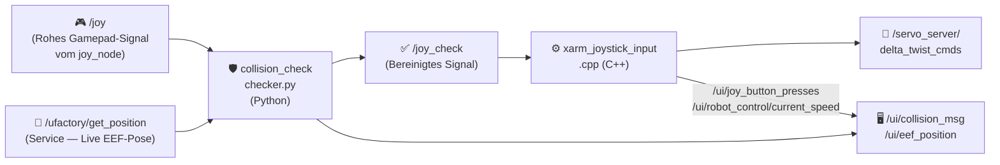

# xArm ROS 2 Extended Workspace (ROS2 Humble) **[IN DEV]**

Dieses Repository ist eine sich kontinuierlich weiterentwickelnde Forschungs- und Evaluationsplattform für multimodale Teleoperation und Mensch-Computer-Interaktion (HCI). <br>
> [!IMPORTANT]
> **Grundvoraussetzung:** Dieses Repository ist ein *Erweiterungs-Workspace*. Es baut vollständig auf dem offiziellen [xarm_ros2 Repository (Branch: humble)](https://github.com/xArm-Developer/xarm_ros2/tree/humble) von UFactory auf. Das offizielle Repository, dessen Struktur und all seine Systemabhängigkeiten bilden das zwingende Basis-Fundament für diese Software!

<p align="center">
  
</p>

## Inhaltsverzeichnis
1. [📋 Projektübersicht](#chapter-1)
2. [🔬 Architektur & Leitprinzipien](#chapter-2)
3. [📊 Monitoring: Dashboard & Workspace Analyzer](#chapter-3)
4. [🕹️ Multimodale Technologien & Interaktionskonzepte](#chapter-4)
5. [⚙️ Core Features & ROS 2 Nodes](#chapter-5)
6. [🎮 Gamepad-Steuerung — Technische Tiefenanalyse](#chapter-6)
7. [📦 Abhängigkeiten & Voraussetzungen](#chapter-7)
8. [🚀 Ausführung: Systemstart](#chapter-8)
9. [🗂️ Repository-Struktur](#chapter-9)

---

## <a id="chapter-1"></a> 1. 📋 Projektübersicht

### Konzept: Eine integrierte, multimodale Teleoperationsplattform
Das primäre Ziel dieses Projekts ist die Entwicklung und Implementierung einer modularen Steuerungs- und Interaktionsplattform für den Roboterarm UFactory xArm Lite 6. Das System bündelt heterogene, multimodale Eingabemethoden in einer zentralisierten Softwareumgebung und legt den Fokus konsequent auf eine maximierte Usability und intuitive Bedienbarkeit. Das System übernimmt die Berechnung der komplizierten Roboterbewegungen im Hintergrund. Dadurch entsteht eine einfache Schnittstelle, die die Wünsche des Nutzers direkt in Aktionen des Roboters übersetzt.

### Motivation: Assistenz, Inklusion und Teilhabe im Kontext der Industrie 5.0
Klassische Methoden der Teleoperation und Robotersteuerung sind in der Praxis hochgradig fehleranfällig und fordern vom Operator eine immense kognitive Feinsteuerung sowie technisches Fachwissen. Diese hohen Barrieren schließen viele Menschen von der direkten Nutzung aus. Im Sinne des Leitbildes der Industrie 5.0 – welche den Menschen, die Nachhaltigkeit und die Resilienz in den Mittelpunkt der industriellen Produktion stellt – setzt dieses Projekt genau hier an:

* **Abbau technischer Barrieren:** Reduktion der Einstiegshürden durch die Verlagerung von Low-Level-Gelenkkoordination hin zu intuitiven High-Level-Befehlen.
* **Förderung der Inklusion:** Schaffung technologischer Voraussetzungen, um auch Menschen mit unterschiedlichen physischen oder kognitiven Voraussetzungen eine produktive und gleichberechtigte Teilhabe am modernen Arbeitsplatz zu ermöglichen.
* **Mensch-Maschine-Synergie:** Etablierung des Roboters als assistierendes Werkzeug, das den Menschen entlastet, anstatt ihn zu ersetzen.

### Funktionsprinzip: Shared Control und das „Human-in-the-Loop“-Paradigma
Das technologische Fundament der Plattform basiert auf einem dynamischen *Shared-Control*-Ansatz, bei dem Mensch und Maschine kooperativ interagieren. Der Nutzer bleibt als Supervisor permanent in den Kontrollkreislauf eingebunden (*Human-in-the-Loop*), steuert das System jedoch über ein abgestuftes, komplementäres Interaktionsmuster:

* **Intuitive High-Level-Befehle:** Initiierung von globalen Aktionen oder Zielvorgaben über natürliche Modalitäten wie Blicksteuerung (Eye-Tracking) oder Sprachbefehle.
* **Präzise Low-Level-Korrekturen:** Nahtloser, latenzfreier Wechsel auf manuelle Eingabegeräte (z. B. Gamepad/MoveIt Servo) für feinfühlige Justierungen im Arbeitsraum.
* **Kontextsensitive Assistenz:** Autonome Pfadplanung und kollisionsfreie Trajektorienberechnung im Hintergrund, um den Operator während der Ausführung aktiv abzusichern.

### Zielsetzung: Ein valider, kosteneffizienter Proof-of-Concept
Das Vorhaben versteht sich als voll funktionsfähiger, reproduzierbarer und ökonomisch erschwinglicher Proof-of-Concept (PoC) für akademische Forschungslandschaften sowie praxisorientierte Inklusionsprojekte. Die offene Architektur dient als standardisierte Evaluierungsplattform, auf deren Basis neuartige assistive Robotiksysteme unter realitätsnahen Bedingungen entwickelt, getestet und empirisch validiert werden können.

### Evaluationslogik & Guidelines: Von der Forschung in die industrielle Praxis
Ein wesentlicher Kern und Innovationscharakter des Projekts liegt in der wissenschaftlichen Aufarbeitung der Interaktionsqualität. Das System dient nicht nur als technischer Demonstrator, sondern als Werkzeug zur Generierung übertragbaren Wissens:

* **Entwicklung einer Evaluationslogik:** Systematische Erfassung und Messung von Usability, kognitiver Belastung und Systemperformance zur quantitativen Bewertung der Mensch-Roboter-Schnittstelle.
* **Ableitung von Handlungsempfehlungen:** Formulierung standardisierter Guidelines, die Unternehmen als strategischer Leitfaden bei der Einführung moderner Robotersysteme dienen.
* **Beantwortung der Transformationsfrage:** Konkrete Hilfestellungen für die Praxis auf die Kernfrage: *„Wie können Prozesse und Arbeitsplätze strukturiert werden, um den menschzentrierten Anforderungen der Industrie 5.0 messbar gerecht zu werden?“*
* **Dienstleistungspotenzial:** Die resultierenden Frameworks und Guidelines besitzen das Potenzial, als validierte, monetarisierbare Consulting- und Dienstleistung für die Industrie bereitgestellt zu werden, um den digitalen und demografischen Wandel in der Produktion zu begleiten.

---

## <a id="chapter-2"></a> 2. 🔬 Architektur & Leitprinzipien

### 2.1 Betriebsmodi: FAKE vs. REAL (Hardware Interfaces)
Die Plattform unterscheidet strikt zwischen zwei Betriebsmodi für den Roboterarm. Diese Unterscheidung bezieht sich **ausschließlich auf das `ros2_control` Hardware Interface** und ist unabhängig von der Sensorik (wie Kamera oder YOLO, welche in beiden Modi live laufen können):

* **FAKE (Simulation Mode):** Der Roboter läuft über das `mock_components/GenericSystem` (bzw. FakeSystem) Hardware Interface innerhalb von `ros2_control`. Es gibt keine physische Controller-Verbindung. Befehle an den `/lite6_traj_controller` oder `/servo_server` werden rein virtuell in RViz2 gerendert, indem die Joint States gespiegelt werden. Proprietäre UFactory API-Calls (wie Mode/State-Switches) laufen in diesem Modus absichtlich ins Leere oder werden softwareseitig ge-bypassed.
* **REAL (Hardware Mode):** Das `ros2_control` Framework bindet das echte `xarm_api` Hardware Interface ein, welches via TCP/IP direkt mit dem physischen Controller des xArm Lite 6 kommuniziert. In diesem Modus greifen Hardware-Limits, physische Sicherheits-Stopps und die exklusive Umschaltung der proprietären xArm Hardware-Modi (z. B. Mode 0 für Pose-Steuerung vs. Mode 1 für Servo/Jogging) über die UFactory API.

### 2.2 Die Systemidee: Eine integrierte Entwicklungs-, Evaluierungs- und Validierungsplattform
Das Kernziel des Projekts ist die Realisierung einer modularen, plattformbasierten Softwarearchitektur für die multimodale Teleoperation und KI-gestützte Assistenzrobotik. Das System fungiert als zentraler, softwareseitiger Integrationsknoten (Middleware-Ebene), der heterogene Teilsysteme in einer einheitlichen Laufzeitumgebung zusammenführt. Durch ein verteiltes Server-Client-Netzwerk (Multi-PC-Setup) und die softwareseitige Kopplung an einen echtzeitfähigen Digitalen Zwilling (NVIDIA Isaac Sim) dient die Plattform sowohl als flexible Entwicklungsumgebung als auch als standardisierte und replizierbare Testumgebung. Das Projekt ist explizit als geschlossener Kreislauf aus Entwicklung und empirischer Validierung konzipiert:

* **Sensorik & Perzeption:** Integration von Tiefenkameras (z. B. Objekterkennung via YOLO, Marker-Tracking) sowie taktilen oder physiologischen Sensoren zur Zustandserfassung.
* **Multimodale Steuerung:** Parallele Einbindung diverser Eingabekanäle wie Eye-Tracking-Systeme zur Blickzielerfassung, Sprachsteuerung (z. B. via OpenAI Whisper) sowie klassische Hardware-Controller (Gamepads, 3D-Mäuse).
* **Kognitive Robotik:** Einbindung moderner Vision-Language-Action-Modelle (VLA), um hochgradig abstrakte, sprachliche und visuelle Befehle direkt in robotische Handlungssequenzen zu übersetzen.
* **Integrierte Datenakquisition:** Zeitsynchrone Aufzeichnung technischer Leistungsparameter und menschlicher Interaktionsdaten über eine zentrale Logging-Infrastruktur während der Systemnutzung.

### Human-Centered Automation
Die Systemarchitektur stellt den menschlichen Operator ins Zentrum des Interaktionsdesigns. Das System wird so konzipiert, dass Nutzer den aktuellen Automatisierungszustand durchgängig kognitiv erfassen und nachfolgende Systemaktionen antizipieren können. Diese Transparenz bricht algorithmische Black-Box-Strukturen auf, was für den praktischen Einsatz wesentliche Vorteile bringt:

* **Kognitive Transparenz:** Durchgängige Nachvollziehbarkeit der Systemzustände, insbesondere bei der parallelen Verarbeitung von Blickbewegungen und sensorischen Rückmeldungen.
* **Fundierte Intervention:** Befähigung des Operators zu sicheren und gezielten Eingriffen in kritischen oder unvorhergesehenen Interaktionssituationen.
* **Kalibriertes Systemvertrauen:** Schaffung einer verlässlichen technologischen Basis für den systematischen Aufbau von *Trust in Automation*, welcher im Rahmen von Nutzerstudien evaluiert wird.

### Shared Control & Kognitive Entlastung
Ein Kernmerkmal der Softwarearchitektur ist die Implementierung von *Shared-Control*-Paradigmen zur kooperativen Aufgabenbewältigung. Die Plattform ermöglicht einen nahtlosen, latenzarmen Wechsel der Kontrollhoheit zwischen manueller Führung, blickgesteuerten Interaktionen und KI-gestützten, teilautomatisierten Assistenzfunktionen. Die kontextabhängige Aufteilung der Kontrollanteile zielt auf folgende Kernaspekte:

* **Nahtlose Kontrollübergabe:** Latenzarmer Wechsel zwischen manueller Eingabe (z. B. via MoveIt Servo / Gamepad) und autonomen Systemaktionen (z. B. blickbasiertes Greifen).
* **Minimierung des Mental Workload:** Gezielte Reduktion der mentalen Arbeitsbelastung des Nutzers während komplexer oder langandauernder Manipulationsaufgaben.
* **Autonome Fehlerkompensation:** Selbstständiges Abfangen fehleranfälliger Low-Level-Korrekturen durch das System, wodurch kognitive Ressourcen für die übergeordnete Prozessüberwachung freigesetzt werden.
* **Empirische Validierung:** Laufende Überprüfung der tatsächlichen kognitiven Entlastung im Projektverlauf über standardisierte psychometrische Verfahren.

### HCI & Usability Fokus & Empirische Evaluation
Die Gestaltung der zentralen Steuerungsschnittstelle (GUI) folgt etablierten Prinzipien der Mensch-Computer-Interaktion (HCI). Die Interaktionsmuster verschieben sich von der komplexen Koordination einzelner Freiheitsgrade oder dem manuellen Aufrufen verteilter Terminal-Prozesse hin zu einer intentionsbasierten Aufgabenbewältigung. Ein integraler Bestandteil des Projekts ist die Durchführung systematischer Benutzerstudien zur Evaluierung dieser multimodalen Schnittstellen:

* **Intentionsbasierte Steuerung:** Übersetzung abstrakter Handlungsabsichten (per Sprache, Blickziel oder High-Level-Controller) in präzise kinematische Trajektorien.
* **Standardisierte Usability-Metriken:** Erhebung der subjektiven Gebrauchstauglichkeit über etablierte Fragebögen wie die *System Usability Scale* (SUS).
* **Objektive Leistungsparameter:** Messung von quantitativen Faktoren wie *Task Completion Time*, Fehlerraten und spezifischen Blickbewegungspfaden.
* **Beanspruchungsanalyse:** Empirische Absicherung der kognitiven Belastung der Probanden unter Verwendung des *NASA-TLX*-Index zur iterativen Systemoptimierung.

### Reproduzierbar & Open Source
Zur Gewährleistung wissenschaftlicher Validität ist das Projekt als Open-Source-Architektur angelegt. Die Offenlegung der vollständigen Codebasis sichert die methodische Transparenz aller Algorithmen, Konfigurationen und Datenflüsse. Für die wissenschaftliche Gemeinschaft ergeben sich daraus zentrale Mehrwerte:

* **Methodische Transparenz:** Vollständige Einsehbarkeit aller zugrundeliegenden Algorithmen, URDF-Modelle und MoveIt-Konfigurationen.
* **Exakte Replikation:** Ermöglichung unkomplizierter Zweituntersuchungen durch unabhängige Forschungsgruppen unter identischen Bedingungen.
* **Statistische Verifizierbarkeit:** Nachvollziehbarkeit und Validierung komplexer, aufgezeichneter Sensordatenströme und Steuerungseingaben.
* **Standardisierte Benchmark:** Etablierung der Plattform als verlässliche Vergleichsbasis für komparative Studien im Bereich der Assistenz- und Inklusionsrobotik.

### Kosteneffiziente Hardware
Die Systemkonfiguration basiert primär auf ökonomisch erschwinglichen, kommerziell verfügbaren Komponenten (COTS), ohne die erforderliche Präzision und funktionale Zuverlässigkeit zu kompromittieren. Dieser Ansatz verfolgt klare strategische Ziele:

* **Demokratisierung des Zugangs:** Reduktion investiver und finanzieller Barrieren beim Einstieg in moderne, multimodal gesteuerte Robotiktechnologien.
* **Zielgruppen-Transfer:** Erleichterter Technologietransfer in inklusive Projekte, Bildungseinrichtungen und kleinere Forschungseinrichtungen (z. B. über den UFactory xArm Lite 6 und Consumer-Controller).
* **Validierung der Verlässlichkeit:** Gezielte wissenschaftliche Evaluierung, inwieweit kosteneffiziente Hardware im direkten Vergleich zu hochpreisigen Industriesystemen eine valide Forschungsplattform darstellt.

### Modular & Industrie-Standard
Die softwareseitige Infrastruktur ist modular gekapselt und vollständig in das Middleware-Framework ROS 2 Humble integriert. Die native Nutzung standardisierter Kommunikationsprimitive sichert die Interoperabilität mit industriellen Ökosystemen. Das konsequente Baukastenprinzip bietet entscheidende architektonische Vorteile:

* **Native ROS 2-Kommunikation:** Volle Kompatibilität mit etablierten Ökosystemen (wie MoveIt 2) und modernen Sensor-SDKs über Nodes, Topics, Services und Actions.
* **Isolierte Subsystem-Kapselung:** Unkomplizierter Austausch oder Erweiterung einzelner Module – wie VLA-Pipelines zur Intentionserkennung oder spezifischer Eye-Tracking-Treiber.
* **Zukunftssicherheit & Portierbarkeit:** Wartungsfreundliche Softwarestruktur, die eine einfache Migration auf zukünftige ROS 2 LTS-Distributionen ohne Modifikation der Gesamtplattform erlaubt.

---

## <a id="chapter-3"></a> 3. 📊 Monitoring: Dashboard & Workspace Analyzer

Sobald die Nodes über ROS 2 Nexus gestartet wurden, lässt sich der Live-Zustand des Systems über das **ROS2 Core Dashboard** überwachen. Dies ist eine webbasierte Echtzeit-UI, die statische Quellcode-Analysen mit Live-Telemetriedaten des ROS 2 Netzwerks zu einer einheitlichen Monitoring-Oberfläche zusammenführt.

### 3.1 Workspace Analyzer Backend (`workspace_analyzer.py`)
Das Workspace Analyzer Backend ist ein ROS 2 Node, der eine ausführungsfreie, regex-basierte statische Code-Analyse durchführt. Es wurde stark modularisiert in drei Kerndateien: `workspace_analyzer.py` (behandelt ROS Pub/Sub), `workspace_parser.py` (führt die Regex-Analyse aus) und `system_utils.py` (parst Umgebungsvariablen). Dabei werden Node-Namen, Publisher, Subscriber, Services, Actions und Paketabhängigkeiten extrahiert. Diese strukturierten JSON-Metadaten werden kontinuierlich an `/dashboard/workspace_metadata` publiziert (im 10-Sekunden-Timer-Zyklus). Zusätzlich werden Umgebungsvariablen (ROS Distro, Domain ID, DDS-Middleware, Localhost-Modus) aus `~/.bashrc` ausgelesen und als Live-Status-Badges bereitgestellt.

> **Hinweis zu `workspace_analyzer.py`:** Dies ist **kein** Netzwerk-Server, sondern ein normaler ROS 2 Node. Das Dashboard greift über die ROS Bridge (Port 9090) auf dessen publizierte Topics zu.

### 3.2 Frontend (`dashboard_index.html`)
Verbindet sich über WebSocket (`rosbridge_server` auf Port 9090) mit dem ROS-Netzwerk. Die Frontend-Logik wurde für eine bessere Wartbarkeit strikt in 8 spezialisierte JavaScript-Module unterteilt (z.B. `dashboard_script_nodes.js`, `dashboard_script_graph.js`, `dashboard_script_ros.js`). Es gleicht statisch analysierte Nodes visuell mit den aktuell laufenden Nodes ab, zeigt Echtzeit-Topic-Frequenzen (Hz) an und ermöglicht die direkte Ausführung von System-Skripten aus der Browser-Oberfläche in einer übersichtlichen, einspaltigen Referenzansicht. Das UI nutzt eine moderne Glassmorphism-Designsprache und führt rekursives JSON-Parsing durch, um tief verschachtelte ROS-Nachrichtenstrukturen sauber formatiert darzustellen. Die Sidebar liefert auf einen Blick Statusinformationen wie Verbindungsgesundheit, Roboter-Verfügbarkeit und die aktive ROS 2 Umgebungskonfiguration.


### 3.3 Startbefehle der UI-Komponenten
*Starte diese Komponenten über ROS 2 Nexus oder manuell über das Terminal:*
* **Workspace Analyzer Backend:** `python3 src/websocket/workspace_analyzer.py`
* **Webserver:** `python3 -m http.server 8080 -d src/websocket`
* *(Dashboard erreichbar unter: `http://localhost:8080/dashboard_index.html`)*

---

## <a id="chapter-4"></a> 4. 🕹️ Multimodale Technologien & Interaktionskonzepte

### 4.1 Roboter-Steuerungsarten (Inputs)
**Gamepad Teleoperation:** <br> 
* Latenzarme, kontinuierliche Feinsteuerung per Xbox One Elite Series 2 Controller (inkl. haptischem Feedback - Vibration bei Kollisionsgefahr).

**Sprachsteuerung:** <br> 
* Lokale Sprachverarbeitung (Whisper AI) für semantische, intentionsbasierte Steuerung via Mikrofon.

**Eye-Tracking** (in Bearbeitung...): <br> 
* Robotersteuerung und UI-Interaktion (Blickerfassung) über Tobii Pro Glasses 3.

**Gestensteuerung** (in Bearbeitung...): <br> 
* Berührungslose, intuitive Hand- und Fingererkennung zur direkten räumlichen Manipulation und Gestensteuerung über Leap Motion.

**VR-Controller Steuerung** (in Bearbeitung...): <br>
* Immersive, räumliche Teleoperation durch präzises 6DoF-Tracking (Six Degrees of Freedom) und haptisches Feedback mittels Virtual Reality Controllern.

### 4.2 Sensorik & Assistenz (Perception)
**Computer Vision:** <br> 
* **[VERALTET]** Räumliche 2D-Objekterkennung und Lokalisierung mittels *YOLO* über PiCameras. Die Objekterkennung erfolgt vollständig in 3D durch die ZED-Kamera.
**Stereo Vision:** <br>
* Integration echter 3D-Tiefendaten durch eine *ZED Mini (Stereolabs)* Kamera.
**VLA & Video Action Models (Geplant):** <br>
* KI-gestützte Handlungsplanung durch *Vision-Language-Action* Modelle.

### 4.3 Koordinatentransformation & Kalibrierung
**ArUco Marker System [VERALTET]:** <br> 
* *[Veraltet]* Im Arbeitsbereich des Roboters platzierte Marker dienen als Referenz für Homographie-Matrizen.
* *[Veraltet]* Ableitung von 3D-Weltkoordinaten für Objekte auf der Arbeitsfläche (Z = 90 mm).
* Präzise Projektion von Eye-Tracking Blickkoordinaten auf die Steuerungs-**UI**, um den Blick in Roboterbefehle zu übersetzen.

### 4.4 User Interfaces (UI/GUI)
Für eine kognitiv entlastende Teleoperation steht dem Nutzer ein zentrales, immersives User Interface zur Verfügung, das alle Systemzustände bündelt.

**Telemetrie & Status:** <br> 
* Kontinuierliche Anzeige von Echtzeit-Telemetriedaten des Roboterarms.
  
**System Feedback & Intent Recognition:** <br>
* Direktes visuelles und akustisches Feedback für manuelle Steuereingaben sowie erfolgreich geparste Sprachbefehle.
  
**Präventive Kollisionswarnungen:** <br> 
* Dynamische Warnungen beim Eingreifen softwareseitiger Kollisionsschutzmaßnahmen (z.B. Unterschreiten des Z-Limits).
  
**Visuelles Monitoring & Objekterkennung:** <br>
* Nahtlose Integration von Video-Livestreams mit Live-Overlays erkannter Zielobjekte (YOLO Bounding Boxes) sowie einer synchronisierten 3D-Visualisierung (Digitaler Zwilling) der Arbeitsumgebung.

**Umsetzung via OBS Studio:**<br>
* In *OBS Studio* werden alle Komponenten gebündelt und dem Nutzer als zentrale GUI für die Roboter-Teleoperation bereitgestellt.*


**Gaze Control User Interface**<br>


---

## <a id="chapter-5"></a> 5. ⚙️ Core Features & ROS 2 Nodes

Um ein klares Verständnis für die Architektur zu schaffen, sind die Software-Module nach ihren funktionalen **Features (Use-Cases)** gegliedert. Jedes Modul ist dabei explizit als ROS 2 Node, Skript oder Plugin gekennzeichnet.

### 🎮 5.1 Funktion: Gamepad Teleoperation & Harter Kollisionsschutz
*Dieses Subsystem steuert das manuelle Jogging des Roboters per Xbox-Controller und verhindert aktiv, dass der Roboter durch Bedienfehler mit der Arbeitsfläche kollidiert.*

* **`xarm_joystick_input.cpp` [NODE]**
    * 🎯 **Zweck & Aufgabe:** Übersetzt die bereinigten Gamepad-Signale (Analog-Sticks & Trigger) in kartesische Geschwindigkeitsbefehle (`TwistStamped`) für MoveIt Servo. Wendet exponentielles Smoothing an und steuert alle Button-Mappings.
    * 🟠 📥 **Subscribes:** `/joy_check` (`sensor_msgs/Joy`). Liest die vom Wächter-Node bereinigten Controller-Inputs.
    * 🟢 📤 **Publishes:** `/servo_server/delta_twist_cmds` (`geometry_msgs/TwistStamped`). Sendet Motorströme/Geschwindigkeiten an den Servo Server.
    * 🔄 **Services:** `/servo_server/start_servo`, `/servo_server/stop_servo`, `/servo_server/switch_command_type` (Clients).
* **`checker.py` (`collision_check`) [NODE]**
    * 🎯 **Zweck & Aufgabe:** Sitzt als Wächter *vor* der Bewegungsübersetzung. Berechnet prädiktiv (0,1 Sek. in die Zukunft) die Z-Koordinate. Würde der Roboter den Tisch berühren, wird der Abwärtsbefehl des Controllers hart überschrieben und blockiert. Löst das Rumble-Feedback (Vibration) des Gamepads aus.
    * 🟠 📥 **Subscribes:** `/joy` (`sensor_msgs/Joy`), `/servo_server/status` (`std_msgs/Int8`). Liest den rohen Controller-Input und Status-Codes des Servo-Servers (z.B. Kollisionswarnungen von YOLO-Boxen).
    * 🟢 📤 **Publishes:** `/joy_check` (`sensor_msgs/Joy`), `/joy/set_feedback` (`sensor_msgs/JoyFeedbackArray`). Sendet den (ggf. null-korrigierten) Befehl an den `joystick_input` weiter und steuert die Controller-Vibration.
    * 🔄 **TF2:** Hört auf die aktuelle TCP-Höhe (`link_base` -> `link_tcp`).
    * ⚙️ **Parameter:**
        * `look_ahead_time = 0.1` – Prädiktionshorizont (Sekunden) für die Geschwindigkeits-Vorausschau.
        * `table_z_threshold = 0.0` – Die harte Tischbarriere auf der Z-Achse (World-Frame).
* **`xarm_moveit_servo` [KONFIGURATION / NODE]**
    * 🎯 **Zweck & Aufgabe:** Die Echtzeit-Bewegungs-Engine von MoveIt. Reagiert auf dynamische Hindernisse (YOLO-Boxen) über einen `threshold_distance` Parameter und stoppt den Arm, bevor er mit Objekten kollidiert.
    * 🟠 📥 **Subscribes:** `/servo_server/delta_twist_cmds` (`geometry_msgs/TwistStamped`), `/planning_scene` (`moveit_msgs/PlanningScene`).
    * 🟢 📤 **Publishes:** `/lite6_traj_controller/joint_trajectory` (`trajectory_msgs/JointTrajectory`). Sendet die fertigen Gelenkwinkel an den Roboter.
    * ⚙️ **Parameter (`xarm_moveit_servo_config.yaml`):**
        * `collision_check_type: threshold_distance` – Blockiert die Kinematik hart an der Grenze, anstatt langsam abzubremsen (`stop_distance`).
        * `collision_distance_safety_margin: 0.02` – Definiert die 2 cm breite, unsichtbare Kollisionsblase um den Roboter.

### 🟢 5.2 Funktion: Autonomes Greifen & 3D Objekterkennung (YOLO / ZED)
*Dieses Subsystem ist dafür verantwortlich, Objekte im 3D-Raum zu lokalisieren, virtuelle Hindernisse zu generieren und den Roboter gezielt an das Objekt heranzuführen.*

* **`zed_wrapper` [NODE]**
    * 🎯 **Zweck & Aufgabe:** Der native Hardware-Treiber der Stereolabs ZED Mini Kamera. 
    * 🟢 📤 **Publishes:** `/zed/zed_node/rgb/image_rect_color` (`sensor_msgs/Image`), `/zed/zed_node/depth/depth_registered` (`sensor_msgs/Image`), `/zed/zed_node/point_cloud/cloud_registered` (`sensor_msgs/PointCloud2`). Bildet die sensorische Grundlage für das gesamte System.
    * ⚙️ **Parameter (`zed_cam_rviz_pointcloud_tf_yolo_planned_grasp.launch.py`):**
        * `depth_mode: ULTRA` – Erzwingt die maximal dichte 3D-Punktwolke für saubere Kantenberechnung.
        * `auto_exposure: True` – Erlaubt den automatischen Helligkeitsausgleich für robuste YOLO Erkennung.
* **`zed_yolo_3d_bbox.py` [NODE]**
    * 🎯 **Zweck & Aufgabe:** Verarbeitet parallel den RGB- und Depth-Stream mit GPU-Beschleunigung und dem **YOLOv8 Large** Modell. Isoliert Objekte, filtert Tiefenrauschen (Perzentil & EMA-Glättung) und berechnet millimetergenaue, auf die Tischebene geerdete 3D-Bounding-Boxen (inklusive Greifpunkt-Marker).
    * 🟠 📥 **Subscribes:** `/zed/zed_node/rgb/image_rect_color` (`sensor_msgs/Image`), `/zed/zed_node/depth/depth_registered` (`sensor_msgs/Image`), `/zed/zed_node/rgb/camera_info` (`sensor_msgs/CameraInfo`).
    * 🟢 📤 **Publishes:** `/zed/bboxes_3d` (`visualization_msgs/MarkerArray`). Sendet die fertigen 3D-Boxen und Marker zur Visualisierung an RViz und an nachgelagerte Nodes.
    * ⚙️ **Parameter:**
        * `percentiles: [2, 98]` – Schneidet extreme Tiefen-Rausch-Pixel ("Flying Pixels" an Objektkanten) hart ab.
        * `ema_alpha: 0.3` – Glättungsfaktor (Exponential Moving Average), um Boxen-Jittering zwischen Frames zu eliminieren.
* **`yolo_moveit_collision.py` [NODE]**
    * 🎯 **Zweck & Aufgabe:** Wandelt die erkannten 3D-Boxen nahtlos in dynamische MoveIt `CollisionObject`-Nachrichten um und fügt diese als massive, solide Hindernisse in den Planungsraum ein.
    * 🟠 📥 **Subscribes:** `/zed/bboxes_3d` (`visualization_msgs/MarkerArray`). Liest die Bounding Boxen aus.
    * 🟢 📤 **Publishes:** `/planning_scene` (`moveit_msgs/PlanningScene`). Sendet die `CollisionObjects` direkt an die MoveIt Planning Scene, um Kollisionen beim Greifen/Fahren zu vermeiden.
* **`yolo_planned_grasp_executor.py` [NODE]**
    * 🎯 **Zweck & Aufgabe:** Die zentrale Steuerungslogik der autonomen Greif-Pipeline. Liest das UI-Feld ("Grasp Object") aus, holt sich die YOLO-Koordinaten und orchestriert eine robuste **Kollisionsfreie 3-Phasen Greif-Sequenz**:
        * **Phase 1 (Retract):** Fährt den Arm von seiner aktuellen Position exakt nach oben, um eine sichere Überflughöhe zu erreichen.
        * **Phase 2 (Hover):** Bewegt sich horizontal auf der sicheren Z-Höhe (15cm) exakt über das Zielobjekt. Erzwingt dabei eine strikte Top-Down Orientierung (gerade nach unten) und nutzt sehr enge IK-Toleranzen (5mm Position, 0.001 rad Neigung) für millimetergenaue Ausrichtung.
        * **Phase 3 (Approach):** Schaltet das anvisierte Objekt kurzzeitig über `/ui/ignore_collision_object` in der globalen MoveIt Kollisionsszene ab, damit der Greifer physisch in die Bounding Box eindringen kann, ohne einen Not-Aus auszulösen, und fährt dann nach unten.
    * 🟠 📥 **Subscribes:** `/ui/grasp_object_cmd` (`std_msgs/String`), `/zed/bboxes_3d` (`visualization_msgs/MarkerArray`).
    * 🟢 📤 **Publishes:** `/ui/grasp_status` (`std_msgs/String`) für das RViz Console-Log, `/ui/ignore_collision_object` (`std_msgs/String`).
    * 🔄 **Services:** `/compute_ik` (IK Verifizierung), `/move_action` (MoveIt OMPL Planer), `/ui/execute_move_to_pose` (Servo Fallback).
* **`zed_stand_publisher.py` [SKRIPT]**
    * 🎯 **Zweck & Aufgabe:** Generiert mathematisch exakt das 3D-Modell des Kamerastativs (Aluminiumprofil) und publiziert dieses statisch in RViz.
    * 🟢 📤 **Publishes:** `/zed_stand_marker` (`visualization_msgs/Marker`).
* **`tf_tuner.py` [SKRIPT / UI]**
    * 🎯 **Zweck & Aufgabe:** Live-Tuner Interface (PyQt5) zur schnellen Justierung von Kamera-Offsets ohne Neustart.
    * 🟢 📤 **Publishes:** Aktualisiert dynamisch die TF-Broadcaster-Werte (`tf2_msgs/TFMessage` auf `/tf_static`).

### 🗣️ 5.3 Funktion: Multimodale Interaktion (Sprache & Blicksteuerung)
*Diese experimentellen Module erlauben die "Hands-Free"-Steuerung des Systems.*

* **`ros2_whisper` [NODE]**
    * 🎯 **Zweck & Aufgabe:** Lokale Speech-to-Text KI. Führt Whisper AI kontinuierlich auf dem Mikrofon-Stream aus und publiziert gesprochene Wörter als Text.
    * 🟢 📤 **Publishes:** `/whisper/text` (`std_msgs/String`).
* **`voice_command_listener.py` [NODE]**
    * 🎯 **Zweck & Aufgabe:** Analysiert den Rohtext über Regex-Muster, filtert Füllwörter heraus und extrahiert definierte Handlungs-Intents (z.B. "Fahre zu Rot").
    * 🟠 📥 **Subscribes:** `/whisper/text` (`std_msgs/String`).
    * 🟢 📤 **Publishes:** `/voice_cmd` (`std_msgs/String`), `/ui/voice_feedback` (`std_msgs/String`). Leitet erkannte Befehle strukturiert weiter und sendet UI-Feedback an das Dashboard.
* **`gaze_control.py` [SKRIPT / UI]**
    * 🎯 **Zweck & Aufgabe:** Eine übergeordnete Master-Control-UI (PyQt5). Setzt Eye-Tracking-Blickpunkte (über RTSP Gaze-Daten) in Button-Klicks um (z.B. bei 0,5 Sek. Fixationsdauer) und sendet Bewegungsbefehle.
    * 🟢 📤 **Publishes:** `/voice_cmd` (`std_msgs/String`). Übersetzt Blicke in textbasierte Zielbefehle.

### 🖥️ 5.4 Funktion: Grafische Steuerung & Visuelles Feedback
*Werkzeuge für den Operator zur manuellen Positionierung und für visuelles Monitoring in RViz und Web.*

* **`rviz_robot_control_panel.cpp` [RVIZ PLUGIN]**
    * 🎯 **Zweck & Aufgabe:** Das in C++ geschriebene, native 2D-Steuerungs-Panel für RViz. Bietet D-Pad Tasten, das **"Grasp Object"** Eingabefeld und ein **Live-Konsolen-Log**. Nutzt eine threadsichere `Qt::QueuedConnection` Signal/Slot Architektur, um asynchrone ROS 2 Statusmeldungen direkt in das UI zu streamen, ohne die Oberfläche einzufrieren oder Abstürze (Segmentation Faults) zu verursachen.
    * 🟠 📥 **Subscribes:** `/ui/grasp_status` (`std_msgs/String`). Liest Logs für das integrierte Textfenster ein.
    * 🟢 📤 **Publishes:** `/servo_server/delta_twist_cmds` (`geometry_msgs/TwistStamped`), `/ui/grasp_object_cmd` (`std_msgs/String`). Sendet Jogging-Geschwindigkeiten und den YOLO-Ziel-String.
    * 🔄 **Services:** `/ui/execute_initial_pose`, `/ui/execute_move_to_pose`, `/ui/execute_scan_trajectory` (Clients).
* **`set_pose_moveit_node.py` [NODE]**
    * 🎯 **Zweck & Aufgabe:** Führt die Befehle des Control Panels unsichtbar im Hintergrund aus. Beinhaltet einen intelligenten Startup-Trigger (fährt die Initial-Pose automatisch an) sowie einen robusten, kartesischen P-Regler für direkte Koordinaten-Anfahrten (ohne Singularitäten der Inversen Kinematik).
    * 🟠 📥 **Subscribes:** `/ui/robot_control/current_speed` (`std_msgs/Float64`). Skaliert die Geschwindigkeit des P-Reglers synchron zur UI.
    * 🟢 📤 **Publishes:** `/servo_server/delta_twist_cmds` (`geometry_msgs/TwistStamped`), `/lite6_traj_controller/joint_trajectory` (`trajectory_msgs/JointTrajectory`).
    * 🔄 **Services:** Bietet `/ui/execute_initial_pose` und `/ui/execute_move_to_pose` als Server an. Besitzt einen TF2-Listener für Echtzeit TCP-Koordinaten.
    * ⚙️ **Parameter (P-Regler):**
        * `Kp_pos = 2.5` – Proportional-Gain für dynamische, aber stabile Anfahrten.
        * `max_vel_pos = 0.2` – Limitiert die TCP-Geschwindigkeit auf 0.2 m/s.
        * `position_tolerance = 0.002` – Der Regler stoppt exakt 2 mm vor dem absoluten Ziel.
* **`rviz_overlay.py` & `servo_status_overlay.py` [NODES]**
    * 🎯 **Zweck & Aufgabe:** Projizieren farbkodierte Warnmeldungen (z.B. "COLLISION!") sowie Live-Achsen-Koordinaten als Overlay in den Video-Stream des RViz-Sichtfelds.
    * 🟠 📥 **Subscribes:** `/servo_server/status` (`std_msgs/Int8`), `/ui/collision_msg` (`std_msgs/String`), `/ui/robot_control/current_frame` (`std_msgs/String`). Hören auf kritische Warn-Flags und Frame-Updates.
    * 🟢 📤 **Publishes:** Nutzt `rviz_2d_overlay_msgs/OverlayText`.
* **`rviz_scene_objects_MarkerArray.py` [NODE]**
    * 🎯 **Zweck & Aufgabe:** Publiziert ROS `MarkerArray`-Nachrichten in die 3D-Szene von RViz2 (z.B. visuelle Tischkanten).
    * 🟢 📤 **Publishes:** `/scene_markers_array` (`visualization_msgs/MarkerArray`).
* **`rosbridge_server` [NODE]**
    * 🎯 **Zweck & Aufgabe:** Standard-WebSocket-Brücke auf Port 9090, die dem webbasierten Dashboard erlaubt, direkt auf das ROS-Netzwerk zuzugreifen.

### 🤖 5.5 Funktion: Komplexe Trajektorien & Task-Koordination
*Nodes, die spezifische, übergeordnete Bewegungsabläufe orchestrieren.*

* **`scan_trajectory_node.py` [NODE]**
    * 🎯 **Zweck & Aufgabe:** Generiert eine kontinuierliche spiralförmige Pfadplanung um ein Objekt herum (z. B. getriggert durch den "Vision Scan" Button). Berechnet in Echtzeit Look-At-Quaternions, um das Kamera-Zentrum permanent auf das Objekt zu fokussieren.
    * 🟢 📤 **Publishes:** `/servo_server/delta_twist_cmds` (`geometry_msgs/TwistStamped`).
    * 🔄 **Services:** Bietet `/ui/execute_scan_trajectory` als Server an. TF2-Listener für Echtzeit TCP-Koordinaten.
    * ⚙️ **Parameter (Trajektorie):**
        * `radius = 0.2` – Orbit-Radius von 20 cm um das Ziel.
        * `z_start = 0.4` / `z_end = 0.15` – Start- und Endhöhe für die Spiralfahrt nach unten.
        * `velocity_hz = 50` – Hohe Rate (50Hz) für flüssiges Einspeisen in MoveIt Servo.
* **`motion_sequence.py` [NODE]**
    * 🎯 **Zweck & Aufgabe:** Zustandsverwaltung zwischen MoveIt Servo und Hardware. Pausiert das flüssige Servo-Jogging (Gamepad), unterbricht den xArm Hardware-Controller, führt eine statische Fahrt aus und aktiviert danach Servo wieder nahtlos zurück.
    * 🔄 **Services:** `/execute_motion_to_pose` (Server). Ruft zudem Hardware-Spezifische UFactory Services ab (`set_mode`, `set_state`).
* **`move_to_coordinator.py` [NODE]**
    * 🎯 **Zweck & Aufgabe:** Orchestriert Look-At-Befehle (Sprache/Auge) und übergibt Parameter an andere Motion-Nodes.
    * 🟠 📥 **Subscribes:** `/voice_cmd` (`std_msgs/String`), `/objects/.../world_poses` (`geometry_msgs/PoseArray`).

### ⚠️ 5.6 Veraltete / Deprecated Module
*Historische Module, die durch neuere Systeme (z.B. ZED Mini) abgelöst wurden.*

* **`yolo_object_detector` [SKRIPT / NODE]**
    * 🎯 **Zweck & Aufgabe:** *[Veraltet]* Die alte 2D-basierte Objekterkennung über Raspberry Pi Kameras. Transformierte YOLO Bounding Boxes mittels `cv2.findHomography` und flachen ArUco-Markern in den starren 3D-Raum (Z=90 mm). Vollständig durch das `my_3d_vision_bringup` (3D Vision System) ersetzt.
    * 🟢 📤 **Publishes:** `/objects/<color>_<shape>/world_poses` (`geometry_msgs/PoseArray`).

---

## <a id="chapter-6"></a> 6. 🎮 Gamepad-Steuerung — Technische Tiefenanalyse

Dieser Abschnitt liefert eine vollständige technische Referenz für die zweistufige Gamepad-Pipeline, die eine kollisionssichere Echtzeit-Teleoperation des xArm Lite 6 mit dem Xbox One Elite Series 2 Controller ermöglicht.

### 6.1 Pipeline-Architektur

Das Gamepad-Signal durchläuft zwei Stufen, bevor es den MoveIt Servo Server erreicht. Dieses Zwei-Node-Design trennt **Sicherheitsdurchsetzung** (Python) von **Bewegungsübersetzung** (C++):



---

### 6.2 `checker.py` — Kollisionswächter (Python Node)

**Datei:** `src/collision_check/collision_check/checker.py`

Dieser Node fungiert als transparenter **Sicherheits-Proxy** zwischen dem rohen Joystick-Treiber und dem Motion-Controller. Er ist **zu 100% Hardware-unabhängig** (funktioniert identisch im REAL- und FAKE-Modus). Jedes eingehende `/joy`-Signal löst eine synchrone `tf2_ros`-Abfrage aus, um die Echtzeit-Position des Endeffektors (`link_base` zu `link_tcp`) zu bestimmen; erst nach der Koordinatenabfrage wird das (ggf. modifizierte) Signal weitergeleitet. Er liefert zudem **haptisches Feedback** (Gamepad-Vibration), wenn sich der Roboter dem Tisch nähert oder über MoveIt Servo ein dynamisches 3D-Hindernis (YOLO Bounding Box) erkannt wird.

#### 6.2.1 Prädiktiver Kollisions-Algorithmus

```
trigger_intensity  = (1.0 - axes[RT]) / 2.0        # 0.0 (los) → 1.0 (voll)
target_z_velocity  = V_max × speed_factor × trigger_intensity
effective_velocity = target_z_velocity × α          # α = 0.9
predicted_z        = current_z − (effective_velocity × Δt)

if predicted_z < Z_LIMIT:
    axes[RT] = 1.0  # Abwärtsbefehl auf 0.0 setzen
```

| Parameter | Wert | Beschreibung |
|---|---|---|
| `Z_LIMIT` | `96,5 mm` | Absolutes Z-Limit |
| `CAUTION_ZONE_START` | `110,0 mm` | Toleranzbereich — Geschw. auf 25% begrenzt |
| `CAUTION_ZONE_SPEED` | `0,25` | Max. Faktor in der Vorsichtszone |
| `MAX_LINEAR_VELOCITY_MM_S` | `75,0 mm/s` | Angenommene max. Lineargeschwindigkeit |
| `LOOKAHEAD_TIME` | `0,1 s` | Vorhersagehorizont |
| `ACCELERATION_FACTOR` (α) | `0,9` | Dämpfungsfaktor |
| `DOWN_TRIGGER_AXIS` | `5` (RT) | Joy-Achsen-Index für Abwärts-Trigger |

#### 6.2.2 Zwei-Stufen-Sicherheitsmodell

```
Z > 110 mm              → Volle Geschwindigkeit, keine Einschränkungen
110 mm ≥ Z > 96,5 mm   → ⚠️  VORSICHTSZONE: Geschwindigkeit auf 25% begrenzt
Z ≤ 96,5 mm            → 🛑  HARD STOP: Abwärtsachse genullt + Rumble
```

#### 6.2.3 Haptisches Feedback via Pygame

```python
if self.joystick: self.joystick.rumble(0.8, 0.8, 1000)  # Intensität L/R, Dauer ms
```

Das Rumble-Signal wird aufgehoben, sobald der Arm wieder sicher ist.

#### 6.2.4 Topics & Services Referenz

| Typ | Name | Message-Typ | Beschreibung |
|-----|------|------------|-------------|
| **Subscriber** | `/joy` | `sensor_msgs/Joy` | Rohes Gamepad-Signal |
| **Publisher** | `/joy_check` | `sensor_msgs/Joy` | Bereinigtes Ausgangssignal |
| **Publisher** | `/ui/eef_position` | `std_msgs/Float32MultiArray` | Live EEF-Position [x, y, z] |
| **Publisher** | `/ui/collision_msg` | `std_msgs/String` | Kollisionswarnung für UI |
| **Subscriber** | `/ui/robot_control/current_speed` | `std_msgs/Float32` | Geschwindigkeitsfaktor vom C++ Node |
| **Service Client** | `/ufactory/get_position` | `xarm_msgs/GetFloat32List` | Echtzeit-EEF-Pose |

---

### 6.3 `xarm_joystick_input.cpp` — Motion Controller (C++ Node)

**Datei:** `src/xarm_ros2/xarm_moveit_servo/src/xarm_joystick_input.cpp`  
**Klasse:** `xarm_moveit_servo::JoyToServoPub`  
**Registriert als:** ROS 2 Component (`RCLCPP_COMPONENTS_REGISTER_NODE`)

#### 6.3.1 Vollständiges Controller Button-Mapping

| Eingabe | Funktion | ROS-Aktion | Technisches Detail |
|---------|---------|-----------|-------------------|
| **Left Stick ↑↓** | X-Achse (vor/zurück) | `TwistStamped.linear.x` | `axes[1] × speed_scale` |
| **Left Stick ←→** | Y-Achse (links/rechts) | `TwistStamped.linear.y` | `axes[0] × speed_scale` |
| **LT (Left Trigger)** | Z **aufwärts** (Z+) | `TwistStamped.linear.z` | `clamp(LT−RT, -1,1) × −speed_scale` → LT gedrückt: negativer zAchse-Wert × −scale = **positive Z** |
| **RT (Right Trigger)** | Z **abwärts** (Z−) | `TwistStamped.linear.z` | `clamp(LT−RT, -1,1) × −speed_scale` → RT gedrückt: positiver zAchse-Wert × −scale = **negative Z** |
| **LB (Left Bumper)** | Handgelenk CCW (Z-) | `TwistStamped.angular.z` | `buttons[LB] - buttons[RB]` |
| **RB (Right Bumper)** | Handgelenk CW (Z+) | `TwistStamped.angular.z` | `buttons[LB] - buttons[RB]` |
| **D-Pad ↑** | Geschwindigkeit hoch | Pub → `/ui/robot_control/current_speed` | 5 Stufen durchschalten |
| **D-Pad ↓** | Geschwindigkeit runter | Pub → `/ui/robot_control/current_speed` | 5 Stufen durchschalten |
| **Back (⊞)** | Rahmen → `link_base` | Pub → `/ui/joy_button_presses` | Weltkoordinaten-Modus |
| **Start (≡)** | Rahmen → `link_tcp` | Pub → `/ui/joy_button_presses` | EEF-relativer Modus |
| **A (grün)** | Greifer toggle | Service: `open/close_lite6_gripper` | Zustand in `vacuum_gripper_state_` |
| **B (rot)** | Greifer stopp | Service: `/ufactory/stop_lite6_gripper` | Not-Aus |
| **X (blau)** | Whisper AI toggle | Action: `/whisper/inference` (max 5 Sek.) | Toggle start/stopp |
| **Y (gelb)** | Initialposition | Service: `/ui/execute_initial_pose` | `set_pose_moveit_node` |

**Geschwindigkeitsstufen (D-Pad):**

| Stufe | Faktor | Beschreibung |
|-------|--------|-------------|
| 1 | `12,5%` | Ultra-präzise — Feinpositionierung |
| 2 | `25%` | Langsam — Zielanfahrt |
| 3 | `50%` | Normal — Standard-Startstufe |
| 4 | `75%` | Schnell — Weitstreckenfahrt |
| 5 | `100%` | Maximum — volle Servo-Geschwindigkeit |

#### 6.3.2 Signal-Fluss & Exponentielle Glättung

```
// Jeder Callback-Zyklus:
smoothed_value += (target_value - smoothed_value) × 0.5

Hardware-Eingabe
    └─ /joy (rohe Achsen & Buttons)
        └─ checker.py (Sicherheitsfilter + async Positionsabfrage)
            └─ /joy_check (bereinigtes Signal)
                └─ xarm_joystick_input.cpp
                    ├─ Totzone:         |val| < 0,1  → 0,0
                    ├─ Geschw.-Skala:   val × speed_levels_[index]
                    ├─ Exp. Smoothing:  smoothed += (target - smoothed) × 0,5
                    └─ /servo_server/delta_twist_cmds (TwistStamped)
```

#### 6.3.3 Whisper AI Integration (X-Button)

```
X drücken → async_send_goal (max_duration = 5s)
            ├─ Goal akzeptiert → is_whisper_listening_ = true
            │                 → wall_timer (5s Auto-Timeout)
            │                 → UI: "✅ EIN - lauscht (5sek)"
            ├─ X nochmal     → async_cancel_goal() → UI: "❌ AUS"
            └─ Timeout       → async_cancel_goal() → UI: "❌ AUS (Timeout)"
```

Status-Feedback an `/ui/joy_button_presses` nach jeder Zustandsänderung.

#### 6.3.4 Topics & Services Referenz

| Typ | Name | Message-Typ | Beschreibung |
|-----|------|------------|-------------|
| **Subscriber** | `/joy_check` | `sensor_msgs/Joy` | Bereinigtes Signal von `checker.py` |
| **Publisher** | `/servo_server/delta_twist_cmds` | `geometry_msgs/TwistStamped` | Kartesischer Geschwindigkeitsbefehl |
| **Publisher** | `/servo_server/delta_joint_cmds` | `control_msgs/JointJog` | Gelenkraum-Befehl (Initialisierung) |
| **Publisher** | `/ui/robot_control/current_speed` | `std_msgs/Float32` | Geschwindigkeitsfaktor (Latched QoS) |
| **Publisher** | `/ui/robot_control/current_frame` | `std_msgs/String` | Aktiver Referenzrahmen (`link_base` oder `link_tcp`) |
| **Publisher** | `/ui/joy_button_presses` | `std_msgs/String` | Button-Feedback für Dashboard |
| **Service Client** | `/servo_server/start_servo` | `std_srvs/Trigger` | Aktiviert MoveIt Servo |
| **Service Client** | `/ufactory/open_lite6_gripper` | `xarm_msgs/Call` | Öffnet Greifer |
| **Service Client** | `/ufactory/close_lite6_gripper` | `xarm_msgs/Call` | Schließt Greifer |
| **Service Client** | `/ufactory/stop_lite6_gripper` | `xarm_msgs/Call` | Stoppt Greifer |
| **Service Client** | `/execute_motion_sequence_Y` | `std_srvs/Trigger` | Initialpositions-Sequenz |
| **Action Client** | `/whisper/inference` | `whisper_idl/Inference` | Whisper-Sprachaufnahme |

---

## <a id="chapter-7"></a> 7. 📦 Abhängigkeiten & Voraussetzungen

### Systemanforderungen

| Komponente | Version / Details |
|------------|-----------------|
| **Betriebssystem** | Ubuntu 22.04.5 LTS (Jammy) |
| **ROS 2** | Humble Hawksbill (LTS) |
| **MoveIt 2** | v2.5.9 |
| **Python** | v3.10.12 |
| **OpenCV** | v4.9.0 |
| **YOLO / Ultralytics**| v8.4.61 |
| **ZED SDK** | v4.x (ZED M Firmware 1523) |
| **Pygame** | v2.6.1 |
| **Build-System** | `colcon` |
| **Compiler** | GCC 11+ (C++17) |

### Basis-System (Grundvoraussetzung)

Die absolute Grundvoraussetzung für diesen Workspace ist das offizielle UFactory ROS 2 Paket. Da dieses Repository eine Erweiterung darstellt, müssen alle Abhängigkeiten des Haupt-Repositories erfüllt sein:
* **Repository:** [UFactory xarm_ros2 (Humble)](https://github.com/xArm-Developer/xarm_ros2/tree/humble)
* Alle offiziellen UFactory Installationsschritte und Treiber (z.B. xArm-C++-API) müssen funktionsfähig im Hintergrund vorhanden sein.

### Kern-ROS-2-Pakete

```bash
sudo apt install ros-humble-moveit ros-humble-moveit-servo
sudo apt install ros-humble-joy ros-humble-teleop-twist-joy
sudo apt install ros-humble-rosbridge-server ros-humble-rosbridge-suite
sudo apt install ros-humble-tf2-ros ros-humble-rviz2
```

### Python-Abhängigkeiten

```bash
pip install pygame          # Haptisches Feedback für collision_check
pip install openai-whisper  # Lokale Spracherkennung
pip install flask           # ROS 2 Nexus Web Backend
pip install opencv-python   # Computer Vision
pip install PyQt5           # Gaze-Control-UI
pip install ultralytics     # YOLO-Objekterkennung
```

### Hardware

| Gerät | Rolle |
|-------|-------|
| UFactory xArm Lite 6 | 6-DOF Roboterarm |
| Xbox One Elite Series 2 | Primärer Teleoperation-Controller |
| NVIDIA RTX A5000 | Primäre Grafikkarte für Computer Vision / CUDA 12.1 |
| 12th Gen Intel Core i9-12900K | Primärer Workstation-Prozessor |
| Tobii Pro Glasses 3 | Eye-Tracking *(in Bearbeitung)* |
| Stereolabs ZED Mini | Stereo-Tiefenkamera |
| Raspberry Pi Kamera (×2) | **[VERALTET]** 2D-Objekterkennung via YOLO |
| Leap Motion Controller | Gesteneingabe *(geplant)* |

### ZED SDK & Kamera Setup (ZED Mini)

Die ZED Mini Kamera erfordert das offizielle ZED SDK und eine passende CUDA-Version. Für eine saubere Installation unter Ubuntu 22.04 mit ROS 2 Humble (ohne bestehende NVIDIA-Treiber zu beschädigen), folge exakt diesem Ablauf:

1. **CUDA 12.1 Toolkit installieren**: Wir empfehlen dringend CUDA 12.1, da es hochgradig stabil mit dem ZED SDK läuft. Nur das Toolkit installieren, nicht den gesamten Treiber.
2. **ZED SDK 4.1.2 installieren**: Lade das ZED SDK 4.1.x für Ubuntu 22.04 (CUDA 12.1 Variante) von Stereolabs herunter und führe den Installer aus.
   * *Wichtig:* Der Installer richtet Python-API-Pakete als Root ein. Korrigiere anschließend die Berechtigungen, damit `rosdep` fehlerfrei durchläuft:
     ```bash
     sudo chmod -R a+rX /usr/local/lib/python3.10/dist-packages/
     ```
3. **ROS Abhängigkeiten**: Installiere das benötigte Point-Cloud-Transport-Paket:
   ```bash
   sudo apt install ros-humble-point-cloud-transport
   ```
4. **ZED SDK Source Code [KRITISCH]**: Der ROS 2 Wrapper Quellcode muss exakt zur installierten SDK-Version passen, um Kompilierungsfehler zu vermeiden. In diesem Repository ist der korrekte Quellcode (`humble-v4.1.4`) bereits fest integriert. Du musst **keine** weiteren ZED-Repositories manuell clonen oder auschecken!
5. **Wrapper kompilieren**: 
   ```bash
   cd ~/dev_ws
   rm -rf build/zed_* install/zed_*  # Alte Fragmente zwingend löschen!
   source /opt/ros/humble/setup.bash
   colcon build --packages-select zed_interfaces zed_components zed_wrapper my_3d_vision_bringup --symlink-install
   ```
6. **Ausführungs-Workflow & RViz Integration**:
   * Starte zunächst die Roboter-Basis (z. B. **Fake Arm** oder **Real Arm**) über die ROS 2 Nexus WebApp. Dies öffnet automatisch **RViz** mit dem vorkonfigurierten Layout (`servo.rviz`).
   * Starte im Anschluss das **ZED M Bringup** über Nexus. Dies führt das `my_3d_vision_bringup` Paket aus, welches simultan den ZED-Treiber initialisiert, die statische TF-Transformation sendet (um die Kamera relativ zum `link_base` des Roboters auszurichten) und das dynamisch generierte 3D-Stativ publiziert.
   * Die Live-Punktwolke (`PointCloud2`) sowie die Kamera-Achsen erscheinen daraufhin sofort und vollautomatisch in der bereits laufenden RViz-Instanz, ohne dass weitere manuelle Einstellungen nötig sind.

### Setup & Build

```bash
git clone <repo-url> ~/dev_ws && cd ~/dev_ws

# Installiert alle Basis-Abhängigkeiten des offiziellen xarm_ros2 Repos 
# sowie die unserer eigenen multimodalen Pakete:
rosdep install --from-paths src --ignore-src -r -y

colcon build --symlink-install
source install/setup.bash
```

---

## <a id="chapter-8"></a> 8. 🚀 Ausführung: Systemstart

Dieser Abschnitt beschreibt Schritt für Schritt den Start der Hardware und Software. **ROS 2 Nexus** dient dabei als zentrale webbasierte Oberfläche, um alle Nodes, Sensoren und Algorithmen mit nur einem Klick hochzufahren.

### 8.1 Schritt 1: Hardware vorbereiten
1. **Roboter einschalten:** Schalte den UFactory xArm Lite 6 an und stelle sicher, dass der Not-Aus-Schalter entriegelt ist.
2. **Controller verbinden:** Schalte den Xbox One Elite Series 2 Controller ein und prüfe die Verbindung (Bluetooth oder USB) mit dem Host-PC.

### 8.2 Schritt 2: System starten (ROS 2 Nexus)
Normalerweise muss in der Robotik jedes Mal eine Vielzahl langer `ros2 run`- oder `ros2 launch`-Befehle in mehreren Terminals parallel ausgeführt werden, um die einzelnen Nodes zu starten. Genau um dieses Problem zu lösen, wurde die **ROS 2 Nexus** WebApp entwickelt: Anstatt komplexe CLI-Befehle auswendig zu lernen, lassen sich alle benötigten Nodes und Launch-Files bequem per Klick direkt aus dem Browser heraus starten.

**Start über Terminal:**
```bash
cd ~/dev_ws
python3 ros2_nexus/ros2_nexus_web.py
# → Öffnet sich unter http://localhost:5000 (auch im LAN erreichbar, z.B. http://192.168.x.x:5000)
```
*Hinweis: Alle ROS 2 Terminals, die über die Nexus Web App gestartet werden, öffnen sich automatisch in einer extrabreiten Fenstergröße (`120x30`). Dies stellt sicher, dass komplexe System-Logs und Befehlsausgaben direkt übersichtlich lesbar bleiben.*

**Quick Launch (Nexus Web Backend automatisch starten + Browser öffnen):**
```bash
./ros2_nexus/ros2_nexus_web_start.sh
```

> **Ubuntu App Integration:** ROS 2 Nexus kann als native Ubuntu-Anwendung registriert werden. Um die App im Ubuntu-Aktivitäten-Menü zu finden, kopiere die mitgelieferte `.desktop`-Datei in das Systemverzeichnis:
> ```bash
> cp ~/dev_ws/ros2_nexus/ROS2_Nexus.desktop ~/.local/share/applications/
> update-desktop-database ~/.local/share/applications/
> ```
> Danach kann die App über das Suchfeld im Menü (nach **„ROS 2 Nexus"** suchen) direkt gestartet werden.

### 8.3 Schritt 3: Module über die GUI aktivieren
Sobald sich ROS 2 Nexus im Browser geöffnet hat:
1. Navigiere durch die verschiedenen Tabs der Oberfläche (z.B. `Nodes / Launch`, `Sensors`, `Hardware`, `Web`).
2. Klicke auf die entsprechenden Buttons, um die benötigten Module zu starten (der Treiber für die ZED-Kamera befindet sich beispielsweise im Tab **Sensors**).
3. Der Terminal-Output jedes gestarteten Nodes wird dir in Echtzeit direkt in die Web-Oberfläche gestreamt.

<p align="center">
  
</p>

### 8.4 Netzwerk- & Port-Architektur

Um das komplette System mit beiden Web-Oberflächen (Nexus und Dashboard) zu nutzen, laufen im Hintergrund drei verschiedene Server auf drei separaten Ports:

| Port | Service | Typ | Beschreibung |
|------|---------|-----|--------------|
| **`5000`** | **ROS 2 Nexus Web** | Nexus Web Backend | Stellt die grafische Nexus-Oberfläche bereit. Empfängt Klicks aus dem Browser, führt ROS-Shell-Befehle als Unterprozesse in `gnome-terminal` auf dem Host-PC aus. |
| **`8080`** | **Dashboard Frontend** | HTTP Server | Hostet die statischen HTML/CSS/JS-Dateien für das ROS2 Core Dashboard. |
| **`9090`** | **ROS Bridge** | WebSocket | Die Brücke zwischen ROS 2 und dem Browser. Erlaubt dem Dashboard (Port 8080), sich über `roslib.js` direkt mit dem ROS-Netzwerk zu verbinden, um Echtzeit-Telemetrie auszulesen und Services aufzurufen. |

> **Warum diese strikte Trennung?** Die Ports 8080 und 9090 dienen grundverschiedenen Zwecken. Port 8080 (HTTP) fungiert als Standard-Webserver, um die Oberfläche auszuliefern. Port 9090 (WebSocket via `rosbridge`) ist ein hochspezialisierter Daten-Broker, der ausschließlich Live-Telemetrie streamt und keine Webseiten bereitstellen kann. Port 5000 (Flask) verarbeitet die Logik des Nexus Web Backends völlig unabhängig von ROS.

### 8.5 DDS Multicast Storm Prevention (Kritisch)
> [!CAUTION]
> **Internet-Abbrüche:** Standardmäßig verwenden ROS 2 DDS-Implementierungen "UDP Multicast", wodurch alle Daten in das gesamte lokale Netzwerk (LAN/WLAN) gefunkt werden. Wenn die ZED-Kamera (hochauflösende Bilder) und YOLO (dichte 3D-Punktwolken) gestartet werden, überflutet dies das Netzwerk mit Gigabit-Mengen an UDP-Paketen. **Das führt in den meisten Fällen dazu, dass der Router abstürzt oder die Internetverbindung des PCs sofort getrennt wird.**
> 
> Um das zu verhindern und die Systemleistung extrem zu steigern, **muss** der ROS 2 Datenverkehr strikt auf den eigenen PC (Localhost) beschränkt werden:
> ```bash
> echo "export ROS_LOCALHOST_ONLY=1" >> ~/.bashrc
> source ~/.bashrc
> ```

### 8.6 Launcher-Konfiguration (`launcher_config.json`)

Die Buttons, Kategorien und Befehle in der ROS 2 Nexus Web-Oberfläche sind vollständig anpassbar.

**Interaktives Drag & Drop:** Das Nexus-Interface verfügt über ein hochgradig responsives, permanentes 3-Spalten-Drag-&-Drop-System. Einzelne Aktions-Buttons können innerhalb ihrer Sektionen frei angeordnet werden. Komplette Kategorie-Sektionen (gegriffen am Titel) lassen sich nahtlos über drei vertikale Spalten verteilen. Alle im Browser vorgenommenen Layout-Änderungen werden sofort und dauerhaft im Backend gespeichert.

**Manuelle Konfiguration:** Das gesamte UI-Layout und alle Befehle werden persistent in einer externen Konfigurationsdatei unter `ros2_nexus/launcher_config.json` gespeichert. Um eigene Skripte, Debugging-Tools oder ROS 2 Nodes manuell zur Launcher-UI hinzuzufügen, muss lediglich diese JSON-Datei angepasst werden. Die WebApp lädt die Konfiguration dynamisch, sodass manuelle Änderungen nach einem simplen Neuladen der Seite im Browser sofort aktiv werden, ohne dass das Nexus Web Backend neugestartet werden muss.

---

## <a id="chapter-9"></a> 9. 🗂️ Repository-Struktur

```
dev_ws/
├── ros2_nexus/                       # Launcher-Skripte & App-Integration
│   ├── launcher_config.json        # Konfigurationsdatei für Nexus-Buttons
│   ├── ros2_nexus_web.py           # Nexus Web Backend — ROS 2 Nexus Web UI
│   ├── ros2_nexus_web.html         # Frontend-HTML für Nexus
│   ├── ros2_nexus_web_start.sh     # Auto-Start-Skript
│   ├── ROS2_Nexus.desktop          # Ubuntu Anwendungsverknüpfung
│   ├── lite6.sh                    # Hardware-Bringup-Skript
│   └── start.sh                    # Vollständiges System-Launch-Skript
├── _imgs/                          # Dokumentationsbilder
│   ├── robotsystem.jpg
│   ├── ros2_nexus_web.png
│   ├── dashboard_nodes.png
│   ├── gaze_control_interface.png
│   └── gamepad_layout.png          # Xbox Controller Button-Belegung
├── src/
│   ├── collision_check/            # 🛡️ Python: Prädiktiver Kollisionsschutz
│   │   └── collision_check/checker.py
│   ├── rviz_pose_control/          # 🤖 Python: Setzt Fake-Arm Startpose
│   ├── gaze_control/               # 👁️ Python: PyQt5 Gaze-Control-UI
│   ├── motion_sequence/            # 🦾 Python: Kartesische Bewegungs-State-Machine
│   │   └── motion_sequence/motion_sequence.py
│   ├── move_to_coordinator/        # 🧠 Python: Shared-Control-Gehirn
│   │   └── move_to_coordinator/move_to_coordinator.py
│   ├── my_3d_vision_bringup/          # 🌟 [VISION SYSTEM] Kamera Bringup, TF, 3D BBox & Perception
│   │   ├── launch/zed_cam_rviz_pointcloud_tf_yolo_planned_grasp.launch.py       # Zentraler All-In-One Launcher (ZED, TF, YOLO, Greif-Executor)
│   │   └── scripts/
│   │       ├── pointcloud_optimizer.py       # 3D Tiefenrauschen reduzieren & filtern
│   │       ├── yolo_moveit_collision.py      # MoveIt Kollisionsobjekte & dynamisches Ignorieren
│   │       ├── zed_stand_publisher.py        # 3D-Stativ Mesh Publisher
│   │       ├── zed_yolo_3d_bbox.py           # 3D Objekterkennung & Bounding-Boxen
│   │       └── yolo_planned_grasp_executor.py # 3-Phasen Greiflogik & Planner Fallback
│   ├── ros2_whisper/               # 🎙️ Whisper AI Speech-to-Text
│   ├── rviz_overlay/               # 🖥️ Python: RViz2 2D Text Overlays
│   │   └── rviz_overlay/
│   │       ├── rviz_overlay.py           # TCP & Frame Overlay
│   │       └── servo_status_overlay.py   # Servo Warn-Overlay
│   ├── rviz_robot_control_panel/   # 🖥️ C++: RViz2 2D Control Panel Plugin
│   │   └── src/rviz_robot_control_panel.cpp
│   ├── rviz_scene_objects_MarkerArray/                # 📍 Python: RViz2 Marker-Publisher
│   ├── voice_command_listener/     # 🗣️ Python: Intent-Parser & Filter
│   ├── websocket/                  # 📊 Python/JS: Workspace Analyzer & Dashboard
│   │   ├── workspace_analyzer.py   # Haupt-ROS 2-Node (Pub/Sub & Topologie)
│   │   ├── workspace_parser.py     # Statische Code-Analyse (Regex)
│   │   ├── system_utils.py         # Umgebungsvariablen-Parsing
│   │   ├── dashboard_index.html    # Haupt-UI des Dashboards
│   │   ├── dashboard_script_*.js   # 8 modulare Frontend-Logik-Skripte
│   │   └── dashboard_style.css     # UI Styling
│   ├── xarm_ros2/                  # 🤖 Offizielle xArm ROS 2 Pakete (Submodul)
│   │   └── xarm_moveit_servo/src/
│   │       └── xarm_joystick_input.cpp  # ⚙️ C++: Gamepad → Servo Bridge
│   ├── yolo_object_detector/       # ⚠️ [VERALTET] Python: 2D YOLO + ArUco Erkennung
│   ├── zed-ros2-wrapper/           # 📷 ZED-Kamera-Treiber (Submodul)
│   └── zed-ros2-examples/          # 📷 ZED-Beispiele (Submodul)
└── README.md / readme-de.md        # Dokumentation (EN / DE)
```

---
