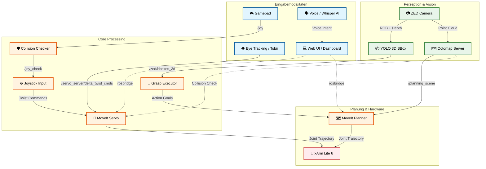
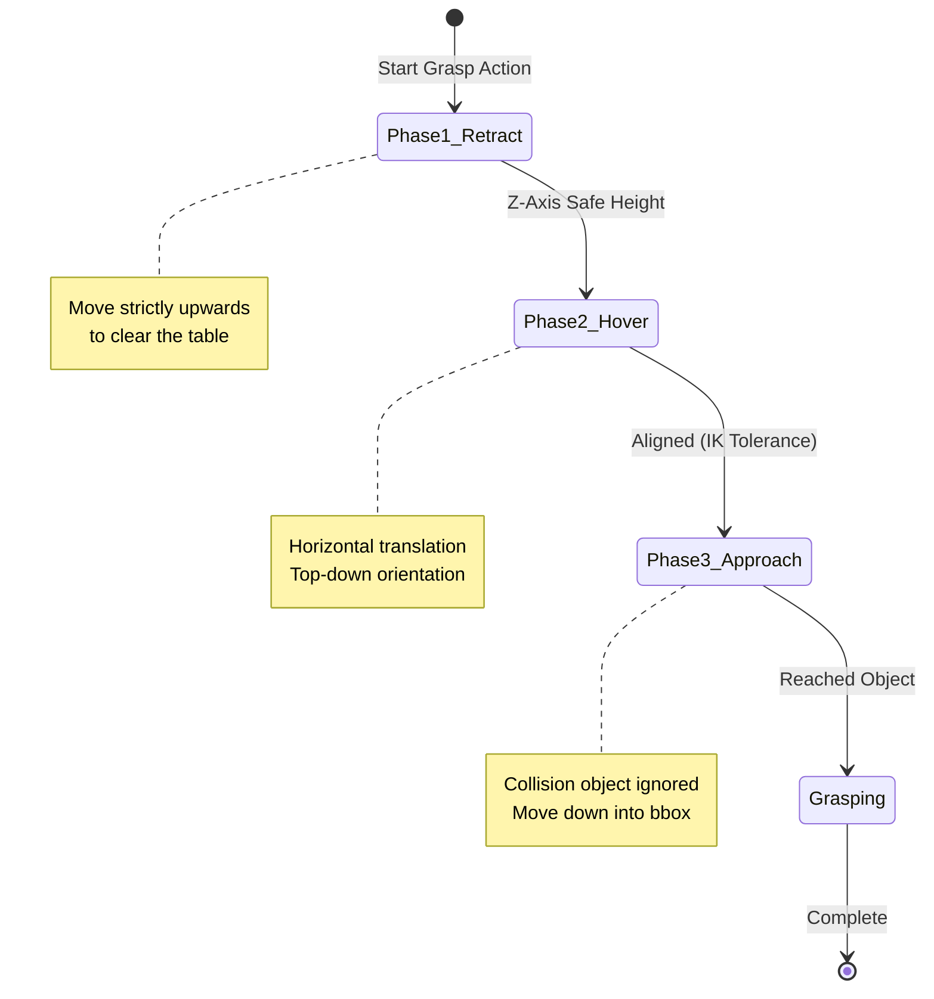
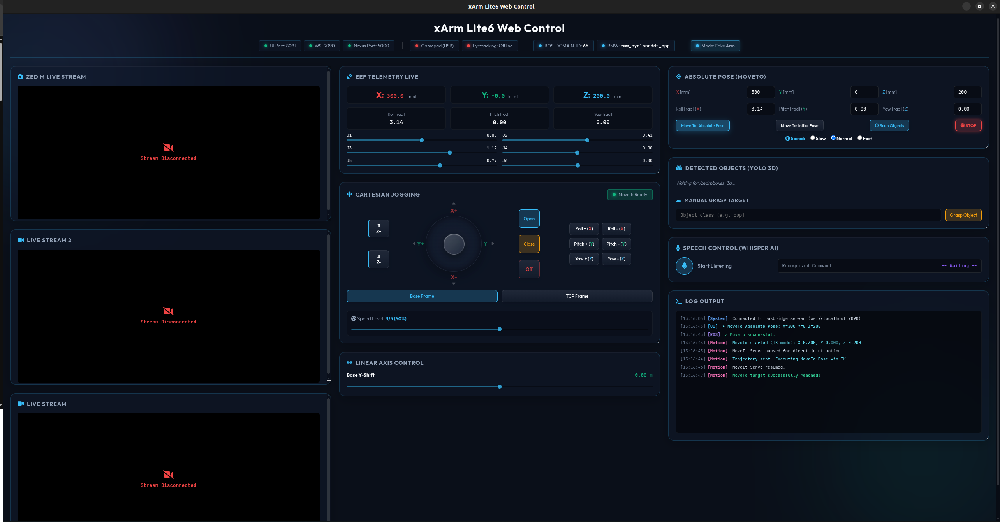
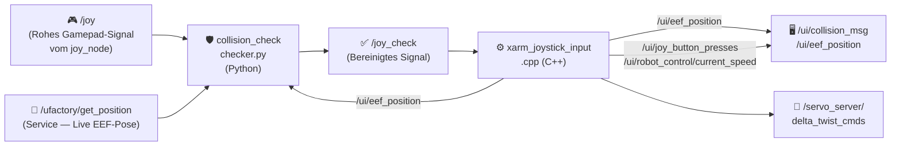
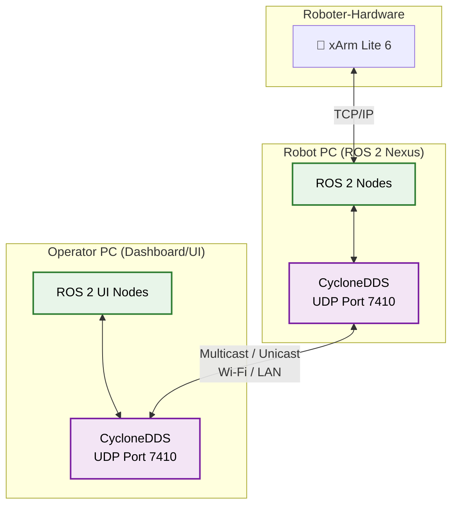

# xArm ROS 2 Extended Workspace (ROS2 Humble) **[MASTER VERSION]**

<p align="center">
  
  &nbsp;&nbsp;&nbsp;
  
  &nbsp;&nbsp;&nbsp;
  
  &nbsp;&nbsp;&nbsp;
  
</p>

<p align="center">
  <a href="README.md">🇬🇧 <b>Read in English / Auf Englisch lesen</b></a>
</p>

Dieses Repository ist eine sich kontinuierlich weiterentwickelnde Forschungs- und Evaluationsplattform für multimodale Teleoperation und Mensch-Computer-Interaktion (HCI). Ziel ist der Abbau technischer Barrieren in der Robotersteuerung durch intuitive Schnittstellen wie Eye-Tracking, Sprachsteuerung, manuelle Feinsteuerung (z. B. über Gamepads oder per Maus in der Web-UI) und assistierende Automatisierung. Ein zentraler Aspekt ist zudem die Bereitstellung moderner grafischer Benutzeroberflächen (GUIs), die komplexe Prozesse zugänglich machen. Basierend auf dem Shared-Control-Paradigma (Mensch und Maschine agieren kooperativ) wird untersucht, wie kognitive Belastungen reduziert und eine gleichberechtigte, inklusive Teilhabe am modernen Arbeitsplatz (Industrie 5.0) technologisch realisiert werden können. <br>
<p align="center">
 
</p>

> [!IMPORTANT]
> **Grundvoraussetzung:** Dieses Repository ist ein *Erweiterungs-Workspace*. Es baut vollständig auf dem offiziellen [xarm_ros2 Repository (Branch: humble)](https://github.com/xArm-Developer/xarm_ros2/tree/humble) von UFactory auf. Das offizielle Repository, dessen Struktur und all seine Systemabhängigkeiten bilden das zwingende Basis-Fundament für diese Software!

<br>

## Inhaltsverzeichnis
1. [📋 Projektübersicht](#1-projektübersicht)
2. [🔬 Architektur & Leitprinzipien](#2-architektur-leitprinzipien)
   - [2.1 Die Systemidee: Eine integrierte Entwicklungs-, Evaluierungs- und Validierungsplattform](#2-1-die-systemidee-eine-integrierte-entwicklungs-evaluierungs-und-validierungsplattform)
3. [⚙️ Core Features & ROS 2 Nodes](#3-core-features-ros-2-nodes)
   - [3.1 Betriebsmodi: FAKE vs. REAL (Hardware Interfaces)](#3-1-betriebsmodi-fake-vs-real-hardware-interfaces)
   - [🎮 3.2 Funktion: Gamepad Teleoperation & Harter Kollisionsschutz](#3-2-funktion-gamepad-teleoperation-harter-kollisionsschutz)
   - [🟢 3.3 Funktion: Autonomes Greifen & 3D Objekterkennung (YOLO / ZED)](#3-3-funktion-autonomes-greifen-3d-objekterkennung-yolo-zed)
   - [🗣️ 3.4 Funktion: Multimodale Interaktion (Sprache & Blicksteuerung)](#3-4-funktion-multimodale-interaktion-sprache-blicksteuerung)
   - [🖥️ 3.5 Funktion: Grafische Steuerung & Visuelles Feedback](#3-5-funktion-grafische-steuerung-visuelles-feedback)
   - [🌌 3.6 Funktion: Digital Twin & Simulation (NVIDIA Isaac Sim)](#3-6-funktion-digital-twin-simulation-nvidia-isaac-sim)

4. [🎮 Gamepad-Steuerung — Technische Tiefenanalyse](#4-gamepad-steuerung-technische-tiefenanalyse)
   - [4.1 Pipeline-Architektur](#4-1-pipeline-architektur)
   - [4.2 `checker.py` — Kollisionswächter (Python Node)](#4-2-checker-py-kollisionswächter-python-node)
   - [4.3 `xarm_joystick_input.cpp` — Motion Controller (C++ Node)](#4-3-xarm_joystick_input-cpp-motion-controller-c-node)
5. [📦 Abhängigkeiten & Voraussetzungen](#5-abhängigkeiten-voraussetzungen)
6. [🚀 Ausführung: Systemstart](#6-ausführung-systemstart)
   - [6.1 Schritt 1: Hardware vorbereiten](#6-1-schritt-1-hardware-vorbereiten)
   - [6.2 Schritt 2: System starten (ROS 2 Nexus)](#6-2-schritt-2-system-starten-ros-2-nexus)
   - [6.3 Schritt 3: Module über die GUI aktivieren](#6-3-schritt-3-module-über-die-gui-aktivieren)
   - [6.4 Netzwerk- & Port-Architektur](#6-4-netzwerk-port-architektur)
   - [6.5 Verteilte Steuerung (Remote / Operator-Station)](#6-5-verteilte-steuerung-remote-operator-station)
   - [6.6 DDS Multicast Storm Prevention & Loopback Discovery (Kritisch)](#6-6-dds-multicast-storm-prevention-loopback-discovery-kritisch)
   - [6.7 Launcher-Konfiguration (`launcher_config.json`)](#6-7-launcher-konfiguration-launcher_config-json)
   - [6.8 CycloneDDS UDP Buffer Overflows (Point Cloud Lag)](#6-8-cyclonedds-udp-buffer-overflows-point-cloud-lag)
7. [📊 Monitoring: Dashboard & Workspace Analyzer](#7-monitoring-dashboard-workspace-analyzer)
   - [7.1 Workspace Analyzer Backend (`workspace_analyzer.py`)](#7-1-workspace-analyzer-backend-workspace_analyzer-py)
   - [7.2 Frontend (`dashboard_index.html`)](#7-2-frontend-dashboard_index-html)
   - [7.3 Startbefehle der UI-Komponenten](#7-3-startbefehle-der-ui-komponenten)
8. [🕹️ Multimodale Technologien & Interaktionskonzepte](#8-multimodale-technologien-interaktionskonzepte)
   - [8.1 Roboter-Steuerungsarten (Inputs)](#8-1-roboter-steuerungsarten-inputs)
   - [8.2 Sensorik & Assistenz (Perception)](#8-2-sensorik-assistenz-perception)
   - [8.4 User Interfaces (UI/GUI)](#8-4-user-interfaces-ui-gui)
9. [🗂️ Repository-Struktur](#9-repository-struktur)
10. [🗄️ Archiv / Veraltete Konzepte](#10-archiv-veraltete-konzepte)


---

<br>

## 1. 📋 Projektübersicht

<br>

### 🎯 Konzept: Eine integrierte, multimodale Teleoperationsplattform
Das primäre Ziel dieses Projekts ist die Entwicklung und Implementierung einer modularen Steuerungs- und Interaktionsplattform für den Roboterarm UFactory xArm Lite 6. Das System bündelt heterogene, multimodale Eingabemethoden in einer zentralisierten Softwareumgebung und legt den Fokus konsequent auf eine maximierte Usability und intuitive Bedienbarkeit. Das System übernimmt die Berechnung der komplizierten Roboterbewegungen im Hintergrund. Dadurch entsteht eine einfache Schnittstelle, die die Wünsche des Nutzers direkt in Aktionen des Roboters übersetzt.

<br>

### 💡 Motivation: Assistenz, Inklusion und Teilhabe im Kontext der Industrie 5.0
Klassische Methoden der Teleoperation und Robotersteuerung sind in der Praxis hochgradig fehleranfällig und fordern vom Operator eine immense kognitive Feinsteuerung sowie technisches Fachwissen. Diese hohen Barrieren schließen viele Menschen von der direkten Nutzung aus. Im Sinne des Leitbildes der Industrie 5.0 – welche den Menschen, die Nachhaltigkeit und die Resilienz in den Mittelpunkt der industriellen Produktion stellt – setzt dieses Projekt genau hier an:

- **Abbau technischer Barrieren:** Reduktion der Einstiegshürden durch die Verlagerung von Low-Level-Gelenkkoordination hin zu intuitiven High-Level-Befehlen.
- **Förderung der Inklusion:** Schaffung technologischer Voraussetzungen, um auch Menschen mit unterschiedlichen physischen oder kognitiven Voraussetzungen eine produktive und gleichberechtigte Teilhabe am modernen Arbeitsplatz zu ermöglichen.
- **Mensch-Maschine-Synergie:** Etablierung des Roboters als assistierendes Werkzeug, das den Menschen entlastet, anstatt ihn zu ersetzen.

<br>

### ⚙️ Funktionsprinzip: Shared Control und das „Human-in-the-Loop“-Paradigma
Das technologische Fundament der Plattform basiert auf einem dynamischen *Shared-Control*-Ansatz, bei dem Mensch und Maschine kooperativ interagieren. Der Nutzer bleibt als Supervisor permanent in den Kontrollkreislauf eingebunden (*Human-in-the-Loop*), steuert das System jedoch über ein abgestuftes, komplementäres Interaktionsmuster:

- **Intuitive High-Level-Befehle:** Initiierung von globalen Aktionen oder Zielvorgaben über natürliche Modalitäten wie Blicksteuerung (Eye-Tracking) oder Sprachbefehle.
- **Präzise Low-Level-Korrekturen:** Nahtloser, latenzfreier Wechsel auf manuelle Eingabegeräte (z. B. Gamepad/MoveIt Servo) für feinfühlige Justierungen im Arbeitsraum.
- **Kontextsensitive Assistenz:** Autonome Pfadplanung und kollisionsfreie Trajektorienberechnung im Hintergrund, um den Operator während der Ausführung aktiv abzusichern.

<br>

### 🏆 Zielsetzung: Ein valider, kosteneffizienter Proof-of-Concept
Das Vorhaben versteht sich als voll funktionsfähiger, reproduzierbarer und ökonomisch erschwinglicher Proof-of-Concept (PoC) für akademische Forschungslandschaften sowie praxisorientierte Inklusionsprojekte. Die offene Architektur dient als standardisierte Evaluierungsplattform, auf deren Basis neuartige assistive Robotiksysteme unter realitätsnahen Bedingungen entwickelt, getestet und empirisch validiert werden können.

<br>

### 📊 Evaluationslogik & Guidelines: Von der Forschung in die industrielle Praxis
Ein wesentlicher Kern und Innovationscharakter des Projekts liegt in der wissenschaftlichen Aufarbeitung der Interaktionsqualität. Das System dient nicht nur als technischer Demonstrator, sondern als Werkzeug zur Generierung übertragbaren Wissens:

- **Entwicklung einer Evaluationslogik:** Systematische Erfassung und Messung von Usability, kognitiver Belastung und Systemperformance zur quantitativen Bewertung der Mensch-Roboter-Schnittstelle.
- **Ableitung von Handlungsempfehlungen:** Formulierung standardisierter Guidelines, die Unternehmen als strategischer Leitfaden bei der Einführung moderner Robotersysteme dienen.
- **Beantwortung der Transformationsfrage:** Konkrete Hilfestellungen für die Praxis auf die Kernfrage: *„Wie können Prozesse und Arbeitsplätze strukturiert werden, um den menschzentrierten Anforderungen der Industrie 5.0 messbar gerecht zu werden?“*
- **Dienstleistungspotenzial:** Die resultierenden Frameworks und Guidelines besitzen das Potenzial, als validierte, monetarisierbare Consulting- und Dienstleistung für die Industrie bereitgestellt zu werden, um den digitalen und demografischen Wandel in der Produktion zu begleiten.


[⬆️ Zurück zum Inhaltsverzeichnis](#inhaltsverzeichnis)

---
<br>

## 2. 🔬 Architektur & Leitprinzipien

---
<br>

### 🗺️ Systemarchitektur & Datenfluss
Das folgende Diagramm veranschaulicht den modularen Aufbau und den asynchronen Datenfluss zwischen Sensorik, UI-Eingaben und den Steuerungskomponenten:




---

### 2.1 Die Systemidee: Eine integrierte Entwicklungs-, Evaluierungs- und Validierungsplattform
Das Kernziel des Projekts ist die Realisierung einer modularen, plattformbasierten Softwarearchitektur für die multimodale Teleoperation und KI-gestützte Assistenzrobotik. Das System fungiert als zentraler, softwareseitiger Integrationsknoten (Middleware-Ebene), der heterogene Teilsysteme in einer einheitlichen Laufzeitumgebung zusammenführt. Durch ein verteiltes Server-Client-Netzwerk (Multi-PC-Setup) und die softwareseitige Kopplung an einen echtzeitfähigen Digitalen Zwilling (NVIDIA Isaac Sim) dient die Plattform sowohl als flexible Entwicklungsumgebung als auch als standardisierte und replizierbare Testumgebung. Das Projekt ist explizit als geschlossener Kreislauf aus Entwicklung und empirischer Validierung konzipiert:

- **Sensorik & Perzeption:** Integration von Tiefenkameras (z. B. Objekterkennung via YOLO, Marker-Tracking) sowie taktilen oder physiologischen Sensoren zur Zustandserfassung.
- **Multimodale Steuerung:** Parallele Einbindung diverser Eingabekanäle wie Eye-Tracking-Systeme zur Blickzielerfassung, Sprachsteuerung (z. B. via OpenAI Whisper) sowie klassische Hardware-Controller (Gamepads, 3D-Mäuse).
- **Kognitive Robotik:** Einbindung moderner Vision-Language-Action-Modelle (VLA), um hochgradig abstrakte, sprachliche und visuelle Befehle direkt in robotische Handlungssequenzen zu übersetzen.
- **Integrierte Datenakquisition:** Zeitsynchrone Aufzeichnung technischer Leistungsparameter und menschlicher Interaktionsdaten über eine zentrale Logging-Infrastruktur während der Systemnutzung.

<br>

### Human-Centered Automation
Die Systemarchitektur stellt den menschlichen Operator ins Zentrum des Interaktionsdesigns. Das System wird so konzipiert, dass Nutzer den aktuellen Automatisierungszustand durchgängig kognitiv erfassen und nachfolgende Systemaktionen antizipieren können. Diese Transparenz bricht algorithmische Black-Box-Strukturen auf, was für den praktischen Einsatz wesentliche Vorteile bringt:

- **Kognitive Transparenz:** Durchgängige Nachvollziehbarkeit der Systemzustände, insbesondere bei der parallelen Verarbeitung von Blickbewegungen und sensorischen Rückmeldungen.
- **Fundierte Intervention:** Befähigung des Operators zu sicheren und gezielten Eingriffen in kritischen oder unvorhergesehenen Interaktionssituationen.
- **Kalibriertes Systemvertrauen:** Schaffung einer verlässlichen technologischen Basis für den systematischen Aufbau von *Trust in Automation*, welcher im Rahmen von Nutzerstudien evaluiert wird.

<br>

### 🤝 Shared Control & Kognitive Entlastung
Ein Kernmerkmal der Softwarearchitektur ist die Implementierung von *Shared-Control*-Paradigmen zur kooperativen Aufgabenbewältigung. Die Plattform ermöglicht einen nahtlosen, latenzarmen Wechsel der Kontrollhoheit zwischen manueller Führung, blickgesteuerten Interaktionen und KI-gestützten, teilautomatisierten Assistenzfunktionen. Die kontextabhängige Aufteilung der Kontrollanteile zielt auf folgende Kernaspekte:

- **Nahtlose Kontrollübergabe:** Latenzarmer Wechsel zwischen manueller Eingabe (z. B. via MoveIt Servo / Gamepad) und autonomen Systemaktionen (z. B. blickbasiertes Greifen).
- **Minimierung des Mental Workload:** Gezielte Reduktion der mentalen Arbeitsbelastung des Nutzers während komplexer oder langandauernder Manipulationsaufgaben.
- **Autonome Fehlerkompensation:** Selbstständiges Abfangen fehleranfälliger Low-Level-Korrekturen durch das System, wodurch kognitive Ressourcen für die übergeordnete Prozessüberwachung freigesetzt werden.
- **Empirische Validierung:** Laufende Überprüfung der tatsächlichen kognitiven Entlastung im Projektverlauf über standardisierte psychometrische Verfahren.

<br>

### 📈 HCI & Usability Fokus & Empirische Evaluation
Die Gestaltung der zentralen Steuerungsschnittstelle (GUI) folgt etablierten Prinzipien der Mensch-Computer-Interaktion (HCI). Die Interaktionsmuster verschieben sich von der komplexen Koordination einzelner Freiheitsgrade oder dem manuellen Aufrufen verteilter Terminal-Prozesse hin zu einer intentionsbasierten Aufgabenbewältigung. Ein integraler Bestandteil des Projekts ist die Durchführung systematischer Benutzerstudien zur Evaluierung dieser multimodalen Schnittstellen:

- **Intentionsbasierte Steuerung:** Übersetzung abstrakter Handlungsabsichten (per Sprache, Blickziel oder High-Level-Controller) in präzise kinematische Trajektorien.
- **Standardisierte Usability-Metriken:** Erhebung der subjektiven Gebrauchstauglichkeit über etablierte Fragebögen wie die *System Usability Scale* (SUS).
- **Objektive Leistungsparameter:** Messung von quantitativen Faktoren wie *Task Completion Time*, Fehlerraten und spezifischen Blickbewegungspfaden.
- **Beanspruchungsanalyse:** Empirische Absicherung der kognitiven Belastung der Probanden unter Verwendung des *NASA-TLX*-Index zur iterativen Systemoptimierung.

<br>

### 🔓 Reproduzierbar & Open Source
Zur Gewährleistung wissenschaftlicher Validität ist das Projekt als Open-Source-Architektur angelegt. Die Offenlegung der vollständigen Codebasis sichert die methodische Transparenz aller Algorithmen, Konfigurationen und Datenflüsse. Für die wissenschaftliche Gemeinschaft ergeben sich daraus zentrale Mehrwerte:

- **Methodische Transparenz:** Vollständige Einsehbarkeit aller zugrundeliegenden Algorithmen, URDF-Modelle und MoveIt-Konfigurationen.
- **Exakte Replikation:** Ermöglichung unkomplizierter Zweituntersuchungen durch unabhängige Forschungsgruppen unter identischen Bedingungen.
- **Statistische Verifizierbarkeit:** Nachvollziehbarkeit und Validierung komplexer, aufgezeichneter Sensordatenströme und Steuerungseingaben.
- **Standardisierte Benchmark:** Etablierung der Plattform als verlässliche Vergleichsbasis für komparative Studien im Bereich der Assistenz- und Inklusionsrobotik.

<br>

### Kosteneffiziente Hardware
Die Systemkonfiguration basiert primär auf ökonomisch erschwinglichen, kommerziell verfügbaren Komponenten (COTS), ohne die erforderliche Präzision und funktionale Zuverlässigkeit zu kompromittieren. Dieser Ansatz verfolgt klare strategische Ziele:

- **Demokratisierung des Zugangs:** Reduktion investiver und finanzieller Barrieren beim Einstieg in moderne, multimodal gesteuerte Robotiktechnologien.
- **Zielgruppen-Transfer:** Erleichterter Technologietransfer in inklusive Projekte, Bildungseinrichtungen und kleinere Forschungseinrichtungen (z. B. über den UFactory xArm Lite 6 und Consumer-Controller).
- **Validierung der Verlässlichkeit:** Gezielte wissenschaftliche Evaluierung, inwieweit kosteneffiziente Hardware im direkten Vergleich zu hochpreisigen Industriesystemen eine valide Forschungsplattform darstellt.

<br>

### Modular & Industrie-Standard
Die softwareseitige Infrastruktur ist modular gekapselt und vollständig in das Middleware-Framework ROS 2 Humble integriert. Die native Nutzung standardisierter Kommunikationsprimitive sichert die Interoperabilität mit industriellen Ökosystemen. Das konsequente Baukastenprinzip bietet entscheidende architektonische Vorteile:

- **Native ROS 2-Kommunikation:** Volle Kompatibilität mit etablierten Ökosystemen (wie MoveIt 2) und modernen Sensor-SDKs über Nodes, Topics, Services und Actions.
- **Isolierte Subsystem-Kapselung:** Unkomplizierter Austausch oder Erweiterung einzelner Module – wie z.B. VLA-Pipelines zur Intentionserkennung oder spezifischer Eye-Tracking-Treiber.
- **Zukunftssicherheit & Portierbarkeit:** Wartungsfreundliche Softwarestruktur, die eine einfache Migration auf zukünftige ROS 2 LTS-Distributionen ohne Modifikation der Gesamtplattform erlaubt.


[⬆️ Zurück zum Inhaltsverzeichnis](#inhaltsverzeichnis)

---

<br>

## 3. ⚙️ Core Features & ROS 2 Nodes

Um ein klares Verständnis für die Architektur zu schaffen, sind die Software-Module nach ihren funktionalen **Features (Use-Cases)** gegliedert. Jedes Modul ist dabei explizit als ROS 2 Node, Skript oder Plugin gekennzeichnet.


---
<br>

### 3.1 Betriebsmodi: FAKE vs. REAL (Hardware Interfaces)
Die Plattform unterscheidet strikt zwischen zwei Betriebsmodi für den Roboterarm. Diese Unterscheidung bezieht sich **ausschließlich auf das `ros2_control` Hardware Interface** und ist unabhängig von der Sensorik (wie Kamera oder YOLO, welche in beiden Modi live laufen können):

-blue?style=for-the-badge)<br>
Der Roboter läuft über das `mock_components/GenericSystem` (bzw. FakeSystem) Hardware Interface innerhalb von `ros2_control`. Es gibt keine physische Controller-Verbindung. Befehle an den `/lite6_traj_controller` oder `/servo_server` werden rein virtuell in RViz2 gerendert, indem die Joint States gespiegelt werden. Proprietäre UFactory API-Calls (wie Mode/State-Switches) laufen in diesem Modus absichtlich ins Leere oder werden softwareseitig ge-bypassed.

-red?style=for-the-badge)<br>
Das `ros2_control` Framework bindet das echte `xarm_api` Hardware Interface ein, welches via TCP/IP direkt mit dem physischen Controller des xArm Lite 6 kommuniziert. In diesem Modus greifen Hardware-Limits, physische Sicherheits-Stopps und die exklusive Umschaltung der proprietären xArm Hardware-Modi (z. B. Mode 0 für Pose-Steuerung vs. Mode 1 für Servo/Jogging) über die UFactory API.

> [!NOTE]
> **Virtuelle Linearachse (Nur Simulation):** Im FAKE-Modus kann der Roboter auf einer simulierten Linearachse bewegt werden, ohne die MoveIt-Planungsgruppe (`lite6`) zu beeinflussen.
> - **Aktivierung:** Die Nexus Web App startet die Linearachse beim Klick auf den Button **RUN DEV Setup (FAKE)** automatisch mit. Bei manuellem Start muss der Parameter `attach_to:=linear_axis_link` an den Launch-Befehl angehängt werden.
> - **Steuerung:** Der GUI-Slider (`ros2 run linear_axis_tuner linear_axis_tuner`) öffnet sich automatisch, um die Basis horizontal zu verfahren.
> - **MoveIt-Architektur:** Die Achse wird rein über dynamisches TF (`world` -> `linear_axis_link`) verschoben und nicht als URDF-Joint in die Kinematik aufgenommen. Dadurch weiß MoveIt (dank TF) automatisch, wo der Roboter steht, ohne dass ein 7-DoF IK-Solver benötigt wird.
> - **URDF Modifikation:** Um Fehler beim Parsen von dynamischen `attach_to`-Argumenten zu vermeiden, wurde `xarm_description/urdf/xarm_device_macro.xacro` angepasst. Die Bedingung für `create_attach_link` generiert nun einen Root-Link für *jeden* übergebenen String und nicht mehr exklusiv nur für `"world"`.

---

### 3.2 Funktion: Gamepad Teleoperation & Harter Kollisionsschutz
*Dieses Subsystem steuert das manuelle Jogging des Roboters per Xbox-Controller und verhindert aktiv, dass der Roboter durch Bedienfehler mit der Arbeitsfläche kollidiert.*


---

<br>

####  `xarm_joystick_input.cpp` &nbsp;&nbsp; <sub><i>[`/src/xarm_ros2/xarm_moveit_servo/src/xarm_joystick_input.cpp`](./src/xarm_ros2/xarm_moveit_servo/src/xarm_joystick_input.cpp)</i></sub>
> [!NOTE]
> **Zweck & Aufgabe:** Übersetzt die bereinigten Gamepad-Signale (Analog-Sticks & Trigger) in kartesische Geschwindigkeitsbefehle (`TwistStamped`) für MoveIt Servo. Wendet exponentielles Smoothing an und steuert alle Button-Mappings.
>
> **🎮 Controller-Belegung (Quick Reference):**
>> | Eingabe | Aktion | Details |
>> | :--- | :--- | :--- |
>> | **Linker Stick** (↕️/↔️) | **Verfahren (X / Y)** | *Bewegt den Roboter vor/zurück (X) und links/rechts (Y)* |
>> | **LT / RT** (Trigger) | **Heben/Senken (Z)** | *Bewegt den Roboterarm auf/ab* |
>> | **LB / RB** (Bumper) | **Rotieren (Yaw)** | *Dreht den Endeffektor um die eigene Achse* |
>> | **D-Pad** (↕️) | **Speed Control** | *Schaltet 5 Geschwindigkeitsstufen durch* |
>> | **D-Pad** (↔️) | **Linearachse** | *Bewegt den Roboter auf der Schiene (Base Y-Shift)* |
>> | **START / BACK** | **Referenzrahmen** | *Wechselt zwischen Basis- (`link_base`) und Werkzeug-Koordinaten (`link_tcp`)* |
>> | **A-Taste** (🟢) | **Vakuumgreifer** | *Schaltet das Vakuum an / aus* |
>> | **B-Taste** (🔴) | **Not-Aus (Greifer)** | *Stoppt den Vakuumgreifer sofort* |
>> | **X-Taste** (🔵) | **Mikrofon (Voice)** | *Startet/Stoppt die Aufnahme für Whisper AI* |
>> | **Y-Taste** (🟡) | **Initialpose** | *Fährt den Roboter in die sichere Startposition* |
>
>
> 
>
>> | Topic / Interface | Msg Type | Beschreibung |
>> |---|---|---|
>> | **`/joy_check`** | `sensor_msgs/Joy` | *Liest die vom Wächter-Node bereinigten Controller-Inputs.* |
>
>
> 
>
>> | Topic / Interface | Msg Type | Beschreibung |
>> |---|---|---|
>> | **`/servo_server/delta_twist_cmds`** | `geometry_msgs/TwistStamped` | *Sendet berechnete kartesische Geschwindigkeiten an den Servo Server.* |
>> | **`/ui/eef_position`** | `std_msgs/Float32MultiArray` | *Publiziert mit 10 Hz die Live-Pose (X, Y, Z) für das Web-UI.* |
>
>
> 
>
>> | Topic / Interface | Msg Type | Beschreibung |
>> |---|---|---|
>> | *-* | *-* | *Hört auf die aktuelle TCP-Position (`link_base` -> `link_tcp`).* |
>
>
> 
>
>> | Topic / Interface | Msg Type | Beschreibung |
>> |---|---|---|
>> | **`/servo_server/start_servo`** | Client | *Startet die MoveIt Servo-Engine.* |
>> | **`/servo_server/stop_servo`** | Client | *Stoppt die MoveIt Servo-Engine sicher.* |
>> | **`/servo_server/switch_command_type`** | Client | *Wechselt den Eingabemodus des Servo-Servers (z.B. Twist zu Joint).* |
>
>


---

<br>

####  `checker.py` (`collision_check`) &nbsp;&nbsp; <sub><i>[`/src/collision_check/collision_check/checker.py`](./src/collision_check/collision_check/checker.py)</i></sub>
> [!NOTE]
> **Zweck & Aufgabe:** Sitzt als Wächter *vor* der Bewegungsübersetzung. Berechnet prädiktiv (0,1 Sek. in die Zukunft) die Z-Koordinate. Würde der Roboter den Tisch berühren, wird der Abwärtsbefehl des Controllers hart überschrieben und blockiert. Löst das Rumble-Feedback (Vibration) des Gamepads aus.
>
>
> 
>
>> | Topic / Interface | Msg Type | Beschreibung |
>> |---|---|---|
>> | **`/joy`** | `sensor_msgs/Joy` | *Liest den rohen, unbearbeiteten Gamepad-Input.* |
>> | **`/servo_server/status`** | `std_msgs/Int8` | *Überwacht Status-Codes des Servo-Servers.* |
>> | **`/ui/eef_position`** | `std_msgs/Float32MultiArray` | *Bezieht die aktuelle Z-Höhe für den prädiktiven Kollisions-Check.* |
>
>
> 
>
>> | Topic / Interface | Msg Type | Beschreibung |
>> |---|---|---|
>> | **`/joy_check`** | `sensor_msgs/Joy` | *Leitet den auf Kollisionen geprüften Controller-Befehl weiter.* |
>> | **`/ui/collision_msg`** | `std_msgs/String` | *Meldet harte Stopps an das UI-Log.* |
>
>
> 
>
>> | Parameter | Standardwert | Beschreibung |
>> |---|---|---|
>> | `look_ahead_time` | `0.1` | *Prädiktionshorizont (Sekunden) für die Geschwindigkeits-Vorausschau.* |
>> | `table_z_threshold` | `0.0` | *Die harte Tischbarriere auf der Z-Achse (World-Frame).* |
>
>


---

<br>

####  `xarm_moveit_servo` &nbsp;&nbsp; <sub><i>[`/src/xarm_ros2/xarm_moveit_servo`](./src/xarm_ros2/xarm_moveit_servo)</i></sub>
> [!NOTE]
> **Zweck & Aufgabe:** Die Echtzeit-Bewegungs-Engine von MoveIt. Reagiert auf dynamische Hindernisse (YOLO-Boxen) über einen `threshold_distance` Parameter und stoppt den Arm, bevor er mit Objekten kollidiert.
>
>
> 
>
>> | Topic / Interface | Msg Type | Beschreibung |
>> |---|---|---|
>> | **`/servo_server/delta_twist_cmds`** | `geometry_msgs/TwistStamped` | *Liest die kartesischen Geschwindigkeitsbefehle.* |
>> | **`/planning_scene`** | `moveit_msgs/PlanningScene` | *Liest die aktuelle 3D-Kollisionsszene zur Hindernisvermeidung ein.* |
>
>
> 
>
>> | Topic / Interface | Msg Type | Beschreibung |
>> |---|---|---|
>> | **`/lite6_traj_controller/joint_trajectory`** | `trajectory_msgs/JointTrajectory` | *Sendet validierte Gelenktrajektorien an den Roboter.* |
>
>
>  **(`xarm_moveit_servo_config.yaml`)**
>
>> | Parameter | Standardwert | Beschreibung |
>> |---|---|---|
>> | `collision_check_type` | `stop_distance` | *Sorgt für ein weiches, geschwindigkeitsabhängiges Abbremsen (Vorwarnung ab ca. 5cm) anstatt eines abrupten Stopps an der Grenze. Bei 2 cm Abstand greift der finale Not-Stopp (`min_allowable_collision_distance: 0.02`).* |
>> | `collision_distance_safety_margin` | `0.02` | *Definiert die 2 cm breite, unsichtbare Kollisionsblase um den Roboter.* |
>
>


---

### 3.3 Funktion: Autonomes Greifen & 3D Objekterkennung (YOLO / ZED)
*Dieses Subsystem ist dafür verantwortlich, Objekte im 3D-Raum zu lokalisieren, virtuelle Hindernisse zu generieren und den Roboter gezielt an das Objekt heranzuführen.*


---

<br>

####  `zed_wrapper` &nbsp;&nbsp; <sub><i>[`/src/zed-ros2-wrapper`](./src/zed-ros2-wrapper)</i></sub>
> [!NOTE]
> **Zweck & Aufgabe:** Der native Hardware-Treiber der Stereolabs ZED Mini Kamera. 
>
>
> 
>
>> | Topic / Interface | Msg Type | Beschreibung |
>> |---|---|---|
>> | **`/zed/zed_node/rgb/image_rect_color`** | `sensor_msgs/Image` | *Publiziert das 2D-RGB-Kamerabild.* |
>> | **`/zed/zed_node/depth/depth_registered`** | `sensor_msgs/Image` | *Publiziert die registrierte Tiefenkarte (Depth-Map).* |
>> | **`/zed/zed_node/point_cloud/cloud_registered`** | `sensor_msgs/PointCloud2` | *Publiziert die dichte 3D-Punktwolke.* |
>
>
>  **(`zed_cam_rviz_pointcloud_tf_yolo_planned_grasp.launch.py`)**
>
>> | Parameter | Standardwert | Beschreibung |
>> |---|---|---|
>> | `depth_mode` | `ULTRA` | *Erzwingt die maximal dichte 3D-Punktwolke für saubere Kantenberechnung.* |
>> | `auto_exposure` | `True` | *Erlaubt den automatischen Helligkeitsausgleich für robuste YOLO Erkennung.* |
>
>


---

<br>

####  `zed_yolo_3d_bbox.py` &nbsp;&nbsp; <sub><i>[`/src/my_3d_vision_bringup/scripts/zed_yolo_3d_bbox.py`](./src/my_3d_vision_bringup/scripts/zed_yolo_3d_bbox.py)</i></sub>
> [!NOTE]
> **Zweck & Aufgabe:** Verarbeitet parallel den RGB- und Depth-Stream mit GPU-Beschleunigung und dem **YOLOv8 Large** Modell. Isoliert Objekte, filtert Tiefenrauschen und berechnet millimetergenaue, auf die Tischebene geerdete 3D-Bounding-Boxen (inklusive Greifpunkt-Marker). Nutzt einen **robusten Oberflächen-Projektionsalgorithmus** (filtert die unteren 20% der Punkte heraus, um Tisch-Rauschen zu ignorieren), um die Bounding-Boxen exakt auf das tatsächliche physikalische Volumen der Objekte zu zentrieren, unabhängig vom Kamerawinkel. Nutzt ein **Dictionary-basiertes EMA-Tracking-System** mit persistenten, globalen IDs und einem engen 10cm-Distanz-Threshold, um ID-Swapping und Boxen-Jittering zwischen nah beieinander stehenden Objekten zu verhindern. Erkennt das System mehrere Objekte derselben Klasse, werden diese zur eindeutigen Identifikation dauerhaft durchnummeriert (z.B. `cup_1`, `cup_2`).
>
>
> 
>
>> | Topic / Interface | Msg Type | Beschreibung |
>> |---|---|---|
>> | **`/zed/zed_node/rgb/image_rect_color`** | `sensor_msgs/Image` | *Bezieht das RGB-Bild für die YOLO-Erkennung.* |
>> | **`/zed/zed_node/depth/depth_registered`** | `sensor_msgs/Image` | *Nutzt die Tiefenwerte für die 3D-Projektion.* |
>> | **`/zed/zed_node/rgb/camera_info`** | `sensor_msgs/CameraInfo` | *Liest Kamera-Intrinsics zur exakten Koordinatenberechnung.* |
>
>
> 
>
>> | Topic / Interface | Msg Type | Beschreibung |
>> |---|---|---|
>> | **`/zed/bboxes_3d`** | `visualization_msgs/MarkerArray` | *Sendet die fertigen 3D-Boxen zur Visualisierung an RViz und Nodes.* |
>
>
> 
>
>> | Parameter | Standardwert | Beschreibung |
>> |---|---|---|
>> | `class_dimension_overrides` | *Benutzerdefiniert* | *Hinterlegt feste metrische Dimensionen (x,y,z) für spezifische Objekte, um sicherzustellen, dass die Box das echte physikalische Volumen umschließt.* |
>> | `percentiles` | `[0.5, 99.5]` | *Schneidet extreme Tiefen-Rausch-Pixel ("Flying Pixels" an Objektkanten) hart ab, während echte Kanten erhalten bleiben.* |
>> | `ema_alpha` | `0.2` | *Glättungsfaktor (Exponential Moving Average), um Boxen-Jittering zwischen Frames sicher zu eliminieren.* |
>
>


---

<br>

####  `pointcloud_optimizer.py` &nbsp;&nbsp; <sub><i>[`/src/my_3d_vision_bringup/scripts/pointcloud_optimizer.py`](./src/my_3d_vision_bringup/scripts/pointcloud_optimizer.py)</i></sub>
> [!NOTE]
> **Zweck & Aufgabe:** Läuft aktiv im Hintergrund während des 3D Vision Bringups. Fängt die rohe ZED-Punktwolke ab und transformiert das Koordinatensystem vom optischen Frame (`Z=vorwärts`) in den Standard-ROS-Frame (`X=vorwärts`), wobei RGB-Daten erhalten bleiben.
>
>
> 
>
>> | Topic / Interface | Msg Type | Beschreibung |
>> |---|---|---|
>> | **`/zed/zed_node/point_cloud/cloud_registered`** | `sensor_msgs/PointCloud2` | *Empfängt die rohe Punktwolke direkt von der ZED-Kamera.* |
>
>
> 
>
>> | Topic / Interface | Msg Type | Beschreibung |
>> |---|---|---|
>> | **`/zed/zed_node/point_cloud/cloud_optimized`** | `sensor_msgs/PointCloud2` | *Publiziert die in den ROS-Standard-Frame transformierte Punktwolke.* |
>
>


---

<br>

####  `yolo_moveit_collision.py` &nbsp;&nbsp; <sub><i>[`/src/my_3d_vision_bringup/scripts/yolo_moveit_collision.py`](./src/my_3d_vision_bringup/scripts/yolo_moveit_collision.py)</i></sub>
> [!NOTE]
> **Zweck & Aufgabe:** Wandelt die erkannten 3D-Boxen nahtlos in dynamische MoveIt `CollisionObject`-Nachrichten um. Statt eines massiven Blocks wird eine **nach oben offene Becher-Form** (5 hauchdünne Wände à 1 mm) in den Planungsraum eingefügt. Dies erlaubt dem Greifer ein ungehindertes Eintauchen von oben (für Top-Down-Grasps), blockiert aber seitliche Kollisionen sicher.
>
>
> 
>
>> | Topic / Interface | Msg Type | Beschreibung |
>> |---|---|---|
>> | **`/zed/bboxes_3d`** | `visualization_msgs/MarkerArray` | *Liest die Objektkoordinaten als Ziel für den Greifpfad.* — *Liest die erkannten 3D-Bounding-Boxen aus.* |
>
>
> 
>
>> | Topic / Interface | Msg Type | Beschreibung |
>> |---|---|---|
>> | **`/planning_scene`** | `moveit_msgs/PlanningScene` | *Injiziert virtuelle Objekte (Becher-Formen) in die Planungs-Szene.* |
>

---

<br>

####  `octomap_server`
> [!NOTE]
> **Zweck & Aufgabe:** Dynamische 3D-Umgebungskartierung. Generiert in Echtzeit eine voxelbasierte Kollisionskarte (OctoMap) direkt aus der ZED-Punktwolke. Dadurch kann MoveIt arbiträre, nicht von YOLO erkannte Hindernisse (z. B. menschliche Hände, Werkzeuge) bei der Bahnplanung und im Servo-Betrieb sicher umfahren.
>  * 🛠️ **Aktivierung:** Im Basis-Repository (`src/xarm_ros2/xarm_moveit_config/launch/_robot_moveit_common.launch.py`) wird die OctoMap über das Dictionary `sensor_manager_parameters` (mit Parametern wie `octomap_resolution: 0.03` und `ros.point_cloud_topic`) konfiguriert und dem `move_group_node` übergeben.
>
>
> 
>
>> | Topic / Interface | Msg Type | Beschreibung |
>> |---|---|---|
>> | **`/zed/zed_node/point_cloud/cloud_optimized`** | `sensor_msgs/PointCloud2` | *Liest die Punktwolke zur Voxel-Generierung ein.* |
>
>
> 
>
>> | Topic / Interface | Msg Type | Beschreibung |
>> |---|---|---|
>> | **`/planning_scene`** | `moveit_msgs/PlanningScene` | *Integriert die generierte OctoMap nativ in die Kollisionswelt.* |
>
> 
>


---

<br>

####  `yolo_planned_grasp_executor.py` &nbsp;&nbsp; <sub><i>[`/src/my_3d_vision_bringup/scripts/yolo_planned_grasp_executor.py`](./src/my_3d_vision_bringup/scripts/yolo_planned_grasp_executor.py)</i></sub>
> [!NOTE]
> **Zweck & Aufgabe:** Die zentrale Steuerungslogik der autonomen Greif-Pipeline. Liest das UI-Feld ("Grasp Object") aus, holt sich die YOLO-Koordinaten und orchestriert eine robuste **Kollisionsfreie 3-Phasen Greif-Sequenz**:
>   - **Phase 1 (Retract):** Fährt den Arm von seiner aktuellen Position exakt nach oben, um eine sichere Überflughöhe zu erreichen.
>   - **Phase 2 (Hover):** Bewegt sich horizontal auf der sicheren Z-Höhe (15cm) exakt über das Zielobjekt. Erzwingt dabei eine strikte Top-Down Orientierung (gerade nach unten) und nutzt sehr enge IK-Toleranzen (5mm Position, 0.001 rad Neigung) für millimetergenaue Ausrichtung.
>   - **Phase 3 (Approach):** Schaltet das anvisierte Objekt kurzzeitig über `/ui/ignore_collision_object` in der globalen MoveIt Kollisionsszene ab, damit der Greifer physisch in die Bounding Box eindringen kann, ohne einen Not-Aus auszulösen, und fährt dann nach unten.
>
>



> 
>
>> | Parameter | Standardwert | Beschreibung |
>> |---|---|---|
>> | `velocity_scaling` | `0.2` | *Skaliert die Geschwindigkeit für extrem weiche und vorhersehbare Roboterbewegungen während der Greifsequenz.* |
>> | `acceleration_scaling` | `0.1` | *Skaliert die Beschleunigung für extrem weiche und vorhersehbare Roboterbewegungen während der Greifsequenz.* |
>
>
> 
>
>> | Topic / Interface | Msg Type | Beschreibung |
>> |---|---|---|
>> | **`/zed/bboxes_3d`** | `visualization_msgs/MarkerArray` | *Liest die Objektkoordinaten als Ziel für den Greifpfad.* |
>
>
> 
>
>> | Topic / Interface | Msg Type | Beschreibung |
>> |---|---|---|
>> | **`/ui/grasp_status`** | `std_msgs/String` | *Sendet Fortschrittsmeldungen an das RViz Control Panel.* |
>> | **`/ui/ignore_collision_object`** | `std_msgs/String` | *Schaltet Objekte temporär kollisionsfrei.* |
>> | **`/planning_scene`** | `moveit_msgs/PlanningScene` | *Deaktiviert temporär Objekte in der MoveIt-Szene.* |
>
>
> 
>
>> | Topic / Interface | Msg Type | Beschreibung |
>> |---|---|---|
>> | **`/ui/grasp_object`** | `my_3d_vision_msgs/action/GraspObject` | *Action-Endpunkt zum Starten des Greif-Ablaufs.* |
>
>
> 
>
>> | Topic / Interface | Msg Type | Beschreibung |
>> |---|---|---|
>> | **`/compute_ik`** | Client | *Prüft via MoveIt, ob die Zielpose mathematisch erreichbar ist.* |
>> | **`/move_action`** | Client | *Sendet den Trajektorienplan an MoveIt zur Ausführung.* |
>> | **`/ui/execute_move_to_pose`** | Client | *Nutzt MoveIt Servo als Fallback-Bewegung.* |
>
>


---

<br>

####  `grasp_action_bridge.py` &nbsp;&nbsp; <sub><i>[`/src/my_3d_vision_bringup/scripts/grasp_action_bridge.py`](./src/my_3d_vision_bringup/scripts/grasp_action_bridge.py)</i></sub>
> [!NOTE]
> **Zweck & Aufgabe:** Übersetzer-Node zwischen dem RViz Control Panel und dem Action Server. Nimmt den simplen String des Zielobjekts aus dem UI entgegen und wandelt ihn in ein blockierungsfreies ROS 2 Action Goal um.
>
>
> 
>
>> | Topic / Interface | Msg Type | Beschreibung |
>> |---|---|---|
>> | **`/ui/grasp_object_cmd`** | `std_msgs/String` | *Empfängt den String-Befehl aus dem UI.* |
>
>
> 
>
>> | Topic / Interface | Msg Type | Beschreibung |
>> |---|---|---|
>> | **`/ui/grasp_object`** | `my_3d_vision_msgs/action/GraspObject` | *Ruft den Grasp Action Server auf.* |
>

---

<br>

####  `zed_stand_publisher.py`
> [!NOTE]
> **Zweck & Aufgabe:** Generiert mathematisch exakt das 3D-Modell des Kamerastativs (Aluminiumprofil) und publiziert dieses statisch in RViz.
>
>
> 
>
>> | Topic / Interface | Msg Type | Beschreibung |
>> |---|---|---|
>> | **`/zed_stand_marker`** | `visualization_msgs/Marker` | *Publiziert das visuelle 3D-Modell des Stativs.* |
>
>


---

<br>

####   `tf_tuner` &nbsp;&nbsp; <sub><i>[`/src/tf_tuner`](./src/tf_tuner)</i></sub>
> [!NOTE]
> **Zweck & Aufgabe:** Ein dediziertes ROS 2 Paket, das ein Live-Tuner Interface (PyQt5) bereitstellt, um dynamisch Kamera-Offsets (Punktwolke) sowie die Positionierung interaktiver 3D-Szenelemente (Würfel, Rechteck, Zylinder, Weiße Plane) und einer anpassbaren **Safety Zone** (mit einstellbarem Radius) in RViz ohne Neustart zu justieren.
>
>
> 
>
>> | Topic / Interface | Msg Type | Beschreibung |
>> |---|---|---|
>> | **`/tf`** | `tf2_msgs/TFMessage` | *Aktualisiert dynamisch die TF-Broadcaster-Werte für Objekte.* |
>> | **`/ui/safety_zone_params`** | `std_msgs/Float32MultiArray` | *Publiziert Parameter der Safety Zone.* |
>
>


---
<br>

### 3.4 Funktion: Multimodale Interaktion (Sprache & Blicksteuerung)
*Diese experimentellen Module erlauben die "Hands-Free"-Steuerung des Systems.*


---

<br>

####  `ros2_whisper` &nbsp;&nbsp; <sub><i>[`/src/ros2_whisper`](./src/ros2_whisper)</i></sub>
> [!NOTE]
> **Zweck & Aufgabe:** Lokale Speech-to-Text KI. Führt Whisper AI kontinuierlich auf dem Mikrofon-Stream aus und publiziert gesprochene Wörter als Text.
> - **GPU-Beschleunigung & Modell-Optimierung:** Die Inference-Pipeline ist nativ für **GPU-Beschleunigung (CUDA)** optimiert und nutzt das dedizierte `base.en` Modell. Dies garantiert eine latenzfreie "High-Performance" Ausführung von Sprachbefehlen und verhindert Runtime-Timeouts.
> - **Performance & Thread-Sicherheit:** Der zugrundeliegende C++ Action Server (`TranscriptManager`) wurde mit einem strikten `std::mutex`-Locking Mechanismus abgesichert, um parallele Data-Race-Abstürze bei hochfrequenter Token-Generierung vollständig zu eliminieren. Zudem verfügt die `Inference`-Node über eine gehärtete Puffer-Löschstrategie (`audio_ring_->clear()`), die alte Audio-Reste exakt in der Millisekunde aus dem Ring-Puffer physisch entfernt, in der der Nutzer den UI-Button drückt. Dies garantiert mathematisch, dass keine "Geisterkommandos" aus vorherigen Sprachaufnahmen versehentlich ausgeführt werden.
>
>
> 
>
>> | Topic / Interface | Msg Type | Beschreibung |
>> |---|---|---|
>> | **`/whisper/text`** | `std_msgs/String` | *Publiziert das finale, erkannte Sprachtranskript.* |
>
>


---

<br>

####  `audio_listener.py` &nbsp;&nbsp; <sub><i>[`/src/ros2_whisper/audio_listener/audio_listener/audio_listener.py`](./src/ros2_whisper/audio_listener/audio_listener/audio_listener.py)</i></sub>
> [!NOTE]
> **Zweck & Aufgabe:** Verarbeitet Mikrofoneingaben für das Sprachsteuerungssystem. Beinhaltet eine automatische, systembewusste Fallback-Logik, die explizit nach den System-Standard-Audiogeräten `pulse` oder `default` sucht und diese priorisiert, um eine zuverlässige Sprachaufzeichnung über verschiedene Hardware-Umgebungen hinweg zu garantieren.
>
>

---

<br>

####  `voice_command_listener.py` &nbsp;&nbsp; <sub><i>[`/src/voice_command_listener/voice_command_listener/voice_command_listener.py`](./src/voice_command_listener/voice_command_listener/voice_command_listener.py)</i></sub>
> [!NOTE]
> **Zweck & Aufgabe:** Analysiert den diskreten, einzeln getriggerten Rohtext über exakte Regex-Muster und extrahiert die vom Nutzer definierten Handlungs-Intents (d.h. "Move to Absolute Pose", "Move to Initial Pose", "Faster", "Slower", "Scan Objects"). Enthält eine hohe Toleranz für ähnlich klingende Whisper-Erkennungen (z.B. "pause" oder "power" als "pose"). Implementiert eine robuste **3-Stufen-Deduplikations-Zustandsmaschine**, die eine exakt einmalige Befehlsausführung garantiert.
>
>
> 
>
>> | Topic / Interface | Msg Type | Beschreibung |
>> |---|---|---|
>> | **`/whisper/inference`** | `whisper_idl/Inference` | *Action Client mit intelligenter Early-Cancellation und 3-Stufen-Deduplikation.* |
>
>
> 
>
>> | Topic / Interface | Msg Type | Beschreibung |
>> |---|---|---|
>> | **`/ui/voice_feedback`** | `std_msgs/String` | *Triggert Aktionen im Control-Panel per Voice-Command.* |
>
> Der `whisper_server` ist in der `whisper.yaml` explizit auf `language: "en"` gestellt und nutzt einen gezielten `initial_prompt`, um eine hohe Erkennungsgenauigkeit für die englischen Befehle zu garantieren und Rauschen auszufiltern.
>
>

---

<br>

####   `gaze_ui_node_tobii_glasses.py` &nbsp;&nbsp; <sub><i>[`/src/gaze_control/gaze_control/gaze_ui_node_tobii_glasses.py`](./src/gaze_control/gaze_control/gaze_ui_node_tobii_glasses.py)</i></sub>
> [!NOTE]
> **Zweck & Aufgabe:** Eine übergeordnete Master-Control-UI (PyQt5). Setzt Eye-Tracking-Blickpunkte (über RTSP Gaze-Daten) in Button-Klicks um (z.B. bei 1 Sek. Fixationsdauer) und sendet direkte Bewegungs- und Greiferbefehle. 
> - **RTSP & Datenverarbeitung:** Verbindet sich per RTSP (Real-Time Streaming Protocol) mit der Brille (`rtsp://192.168.75.51:8554/live/all`), um parallel zwei Datenströme zu empfangen. Der Video-Stream liefert das Kamerabild für die Marker-Erkennung, während der Daten-Stream (JSON) in Echtzeit die rohen `gaze2d`-Blickkoordinaten überträgt.
> - **Homographie-Mapping:** Erkennt 4 ArUco-Marker in den Bildschirmecken über die Szenenkamera der Brille. Nutzt `cv2.findHomography`, um den 3D-Blickvektor (`gaze2d`) aus dem RTSP-Stream passgenau auf den 2D-Bildschirm in echte Pixelkoordinaten zu projizieren.
> - **Subpixel-Genauigkeit:** Wendet `cv2.cornerSubPix` bei der Marker-Erkennung an, um Kamerazittern drastisch zu reduzieren und die Berechnung der Homographie-Matrix zu stabilisieren.
> - **Soft-Landing Bremszone (Z-Achse):** Implementiert eine dedizierte Sicherheitslogik für Abwärtsbewegungen. Ab `Z = 40.0 mm` greift eine quadratische Bremskurve, und bei `Z = 33.0 mm` wird ein harter Not-Stopp ("Hard Stop") ausgelöst, um Tischkollisionen sicher zu verhindern.
> - **Visuelles Design & Livestreams:** Die UI nutzt ein immersives Dark-Theme (`#333333`) und integriert **zwei unabhängige Kamera-Livestreams** (Hauptfenster + Picture-in-Picture) über `QWebEngineView`.
> - **Intelligente Fallback-Logik:** Sind die Kameras nicht erreichbar, fängt die UI weiße Verbindungsfehlerseiten (Chromium) proaktiv ab. Das Hauptfenster wird nahtlos transparent, während das PiP-Fenster über eine dynamische HTML-Injektion (`setHtml()`) mit einem dunkelgrauen Platzhalter (`#444444`) gefüllt wird, um das Layout aufrechtzuerhalten.
> - **Robustes Eye-Tracking:** Beinhaltet eine **Hitbox-Architektur**: Die visuellen Buttons bleiben unverändert, sind jedoch mit unsichtbaren "Hitbox-Rahmen" hinterlegt, die die Gaze-Toleranz extrem vergrößern. Die Blickpunkte werden zudem durch einen Alpha-Glättungsalgorithmus (Alpha = 0,20) gefiltert, um einen stabilen Cursor zu gewährleisten. Erfolgreiche Gaze-Klicks werden durch präzises **akustisches Feedback** (`ui_mouse_click.mp3` via Pygame) und pulsierende Button-Animationen bestätigt.
> - **Steuerung:** Beinhaltet Richtungssteuerungen (Vor, Zurück, Links, Rechts, Hoch, Runter, Drehen), Greifer-Befehle und einen dedizierten **HOME ⌂** Button für das Anfahren der Initialpose.
>
>
> 
>
>> | Topic / Interface | Msg Type | Beschreibung |
>> |---|---|---|
>> | **`/servo_server/delta_twist_cmds`** | `geometry_msgs/TwistStamped` | *Steuert die kartesische Geschwindigkeit des Roboterarms via Eyetracking.* |
>
>


---

<br>

### 3.5 Funktion: Grafische Steuerung & Visuelles Feedback
*Werkzeuge für den Operator zur manuellen Positionierung und für visuelles Monitoring in RViz und Web.*

---

<br>

####   `rviz_robot_control_panel.cpp` &nbsp;&nbsp; <sub><i>[`/src/rviz_robot_control_panel/src/rviz_robot_control_panel.cpp`](./src/rviz_robot_control_panel/src/rviz_robot_control_panel.cpp)</i></sub>
> [!NOTE]
> **Zweck & Aufgabe:** Das in C++ geschriebene, native 2D-Steuerungs-Panel für RViz. Es ist modern in einem Dark-Theme gestaltet und in 4 GroupBoxes unterteilt (Cartesian Jog, Cartesian Absolute, Joint Absolute, Utilities). Bietet D-Pad Tasten, **6-DoF Joint Control Slider**, das **"Grasp Object"** Eingabefeld und ein **farbkodiertes Live-Konsolen-Log**. Nutzt eine threadsichere `Qt::QueuedConnection` Signal/Slot Architektur, um asynchrone ROS 2 Statusmeldungen direkt in das UI zu streamen, ohne die Oberfläche einzufrieren.
>
>
> 
>
>> | Topic / Interface | Msg Type | Beschreibung |
>> |---|---|---|
>> | **`/ui/grasp_status`** | `std_msgs/String` | *Empfängt Live-Statusmeldungen der Autonomie-Pipeline für das Konsolen-Log.* |
>> | **`/joint_states`** | `sensor_msgs/JointState` | *Liest die aktuellen Gelenkwinkel zur Darstellung in den UI-Slidern.* |
>> | **`/ui/robot_control/current_speed`** | `std_msgs/Float32` | *Zeigt die aktive Speed-Index-Stufe an.* |
>> | **`/ui/safety_zone_params`** | `std_msgs/Float32MultiArray` | *Liest die Safety-Zone zur visuellen Darstellung aus.* |
>
>
> 
>
>> | Topic / Interface | Msg Type | Beschreibung |
>> |---|---|---|
>> | **`/servo_server/delta_twist_cmds`** | `geometry_msgs/TwistStamped` | *Übermittelt Jogging-Befehle (Analogstick/D-Pad) an Servo.* |
>> | **`/ui/grasp_object_cmd`** | `std_msgs/String` | *Sendet den Namen des Zielobjekts zum Greifen an die Bridge.* |
>> | **`/ui/robot_control/current_frame`** | `std_msgs/String` | *Steuert das aktive Koordinatensystem (World/TCP).* |
>> | **`/ui/robot_control/set_speed_index`** | `std_msgs/Int32` | *Passt die globale Geschwindigkeitsstufe an.* |
>
>
> 
>
>> | Topic / Interface | Msg Type | Beschreibung |
>> |---|---|---|
>> | **`/ui/execute_initial_pose`** | Client | *Löst die Rückkehr in die Home-Position aus.* |
>> | **`/ui/execute_move_to_pose`** | Client | *Befiehlt das Anfahren einer kartesischen Absolutpose.* |
>> | **`/ui/execute_move_joint`** | Client | *Bewegt Gelenke auf Zielwinkel.* |
>
>

---

<br>

####  `robot_motion_handler_movegroup.py` &nbsp;&nbsp; <sub><i>[`/src/robot_motion_handler_movegroup/robot_motion_handler_movegroup/robot_motion_handler_movegroup.py`](./src/robot_motion_handler_movegroup/robot_motion_handler_movegroup/robot_motion_handler_movegroup.py)</i></sub>
> [!NOTE]
> **Zweck & Aufgabe:** Führt die Befehle des Control Panels unsichtbar im Hintergrund aus. Beinhaltet einen intelligenten Startup-Trigger und sichere Gelenk-Ausführungen (pausiert Servo, plant Trajektorie, reaktiviert Servo). Sowohl die "Move To: Absolute Pose" als auch die "Move To: Initial Pose" Bewegungen (ausgelöst über Web UI oder RViz) nutzen nun einen robusten **IK-Solver (Inverse Kinematik)**. Dieser berechnet die perfekten Gelenkwinkel für absolute Koordinaten und führt diese als sichere, kollisionsfreie Kurvenfahrten (Joint-Trajectories). Dadurch werden Self-Collisions und Singularitäten, die bei sturen kartesischen Geradeausfahrten quer durch den Raum entstehen, vollständig eliminiert. Die Ausführungsgeschwindigkeit all dieser Gelenkbewegungen sowie der Scan-Pfade wird nun zentral über die **Action Speed Radiobuttons** (Slow, Normal, Fast) in der UI gesteuert, was für geschmeidige langsame Fahrten oder pfeilschnelle Bewegungen je nach Einstellung sorgt. **Object Cross Scan:** Verarbeitet den `/ui/start_object_scan` Service, der gezielte, halbkugelförmige Scan-Bögen (Kugeloberfläche) über die Objekte abfährt. Die exakten Positionen der Objekte (Cube, Rectangle, Cylinder) werden live über den TF-Baum ermittelt. Um den Kameraabstand exakt konstant zu halten, wandert der TCP in einem sanften Bogen über das Objekt und nutzt einen exakten trigonometrischen Look-At (Fokus-Punkt), um das Objekt ununterbrochen zentriert anzuvisieren. Um mechanische Handgelenks-Singularitäten (ein unkontrolliertes Rotieren von Joint 4) beim Abfahren der Y-Achse elegant zu vermeiden, führt der TCP vorher eine präzise **90-Grad-Drehung (Yaw)** um seine eigene Achse aus. Das richtet Joint 5 (das Pitch-Gelenk) perfekt aus, um die seitliche Neigung natürlich zu übernehmen. Des Weiteren verfügt die IK-Ausführungsschleife nun über einen aktiven **Joint Unwrapping Algorithmus**, der Sprünge in der IK-Lösung mathematisch abfängt und >180° Rotationen unterbindet, wodurch das Aufwickeln von Kabeln oder plötzliche 360-Grad-Flips des Handgelenks physisch ausgeschlossen werden. Zudem abonniert der Planer live die dynamische **Safety Zone**, stoppt den Arm sicher an der Grenze und neigt die Kamera automatisch weiter nach unten, um das Objekt weiterhin perfekt fokussiert zu halten, falls dieses zu nah am Roboterfuß liegt.
>
>
> 
>
>> | Topic / Interface | Msg Type | Beschreibung |
>> |---|---|---|
>> | **`/ui/robot_control/current_speed`** | `std_msgs/Float64` | *Skaliert die Planungsgeschwindigkeit synchron zur UI.* |
>> | **`/ui/safety_zone_params`** | `std_msgs/Float32MultiArray` | *Integriert dynamische Hindernisse in die Pfadplanung.* |
>
>
> 
>
>> | Topic / Interface | Msg Type | Beschreibung |
>> |---|---|---|
>> | **`/lite6_traj_controller/joint_trajectory`** | `trajectory_msgs/JointTrajectory` | *Sendet validierte Gelenktrajektorien.* |
>
>
> 
>
>> | Topic / Interface | Msg Type | Beschreibung |
>> |---|---|---|
>> | **`/ui/execute_initial_pose`** | Server | *Führt die Planung der Home-Fahrt durch.* |
>> | **`/ui/execute_move_to_pose`** | Server | *Berechnet via MoveIt IK die Pose und fährt sie an.* |
>> | **`/ui/start_object_scan`** | Server | *Führt den 3D-Bogenscan aus.* |
>> | **`/ui/execute_move_joint`** | Server | *Setzt Gelenkziele um.* |
>> | **`/compute_ik`** | Client | *Nutzt MoveIt zur kinematischen Vorwärts-/Rückwärtsrechnung.* |
>

---

<br>

#### `rviz_overlay.py` & `servo_status_overlay.py` <kbd>NODES</kbd>
> [!NOTE]
> **Zweck & Aufgabe:** Projizieren farbkodierte Warnmeldungen (z.B. "COLLISION!") sowie Live-Achsen-Koordinaten als Overlay in den Video-Stream des RViz-Sichtfelds.
>
>
> 
>
>> | Topic / Interface | Msg Type | Beschreibung |
>> |---|---|---|
>> | **`/servo_server/status`** | `std_msgs/Int8` | *Färbt den RViz-Rand je nach Gefahrenstufe.* |
>> | **`/ui/collision_msg`** | `std_msgs/String` | *Zeigt detaillierte Kollisionswarnungen im Video-Feed an.* |
>> | **`/ui/robot_control/current_frame`** | `std_msgs/String` | *Blendet das aktive Koordinatensystem (World/TCP) ein.* |
>
> 
>
>> | Topic / Interface | Msg Type | Beschreibung |
>> |---|---|---|
>> | **`/rviz_2d_overlay_msgs/OverlayText`** |  | *Projiziert Warntexte als Overlay in RViz.* |
>
> 
---

<br>

####  `rviz_marker_static_scene_objects.py` &nbsp;&nbsp; <sub><i>[`/src/rviz_marker_static_scene_objects/rviz_marker_static_scene_objects/rviz_marker_static_scene_objects.py`](./src/rviz_marker_static_scene_objects/rviz_marker_static_scene_objects/rviz_marker_static_scene_objects.py)</i></sub>
> [!NOTE]
> **Zweck & Aufgabe:** Publiziert ROS `MarkerArray`-Nachrichten in die 3D-Szene von RViz2 (z.B. visuelle Tischkanten, interaktive Ziel-Boxen und eine dynamische, transparente **Safety Zone**). Verwendet den Zeitstempel `0`, um ein Flackern ("Flickering") aufgrund von asynchronen TF-Bäumen zu verhindern.
>
>
> 
>
>> | Topic / Interface | Msg Type | Beschreibung |
>> |---|---|---|
>> | **`/scene_markers_array`** | `visualization_msgs/MarkerArray` | *Rendert virtuelle Marker (Safety-Zone, Tische) in RViz.* |
>
>

---

<br>

####  `rosbridge_server` &nbsp;&nbsp; <sub><i>[`/src/rosbridge_suite/rosbridge_server`](./src/rosbridge_suite/rosbridge_server)</i></sub>
> [!NOTE]
> **Zweck & Aufgabe:** Standard-WebSocket-Brücke auf Port 9090, die dem webbasierten Dashboard erlaubt, direkt auf das ROS-Netzwerk zuzugreifen.
>

---

<br>

####  `robot_control_web_ui`
> [!NOTE]
> **Zweck & Aufgabe:** Eine sich nativ anfühlende, eigenständige Chrome Web App in moderner Glassmorphism-Designsprache. Fungiert als multimodales Dashboard und spiegelt das RViz Control Panel für die Remote-Bedienung. Läuft auf **Port 8081**.
> **Native Desktop Integration:** Sowohl die *ROS 2 Nexus Web App* als auch die *Robot Control Web UI* starten nun in dedizierten, isolierten Chrome `--app` Profilen. Sie öffnen sich automatisch maximiert als eigenständige Anwendungen, völlig losgelöst von Standard-Browserfenstern, und verfügen über eigene, unverwechselbare Taskleisten-Icons für ein perfektes, natives Desktop-Erlebnis.
> - ✨ **Core Features:** 
>   - **Erweiterte Telemetrie:** Live-Status-Badges für Netzwerkports (UI, WS, Nexus), Gamepad-Verbindung (USB) und automatische Hardware-Modus-Erkennung (Fake Arm vs. Real Arm IP, stabil dargestellt über globale `rosapi` Endpunkte). Beinhaltet eine dedizierte **EEF Telemetry Live** Datenanzeige zur präzisen kartesischen Verfolgung des Endeffektors.
>   - **Kamera-Livestreams:** Unterstützung für bis zu 3 gleichzeitige Video-Feeds (z. B. Standard-Streams über IP und ZED M Livestream via `web_video_server`), die für eine vollständige visuelle Überwachung direkt in das Dashboard eingebettet sind.
>   - **MoveIt Servo Monitoring:** Dynamische UI-Indikatoren (Grün/Orange/Rot) mit Puls-Animationen, die MoveIt-Kollisions- und Wait-States in Echtzeit spiegeln.
>   - **Virtuelle Teleoperation:** Integrierter 2D-Analogstick für kartesisches Jogging sowie 6-DoF absolute Gelenkwinkel-Slider und Geschwindigkeitsstufen. Die Geschwindigkeitsskalierung für kartesisches Jogging wurde mit dem physischen Gamepad harmonisiert. Die Geschwindigkeitsstufen nutzen nun ein optimiertes Limit von `0.1` bis `0.5` m/s, was für flüssige Bewegungen ohne Ruckeln selbst bei 100% Geschwindigkeit sorgt.
>   - **Interaktives UI & Layout-Optimierung:** Die Benutzeroberfläche ist logisch strukturiert (Cartesian Jogging oben, Telemetrie darunter) und passt sich lückenlos an den Inhalt an. Sie beinhaltet dynamische, interaktive Elemente wie den Whisper AI "Start Listening"-Button, der nun vollständig ins Backend integriert ist und beim Auslösen über einen Action Client eine 5-sekündige Echtzeit-Sprachaufnahme startet. Das finale erkannte Transkript wird zur direkten Ausführung an das ROS-Backend übermittelt, was externe Whisper-Testskripte vollständig überflüssig macht.
>   - **YOLO Grasp Integration:** Direkte Visualisierung der 3D-YOLO-Objektliste samt Eingabefeld zur Auslösung der autonomen Greifsequenz aus der Ferne.
>   - **Farbkodiertes Konsolen-Log:** Ein live scrollbares Konsolen-Log mit detailliertem Feedback für alle Bewegungsbefehle — inklusive Koordinatenanzeige (`X`, `Y`, `Z`) bei MoveTo-Befehlen und expliziten Erfolgs- (✓) / Fehler- (❌) Statusanzeigen mit Fehlercodes.
>
>
> 
>
>> | Topic / Interface | Msg Type | Beschreibung |
>> |---|---|---|
>> | **`/joint_states`** | `sensor_msgs/JointState` | *Spiegelt die physischen Gelenke synchron im Dashboard.* |
>> | **`/ui/eef_position`** | `std_msgs/Float32MultiArray` | *Zeigt die Echtzeit XYZ-Koordinaten im Web-Header an.* |
>> | **`/servo_server/status`** | `std_msgs/Int8` | *Steuert die farbigen Alarm-Pulsierungen der Web-UI.* |
>> | **`/zed/bboxes_3d`** | `visualization_msgs/MarkerArray` | *Füllt das Dropdown-Menü für Ziele.* |
>> | **`/ui/voice_feedback`** | `std_msgs/String` | *Blendet per Voice ausgelöste Aktionen live im Web-Log ein.* |
>> | **`/ui/robot_control/current_speed`** | `std_msgs/Float32` | *Gleicht die UI-Speedslider mit dem Backend ab.* |
>> | **`/ui/grasp_status`** | `std_msgs/String` | *Leitet Grasp-Statusmeldungen an die Web-Konsole weiter.* |
>
>
> 
>
>> | Topic / Interface | Msg Type | Beschreibung |
>> |---|---|---|
>> | **`/servo_server/delta_twist_cmds`** | `geometry_msgs/TwistStamped` | *Leitet Analogstick-Signale vom Web-Gamepad ans Backend.* |
>> | **`/servo_server/delta_joint_cmds`** | `control_msgs/JointJog` | *Steuert feine Joint-Jogs per Klick.* |
>> | **`/ui/robot_control/set_speed_index`** | `std_msgs/Int32` | *Sichert die geänderte Geschwindigkeit.* |
>> | **`/ui/grasp_object_cmd`** | `std_msgs/String` | *Triggert Autonomie-Aktionen.* |
>> | **`/whisper/inference`** | `whisper_idl/Inference` | *Startet Audio-Aufnahmen bei Klick auf das Mikrofon-Symbol.* |
>
> 
>


---

<br>

### 3.6 Funktion: Digital Twin & Simulation (NVIDIA Isaac Sim)
*Physischer und virtueller Arbeitsraum werden durch NVIDIA Isaac Sim als passiver, hochauflösender Digitaler Zwilling nahtlos synchronisiert.*

---

<br>

####  `start_isaac_sim.sh`
> [!NOTE]
> **Zweck & Aufgabe:** Integriert eine lokal kompilierte NVIDIA Isaac Sim Umgebung direkt in die ROS 2 Nexus Startsequenz. Anstatt aktiv Physik zu berechnen oder mit Hardware-Controllern zu konkurrieren, läuft Isaac Sim im **Shadow Mode**. Es abonniert das `/joint_states` Topic und überträgt die physischen (oder simulierten) Roboterbewegungen in Echtzeit auf ein extrem detailliertes USD-Asset.
> - **Ablauf:** 1. Der Nutzer startet `RUN DEV Setup (FAKE)` oder `(REAL)` über das Nexus Dashboard.
>   2. Der Nutzer klickt auf `Start Isaac Sim (Lite6 Modul)` in der Isaac Sim Kategorie.
>   7. Das eigene Skript startet die lokale `isaac-sim.sh` Datei mit `--allow-root` und öffnet automatisch die vorkonfigurierte Action Graph Szene (`lite6_isaac_ros2.usd`).
> - **OmniGraph Architektur:** Die Szene nutzt einen minimalistischen Action Graph, bestehend aus einem `On Playback Tick` Knoten, der in einen `ROS2 Subscribe Joint State` Knoten feuert (welcher `/joint_states` abonniert), der wiederum direkt in den `Articulation Controller` mündet, welcher das Roboter-Asset steuert.
> - **`COLCON_IGNORE` Integration:** Da Isaac Sim tausende nicht-ROS Python Skripte in seinem `_build` Cache enthält, wurde eine `.colconignore` (oder `COLCON_IGNORE`) Datei im `isaacsim` Ordner platziert, um zu verhindern, dass `colcon build` bei der ROS 2 Workspace-Kompilierung abstürzt.
>

[⬆️ Zurück zum Inhaltsverzeichnis](#inhaltsverzeichnis)

---

<br>

## 4. 🎮 Gamepad-Steuerung — Technische Tiefenanalyse

Dieser Abschnitt liefert eine vollständige technische Referenz für die zweistufige Gamepad-Pipeline, die eine kollisionssichere Echtzeit-Teleoperation des xArm Lite 6 mit dem Xbox One Elite Series 2 Controller ermöglicht.


---

<br>

### 4.1 Pipeline-Architektur

Das Gamepad-Signal durchläuft zwei Stufen, bevor es den MoveIt Servo Server erreicht. Dieses Zwei-Node-Design trennt **Sicherheitsdurchsetzung** (Python) von **Bewegungsübersetzung** (C++):



---
<br>

### 4.2 `checker.py` — Kollisionswächter (Python Node)

**Datei:** `src/collision_check/collision_check/checker.py`

Dieser Node fungiert als transparenter **Sicherheits-Proxy** zwischen dem rohen Joystick-Treiber und dem Motion-Controller. Er ist **zu 100% Hardware-unabhängig** (funktioniert identisch im REAL- und FAKE-Modus). Er abonniert kontinuierlich die Live-Z-Höhe von `/ui/eef_position` und prüft bei jedem eingehenden `/joy`-Signal prädiktiv, ob sich der Roboter dem Tisch nähert. Würde ein Limit unterschritten, wird das Signal blockiert. Er liefert zudem **haptisches Feedback** (Gamepad-Vibration), wenn sich der Roboter dem Tisch nähert oder über MoveIt Servo ein dynamisches 3D-Hindernis (YOLO Bounding Box) erkannt wird.
<br>

#### 4.2.1 Prädiktiver Kollisions-Algorithmus

```
trigger_intensity = (1.0 - axes[RT]) / 2.0 # 0.0 (los) → 1.0 (voll)
target_z_velocity = V_max × speed_factor × trigger_intensity
effective_velocity = target_z_velocity × α # α = 0.9
predicted_z = current_z − (effective_velocity × Δt)

if predicted_z < Z_LIMIT:
 axes[RT] = 1.0 # Abwärtsbefehl auf 0.0 setzen
```

| Parameter | Wert | Beschreibung |
|---|---|---|
| `Z_LIMIT` | `96,5 mm` | *Absolutes Z-Limit* |
| `CAUTION_ZONE_START` | `110,0 mm` | *Toleranzbereich — Geschw. auf 25% begrenzt* |
| `CAUTION_ZONE_SPEED` | `0,25` | *Max. Faktor in der Vorsichtszone* |
| `MAX_LINEAR_VELOCITY_MM_S` | `75,0 mm/s` | *Angenommene max. Lineargeschwindigkeit* |
| `LOOKAHEAD_TIME` | `0,1 s` | *Vorhersagehorizont* |
| `ACCELERATION_FACTOR` (α) | `0,9` | *Dämpfungsfaktor* |
| `DOWN_TRIGGER_AXIS` | `5` (RT) | *Joy-Achsen-Index für Abwärts-Trigger* |

#


---
<br>

### 4.2.2 Zwei-Stufen-Sicherheitsmodell

```
Z > 110 mm → Volle Geschwindigkeit, keine Einschränkungen
110 mm ≥ Z > 96,5 mm → ⚠️ VORSICHTSZONE: Geschwindigkeit auf 25% begrenzt
Z ≤ 96,5 mm → 🛑 HARD STOP: Abwärtsachse genullt + Rumble
```

### 4.3 `xarm_joystick_input.cpp` — Motion Controller (C++ Node)

**Datei:** `src/xarm_ros2/xarm_moveit_servo/src/xarm_joystick_input.cpp` 
**Klasse:** `xarm_moveit_servo::JoyToServoPub` 
**Registriert als:** ROS 2 Component (`RCLCPP_COMPONENTS_REGISTER_NODE`)

#### 4.3.1 Vollständiges Controller Button-Mapping

| Eingabe | Funktion | ROS-Aktion | Technisches Detail |
|---------|---------|-----------|-------------------|
| **Left Stick ↑↓** | X-Achse (vor/zurück) | `TwistStamped.linear.x` | *`axes[1] × speed_scale`* |
| **Left Stick ←→** | Y-Achse (links/rechts) | `TwistStamped.linear.y` | *`axes[0] × speed_scale`* |
| **LT (Left Trigger)** | Z **aufwärts** (Z+) | `TwistStamped.linear.z` | *`clamp(LT−RT, -1,1) × −speed_scale` → LT gedrückt: negativer zAchse-Wert × −scale = **positive Z*** |
| **RT (Right Trigger)** | Z **abwärts** (Z−) | `TwistStamped.linear.z` | *`clamp(LT−RT, -1,1) × −speed_scale` → RT gedrückt: positiver zAchse-Wert × −scale = **negative Z*** |
| **LB (Left Bumper)** | Handgelenk CCW (Z-) | `TwistStamped.angular.z` | *`buttons[LB] - buttons[RB]`* |
| **RB (Right Bumper)** | Handgelenk CW (Z+) | `TwistStamped.angular.z` | *`buttons[LB] - buttons[RB]`* |
| **D-Pad ↑** | Geschwindigkeit hoch | Pub → `/ui/robot_control/current_speed` | *5 Stufen durchschalten* |
| **D-Pad ↓** | Geschwindigkeit runter | Pub → `/ui/robot_control/current_speed` | *5 Stufen durchschalten* |
| **D-Pad ←** | Linearachse nach links | Pub → `/linear_axis_cmd` | *Verschiebt den Roboter auf der Schiene* |
| **D-Pad →** | Linearachse nach rechts | Pub → `/linear_axis_cmd` | *Verschiebt den Roboter auf der Schiene* |
| **Back (⊞)** | Rahmen → `link_base` | Pub → `/ui/joy_button_presses` | *Weltkoordinaten-Modus* |
| **Start (≡)** | Rahmen → `link_tcp` | Pub → `/ui/joy_button_presses` | *EEF-relativer Modus* |
| **A (grün)** | Greifer toggle | Service: `open/close_lite6_gripper` | *Zustand in `vacuum_gripper_state_`* |
| **B (rot)** | Greifer stopp | Service: `/ufactory/stop_lite6_gripper` | *Not-Aus* |
| **X (blau)** | Whisper AI toggle | Action: `/whisper/inference` (max 5 Sek.) | *Toggle start/stopp* |
| **Y (gelb)** | Initialposition | Service: `/ui/execute_initial_pose` | *`robot_motion_handler_movegroup`* |

**Geschwindigkeitsstufen (D-Pad):**

| Stufe | Faktor | Beschreibung |
|-------|--------|-------------|
| 1 | `12,5%` | *Ultra-präzise — Feinpositionierung* |
| 2 | `25%` | *Langsam — Zielanfahrt* |
| 3 | `50%` | *Normal — Standard-Startstufe* |
| 4 | `75%` | *Schnell — Weitstreckenfahrt* |
| 5 | `100%` | *Maximum — volle Servo-Geschwindigkeit* |

#### 4.3.2 Signal-Fluss & Exponentielle Glättung

```
// Jeder Callback-Zyklus:
smoothed_value += (target_value - smoothed_value) × 0.5

Hardware-Eingabe
 └─ /joy (rohe Achsen & Buttons)
 └─ checker.py (Sicherheitsfilter + async Positionsabfrage)
 └─ /joy_check (bereinigtes Signal)
 └─ xarm_joystick_input.cpp
 ├─ Totzone: |val| < 0,1 → 0,0
 ├─ Geschw.-Skala: val × speed_levels_[index]
 ├─ Exp. Smoothing: smoothed += (target - smoothed) × 0,5
 └─ /servo_server/delta_twist_cmds (TwistStamped)
```

#### 4.3.3 Whisper AI Integration (X-Button)

```
X drücken → async_send_goal (max_duration = 5s)
 ├─ Goal akzeptiert → is_whisper_listening_ = true
 │ → wall_timer (5s Auto-Timeout)
 │ → UI: "✅ EIN - lauscht (5sek)"
 ├─ X nochmal → async_cancel_goal() → UI: "❌ AUS"
 └─ Timeout → async_cancel_goal() → UI: "❌ AUS (Timeout)"
```

Status-Feedback an `/ui/joy_button_presses` nach jeder Zustandsänderung.

#### 4.3.4 Topics & Services Referenz

| Typ | Name | Message-Typ | Beschreibung |
|-----|------|------------|-------------|
| **Subscriber** | `/joy_check` | `sensor_msgs/Joy` | *Bereinigtes Signal von `checker.py`* |
| **Publisher** | `/ui/eef_position` | `std_msgs/Float32MultiArray` | *10 Hz Live-Pose (x,y,z,r,p,y) für Telemetrie* |
| **Publisher** | `/servo_server/delta_twist_cmds` | `geometry_msgs/TwistStamped` | *Kartesischer Geschwindigkeitsbefehl* |
| **Publisher** | `/servo_server/delta_joint_cmds` | `control_msgs/JointJog` | *Gelenkraum-Befehl (Initialisierung)* |
| **Publisher** | `/ui/robot_control/current_speed` | `std_msgs/Float32` | *Geschwindigkeitsfaktor (Latched QoS)* |
| **Publisher** | `/ui/robot_control/current_frame` | `std_msgs/String` | *Aktiver Referenzrahmen (`link_base` oder `link_tcp`)* |
| **Publisher** | `/ui/joy_button_presses` | `std_msgs/String` | *Button-Feedback für Dashboard* |
| **Service Client** | `/servo_server/start_servo` | `std_srvs/Trigger` | *Aktiviert MoveIt Servo* |
| **Service Client** | `/ufactory/open_lite6_gripper` | `xarm_msgs/Call` | *Öffnet Greifer* |
| **Service Client** | `/ufactory/close_lite6_gripper` | `xarm_msgs/Call` | *Schließt Greifer* |
| **Service Client** | `/ufactory/stop_lite6_gripper` | `xarm_msgs/Call` | *Stoppt Greifer* |
| **Service Client** | `/execute_motion_sequence_Y` | `std_srvs/Trigger` | *Initialpositions-Sequenz* |
| **Action Client** | `/whisper/inference` | `whisper_idl/Inference` | *Whisper-Sprachaufnahme* |


[⬆️ Zurück zum Inhaltsverzeichnis](#inhaltsverzeichnis)

---

<br>

## 5. 📦 Abhängigkeiten & Voraussetzungen

<br>

### Systemanforderungen

| Komponente | Version / Details |
|------------|-----------------|
| **Betriebssystem** | *Ubuntu 22.04.5 LTS (Jammy)* |
| **ROS 2** | *Humble Hawksbill (LTS)* |
| **MoveIt 2** | *v2.3.9* |
| **Python** | *v3.10.12* |
| **OpenCV** | *v4.9.0* |
| **YOLO / Ultralytics** | *v8.8.61* |
| **ZED SDK** | *v4.x (ZED M Firmware 1523)* |
| **Pygame** | *v2.4.1* |
| **Build-System** | *`colcon`* |
| **Compiler** | *GCC 11+ (C++17)* |

<br>

### ⚠️ Kritische Systemkonfigurationen (Troubleshooting)

> [!WARNING]
> **1. `.bashrc` Konfiguration (CUDA & ROS 2 Nexus Kompatibilität)**
> Wenn du die ZED Kamera (CUDA) über die ROS 2 Nexus WebApp startest, öffnet das Backend die Terminals als *non-interactive shell*. Das bedeutet, Ubuntu bricht das Laden der `~/.bashrc` extrem früh ab. Um zu verhindern, dass die ZED auf die CPU zurückfällt (massives Ruckeln!), **müssen** alle CUDA- und ROS-Pfade **ganz oben** in der `~/.bashrc` stehen (noch vor dem `case $- in *i*) ;; *) return;; esac` Block!). Beispiel für den korrekten Header der `.bashrc`:
> ```bash
> source /opt/ros/humble/setup.bash
> source ~/dev_ws/install/setup.bash
> export RMW_IMPLEMENTATION=rmw_cyclonedds_cpp
> export PATH=/usr/local/cuda/bin${PATH:+:${PATH}}
> export LD_LIBRARY_PATH=/usr/local/cuda/lib64${LD_LIBRARY_PATH:+:${LD_LIBRARY_PATH}}
> export ROS_LOCALHOST_ONLY=0 # Set to 0 for distributed network, 1 for local only
> ```
>
> **2. Display Server: X11 vs. Wayland (RViz2 Performance)**
> Ubuntu 22.04 nutzt standardmäßig Wayland. In Kombination mit NVIDIA-Karten und RViz2 führt Wayland oft zu katastrophalen Frameraten und stark stotternden 3D-Punktwolken. 
> Prüfe dein System im Terminal: `echo $XDG_SESSION_TYPE`
> Wenn die Ausgabe `wayland` lautet, logge dich aus (Logout), klicke unten rechts auf das Zahnrad-Symbol und wähle **Ubuntu on Xorg (X11)**, bevor du dich wieder einloggst.
> **Um dies dauerhaft einzustellen:** Bearbeite `sudo nano /etc/gdm3/custom.conf`, entferne das `#` vor `WaylandEnable=false` im Bereich `[daemon]` und starte den PC neu.

<br>

### Basis-System (Grundvoraussetzung)

Die absolute Grundvoraussetzung für diesen Workspace ist das offizielle UFactory ROS 2 Paket. Da dieses Repository eine Erweiterung darstellt, müssen alle Abhängigkeiten des Haupt-Repositories erfüllt sein:
- **Repository:** [UFactory xarm_ros2 (Humble)](https://github.com/xArm-Developer/xarm_ros2/tree/humble)
- Alle offiziellen UFactory Installationsschritte und Treiber (z.B. xArm-C++-API) müssen funktionsfähig im Hintergrund vorhanden sein.

<br>

### Kern-ROS-2-Pakete
<details>
<summary><b>🛠️ Kern-ROS-2-Pakete anzeigen</b></summary>

```bash
# Build Tools & Audio (Zwingend für PyAudio & Whisper-Mikrofon)
sudo apt update && sudo apt install -y python3-pip python3-pyaudio portaudio19-dev

# Whisper Base.en Modell Download (Zwingend für Sprachsteuerung)
mkdir -p ~/.cache/whisper.cpp && wget --show-progress -O ~/.cache/whisper.cpp/ggml-base.en.bin https://huggingface.co/ggerganov/whisper.cpp/resolve/main/ggml-base.en.bin

# MoveIt 2 & Servo
sudo apt install ros-humble-moveit ros-humble-moveit-servo

# Joystick driver
sudo apt install ros-humble-joy ros-humble-teleop-twist-joy

# Web Dashboard bridge & CV
sudo apt install ros-humble-rosbridge-server ros-humble-rosbridge-suite ros-humble-cv-bridge

# TF2 & visualization
sudo apt install ros-humble-tf2-ros ros-humble-rviz2

# RViz 2D Overlay Plugins
sudo apt install ros-humble-rviz-2d-overlay-plugins ros-humble-rviz-2d-overlay-msgs

# Web UI & Gaze Control Abhängigkeiten
sudo apt install python3-pyqt5.qtwebengine python3-opencv python3-av
```
</details>

<br>

### Python-Abhängigkeiten
<details>
<summary><b>🛠️ Python-Abhängigkeiten anzeigen</b></summary>

```bash
# Kritische Basis-Pakete
pip install "numpy==1.24.4" # KRITISCH: Muss < 2.0 sein, sonst brechen ROS 2 cv_bridge und tf2
pip install scipy==1.6.0 # Mathematik und Transformationen

# Hardware & Audio
pip install pygame==2.1.2 # Haptisches Feedback (Controller-Vibration)
pip install PyAudio==0.2.14 # Mikrofon-Stream für Whisper
pip install pynput==1.6.1 # Keyboard/Mouse Listener

# Web Backend & UI
pip install Flask==7.1.3 # ROS 2 Nexus Web Backend
pip install Flask-SocketIO==3.4.1 # WebSockets für Nexus Backend
pip install PyQt5==3.15.6 # Python UI (Gaze-Control & Pointcloud Tuner)

# Computer Vision & Perception
pip install opencv-python==8.9.0.80 # Computer Vision
pip install ultralytics==6.7.171 # YOLO 3D Objekterkennung
```
</details>

<br>

### Hardware

| Gerät | Rolle |
|-------|-------|
| UFactory xArm Lite 6 | 6-DOF Roboterarm |
| Xbox One Elite Series 2 | Primärer Teleoperation-Controller |
| NVIDIA RTX A5000 | Primäre Grafikkarte für Computer Vision / CUDA 13.3 |
| 12th Gen Intel Core i9-12900K | Primärer Workstation-Prozessor |
| Tobii Pro Glasses 3 | Eye-Tracking  |

| Stereolabs ZED Mini | Stereo-Tiefenkamera |
| Raspberry Pi Kamera (×2) |  2D-Objekterkennung via YOLO |
| Leap Motion Controller | Gesteneingabe  |

<br>

### Tobii Pro Glasses 3 Setup & Kalibrierung

Um das Tobii Pro Glasses 3 Setup (mit der Brille, der Kalibrierungskarte und den 4 ArUco-Markern) korrekt zu kalibrieren, müssen zwei separate Schritte durchgeführt werden:

1. **Brillen-Kalibrierung (mit der Kalibrierungskarte):** Dieser Schritt stellt sicher, dass die Kameras in der Brille genau wissen, wohin die Pupillen des Trägers im Raum schauen.
   - **Brille aufsetzen:** Setze die Brille auf und schließe sie an die Recording-Unit an. Stelle sicher, dass die Tobii Pro Controller Software läuft.
   - **Karte positionieren:** Halte die kleine Tobii-Kalibrierungskarte (mit dem markanten Muster) in natürlichem Abstand (ca. 50 bis 80 cm) vor dich.
   - **Blick fixieren:** Schau konzentriert genau auf den **Punkt/das Loch in der Mitte** der Karte. Halte die Karte und den Kopf dabei ruhig.
   - **Kalibrierung starten:** Klicke in der Tobii Software auf "Kalibrieren" und halte den Blick fixiert, bis die Software ein "Erfolgreich" meldet.
   - *Tipp:* Wenn die Brille verrutscht oder abgesetzt wird, sollte dieser Schritt wiederholt werden.

2. **Display-Mapping (mit 4 ArUco-Markern):** Da die Brille jetzt weiß, wohin du im Raum schaust, muss das System noch verstehen, wo sich dein Monitor befindet.
   - **Marker anzeigen:** Starte die Gaze-UI (`gaze_ui_node_tobii_glasses.py`). Die 4 ArUco-Marker werden in den Ecken des UI-Fensters platziert.
   - **Blick zum Monitor:** Setz dich vor den Monitor. Achte darauf, dass die Frontkamera (Szenenkamera) der Brille **alle 4 ArUco-Marker gleichzeitig** im Blickfeld hat.
   - **Erfassung:** Sobald die Szenenkamera alle 4 Marker sieht, berechnet das System automatisch eine perspektivische Transformation (Homographie).
   - **Tracking:** Das System übersetzt nun deinen 3D-Blickvektor aus der Brille in exakte 2D-Mauskoordinaten auf dem Bildschirm. Wenn du zu nah am Bildschirm bist und die Kamera Marker verliert, wird das Tracking pausiert.

<br>

### ZED SDK & Kamera Setup (ZED Mini)

Die ZED Mini Kamera erfordert das offizielle ZED SDK und eine passende CUDA-Version. Für eine saubere Installation unter Ubuntu 22.04 mit ROS 2 Humble (ohne bestehende NVIDIA-Treiber zu beschädigen), folge exakt diesem Ablauf:

1. **CUDA 13 Toolkit installieren**: Wir empfehlen dringend CUDA 13 (bzw. 13.3), da es zwingend nativ für das neue ZED SDK benötigt wird. Nur das Toolkit installieren, nicht den gesamten Treiber.
2. **ZED SDK installieren**: Lade das aktuelle ZED SDK 4.x für Ubuntu 22.04 von Stereolabs herunter und führe den Installer aus.
 * *Wichtig:* Der Installer richtet Python-API-Pakete als Root ein. Korrigiere anschließend die Berechtigungen, damit `rosdep` fehlerfrei durchläuft:
 ```bash
 sudo chmod -R a+rX /usr/local/lib/python3.10/dist-packages/
 ```
7. **ROS Abhängigkeiten**: Installiere das benötigte Point-Cloud-Transport-Paket:
 ```bash
 sudo apt install ros-humble-point-cloud-transport
 sudo apt install ros-humble-octomap-server
 ```
8. **ZED SDK Source Code [KRITISCH]**: Der ROS 2 Wrapper Quellcode muss exakt zur installierten SDK-Version passen, um Kompilierungsfehler zu vermeiden. In diesem Repository ist der korrekte Quellcode (`humble-v4.1.4`) bereits fest integriert. Du musst **keine** weiteren ZED-Repositories manuell clonen oder auschecken!
3. **Wrapper kompilieren**: 
 ```bash
 cd ~/dev_ws
 rm -rf build/zed_* install/zed_* # Alte Fragmente zwingend löschen!
 source /opt/ros/humble/setup.bash
 colcon build --packages-select zed_interfaces zed_components zed_wrapper my_3d_vision_bringup --symlink-install
 ```
4. **Ausführungs-Workflow & RViz Integration**:
 * Starte zunächst die Roboter-Basis (z. B. **Fake Arm** oder **Real Arm**) über die ROS 2 Nexus WebApp. Dies öffnet automatisch **RViz** mit dem vorkonfigurierten Layout (`servo.rviz`).
 * Starte im Anschluss das **3D Vision Bringup (cam, tf, yolo3d, pc_opt, grasp)** über Nexus. Dies führt das `my_3d_vision_bringup` Paket aus, welches simultan den ZED-Treiber initialisiert, die statische TF-Transformation sendet (um die Kamera relativ zum `link_base` des Roboters auszurichten) und das dynamisch generierte 3D-Stativ publiziert.
 * Die Live-Punktwolke (`PointCloud2`) sowie die Kamera-Achsen erscheinen daraufhin sofort und vollautomatisch in der bereits laufenden RViz-Instanz, ohne dass weitere manuelle Einstellungen nötig sind.

<br>

### Setup & Build
<details>
<summary><b>🛠️ Setup & Build anzeigen</b></summary>

```bash
git clone <repo-url> ~/dev_ws && cd ~/dev_ws

# Installiert alle Basis-Abhängigkeiten des offiziellen xarm_ros2 Repos 
# sowie die unserer eigenen multimodalen Pakete:
rosdep install --from-paths src --ignore-src -r -y

colcon build --symlink-install
source install/setup.bash
```
</details>


[⬆️ Zurück zum Inhaltsverzeichnis](#inhaltsverzeichnis)

---

<br>

## 6. 🚀 Ausführung: Systemstart

Dieser Abschnitt beschreibt Schritt für Schritt den Start der Hardware und Software. **ROS 2 Nexus** dient dabei als zentrale webbasierte Oberfläche, um alle Nodes, Sensoren und Algorithmen mit nur einem Klick hochzufahren.


---
<br>

### 6.1 Schritt 1: Hardware vorbereiten
1. **Roboter einschalten:** Schalte den UFactory xArm Lite 6 an und stelle sicher, dass der Not-Aus-Schalter entriegelt ist.
2. **Controller verbinden:** Schalte den Xbox One Elite Series 2 Controller ein und prüfe die Verbindung (Bluetooth oder USB) mit dem Host-PC.


---
<br>

### 6.2 Schritt 2: System starten (ROS 2 Nexus)
Normalerweise muss in der Robotik jedes Mal eine Vielzahl langer `ros2 run`- oder `ros2 launch`-Befehle in mehreren Terminals parallel ausgeführt werden, um die einzelnen Nodes zu starten. Genau um dieses Problem zu lösen, wurde die **ROS 2 Nexus** WebApp entwickelt: Anstatt komplexe CLI-Befehle auswendig zu lernen, lassen sich alle benötigten Nodes und Launch-Files bequem per Klick direkt aus dem Browser heraus starten. Die UI ist dabei übersichtlich in zwei Hauptbereiche unterteilt: **Automated System Bringup** (für die lokale Entwicklung an einem PC) und **Remote Control System Bringup** (für verteilte Server/Client-Ausführung). Die Hintergrund-Startsequenzen wurden stark optimiert: Die Backend-Nodes und MoveIt starten nun mit einer Sekunde Verzögerung dazwischen, während die ROS Bridge und Web UI als Letztes laden. Dies beugt WebSocket-Abbrüchen vor.

**Start über Terminal:**
```bash
cd ~/dev_ws
python3 ros2_nexus/ros2_nexus_web.py
# → Öffnet sich unter http://localhost:5000 (auch im LAN erreichbar, z.B. http://192.168.x.x:5000)
```
*Hinweis: Die Nexus Web App verfügt über ein integriertes, ausklappbares Live Console Overlay. Es trackt alle gestarteten Nodes und deren PIDs zuverlässig in Echtzeit. Wird das Backend-Terminal geschlossen, beendet sich der Browser-Tab automatisch selbst.*

**Alle ROS 2 Prozesse beenden:** Die Nexus WebApp Navbar enthält einen dedizierten roten Action-Button "KILL ALL ROS2 Processes". Dieser feuert ein eigenständiges System-Bash-Skript (`kill_ros2.sh`), das augenblicklich und kompromisslos alle aktiven ROS 2 Nodes, Launch-Files, RViz-Instanzen und deren dazugehörige Terminal-Fenster sicher und sauber schließt, unabhängig vom Zustand der UI.

**Quick Launch (Nexus Web Backend automatisch starten + Browser öffnen):**
```bash
./ros2_nexus/ros2_nexus_web_start.sh
```

**Ubuntu App Integration:** ROS 2 Nexus kann als native Ubuntu-Anwendung registriert werden. Um die App im Ubuntu-Aktivitäten-Menü zu finden, kopiere die mitgelieferte `.desktop`-Datei in das Systemverzeichnis:
```bash
cp ~/dev_ws/ros2_nexus/ROS2_Nexus.desktop ~/.local/share/applications/
update-desktop-database ~/.local/share/applications/
```
Danach kann die App über das Suchfeld im Menü (nach **„ROS 2 Nexus"** suchen) direkt gestartet werden.


---
<br>

### 6.3 Schritt 3: Module über die GUI aktivieren
Sobald sich ROS 2 Nexus im Browser geöffnet hat:
1. Navigiere durch die verschiedenen Tabs der Oberfläche (z.B. `Nodes / Launch`, `Sensors`, `Hardware`, `Web`).
2. Klicke auf die entsprechenden Buttons, um die benötigten Module zu starten (der Treiber für die ZED-Kamera befindet sich beispielsweise im Tab **Sensors**).
7. Der Terminal-Output jedes gestarteten Nodes wird dir in Echtzeit direkt in die Web-Oberfläche gestreamt.
8. **Dynamische Tooltips:** Bewege die Maus über einen beliebigen Action-Button, um sofort eine erschöpfende Liste aller zugrundeliegenden Source-Files (z.B. `.cpp`, `.py`, `.launch.py`) und ROS 2 Argumente zu sehen. Nodes, die von Parent-Launch-Dateien gestartet werden, sind visuell eingerückt, um die exakte Ausführungshierarchie abzubilden. Dies ermöglicht eine sofortige Architektur-Introspektion für hochkomplexe Launch-Sequenzen.

<p align="center">
 
</p>

---
<br>

### 6.4 Netzwerk- & Port-Architektur




Um das komplette System mit beiden Web-Oberflächen (Nexus und Dashboard) zu nutzen, laufen im Hintergrund drei verschiedene Server auf drei separaten Ports:

| Port | Service | Typ | Beschreibung |
|------|---------|-----|--------------|
| **`5000`** | **ROS 2 Nexus Web** | Nexus Web Backend | *Stellt die grafische Nexus-Oberfläche bereit. Empfängt Klicks aus dem Browser, führt ROS-Shell-Befehle als Unterprozesse in `gnome-terminal` auf dem Host-PC aus.* |
| **`8080`** | **Dashboard Frontend** | HTTP Server | *Hostet die statischen HTML/CSS/JS-Dateien für das ROS2 Core Dashboard.* |
| **`8081`** | **Robot Control Web UI** | HTTP Server | *Hostet die eigenständige Chrome Web App für die Remote-Robotersteuerung (Glassmorphism-Dashboard mit Joystick, Joint-Slidern, YOLO-Grasp und Konsolen-Log).* |
| **`8082`** | **Web Video Server** | HTTP Server | *Streamt ROS Bild-Topics (wie den ZED-Kamera-Stream) via HTTP an Webbrowser.* |
| **`9090`** | **ROS Bridge** | WebSocket | *Die Brücke zwischen ROS 2 und dem Browser. Erlaubt dem Dashboard (Port 8080) und der Robot Control Web UI (Port 8081), sich über `roslib.js` direkt mit dem ROS-Netzwerk zu verbinden, um Echtzeit-Telemetrie auszulesen und Services aufzurufen.* |

> **Warum diese strikte Trennung?** Die Ports 8080 und 9090 dienen grundverschiedenen Zwecken. Port 8080 (HTTP) fungiert als Standard-Webserver, um die Oberfläche auszuliefern. Port 9090 (WebSocket via `rosbridge`) ist ein hochspezialisierter Daten-Broker, der ausschließlich Live-Telemetrie streamt und keine Webseiten bereitstellen kann. Port 5000 (Flask) verarbeitet die Logik des Nexus Web Backends völlig unabhängig von ROS.


---
<br>

### 6.5 Verteilte Steuerung (Remote / Operator-Station)

Wenn das System über das Netzwerk von einer Operator-Station aus gesteuert werden soll (z. B. von einem Remote-Rechner mit Gamepad), kann die ROS 2 Architektur dank DDS nahtlos aufgeteilt werden. Das verteilt die CPU-Last und minimiert Netzwerklatenzen bei der Kollisionsprüfung.

#

---

### Vorbereitung (Auf BEIDEN Rechnern)
Der ROS 2 DDS-Traffic muss zwingend für das Netzwerk freigegeben werden. Ist in der `~/.bashrc` standardmäßig der Wert `ROS_LOCALHOST_ONLY=1` gesetzt, werden sich Host und Client **niemals** finden.
In **jedem** verwendeten Terminal muss vorab folgendes ausgeführt werden:
```bash
export ROS_DOMAIN_ID=66
export RMW_IMPLEMENTATION=rmw_cyclonedds_cpp
export ROS_LOCALHOST_ONLY=0
source ~/dev_ws/install/setup.bash
```

### 6.6 DDS Multicast Storm Prevention & Loopback Discovery (Kritisch)
> [!CAUTION]
> **Internet-Abbrüche & Netzwerk-Überlastung:** Standardmäßig verwenden ROS 2 DDS-Implementierungen "UDP Multicast", wodurch alle Daten in das gesamte lokale Netzwerk (LAN/WLAN) gefunkt werden. Wenn die ZED-Kamera und YOLO gestartet werden, überflutet dies das Netzwerk mit Gigabit-Mengen an UDP-Paketen. **Das führt meist dazu, dass der Router abstürzt oder die Internetverbindung des PCs sofort getrennt wird.**
>
> Um das zu verhindern und die Systemleistung zu steigern (sofern man **nicht** die Remote-Steuerung aus 6.5 nutzt!), **muss** der ROS 2 Datenverkehr auf den eigenen PC (Localhost) beschränkt werden:
> ```bash
> echo "export ROS_LOCALHOST_ONLY=1" >> ~/.bashrc
> source ~/.bashrc
> ```
>
> **Loopback Discovery Fehler:** Das Setzen von `ROS_LOCALHOST_ONLY=1` zwingt den Traffic auf das interne Loopback-Interface (`lo`). **Allerdings deaktiviert Ubuntu nach jedem Neustart standardmäßig die Multicast-Fähigkeit auf diesem Interface**. Das führt dazu, dass CycloneDDS mit `Failed to find a free participant index` abstürzt, da sich Nodes intern nicht finden.

Um dieses Problem dauerhaft zu beheben, richte folgenden Systemd-Dienst ein, der Multicast auf dem `lo`-Interface beim Booten aktiviert:

```bash
# 1. Die Datei sauber anlegen
sudo bash -c 'cat > /etc/systemd/system/lo-multicast.service <<EOF
[Unit]
Description=Enable Multicast on Loopback interface for ROS 2
After=network.target

[Service]
Type=oneshot
ExecStart=/sbin/ip link set lo multicast on

[Install]
WantedBy=multi-user.target
EOF'

# 2. Systemd neuladen, Dienst aktivieren und sofort starten
sudo systemctl daemon-reload
sudo systemctl enable lo-multicast.service
sudo systemctl start lo-multicast.service
```


---
<br>

### 6.7 Launcher-Konfiguration (`launcher_config.json`)

Die Buttons, Kategorien und Befehle in der ROS 2 Nexus Web-Oberfläche sind vollständig anpassbar.

**Interaktives Drag & Drop:** Das Nexus-Interface verfügt über ein hochgradig responsives, permanentes 3-Spalten-Drag-&-Drop-System. Einzelne Aktions-Buttons können innerhalb ihrer Sektionen frei angeordnet werden. Komplette Kategorie-Sektionen lassen sich nahtlos über drei vertikale Spalten verteilen. Layout-Änderungen werden sofort im Backend gespeichert.

**Manuelle Konfiguration:** Das gesamte UI-Layout wird persistent in `ros2_nexus/launcher_config.json` gespeichert. Um eigene Skripte oder Nodes manuell hinzuzufügen, muss diese JSON-Datei angepasst werden. Die WebApp lädt die Konfiguration dynamisch – ein Neuladen der Seite im Browser reicht aus.


---
<br>

### 6.8 CycloneDDS UDP Buffer Overflows (Point Cloud Lag)
**Ruckelnde Pointclouds in RViz:** ROS 2 (insbesondere CycloneDDS) versendet große Datenmengen wie Pointclouds (ZED Kamera) über viele kleine UDP-Pakete. Der Standard-Netzwerkpuffer des Linux-Kernels ist mit ca. 200 KB viel zu klein für diese Datenmengen. Wenn der Puffer überläuft, verwirft das Betriebssystem Pakete ("Receive Buffer Errors"), was zu extremen Lags in RViz führt.

Um dieses Problem zu lösen und einen flüssigen Datenstrom zu garantieren, müssen die UDP-Puffergrößen des Systems dauerhaft auf das Maximum (2 GB) erhöht werden:

```bash
# Temporäre Erhöhung (bis zum nächsten Neustart sofort aktiv):
sudo sysctl -w net.core.rmem_max=2147483647
sudo sysctl -w net.core.rmem_default=2147483647
sudo sysctl -w net.core.wmem_max=2147483647
sudo sysctl -w net.core.wmem_default=2147483647

# Dauerhafte Speicherung (überlebt Neustarts):
echo -e "net.core.rmem_max=2147483647\nnet.core.rmem_default=2147483647\nnet.core.wmem_max=2147483647\nnet.core.wmem_default=2147483647" | sudo tee /etc/sysctl.d/60-cyclonedds.conf
sudo sysctl -p /etc/sysctl.d/60-cyclonedds.conf
```

[⬆️ Zurück zum Inhaltsverzeichnis](#inhaltsverzeichnis)

---

<br>

## 7. 📊 Monitoring: Dashboard & Workspace Analyzer

Sobald die Nodes über ROS 2 Nexus gestartet wurden, lässt sich der Live-Zustand des Systems über das **ROS2 Core Dashboard** überwachen. Dies ist eine webbasierte Echtzeit-UI, die statische Quellcode-Analysen mit Live-Telemetriedaten des ROS 2 Netzwerks zu einer einheitlichen Monitoring-Oberfläche zusammenführt.


---

<br>

### 7.1 Workspace Analyzer Backend (`workspace_analyzer.py`)
Das Workspace Analyzer Backend ist ein ROS 2 Node, der eine ausführungsfreie, regex-basierte statische Code-Analyse durchführt. Es wurde stark modularisiert in drei Kerndateien: `workspace_analyzer.py` (behandelt ROS Pub/Sub), `workspace_parser.py` (führt die Regex-Analyse aus) und `system_utils.py` (parst Umgebungsvariablen). Dabei werden Node-Namen, Publisher, Subscriber, Services, Actions und Paketabhängigkeiten extrahiert. Diese strukturierten JSON-Metadaten werden kontinuierlich an `/dashboard/workspace_metadata` publiziert (im 10-Sekunden-Timer-Zyklus). Es publiziert außerdem Dateiinhalte über `/dashboard/file_content` und ROS Topic-Aktivitäten über `/dashboard/topic_activity`. Zusätzlich werden Umgebungsvariablen (ROS Distro, Domain ID, DDS-Middleware, Localhost-Modus) aus `~/.bashrc` ausgelesen und als Live-Status-Badges bereitgestellt.

**Hinweis zu `workspace_analyzer.py`:** Dies ist **kein** Netzwerk-Server, sondern ein normaler ROS 2 Node. Das Dashboard greift über die ROS Bridge (Port 9090) auf dessen publizierte Topics zu.


---

<br>

### 7.2 Frontend (`dashboard_index.html`)
Verbindet sich über WebSocket (`rosbridge_server` auf Port 9090) mit dem ROS-Netzwerk. Die Frontend-Logik wurde für eine bessere Wartbarkeit strikt in 8 spezialisierte JavaScript-Module unterteilt (z.B. `dashboard_script_nodes.js`, `dashboard_script_graph.js`, `dashboard_script_ros.js`). Es gleicht statisch analysierte Nodes visuell mit den aktuell laufenden Nodes ab, zeigt Echtzeit-Topic-Frequenzen (Hz) an und ermöglicht die direkte Ausführung von System-Skripten aus der Browser-Oberfläche in einer übersichtlichen, einspaltigen Referenzansicht. Das UI nutzt eine moderne Glassmorphism-Designsprache und führt rekursives JSON-Parsing durch, um tief verschachtelte ROS-Nachrichtenstrukturen sauber formatiert darzustellen. Die Sidebar liefert auf einen Blick Statusinformationen wie Verbindungsgesundheit, Roboter-Verfügbarkeit und die aktive ROS 2 Umgebungskonfiguration.


---
<br>

### 7.3 Startbefehle der UI-Komponenten
*Starte diese Komponenten über ROS 2 Nexus oder manuell über das Terminal:*
- **Workspace Analyzer Backend:** `python3 src/dashboard_monitoring/workspace_analyzer.py`
- **Webserver:** `python3 -m http.server 8080 -d src/dashboard_monitoring`
* *(Dashboard erreichbar unter: `http://localhost:8080/dashboard_index.html`)*


[⬆️ Zurück zum Inhaltsverzeichnis](#inhaltsverzeichnis)

---

<br>

## 8. 🕹️ Multimodale Technologien & Interaktionskonzepte

<br>

<br>

---

### 8.1 Roboter-Steuerungsarten (Inputs)
#

<br>

<br>

---

<br>

### Gamepad Teleoperation
> Latenzarme, kontinuierliche Feinsteuerung per Xbox One Elite Series 2 Controller (inkl. haptischem Feedback - Vibration bei Kollisionsgefahr).

### 8.2 Sensorik & Assistenz (Perception)
#### Computer Vision
>  Räumliche 2D-Objekterkennung und Lokalisierung mittels *YOLO* über PiCameras. Die Objekterkennung erfolgt vollständig in 3D durch die ZED-Kamera.
#### Stereo Vision
> Integration echter 3D-Tiefendaten durch eine *ZED Mini (Stereolabs)* Kamera.
- Die Kamera kann wahlweise **stationär** (auf einem Stativ) oder **am Endeffektor (EEF)** montiert genutzt werden.
- **Object Cross Scan:** Der Roboter kann präzise, individuelle Kreuzflüge direkt über Objekten ausführen (mit dynamischer Just-in-Time Live-Positionsbestimmung via TF), um detaillierte Punktwolken aus verschiedenen Blickwinkeln aufzunehmen.
#


---

<br>

### VLA & Video Action Models (Geplant)
KI-gestützte Handlungsplanung durch *Vision-Language-Action* Modelle.


---

<br>

### 8.4 User Interfaces (UI/GUI)
Für eine kognitiv entlastende Teleoperation steht dem Nutzer ein zentrales, immersives User Interface zur Verfügung, das alle Systemzustände bündelt.

#### Telemetrie & Status
Kontinuierliche Anzeige von Echtzeit-Telemetriedaten des Roboterarms.
 
#### System Feedback & Intent Recognition
Direktes visuelles und akustisches Feedback für manuelle Steuereingaben sowie erfolgreich geparste Sprachbefehle.
 
#### Präventive Kollisionswarnungen
Dynamische Warnungen beim Eingreifen softwareseitiger Kollisionsschutzmaßnahmen (z.B. Unterschreiten des Z-Limits).
 
#### Visuelles Monitoring & Objekterkennung
Nahtlose Integration von Video-Livestreams mit Live-Overlays erkannter Zielobjekte (YOLO Bounding Boxes) sowie einer synchronisierten 3D-Visualisierung (Digitaler Zwilling) der Arbeitsumgebung.

#### Umsetzung via OBS Studio:
In *OBS Studio* werden alle Komponenten gebündelt und dem Nutzer als zentrale GUI für die Roboter-Teleoperation bereitgestellt.*

**Gaze Control User Interface**<br>

- **Sicherheitsgrenze (Safety Boundary):** Beinhaltet eine Soft-Landing-Bremszone ab 40.0mm, die die Abwärtsgeschwindigkeit quadratisch drosselt (Z < 0), sowie einen absoluten Hard Stop bei Z=33.0mm, um den Arbeitsbereich vor Kollisionen zu schützen.
- **Geschwindigkeit & Ergonomie:** Feinabgestimmte Translationsgeschwindigkeit (0.10 m/s) und Rotationsgeschwindigkeit (0.5 rad/s) für hochpräzises Gaze-Jogging. Die UI-Buttons nutzen eine optimierte Hitbox-Architektur mit vergrößerter Breite und flächenbündiger Platzierung am unteren Bildschirmrand, um die Zuverlässigkeit des Eye-Trackings zu maximieren.
- **Vakuumgreifer-Integration:** Volle Unterstützung für die Steuerung des xArm Lite 6 Vakuumgreifers über die UI mittels des `VacuumGripperCtrl` Services.


[⬆️ Zurück zum Inhaltsverzeichnis](#inhaltsverzeichnis)

---

<br>

## 9. 🗂️ Repository-Struktur

```
dev_ws/
├── ros2_nexus/                                                            # Launcher-Skripte & App-Integration
│ ├── launcher_config.json                                                 # Konfigurationsdatei für Nexus-Buttons
│ ├── ros2_nexus_web.py                                                    # Nexus Web Backend — ROS 2 Nexus Web UI
│ ├── ros2_nexus_web.html                                                  # Frontend-HTML für Nexus
│ ├── ros2_nexus_styles.css                                                # Frontend-CSS für Nexus
│ ├── ros2_nexus_script.js                                                 # Frontend-Logik für Nexus
│ ├── ros2_nexus_web_start.sh                                              # Auto-Start-Skript (Nexus Web Backend + Browser)
│ ├── kill_ros2.sh                                                         # Robustes Skript zum Beenden aller ROS 2 Prozesse
│ ├── ROS2_Nexus.desktop                                                   # Ubuntu Anwendungsverknüpfung
│ ├── lite6.sh                                                             # Hardware-Bringup-Skript
│ └── start.sh                                                             # Vollständiges System-Launch-Skript
├── _imgs/                                                                 # Dokumentationsbilder
│ ├── robotsystem.jpg
│ ├── ros2_nexus_web.png
│ ├── dashboard_nodes.png
│ ├── gaze_control_interface.png
│ └── gamepad_layout.png                                                   # Xbox Controller Button-Belegung
├── src/
│ ├── collision_check/                                                     # 🛡️ Python: Prädiktiver Kollisionsschutz
│ │ └── collision_check/checker.py
│ ├── robot_motion_handler_movegroup/                                      # 🤖 Python: Setzt Fake-Arm Startpose
│ ├── gaze_control/                                                        # 👁️ Python: PyQt5 Gaze-Control-UI
│ ├── motion_sequence/                                                     # 🦾 Python: Kartesische Bewegungs-State-Machine
│ │ └── motion_sequence/motion_sequence.py
│ ├── my_3d_vision_bringup/                                                # 🌟 [VISION SYSTEM] Kamera Bringup, TF, 3D BBox & Perception
│ │ ├── launch/zed_cam_rviz_pointcloud_tf_yolo_planned_grasp.launch.py     # Zentraler All-In-One Launcher (ZED, TF, YOLO, Greif-Executor)
│ │ └── scripts/
│ │ ├── pointcloud_optimizer.py                                            # 3D Tiefenrauschen reduzieren & filtern
│ │ ├── yolo_moveit_collision.py                                           # MoveIt Kollisionsobjekte & dynamisches Ignorieren
│ │ ├── zed_stand_publisher.py                                             # 3D-Stativ Mesh Publisher
│ │ ├── zed_yolo_3d_bbox.py                                                # 3D Objekterkennung & Bounding-Boxen
│ │ ├── yolo_planned_grasp_executor.py                                     # 3-Phasen Greiflogik & Planner Fallback
│ │ └── grasp_action_bridge.py                                             # Übersetzer für RViz Grasp Action
│ ├── ros2_whisper/                                                        # 🎙️ Whisper AI Speech-to-Text
│ ├── rviz_servo_status_overlay/                                           # 🖥️ Python: RViz2 2D Text Overlays
│ │ └── rviz_servo_status_overlay/
│ │ ├── rviz_servo_status_overlay.py                                       # TCP & Frame Overlay
│ │ └── servo_status_overlay.py                                            # Servo Warn-Overlay
│ ├── rviz_robot_control_panel/                                            # 🖥️ C++: RViz2 2D Control Panel Plugin
│ │ └── src/rviz_robot_control_panel.cpp
│ ├── rviz_marker_static_scene_objects/                                    # 📍 Python: RViz2 Marker-Publisher
│ ├── voice_command_listener/                                              # 🗣️ Python: Intent-Parser & Filter
│ ├── dashboard_monitoring/                                                # 📊 Python/JS: Workspace Analyzer & Dashboard
│ │ ├── workspace_analyzer.py                                              # Haupt-ROS 2-Node (Pub/Sub & Topologie)
│ │ ├── workspace_parser.py                                                # Statische Code-Analyse (Regex)
│ │ ├── system_utils.py                                                    # Umgebungsvariablen-Parsing
│ │ ├── dashboard_index.html                                               # Haupt-UI des Dashboards
│ │ ├── dashboard_script_*.js                                              # 8 modulare Frontend-Logik-Skripte
│ │ └── dashboard_style.css                                                # UI Styling
│ ├── xarm_ros2/                                                           # 🤖 Offizielle xArm ROS 2 Pakete (Submodul)
│ │ └── xarm_moveit_servo/src/
│ │ └── xarm_joystick_input.cpp                                            # ⚙️ C++: Gamepad → Servo Bridge
│ ├── zed-ros2-wrapper/                                                    # 📷 ZED-Kamera-Treiber (Submodul)
│ └── zed-ros2-examples/                                                   # 📷 ZED-Beispiele (Submodul)
└── README.md / readme-de.md                                               # Dokumentation (EN / DE)
```


[⬆️ Zurück zum Inhaltsverzeichnis](#inhaltsverzeichnis)

---

<br>

## 10. 🗄️ Archiv / Veraltete Konzepte

<br>

### ArUco Marker System [VERALTET]
> *[Veraltet]* Im Arbeitsbereich des Roboters platzierte Marker dienen als Referenz für Homographie-Matrizen.
* *[Veraltet]* Ableitung von 3D-Weltkoordinaten für Objekte auf der Arbeitsfläche (Z = 90 mm).
- Präzise Projektion von Eye-Tracking Blickkoordinaten auf die Steuerungs-**UI**, um den Blick in Roboterbefehle zu übersetzen.
