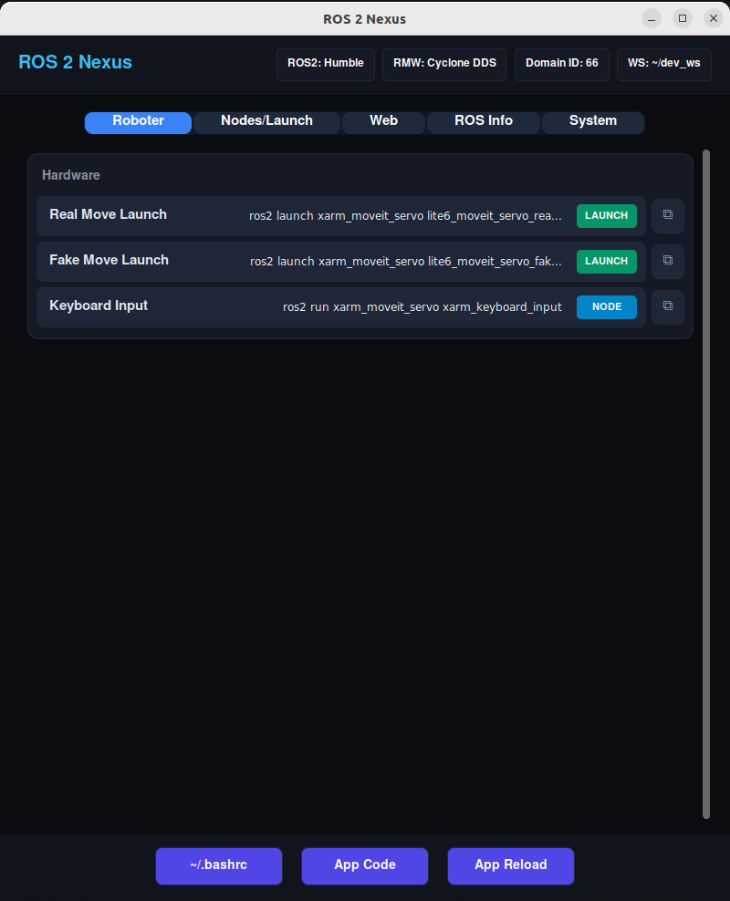
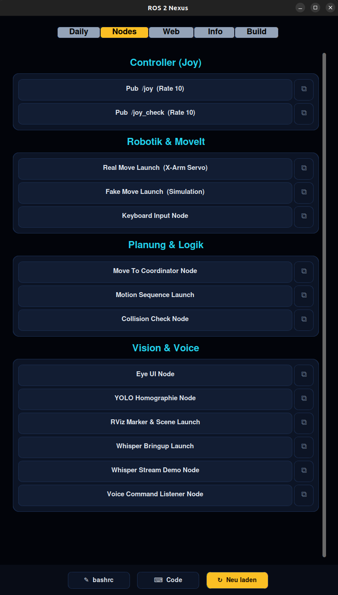

# xArm ROS 2 Extended Workspace (ROS2 Humble) **[IN DEV]**

Dieses Repository ist eine sich kontinuierlich weiterentwickelnde Forschungs- und Evaluationsplattform für multimodale Teleoperation und Mensch-Computer-Interaktion (HCI). <br>
Es baut auf dem offiziellen xarm_ros2 Repository auf: https://github.com/xArm-Developer/xarm_ros2/tree/humble (Branch: humble).

## Inhaltsverzeichnis
1. [📋 Projektübersicht](#1--projektübersicht)
2. [🔬 Architektur & Leitprinzipien](#2--architektur--leitprinzipien)
3. [🚀 Quick Start: ROS 2 Nexus (Das zentrale Launch-Tool)](#3--quick-start-ros-2-nexus-das-zentrale-launch-tool)
4. [📊 Monitoring: Dashboard & Workspace Analyzer](#4--monitoring-dashboard--workspace-analyzer)
5. [🕹️ Multimodale Technologien & Interaktionskonzepte](#5-️-multimodale-technologien--interaktionskonzepte)
6. [⚙️ Core Features & ROS 2 Nodes (Deep Dive)](#6-️-core-features--ros-2-nodes-deep-dive)

---

## 1. 📋 Projektübersicht

**`Konzept:`**
* Eine modulare Plattform zur Steuerung des xArm Lite 6 Roboters durch multimodale Eingabemethoden mit Fokus auf maximale Usability.

**`Motivation (Assistenz und Teilhabe):`**
* Klassische Teleoperation erfordert kognitiv stark beanspruchende Feinsteuerung und schafft hohe technische Barrieren. 
* Dieses Projekt zielt darauf ab, im Sinne von Industrie 5.0 Barrieren abzubauen und Menschen mit unterschiedlichen physischen Voraussetzungen die produktive Teilhabe am Arbeitsplatz zu ermöglichen.

**`Funktionsprinzip:`**
* Das System nutzt einen Shared-Control-Ansatz ("Human-in-the-Loop"). 
* Der Nutzer wechselt nahtlos zwischen intuitiven Befehlen (z. B. Sprache/Blicksteuerung) und präzisen manuellen Korrekturen (Gamepad).

**`Zielsetzung:`**
* Als reproduzierbarer, kosteneffizienter Proof-of-Concept für Forschungs- und Inklusionsprojekte, um assistive Robotiksysteme zu entwickeln und empirisch zu evaluieren.

**`Evaluationslogik & Guidelines:`**
* Entwicklung einer Evaluationslogik für die Interaktionsqualität. 
* Daraus abgeleitete Guidelines sollen Unternehmen (z. B. bei der geplanten Einführung von Robotern) als Leitfaden dienen und die Frage beantworten: "Wie gehen wir vor, um den Anforderungen der Industrie 5.0 gerecht zu werden?". 
* Diese Guidelines können potenziell auch als monetarisierbare Dienstleistung für die Industrie bereitgestellt werden.

---

## 2. 🔬 Architektur & Leitprinzipien

### Human-Centered Automation:
* Nutzer sollen befähigt werden, Systemzustände der Automatisierung jederzeit zu interpretieren und die Intention des technischen Systems zu antizipieren.
* Dies ermöglicht es ihnen, richtige Entscheidungen zu treffen und über die Zeit Vertrauen in das technische System aufzubauen.

### Shared Control & Kognitive Entlastung: 
* Der nahtlose Wechsel zwischen manueller und KI-gestützter Steuerung minimiert die mentale Arbeitsbelastung.

### HCI & Usability Fokus:
* Die Interaktionen verschieben sich von komplexen Low-Level-Steuerungen hin zu intentionsbasierter Aufgabenbewältigung.

### Reproduzierbar & Open Source:
* Transparente Codebasis für standardisierte wissenschaftliche Experimente.

### Kosteneffiziente Hardware: 
* Erschwingliche Komponenten verbessern den Zugang für Inklusions- und Forschungsprojekte.

### Modular & Industrie-Standard:
* Vollständige Integration in ROS 2 Humble für Kompatibilität mit etablierten Frameworks.

---

## 3. 🚀 Quick Start: ROS 2 Nexus (Das zentrale Launch-Tool)

**ROS 2 Nexus** ist das primäre, zentrale Werkzeug dieses Repositories. Es handelt sich um eine webbasierte GUI, die als Hauptzentrale dient, um alle Nodes, Sensoren, Algorithmen und Workspace-Scripte mit nur einem Klick zu starten. Anstatt sich lange CLI-Befehle zu merken und einzutippen, steuerst du das gesamte Robotersystem direkt aus deinem Browser.

### 3.1 Startbefehle & Ubuntu App Integration

**Start über Terminal:**
```bash
cd ~/dev_ws
python3 _exec/ros2_nexus_web.py
# → Öffnet sich unter http://localhost:5000 (auch im LAN erreichbar, z.B. http://192.168.x.x:5000)
```

**Quick Launch (Backend automatisch starten + Browser öffnen):**
```bash
./_exec/ros2_nexus_web_start.sh
```

> **Ubuntu App Integration:** ROS 2 Nexus ist als native Ubuntu-Anwendung über einen `.desktop`-Eintrag registriert. Du kannst einfach im Ubuntu-Aktivitäten-Menü nach **„ROS 2 Nexus"** suchen, um die App direkt über ihr Icon zu starten.

<p align="center">
  
  
</p>

### 3.2 Netzwerk- & Port-Architektur

Um das komplette System mit beiden Web-Oberflächen (Nexus und Dashboard) zu nutzen, laufen im Hintergrund drei verschiedene Server auf drei separaten Ports:

| Port | Service | Typ | Beschreibung |
|------|---------|-----|--------------|
| **`5000`** | **ROS 2 Nexus Web** | Flask Backend | Stellt die grafische Nexus-Oberfläche bereit. Empfängt Klicks aus dem Browser und führt ROS-Shell-Befehle als Unterprozesse auf dem Host-PC aus. |
| **`8080`** | **Dashboard Frontend** | HTTP Server | Hostet die statischen HTML/CSS/JS-Dateien für das ROS2 Core Dashboard. |
| **`9090`** | **ROS Bridge** | WebSocket | Die Brücke zwischen ROS 2 und dem Browser. Erlaubt dem Dashboard (Port 8080), sich über `roslib.js` direkt mit dem ROS-Netzwerk zu verbinden, um Echtzeit-Telemetrie auszulesen und Services aufzurufen. |

---

## 4. 📊 Monitoring: Dashboard & Workspace Analyzer

Sobald du deine Nodes über ROS 2 Nexus gestartet hast, kannst du den Live-Zustand deines Systems über das **ROS2 Core Dashboard** überwachen. Dies ist eine webbasierte Echtzeit-UI, die statische Quellcode-Analysen mit Live-Telemetriedaten des ROS 2 Netzwerks zu einer einheitlichen Monitoring-Oberfläche zusammenführt.

### 4.1 Backend (`workspace_analyzer.py`)
Ein ROS 2 Node, der eine ausführungsfreie, regex-basierte statische Code-Analyse des gesamten `src/`-Verzeichnisses durchführt. Dabei werden Node-Namen, Publisher, Subscriber, Services, Actions und Paketabhängigkeiten extrahiert. Diese strukturierten JSON-Metadaten werden kontinuierlich an `/dashboard/workspace_metadata` publiziert (im 10-Sekunden-Timer-Zyklus). Zusätzlich werden Umgebungsvariablen (ROS Distro, Domain ID, DDS-Middleware, Localhost-Modus) aus `~/.bashrc` ausgelesen und als Live-Status-Badges bereitgestellt.

> **Hinweis zu `workspace_analyzer.py`:** Dies ist **kein** Netzwerk-Server, sondern ein normaler ROS 2 Node. Das Dashboard greift über die ROS Bridge (Port 9090) auf dessen publizierte Topics zu.

### 4.2 Frontend (`dashboard_index.html`)
Verbindet sich über WebSocket (`rosbridge_server` auf Port 9090) mit dem ROS-Netzwerk. Es gleicht statisch analysierte Nodes visuell mit den aktuell laufenden Nodes ab, zeigt Echtzeit-Topic-Frequenzen (Hz) an und ermöglicht die direkte Ausführung von System-Skripten aus der Browser-Oberfläche. Die Sidebar liefert auf einen Blick Statusinformationen wie Verbindungsgesundheit, Roboter-Verfügbarkeit und die aktive ROS 2 Umgebungskonfiguration.


### 4.3 Startbefehle der UI-Komponenten
*Starte diese Komponenten über ROS 2 Nexus oder manuell über das Terminal:*
* **Backend:** `python3 src/websocket/workspace_analyzer.py`
* **Webserver:** `python3 -m http.server 8080 -d src/websocket`
* *(Dashboard erreichbar unter: `http://localhost:8080/dashboard_index.html`)*

---

## 5. 🕹️ Multimodale Technologien & Interaktionskonzepte

### 5.1 Roboter-Steuerungsarten (Inputs)
**Gamepad Teleoperation:** <br> 
* Latenzarme, kontinuierliche Feinsteuerung per Xbox One Elite Series 2 Controller (inkl. haptischem Feedback - Vibration bei Kollisionsgefahr).

**Sprachsteuerung:** <br> 
* Lokale Sprachverarbeitung (Whisper AI) für semantische, intentionsbasierte Steuerung via Mikrofon.

**Eye-Tracking** (in Bearbeitung...): <br> 
* Robotersteuerung und UI-Interaktion (Blickerfassung) über Tobii Pro Glasses 3.

**Gestensteuerung** (in Bearbeitung...): <br> 
* Berührungslose, intuitive Hand- und Fingererkennung zur direkten räumlichen Manipulation und Gestensteuerung über Leap Motion.

**VR-Controller Steuerung** (in Bearbeitung...): <br>
* Immersive, räumliche Teleoperation durch präzises 6DoF-Tracking (Six Degrees of Freedom) und haptisches Feedback mittels Virtual Reality Controllern.

### 5.2 Sensorik & Assistenz (Perception)
**Computer Vision:** <br> 
* Räumliche 2D-Objekterkennung und Lokalisierung mittels *YOLO* (aktuell über PiCameras).
**Stereo Vision (Geplant):** <br>
* Integration echter 3D-Tiefendaten durch eine *ZED Mini (Stereolabs)* Kamera.
**VLA & Video Action Models (Geplant):** <br>
* KI-gestützte Handlungsplanung durch *Vision-Language-Action* Modelle.

### 5.3 Koordinatentransformation & Kalibrierung
**ArUco Marker System:** <br> 
* Im Arbeitsbereich des Roboters platzierte Marker dienen als Referenz für Homographie-Matrizen.
* Ableitung von 3D-Weltkoordinaten für Objekte auf der Arbeitsfläche (Z = 90 mm).
* Präzise Projektion von Eye-Tracking Blickkoordinaten auf die Steuerungs-**UI**, um den Blick in Roboterbefehle zu übersetzen.

### 5.4 User Interfaces (UI/GUI)
Für eine kognitiv entlastende Teleoperation steht dem Nutzer ein zentrales, immersives User Interface zur Verfügung, das alle Systemzustände bündelt.

**Telemetrie & Status:** <br> 
* Kontinuierliche Anzeige von Echtzeit-Telemetriedaten des Roboterarms.
  
**System Feedback & Intent Recognition:** <br>
* Direktes visuelles und akustisches Feedback für manuelle Steuereingaben sowie erfolgreich geparste Sprachbefehle.
  
**Präventive Kollisionswarnungen:** <br> 
* Dynamische Warnungen beim Eingreifen softwareseitiger Kollisionsschutzmaßnahmen (z.B. Unterschreiten des Z-Limits).
  
**Visuelles Monitoring & Objekterkennung:** <br>
* Nahtlose Integration von Video-Livestreams mit Live-Overlays erkannter Zielobjekte (YOLO Bounding Boxes) sowie einer synchronisierten 3D-Visualisierung (Digitaler Zwilling) der Arbeitsumgebung.

**Umsetzung via OBS Studio:**<br>
* In *OBS Studio* werden alle Komponenten gebündelt und dem Nutzer als zentrale GUI für die Roboter-Teleoperation bereitgestellt.*


**Gaze Control User Interface**<br>


---

## 6. ⚙️ Core Features & ROS 2 Nodes (Deep Dive)

### 6.1 👁️ Computer Vision & Perception

* **`yolo_object_detector`**
    * **Zweck:** Objekterkennung und räumliche Lokalisierung (Würfel, Rechteck, Zylinder).
    * **Aufgabe:** Findet trainierte Objekte und ArUco-Marker im 2D-Bildstream; projiziert diese in 3D.
    * **Funktionsweise:** Liest RTSP/HTTP-Streams im Background-Thread. Transformiert YOLO Bounding Boxes via `cv2.findHomography` und ArUco-Markern in den 3D-Raum (Z=90 mm). Publiziert `PoseArray`-Nachrichten unter `/objects/<color>_<shape>/world_poses`.

### 6.2 🗣️ Sprachsteuerung & Interaktion

* **`ros2_whisper`**
    * **Zweck:** Lokale Speech-to-Text Erkennung.
    * **Aufgabe:** Wandelt gesprochene Nutzerbefehle in Text um.
    * **Funktionsweise:** Führt das Whisper-KI-Modell kontinuierlich auf dem Mikrofon-Stream aus und publiziert das reine Transkript als String.
* **`voice_command_listener`**
    * **Zweck:** Interpretation und Filterung des Sprachtextes.
    * **Aufgabe:** Extrahiert Intents (z.B. "fahre zu rot"), blockiert Spam und gibt visuelles Dashboard-Feedback.
    * **Funktionsweise:** Abonniert `/whisper/text`, nutzt Regex-Filter und einen Debounce-Mechanismus (5 Sek. Cooldown im `action_cooldown` Dictionary), um redundante Befehle abzublocken. Publiziert an `/voice_cmd` und `/ui/voice_feedback`.
* **`eye_control`**
    * **Zweck:** Robotersteuerung durch Blickerfassung (**UI** Interaktion).
    * **Aufgabe:** "God-Mode" PyQt5 Benutzeroberfläche für reine Blickeingabe.
    * **Funktionsweise:** Extrahiert JSON Gaze2D-Daten aus dem RTSP Stream. Nutzt ArUco-Marker zur Bildschirm-Erkennung und transformiert Blickkoordinaten in die **UI**. Bei 0,5 Sek. Verweildauer (Dwell-Time) auf einem Button wird ein `TwistStamped`-Befehl publiziert.

### 6.3 🧠 Logik & Koordination

* **`move_to_coordinator`**
    * **Zweck:** Zentrales "Gehirn" für task-basierte Bewegungen im **Shared Control**.
    * **Aufgabe:** Führt Sprach-/Blickbefehle mit Kameradaten zusammen und koordiniert Fahrbefehle.
    * **Funktionsweise:** State-Machine basiert. Queued Intents, sendet den Roboter auf eine Scan-Pose (`WAITING_FOR_ROBOT_IDLE`), blockiert 2,0 Sek. zur Bildstabilisierung, prüft die Aktualität des `PoseArray` und führt den kartesischen Service Call aus.

### 6.4 🦾 Bewegung & Sicherheit

* **`motion_sequence`**
    * **Zweck:** Zustandsverwaltung und failsafe Ausführung von Fahrten.
    * **Aufgabe:** Physische Steuerung und Umschalten von Hardware-Modi.
    * **Funktionsweise:** Stellt Action-Services (z.B. `execute_motion_to_pose`) bereit. Schaltet auf Hardware-Ebene zwischen Servo- und Pose-Mode um. Bei Endeffektor-Höhe < 95 mm wird der Arm vor der Fahrt präventiv auf Z=150 mm angehoben (Kollisionsschutz).
* **`collision_check`**
    * **Zweck:** Hardwareschutz (Verhinderung von Tischkollisionen).
    * **Aufgabe:** Prädiktives Eingreifen vor Kollisionen bei manueller Gamepad-Steuerung.
    * **Funktionsweise:** Filtert `/joy` und `/ufactory/get_position`. Berechnet zukünftige Z-Höhe voraus (`Z_new = Z_current + V_z * 0.1s`). Unter 96,5 mm wird die Joy-Achse auf `0.0` genullt, der Nutzer über die **UI** gewarnt und ein Gamepad-Rumble ausgelöst.
* **`xarm_joystick_input`** *(Teil von `xarm_moveit_servo`)*
    * **Zweck:** Gamepad-Steuerung & Button-Mapping.
    * **Aufgabe:** C++ Node für gefilterte Joy-Signale und ROS Service Calls.
    * **Funktionsweise:** Abonniert das gefilterte `/joy_check`. Glättet Signale exponentiell (`factor = 0.5`). Mappings:
        * **D-Pad:** Geschwindigkeitsstufen (12.5% - 100%).
        * **Start/Back:** Referenzsystem-Umschaltung (Base vs. Endeffektor).
        * **A/B:** Vakuumgreifer-Steuerung.
        * **X:** Asynchroner Whisper AI Trigger.
        * **Y:** Service Call für initiale Pose.

### 6.5 🖥️ UI & Visualisierung

* **`rviz_marker`**
    * **Zweck:** Visuelles Live-Feedback in RViz2.
    * **Aufgabe:** Optische Aufwertung der 3D-Simulation.
    * **Funktionsweise:** Trackt `link_eef` via TF2. Publiziert `MarkerArray` mit Pick-and-Place-Zielen (Würfel, Zylinder) und statische 3D-Meshes (z.B. ZED Kamera) zur Simulation ohne Live-YOLO-Daten.
* **`websocket`** *(Workspace Analyzer Backend)*
    * **Zweck:** Datenquelle für das Web-Dashboard.
    * **Aufgabe:** Überwacht das ROS-Netzwerk und den Quellcode.
    * **Funktionsweise:** `workspace_analyzer.py` nutzt Regex für ausführungsfreie Code-Analyse (`src/`). Überwacht Dateiänderungen und publiziert JSON-Metadaten auf ROS-Topics (z.B. `/dashboard/workspace_metadata`).
* **`rosbridge_server`**
    * **Zweck:** WebSocket Bridge für Web-Browser.
    * **Aufgabe:** Native Kommunikation zwischen Dashboard und Roboter.
    * **Funktionsweise:** Standard-Paket für WebSockets (Port 9090). Erlaubt Webanwendungen, via `roslib.js` direkt mit dem ROS-Netzwerk zu interagieren.
* **`zed_wrapper`**
    * **Zweck:** Hardware-Treiber für Stereolabs ZEDm.
    * **Aufgabe:** Direktes Streaming an RViz2 und Logik-Nodes ohne Drittsoftware.
    * **Funktionsweise:** Nativer C++ Node, der den generischen USB-Cam Node ersetzt. Publiziert `Image` und `CameraInfo` unter `/zed/zed_node/...`.

---
